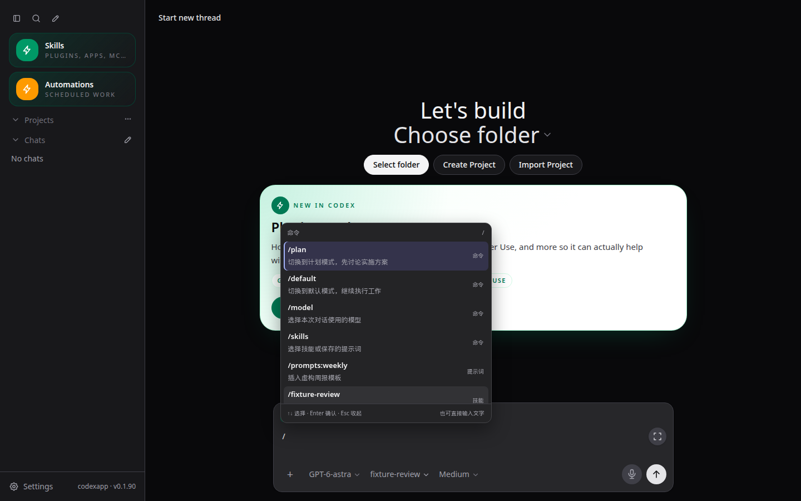
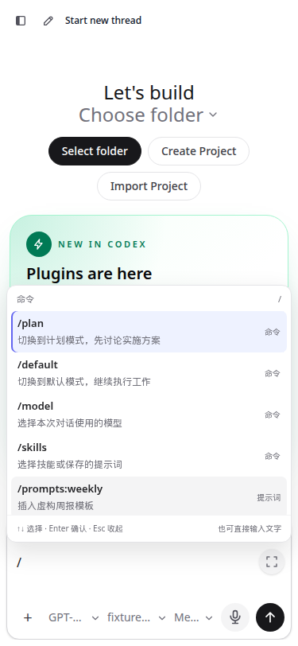
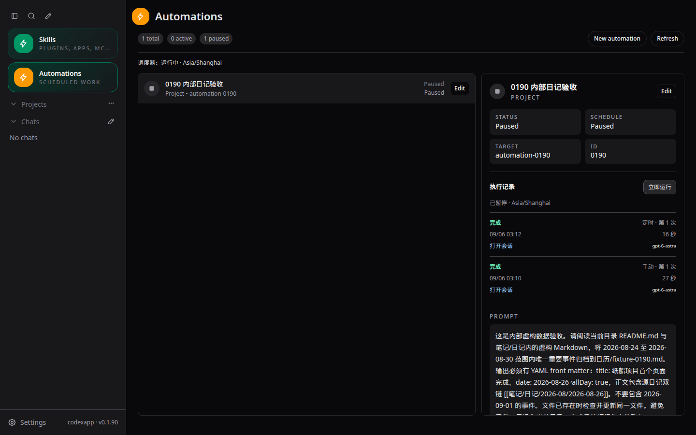

# CodexApp 0.1.90 实施结果与封测交接

> 本文记录首轮候选的历史验收结果。后续封测修订、当前 22 项命令、M/B 预算、执行历史分页与最新发布包，以 [0014 封测反馈修订与命令目录](20260906-0014-codexapp-0.1.90封测反馈修订与命令目录.md) 为准；本文下方旧 release 不再是当前交付包。

## 1. 交付状态

已按确认的 [0011 实施方案](20260906-0011-codexapp-0.1.90实施方案.md) 完成自动化闭环和斜杠命令选择器，候选可访问 **http://192.168.50.46:59001/**。包含可选的轻量执行历史 UI。27 个测试文件、225 项单测、类型检查、构建、打包运行、UI 和内部真实模型验证通过。

稳定服务仍是 **5900 / 0.1.89**，本轮没有切换或重启生产。原“整理日历”任务没有被修改或执行；生产周任务的自然触发和真实日历结果仍需上线后验收。0.2 路线图补入本次测量结果，没有实施 0.2 功能。

| 对象 | 最终状态 |
| --- | --- |
| 源码分支 | `/home/Code/codexapp`，`feature/automation-slash-0.1.90` |
| 稳定生产 | `codexapp.service`，PID 87226，端口 5900，0.1.89；最终检查仍 active |
| 生产 release | `/home/docker/codexapp-releases/codexapp-0.1.89-ec9cb75da351-20260906-013756` |
| 候选容器 | `codexapp-multi-account-dev`，`0.0.0.0:59001` |
| 候选镜像 | `codexapp-multi-account-dev:ui-0.1.90`；ID `c20f6b5245c52af33b601b3529e2028fa22b04b56ff46945547f2cbc011d69e0` |
| CLI / Node | 主机与候选 Codex 0.153.4；主机 Node 24.19.0，候选 Node 22.23.2 |
| 候选认证状态 | 独立 `codexapp-multi-account-dev-home:/codex-home`，沿用候选账号；没有导入生产认证 |
| 业务测试数据 | 新内部 volume `codexapp-0190-test-workspace:/test-workspace/automation-0190`，全部为虚构数据 |
| 外部业务路径 | 未新增 Vault/NAS 挂载；原有 `/home/Code` 开发挂载保留；业务验收只读写内部 fixture |
| 调度器最终状态 | ready=true，draining=false，activeCount=0，queuedCount=0；两项验收定义均 PAUSED |
| 验证服务 | 4173 使用 `/tmp/codexapp-0190-browser-home`；保留运行；5173 未操作 |
| 临时故障容器 | 59011–59014 四个独立容器均已停止，测试 volume 保留 |
| 已准备发布包 | `/home/docker/codexapp-releases/codexapp-0.1.90-1ddfa06948e3-20260906-034856`，尚未激活 |

应用制品对应 `1ddfa06`；之后 `99ac65a` 仅修正仓库交接脚本、其回归测试和测试文档，未改变打包应用。文档提交另计。各项提交均在本地，没有 push。

## 2. 自动化实现

原缺口是定义能保存，但缺少服务端 RRULE 到期调度和可核对的完成状态。本轮新增 `automationDefinition`、`automationSchedule`、`automationStore`、`automationEngine`、`automationRuntime` 模块，接入共享 bridge 生命周期；浏览器不打开也会启动调度。

| 能力 | 已实现行为 |
| --- | --- |
| 定义 | 正式 TOML 解析，多行提示词、数组、未知字段保留，原子写入；multi-cwd 修改不丢其他目标 |
| 调度 | 明确 IANA 时区和下次时间；首次接管只安排未来；停机最多补最近 24 小时内最新一次，合并更早漏跑 |
| 并发 | 同一 CODEX_HOME 单实例租约，含 PID/启动身份校验；自动化全局执行并发 1，同目标待执行队列有界 |
| 执行 | 项目任务创建执行线程；heartbeat 使用目标线程，等待普通队列和忙线程；账号操作与自动化执行互相纳入空闲判断 |
| 去重 | 先持久化领取计划时点；立即运行携带 requestId；同一请求只创建一条记录 |
| 恢复 | 通过 run 标记、threadId、turnId 对账；已完成不重放；提交结果不明时不盲目重发 |
| 错误 | 明确认证、目录、规则、请求拒绝、等待审批、中断等状态；仅明确未提交的临时错误有限重试，最多 3 次 |
| 完成 | 以相应 turn 的成功完成为准；入队或 HTTP 200 不标成功；运行超时默认 60 分钟 |
| 日志 | `$CODEX_HOME/codexapp-automations/state.json` 保存轻量记录；含触发类型、状态、耗时、模型、错误和会话链接，不复制任务提示词或认证内容 |
| 保留与 UI | 每任务最多 100 条或 30 天终态记录，非终态保留；详情每页 20 条，页面打开才刷新，离开停止轮询 |
| 停机交接 | drain 后停止领新计划；异步退出等待状态落盘并释放租约；Vite 热重载不复用已销毁的调度器 |

支持范围明确为：分钟/小时仅 `INTERVAL`，按实际经过时间计算；日/周支持 `INTERVAL`、`BYDAY`、`BYHOUR`、`BYMINUTE`、`WKST`。DST 不存在的本地时点跳过，重复时点仅第一次。其他 RRULE 字段显式拒绝，不静默错算。

依赖固定 `rrule@2.8.1`、`smol-toml@1.8.0`。调度器每秒执行轻量 tick；定义元数据最多每 60 秒校对，没有变更不重复解析全部文件。没有引入外部调度平台。

## 3. 斜杠输入体验

输入 `/` 显示带描述的浮层，继续输入即本地搜索；候选包含 `/plan`、`/default`、`/model`、`/skills`、已保存提示词和可用技能。

- 初始无选中项，悬停也不成为键盘选中项。使用上下方向键后，Enter 才确认命令；未选中时保持原有发送/换行习惯。
- Esc 收起但保留原文；继续输入不会立即重新打扰。URL、路径、日期、代码、粘贴内容按普通文本处理。
- 输入焦点留在 textarea；Shift+Enter、Ctrl+Enter、IME 组合输入按原策略处理。选择命令不自动发送消息。
- 模型/技能二级菜单取消保留原 token；草稿变化后取消旧选择上下文。提示词仅替换光标处 token，保留前后文字；技能附加至本次输入。
- 命令替换支持浏览器原生撤销；最多渲染 12 行候选，浅深主题、展开输入框和窄屏均已检查。选中长技能名时发送按钮仍在视口内。

浏览器自动化采用 Playwright CJS：当前环境没有可调用的 Browser Use 工具，且输入状态模拟、API 拦截需要 Playwright。隔离 UI 用虚构技能/提示词；最终 59001 又以真实打包资源、无路由 stub 验证了输入、搜索、键盘选择、二级菜单取消和斜杠原文，未发送模型请求。

| 实测 URL | 视口 / 主题 | 主要断言 |
| --- | --- | --- |
| `http://127.0.0.1:4173/#/` | 1440×900 浅/深、375×812 浅/深、768×1024 深、1366×600 深 | 输入焦点、无默认选择、搜索、Esc、IME、粘贴、替换范围、附加技能、展开边界；pageerror=0 |
| `http://127.0.0.1:4173/#/thread/01900000-0000-7000-8000-000000000001` | 桌面、两种发送快捷键配置 | TestChat 拦截断言：未选中 `/plan` 按字面发送，hover 不触发选择；不实际发起模型任务 |
| `http://127.0.0.1:4173/#/automations?automationId=0190` | 1440×900 浅/深、375×812 浅、768×1024 深 | 读取候选真实运行记录并映射至隔离页面；两条完成记录、时区、会话链接和刷新恢复正确 |
| `http://127.0.0.1:59001/#/` | 1440×900 浅/深、375×812 深 | 实际候选，无路由替换；模型菜单取消保留 `/model`，未发 turn，pageerror=0 |

以下归档图只含虚构数据。原截图绝对路径依次为 `/home/Code/codexapp/output/playwright/0190-command-1440x900-dark.png`、`/home/Code/codexapp/output/playwright/0190-command-375x812-light.png`、`/home/Code/codexapp/output/playwright/0190-history-1440x900-dark.png`。







其余截图及 JSON 结果在 `/home/Code/codexapp/output/playwright/0190-*.png`、`0190-*-results.json`。没有修改聊天 Markdown/文件链接解析，本次不涉及该类 TestChat 的 href/title/text 回归。

## 4. 内部真实模型端到端验收

使用固定周范围及虚构事件，模型均为 **gpt-6-astra**，候选真实认证实际调用成功。输入放在容器内部的 `笔记/日记/2026-08/` 和 `2026-09/`，输出为 `日历/fixture-0190.md`。

| 触发 | runId | 结果 / 耗时 |
| --- | --- | --- |
| 项目立即运行 | `294cce79-f90a-4776-9fcf-ffb203300ce2` | completed，26.897 秒 |
| 无浏览器自然到期 | `aa2f8c5b-6422-41fe-8218-a16bfb1947c4` | completed，15.554 秒；开始调度比计划时点晚 598 ms |
| 原线程 heartbeat 空周检查 | `b81a1e74-d5a8-43d1-a1c9-b9f7562af0e1` | completed，12.859 秒；原文件不变，没有新建事件 |

实际核对产物：仅 1 个日历文件，title 为“纸船项目首个页面完成”，date 为 `2026-08-26`，allDay 为 true，来源包含 `[[笔记/日记/2026-08/2026-08-26]]`。普通琐事及范围外 9 月 1 日事件未写入。再次定时处理没有生成重复文件；空周范围 `2026-08-10` 至 `2026-08-16` 未写文件，原文件 mtime/ctime 早于 heartbeat 开始。

容器重启后 runId、完成状态及文件保留，没有重放已完成计划。最终退出代码还单独核实租约已释放、重启后 ready=true。两项 fixture 任务均暂停，以免封测期间继续自动消耗额度。

原生产任务 `heartbeat-mnt-nas02-obsidian-obsid` 仍为稳定版保存的周一 01:00 规则。内部测试证明此次实现链路可运行，**不能替代它在真实 Vault 中的自然周执行验收**。上线时间决定下一次未来执行；首次接管不自动补跑历史周次。

## 5. 自动回归、故障与打包

| 检查 | 结果 |
| --- | --- |
| `pnpm run test:unit` | 27 文件、225 项通过；最终日志 `output/automation-0190/final-unit-tests.log` |
| `pnpm exec vue-tsc --noEmit` | 通过 |
| `pnpm run build`；`pnpm pack --pack-destination /tmp` | 前端、CLI、tarball 成功；保留已有大块 warning，见性能部分 |
| CJS CLI | 源码构建、主机 prepared release 和容器的 CJS `require` / `--help` 通过 |
| 原生 PTY | Node 24 prepared release 和 Node 22 候选实际创建 shell 并读到输出；Docker 补齐 python3/make/g++ |
| 调度单测 | 时区/DST、持久化去重、锁竞争与恢复、响应丢失对账、暂停、审批等待、显式错误、有限重试、坏状态拒绝启动 |
| 真实隔离 API | 无效 BYHOUR 被拒绝、损坏 TOML 显示诊断、失效 cwd 为 CWD_UNAVAILABLE、重复 requestId 只有一条记录 |
| 发布脚本 | 临时目录与虚拟 systemctl 下验证激活、回滚、认证不变和认证变化时自动回退；不操作真实生产 |

典型复查命令如下。fixture 和故障用例只能在对应隔离环境运行。

```bash
pnpm run test:unit
pnpm exec vue-tsc --noEmit
pnpm run build
pnpm pack --pack-destination /tmp
node -e "process.argv=['node','codexapp','--help'];require('./dist-cli/index.js')"
bash -n scripts/codexapp-release-switch.sh
pnpm exec vitest run src/cli/codexappReleaseSwitch.test.ts
node output/playwright/verify-0190-ui.cjs
node output/playwright/verify-0190-enter.cjs
node output/playwright/verify-0190-submenus.cjs
node output/playwright/verify-0190-undo.cjs
node output/playwright/verify-0190-history.cjs
node output/playwright/verify-0190-final-candidate.cjs
node output/playwright/verify-0190-auth.cjs
```

打包候选由以下配方生成：

```bash
CODEXAPP_REPLACE_DEV=1 \
CODEXAPP_MULTI_ACCOUNT_IMAGE=codexapp-multi-account-dev:ui-0.1.90 \
bash scripts/run-multi-account-dev.sh
```

该脚本会重建候选，必须先结束候选中的工作。镜像安装的是打包后的应用和 `@openai/codex@0.153.4`，启动参数为 `--port 59001 --strict-port --no-password --no-open`。最后只调整了 Docker 原生编译依赖，认证故障矩阵所测应用运行时代码与最终镜像一致。

| 隔离 localhost 端口 | 认证 / provider 场景 | 实际结果 |
| --- | --- | --- |
| 59011 | 无认证 | Zen / big-pickle 回退，hasCodexAuth=false |
| 59012 | 合法结构的虚构无效 ChatGPT 认证 | 真实请求失败，提示 access token 无法刷新；刷新后错误仍在，浅/深色 duplicate live overlay=0 |
| 59013 | 非法 JSON 认证 | Zen 回退，应用可启动 |
| 59014 | Zen → OpenRouter，虚构测试 key | provider 选择保存，重启后仍为 OpenRouter；没有宣称虚构 key 可完成上游业务 |

59012 还发起了一次隔离自动化，记录为 **failed / AUTH_REQUIRED / attempt=1**，没有循环重试。认证材料始终只在各自测试 volume，日志与归档不含凭据。四个故障容器均已停止。

故障 UI 测试视口 1440×900；截图绝对目录 `/home/Code/codexapp/output/playwright/`，文件为 `0190-invalid-auth-light.png`、`0190-invalid-auth-dark.png`、`0190-provider-59011.png`、`0190-provider-59013.png`、`0190-provider-59014.png`。详细 URL、重载结果、状态计数见 [验证摘要](evidence/0.1.90-verification.json)。

## 6. 性能审查

| 场景 | 测量结果 | 解释 / 边界 |
| --- | --- | --- |
| 1/10/100 任务空闲，真实 10 分钟 | 600328.96 ms；上游 runtimeCalls=0；tick p95 0.092 ms，max 6.071 ms | 3 个隔离引擎共用测试进程；没有空闲轮询线程全文 |
| 同上资源 | 总 CPU user 1.274 s / system 0.252 s；RSS 增量 22.79 MB | 包含三组引擎与测试框架，不能视为单个生产实例净增量；event-loop p99 21.40 ms 的监控分辨率为 20 ms |
| 100 个分钟任务，虚拟 10 分钟 | 真实耗时 331 ms；定义读 100 次、stat 1100 次、目录扫描 11 次；maxActive=1，maxQueued=100 | 可控时钟和虚构 runtime 的突发测试；不是 10 分钟真实模型负载，19 次模拟派发含漏跑合并 |
| 浏览器 100/1000 候选 | 过滤及 DOM 更新 p95 1.3/1.4 ms，逐键 API=0；末次实际渲染 8 行，上限 12 | 100 条冷启动 max 54.1 ms，1000 条 max 17.5 ms；p95 达标，不声称所有帧都低于 16 ms |
| 4173 首屏 7 秒有效采样 | 19.8 KB API；列表=1、skills=1、rateLimits=2、provider-models=2、prompts=2 | 仍存在重复获取；warnings 为 quota 重复及模型目录约 1004 ms，列入 0.2.0 |
| 59001 内部真实线程 | 64.8 KB API；resume=1、全文 read=0、列表=1、skills=1，warnings=[] | resume 1159.2 ms、quota 1134 ms；不是长线程性能结论 |
| 构建体积 | 主 JS 535209 → 545658 bytes，增加 10449 bytes；主 gzip 169.26 KB | 自动化历史懒加载块 12.06 KB / gzip 4.64 KB；主块仍超过 500 KB warning |

实际执行的性能入口：

```bash
node scripts/profile-automations.cjs
node output/playwright/profile-0190-composer.cjs
PROFILE_BASE_URL=http://127.0.0.1:4173 PROFILE_WAIT_MS=7000 pnpm run profile:browser
PROFILE_BASE_URL=http://127.0.0.1:59001 \
PROFILE_ROUTE='#/thread/01a072fa-7633-7170-8d4b-15d4559c125a' \
PROFILE_WAIT_MS=7000 pnpm run profile:browser
```

原始数据：`output/playwright/automation-0190-performance.json`、`0190-automation-burst.json`、`0190-composer-performance.json`。两份 profiler 分别为 `browser-runtime-profile-home-2026-09-05T19-42-15-790Z` 和 `browser-runtime-profile-thread-01a072fa-7633-7170-8d4b-15d4559c125a-2026-09-05T19-43-31-254Z`，同目录包含 JSON、PNG、trace.zip。两者均正常启动，有真实 API 流量，没有卡在 Loading threads。

[归档验证摘要](evidence/0.1.90-verification.json) 保留 duplicateCounts、warnings、totalApiKB、apiSummary（工具实际字段名）和 slowestApiRows；完整 trace 和页面正文不复制到 Git/Vault。搜索无逐键请求，自动化日志分页且关闭停止刷新；本轮没有证明或宣称整个应用所有重复请求都已消除。

## 7. 发布与回滚交接

`prepare` 已完成并核实 readiness marker、0.1.90 package.json、CLI help 及原生 PTY。release 路径见第一节，`latest-prepared` 指向该目录。

最终只读 `check latest` 正确报告 `activeTurns=1, queued=0, pendingApprovals=0` 并返回 **3**，因为当前开发 turn 尚在运行。这是空闲保护生效，不能写成“已确认可立即切换”。没有调用真实 `activate` 或 `rollback`。

交接脚本另修复了旧版兼容：0.1.89 的未知 API 会返回 SPA HTML 200，现通过运行中 ExecStart 对应的 package.json 判断是否确为旧版；0.1.90 接口坏掉仍拒绝，不允许用环境标记跳过检查。只读 check 不 drain；真正切换先 drain，异常退出恢复调度。

用户封测通过、结束当前 turn 并关闭 5900/59001 页面后，在独立主机终端按既有 SOP 操作：

```bash
cd /home/Code/codexapp
scripts/codexapp-release-switch.sh check latest
scripts/codexapp-release-switch.sh activate latest --confirm-idle
scripts/codexapp-release-switch.sh status
```

还需人工确认没有独立主机 CLI 任务。激活脚本会停止候选，切换生产到 prepared release；保留生产认证和账号池，不导入测试状态。打开 5900 后核对版本、现有账号与项目，再查看原整理日历任务的 Asia/Shanghai 下一次执行时间。原任务自然完成后检查真实 Markdown 日历的日期、重要性筛选、来源和重复情况。

需要回退时同样结束工作、关闭页面，在独立终端执行：

```bash
/home/Code/codexapp/scripts/codexapp-release-switch.sh rollback --confirm-idle
```

回退保留当时最新生产认证，不以旧 Token 覆盖合法刷新。稳定代码/镜像另有 `stable/ui-0.1.89-ec9cb75`、`codexapp-multi-account-dev:stable-0.1.89` 和旧退出容器 `codexapp-multi-account-dev-stable-0.1.89`。回到 0.1.89 后应用不具备新调度器，不能继续期待后台计划触发；已有运行历史和业务文件应保留。

## 8. 封测重点与限制

1. 在日常输入中检查 `/` 是否打扰、方向键/Enter 是否符合习惯，取消模型或技能选择后原文是否保留；桌面原生撤销已测，物理手机和真实中文输入法仍需用户体验验收。
2. 原生产周任务和真实 Vault 写入未在 59001 验证，按用户要求保持内部数据边界；上线后单独验收。
3. “完成”表示模型回合成功结束，业务质量以实际文件核对为准。任意外部副作用不能靠调度器承诺绝对仅一次；不确定运行应先查看会话和文件再手动重试。
4. 暂停、补跑窗口、支持的 RRULE 子集和默认 60 分钟运行超时是本版约束。长任务如需更长超时，应在具体场景下调整并补验收。
5. 真实等待审批/提交响应丢失等破坏性场景通过可控 runtime 测试；没有为了故障注入中断真实生产请求。高负载突发采用虚拟时钟，实时间隔验收使用一项任务。
6. 0.2 的动态模型能力、异步提问、长线程、搜索、队列和手机体验规划见 [0012 路线图](20260906-0012-codexapp-0.2系列代码审查与开发路线图.md)，各小版本另行实施。

项目手工验收入口已更新：`tests/automations/durable-scheduler-and-execution-history.md`、`tests/chat-composer-rendering/nonintrusive-slash-command-picker.md`、`tests/auth-docker-runtime/codexapp-two-phase-release-switch.md`。`tests.md` 继续仅作索引。

## 9. 后续对话交接

候选已经可以封测，不要再次从“缺少调度器”的历史基线重新开发。当前任务剩余的人工环节是用户使用验收、独立终端激活及上线后原周任务检查。先重新检查当前分支、工作区、生产 ExecStart、59001 容器和 latest-prepared，再做任何切换。所有测试认证、fixture 及生产状态保持各自隔离；不要删除 volume、旧 release 或认证快照作为常规清理。

本文件、0011 的实施状态、0012 的测量补充、三张安全截图与验证 JSON 均同步至真实 Vault 的 `开发/codexapp/`；副本内容以哈希核对。
