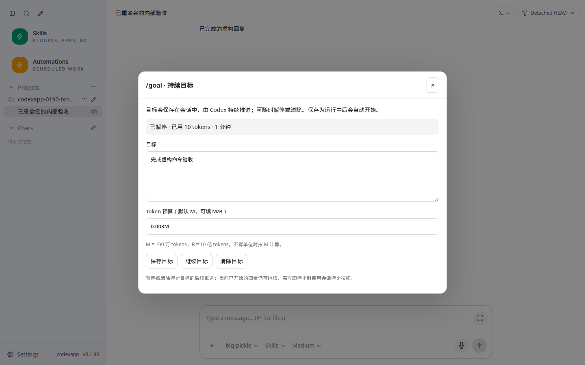
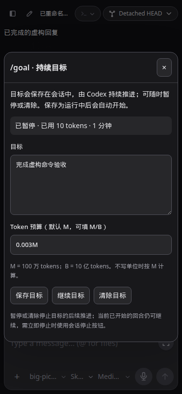
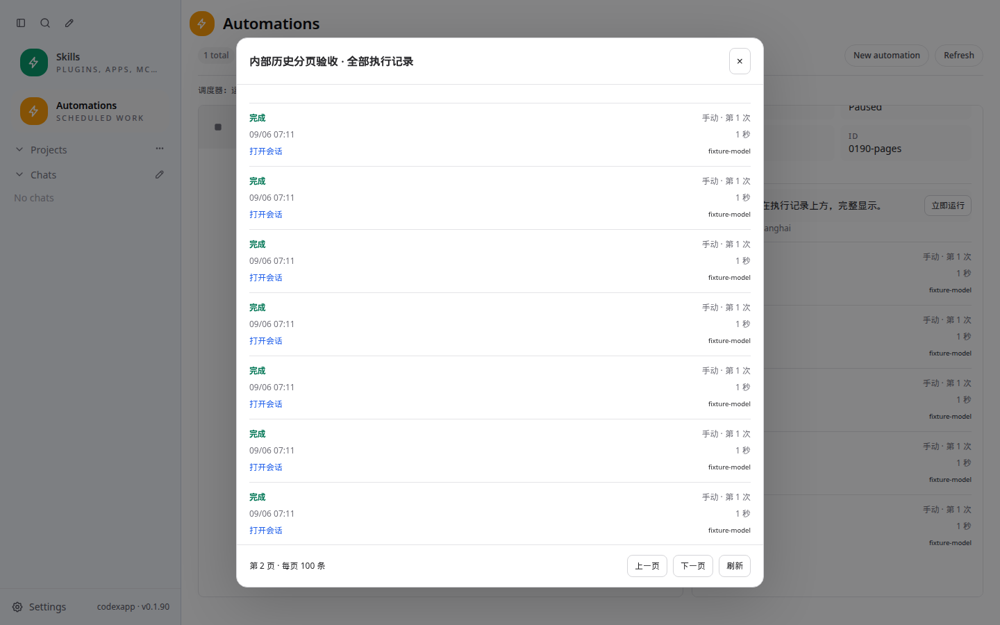
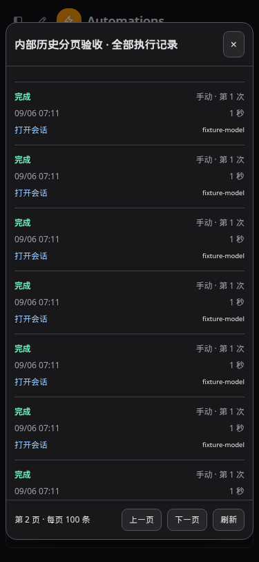

# CodexApp 0.1.90 封测反馈修订与命令目录

## 1. 当前交付

人工封测提出的历史位置与分页、命令目录、忙碌消息队列，以及后续补充的 Goal 预算单位均已实现。候选地址为 **http://192.168.50.46:59001/**。本报告接续 [0013 首轮实施结果](20260906-0013-codexapp-0.1.90实施结果与封测交接.md)，以这里的候选镜像与发布包为当前交付依据。

| 对象 | 状态 |
| --- | --- |
| 应用代码 | `feature/automation-slash-0.1.90`，功能提交 `0327c0e`；文档提交另计 |
| 候选 | `codexapp-multi-account-dev`，0.1.90，端口 59001 |
| 镜像 | `codexapp-multi-account-dev:ui-0.1.90`，`sha256:c05b1c9807f55b2c36785faa42c162edd0a457ac444564b3cf3e65658a8d1f3c` |
| 候选运行时 | Codex CLI 0.153.4，Node 22.23.2；独立 `codexapp-multi-account-dev-home:/codex-home` |
| 内部模型验收 | `/test-workspace/automation-0190`，全部虚构任务；未新增 Vault/NAS 业务挂载 |
| 稳定生产 | 5900 / 0.1.89，`codexapp.service` active，PID 87226；未重启或切换 |
| 当前已准备发布包 | `/home/docker/codexapp-releases/codexapp-0.1.90-0327c0e2e6fa-20260906-100329`，未激活 |
| 最终清理 | 候选普通活跃线程、排队消息、活跃自动化均为 0；测试 Goal 已清除；两项原内部自动化保持暂停 |
| 验证基础设施 | 4173 保持运行；5173 未操作；59011–59014 四个临时故障容器已停止 |

本轮使用 `document-locator` 归档文档，使用 OpenAI Docs 和本机 CLI schema 核对命令能力；实际业务任务仍只在候选内部验证。原生产“整理日记到日历”没有被重放，真实日历结果与自然周任务触发仍属于上线后的业务验收。

## 2. 自动化执行历史

提示词在上，执行记录在下；详情最多展示最近 **5** 条。点击“查看全部”打开独立弹窗，内容区可以滚动，底部固定上一页、下一页和刷新；每页 **100** 条，末页显示剩余记录。翻页后回到顶部，弹窗刷新回到第一页，普通预览刷新不会把正在阅读的历史页跳回首页。

为使“全部历史”有实际意义，终态记录改为长期归档。原调度状态中的最近 100 条/30 天热记录规则保留，退出热状态前先写入归档，避免调度状态随历史无限增大。归档目录为 `$CODEX_HOME/codexapp-automations/history/`，幂等索引为 `history-keys/`；不复制提示词或认证内容。旧版本已经删除的记录无法通过本次更新恢复。

分页游标同时包含创建时间与 runId，同一毫秒创建的记录不会跨页遗漏或重复。查询只读取当前页的记录内容，磁盘读取并发最多 8。归档记录仍支持原请求去重与重试关联。弹窗有焦点约束、Esc 关闭和焦点恢复，沿用模态背景拖选保护。

主要实现：`automationHistory.ts`、`automationEngine.ts`、`automationGateway.ts`、`AutomationRunHistory.vue`、`AutomationRunList.vue`、`AppDialog.vue`。人工操作清单位于 `tests/automations/` 的相关文档。

## 3. 当前命令目录

内置命令共 **22** 项，并自动加入可用技能和保存的提示词。每项提供用途说明；既有本地搜索、无默认选中、方向键选择、Esc 收起、允许斜杠原文和中文输入法行为保留。

| 命令 | 实际操作 |
| --- | --- |
| `/plan` | 切换计划模式 |
| `/default` | 切换默认执行模式 |
| `/model` | 打开模型选择 |
| `/skills` | 选择技能或保存的提示词 |
| `/goal` | 原生持久目标：创建、查看用量、编辑、暂停/继续、清除 |
| `/compact` | 请求 Codex 原生压缩当前会话上下文 |
| `/new` | 在当前项目开始新会话，保留原会话 |
| `/rename` | 重命名当前会话 |
| `/fork` | 从当前会话创建独立分支 |
| `/review` | 发起原生审查，目标为工作区未提交变更 |
| `/diff` | 打开工作区差异和审阅面板 |
| `/status` | 显示模型、推理强度、运行状态、目录和上下文用量 |
| `/copy` | 复制最近一条已完成的助手回复 |
| `/resume` | 打开已有会话的搜索入口 |
| `/apps` | 查看应用连接与可用工具 |
| `/plugins` | 浏览和管理插件 |
| `/mcp` | 打开含 MCP 服务、工具和连接状态的目录页 |
| `/automations` | 打开自动化任务面板 |
| `/export` | 下载当前已加载会话内容的 Markdown |
| `/help` | 查看完整内置目录和键盘操作说明 |
| `/mention` | 进入现有文件搜索与附加流程 |
| `/init` | 准备 AGENTS.md 初始化指令草稿，用户发送后执行 |

命令元数据统一在 `composerCommands.ts` 维护，避免不同界面各自保留一套名单。`/goal` 与 `/compact` 打开时检查运行时方法目录，不支持时给出明确原因；不会把这些字符串伪装成普通聊天请求。需要已有会话的操作会说明条件，压缩、审查与分支操作在当前任务忙碌时不可执行。新会话的 Goal 先创建原生线程并保存目标，再进入线程页面。

目录按当前 WebUI 的实际可用能力筛选。终端退出、桌面专属控制不加入；`/init` 是可检查的草稿入口，`/export` 明确导出范围，`/mcp` 复用已有管理入口。[官方 CLI 命令说明](https://learn.chatgpt.com/docs/cli/slash-commands)

## 4. Goal 预算单位与执行语义

底层 `tokenBudget` 是实际 token 数。界面按用户要求默认以 **M（百万）** 输入，也接受显式 **M/B**，大小写均可；B 为十亿。未填写表示不设预算，未自动填入一个数值。

| 输入 | 保存的 tokenBudget | 含义 |
| --- | --- | --- |
| `1` 或 `1M` | 1000000 | 100 万 tokens |
| `1.5M` | 1500000 | 150 万 tokens |
| `0.01B` | 10000000 | 1000 万 tokens |
| `2b` | 2000000000 | 20 亿 tokens |
| `0.003M` | 3000 | 3000 tokens |
| 留空 | null | 不设预算 |

换算采用精确十进制处理，拒绝非正数、换算后不足一个完整 token 或超出安全整数的预算。重新打开会把底层值格式化为 M/B；例如 3000 回显为 `0.003M`，不会被重新解释成 3000M。

原生 Goal 保存为运行中会自动开始推进；保存暂停目标保持暂停。继续/暂停只更新状态，不重写目标或清空用量。修改目标内容会重置原生目标用量，界面会提示。暂停或清除停止后续目标推进，当前已经开始的回合需用会话停止按钮中止。状态来自原生 `thread/goal/get/set/clear` 与相应通知。[官方 app-server 协议说明](https://learn.chatgpt.com/docs/app-server)

## 5. 忙碌时发送与引导

最终语义以用户第二次澄清为准：

1. 任务忙碌时，正常发送进入可见队列，等待当前任务结束。
2. 队列中的消息可以取消。
3. 点击编辑后回到输入框；修改并重新发送仍然排队，保留原队列位置。
4. 只有明确点击“引导”，才立即将该消息送入当前任务。
5. 引导一次不改变后续发送习惯，下一条普通消息仍然排队。

检查发现原代码存在全局/会话模式选择，可能使新输入直接 steer，因此本次固定正常忙碌输入走 queue，并忽略旧 localStorage 中保存的 steer 偏好；全局设置与输入框附加菜单中的发送方式选项均移除。显式 queue 在请求路由中优先于隐式回答等待问题，避免用户要排队的普通文本被问题回答逻辑截获。

相关人工清单：`tests/chat-composer-rendering/queue-mode-is-default-for-in-progress-messages.md`。网络结果不明时的队列重试、对账等原有可靠性债务继续保留在 0.2.3，未将本轮正常路径验收描述为全部故障场景已解决。

## 6. 验证与性能审查

### 自动检查

- `pnpm run test:unit`：**29 文件 / 232 项通过**。新增覆盖历史游标与同时间记录、归档重载/缓存失效、跨归档请求去重与重试，以及预算换算、原生 RPC 与已完成回复选择。
- `pnpm run build`：类型检查、Vite 与 CLI 构建通过；打包与候选镜像安装成功。
- CJS CLI：`node -e "process.argv=['node','codexapp','--help'];require('./dist-cli/index.js')"`，退出 0。
- 发布包原生 PTY：从当前 release 的 `node_modules/node-pty` 通过 `require()` 加载，启动 `/bin/sh -c 'printf PTY_0190_FEEDBACK_OK'`，收到匹配输出且退出 0。
- 实际归档 HTTP：在独立 59013 测试容器写入 207 条虚构归档文件，预览返回 5，分页 100 / 100 / 7，207 个唯一 runId；测试归档已清理。

### 内部真实模型验证

59001 会话 `01a07474-d3d2-7e00-88f0-c386b0e2e160` 仅使用内部目录。通过真实界面将 `0.02M` 保存为 20000，原生目标自动执行并进入 complete；重新打开预算正确回显。随后原生压缩产生 `contextCompaction`，任务结束；再让第一条内部任务等待 12 秒，第二条消息在 UI 显示排队，并在第一条结束后自动发送和完成。pageerror=0，目标已清除，线程空闲。

### 浏览器与主题

当前环境没有可调用的 Browser Use；Playwright CJS 用于真实 DOM 检查以及虚构 API 拦截。4173 的服务器来自当前工作目录。测试区分 mock UI 交互与 59001 原生执行，不以 mock 结果代替模型完成证据。

| URL | 视口 / 主题 | 断言与截图 |
| --- | --- | --- |
| `http://127.0.0.1:4173/#/thread/01900000-0000-7000-8000-000000000003` | 1440×900 浅/深、375×812 浅/深、768×1024 深 | 22 项目录；Goal 生命周期；压缩/命名/审查 RPC；复制、导出、路由、分支、新会话与草稿；无脚本错误。`0190-command-goal-<视口>-<主题>.png` |
| `http://127.0.0.1:4173/#/automations?automationId=0190-pages` | 1440×900 浅/深、375×812 浅/深、768×1024 深 | 5 条预览，100/100/7 分页，首末页按钮，滚动归位，Esc 与窄屏边界。`0190-history-pages-<视口>-<主题>.png` |
| `http://127.0.0.1:4173/#/thread/01900000-0000-7000-8000-000000000002` | 1440×900 | 旧 steer 偏好被忽略；编辑仍排队；显式引导立即发出；取消和后续排队正确。`0190-feedback-queue.png` |
| `http://127.0.0.1:4173/#/` | 1440×900 浅/深 | 全局及输入框附加菜单均移除模式选择。`0190-settings-light.png`、`0190-settings-dark.png` |
| `http://127.0.0.1:59001/#/thread/01a07474-d3d2-7e00-88f0-c386b0e2e160` | 1440×900 深 | 真实原生 Goal、压缩、任务完成后排队派发；`0190-real-goal-dark.png` |

截图绝对目录：`/home/Code/codexapp/output/playwright/`。上述 Goal 与历史截图在最后操作后等待 2.3 秒保存；目视检查浅色表面与深色表面、文本可读性及窄屏边界。原斜杠行为另在 1366×600 深色和上述视口重新回归；无默认选择、连续输入、IME、斜杠原文、模型菜单取消、技能附加、展开布局均通过。

以下四图为仅含虚构数据的归档副本：

### 打包认证回归

四个容器均安装本次 tarball，使用独立测试 CODEX_HOME，无生产凭据。先等待 CLI 安装和 HTTP 就绪，再执行验证；初次在启动未完成时的连接关闭已在就绪后重试，不计作成功检查。

| 端口 | 配置 | 验证结果 |
| --- | --- | --- |
| 59011 | 无认证 | Zen fallback；界面可用 |
| 59012 | 合成无效 ChatGPT 认证 | 新发起回合失败；浅/深主题刷新后仍显示登录失效原因；重复 live overlay 为 0 |
| 59013 | 畸形认证文件 | Zen fallback；界面可用；独立归档分页 HTTP 验证通过 |
| 59014 | 无认证；Zen → OpenRouter，虚构测试 key | 供应商切换成功，刷新后仍为 OpenRouter；未宣称虚构 key 能完成上游聊天 |

故障线程为 `01a07475-c4ea-7e41-ab41-75fdb447b64e`。截图为上述绝对目录中的 `0190-invalid-auth-light.png`、`0190-invalid-auth-dark.png` 和 `0190-provider-59011/59013/59014.png`，对应 1440×900。执行命令为 `node output/automation-0190/start-invalid.cjs`、`node output/playwright/verify-0190-auth.cjs`；供应商通过 `/codex-api/free-mode/custom-provider` 设置，并在页面刷新后读状态确认。

### 性能结果与剩余边界

| 检查 | 实测 / 代码路径结论 |
| --- | --- |
| 1 万条真实归档 | 一次归档约 4.01 秒；冷预览 6.68 ms；热预览 P95 0.22 ms；100 条分页两页平均耗时的 30 次样本 P95 3.67 ms |
| 历史读取成本 | 冷启动仅列文件名并排序，缓存文件名；每页最多 100 条正文，并发 8；不会每页加载全部历史正文。文件名缓存与磁盘空间会随长期历史增长 |
| 命令搜索 | 100 / 1000 个技能时 P95 2.4 / 2.6 ms；逐键 API 0；本次渲染 8 项、上限 12。单次最大 54.2 / 19.8 ms，不能声称完全无长帧 |
| 4173 首页 | thread/list=1、skills/list=1；API 共 19.9 KB；rateLimits=2、provider-models=2，重复请求债务仍在 |
| 59001 内部短线程 | resume=1、全文 read=0、thread/list=1；API 64.1 KB，profiler warnings 为空；不能替代长会话压力测试 |
| 构建 | 主 JS 550.56 KB / gzip 172.04 KB；Goal/命令弹窗为懒加载块 8.19 KB / gzip 3.74 KB；主块大于 500 KB 的既有构建提示仍存在 |
| 显式操作 | `/copy` 一次读取完整线程后选最近已完成回复；仅点击执行时发生，长线程成本待 0.2 分页优化。预算解析输入限制 50 字符，未引入网络请求 |
| 缓存与刷新 | 历史归档写入更新文件名缓存并校验修订；界面只在可见时刷新预览；完整历史弹窗只在打开/翻页/刷新时请求；命令能力查询仅在打开对应弹窗发生 |

Profiler 命令：`PROFILE_BASE_URL=http://127.0.0.1:4173 PROFILE_WAIT_MS=7000 PROFILE_BROWSER_EXECUTABLE=/snap/bin/chromium pnpm run profile:browser`。线程检查改用 59001 和上述内部线程的 `PROFILE_ROUTE`。报告与 trace 在 `output/playwright/`，有效启动、页面可见状态与 API 流量均已确认。摘要归档在 [封测修订证据](evidence/0.1.90-feedback-verification.json)。

## 7. 交接与回退

本地功能提交依次为 `ed93b87`（历史归档/分页）、`0e41c16`（固定排队与显式引导）、`0f6f982`（22 项命令）、`0327c0e`（M/B 预算）。已更新对应人工测试文档；没有 push。

候选更新命令：`CODEXAPP_REPLACE_DEV=1 CODEXAPP_MULTI_ACCOUNT_IMAGE=codexapp-multi-account-dev:ui-0.1.90 bash scripts/run-multi-account-dev.sh`。更新前核对普通活跃线程、队列和待审批均为 0，再由脚本 drain 自动化，保留候选卷。`bash scripts/codexapp-release-switch.sh prepare` 已成功准备上表的精确路径。

`check latest` 当前退出 3：`activeTurns=1|queued=0|pendingApprovals=0`，原因是生产仍有当前开发会话；没有执行 activate。人工封测完成后，按既有独立终端切换 SOP，重新检查空闲并使用本文的精确 release 路径。稳定 0.1.89 release 和候选稳定镜像继续保留；回退程序沿用既有脚本，不覆盖认证和业务数据，也不删除新增历史归档。

[0.2 路线图](20260906-0012-codexapp-0.2系列代码审查与开发路线图.md) 已同步修订：Goal 基础管理、M/B 预算、压缩入口和固定队列语义属于 0.1.90 已交付基线；0.2.4 改为常驻进展、复杂状态、子任务用量与完整压缩反馈，其他优化顺序保留。
