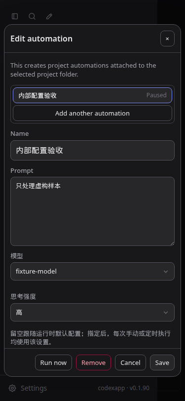
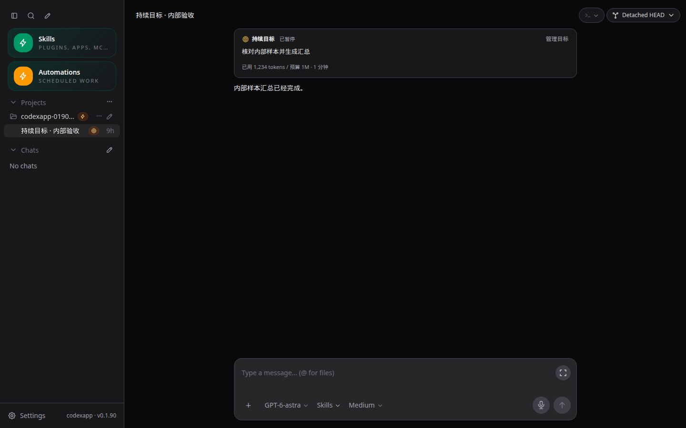
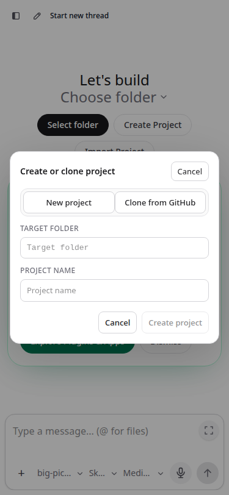

# CodexApp 0.1.90 目标入口与自动化封测修订

> 后续小范围组件重构和当前 59001 候选见 [0016 UI 组件与代码风格约定](20260906-0016-codexapp-UI组件与代码风格约定.md)。本文的 prepared 包作为历史产物保留，不包含 0016 的组件重构；正式切换前需重新 prepare。

## 1. 当前交付

候选地址：**http://192.168.50.46:59001/**。接续 [0014 命令目录与执行历史修订](20260906-0014-codexapp-0.1.90封测反馈修订与命令目录.md)。本轮补齐持续目标入口与可见状态、自动化模型配置和时间表达，并统一弹窗视觉。

| 对象 | 当前状态 |
| --- | --- |
| 分支 | `feature/automation-slash-0.1.90`，仅本地提交 |
| 功能/视觉提交 | `662b6b5` 定位；`5cd7843` 自动化；`5e70796` Goal；`0e4b1d9` 弹窗 |
| 镜像构建修订 | `fc9dbe6`，分开安装应用与固定版本 CLI，并执行 `codex --version` |
| 候选容器 | `codexapp-multi-account-dev`，59001，Codex CLI 0.153.4，Node 22.23.2 |
| 候选镜像 | `codexapp-multi-account-dev:ui-0.1.90`，`sha256:53d3c9e63062532ddea3abec3cc36d3b404fac1d695b27999baf6d902f7cd65d` |
| 状态隔离 | 独立 `codexapp-multi-account-dev-home:/codex-home`；内部验收目录 `/test-workspace/automation-0190` |
| 已准备发布包 | `/home/docker/codexapp-releases/codexapp-0.1.90-0e4b1d9de445-20260906-105326`；未激活 |
| 稳定生产 | 5900 / 0.1.89；`codexapp.service` active，PID 87226；没有重启或切换 |
| 测试清理 | 普通活跃任务、队列、待审批、自动化执行均为 0；本轮临时自动化删除、Goal 清除；原两项内部自动化保持暂停 |
| 验证基础设施 | 4173 保留运行；5173 未操作；59011–59014 故障测试容器已停止 |

新版 release 与当前源码构建的 `dist` 27 个文件、`dist-cli` 2 个文件逐字节一致；59001 实际返回的首页与 JS/CSS 也一致。镜像构建的后续提交只改变 CLI 安装检查，不改变上述应用产物。

## 2. 持续目标：入口、对话和标记

- 输入框左下角 **＋ → 持续目标** 打开管理窗口，保留原草稿；原 `/goal` 命令继续可用。
- 会话顶部增加目标卡片：目标内容、状态、已用 Token、预算、用时和“管理目标”。卡片是原生 Goal 状态的显式展示，不伪造一条用户消息，也不额外发送一轮聊天。
- 从新会话首页创建 Goal 时，会生成会话并命名为“持续目标 · 目标摘要”，便于在侧栏找到。
- 侧栏使用与闪电标记相同的边框和尺寸，内部为靶心图标；悬停显示目标状态。已有目标（包括暂停、完成）均保留标记，清除目标后移除卡片和标记。
- 原生通知即时更新状态；刷新后重新读取。已验证真实模型完成、原生状态为 `complete`、刷新后显示“已完成”，以及清除后的卡片/标记消失。

预算规则维持：纯数字默认 **M**，支持大小写 M/B；`1` = 1,000,000 tokens，`1.5M` = 1,500,000，`0.01B` = 10,000,000；留空表示不设置预算。

## 3. 为什么自动化线程的闪电标记不一致

当前闪电标记代表“这里绑定了自动化定义”，不是所有执行来源的历史标签。

| 定义类型 | 标记位置 | 自动或手动执行时的线程策略 |
| --- | --- | --- |
| 会话心跳自动化（heartbeat） | 绑定的会话行 | 复用该会话，延续上下文；忙碌、普通消息排队或有待审批时等待 |
| 项目定时自动化（cron） | 项目行 | 每次执行为每个目标目录创建新线程；运行线程本身未绑定定义，通常没有线程级闪电 |

暂停的定义仍与对象绑定，因此标记可以继续存在；多个定义按原逻辑显示数量。点“Run now”不会把项目任务改成复用线程。显式重试仍遵循对应类型：项目任务建立新运行/线程，会话任务复用目标线程。

服务重启后的不确定运行则先核对已记录的 threadId/turnId，恢复执行状态，不盲目重放。多个目录分别排队，目前自动化并发上限为 1。本轮保留上述闪电含义，只为 Goal 增加同风格独立标记。

## 4. 自动化模型、思考强度与时间

### 4.1 模型配置

编辑自动化时可以搜索选择模型，并单独选择思考强度。使用应用自定义菜单，没有引入浏览器原生下拉框。留空跟随运行时默认；指定后，手动和定时执行都应用该配置。

模型和强度写入自动化 TOML 的 `model` / `model_reasoning_effort`；时区写入 `timezone`。更新时省略字段保留原值，显式清空移除覆盖值。旧配置和未知 TOML 字段保持兼容。执行记录显示实际模型和强度，方便核对。

对于新建线程与复用线程，模型在已有创建/恢复流程中传递，思考强度随 turn 参数传入；同时更新现有 collaborationMode 的 settings，避免后者覆盖选择结果。没有增加新的执行 RPC。

真实内部执行已验证 `gpt-6-astra` + `low`：运行记录、原生线程参数一致，模型正常完成回复。

### 4.2 时间问题的原因

旧提示把 UTC ISO 字符串（尾部 Z）与 `Asia/Shanghai` 并列，例如 UTC 17:00 对应本地次日 01:00。日期边界处容易把 UTC 日期当成本地日期；手动执行也被笼统标成“计划时间”。这属于发送给模型的时间表达问题，不能据此断言服务器时钟或原调度计算错误。

现在明确显示已转换的本地时间及偏移，例如：

> 2026-09-07 01:00:00 +08:00（Asia/Shanghai）

同时区分“手动请求时间”“计划触发时间”“本次重试请求时间”和“实际开始时间”。相对日期按本次参考时间及其时区解释，并明确已经转换过，不要再按 UTC 转换。新建自动化线程标题也使用本地时间；旧线程标题作为历史记录保留。

验证包括 Asia/Shanghai 跨日、夏令时偏移单元测试，以及真实手动任务输出当前本地日期 `2026-09-06`、时区和 `+08:00`。没有重放生产的“整理日记到日历”业务，也没有新增 Vault/NAS 业务挂载。

## 5. 弹窗视觉和展开输入框

目标、自动化、重命名、删除、历史记录，以及已有项目/文件夹/导出/登录回调模态窗口统一背景、边框、圆角、表单和按钮样式，以目标窗口为参照：16px 窗口圆角、8px 控件圆角、普通描边按钮；Remove/删除为红色文字和边框。浅深主题共享颜色变量，深色表面使用 `#18181b`、表单使用 `#27272a`。

自动化、重命名、删除窗口复用 AppDialog。自动化内容区独立滚动，底部操作区固定，窄屏可以访问所有配置；右上角关闭、Esc、背景点击及焦点恢复由共用组件处理。项目和文件夹窗口保留原流程布局，共用视觉规则。

展开输入框的横向偏移来自 `contain: layout` 创建的定位包含块：菜单使用视口坐标，却位于被包含的内容区内，额外叠加了横向偏移。菜单现在 Teleport 到 body，按视口定位并避开边缘；外部点击检测兼容传送后的菜单。菜单层级高于模态窗口，自动化内的模型/强度菜单也可以正常点击。

## 6. 验证与性能

### 6.1 自动化验证

- `pnpm run test:unit`：**31 个文件，237 项测试通过**。新增配置/时间/执行参数 3 项，Goal 批量读取和并发通知竞态 2 项。
- `pnpm run build`：Vue 类型检查、前端和 CLI 构建通过；CLI bundle 约 633.44 KB。
- CJS：`node -e "process.argv=['node','codexapp','--help'];require('./dist-cli/index.js')"`，退出 0。
- 发布包原生 PTY：`require('<release>/node_modules/node-pty')` 启动 `/bin/sh -c 'printf PTY_0190_FOLLOWUP_OK'`，收到匹配输出且退出 0。
- 镜像：`docker build -t codexapp-multi-account-dev:ui-0.1.90 -f scripts/docker-multi-account-dev.Dockerfile .`；全新镜像 `docker run --rm --entrypoint codex codexapp-multi-account-dev:ui-0.1.90 --version` 输出 `codex-cli 0.153.4`。首次检查发现 npm 可选平台依赖漏装；拆分安装并增加版本检查后，新容器启动不再临时下载 CLI。
- 59011 无认证、59013 损坏认证：Zen 回退；59012 无效认证：错误在刷新后保留、重复 live overlay 数量为 0；59014 Zen 切换 OpenRouter 后配置刷新保留。全部使用隔离虚构凭据，仅验证配置与失败行为，不声称完成真实 OpenRouter 推理。
- 59001 实际 Goal 和自动化测试均只访问内部测试目录；测试脚本初次把“不使用工具”和“调用工具标记完成”写成冲突条件，修正提示后已成功，不把初次超时当成产品通过证据。

### 6.2 可见界面验证

本环境没有可调用的 Browser Use；使用 Playwright CJS 做实际 DOM 断言，并通过请求拦截注入虚构线程/配置。目标 URL 为 `http://127.0.0.1:4173/` 的线程及自动化路由；真实 Goal 验证另用 `http://127.0.0.1:59001/`。

覆盖 1440×900 浅/深色、375×812 浅/深色、768×1024 深色：目标入口、卡片、可见侧栏标记、刷新恢复、清除；自动化模型/强度保存与重新加载；展开菜单定位和选择；项目/文件夹窗口按钮及表面样式。22 项命令目录与 Goal/compact、历史预览 5 条和 100/100/7 条分页均回归通过。重命名 Enter 保存与删除取消使用虚构线程验证。导出和登录回调采用共用 CSS 代码检查，本轮未触发真实导出或登录。

截图原件目录：`/home/Code/codexapp/output/playwright/`。以下均为虚构测试界面或裁切的内部 Goal 卡片；名称与上述绝对目录合并即为原始绝对路径。

自动化，375×812，深色，模型/强度保存后；Remove 红色、固定底部可见：

目标卡片，1440×900，深色，入口/侧栏/状态验证：

项目窗口，375×812，浅色，按钮圆角/边框及视口内布局验证：

真实 Goal 完成后刷新，1440×900 深色页面中裁切卡片：

### 6.3 性能审查

本机 CLI 0.153.4 的原生接口没有 goal/list，线程列表也不携带 Goal。因此新增 `/codex-api/thread-goals` 批量入口：每批最多 100 个 ID，后台原生 goal/get 全局并发 4，缓存上限 2000、有效期 30 秒（包括无目标结果），原生通知更新/失效缓存。失败批次等全部请求结算后再放行下一批，通知修订号避免旧响应覆盖新状态。前端延迟 150ms 合并首次查询，不轮询，不阻塞 thread/list/resume，不读取完整历史、JSONL 或 SQLite。

这减少 HTTP 往返，但冷缓存仍需每个线程一次原生 Goal 读取；不能声称原生 N 次读取已消除。12 个内部线程样本两次批量读取约 **6.3ms / 2.1ms**。浏览器实际加载线程测得目标查询 **1 次、8.5ms、0.8KB**；thread/list=1、resume=1、read=0、无重复历史读取，warnings=[]，API 总量约 72KB。账户额度请求约 1.1 秒，是该样本最慢请求，留给 0.2 启动治理。

命令输入在 100/1000 技能下每键 API=0，p95 约 **1.6/2.2ms**，最多渲染 12 行；展开菜单开关 API=0。模型配置复用既有 RPC；时间格式器缓存最多 64 个时区；视觉修改为 CSS/已有布局读数，不引入新网络请求或无界列表。上述是本机小样本测量，不代表大规模线程或长时间压力结果。

性能原件：`output/playwright/browser-runtime-profile-thread-01a074a7-6a0b-7b80-8bdd-4e6bd473a2f1-2026-09-06T02-59-19-238Z.json` 与同名 trace zip；精简安全证据见 [本轮验收数据](evidence/0.1.90-goal-automation-verification.json)。

## 7. 交接与后续

继续在 59001 人工封测。本轮仍保留 0014 的忙碌消息规则：普通发送排队，编辑后仍排队，只有手动“引导”立即发送；历史 5/100 和 22 项命令目录不变。

发布包只执行 prepare/check。最终 `bash scripts/codexapp-release-switch.sh check latest` 返回 `activeTurns=1|queued=0|pendingApprovals=0`，退出 3，因为生产当前对话仍活跃；没有执行 activate。未来切换需要重新核对真实空闲状态。生产稳定 release 仍为 `codexapp-0.1.89-ec9cb75da351-20260906-013756`。

若候选需回退，先确认 59001 活跃任务、队列、审批和自动化都为 0，再停止该候选容器，使用前一轮镜像 `sha256:c05b1c9807f55b2c36785faa42c162edd0a457ac444564b3cf3e65658a8d1f3c` 与相同独立卷/端口重建。新增 TOML 字段为兼容扩展；不删除状态卷，不操作生产服务或 `/root/.codex`。

[0.2 路线图](20260906-0012-codexapp-0.2系列代码审查与开发路线图.md) 已同步：基本 Goal 卡片与侧栏入口提前在 0.1.90 交付；0.2.4 继续完善阻塞原因、预算边界、复杂恢复、子任务用量与压缩反馈。
