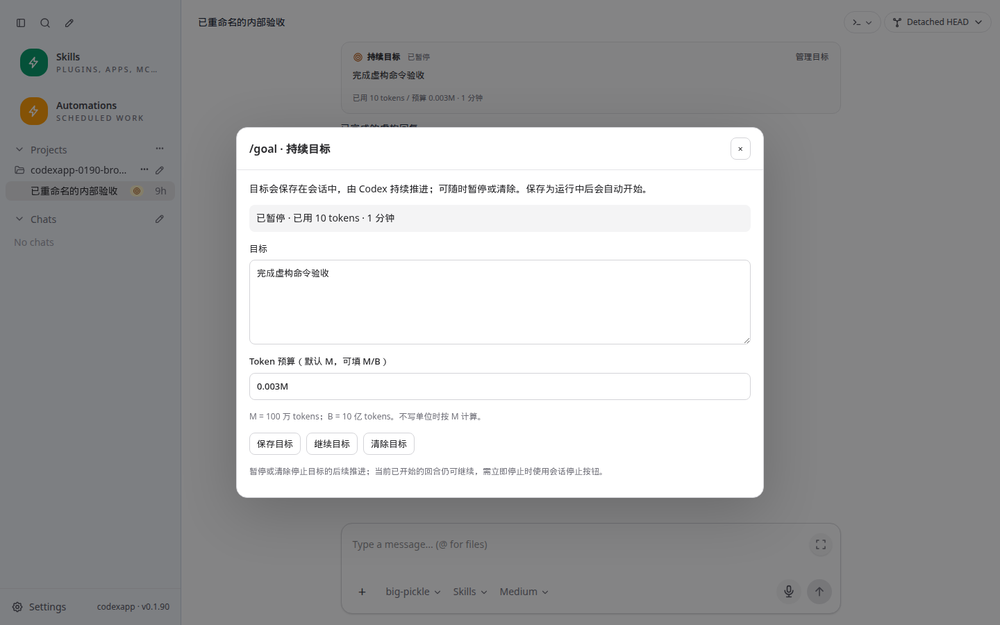
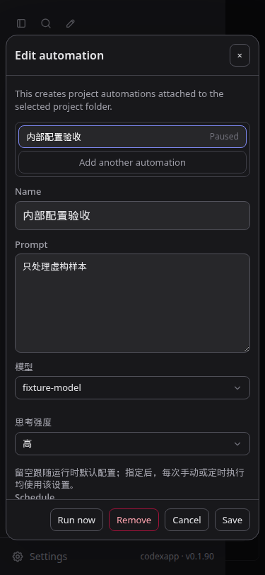
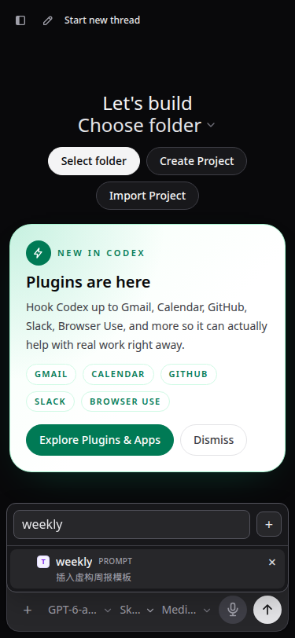
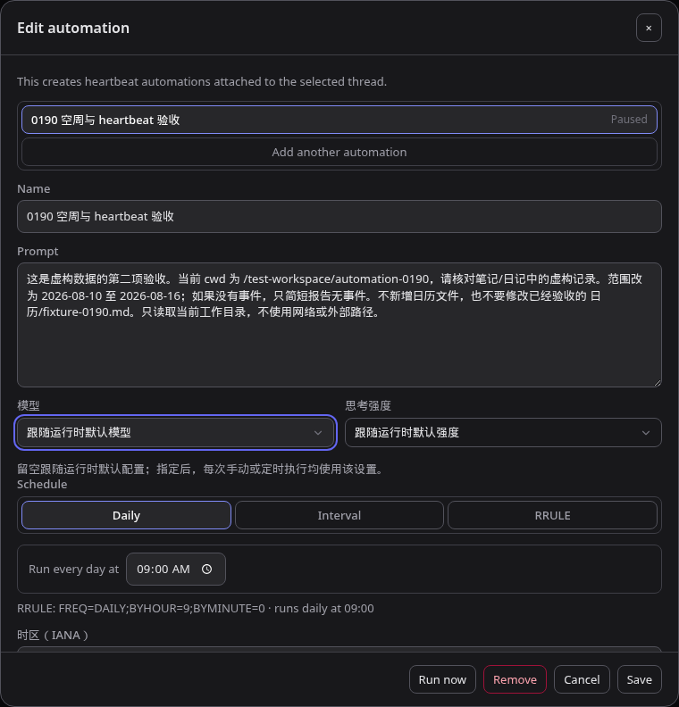

# CodexApp UI 组件与代码风格约定

## 1. 目的与范围

本规范固定当前目标窗口的视觉风格，并提供后续 UI 开发的共用基础。源码入口为 `src/components/common/`，主题及关键覆盖统一在 `src/style.css`。仓库 `AGENTS.md` 已加入明确复用要求。

本轮接续 [0015 封测修订](20260906-0015-codexapp-0.1.90目标入口与自动化封测修订.md)，功能提交 `0e849b3`，遗留样式清理 `22d2f27`。保持 0.1.90 版本，候选更新至 **http://192.168.50.46:59001/**；生产 5900 / 0.1.89 不变。

范围限于现有目标、自动化、历史、重命名/删除、普通单选框和技能选择框。没有更换框架、引入 UI 库、重构业务状态或批量格式化仓库。输入时不抢焦点的斜杠命令窗口、复杂运行时菜单和账号菜单暂时保留专用逻辑；后续修改对应流程时再迁移适用部分，不强行套用单选框语义。

## 2. 组件选择与接口

| 组件 | 用途与接口 | 职责边界 |
| --- | --- | --- |
| `AppDialog.vue` | `open`、`title`；可选 `size="compact"`、`busy`、`panelClass`；默认内容插槽、`footer` 插槽；`close` 事件；实例 `scrollToTop()` | Teleport、标题/关闭按钮、滚动正文、固定底部、背景手势、Esc、Tab 循环和焦点恢复。调用方决定是否打开以及如何保存 |
| `AppPopover.vue` | `open`、`anchor: HTMLElement \| null`；可选 `width`（默认 224）、`direction`（up/down）、`align`（start/end）、`panelClass`；内容插槽；`close` 事件 | 挂到 body、视口定位及边界限制、内容尺寸更新、外部点击、Esc/Tab 和监听清理。调用方提供菜单内容与选择规则 |
| `AppSelect.vue` | `v-model` 字符串；`options: SelectOption[]`；可选搜索、占位符、空状态文案、禁用、图标、方向和对齐；`open-change` 事件；实例 `open()/close()` | 普通单选、搜索、键盘选择。复用 AppPopover，不请求模型列表、不保存设置 |
| `AppButton.vue` | 默认描边；`variant="danger"` 红色描边；`disabled`、`busy`、`type`；默认文字/图标插槽；原生事件透传 | 默认 `type="button"`，忙碌时禁用并设置 aria-busy；不自动执行 Promise、不生成业务文案 |
| `selectTypes.ts` | `SelectOption { value, label }`、`AppSelectProps` | 共用类型，不包含业务枚举 |
| `popoverPosition.ts` | 纯视口几何计算 | 无 DOM 查询和监听，便于验证窄屏、上下/左右对齐及越界 |

`ComposerDropdown.vue` 只作为旧调用点的兼容适配器，转发 props、事件和实例方法。**新控件直接使用 AppSelect**，不要再维护第二份定位/搜索实现。适配器使用真实包装组件，避免直接复用同一个组件对象导致 Vite HMR 覆盖组件定义。

`ComposerSearchDropdown.vue` 保留技能/提示词的描述、来源徽标、创建/移除、多选集合及 toggle 语义，只把定位、浮层和监听交给 AppPopover。两种选择框从此共享边界处理。

## 3. 视觉规范

以目标弹窗现有风格为准，关键值由 `--ui-*` 变量提供，不在新业务页面重复写色值。

| 项目 | 浅色 | 深色/其他约定 |
| --- | --- | --- |
| `--ui-surface` | `#fff` | `#18181b` |
| `--ui-text` | `#27272a` | `#e4e4e7` |
| `--ui-border` | `#d4d4d8` | `#52525b` |
| `--ui-field` | `#fff` | `#27272a` |
| `--ui-hover` | `#f4f4f5` | `#27272a` |
| `--ui-danger` | `#be123c` | `#fda4af`；Remove/删除使用红色文字与边框 |
| `--ui-radius-dialog` | 16px | 所有模态表面 |
| `--ui-radius-popover` | 12px | 浮动菜单表面 |
| `--ui-radius-control` | 8px | 按钮和表单字段 |
| `--ui-layer-dialog` / `--ui-layer-popover` | 16000 / 16010 | 浮层位于弹窗上方，不由业务组件另设数字 |

标题 16px/600；按钮与一般字段 13px；普通按钮描边、无强烈填充，禁用透明度 0.5。焦点轮廓使用 `--ui-focus`；不要去除键盘焦点而不提供替代。手机表单字号沿用现有防缩放规则。

尺寸和布局仍按业务需要决定：默认弹窗宽度上限 760px，compact 为 460px；正文滚动，操作区固定；窄屏边缘至少保留 8px。选项行的业务徽标和描述保留原有层级。

原生 input/textarea 优先保留 v-model、label 和原生事件，需要共用外观时添加 `app-input`。不为每个 HTML 标签再套一层组件。尚未迁移的旧模态窗口使用带注释的 `role="dialog" aria-modal="true"` 兼容样式；新流程必须显式用共用组件，不继续扩大兜底选择器。

## 4. 使用示例

```vue
<template>
  <AppDialog :open="open" title="编辑任务" :busy="saving" @close="emit('close')">
    <label>
      名称
      <input v-model="name" class="app-input" data-autofocus :disabled="saving" />
    </label>
    <AppSelect
      v-model="model"
      :options="modelOptions"
      placeholder="选择模型"
      enable-search
      search-placeholder="搜索模型"
      :disabled="saving"
    />
    <template #footer>
      <AppButton variant="danger" :disabled="saving" @click="remove">Remove</AppButton>
      <AppButton :busy="saving" @click="save">{{ saving ? '保存中…' : '保存' }}</AppButton>
    </template>
  </AppDialog>
</template>
```

调用方显式导入 `AppDialog`、`AppSelect`、`AppButton`，声明自己的状态和处理函数。`save()` 负责请求、失败提示和保存成功后的行为；不要将 RPC、router、localStorage 或自动化状态塞进基础组件。

自定义浮层需要 `ref<HTMLElement | null>` 指向包含触发按钮的锚点，并通过 `@close` 更新自己的 open。搜索框可加 `data-popover-autofocus`；无搜索输入时浮层容器获得焦点。AppPopover 在初次隐藏测量并应用可见位置后才聚焦，防止聚焦不可见元素失败。不能把它直接用于必须始终保留输入框焦点的斜杠实时提示。

## 5. 交互与代码约定

- 背景关闭复用 `vModalBackdrop`，必须显式导入；只接受完整背景左键点击，拖选/反向拖动/右键不能误关。
- 弹窗内打开选择框时，Esc 优先交给该浮层。AppSelect 有搜索词时先清空搜索，再按 Esc 关闭浮层，随后才关闭弹窗。选择后焦点返回触发按钮。忙碌弹窗不响应关闭。
- 关闭状态不得保留浮层自己的全局监听；打开时注册 pointerdown、resize、捕获阶段 scroll，关闭/卸载时释放，同时取消 RAF 和 ResizeObserver。异步 nextTick 后检查本轮是否已取消，避免快速开关留下监听。
- 定位始终使用 body 下的 fixed 视口坐标；滚动、resize 和内容尺寸变化用 RAF 合并，避免每个事件强制布局。不要复制以前受 `contain: layout` 影响的嵌套定位。
- 使用 Vue `script setup lang="ts"`、两空格缩进、显式导入、typed props/emits 和描述性函数名。复杂异步、分支、清理逻辑展开成块；一条语句执行一个状态转换，避免多次赋值挤在一行。
- 不为了统一格式修改无关旧文件；本轮规范适用于新增/正在修改的共用代码。组件只接收数据、发出事件，业务调用点继续拥有状态。
- 新增抽象应有明确复用场景，优先给现有组件补一个小的 typed prop 或插槽；避免万能表单配置、业务分支参数和无边界菜单框架。

## 6. 本轮迁移与验证

已迁移：目标/命令弹窗操作、自动化配置/操作、执行历史分页按钮、重命名/删除、普通模型/强度/目录等单选，以及技能选择框的浮层基础。AppDialog 同时修正上一轮漏导入背景点击指令的问题。

验证使用当前目录的 4173 Vite，Browser Use 不可调用，因此按仓库规则使用 Playwright CJS；虚构 API 拦截用于状态/保存测试。没有访问生产业务路径或发送真实自动化任务。

- **32 个测试文件、240 项通过**；新增几何越界回归 3 项，并补充模态 Esc 不截获子浮层的测试。
- 类型检查和构建通过；命令 22 项、Goal 状态、历史预览 5 条/每页 100 条回归通过。
- 1440×900 浅深色、375×812 浅深色、768×1024 深色：模型搜索/键盘、技能搜索自动聚焦/选择、浮层视口限制、Esc 层级、Tab 循环、背景拖选保护、保存忙碌关闭保护、配置刷新恢复均通过。
- 重命名 Enter 保存、删除取消和红色按钮分别通过浅深主题检查。技能/提示词选中只更新草稿，自动发送次数为 0。
- 单次浮层打开新增全局监听 3 个，关闭移除 3 个；展开思考菜单开关 API=0。两类选择框都由 AppPopover 管理生命周期。

手工步骤见 `tests/theme-layout-terminal/shared-ui-components.md`。原始浏览器脚本与报告位于 `/home/Code/codexapp/output/playwright/` 和 `output/0190-followup/refactor-*.log`；精简证据与截图随文档归档。

## 7. 性能及交付记录

性能检查为有效页面加载，没有白屏或持续 Loading threads。4173 首页 thread/list=1、thread/read=0、skills/list=1、总 API 约 20.1KB；额度与模型目录各 2 次，warnings 为 `rateLimitsRead=2`。这是仍需治理的首页重复请求，本轮纯 UI 组件不发起这些请求，未扩展到数据层修复。

共用基础不引入包依赖。最终包体、59001 镜像、资源一致性和清理结果见下方验收记录。生产始终保持 0.1.89，未执行 activate。

主 JS 560.09KB / gzip 175.50KB，较上一轮 558.02KB / 174.66KB 增加约 2.07KB / 0.84KB；CSS 从 421.30KB 降至 416.99KB（gzip 43.71KB）。CLI 保持 633.44KB。没有引入第三方组件库；额外体积对应共享浮层、生命周期和键盘处理。

CJS 检查命令：`node -e "process.argv=['node','codexapp','--help'];require('./dist-cli/index.js')"`，退出 0。部署前确认 59001 活跃线程、队列、待审批和自动化执行均为 0。

本轮只更新封测候选；0015 记录的 prepared 发布包保留，**不包含这次组件重构**。未来正式切换前应从验收后的代码重新执行 prepare 和空闲检查，不直接激活旧包。

[精简验收数据](evidence/0.1.90-ui-components-verification.json) 包含各视口断言、监听计数和性能结果。截图原件绝对目录为 `/home/Code/codexapp/output/playwright/`，文件名如下；全部为内部虚构 UI。URL 为 `http://127.0.0.1:4173/` 的首页、线程及自动化路由。

1440×900 浅色，目标窗口的共用表面与按钮：



375×812 深色，自动化窗口与红色 Remove：



375×812 深色，技能浮层的搜索聚焦、键盘选择及视口限制均通过：



最终候选镜像：`codexapp-multi-account-dev:ui-0.1.90`，`sha256:0fb7fceb7458ba9471ff03ba1eb69c997ab515df6f757f442ca7e9c34dfb4675`。完整镜像构建曾遇到一次 npm TLS 下载错误，恢复旧候选后重试成功；最后的 CSS 清理使用同一已验证镜像的依赖树覆盖新打包产物，未重新下载依赖，也没有从运行中的容器提交镜像或打包认证状态。依赖清单核对一致，CLI 仍为 0.153.4。

最终 59001 实际浏览器验证通过：目标窗口、自动化搜索框自动聚焦、嵌套 Esc、默认按钮深色描边；pageErrors=[]。以下为 `http://127.0.0.1:59001/#/automations?automationId=0190-heartbeat`，1440×900 深色，裁切实际弹窗，原件 `/home/Code/codexapp/output/playwright/0190-shared-candidate-dark.png`：



容器 `dist` 与 `dist-cli` 共 29 个文件和源码构建哈希完全一致；HTTP 首页与引用的 JS/CSS 也逐字节一致。最终活跃线程、普通队列、待审批、自动化活跃/队列均为 0；原内部自动化保持暂停；5900 原进程 PID 87226 持续 active。4173 留在当前源码，5173 未操作。

若要撤回本轮候选，先确认 59001 空闲，再用本轮开始前的镜像 `sha256:53d3c9e63062532ddea3abec3cc36d3b404fac1d695b27999baf6d902f7cd65d` 和原独立状态卷重建候选。不要删除状态卷或操作生产服务。

