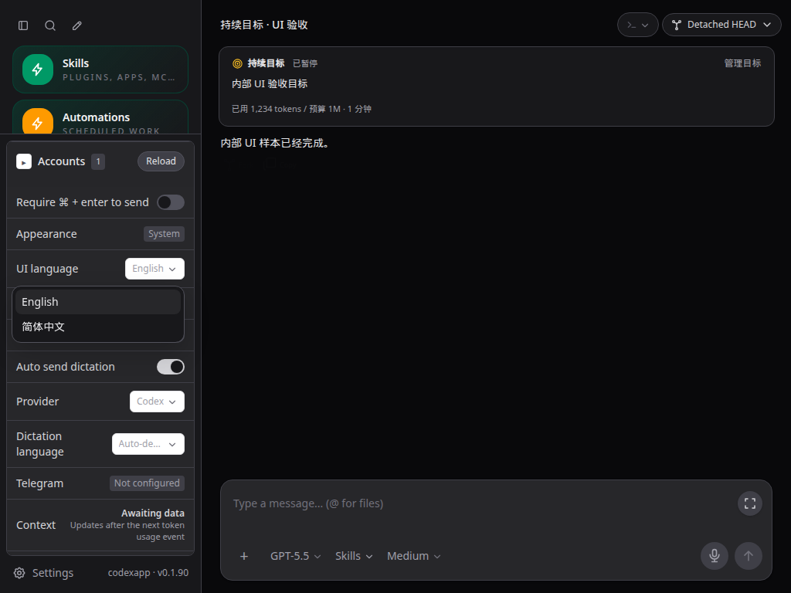
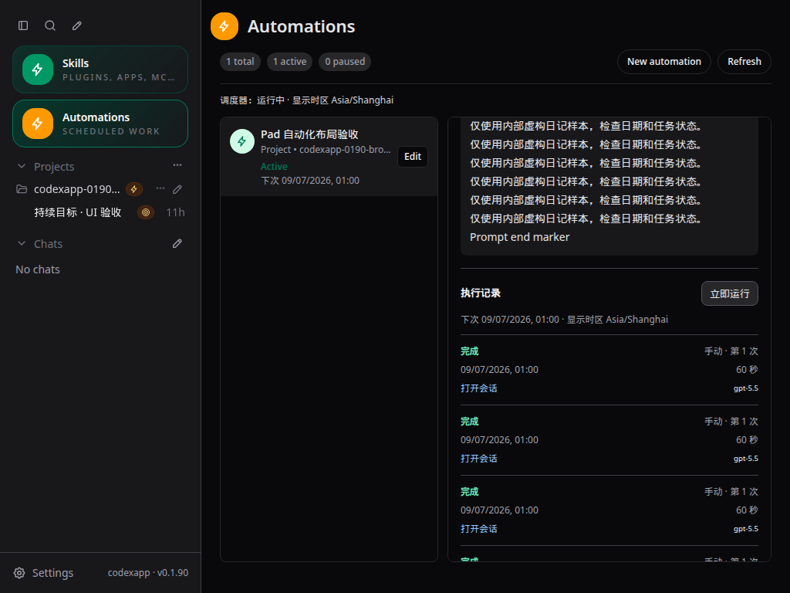
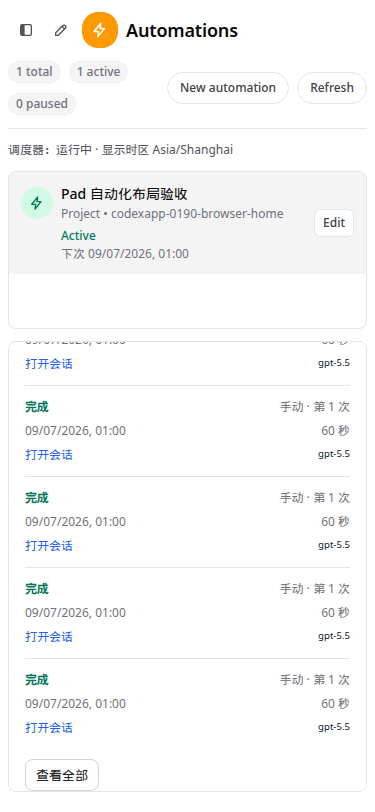
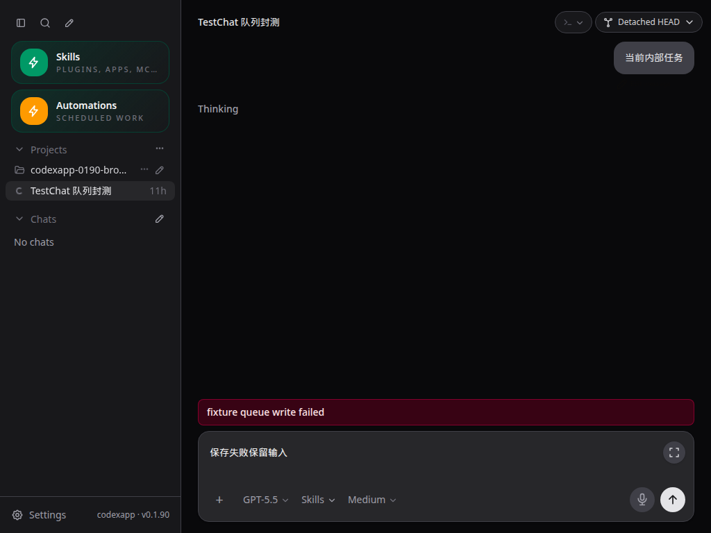

# CodexApp 0.1.90 封测收尾与 Pad 修复交接

> 本文保留前一轮交接事实。后续 WebKit、低高度 Git 菜单、控件主题和 PWA 修复已完成；当前封测包、59001 源码及本地基线以 [0019 最终验收](20260906-0019-codexapp-0.1.90最终验收与0.2开发基线.md) 为准，勿直接使用本文历史包作为最终版本。

## 1. 当前结果

0.1.90 已完成 0017 审查建议的封测前收尾，并修复后来发现的 Pad 详情重叠、下拉框点击失效和队列错误提示不可见。候选地址为 `http://192.168.50.46:59001/`，可刷新后继续人工封测。

| 项目 | 当前值 |
| --- | --- |
| 源码 | `feature/automation-slash-0.1.90`，运行源码提交 `c58e70e9bc6c` |
| 候选镜像 | `sha256:2bb195581d7931ddfc7f5b73e038bfeb0add351c1493ae05c5074ce5c7083412` |
| 原生 CLI | 0.153.4 |
| 稳定服务 | 5900，0.1.89，PID 87226；未切换、未重启 |
| 隔离边界 | 候选使用独立 `/codex-home` volume；内部任务只使用 `/test-workspace/automation-0190` |
| 代码提交 | 已本地提交；没有 push 或 merge |

所有时间控件以浏览器本地时区显示，无法识别时回退 `Asia/Shanghai`。自动化编辑器的新任务默认浏览器时区，服务端未指定时区时默认 `Asia/Shanghai`。已保存任务的调度时区仍决定何时运行，并在界面中单独标注；它不会随着查看者的浏览器时区而悄悄改变。持久化时间继续使用时间戳/ISO，任意用户或模型正文中的时间文本不做机械改写。

## 2. 修复内容

| 问题 | 最终行为与原因 |
| --- | --- |
| R01：账号刷新清空队列 | 停止/重启轮询保留已保存队列，不再按局部线程列表裁剪队列。 |
| R02：整份覆盖丢消息或复活出队项 | 改为按消息 ID 的 add/remove/move；服务端串行修改最新状态。旧 PUT 返回 409，过期排序/引导拒绝并提示，不覆盖其他页面的内容。 |
| 排队交互 | 忙碌时发送默认排队；编辑后仍排队；明确点击引导才立即发送；取消须确认服务端移除。保存完成前保留草稿，期间继续编辑不会被旧请求清空。 |
| 错误可见性 | 队列保存/编辑/取消/排序/引导错误显示在所属会话输入区上方；成功重试清除，不带入其他会话。 |
| R03：候选提前停机 | 构建与镜像完成后才 drain 并检查任务、队列、审批和分页线程状态；旧容器保留到新实例健康。切换失败恢复旧容器；首页和 scheduler ready 同时作为健康条件。 |
| R04：自动化来源缺失 | 新运行携带结构化任务名、ID、执行时间；历史归一化保留来源标签和本地时间，隐藏内部信封。兼容旧 heartbeat 和之前的 0.1.90 消息。 |
| Pad 提示词与历史重叠 | Flex 曾把长提示词区域压小而内容继续溢出。详情内容块禁止收缩，由整个详情容器滚动；预览仍最多 5 条，全部历史每页固定 100 条。 |
| Pad 下拉选项点击后直接消失 | 共用浮层通过 Teleport 挂到 body，父设置面板原来将选项的 pointerdown 判为外部点击。新增浮层—触发器归属关系，父菜单识别自身的嵌套浮层；语言、模型、思考强度及其他使用共用组件的下拉框一并修复。 |
| 窄列任务标题 | 任务列表依列宽分行，状态与下次运行时间移到标题下方，避免标题只剩一两个字。 |

共用浮层仍支持外部点击和 Escape 退出；没有用全局阻断点击来掩盖问题。输入框展开后的思考强度选择也经过触摸验证。

## 3. 冗余清理与保留范围

独立提交删除 9 个无入口引用的源码文件（564 个物理行），清理 ThreadConversation 中已经由 ThreadPendingRequestPanel 接管的旧请求处理、类型、状态和样式，以及旧 heartbeat 构造器和小型未使用导入。该清理提交删除 1093 行、新增/调整 4 行；当前入口图不存在孤立源码文件。

严格 `noUnusedLocals/noUnusedParameters` 诊断由 59 条降到 33 条，未将余下诊断自动批量删除。保留问题及原始设计缺口继续见 [0017](20260906-0017-codexapp-0.1.90封测前最终代码与功能审查.md)：R05 异步问题、R06 工具历史、R07 动态模型能力和 ACP 原始未完成方案进入 0.2，不宣称已实现。R08 的错误首页缓存污染已在 0019 最终轮修复，长期缓存容量策略仍可后续优化。

## 4. 验证与性能

| 检查 | 本次结果 |
| --- | --- |
| `pnpm run test:unit` | 36 个测试文件、256 项通过。覆盖队列状态、失败保存、调度、消息元数据、时区、部署失败与恢复。 |
| `pnpm run build` | Vue 类型检查、Vite、CLI tsup 通过。 |
| 部署脚本测试 | 构建失败、忙碌、队列格式异常、启动失败回滚、成功替换 5 场景通过；原发布脚本测试也通过。 |
| 浏览器 UI | 4173 当前源码，11 组尺寸/主题/时区组合通过；375×812、768×1024、1024×768、1180×820、820×1180、1366×600、1440×900。包括触摸、语言刷新保留、100 条历史翻页、模型/强度、目标/命令窗口和展开输入框。 |
| 候选 UI | 59001，1024×768 深色，同样的变更流程重新通过；没有脚本错误。 |
| 队列 UI | 真实 Vue 页面配合 HTTP 夹具：账号刷新、重新加载、编辑后排队、立即引导、取消、双页面添加、过期引导拒绝、失败草稿及保存期间继续编辑均通过。 |
| 队列 HTTP | 当前打包镜像的 59013：3 个并发添加均保留；旧 PUT 和出队后的旧排序返回 409；其他线程状态保留。测试后恢复原队列状态。 |
| TestChat | 在 4173 发送唯一标记和 Markdown/本地文件链接，刷新后检查自动化来源和本地时间；浅/深主题 `hrefOk/titleOk/textOk` 均为 true。 |
| 真实内部自动化 | run `3004e951-f13d-4688-b08f-ce91ee3bbcff` completed；模型 gpt-6-astra、low 生效；模型回复确认 2026-09-06、Asia/Shanghai、+08:00。测试任务已删除。 |
| 真实持续目标 | 从输入区“＋”创建、保存并开始，0.02M=20000 token，完成状态/目标卡片/侧栏标记与刷新保留均通过；测试结束清除目标。 |
| 隔离认证矩阵 | 59011 无认证、59013 畸形认证均进入 Zen；59012 合成失效认证新建回合，错误刷新后保留，浅/深主题重复实时覆盖层均为 0；59014 从 Zen 切到 OpenRouter。未使用真实凭据或发送外部业务数据，临时容器已清理。 |
| 发布安装 | prepare 重新安装依赖并通过 CLI help；CJS node-pty 导出及真实 PTY 启动退出 0；候选与发布目录 dist/dist-cli 共 29 个文件哈希一致。 |

浏览器使用 Playwright Chromium，因当前会话没有可用 Browser Use 工具；夹具场景明确拦截写入请求。物理 iPad Safari、软键盘和系统手势仍需人工封测，不能用触摸模拟代替这一步。外部日历、真实 OAuth、Telegram、麦克风本轮未做真实业务验收。

性能检查：主页在 4173 采样，thread/list 和 skills/list 各 1 次，但仍有 rateLimits 2 次和 provider-models 2 次，后者最长约 1982 ms。它们列入 0.2 启动去重与加载体验，不把旧重复请求归为已修复。59001 的内部真实线程采样无重复告警，完整数据见机器证据。目标批量读取 14 个线程，冷读约 9.14 ms、热读约 2.43 ms。

队列按 ID 提交降低局部编辑的请求体；更新通知只携带线程 ID，不使线程历史缓存失效。浮层归属判断只遍历事件路径和所属触发器，使用 WeakMap；关闭清理监听与 ResizeObserver，不新增网络请求。日期格式器最多缓存 32 组配置。长线程及大量排队线程的完整读取成本仍未做压力优化。

最终主 JS 562.50 kB / gzip 176.73 kB，主 CSS 416.37 kB / gzip 43.58 kB，保留 Vite 500 kB 提示。孤立文件原本不进入包，因此清理主要降低维护成本，不能宣称全部删除行数转化成了包体收益。

主要复现命令：

```bash
pnpm run test:unit
pnpm run build
node output/playwright/verify-0190-closeout-ui.cjs
node output/playwright/verify-0190-closeout-queue.cjs
node output/0190-closeout/queue-http.cjs
node output/playwright/testchat-0190-automation-cjs.cjs
node output/playwright/verify-0190-closeout-auth.cjs
node output/0190-closeout/check-artifacts.cjs
PROFILE_BASE_URL=http://127.0.0.1:4173 PROFILE_BROWSER_EXECUTABLE=/snap/bin/chromium PROFILE_WAIT_MS=7000 pnpm run profile:browser
PROFILE_BASE_URL=http://127.0.0.1:59001 PROFILE_ROUTE='#/thread/01a0752b-4b9b-7db2-b76d-fcfb0e997c8f' PROFILE_BROWSER_EXECUTABLE=/snap/bin/chromium PROFILE_WAIT_MS=7000 pnpm run profile:browser
```

`output/` 是本机临时证据目录；HTTP 和认证脚本重跑前需要重新建立对应隔离测试环境。长期摘要为 [0.1.90-closeout.json](evidence/0.1.90-closeout.json)，不含认证材料。

## 5. UI 截图

截图源文件均位于 `/home/Code/codexapp/output/playwright/`，下列文件同名归档到本文相对 assets 目录。

59001 `/#/thread/01900000-0000-7000-8000-000000000018`，1024×768 深色，夹具语言选择：触摸选择后父面板保留，刷新后语言保留。



59001 `/#/automations`，1024×768 深色，长提示词末尾和执行记录之间不再覆盖，可继续滚动查看。



4173 `/#/automations`，375×812 浅色，任务列表与详情保持可用空间。



4173 `/#/thread/01900000-0000-7000-8000-000000000018`，1024×768 深色，失败提示直接显示在输入区，草稿保留。



## 6. 封测包与回滚

发布目录：

`/home/docker/codexapp-releases/codexapp-0.1.90-c58e70e9bc6c-20260906-132426`

可归档的封测包：该目录内 `codexapp-0.1.90.tgz`，SHA-256：

`874b9092019ac390a4d7ab35d1a39acffda03242babb2726408264815c3f709d`

`latest-prepared` 已指向此目录。prepare 后只新增本文及测试交接资料，运行源码仍为 c58e70e9bc6c。

本次 Docker Hub 连接超时发生在构建阶段，旧候选没有被停止。随后核对基础镜像的 dependencies、optionalDependencies、engines 与当前包完全一致，使用本机 `codexapp-ui-base:0190-0e849b3` 的既有依赖层覆盖本次新包；最终 prepare 另行完成新目录安装，CJS/PTY 与文件哈希通过。没有将运行容器或认证卷打包成镜像。

若人工封测需要回退候选，使用本轮开始时的镜像 `sha256:0fb7fceb7458ba9471ff03ba1eb69c997ab515df6f757f442ca7e9c34dfb4675` 和原候选独立卷；操作前先完成新的空闲检查，不删除状态卷。生产 5900 的 activate 仍须单独明确授权和切换当时的空闲检查。

最终只读状态：59001 首页 200、scheduler ready、未 drain、自动化活跃/队列均 0；普通队列、活动线程、待审批均 0。5900 首页 200、稳定版 0.1.89、PID 87226 不变。4173 留在当前工作区；5173 未操作。
