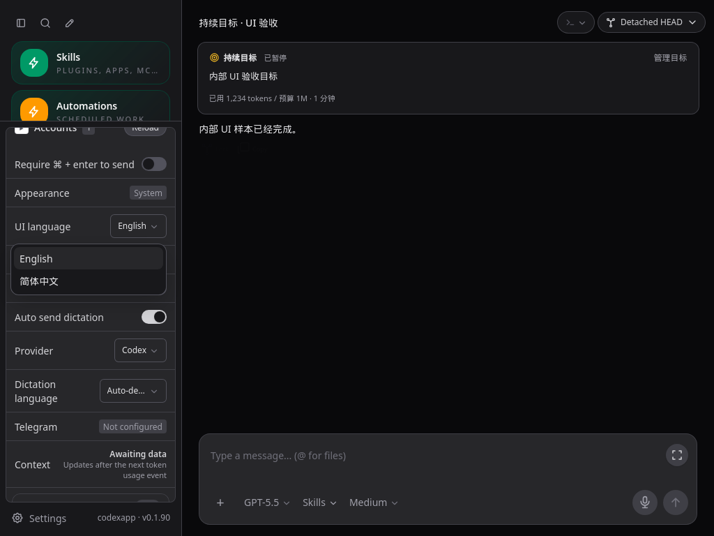
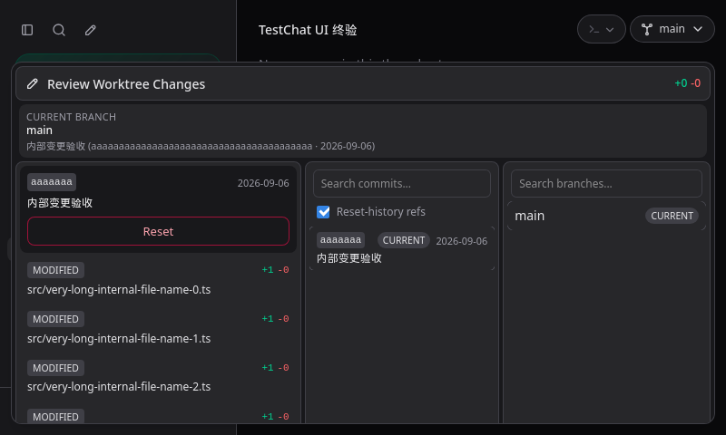
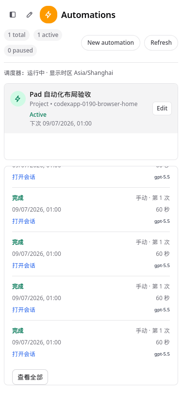

# CodexApp 0.1.90 最终验收与 0.2 开发基线

## 1. 最终结论

本轮确认并修复的 UI 问题已关闭，当前验证范围没有剩余 UI 阻塞项。0.1.90 可以作为进入 0.2 前的封测基线。这里的“干净”指源码已提交、工作区无未提交修改、候选与包一致、已知缺口有明确归属；不表示所有历史技术债或所有物理设备行为已经消失。

| 项目 | 最终值 |
| --- | --- |
| 分支 | `feature/automation-slash-0.1.90` |
| 运行源码 | `66346466acbb`；其后只有本轮验收文档提交 |
| 本地基线标签 | `beta/ui-0.1.90-final-20260906`；包含验收文档，不 push、不 merge |
| 59001 | `http://192.168.50.46:59001/`，0.1.90；独立 `/codex-home` 状态卷 |
| 候选镜像 | `sha256:a4306bc5e875b5bb3b2d6257eac471633b9a5630995c1480d26f539b9386ccfb` |
| CLI | 0.153.4 |
| 稳定服务 | 5900，0.1.89，PID 87226，未切换、未重启 |

最新机器证据为 [0.1.90-final-acceptance.json](evidence/0.1.90-final-acceptance.json)。本文及相邻历史文档、机器证据、选取截图同步到 Obsidian `开发/codexapp/`，写入前确认 NFS，写入后比较内容一致。

## 2. 终轮新增修复

| 问题 | 修复及验证 |
| --- | --- |
| WebKit 的 ResizeObserver loop | 标题高度与侧栏分组高度不再在 observer 通知中同步写布局。按 RAF 合并测量，忽略小于 0.5px 的标题高度变化，卸载时取消 RAF 并清理目标。WebKit 24 次刷新、24 轮缩放和 24 轮展开/收起通过。 |
| 低高度 Git 菜单越界 | 800×480 下展开提交文件，旧菜单底部到 543px。现在受动态视口高度限制并内部滚动；手机纵向布局保持不变。Chromium/WebKit 各六组尺寸下菜单和文件可达。 |
| PWA 错误响应覆盖可用首页（R08） | 导航只缓存成功响应；503 或网络故障回退已保存的有效页面；恢复后更新缓存。缓存切到 v3，旧 v2 清理；缓存写入失败不丢弃成功的网络响应。4 项真实 SW 函数单测及两种浏览器故障服务验证通过。 |
| 旧控件的视觉残留 | Git Reset 改为共用 AppButton 红色描边；侧栏语言、Provider、听写语言和 Review 分支选择使用共用主题颜色。修正审查面板懒加载样式的优先级，避免后加载的 scoped 白底覆盖深色规则。实际控件浅/深色、触摸和尺寸断言通过。 |

本轮没有修改 Git reset、checkout、审查写入或模型任务的业务逻辑，测试也未实际执行 Git 写入动作。按钮颜色和选择框样式进入共用组件/主题约定，避免复制独立的浅深色表面。

## 3. 计划与用户反馈逐项核对

| 计划或反馈 | 验收结论与证据 |
| --- | --- |
| P0 稳定基线 | 5900 仍为稳定 0.1.89；59001 独立卷及内部工作区；当前包和候选资源逐文件一致。 |
| P1 调度核心、P2 自动化可用性 | 单测覆盖 RRULE/时区、领取去重、重启恢复、失败分类、取消和日志；此前真实短间隔定时、手动与 heartbeat 已完成。本轮只读重新核对这三条 completed 记录和原业务产物，未把历史运行说成本轮新执行。 |
| P3 命令选择器 | 本轮七组命令界面用例通过，目录 22 项；持续搜索、不抢输入焦点、↑↓/Enter 显式选择、Escape、字面斜杠、撤销与两种发送快捷键通过。输入完整命令不强制变成动作。 |
| P4 日记到日历内部业务 | 0013 的虚构周样本、真实模型、短间隔触发、同周重跑去重及空周不写入已通过；本轮核验 `/test-workspace/automation-0190/日历/fixture-0190.md` 哈希未变，定时/手动/heartbeat 日志仍可查询。未新增外部路径。 |
| P5 封测交接 | 性能、打包安装、CLI/PTY、候选验证、不可变 release、回滚镜像及文档完成。物理 Pad/手机软键盘、生产 activate 与原周任务自然到期观察，仍是明确的后续人工/上线验收。 |
| 提示词与运行记录 | 提示词在前，记录在后；预览最多 5 条；“查看全部”弹窗可滚动，每页固定 100 条。Pad 横竖屏、低高度与手机无块间覆盖。 |
| 忙碌时发送 | 默认排队、可取消、编辑后仍排队、只有显式引导立即发送；全局/会话旧选择已移除。0018 双页面和失败保存验收继续有效，本轮真实会话再验普通排队等待前一任务完成后发出。 |
| 持续目标 | “＋ → 持续目标”、显式卡片与侧栏标记、刷新保留；默认 M，支持 M/B。本轮真实 0.02M=20000 token 目标完成，清理目标后普通对话仍可用；/compact 形成真实 contextCompaction。 |
| 自动化模型和强度 | 配置保存、刷新保留与选择器触摸通过；此前真实模型/low 生效与时间回显见 0018。 |
| 时间与来源 | 控件按浏览器本地时区显示，无法识别时默认 Asia/Shanghai；调度按任务保存的时区执行并单独注明。结构化自动化来源保留在历史中。真实记录分别在上海/纽约 WebKit 上验证；模型任意正文不做机械时间替换。 |
| 自动化线程逻辑与标记 | 项目定时任务每次创建执行线程；会话 heartbeat 复用目标线程。项目/绑定自动化标记与执行消息来源是不同信息；原说明及实现见 0015/0018，不用是否看到闪电推断调度成功。目标线程另有同风格标记。 |
| 原始空设计与冗余 | 0017/0018 已区分未实现协议能力、原始设计草案和可删孤立代码；9 个孤立文件及相应旧处理已清理。本轮保留该边界，不批量改动未验证的历史代码。 |

原方案制定时把 Goal/compact 留给 0.2，随后已按用户反馈在 0014/0015 调整范围并实际交付；最终应以本表和后续文档为准。

## 4. 本轮测试与证据边界

| 检查 | 结果 |
| --- | --- |
| 单元测试 | 37 个文件、260 项通过；包含 4 项 PWA 新回归。 |
| 完整构建 | Vue 类型检查、Vite 和 CLI tsup 通过。 |
| 主 UI 矩阵 | 当前 59001：Chromium 13 组、WebKit 13 组，共 26 组尺寸/主题/时区组合。覆盖 375×812、768×1024、1024×768、1180×820、820×1180、1024×600、1366×600、800×480、1440×900。 |
| 其他菜单与目录 | Git/提交文件、Plugins/Apps/Composio/Skills 四页：Chromium 与 WebKit 各 6 组；最终按钮修订另在当前候选两引擎各 6 组重验。 |
| 共用 UI | 7 组目标/自动化/嵌套 Esc/Tab/拖选/忙碌关闭保护；7 组技能选择；14 个创建项目/目录弹窗；2 组重命名/删除；Review 分支选择 4 组。 |
| 无接口夹具的 WebKit | 真实打包页面 3 组命令输入/选择/取消，另 2 组真实自动化记录时区和 v3 缓存检查，均通过。 |
| 真实目标/压缩/排队 | 线程 `01a0755e-9c93-7c02-a35b-1914a1674a08`：目标 complete、预算 20000、contextCompaction 完成、忙碌消息先排队后完成；pageErrors=[]。只使用内部样本，测试结束清除目标。 |
| 发布安装 | prepare 新目录安装、CLI help、CJS node-pty 导出、真实 PTY 启动退出 0；候选与发布目录 dist/dist-cli 共 29 个文件哈希一致。 |

当前无 Browser Use 工具，因此按仓库规则使用 Playwright。交互写入夹具使用 serviceWorkers:block，防止 WebKit 的 service worker 绕过请求拦截；另外独立验证了真实 service worker 和无夹具页面，不能把关闭 SW 的结果当作 SW 验收。

WebKit 连续强制刷新会取消上一文档未完成请求，出现带 access control checks 文本的诊断；脚本单独记录导航阶段数量，稳定交互阶段仍对所有错误断言，ResizeObserver 告警没有被过滤。PWA 的 WebKit 故障使用临时 HTTP 服务关闭连接；Chromium 使用浏览器离线开关。两者都验证真实 fetch 失败分支，不声称 Linux WebKit 等同物理 iPad Safari。

0018 已完成的队列 HTTP 并发/过期操作、隔离认证矩阵及 TestChat 刷新后的 hrefOk/titleOk/textOk，因本轮没有改相应实现而保留为已测证据，不重复启动认证测试环境或操作业务账号。真实 OAuth、外部日历、Telegram 和物理麦克风不在本轮内部验收中。

## 5. 性能与进入 0.2 的保留项

- 当前源代码的布局更新每帧最多执行一批；标题初始测量后跳过等价高度；侧栏只处理观察到且仍挂载的元素。卸载取消 RAF/Observer，不增加 API、轮询、历史失效或无限任务扇出。共用浮层开/关监听计数仍为 3/3。
- 新的 PWA 导航路径每次仍只有一次 fetch；只有成功响应才写缓存。后台等待一次本地 cache.put 后返回，未量化真实手机存储耗时；没有新增 API 缓存或业务离线承诺。
- 59001 实际线程性能采样：thread/list=1、thread/resume=1、thread/read=0、skills/list=1、rateLimits=1、provider-models=0，warnings=[]，API 合计 79.3KB，非白屏/永久 Loading 页面。原首页 rateLimits/provider-models 各 2 次仍列入 0.2 去重。
- 最终主 JS 562.81 kB / gzip 176.83 kB，主 CSS 414.52 kB / gzip 43.51 kB；保留 Vite 主块超过 500kB 提示。没有为 UI 修复引入新应用依赖。
- R05 异步提问、R06 工具历史、R07 动态模型能力及 ACP 原草案仍按 [0012 路线图](20260906-0012-codexapp-0.2系列代码审查与开发路线图.md) 分期推进。R08 的错误首页缓存污染现已关闭；旧哈希静态资源的长期缓存容量策略仍可在 0.2 优化。
- 严格 noUnused 余下 33 条诊断、长线程/启动性能和大包拆分是明确的后续代码债；本轮不以删除全部诊断换取“零问题”表述。

WebKit 验证新增本机浏览器缓存及其系统运行库；没有更改应用依赖声明、认证配置或生产服务。临时 PWA 故障服务已关闭；59001 测试目标已清理，原内部自动化保持暂停，待执行/排队/审批均为 0；4173 留在当前源码，5173 未操作。

## 6. 最终封测包与回滚

发布目录：`/home/docker/codexapp-releases/codexapp-0.1.90-66346466acbb-20260906-143506`

封测包：`/home/docker/codexapp-releases/codexapp-0.1.90-66346466acbb-20260906-143506/codexapp-0.1.90.tgz`

SHA-256：`b9fdc7e046679882e6e90df7e7d13dbdcc92fab59ec5b4d50769db92e8b2e0aa`

`latest-prepared` 指向上述目录。0018 以及本轮中途生成的包保留为历史产物；最终交接使用本文这一份。prepare 不等于 activate。生产切换仍需明确授权和切换当时的新空闲检查。

若需回退 59001，使用本轮开始前镜像 `sha256:2bb195581d7931ddfc7f5b73e038bfeb0add351c1493ae05c5074ce5c7083412` 与原独立状态卷；先执行空闲检查，不删除状态卷。源码可从最终本地基线标签建立 0.2 分支，保留 0.1.90 的不可变包与修复记录。

## 7. 截图与复现命令

截图原件绝对根目录：`/home/Code/codexapp/output/playwright/`。下图同名归档于本文 assets 目录，机器证据记录精确绝对路径和归档路径。

59001 `/#/thread/01900000-0000-7000-8000-000000000018`，WebKit 1024×768 深色：语言触摸与主题，选中后父面板保留、刷新保留语言，三个触发按钮无白色残留。



59001 `/#/thread/01900000-0000-7000-8000-000000000081`，WebKit 800×480 深色：Git 菜单限制在视口内，Reset 红色描边，内部滚动能到达所有文件。



59001 `/#/automations`，WebKit 375×812 浅色：提示词与记录分块滚动，最多 5 条预览与“查看全部”可达。



```bash
pnpm run test:unit
pnpm run build
node output/playwright/verify-0190-final-pass-ui.cjs
BROWSER_ENGINE=webkit node output/playwright/verify-0190-final-pass-ui.cjs
node output/playwright/verify-0190-final-pass-git.cjs
BROWSER_ENGINE=webkit node output/playwright/verify-0190-final-pass-git.cjs
REVIEW_UI_BASE=http://127.0.0.1:59001 node output/playwright/verify-0190-final-pass-review.cjs
node output/playwright/verify-0190-final-pass-pwa.cjs
node output/playwright/verify-0190-final-pass-actual-time.cjs
node output/0190-final-pass/check-artifacts.cjs
CODEXAPP_IDLE_CHECK_URL=http://127.0.0.1:59001 node scripts/check-codexapp-idle.cjs
```

临时脚本在本机 output 中；重跑真实目标脚本会创建内部测试线程，重跑产物检查前必须确认 latest-prepared 与 /tmp 中包仍属于同一候选，不能盲目将新临时包复制进历史 release。长期保留的是本文、精简 JSON、手工用例和选取截图。
