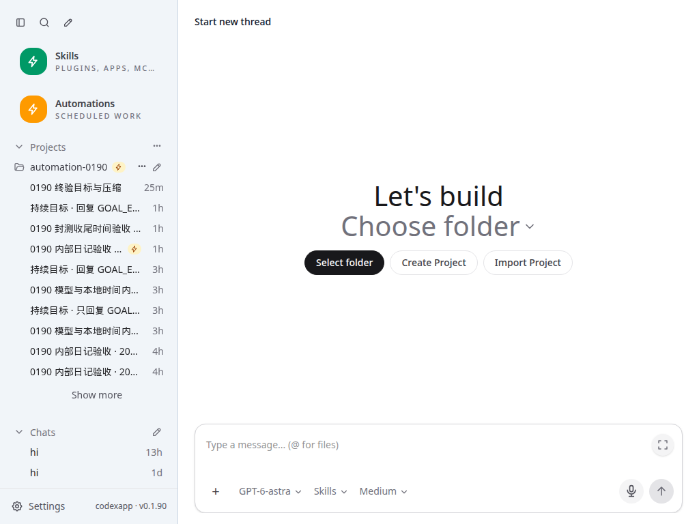

# CodexApp 跨版本刷新白屏原因排查

> 关闭说明：本文保留修复前调查记录，文中的“当前/待修复”均指调查时状态。修复、旧缓存迁移回归及最终交付包见 [0021 最终封版](20260906-0021-codexapp-0.1.90白屏修复与最终封版.md)。

## 1. 结论

已发现并完整复现一个与“偶尔白屏，Ctrl+F5 后恢复”吻合的发布缓存缺陷：**打包后不同版本的首页 ETag 错误相同，普通刷新继续使用旧 HTML；旧 HTML 引用的脚本已经不存在，静态服务却把 HTML 以 200 返回给脚本请求，浏览器拒绝加载，Vue 无法挂载。**

这是代码与发布产物中已经证实的问题，0.1.89 和当前 0.1.90 均受影响。尚无用户当时的浏览器网络记录，不能声称所有历史白屏都来自同一原因；但本轮已经在同一访问地址模拟版本切换，稳定复现普通刷新白屏和绕过缓存刷新恢复。

因此，0019 的封测就绪结论需要补充：**跨版本 HTTP 缓存刷新作为新发现的阻塞项，修复并验证后再重新冻结封测包。** 现有包、基线标签和旧验收记录保留，不冒充已修复版本。本轮完成定位、复现和修复范围说明，未修改运行源码或更新服务。

## 2. 已核实的故障链路

| 环节 | 实测证据 |
| --- | --- |
| 打包元数据 | 当前 `.tgz` 中 `dist/index.html` 的时间戳为 499162500，即 1985-10-26 08:15:00 UTC；部署后的 Last-Modified 与之相同。 |
| 首页长度 | 5900 的 0.1.89 与 59001 的 0.1.90 首页均为 987 字节，但 SHA-256 不同、引用的 JS/CSS 名称不同。 |
| 错误校验值 | 两者均返回 `ETag: W/"3db-7438674ba0"`，以及同一 Last-Modified。当前 `etag@1.8.1` 的 stattag 使用文件长度和 mtime，不计算内容哈希。 |
| 旧缓存被确认有效 | 向新版本发送旧 ETag 的 If-None-Match，实际得到 304；浏览器保留旧首页。请求头 Cache-Control:max-age=0 也不能纠正这个碰撞。 |
| 旧脚本丢失 | 旧首页请求 `/assets/index-oQOUe0a4.js`；新版本已经使用 `/assets/index-DvN0ic2W.js`。旧路径返回 200、Content-Type:text/html，内容是新首页。 |
| 页面无法启动 | 浏览器报模块脚本 MIME 类型错误；`#app.children.length` 为 0，整个页面白屏。源码首页没有独立于主 JS 的启动失败提示。 |
| 强制刷新恢复 | 使用 Chromium CDP `Page.reload({ignoreCache:true})` 模拟绕过缓存刷新；首页不再带旧 If-None-Match，得到 200 与新脚本路径，输入框和 UI 恢复。 |

代码位置：`src/server/httpServer.ts:225` 的 `express.static(distDir)` 使用默认元数据 ETag；其后的 SPA fallback 在资源不存在时无差别 `sendFile(index.html)`。当前 `index.html` 只有空的 `#app` 和主模块脚本；`src/main.ts` 在模块加载后才安装诊断和挂载应用，无法覆盖主模块加载之前的错误。

同一个验证问题也适用于其他固定 URL、打包时间相同且长度恰巧相同的资源，例如 sw.js；本轮实际证明的是首页碰撞，没有把所有资源都称为已发生碰撞。

## 3. 为什么不是仅归因于 PWA

实际访问 `http://192.168.50.46:59001`，Chromium 返回 `isSecureContext=false`、`'serviceWorker' in navigator=false`。这个普通内网 HTTP 地址没有运行 Service Worker。

跨版本复现实验也显式禁用了 Service Worker，问题仍然出现。0019 修复的是 SW 将 HTTP 错误页写进首页缓存，本轮发现的是浏览器 HTTP 缓存错误复用有效但过期的 HTML，两者属于不同路径。HTTPS/localhost 场景可能叠加 SW 缓存，但不需要 SW 就能触发本次白屏。

## 4. 复现方法与范围

- 使用临时只读代理 `http://127.0.0.1:43941/`，先提供 5900 的真实静态资源，再将同一代理地址的静态上游切到 59001。保留服务器实际缓存响应头，没有伪造 304 或修改 JS/HTML。实际服务没有切换或重启。
- Chromium，1024×768，浅/深主题分别新建上下文；HTTP 缓存开启、Service Worker 禁用；未使用会禁用浏览器 HTTP 缓存的 Playwright route 拦截。
- 两组均为：旧版正常挂载 → 切上游 → 普通刷新白屏 → 忽略缓存刷新恢复。捕获真实 If-None-Match、304、错误的脚本 200/text/html 和浏览器错误。
- 代理只允许候选只读 API，拒绝普通写入；没有发送模型任务、修改账号、操作外部业务路径或重置用户缓存。代理及测试浏览器已关闭。

临时复现脚本：`/home/Code/codexapp/output/0190-white-screen/reproduce-cache.cjs`。机器证据：[0.1.90-white-screen-investigation.json](evidence/0.1.90-white-screen-investigation.json)。用户当时使用的具体地址和触发时机尚未确认；这是已验证的匹配场景，并非对历史网络日志的还原。

截图原件位于 `/home/Code/codexapp/output/playwright/`，下图同名归档。测试 URL 为上述临时代理，1024×768 浅色：

## 5. 建议的最小修复范围

1. 首页及 SPA fallback 使用明确的缓存策略，避免固定文件元数据产生错误 304。最简单的方案是 HTML 不存储缓存，并关闭这一路的元数据 ETag/Last-Modified；如果希望保留校验缓存，则必须用内容哈希生成 ETag，并处理旧 Last-Modified 校验。不能只加 no-cache 后继续使用当前错误 ETag。
2. 对 `/assets/` 的缺失文件返回真实 404 和明确的不可缓存响应，不再落入 SPA 首页。仅页面导航使用 SPA fallback。带内容哈希的现存资源可以保留长期缓存，避免把全部静态文件统一改成 no-store。
3. `/sw.js` 等固定 URL 明确更新策略；SW 静态资源回退不能将 HTML 当作成功脚本缓存。保留上一轮有效首页故障恢复的能力。
4. 增加不依赖主 JS 的启动失败提示和“重新加载”入口；懒加载失败提供可恢复错误。不要无条件无限刷新，避免丢失草稿或掩盖真实运行错误。
5. 验收必须包含同一 origin 的旧版本缓存 → 新版本切换，保留普通刷新、强制刷新、旧标签页加载懒加载块、HTTP 无 SW 与 HTTPS/localhost 有 SW 两类路径。验证从已经缓存了旧 ETag 的客户端迁移，而非只测干净上下文。

0019 的 26 组界面回归验证的是各自新上下文中的当前页面，PWA 故障测试验证的是 503/断连恢复，没有覆盖这个 HTTP 条件请求碰撞。后续发布验收补齐该场景，不以“清除缓存后能启动”作为修复通过条件。

## 6. 当前状态

运行源码保持 `66346466acbb`，候选镜像、封测包与 0019 相同；只新增本次调查和手工验收文档。5900 保持 0.1.89、PID 87226 active；59001 调度、活动任务、队列和审批均为 0。本轮没有修改运行行为，因此无需重新执行全量单测或构建；性能影响待实际修复时测量，至少记录首页与静态资源请求次数、304/200、加载耗时和缓存命中。
