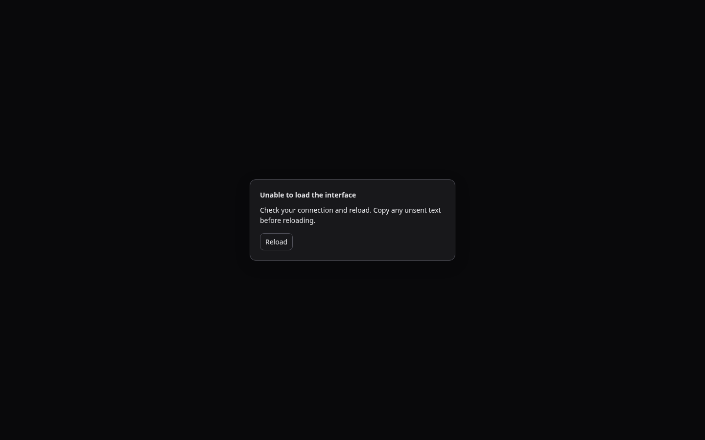
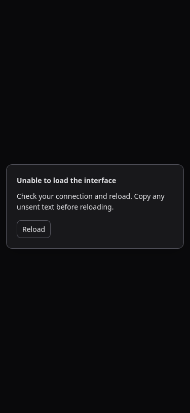

# CodexApp 0.1.90 白屏修复与最终封版

## 1. 封版结论

0020 确认的跨版本刷新白屏已修复，并通过保留旧缓存的真实打包页面迁移验证。0.1.90 最终封版以本文记录的包和本地标签为准；0019 的首次基线及其后调查记录保留为历史证据，不再作为当前交接包。

| 项目 | 最终值 |
| --- | --- |
| 分支 | `feature/automation-slash-0.1.90` |
| 封版源码 | `b21027d408778b9855e0b5fc76cc7e87f7967ee2`，随后仅提交本次文档/验收说明 |
| 本地标签 | `release/ui-0.1.90-final`；未 push、未 merge |
| 候选 | `http://192.168.50.46:59001/`，独立 CODEX_HOME，CLI 0.153.4 |
| 候选镜像 | `sha256:4ae7850d2ece9395a32157e15256f5dfe10c708af52ea2fbda9d9d07639eca43` |
| 稳定服务 | 5900 仍为 0.1.89，PID 87226 未重启 |
| 运行状态 | 候选 scheduler ready；活动任务、排队消息、待审批均为 0 |

机器证据：[0.1.90-sealed.json](evidence/0.1.90-sealed.json)。本文、0020 的关闭说明、0019/0012 的最新交接链接及截图同步到真实 NFS Obsidian `开发/codexapp/`，核对副本一致。

## 2. 修复内容

1. 首页与 SPA 页面不再使用文件大小/打包时间生成的 ETag 或 Last-Modified，并发送 `Cache-Control: no-store`。已有旧缓存携带错误校验标记时仍取得当前 HTML，避免错误 304。
2. 带内容哈希的静态资源继续使用长期 immutable 缓存；固定名称资源（包括 sw.js）明确更新策略。缺失 `/assets/`、图标、扩展名资源、脚本/样式请求及未知 API 返回真实 404，不再返回 SPA HTML。
3. Express `sendFile` 会以应用配置覆盖传入的 etag 选项，因此 SPA fallback 使用独立的小 HTML 响应路径；不全局关闭 API、本地文件等其他业务缓存。新增真实 HTTP 回归使用等长、相同 mtime 的两份首页，防止仅靠这次 HTML 变长“偶然修好”。
4. JS/CSS 的 Service Worker 缓存同时校验响应成功状态和 MIME 类型；既不写入 200 HTML，也不回退到之前污染的 HTML 缓存。Cache Storage 不可访问或写满时，成功网络响应仍可返回。保留 v3 中可用旧资源，避免仅为更新清空所有旧脚本缓存。
5. 独立于主 JS 的内联恢复提示负责冷启动模块失败、加载超时和打包版懒加载失败。只提供显式重新加载/稍后，不自动循环刷新。重新加载用临时参数避开旧 URL 缓存，启动成功后清除该参数并保留路由；不清空用户存储或自动发送草稿。
6. 恢复提示在主应用未初始化时也能使用系统或已保存的深浅主题。主应用已启动时使用共用 UI 色彩，避免加载失败反而出现深色页面白底卡片。
7. 构建时曾发现 npm 静默略过可选 node-pty。候选构建在替换前的 CJS 检查失败，旧实例持续运行。Docker 安装改用镜像现有 Node 头文件，并强制校验终端模块；最终镜像从实际 tgz 重新安装，最终 release 另行安装并验证真实 PTY。

`renderFrontendMissingHtml` 原有的每三秒自动跳回首页也已移除；前端产物确实缺失时保留明确页面和手动入口，避免无效刷新循环。

## 3. 验收结果

| 验证 | 结果 |
| --- | --- |
| 单元测试 | 38 个文件、268 项通过；其中 HTTP 缓存迁移与 SW 专项 12 项。 |
| 构建 | Vue 类型检查、Vite、CLI tsup 全部通过。 |
| 旧缓存跨版本 | Chromium/WebKit × 浅/深主题 × SW 开/关，共 8 组。同一临时 origin 先加载真实 0.1.89，再切至当前 59001；普通刷新与再次普通刷新均显示 UI，无错误 304 或脚本 MIME 错误。没有清除浏览器 HTTP 缓存，也没有用会禁用缓存的 Playwright route 伪造结果。 |
| 启动与懒加载恢复 | Chromium/WebKit 各 6 组：1440×900 浅/深、375×812 浅、768×1024 深，以及系统浅色/已保存深色、系统深色/已保存浅色。主脚本被阻断时独立卡片可见且不越界；恢复网络后点击重载，UI 和路由恢复；未加载的 ReviewPane 请求失败时可稍后返回会话，草稿保留。 |
| 普通 UI | 当前候选 Chromium/WebKit 各 13 组，语言触摸、模型/强度、自动化历史 5 条/100 条分页、Goal/命令窗口、展开输入区和本地时区通过；正常交互不出现恢复提示。 |
| PWA 故障恢复 | 两引擎均通过有效首页的 503/断连回退、恢复后更新和旧 v2 缓存清理。WebKit 断连用本地服务关闭连接，Chromium 使用离线开关。 |
| 打包认证矩阵 | 59011 无认证、59013 畸形认证进入 Zen；59012 合成失效认证错误刷新后保留，浅/深主题重复 live overlay=0；59014 Zen→OpenRouter。临时容器已清理，无真实 OAuth 或业务账号修改。该矩阵使用本轮已重装验证的镜像，随后改动仅为恢复主题、缓存读取时机和安装时使用本地 Node 头文件，没有改认证/对话处理。 |
| 发布安装 | 新 prepare 目录可运行 CLI help；CJS node-pty 导出正确、真实 PTY 输出标记并退出 0；dist/dist-cli 共 29 个文件与当前候选哈希一致，tgz 归档校验通过。 |
| 原功能基线 | 0013–0019 的自动化真实内部业务、Goal/compact/排队、TestChat 与并发队列证据继续适用。本轮未修改这些业务实现，不把历史执行说成本轮新任务。 |

缺失分块测试使用当前打包版的真实 Vite preload 失败路径；Vite 开发模式不提供同样的 preload 事件，因此开发服仅作冷启动提示验证。ReviewPane 打开时按既有布局暂时卸载输入框，草稿验证在从 Git 菜单返回会话后执行，不能把暂时找不到 textarea 当作草稿丢失。

此前从未刷新过的旧版标签页无法自动获得新版本的恢复提示代码；普通刷新即可迁移到修复版。当前封版建立的页面在后续分块失败时具有该恢复入口。物理手机/Pad 软键盘与真实 IME、生产原自然周自动化任务仍按原约定人工/上线后验收，不用浏览器引擎模拟替代。

## 4. 性能与交付边界

- HTTP 校验修复不增加 API，不影响队列、模型调用或历史缓存失效。哈希资源可继续命中缓存，避免为修首页而把整个应用改成无缓存下载。
- SW 每个脚本/样式请求仍最多一次 fetch；成功路径不读取回退资源，仅在网络响应不可用时查缓存。Cache Storage 读写仍为异步，真实 Pad 存储延迟未单独测量。
- 冷启动保护只有一个 15 秒定时器，应用挂载后取消；监听固定资源/模块错误，不轮询、不自动重载。恢复按钮不清除认证、偏好或会话草稿。
- 实际线程采样：thread/list=1、thread/resume=1、thread/read=0、skills/list=1、rateLimits=1，warnings=[]，总 API 79.3KB；采样页面不是错误页或永久 Loading。
- 最终主 JS 562.86KB / gzip 176.85KB；CSS 414.68KB / gzip 43.54KB。首页内联恢复界面增加少量 HTML，Vite 主包超过 500KB 的既有提示仍保留。
- 0.2 的异步提问、工具历史、动态模型能力、ACP 草案、长线程/首页去重及其余代码债仍按路线图推进；本次只关闭白屏发布阻塞，没有将原未实现功能标成已实现。

测试保持内部路径，不操作真实日历、NAS 业务目录或生产认证。4173 留在当前工作区，5173 未操作。

## 5. 最终包与回滚

发布目录：`/home/docker/codexapp-releases/codexapp-0.1.90-b21027d40877-20260906-152441`

最终封版包：`/home/docker/codexapp-releases/codexapp-0.1.90-b21027d40877-20260906-152441/codexapp-0.1.90.tgz`

SHA-256：`0b4836cff92948972a7a943af3d95e770694c19c0248b5687c725d8ea3c1d1eb`

`latest-prepared` 指向该目录。封版只固定产物与基线，不执行生产 activate；切换 5900 仍须当时的新空闲检查和明确上线指令。

候选回滚镜像为本轮开始时的 `sha256:a4306bc5e875b5bb3b2d6257eac471633b9a5630995c1480d26f539b9386ccfb`，保留原独立状态卷，回退前检查空闲。该回滚版本仍有旧缓存缺陷，仅作故障回退，不作为修复版交付。

## 6. 截图与复现

原始证据根目录 `/home/Code/codexapp/output/playwright/`，精确 URL、视口、原件绝对路径与归档路径见 JSON。

59001，1440×900 深色，主模块无法加载时的独立恢复提示：



59001，375×812，系统浅色而应用已保存深色，恢复提示仍使用已保存主题：



关键命令：

```bash
pnpm run test:unit
pnpm run build
node output/0190-release-final/verify-migration.cjs
REVIEW_UI_BASE=http://127.0.0.1:59001 node output/0190-release-final/verify-recovery.cjs
REVIEW_UI_BASE=http://127.0.0.1:59001 BROWSER_ENGINE=webkit node output/0190-release-final/verify-recovery.cjs
node output/playwright/verify-0190-release-final-ui.cjs
BROWSER_ENGINE=webkit node output/playwright/verify-0190-release-final-ui.cjs
node output/0190-release-final/check-artifacts.cjs
node -e "process.argv=['node','codexapp','--help'];require('./dist-cli/index.js')"
CODEXAPP_IDLE_CHECK_URL=http://127.0.0.1:59001 node scripts/check-codexapp-idle.cjs
```

output 脚本是本机测试工具，重跑前核对目标端口、候选版本与准备包，不盲目向历史 release 覆盖临时 tgz。长期保留本文、机器摘要、手工用例与选取截图。
