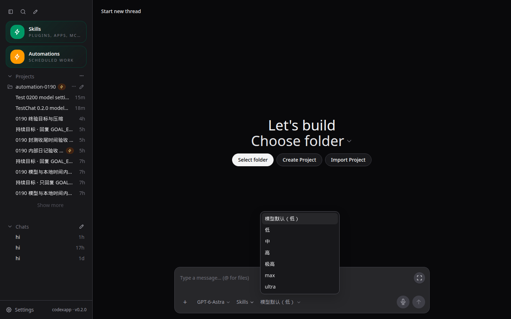
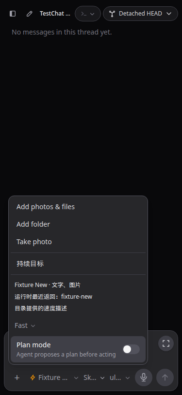
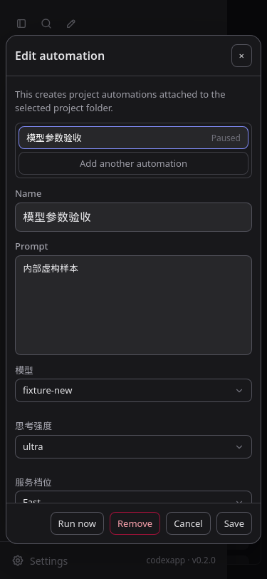
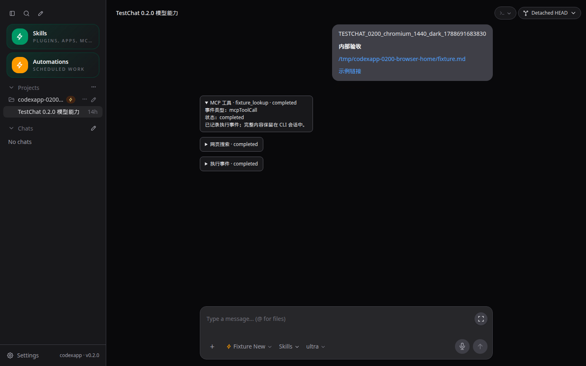
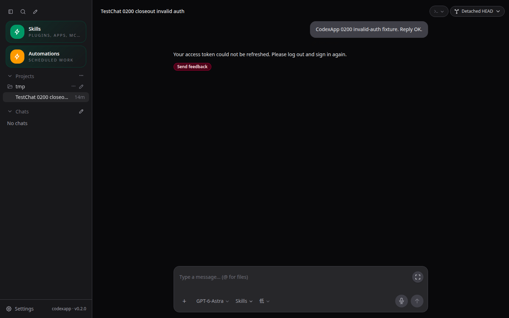

# CodexApp 0.2.0 模型能力实施与验收

> 范围补充：用户随后要求 0.2.0 增加反代 API 出口，详见 [0024 实施方案](20260906-0024-codexapp-0.2.0反代API出口实施方案.md)。Codex CLI 为绝对核心，Claude Code 和聊天客户端均可选。本文件记录的 282 项测试、镜像与 UI 验收只覆盖已有模型能力；API 出口随后已实施并部署至 59001，新产物、298 项测试与验收见 [0025](20260906-0025-codexapp-0.2.0API出口实施与验收.md)。这里保留原模型能力验收证据。

## 基线与范围

本次依据 0012 路线、0017 审查及 0021/0022 封版交接，从干净的 `fb29c12` 建立 `feature/model-capabilities-0.2.0`。现场确认生产已由外部终端切换至 0.1.90，release 为 `codexapp-0.1.90-500ed282f454-20260906-171234`，PID 2722536。59001 原容器停止，开发恢复原独立卷；不复制生产认证，不增加 NAS 业务挂载。

R01–R04、R08 与跨版本白屏已经关闭，保留回归。0.2.0 处理 R07，并提供兼容快照和必要的轻量事件摘要。R05 异步问题保留在 0.2.1，完整工具/子任务界面及原生历史分页、可靠投递仍按原路线推进。ACP 不在本次范围。

## 实施设计

1. 共用模型能力适配器保留 `model/list` 的模型 ID、显示名、强度、默认强度、服务档位及输入模态。ReasoningEffort 按合法非空字符串校验，移除聊天、自动化、后端的旧枚举。只显示目录公布值；旧配置值保留并标注，不静默丢弃。不公布能力的第三方 provider 显示未知，不借用同名 Codex 模型能力。
2. 模型/强度/服务档位的 UI 复用 AppSelect。Fast 使用真实目录 ID（本次候选返回 `priority`），文案采用模型目录描述，不硬编码价格/倍数。旧 `fast` 作为历史别名迁移到目录明确存在的 `priority`。切模型时保留明确选择，不兼容则提示用户重选；未显式选择使用模型默认值。
3. 请求、刷新和自动化 TOML 共用字符串契约。普通队列补齐入队时模型参数快照，旧队列仍按运行时默认；不更改出队/重试状态机。显式的默认档位使用 null，避免上一轮 Fast 泄漏到下一轮。
4. 目录请求按 provider 上下文合并并限制缓存。账号/配置变化、目录通知、刷新和 CLI 重启失效；过期异步返回不能覆盖新的上下文。兼容信息按需读取，区分 CLI schema 声明与客户端实现，不把接口数写成支持率。schema 生成合并并限制超时，清理临时目录。
5. 对有意义但未专门支持的工具事件提供有界折叠摘要；实时与历史使用同一映射，不输出完整原始 JSON，不改变 reasoning 历史展示策略。实际模型的显示以执行返回/通知为准，不能把用户选择当作执行证明。

## 验收与性能

- 单测覆盖新强度、旧值、缺失/空能力、provider 隔离、分页边界、并发与失效、请求参数、队列/自动化往返、未知事件。
- 构建、CLI CJS help、node-pty 导出及真实 PTY；当前打包镜像的无认证、畸形认证、失效认证刷新、Zen→OpenRouter 矩阵。
- 当前 4173 与最终 59001 检查真实变更控件、浅深主题、375×812、768×1024；需要路由夹具/状态修改时使用 Playwright CJS（本环境无 Browser Use），TestChat 检查 href/title/text。
- 内部虚构线程做有界真实模型请求；不访问生产业务路径。记录实际参数与结果，合成 fixture 不能当作真实模型证据。
- 采集首页/短线程 model/list、provider-models、rateLimits 次数、总 API 字节、耗时和 bundle；不以短线程替代 0.2.2 长线程压力结论。

## 发布边界与回滚

每个独立子任务本地提交，不 push、不 merge、不 npm 发布、不执行 production prepare/activate。候选先构建/打包/校验，再检查空闲、drain、有界替换。回滚到原镜像 `sha256:4ae7850d2ece9395a32157e15256f5dfe10c708af52ea2fbda9d9d07639eca43`，保留 `codexapp-multi-account-dev-home` 及内部工作区卷；不得用旧认证覆盖现有账号。

## 协议依据

候选和宿主 CLI 为 0.153.4。本轮重新生成 experimental schema；当前真实目录中 Astra/Sol/Terra 公布 max/ultra，Luna 公布 max，5.5/5.4-mini 截止 xhigh。这个结果仅代表本候选目录，不是按型号推测全体账号权限。官方建议按 `model/list` 能力渲染选择器：[App Server](https://learn.chatgpt.com/docs/app-server)。模型目录应随账号、provider 与运行时变化重新读取。

## 实施结果与候选交接

0.2.0 已在 <http://192.168.50.46:59001/> 运行。已完成 R07 的目录驱动模型/强度/服务档位、刷新持久化、真实请求与队列/自动化参数链；兼容快照与轻量工具摘要一并交付。后续异步提问、长历史/搜索与可靠发送分别保留在 0.2.1、0.2.2、0.2.3。

| 对象 | 最终状态 |
| --- | --- |
| 开发分支 | `feature/model-capabilities-0.2.0`，仅本地提交 |
| 已安装代码提交 | `cd79563f8f2473e50b27fe65d89fba88b95f2feb`；之后的文档提交不改变安装代码 |
| 镜像 | `sha256:c1a03f1a86aea41f4c4571bdf3fa8be0251304cdd9c93008e3f08b200b3cbe58` |
| tarball SHA-256 | `014b83382b5e6283d0c9a5fce490b37ff1398196f624babad7978dacab9a868b` |
| 安装一致性 | 本地 dist/dist-cli 与容器内安装包逐文件比较，29 个文件完全一致 |
| CLI | `codex-cli 0.153.4`，experimental schema：155 个请求方法、81 个通知；这些数量不是客户端支持率 |
| 候选状态 | activeTurns=0、queued=0、pendingApprovals=0；自动化 ready=true、draining=false、activeCount=0、queuedCount=0 |
| 生产 | 5900 仍为 0.1.90，PID 2722536；`latest-prepared` 仍指向 0.1.90，没有 prepare/activate |

本次额外修复两条状态问题：服务档位保存失败后只回滚原模型，不覆盖用户已切换到的另一个模型；运行时重连清除旧目录/兼容信息并刷新参数，首次 ready 则复用初始化，避免重复请求。未知工具摘要只保留有界类型、名称与状态，实时和刷新归一化共用同一实现；完整子任务交互不在本次交付范围。

### 已验证

| 验证 | 结果与证据边界 |
| --- | --- |
| 单元测试 / 构建 | 最后代码提交上 40 个文件、282 项通过；Vue/TS、Vite、CLI 构建通过。日志 `output/0200/unit-final-reconnect.log`、`build-final-reconnect.log` |
| CJS / 原生终端 | 下列 CLI require 命令 exit 0；node-pty 的 spawn 导出存在，打包容器真实 PTY 返回 `PACKED_PTY_0200_OK 0` |
| 浏览器矩阵 | 最终 59001：Chromium/WebKit × 1440×900、375×812、768×1024 × 浅/深主题，共 12 组；目录夹具验证 ultra/priority、切模型、刷新、请求载荷、工具摘要。自动化编辑保存/刷新覆盖 1440 与 375 宽度 |
| TestChat | 独立唯一标记、本地文件和网页链接；刷新后 hrefOk/titleOk/textOk 均为 true，3 个摘要保留，无页面异常 |
| 真实目录 UI | 59001 无路由替身实页，1440×900 深色；Astra 的 max/ultra 可见，设置显示应用 0.2.0、CLI 0.153.4，并标记未接入的客户端能力 |
| 真实普通请求 | 内部线程 `01a07643-2283-7790-ac7d-de8db9c2753d`，Luna 分别 low/priority、max/null，返回两个唯一验收标记；resume 与持久 turn_context 的模型/强度正确 |
| 真实队列 | 同一内部线程，入队快照保存 Luna/max/null；任务完成且队列清空。该运行的默认参数为空；与另一组显式默认冲突的真实执行场景未验收 |
| 真实自动化 | 暂停定义 `test-0200-model-settings-1788690741772` 保存、重读、手动运行；线程 `01a07646-ba38-7262-bfe1-e49ee6e21f08` 完成，运行历史保留 Luna/max/priority。结束后删除临时定义 |
| 打包认证矩阵 | 59011 无认证→Zen；59013 畸形认证→Zen；59012 合成失效认证错误在浅/深主题刷新后保留，重复 live overlay=0；59014 使用无效占位 key 验证 Zen→OpenRouter 配置切换与刷新。不代表第三方真实模型调用成功 |

真实请求、队列和自动化验证发生在 `9edc09a`；最后的 `cd79563` 只改前端重连刷新与其测试，后端构建内容未改。最后安装后重新完成 UI、认证恢复与性能检查。模型执行成功与参数回传不证明实际上游计费档位或加速倍数；ultra 已验证目录/UI/请求契约，没有逐模型实际运行 ultra。

~~~bash
pnpm exec vitest run
pnpm run build
node -e "process.argv=['node','codexapp','--help'];require('./dist-cli/index.js')"
MODEL_UI_BASE=http://127.0.0.1:59001 BROWSER_ENGINE=chromium node output/0200/verify-models.cjs
MODEL_UI_BASE=http://127.0.0.1:59001 BROWSER_ENGINE=webkit node output/0200/verify-models.cjs
node output/0200/actual-ui.cjs
node output/playwright/verify-0200-auth.cjs
node output/0200/check-artifacts.cjs
~~~

本环境没有可调用的 Browser Use；矩阵需要 API 路由替身和页面状态操作，因此使用 Playwright CJS。先在独立 CODEX_HOME 的当前 4173 开发服务完成检查，再在打包 59001 重验。4173 保留，未操作 5173。认证矩阵容器按精确名称清理，保留测试卷和失败线程作为证据。

### 性能结果与限制

| 场景 | 请求与结果 |
| --- | --- |
| 无认证 Zen 首页，优化前→后 | provider-models 2→1、rateLimits 2→1；thread/list 与 skills/list 各 1；总 API 19.8→14.6 KB；warnings 从重复配额/慢目录变为空 |
| 最终候选首页 | 83.9 KB；model/list=1、provider-models=0、rateLimits=1、thread/list=1、skills/list=1，warnings 为空 |
| 最终内部短线程 | 81.9 KB；model/list=1、resume=1、全文 read=0、thread/list=1、skills/list=1、rateLimits=1，warnings 为空 |
| 构建体积 | 主 JS 572.99 KB，gzip 180.77 KB；仍有超过 500 KB 的构建提示，没有宣称完成包体积优化 |

首页 prompts 仍读取两次，保留为后续债务；本次仅消除模型目录/配额相关重复读取。Zen 与真实账号的数据集不同，不能横向用总字节数推断变慢。采样包含固定 7 秒等待，不能将 totalMs 当可交互时间；短线程结果不替代 0.2.2 的长历史压力验收。

代码路径审计：能力目录最多 20 页，每页请求 100，重复游标即报错；缓存最多 16 项，合并正在进行的请求，完成后短缓存 2 秒，账号/provider/目录/重连事件显式失效。模型设置最多保留 200 项。CLI 版本/schema 检测按需共享一次生成，子进程各有 15 秒超时与输出上限，临时目录在 finally 删除；不把 schema 生成放到每次发送。队列沿用原有执行路径，增加固定参数字段，没有引入任务 fanout。

~~~bash
PROFILE_BROWSER_EXECUTABLE=/snap/bin/chromium PROFILE_BASE_URL=http://127.0.0.1:59001 PROFILE_WAIT_MS=7000 pnpm run profile:browser
PROFILE_BROWSER_EXECUTABLE=/snap/bin/chromium PROFILE_BASE_URL=http://127.0.0.1:59001 PROFILE_ROUTE='#/thread/01a07643-2283-7790-ac7d-de8db9c2753d' PROFILE_WAIT_MS=7000 pnpm run profile:browser
~~~

详细请求、时间、trace 路径和运行结果见 [机器可读验收记录](evidence/0.2.0-verification.json)。原始日志在 `/home/Code/codexapp/output/0200/`，浏览器报告在 `/home/Code/codexapp/output/playwright/`。

### 截图

真实候选：`http://127.0.0.1:59001/#/`，1440×900、深色，max/ultra 与版本信息检查通过。原始绝对路径：`/home/Code/codexapp/output/playwright/0200-actual-candidate-1440x900-dark.png`。

目录夹具：`http://127.0.0.1:59001/#/thread/02000000-0000-7000-8000-000000000001`，375×812、Chromium 深色；目录服务档位显示、菜单边界和刷新通过。原始路径：`/home/Code/codexapp/output/playwright/0200-model-chromium-375x812-dark.png`。

自动化：`http://127.0.0.1:59001/#/automations`，375×812、WebKit 深色，保存/刷新恢复通过。原始路径：`/home/Code/codexapp/output/playwright/0200-automation-webkit-375-dark.png`。

TestChat：上述夹具线程，1440×900、Chromium 深色，href/title/text 与刷新摘要检查通过。原始路径：`/home/Code/codexapp/output/playwright/testchat-0200-chromium-1440-dark-cjs.png`。

认证失败：`http://127.0.0.1:59012/#/thread/01a07647-9a86-7142-97e3-affd7ffccd58`，1440×900、Chromium 深色，刷新后错误保留、重复 live overlay=0。原始路径：`/home/Code/codexapp/output/playwright/0200-invalid-auth-dark.png`。

### 构建补充与下一步

常规 Docker 构建先完成应用安装，但两次 `npm install -g @openai/codex@0.153.4` 均未安装平台可选依赖，`codex --version` 明确失败，未替换候选。复用 CLI 后，npm 又在依赖下载时发生 TLS 错误。最终确认新旧 package.json 字节一致，在已验证的 `4c1eee4…` 镜像上解包更新应用文件，复用已安装依赖与 CLI，先清除旧 dist/dist-cli 避免残留。CLI 仍为 0.153.4，原生 PTY 与 29 个应用产物一致性重新验证。该步骤不是新的在线 npm 安装验收；原打包安装与依赖组合已在 9edc09a 验证。Dockerfile 位于 `output/0200/Dockerfile.reuse-verified-cli`，最终构建日志 `deploy-reconnect-offline.log`；没有升级依赖或关闭 TLS 校验。

~~~bash
docker tag sha256:4c1eee48893c2dee23fce4805e4bb951c9d73bf3322bc7d7cd270a270bb40415 codexapp-verified-cli:0.153.4-4c1eee4
CODEXAPP_REPLACE_DEV=1 CODEXAPP_MULTI_ACCOUNT_IMAGE=codexapp-multi-account-dev:ui-0.2.0 CODEXAPP_MULTI_ACCOUNT_DOCKERFILE=/home/Code/codexapp/output/0200/Dockerfile.reuse-verified-cli bash scripts/run-multi-account-dev.sh
~~~

下一步先在 59001 人工封测模型切换、常用自动化和移动输入。物理软键盘/中文输入法、有效第三方账号的真实调用、所有模型与强度组合、自然生产日历任务尚未完成本轮验收。生产发布仍需独立决定；不能将候选启动或 schema 声明当作整个 0.2 路线已交付。
