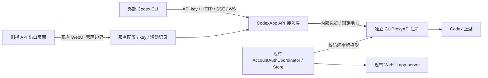

# CodexApp 0.2.0 反代 API 出口实施方案

## 1. 结论与本轮边界

建议在 0.2.0 增加“API 出口”，采用 **CLIProxyAPI 的固定版本独立进程 + CodexApp 原生管理界面和凭据协调层**。协议转换、Codex 上游连接、SSE/WebSocket 和压缩由成熟组件处理；CodexApp 负责客户端 API key、账号选择、接入状态和生命周期。优先使用原版发行二进制，不把第三方源码大段复制进现有 bridge。

**用户最新优先级：Codex CLI 适配为绝对核心；Claude Code 和聊天客户端均为可选开发，不阻塞 0.2.0 核心验收。**

核心交付包含 Responses HTTP/SSE、Responses WebSocket、compact、Codex 模型目录、工具调用与续接、账号池凭据复用、API key 管理和活动连接识别。`POST /v1/chat/completions` 保留原始请求中的出口，优先直接复用组件做基础验收；为具体聊天客户端增加的适配和界面不列为必交。

本轮授权是“先写实施方案并同步开发计划”：仅做公开源码/官方文档和本地实现的只读检查，写入方案与路线文档。没有安装/启动反代、添加 key、读取或导出真实账号凭据、调用模型、修改源码、构建镜像、切换账号或服务。后续实施需用户审阅本方案后开始。

| 现场对象 | 本轮已核实 |
| --- | --- |
| 源码 | `/home/Code/codexapp`；`feature/model-capabilities-0.2.0`；调研基线 `a2bd0d8`，开始时干净 |
| 59001 | 0.2.0 模型能力候选，CLI 0.153.4；容器 `codexapp-multi-account-dev` |
| 5900 | 0.1.90，systemd PID 2722536；`latest-prepared` 仍为 0.1.90 |
| 既有工作 | [0023 模型能力实施与验收](20260906-0023-codexapp-0.2.0模型能力实施与验收.md)保持已验证状态；本扩展尚未包含在它的 282 项测试和候选产物中 |
| 归档 | 本文、[0012 路线图](20260906-0012-codexapp-0.2系列代码审查与开发路线图.md)和调研记录同步 Obsidian `开发/codexapp/` |

## 2. 组件比较与选型依据

2026-09-06 现场查询 GitHub 仓库信息、最近提交与 release，并下载对应源码到 `/tmp/codexapp-0200-api-plan/` 只读检查。下表的“最新 release”指当次 GitHub latest API 返回，提交日期指默认分支最近提交，不能据此推断绝对稳定。完整 SHA、日期和源码校验值见 [调研记录](evidence/0.2.0-api-proxy-research.json)。

| 项目 | 当次维护证据 | 许可标识 | 与本需求的关系 / 建议 |
| --- | --- | --- | --- |
| [openai/codex](https://github.com/openai/codex) | `rust-v0.153.4`，9 月 4 日发布；默认分支 9 月 6 日仍提交 | Apache-2.0 | 保留为 WebUI 运行时、认证与 CLI 验收基础。app-server 是代理工作过程的 JSON-RPC 服务；若拿它自行拼装标准推理 API，仍需自建兼容层 |
| [router-for-me/CLIProxyAPI](https://github.com/router-for-me/CLIProxyAPI) | [v7.2.152](https://github.com/router-for-me/CLIProxyAPI/releases/tag/v7.2.152)，9 月 6 日发布；近期修订涉及 Codex、配额错误和会话使用量 | MIT | **首选**。已有 Codex HTTP/WS/compact、协议转换、认证热更新和模型目录。以固定发行二进制集成，升级面清晰 |
| [BenedictKing/ccx](https://github.com/BenedictKing/ccx) | main `edd0306a`，9 月 5 日；latest release `v2.9.37` 为 7 月 7 日 | MIT | 渠道编排、监控、熔断和多 key 管理可参考。自带完整管理站点与当前 WebUI 重叠；main 活跃但不能把 main 能力当作该旧 release 的能力 |
| [justlovemaki/AIClient2API](https://github.com/justlovemaki/AIClient2API) | `v3.4.8`，9 月 5 日；main `aaf30e2e` | GPL-3.0 | Node 多协议/provider 适配值得参考；优先比较池管理、失效和流取消思路，不复制其实现进入本项目；选它作直接依赖须另核分发方式 |
| [icebear0828/codex-proxy](https://github.com/icebear0828/codex-proxy) | `v2.1.4`，9 月 4 日；dev `6cb1a2dc`，9 月 6 日 | README 标明 Non-Commercial，GitHub 为 NOASSERTION | Codex 专项协议与连接生命周期值得研究；本方案不作为核心依赖，也不复制实现。许可范围以它的原文为准 |
| [10/chatgpt-codex-proxy](https://github.com/10/chatgpt-codex-proxy) | main `89973f46`，7 月 27 日；latest release 返回 404 | MIT | 有 Responses/WS、工具与多账号路由，并非只有简单转发；公开维护与发行记录较少，作为结构参考 |

这里采用许可文件/仓库原文标识，不对组合分发作法律结论。实际打包保留 CLIProxyAPI 的 LICENSE、版本和来源；不把其他项目的评价星级当作稳定性证据。

### 2.1 影响方案的源码发现

1. 固定版本的 [路由注册](https://github.com/router-for-me/CLIProxyAPI/blob/v7.2.152/internal/api/server_routes.go)确实包含 `GET/POST /v1/responses`、`POST /v1/responses/compact`、`GET /v1/models`、Chat Completions，以及可选 Claude Messages/count_tokens。路由存在仍需实际 CLI 验收。
2. [模型处理](https://github.com/router-for-me/CLIProxyAPI/blob/v7.2.152/sdk/api/handlers/openai/openai_handlers.go)遇到 `client_version` 查询参数会返回 Codex 目录形状，普通请求才返回 OpenAI 模型列表。新出口必须保留这个区别，不能统一缩成 `{data:[{id}]}`。仓库目录已有 Astra max/ultra 与 Luna max，但它是组件目录材料，不能代替所选账号的实际可用性验证。
3. [HTTP 执行路径](https://github.com/router-for-me/CLIProxyAPI/blob/v7.2.152/internal/runtime/executor/codex_executor_execute.go)会删除 `previous_response_id`；[WebSocket 路径](https://github.com/router-for-me/CLIProxyAPI/blob/v7.2.152/sdk/api/handlers/openai/openai_responses_websocket_requests.go)另有续接处理。不能承诺所有 OpenAI 服务端存储/任意断线续接语义。核心必须验证 Codex 的完整历史重送、加密 reasoning、同连接增量续接、恢复失败后的明确错误。
4. [Codex 凭据实现](https://github.com/router-for-me/CLIProxyAPI/blob/v7.2.152/internal/runtime/executor/codex_executor_auth.go)可读取 `access_token`；本地刷新在缺少 `refresh_token` 时直接返回。这提供了“仅访问令牌投影”的技术切入点，但尚未证明后台刷新、热更新和长连接过期都安全，必须先做 G0 验证。
5. 本 tag 的 go.mod 已是 `/v7`、Go 1.26，而 [SDK 使用说明](https://github.com/router-for-me/CLIProxyAPI/blob/v7.2.152/docs/sdk-usage.md)仍有 `/v6` 及 internal 包示例。因此首选二进制与配置/管理接口，不按 README 直接写 Go SDK 嵌入程序。组件另有 Home 控制中心集成，本期不为它重建一套控制中心。

官方 [app-server 文档](https://learn.chatgpt.com/docs/app-server)用于区分 harness 工作流与标准推理出口；Codex 自定义 provider 的 base URL、env key、Responses 和 WebSocket 配置以 [官方配置参考](https://learn.chatgpt.com/docs/config-file/config-reference)核对。本方案的兼容性结论来自这些文档与代码检查，尚不是运行验收结果。

## 3. 用户体验与接口范围

### 3.1 管理入口

侧栏顺序固定为：**技能 → 自动化 → API 出口 → 项目/会话**。新入口沿用现有 `sidebar-skills-link` 卡片的尺寸、圆角、图标块、主副标题、选中态和移动端收起行为；标题“API 出口”，副标题“Codex 客户端接入”。路由建议 `#/api-proxy`，页面懒加载。

管理页面提供五块信息：

- 服务状态：未启用、启动中、可用、暂停接入、等待连接结束、异常；应用/组件版本、base URL、启停操作。
- 账号：跟随 WebUI 当前账号；可选增强为固定选择账号池中的一个账号。分别显示“WebUI 当前账号”和“API 使用账号”，不能混用 active 标签。
- API key：创建、命名、复制一次、启停、到期时间、轮换、撤销、最后使用、请求/错误数及活动连接数。
- 模型和客户端接入：所选账号/组件能提供的模型能力；生成 Codex 配置与 key 使用说明。只需用户填 base URL、key 和正常的模型选择，不要求下载 auth.json 或手工填账户 ID。
- 活动与近期请求：请求 ID、key 名称、模型、HTTP/SSE/WS、开始时间、耗时、状态、token 用量（上游未返回则未知）。默认不保存提示词、回复或工具参数。

复用 [0016 UI 约定](20260906-0016-codexapp-UI组件与代码风格约定.md)的 AppDialog/AppSelect/AppPopover/AppButton 和 `--ui-*`，不嵌入第三方后台 iframe、不引入另一套组件库。组件版本和维护信息仅放管理页面，不塞进普通聊天发送流程。

### 3.2 对外接口矩阵

候选默认 base URL：`http://192.168.50.46:59001/v1`；未来生产是否使用 5900 的同路径需另行发布授权。路径在现有端口上精确挂载，内置代理端口不直接发布。

| 接口 / 能力 | 本期层级 | 完成条件 |
| --- | --- | --- |
| `POST /v1/responses` | 必交核心 | JSON 和 SSE，错误/终态/usage、长输出、tools/tool_choice、函数/自定义工具、图片输入和结构化输出按真实模型能力验证 |
| `GET /v1/responses` + HTTP Upgrade | 必交核心 | Codex Responses WebSocket；握手鉴权，连续 turn、工具结果续接、断线/取消和活动统计正确 |
| `POST /v1/responses/compact` | 必交核心 | 真实 Codex 压缩后继续编程；不能用聊天总结字符串冒充 opaque compact 输出 |
| `GET /v1/models` | 必交核心 | 普通 OpenAI 列表；带 `client_version` 的 Codex 能力目录。模型 ID、默认值、reasoning、输入模态和上下文信息保留 |
| `POST /v1/chat/completions` | 基础出口 | 复用组件，基础流式/非流式和工具载荷契约检查；具体聊天客户端矩阵可选 |
| `POST /v1/messages`、`POST /v1/messages/count_tokens` | 可选：Claude Code | 核心通过后另评估；通过前不显示为“已适配 Claude Code” |
| Codex `/alpha/search`、图像生成、live/realtime 等扩展 | 按真实 CLI 依赖评估 | 常规编程必须调用的路径纳入核心修订；语音/媒体等额外功能默认不开放，不因组件有路由就宣称已支持 |
| Responses retrieve/delete/input_items/cancel HTTP、Files、Batch、Embeddings 等 | 暂不承诺 | 没有对应上游语义时返回明确 JSON 404/501；参数不支持用 400。不能静默执行另一种行为 |

“完整”以 **Codex 客户端日常编程闭环**衡量：开始任务、读取/修改测试工作区文件、运行本地命令、连续工具调用、推理参数、压缩、恢复和取消均可用。客户端的工具在客户端执行；API key 不授予服务器文件/终端/管理接口权限，网关不把每次请求转成 WebUI 中的一个 agent 任务。

### 3.3 Codex 配置示例与能力约束

页面为用户生成类似以下配置；实际示例模型采用验收账号目录中的可用值，WebSocket 仅在验收通过后标记支持。

```toml
model_provider = "codexapp_gateway"
model = "gpt-5.6-luna"

[model_providers.codexapp_gateway]
name = "CodexApp API"
base_url = "http://192.168.50.46:59001/v1"
env_key = "CODEXAPP_API_KEY"
wire_api = "responses"
requires_openai_auth = false
supports_websockets = true
```

key 由客户端环境变量提供，不把明文放进分享截图或仓库。`base_url` 含一次 `/v1`，不得拼成 `/v1/v1/responses`；这里的 key 是本网关签发的客户端 key，不是 OpenAI OAuth token。

选定 Codex CLI 0.153.4 作为初始兼容基线，执行时再记录版本。不能用源码目录已有 max/ultra 就判定转发成功：检查实际出站 `reasoning.effort`、`service_tier`、`include`、`instructions`、`phase`、加密 reasoning、tool call ID/结果对应关系。未知合法字段尽量透传；对已知会被组件剥除且会改变语义的参数，明确拒绝或披露限制。高级任务/子代理载荷须有专项回归，不能在 Node 层自行删字段“修兼容”。

## 4. 集成架构与生命周期



- 在候选容器中由 CodexApp 管理一个 CLIProxyAPI 子进程，监听容器自身 `127.0.0.1` 独立端口（建议 8317，启动前核对）；宿主安装同样只监听 loopback。不能在容器间用错误的 127.0.0.1 假定共享网络，也不挂 Docker socket 让 WebUI 管理宿主 Docker。
- 按显式配置启用，默认关闭。健康检查同时确认进程版本、监听就绪、账号投影版本和模型目录；HTTP 200 不等于真实上游可用。失败时 `/v1` 返回 JSON 503，WebUI 聊天和自动化继续可用。
- `httpServer.ts` 中为 `/v1` 注册独立鉴权和终止路由，放在网页密码中间件之前；成功/失败都不落入 SPA。WebSocket Upgrade 精确分流，不能干扰已有 `/codex-api` 的连接。
- 外部 key 校验成功后换成内部代理 key；不向代理转发用户 Cookie、客户端 Authorization 或可覆盖账号/上游地址的内部控制头。保留 Codex 所需版本、会话、trace、beta 和传输信息，具体头部以 G0 捕获的请求验证。
- 状态持久化建议位于本实例 `CODEX_HOME/api-proxy/`：`settings.json`、`keys.json`、有界 metadata 记录；派生配置/短期令牌另置本实例私有运行目录。文件原子写入，敏感文件 0600，目录 0700。
- 不把 `/root/.codex` 挂进候选，不导出全部账号池，不给代理挂项目源码或 NAS；它只接收当前允许使用账号的最小派生凭据。
- 新增源码以 `src/server/apiProxy/` 独立模块为主，页面建议 `src/components/api-proxy/ApiProxyPanel.vue`，API 客户端 `src/api/apiProxy.ts`。现有巨大 bridge 只接生命周期/事件，不继续塞整个反代实现。

## 5. 账号池复用与刷新所有权

### 5.1 核心方案：统一刷新，最小投影

现有账号池已经有 `storageId`、`credentialRevision`、原子凭据写入、身份校验和 `AccountAuthCoordinator` 的串行操作。`refreshActiveTokens()` 目前只处理 WebUI active 账号；`RuntimeQuiescenceSnapshot` 只覆盖现有 turn、队列、待答和自动化，还没有外部 API 活动。这两处需要有界扩展。

建议保留 WebUI 为唯一凭据真值来源和 refresh token 持有者：

1. 新增按 storageId 获取可用访问凭据的内部方法。对同一账号合并刷新请求，复用现有修订号检查和原子保存，避免 active、后台配额探测和 API 三条刷新路径竞争。
2. API 请求准入时固定 `{storageId, credentialRevision, routingEpoch}`；凭据临近到期时先由协调器刷新。正常请求不每次启动 app-server、读取配额或重新导出整个模型目录。
3. 给 CLIProxyAPI 一个 **仅 access_token、account_id 和必要到期/路由元数据** 的派生记录，不包含 refresh_token，也不共享原始 auth.json。API 使用的 OAuth 身份须与所选 storageId 校验一致。
4. 刷新保存成功后再发布新投影；若账号同时是 WebUI active，还要同步 active 物化状态，不能只更新池内文件使 WebUI 再拿旧刷新凭据。非 active 刷新不得改 activeStorageId，不调用全局 switchAccount。
5. 代理配置只载入当前一个允许账号，避免组件默认轮询/失败转移改用用户未选的账号。不从“共享账号池”推导出自动额度轮换或每个 key 独立账号池。
6. 投影热更新需有确认版本/状态的步骤；不能把“写文件完成”当“新凭据已被使用”。组件对无 refresh token 的后台处理、写回竞态、401 后负缓存清除、WS 固定连接跨令牌更新均列入 G0。

首期凭据源限于现有池中已识别的 ChatGPT/Codex 账号；WebUI 的第三方 provider key、Zen 回退配置不自动转为反代上游。认证失败时停用该路由并报告错误，不悄悄切到另一个 provider。

这是推荐设计，**尚未运行验证**。不能靠伪造过期时间、复制 refresh token 到第二个刷新器或盲目同步两个 auth 目录解决集成问题。如果原版组件不能稳定处理访问令牌投影，只评估其当前受支持的窄扩展接口；需要长期 fork 或重写 Home 控制协议时，先提交方案修订，不扩大实现后再交付一个不可维护的版本。

### 5.2 独立选账号：有条件纳入

| 模式 | 建议 | 切换影响 |
| --- | --- | --- |
| 跟随 WebUI 当前账号 | 核心基线；后台明确显示实际账号 | WebUI 全局切账号必须同时检查 API 请求/连接，不能只看 activeTurns |
| API 固定选择池内一个账号 | 推荐在 G0 通过后作为增强；增加 `apiAccountStorageId` 和 AppSelect 即可，但刷新/身份链必须已共用 | 只变 API 的路由，不物化 WebUI active，也不重启它的 app-server |
| 多账号自动轮询、按 key 绑账号、自动故障转移 | 本期不做 | 会扩大配额、粘性续接与并发控制复杂度 |

独立选择是否进入 0.2.0 以 G0 结论决定：若只需按 storageId 复用统一刷新与独立路由，可做；若需要重写账号池事务或让同一 refresh token 被两个运行时独立管理，则保留跟随模式，并在交接中明确未实现独立选择。账号不可用时显示具体待处理状态，不将 ready/配额成功当作生成调用成功。

## 6. 活动连接、切换与重试

### 6.1 活动定义

管理页同时显示：正在处理的 HTTP 请求、SSE 响应、WS 连接、WS 内执行中的 response、取消/关闭中的上游操作。空闲 HTTP keep-alive socket 不计作活动生成；空闲 WS 仍可能保存上下文，要单列，不能藏在“活动请求为 0”后面。

每个请求/WS 会话记录 key ID、账号、路由版本、开始时间和状态。注册准入与切换共用门闩：先关闭新准入，再异步检查/等待已有活动，防止“检查为空之后又进来一个请求”的竞态。鉴权等待和凭据准备中的请求也要纳入预约计数。

### 6.2 普通切换事务

1. 校验目标账号/版本，关闭新请求准入，进入 draining；新 HTTP 请求返回 503 + Retry-After，新 WS 握手不接受，现有 WS 不再开始新 response。
2. 等待已接收的响应结束。等待有上限（建议默认 60 秒，可调整）；超时维持旧路由并恢复接入，UI 报告仍在活动的请求，不能自动强杀。
3. WS 完成本轮后进入空闲；在“等待当前请求结束后切换”的操作内正常关闭这些旧路由连接，促使客户端重连。无法可靠识别终态时保守按活动处理，不用静默秒数猜测推理已结束。
4. 发布目标账号/配置，等待组件识别并通过本地就绪检查，原子提交 routingEpoch，再开放准入。失败回滚路由和组件配置；凭据若已合法刷新，不回滚旧 refresh token。
5. 如用户明确点“中断活动请求并切换”，先展示数量和对象，取消对应传输并确认本地上游连接已关闭，再切换。取消只表示本地请求结束，不能承诺上游已经停止计费。

撤销/到期的 key 立即阻止新 HTTP 请求、WS 握手和已有 WS 内新生成；既有生成默认完成，UI 提供单独的“同时中断活动连接”。轮换创建新 key 后可短期保留旧 key，截止时间到达按同一规则执行。撤销状态与 key 哈希持久化，不因重启复活。

反代启停、账号删除/重新登录、配置变更、组件升级、59001 替换与未来 release 切换都要使用同一活动快照。`scripts/check-codexapp-idle.cjs` 与发布 drain 后续扩展 API 计数；实例未启用反代时明确返回 disabled，不能把“活动接口读取失败”解释为空闲。

### 6.3 续接和失败行为

- 默认固定一个账号、一个路由版本；WS 及有状态续接不能在活跃连接中途迁移到另一个账号。
- Codex 普通 HTTP 全量输入与 WS 增量输入分别验证。HTTP 仅有 previous_response_id 而没有可恢复上下文时明确返回不支持/上下文不存在，不能让组件删掉 ID 后生成一个失忆回复。
- 首字节之后不自动重放，不拼接第二次生成的输出。网关层不另加通用 POST 重试；组件的额外请求轮次、bootstrap 重试和跨账号 fallback 初始关闭，再按实测决定是否增加明确安全的重试。
- 429、额度耗尽、401、上游 5xx、连接超时、SSE 中失败各自有终态；HTTP 已发头后用协议内错误或正常关闭表达，不能追加第二个 HTTP 状态/HTML。
- 客户端断开时传播取消；活动计数在下游结束和上游清理后只释放一次，异常/重启后清理悬挂记录，历史标为 interrupted。不得把 socket close 当作模型完成。
- 客户端自报的 session ID 不是授权凭据。内部续接/缓存绑定须带 key ID 和 routingEpoch 命名空间，response ID 关联校验归属；检查组件实际使用的缓存键，防止两个客户端使用相同 session ID 时共享可读状态。优先使用组件现有隔离能力，必要的标识适配保持有界，不在网关复制全量会话历史。

## 7. API key 与最小运维设置

随机生成至少 32 字节 secret，使用便于识别的网关前缀。创建时只展示一次完整 key，列表仅显示名称、ID/尾部提示和状态；持久化高熵 key 的 SHA-256 摘要，验证采用定长安全比较。没有必要做收费平台或复杂组织/RBAC。

必交操作：创建、重命名、启用/停用、可选有效期、撤销、轮换、查看最后使用与活动数。可选模型白名单在请求和 `/models` 两种目录形状中一致生效；若加入白名单，WS 新请求同样校验。并发限制建议全局 8、单 key 4 起步，可配置，真实验收后调整；超限返回 429，不建立无限请求队列。RPM/硬 token 预算先作为可选项，不把未知上游用量当作 0。

客户端 key 与内部代理 key、组件管理 key 完全分开。`/v1` 必须带有效 key，即使本机 WebUI 使用 `--no-password`；网页 Cookie 不替代 API key，API key 也不能作为网页/账号管理授权。管理仍沿用家庭内网 WebUI 的既有边界，新增写接口检查明确的跨站 Origin，不借此重做整个应用鉴权。

代理仅向固定内部地址转发，并精确开放已验收路由；不上线通配的管理接口。关闭第三方管理页下载/自动更新、调试 pprof、原始请求/响应日志、动态插件和未用协议入口。保留必要上游功能，是否注入工具/修改客户端头部由 Codex 兼容实测决定，不能默认照搬完整示例配置。

日志只记摘要，鉴权头、派生令牌、请求/工具正文不进入 stdout、错误记录或导出包；核查组件的失败日志是否仍落盘。运行摘要建议保留最近 500 条或 7 天，先到者淘汰；最后使用时间合并写入，避免逐 chunk 同步写文件。配置/暂停页可显示明细；普通会话首页不新增轮询。

## 8. 固定版本、打包和更新

- 初始调研候选为 CLIProxyAPI `v7.2.152`，实施前重新核对 release、源码和校验和，再锁定 tag、commit、下载来源、平台与 SHA-256。不能使用浮动 latest 或在服务启动时在线更新。
- 59001 Docker 构建阶段包含固定二进制及 MIT 许可；应用启动/重启不依赖 npm 或 GitHub 网络。Node 子进程管理就绪、退出和清理，不通过 shell 拼接用户参数。
- 普通 npm 包保留组件 manifest/定位逻辑；未安装组件的平台显示“未安装”，WebUI 正常启动。其他 OS/架构和 npx 自动安装属于另行验证范围，不能为了本机候选增加全体用户安装负担。
- 更新流程：下载校验 → 独立临时实例跑契约/CLI 验收 → 对外停止新接入并 drain → 切二进制与配置 → 就绪 → 恢复。升级失败切回上一版本，保留最新 key 撤销状态和刷新凭据。
- 进程退出只触发有上限的退避恢复；连续失败显示故障，不无限重启。外部 CLI 的重试与组件重试叠加须测量，不能出现请求放大。
- UI 只有显示版本、运行状态和已准备更新的能力；自动检查更新可后续做，自动安装/自动发布本期不做。

## 9. 分阶段实施与验收门槛

| 阶段 | 工作 | 完成门槛 |
| --- | --- | --- |
| G0 技术验证，先于业务开发 | 固定组件；只用内部虚构上下文和独立测试账号验证 access-only 投影、刷新唯一所有者、热更新；比较 HTTP/WS/compact；确认 Codex 请求字段 | 给出已测/不支持矩阵；无双刷新、无串账号、无静默丢上下文。决定独立选账号是否有界可做；失败先修订方案 |
| G1 服务与入口 | 独立进程监督、私有配置目录、精确 `/v1`/Upgrade 路由、API key 校验、错误与取消 | 未启用/无 key/错误 key/组件故障均有正确响应；网页和原有 WS 不受影响 |
| G2 账号与活动协调 | 按 storageId 的凭据方法、投影版本、请求预约、drain、切换/删除联动、发布空闲检查 | 活动 HTTP/SSE/WS 下正常切换不破坏响应；竞态测试和过期重连通过 |
| G3 管理页面 | 自动化下方入口、服务/账号/key/活动/配置示例；可选独立账号选择 | 浅深主题、1440×900/375×812/768×1024；真实控件操作和刷新持久化证据 |
| G4 Codex 完整验收 | 真实 Codex CLI、工具链、压缩、恢复、断网、长推理、并发和多 key | 下列核心矩阵通过后才称“Codex 已适配”；不以一条 curl hello 代替 |
| G5 59001 交接 | 打包镜像、回归、性能、产物一致性、文档与用户封测 | 仅更新候选；5900 不切换。保留原 0.2.0 模型能力候选的回退点 |
| O1 可选扩展 | Claude Code Messages/count_tokens、聊天客户端及其他协议 | 独立验收与提交，可不实施，不延迟 G4/G5 |

若实施 O1，Claude Code 使用 Anthropic Messages 格式，需保留其版本/beta 头、工具 use/result、thinking 和流式终态，并验证 count_tokens 的估算边界；接入设置参考[官方网关连接说明](https://code.claude.com/docs/en/llm-gateway-connect)和[协议兼容说明](https://code.claude.com/docs/en/llm-gateway-protocol)。用 Codex 模型响应属于第三方协议转换适配，不能称为 Claude 模型或 Anthropic 官方支持；[官方网关说明](https://code.claude.com/docs/en/llm-gateway)明确不支持通过网关把 Claude Code 路由到非 Claude 模型。此项是否开发取决于 Codex 核心完成后的验证成本。

### 9.1 Codex 核心矩阵

1. 独立客户端 CODEX_HOME 只配置本网关 base URL/key，未携带真实 OpenAI 认证；可列模型并完成真实生成。错误/过期/已撤销 key 不访问上游。
2. HTTP/SSE 和 WS 两种模式分别完成三轮编程：读一个虚构源文件、修改函数、运行本地测试、读取结果继续修订；工具在客户端临时目录执行，服务器项目无新增文件或对应 WebUI 任务。
3. max/ultra（目录明确支持时）、默认/priority、图片、结构化输出、函数与自定义工具、并行工具、phase、reasoning 加密内容往返；记录实际字段，不只记录 UI 所选参数。昂贵模型组合保持少量有界样本，其余用 fixture。
4. `/compact` 后继续引用压缩前的虚构事实；退出/恢复 CLI 与 WS 断线重连，工具结果 call_id 对齐。无法续接时有明确错误或客户端可观察的全量恢复，不静默失忆。
5. 长时间无可见 token 的推理、长 SSE、连接关闭、取消、上游 429/401/5xx、流内 error、代理重启；计数/终态/上游释放正确，不能重放已执行工具。
6. 两个客户端、两把 key 并发；撤销/轮换其中一把不会错杀另一把。共享客户端输入不造成跨 key 续接/状态泄漏。
7. API 有活动响应时切账号、关闭代理、更新组件、删除账号；正常路径等待，超时保留旧状态。空闲 WS 单列，可按明示操作正常关闭。跟随模式测试 WebUI 账号切换；若实现独立模式，API 切换不改变 WebUI active，反向亦然。
8. 同账号同时用于 WebUI、API 和配额探测时令牌过期，只发生一次受协调的刷新；新令牌持久化且两处使用，不被旧 revision 覆盖。另一账号刷新不串身份；冷启动、撤销和 reauth 失败可恢复。
9. `/v1/models?client_version=...` 与普通列表分别校验，模型禁用/账号/配置切换使相关缓存失效；不能从全局组件模型表向该 key 暴露实际不可用的能力。

### 9.2 工程回归与性能

实施后更新 `tests/providers-models/`、`tests/accounts-feedback-observability/` 对应手测文档；新增 API 出口领域时只在 tests.md 加索引。单测重点覆盖 key 状态、准入/切换竞态、刷新修订号、活动计数和错误终态；协议夹具覆盖真实 Codex 载荷。

执行 build、类型检查、CLI CJS/PTY smoke；按仓库 Provider/Auth Docker 工作流跑无认证、畸形认证、失效认证刷新及 Zen→OpenRouter，确保新增出口未破坏原路径。G3 明确包含浏览器验收；先当前隔离 4173，再最终 59001，保存浅深主题和移动视口证据，不操作 5173。

性能比较为“直连固定组件”与“经 CodexApp 出口”使用同一假上游、相同载荷和并发 1/4/8。报告 p50/p95 额外延迟、首事件时间、CPU/RSS、FD/连接数、取消回收耗时、请求/重试数；长流看内存是否随输出总量增长。建议目标：本地附加 p95 ≤20 ms、断连后本地上游释放 p95 ≤2 s，最终门槛以 G0 基线确认。限制上传/帧/解压后的体积和转发缓冲均须可配置、适应实际 Codex 大上下文，不能缓冲完整响应后才发给客户端。

网页首页不为代理增加模型/配额请求；管理页仅可见时订阅或低频刷新，隐藏后释放。已有 0.2.0 首屏目录/配额去重、队列参数快照和自动化回归保留。此轮只有文档，不开展上述测试，也没有新增性能结果。

## 10. 回退与范围管理

扩展候选使用同一个独立 59001 环境、独立账号/状态卷；先保存当前镜像 `sha256:c1a03f1a86aea41f4c4571bdf3fa8be0251304cdd9c93008e3f08b200b3cbe58` 与源码 `a2bd0d8` 作为已有模型能力基线。实际实施前再次核对，防止把历史值当现场。

功能可先在管理页停用并等待连接结束，恢复为原 WebUI。代码/镜像回退前检查 WebUI 和 API 共同空闲；回退只还原应用与组件版本，不覆盖账号池、当前合法刷新凭据、API key 撤销和用户会话。若回到不含 API 功能的版本，外部客户端会失去该出口，交接中明确说明。

本扩展加入 **0.2.0 新范围**，不取代 R07，也不把 R05 异步提问提前到本期；0.2.1/0.2.2/0.2.3 原路线保持。API 自身的连接与切换计数必须本期完成，但不顺带重写 WebUI 普通队列投递协议。只做本地离散提交，生产 prepare/activate、GitHub push、发布和真实自然业务任务均另行决定。

审阅重点是：固定原版组件集成；WebUI 单一刷新所有权；Codex 为唯一必交客户端；独立选账号以 G0 为门槛；正常切换先 drain，强制中断是单独操作。通过审阅后从 G0 开始，不直接上线完整功能。
