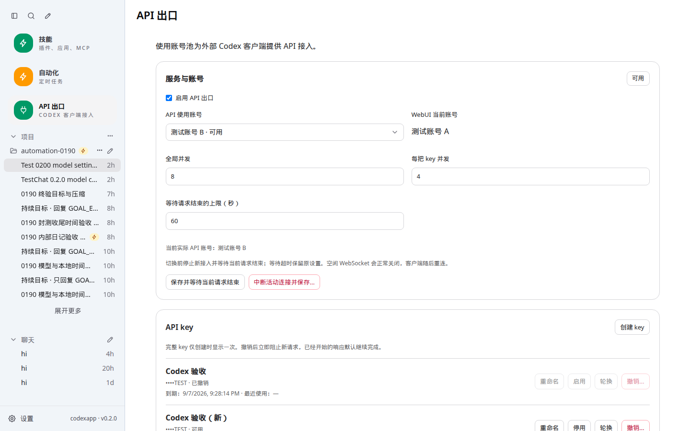
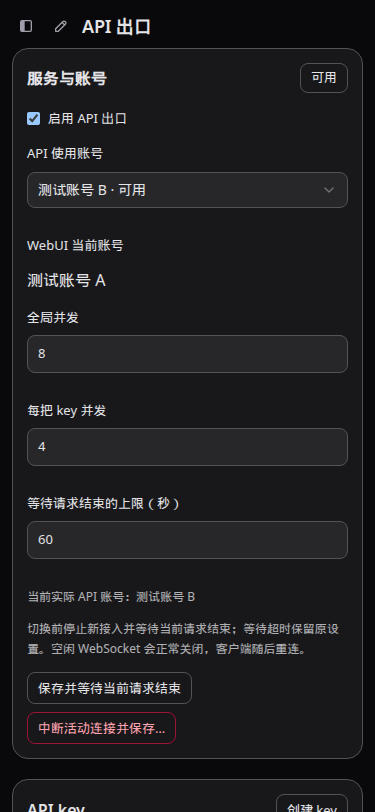

# CodexApp 0.2.0 API 出口实施与验收

用户确认“开始执行”后，已按 [0024 实施方案](20260906-0024-codexapp-0.2.0反代API出口实施方案.md) 完成核心功能，在隔离 **59001** 部署。Codex CLI 是核心；Claude Code 和专门的聊天客户端适配保留可选。此前模型能力验收见 [0023](20260906-0023-codexapp-0.2.0模型能力实施与验收.md)，本文件与新证据覆盖新增 API 功能。

## 交付与使用

入口：`http://192.168.50.46:59001/#/api-proxy`，侧栏位于“自动化”下方。出口默认关闭，验收临时 key 已撤销。打开页面，启用出口、选择账号并保存，再创建自己的 key；完整 key 仅显示一次。

- `POST /v1/responses`：JSON、SSE、编程工具调用与完整上下文续接。
- WebSocket `/v1/responses`：多轮调用、增量续接、文本帧、断开清理。
- `GET /v1/models`：普通目录与 Codex `client_version` 目录。
- `POST /v1/responses/compact`：原生 Responses V2 加密压缩适配。
- `POST /v1/chat/completions`：基础协议通过，未承诺具体聊天客户端的完整兼容。
- API key：命名、编辑、启停、过期、撤销、轮换；轮换默认给予旧 key 24 小时过渡。撤销默认允许已开始响应结束，也可明确中断。
- 账号：默认跟随 WebUI，也可固定使用池中另一个账号。固定 API 账号独立于 WebUI active；没有自动配额切换或随机轮询。
- 活动：展示执行中请求、空闲 WS、最近请求及状态。最近请求仅保留本次运行，最多 500 条/7 天，页面返回最近 100 条，不记录正文。

客户端需要 base URL 与独立 key，不需要复制服务器的 OpenAI 登录信息。Codex CLI 0.153.4 示例（key 在环境变量中设置，不填入文档或提交）：

```toml
model_provider = "codexapp"
model = "gpt-5.6-luna"
[model_providers.codexapp]
name = "CodexApp"
base_url = "http://192.168.50.46:59001/v1"
env_key = "CODEXAPP_API_KEY"
wire_api = "responses"
requires_openai_auth = false
supports_websockets = true
```

模型与推理强度以本出口目录和实际账号权限为准。固定组件 7.2.152 的通用能力表不支持 ultra，但原版 Codex 目录误列了 ultra；出口已从目录移除该选项，手动提交 ultra 明确返回 400，不做静默降级。此限制不影响 WebUI 原生 ultra。HTTP 不接受 `previous_response_id`，调用方应发送完整 input；增量续接使用 WS。跨 key、切换路由后或超过一小时的响应 ID 不可复用。当前不支持的 `prompt_cache_retention`、`safety_identifier` 会明确报错；这不是全部 OpenAI 云端 API 的替代品。

## 组件与账号协调

使用未修改的 **CLIProxyAPI 7.2.152 Linux x64 no-plugin**，固定源提交 `c76dfd4e0edabab9000628b1560ab8ab379eadb8`，原版 MIT 许可证随组件安装。构建阶段校验归档与二进制，运行前再次校验二进制；没有浮动 latest、运行时下载或自动升级。

| 对象 | SHA-256 |
| --- | --- |
| 发行归档 | b5028ae821dc903cc1c2b0a5a0e23a37480a6c52ee73d66f27fc35e204e8d5b8 |
| 二进制 | fc9b13ecda255129b7c452a8c0a84bd0669de0b546d0919f5566cff5397c0c23 |

组件只监听动态 loopback 端口，使用内部随机 key。对外 key 只在 CodexApp 入口校验；管理 API 沿用 WebUI 认证并检查 Origin，外部 key 不授予管理权限。客户端 key、Cookie 不透传到组件；会话与缓存标识按 key 和路由代际隔离。组件控制面、插件、请求日志、配额跳转和自动请求重试关闭，`-local-model` 固定内嵌模型目录。原版组件仍有 Antigravity 版本元数据后台请求，源码中未找到禁用开关；该路径不发送账号认证、不更新二进制，失败回退，不阻塞 Codex 请求。

账号池是 refresh token 的唯一所有者。组件仅收到所选账号的 access token、account ID 和到期时间。API/WebUI 同一账号的刷新合并，revision 校验并原子持久化；固定非 active 账号刷新不修改 WebUI active。新 access token 先启动并验证新组件进程，再接新请求；旧进程只完成在途请求，最多两代。旧 WS 在凭据更新后的新一轮收到重连提示。

状态放在隔离 `CODEX_HOME/api-proxy`，目录 0700、文件 0600，key 仅持久化哈希。59001 使用自己的 `/codex-home` 卷，没有复制 `/root/.codex` 或生产认证。

## G0 发现与修复

1. 当前测试账号的旧 `/responses/compact` 在直连与代理均为 404。依据 [官方 Codex 0.153.4 V2 压缩实现](https://github.com/openai/codex/blob/rust-v0.153.4/codex-rs/core/src/compact_remote_v2.rs)，新增小范围端点适配：向普通 Responses 追加 `compaction_trigger`，只接受 completed 且恰好一项真实 opaque compaction 的返回。保留调用方 user 消息，不制造聊天总结。真实压缩后仅用 opaque 输出续接，仍能回忆虚构事实。
2. 组件初始模型目录可能 HTTP 200 但为空，ready 改为等待非空目录。
3. 首次真实 CLI WS 任务虽然完成，但存在 HTTP 回退，不能作为 WS 通过证据。定位到接入层把 Buffer 默认发送成二进制帧，改为明确文本帧，并增加帧类型回归。最终编程任务 **1 次 WS、0 次 HTTP Responses**，退出 0，代码测试通过。
4. 普通 drain 超时必须保留原组件和在途流，不能在失败清理时停掉组件。增加慢 SSE 回归；断开时活动计数与上游连接及时清理。
5. 高级字段探针发现原版组件的 ultra 目录/执行器不一致，增加有界（4 MiB）目录归一化，只移除明确不支持的 ultra；JSON/SSE 生成流仍直接转发。符合协议形状的 reasoning 加密内容、phase、图片、JSON schema、函数/自定义工具和 priority，在 Luna/Astra max 请求中透传通过。虚构签名不能证明真实解密，真实加密续接由前面的模型请求单独验证。
6. HMR 旧实例清理只能解除自己的账号生命周期注册，不能清空新实例注册。

## 已验证

汇总证据：[0.2.0-api-proxy-verification.json](evidence/0.2.0-api-proxy-verification.json)。真实请求只使用虚构内容和临时工程，报告不含认证、完整请求正文或 key。

| 验证 | 结果 |
| --- | --- |
| `pnpm exec vitest run` | 42 文件、298 项通过 |
| `pnpm run build` | vue-tsc、Vite 与 CLI 构建通过；最终容器 PTY spawn 输出 PTY_OK、退出 0 |
| CJS 入口 | `node -e "process.argv=['node','codexapp','--help'];require('./dist-cli/index.js')"` 退出 0 |
| 固定组件假上游 G0 | 原 G0 14 项，最终补充至 17 项通过：高级字段/ultra 限制、认证、目录、JSON/SSE、压缩路由、WS、多轮、失效 token 不刷新、重新发布、无额外 500 重试、无原始错误日志 |
| 真实候选 API | 两种模型目录、JSON、SSE 编程链、基础 Chat Completions、加密压缩与续接通过 |
| 独立 Codex CLI HTTP | 退出 0，4 个命令工具事件，工程 `node --test` 通过 |
| 独立 Codex CLI WS（修复后） | 退出 0，4 个命令工具事件，1 WS / 0 HTTP，工程测试通过 |
| key/切换/刷新回归 | 过期、撤销持久化、WS 内撤销、跨 key 续接、并发准入、固定账号独立性、刷新合并及非 active 保护通过 |
| Provider/Auth Docker 认证路径 | WS 修复镜像已测；最后仅目录/UI 说明变更，认证代码一致。59011 无认证 Zen、59012 无效认证、59013 畸形认证回退、59014 Zen→OpenRouter；错误刷新后保持，重复 live overlay=0 |
| UI | 59001，1440×900、375×812、768×1024 × 浅深两主题；设置刷新保持、创建/轮换/撤销、强制操作取消、无横向溢出、无页面异常 |
| 实际页面无 fixture | 组件已安装、服务关闭、连接 0；侧栏入口加载正常 |
| 产物一致性 | 本地 dist/dist-cli 30 个文件与最终容器 SHA-256 一致 |
| 共同空闲检查 | activeTurns/queued/pendingApprovals/API connections/activeRequests 全为 0 |

Browser Use 在当前会话不可用，采用 Playwright CJS 和 `/snap/bin/chromium`。UI 六组交互仅 mock `/codex-api/api-proxy/**` 以稳定覆盖双账号与 key 操作；实际接口、真实 CLI、无 fixture 页面另行验证，因此不能把 UI fixture 当作真实双账号验证。





原始截图绝对路径：`/home/Code/codexapp/output/playwright/0200-api-1440x900-light.png`、`/home/Code/codexapp/output/playwright/0200-api-375x812-dark.png`；完整六组及认证错误截图保留在同目录。

## 性能审计

同一固定组件、loopback TLS 假上游 SSE，对比直接请求组件与经接入层；并发 1/4/8 分别采样 8/32/64 次：

| 并发 | 直连 p95 | 接入层 p95 | 差值 |
| --- | --- | --- | --- |
| 1 | 4.76 ms | 5.28 ms | +0.52 ms |
| 4 | 8.44 ms | 11.85 ms | +3.42 ms |
| 8 | 23.58 ms | 18.56 ms | -5.02 ms（小样本调度噪声，不解释为加速） |

测试结束活动为 0。测试进程 RSS 91.7→110.7 MB 包含调用方、mock 和接入层，**不是独立进程长上下文内存结论**。慢 SSE 单测在客户端取消后 300 ms 检查窗口内观察到上游关闭；尚无真实网络取消延迟分位数或长时压测。

首页 profiler 在无其他浏览器交互时复测：thread/list=1、skills/list=1、rateLimits=1、providerModels=0、warnings=[]、83.9 KB，与模型能力候选一致；API 出口首页请求为 0。第一次与 UI 多窗口交互并行的采样出现重复请求，已作为受干扰样本排除。页面不是错误页，也没有停留在 Loading threads。

代码路径审计：API 页面懒加载约 14.88 KB（gzip 5.59 KB），仅页面可见时每 10 秒刷新；无首页轮询。HTTP/WS 使用背压；请求/帧默认 64 MiB，可用 `CODEXAPP_API_PROXY_MAX_BODY_MB` 在 1–128 MiB 配置。连接总数上限 128，每 key 32；并发默认 8/4，无无限排队。响应所有权最多 10000 条，key 最多 256，把 lastUsed 写入按 2 秒合并，组件最多两代，不自动重放 POST。

## 部署、清理与后续封测

本地分支 `feature/model-capabilities-0.2.0`。最终容器 `codexapp-multi-account-dev`，镜像 `codexapp-multi-account-dev:api-0.2.0`，image ID `sha256:e028d8e9594dbdd8d750405e4c3b3aeb95ebb824d6799f659edc54ff05152aff`。CLI 0.153.4 与原有隔离卷保持；构建 Dockerfile 为 `scripts/docker-api-proxy-dev.Dockerfile`，基础镜像为本机已验证的 `codexapp-verified-cli:0.153.4-4c1eee4`。

```bash
CODEXAPP_REPLACE_DEV=1 CODEXAPP_MULTI_ACCOUNT_IMAGE=codexapp-multi-account-dev:api-0.2.0 CODEXAPP_MULTI_ACCOUNT_DOCKERFILE=$PWD/scripts/docker-api-proxy-dev.Dockerfile bash scripts/run-multi-account-dev.sh

CODEXAPP_IDLE_CHECK_URL=http://127.0.0.1:59001 node scripts/check-codexapp-idle.cjs
```

部署脚本先构建再 drain，检查 UI turn、自动化和 API 活动；失败尝试恢复旧容器并恢复接入。旧版 API 豁免须核实运行产物确实不含 API 路径，不能仅凭版本号判断。发布脚本已加入同一活动边界，但本轮没有对生产执行 prepare/activate。

回退候选的旧模型能力镜像仍保留：`sha256:c1a03f1a86aea41f4c4571bdf3fa8be0251304cdd9c93008e3f08b200b3cbe58`。回退前停接新请求并共同空闲，再使用相同卷和挂载恢复旧镜像；保留已轮换认证和 key 撤销状态，不恢复旧凭据快照。具体手工用例见 `tests/accounts-feedback-observability/api-proxy.md`。

验收 key 已撤销、出口恢复关闭、临时客户端工程已删除，专用 59011–59014 容器完成后清理。59001 与既有开发服务保留。**5900 始终保持 0.1.90、PID 2722536；latest-prepared 未改变，未推送、合并或生产切换。**

G4 完整矩阵仍保留人工与长时验证，不把基本编程任务称为全部场景通过。待封测：退出/恢复客户端、真实断网/长推理及长流重启、真实第二账号的独立调用与切换、真实 OAuth 自然到期刷新、全部模型/强度/特殊工具组合及长时长上下文压力。已用 fixture 覆盖协调与隔离，不把这些替代为真实双账号结论。Claude Code、聊天客户端专用适配与其他平台二进制不在本期核心交付。
