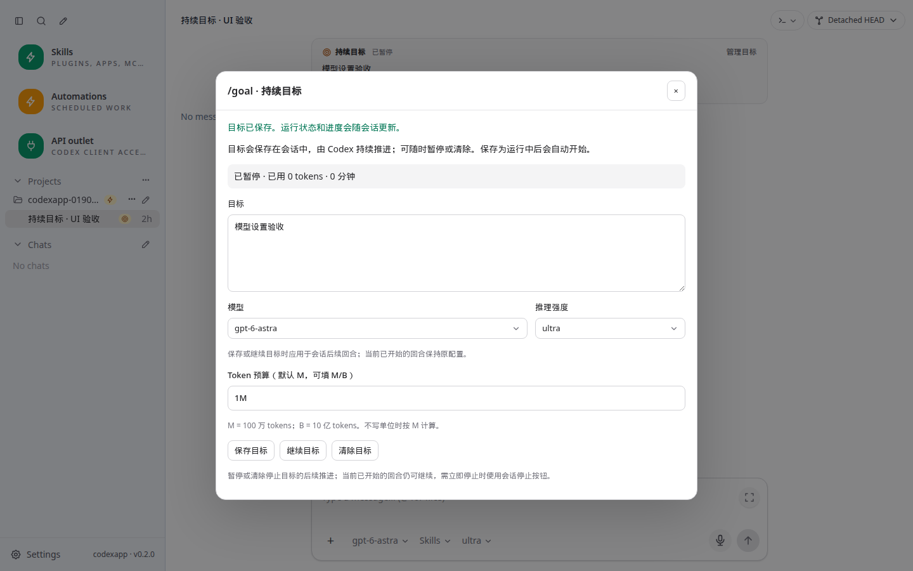
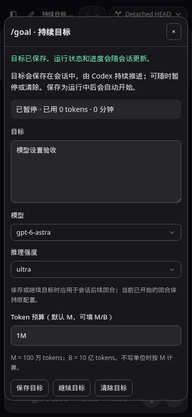

# Goal 模型与推理强度选择

0.2.0 新增：Goal 弹窗提供模型搜索与推理强度选择，复用自动化的 AppSelect、动态模型能力与强度选项。模型切换后不支持的原强度保留并提示重新选择，禁止误提交；不静默降级。模型默认强度使用所选模型目录公布的默认值。

Goal 原生结构不包含 model/effort。保存或继续目标前先调用 `thread/settings/update`，成功后才调用 `thread/goal/set`；设置失败不会激活目标。暂停/清除不更新模型。配置属于会话，应用于后续回合，当前已开始回合保持原配置。新建目标沿用建线程流程，再更新设置并设置 Goal。

打开已有 Goal 使用 `thread/read(includeTurns:false)` 读取实际保存的模型与强度；保存成功同步编辑器选择，刷新后重新读实际值。没有依赖弹窗临时状态冒充持久化。

## 验证

- 全量 Vitest：42 文件、299 项通过；新增原生设置读取/参数回归。
- `pnpm run build`：vue-tsc、前端和 CLI 构建通过。
- CJS：`node -e "process.argv=['node','codexapp','--help'];require('./dist-cli/index.js')"` 退出 0。
- Playwright 使用 RPC fixture 检查 59001 的真实弹窗：1440×900、375×812、768×1024 × 浅深主题，保存顺序、错误阻止激活、暂停/继续、无效强度、刷新保持、自定义菜单及无横向溢出。fixture 没有触发真实 Goal 执行。
- 59001 原生 RPC：创建临时线程，设置 Luna/max，再保存暂停 Goal；thread/read 返回相同 model/reasoningEffort，未产生模型回合。完成后清除 Goal 并归档线程。
- 用户实际长期 Goal 的推进仍由原生 Codex 负责，本次没有启动长期目标。

## 性能与部署

代码路径审计：复用父组件模型目录，没有重复 model/list；仅打开已有 Goal 时新增一次不带历史的 thread/read，与 goal/get 并发。无输入逐键请求、轮询、无界并发或全量历史载荷。命令弹窗保持懒加载；构建块从 8.21 KB / gzip 3.68 KB 增至 9.91 KB / gzip 4.23 KB，增量 gzip 0.55 KB。未进行长时性能压测。

通过现有脚本先构建、共同空闲检查后替换 59001，原独立卷保持。生产 5900 / 0.1.90、PID 2722536 未改变；没有 prepare、推送或生产切换。API 出口保持原状态。

手测用例：`tests/chat-composer-rendering/nonintrusive-slash-command-picker.md` 的 Goal 模型章节。交互证据见 [验收 JSON](evidence/0.2.0-goal-model-verification.json)。

测试 URL：`http://127.0.0.1:59001/#/thread/01900000-0000-7000-8000-000000000018`（虚构线程，由测试路由提供）。

原始截图：`/home/Code/codexapp/output/playwright/0200-goal-model-1440x900-light.png`、`/home/Code/codexapp/output/playwright/0200-goal-model-375x812-dark.png`。测试结束关闭 fixture 浏览器，保留 59001 和既有开发服务。回退时先检查活动归零，恢复上一 API 候选镜像；不恢复旧认证或撤销记录。
