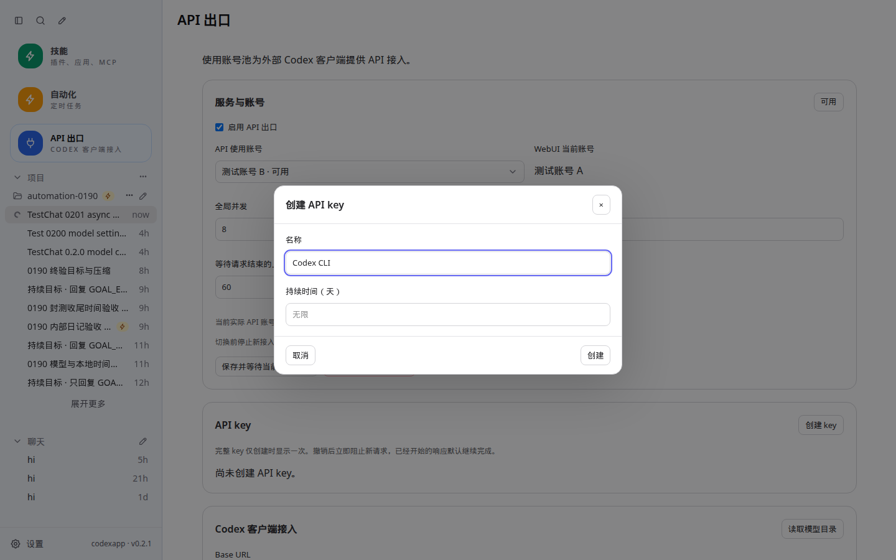
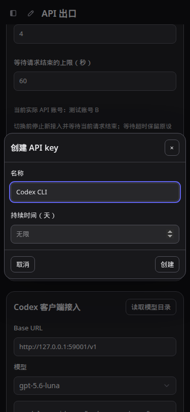
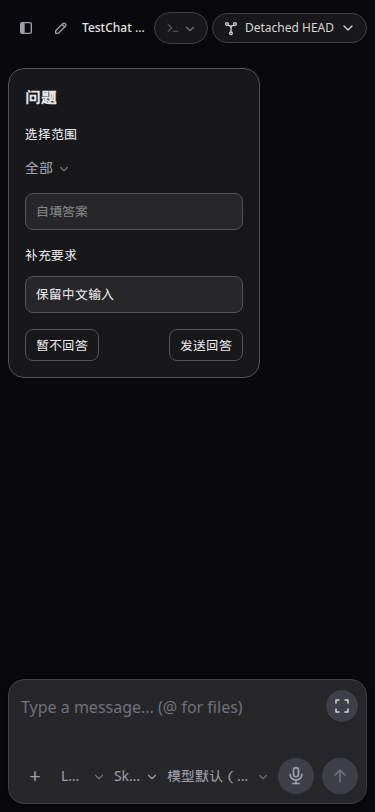
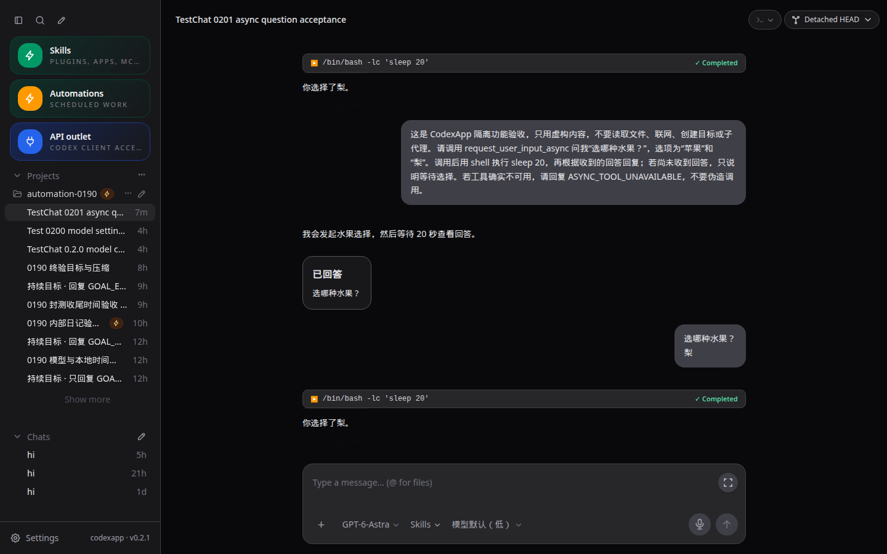
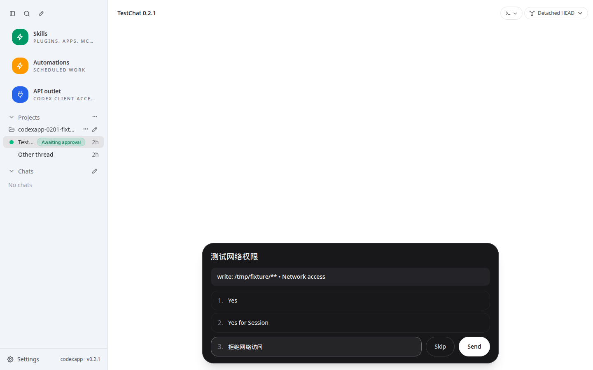
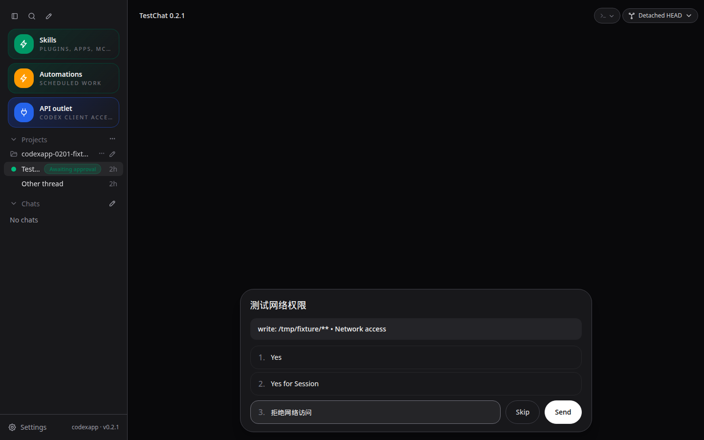

# CodexApp 0.2.1 异步提问与等待状态验收

## 交付

在 0.2.0 基线 f9aa354 上完成首个后续版本。59001 当前运行 **0.2.1**；本地分支 `feature/0.2.1-async-input`，主功能提交 `3113a2a`，权限兼容收尾 `1244203`，API UI 独立提交 `70bf281`。完整连续开发范围仍见 [0028](20260906-0028-codexapp-0.2系列连续开发与验收.md)，本版本通过后顺序进入 0.2.2。

- `isBlocking=false` 的问题卡片保留正文输入；普通聊天不再猜成问题答案。缺省/true 维持旧阻塞行为。审批优先显示，处理后恢复其他问题。
- `agentMessage.questions/delivery` 统一保留在实时与历史消息中。卡片支持预选、自填、暂不回答和显式发送；自由文本覆盖默认选项，不自动提交。旧问题无 options 时也有输入框，isSecret 使用密码字段。
- 回答绑定线程、turn 和问题序号，保留原始 item 标识。用户可见消息是问题及答案，绑定标记由归一化层隐藏；刷新后从真实用户消息恢复已回答状态。
- 凭据恢复开始/结束由原生通知驱动；现有 pending 请求响应附带快照，刷新可恢复。turn 结束及进程停止清除恢复中状态，不把恢复完成等同于请求成功。
- API 出口侧栏改为蓝色图标与浅/深蓝色选中状态；key 创建/轮换弹窗扩大至 560px 上限，名称和持续时间分行。空白表示无限，正整数为天数，提交时计算 expiresAt。旧 key 轮换仍保留 24 小时过渡。

## 协议与修复证据

2026-09-06 核对 [官方稳定版 0.153.4](https://github.com/openai/codex/releases/tag/rust-v0.153.4)，与运行容器一致；重新用独立 CODEX_HOME 导出 experimental schema，没有升级生产。依据该版本 [异步提问实现](https://github.com/openai/codex/blob/rust-v0.153.4/codex-rs/core/src/tools/handlers/request_user_input_async.rs)，工具立即返回，答案作为普通用户消息提交，不虚构回答 RPC。

真实验证发现：运行中的历史可能使用 `item-N` 临时 ID，完成后变成原始 call ID，仅绑定 item ID 会丢失已答状态。最终在发送前读取一次当前线程，按 turn 内问题序号绑定；同 turn 同标题问题仍有不同序号。原失败首轮保留为证据，修复后在同一线程开启第二轮：结构化提问、UI 选择“梨”、实际模型确认、候选重启和浅深色刷新均通过，回答只发送一次。

候选 UI 矩阵还复现旧快照覆盖实时问题的竞争：HTTP pending 快照在 WebSocket 新问题之后到达，会清空新问题。最终在读取期间记录新增/解除事件，并按顺序合入快照；不额外轮询。补充定向回归后六组候选 UI 全部通过。

## 验收结果

| 检查 | 结果 |
| --- | --- |
| 全量单测 | 44 文件、309 项通过 |
| 构建 | vue-tsc、Vite、CLI 构建通过；依赖清单保持相同，仅版本变更可复用已验证依赖镜像 |
| CJS/原生 PTY | CLI require/help 退出 0；容器 node-pty 输出 PTY_0201_OK、退出 0 |
| UI 矩阵 | 59001，1440×900、375×812、768×1024 × 浅/深主题，提问与 API 各六组，无页面异常 |
| 问题交互 | 默认不提交、自由回答、暂不回答、审批优先、旧阻塞问题、回复失败保留内容后重试、临时 ID 变化及刷新恢复通过 |
| TestChat | 六组唯一标记，文件链接 href/title/text 断言通过，回答绑定注释不进入可见消息 |
| 真实异步问题 | 线程 01a07731-5913-7282-8a90-9a21132de285，Astra/low；最终回合 01a07736-f4e0-7830-9664-e2d253703791；只用虚构内容及 sleep 20，无子代理或业务文件访问 |
| 真实 key | 无 fixture，创建无限与 3 天 key，API 状态与刷新一致；临时 key 全撤销，出口设置保持原值 |
| 打包认证矩阵 | 59011 无认证→Zen；59013 畸形认证→Zen；59012 合成失效认证错误在浅深主题刷新后保持，重复 live overlay=0；59014 Zen→OpenRouter 占位 key 配置切换 |
| 产物一致性 | 本地 dist/dist-cli 30 个文件与候选逐字节一致 |
| 最终空闲 | activeTurns/queued/pendingApprovals/API connections/activeRequests 均为 0 |

最终打包镜像再次完成四端口认证矩阵；另外完成切换线程返回、多并发问题、模拟 IME、MCP 表单和权限拒绝的浅深主题检查。新版权限 entries 路径/通配符可见，拒绝使用空权限响应，并保留用户说明，不再返回通用 RPC 错误。不能将合成失效认证当作真实 OAuth 到期或双账号验收。物理输入法/软键盘归入 0.2.8；本轮模拟视口和输入验证不替代真机。长历史与旧页中的问题核对继续纳入 0.2.2 压力矩阵。

原生测试中的首次失败不是通过证据。认证矩阵重复使用被强制结束的旧测试卷时，曾触发调度锁 120 秒恢复等待；确认该容器仍活着后改用全新合成状态卷完成隔离矩阵。最终清理使用 stop 后 rm，避免再次留下测试锁。没有动真实候选或生产的锁文件。

## 性能

最终 59001 首页总 API **85.3 KB**，thread/list=1、skills/list=1、rateLimits=1、provider-models=0；真实验收线程 **85.7 KB**、resume=1、全文 read=0。两份 warnings 为空，无错误页或持续 Loading。数据集包含新增测试线程，不能与旧版总字节数直接换算性能提升。固定 7 秒采样等待不是可交互时间。

新增凭据快照最多 100 个线程，消息提示最长 2000 字符，附在现有接口中；提问卡片只渲染当前可见消息，不订阅额外线程。显式回答增加一次当前线程核对请求，输入/选择不请求模型。快照合并只保存当前读取期间的差量并在结束后释放。未增加后台轮询、包依赖或请求自动重试。长线程的完整历史读取和更大规模压力按 0.2.2 继续处理。

最终构建主 JS 约 579 KB，仍有超过 500 KB 的构建提示；没有以源码拆分或本轮短线程测量宣称长历史已优化。

## 截图与复查命令

以下截图 URL 为 `http://127.0.0.1:59001/` 的 API/内部 TestChat 路由。原件均在 `/home/Code/codexapp/output/playwright/`，与下列文件同名。API 弹窗桌面 1440×900 浅色，名称与持续时间分行；手机 375×812 深色无横向溢出。





结构化提问，375×812 深色，表单与正文输入同时可用：



真实线程，1440×900 深色，最终回答在候选重启与页面刷新后仍标为已答：



权限请求，1440×900 浅/深色，URL `http://127.0.0.1:59001/#/thread/02010000-0000-7000-8000-000000000001`；路径、glob 与网络权限可见，拒绝返回空权限并保留说明。原件绝对路径为 `/home/Code/codexapp/output/playwright/0201-permissions-light.png` 与 `/home/Code/codexapp/output/playwright/0201-permissions-dark.png`。





```bash
pnpm exec vitest run
pnpm run build
node -e "process.argv=['node','codexapp','--help'];require('./dist-cli/index.js')"
QUESTION_UI_BASE=http://127.0.0.1:59001 node output/0201/verify-questions.cjs
API_UI_BASE=http://127.0.0.1:59001 node output/0201/verify-api-ui.cjs
node output/0201/recheck-actual.cjs
node output/0201/check-artifacts.cjs
PROFILE_BROWSER_EXECUTABLE=/snap/bin/chromium PROFILE_BASE_URL=http://127.0.0.1:59001 PROFILE_WAIT_MS=7000 pnpm run profile:browser
CODEXAPP_IDLE_CHECK_URL=http://127.0.0.1:59001 node scripts/check-codexapp-idle.cjs
```

Browser Use 不可调用；Playwright CJS 用于 API/WS 拦截、状态重放和真实页面复查。详细证据见 [0.2.1 验收 JSON](evidence/0.2.1-verification.json)；原始脚本、构建、单测与真实调用记录在 `output/0201/`。手工步骤见 `tests/chat-composer-rendering/async-questions-and-wait-states.md` 和 API 出口用例。

## 运行与回退

当前镜像 `codexapp-multi-account-dev:ui-0.2.1`，SHA-256 `3b7e456d03f522d0218c4237e1a6dada09fb47f019d745f798f907c8817f8ffa`。独立 CODEX_HOME 卷与原挂载保持，替换由部署脚本先构建再 drain/空闲核验。

回退基线保留 `codexapp-multi-account-dev:api-0.2.0`，image `2adb13d741c3`；回退前停止新接入并共同空闲，仅替换应用镜像，保留认证轮换和 key 撤销记录。无需回退用户数据格式，回答仍是普通线程用户消息。

5900 继续运行 0.2.0、PID 3456650，本轮没有重启、prepare/activate、推送或合并。0.1.90 以前的可选清理尚未执行，避免删除构建依赖基础镜像；后续收口统一核对。下一版为 0.2.2，最终全量代码、功能、UI 审核及系列使用说明仍在 0.2.9 完成，不因本版验收而宣称整个目标完成。
