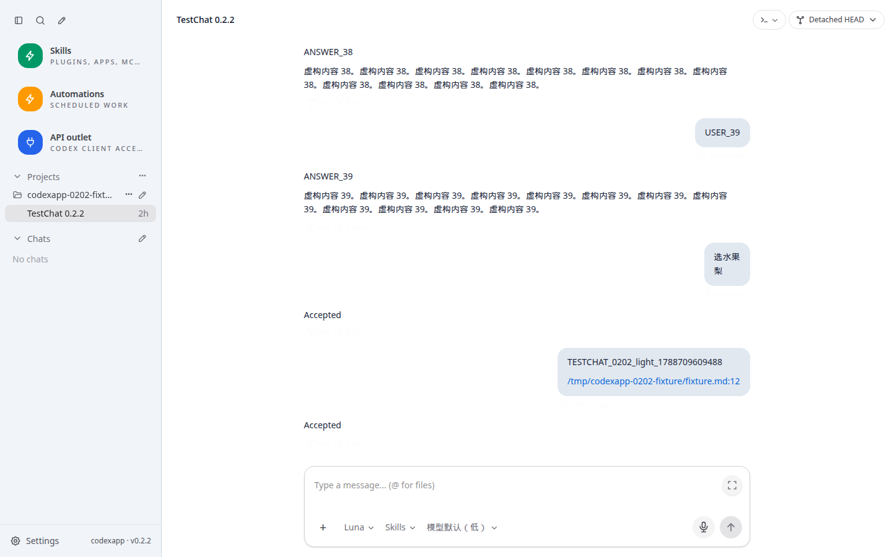
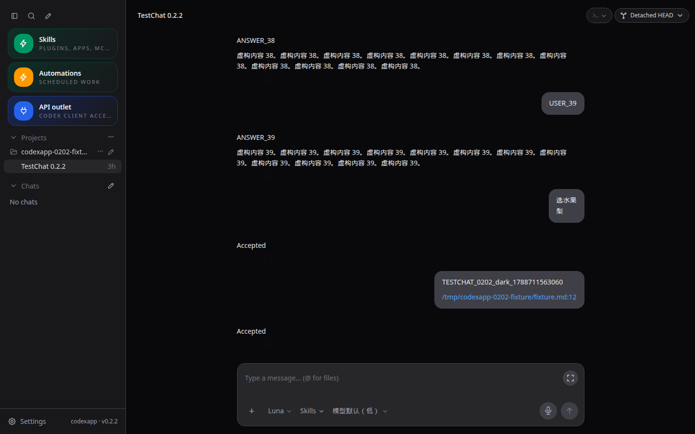
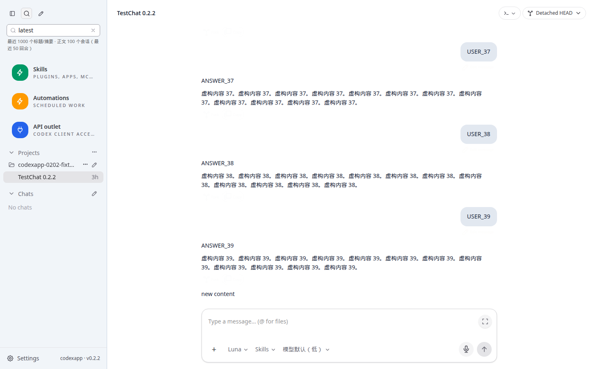
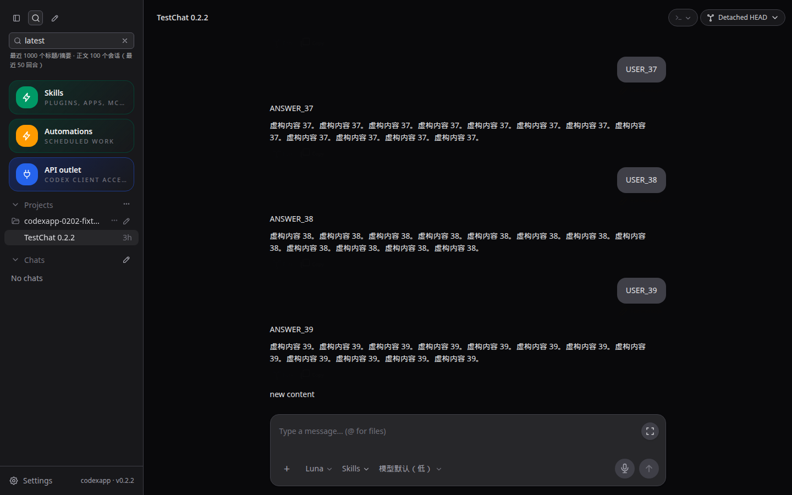
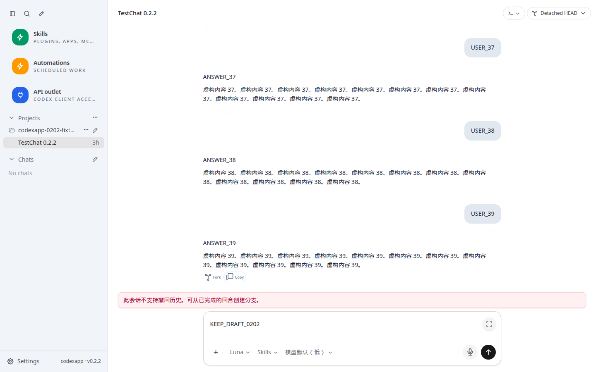
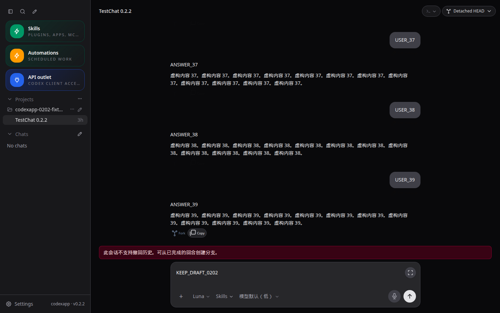
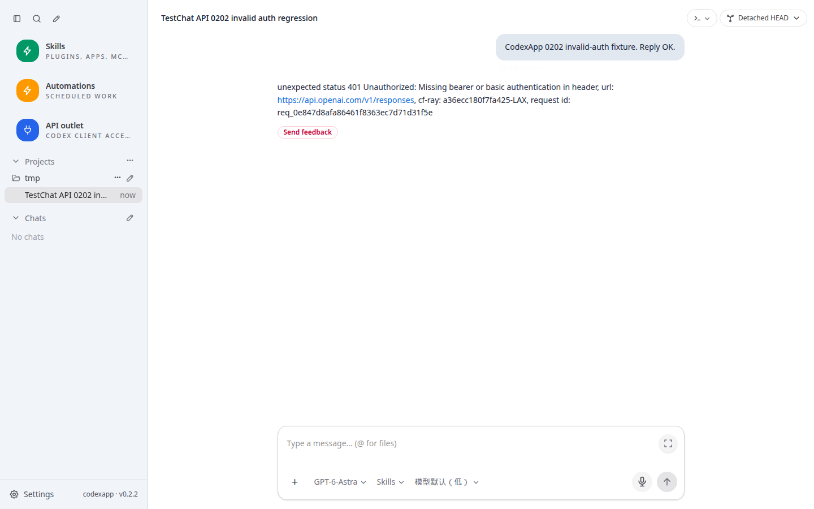
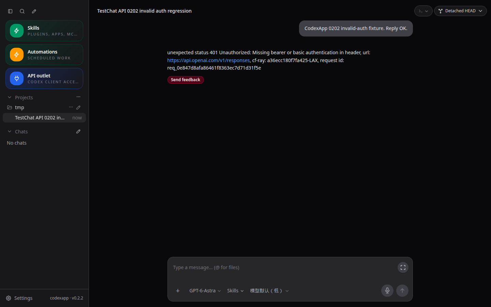

# CodexApp 0.2.2 历史搜索与分支实施

## 基线与范围

0.2.1 已完成 59001 验收，代码提交 1244203、文档提交 e9578a1。当前分支 feature/0.2.2-history-search。沿用用户在 0028 中的连续开发授权，逐版核验后进入下一版；本版不发布 5900、不推送或合并。

当前 59001 固定 CLI 0.153.4。2026-09-06 已实测 thread/turns/list、thread/items/list 和 thread/resume.initialTurnsPage，原生返回游标、itemsView 与真实 turn ID。实施前桥接分页先整线程 read 再截取；搜索只有首次构建且正文仅最近 100 个线程，界面没有明确范围。原始探测位于 output/0202/native-probe.json。

## 实施

1. 分离历史适配器：恢复线程附带最近 10 turn 的完整项目页，重读用 metadata + 原生游标页；旧页传递不透明游标，禁止客户端解析或伪造。消息按时间顺序归一化，ID 用于交互，turnIndex 仅供当前已载入连续区间的展示分组。旧页合并保留已有展开和滚动锚点，空 turn 仍计入顺序。
2. 对旧版本或明确不支持分页的线程使用受限回退，读取前核对历史文件大小，缓存设数量、字节、时间上限；普通网络/认证/参数错误直接报错，不以全文读取掩盖。已知超限给出清楚错误，不假装没有旧历史。
3. 按需 thread/items/list 核对单个历史 turn 的提问，保持完整 turn 内问题序号与附件；按游标分批读取并设上限。回答老问题同时检查已加载及最新记录，保留 0.2.1 的明确回答绑定。
4. 搜索保留应用适配器，元数据与正文分别缓存；新消息、重命名、归档、回滚和导入使相关条目失效，读取中发生变化不发布旧缓存。每次查询可取消，取消后停止后续分页/批次，限制全局读取并发。界面显示非归档线程标题覆盖量、最近正文线程/turn 范围，达到限制或部分失败时如实提示；不暗示完整全局正文搜索。
5. 历史分支以真实 lastTurnId 直接 fork，延后继承 Goal 的自动续跑，避免完整 fork 后 rollback；活动 turn 或不支持精确分支时明确失败，不悄悄分到错误位置。
6. 更新能力快照中应用已支持的 asyncQuestions/nativeHistoryPaging，补相应手工用例与性能记录。不升级依赖，不更换队列实现。

## 核验与性能门槛

先使用虚构 10/100/1000 turn 测量 0.2.1 的初载、旧页与全文读取成本。新实现必须在原生分页场景不再向桥接请求完整历史，初载只返回 10 turn；每次加载旧页只请求下一页，加载新页不得丢失旧页和图片/技能/文件链接。不能仅靠 HTTP 字节减少宣称 CLI 内部扫描也消失。

覆盖页内空 turn、多个问题、活动 turn 与旧页交替、游标错误/旧线程、读取失败重试、线程切换、刷新、精确分支首中尾与活动边界；搜索覆盖新增/重命名/归档/并发取消/缓存失效竞争。采集 RPC 次数、字节、耗时和缓存行为。

全量单测、类型检查、构建、CJS/PTY，4173 与最终 59001 浅深 UI、TestChat 链接断言及性能采样；涉及聊天响应/包运行的认证矩阵仍按仓库规则验证。真实模型只使用内部虚构任务；长历史可通过隔离状态 fixture 构造，不能声称是 1000 次真实模型调用。

## 交付与回退

最终产物镜像与运行文件逐字节核对，59001 共同空闲后更新，保留 0.2.1 镜像与独立卷。无认证迁移、持久队列迁移或用户历史改写。文档同步真实 Obsidian Vault 并比较一致。完成本版验收报告后进入 0.2.3；在此之前不把 0.2.2 记为完成。


## 历史子任务进度（尚未完成整版验收）

历史分页、单 turn 提问核对、精确分支及增量 skill 恢复已实现，本地提交 4f787d9。旧浏览器只传 beforeTurnId 时走有界旧协议兼容路径，原生游标错误不会悄悄返回最近页。旧页失败在按钮旁显示原因并允许手动重试；最新一整页为空 turn 时仍能继续加载。回退完成后清理旧游标并重新读取，展示序号只用于已载入连续区间。

- 46 个测试文件、324 项通过；类型检查、前端/CLI 构建及 CJS require/help 退出 0。
- 4173 浅/深主题，1440×900；旧页失败重试、空 turn、图片/技能/文件链接、旧问题回答与刷新已答恢复、真实 turnId 分支参数通过。TestChat href/title/text 全部通过，pageErrors 为空。
- 真实 CLI 在隔离 dev state 将 1000 turn 虚构线程直接分支到第 51 个 turn，最后 ID 与请求完全一致，无模型调用。首/末及活动边界的完整矩阵在最终 59001 验收继续覆盖。
- 修正初始 fixture 格式后，0.2.1 的 1000 turn 全文重读约 456 ms、旧页约 436 ms，直接调用原生 10 turn 页约 8 ms。这是同一候选内的基线探测。新 dev 适配器重读约 95 ms、旧页约 52 ms；dev 与打包候选不是直接可比环境，最终优化结果必须在 59001 同条件复测。HTTP 正文约 60 KB 均只含 10 turn，主要目标是减少桥接内部全文读取，而非声称响应字节下降。
- 技能恢复首次流式扫描，之后读取追加区间；保留跨 chunk/未完成行状态，并用纳秒时间戳识别同大小改写。旧线程全文回退单文件/响应 8 MB，缓存最多 10 项/32 MB/30 秒。

证据见 [历史子任务 JSON](evidence/0.2.2-history-progress.json)，脚本与日志位于 output/0202。以下截图测试 URL 为 `http://127.0.0.1:4173/#/thread/02020000-0000-7000-8000-000000000001`，1440×900；原件绝对路径分别为 `/home/Code/codexapp/output/playwright/testchat-0202-history-light-cjs.png` 和 `/home/Code/codexapp/output/playwright/testchat-0202-history-dark-cjs.png`，检查真实消息行、文件路径和刷新恢复。




以上为历史子任务当时的记录。最终候选验收结果见下文。

## 最终验收（2026-09-07）

59001 已运行 0.2.2，代码提交 `ea3bcf1`；历史主功能 `4f787d9`、搜索 `114cfd3`、快速改写缓存修复 `2efdf83`。固定 CLI 0.153.4，未升级依赖。镜像 `codexapp-multi-account-dev:ui-0.2.2`，镜像 SHA256 为 `3b2018181c9f76080bd725d466c5772c8e5341355a7f70be7961065df42624b5`。本地与容器内 dist/dist-cli 共 30 个文件逐字节摘要一致，完整证据见 [0.2.2 验收 JSON](evidence/0.2.2-acceptance.json)。

搜索现在分别缓存标题/摘要和最近正文；新回合、消息完成、重命名、归档、恢复、回滚及导入会触发相应失效。读取过程中发生变更最多重新核对一次，仍变化时明确报错。取消查询停止后续批次，等待已有请求结束再放行后续查询；同一桥接最多 4 个正文读取，不虚构 CLI 的原生取消能力。服务端范围为最近 1000 个非归档标题/摘要、最近 100 个会话各 50 回合和最新 20 万字符；界面显示覆盖范围和失败数量。正文缓存最多 100 项、32 MB UTF-8 文本，非 JS 总堆内存上限。

验收发现并修复两项边界：

- CLI 明确拒绝 paginated 线程的 `thread/rollback`。现在先读元数据确认支持，再进入整段文件撤销；客户端遇到文件撤销错误停止后续对话撤回，失败保留草稿。提示可从已完成回合创建分支。单回合 diff 的文件 undo/redo 保持独立语义。legacy 撤回仍是既有的分步操作，本版不宣称文件和 CLI 历史之间已实现原子事务。
- 仅用纳秒时间戳仍可能漏掉同一文件系统时钟周期内的快速改写。技能缓存增加最多 8 KB 的首尾内容核对；追加时还核对旧 EOF，最多读取两组边界。首次仍流式扫描、追加只解析新增区间。这不是任意外部文件修改的全文校验；同时间戳且绕过边界的内部改写不保证即时发现。

### 验证结果与性能

| 检查 | 结果 |
| --- | --- |
| 单测 | 47 文件、335 项通过；随后扩充快速变大改写用例，相关 13 项再次通过 |
| 类型/构建 | `pnpm exec vue-tsc --noEmit`、`pnpm run build` 通过；229 个前端模块，主 JS 584.66 kB / gzip 184.98 kB，CLI 709.09 KB；保留已有大 chunk 警告 |
| CJS | `node -e "process.argv=['node','codexapp','--help'];require('./dist-cli/index.js')"` 退出 0；真实候选 node-pty `require` 导出 spawn，PTY 执行 `printf PTY_0202_OK` 退出 0 |
| 历史 | 真实 CLI 的 10/100/1000 turn 初载均返回 10 turn；旧页、首中尾精确 fork、无效游标拒绝通过；试验分支完成后归档 |
| 活动分支 | 59012 合成无效认证线程实际处于 inProgress 时，CLI 拒绝对应 lastTurnId；测试随后中断 |
| 搜索 HTTP | 59001 实际 23 个正文会话：首次约 988 ms，缓存约 5 ms，失败 0；重命名、归档、恢复结果正确；1000 标题/100 正文上限由 1200 会话单测夹具验证，不冒充同规模实时测量 |
| UI | 4173 及最终 59001，1440×900 浅/深主题；旧页失败重试、空页、技能/图片、历史问题回答及刷新、真实 turnId、TestChat href/title/text、查询竞争/失效/错误恢复、撤回失败保留历史和草稿全部通过；pageErrors 为空 |
| 0.2.1 回归 | 59001 真实异步问题的已回答状态在候选重启、刷新后浅深主题均恢复，无新模型调用 |
| 打包认证 | 59011 无认证 Zen、59012 合成无效认证 Codex 错误刷新保留、59013 损坏认证 Zen、59014 Zen→OpenRouter 配置切换通过；重复 live overlay 为 0；测试后停止并移除这四个容器 |

同一候选环境、同一虚构 1000 turn 文件，0.2.1 基线与 0.2.2 观测：

| 操作 | 0.2.1 | 0.2.2 |
| --- | ---: | ---: |
| resume | 910 ms | 161 ms |
| 重读 | 456 ms | 90 ms |
| 旧页 | 436 ms | 56 ms |

两版 HTTP 均约 60 KB/10 turn，改进来自不再先全文读取再截取。以上是单次样本，不是稳定 P95。0.2.2 首个 10 turn resume 493 ms 包含冷能力探测，不能混为纯分页成本。不能据此断言 CLI 内部不扫描文件，或超大单 turn 输出不占内存。

最终 59001 首页和 1000 turn 页面各采样 7 秒：总 API 为 88.8 / 142.9 KB，thread/list 首次页各 1 次，线程页 resume 1 次、read 0 次，skills/list 和 rateLimits/read 各 1 次，重复 read 0，warnings 为空，真实页面已就绪。两页已有 `/prompts` 各 2 次；本版未新增该调用，列入最终性能审核。配额读取分别约 2155 / 1453 ms，线程页 resume 242 ms；网络配额读取不是历史分页耗时。搜索复用已有 WebSocket，不增加后台全量扫描；取消中的原生调用仍可能等待 RPC 超时。

### 截图与复核命令

历史、搜索、撤回的测试 URL 均为 `http://127.0.0.1:59001/#/thread/02020000-0000-7000-8000-000000000001`，1440×900；使用请求/通知夹具，真实 CLI 的边界另由 HTTP 测试证明。认证 URL 为 `http://127.0.0.1:59012/#/thread/01a07784-3cd9-7691-80a7-a706ce8f39cd`，同视口，真实合成认证错误。原截图绝对路径以 `/home/Code/codexapp/output/playwright/` 为前缀，文件名分别是 `testchat-0202-history-{light,dark}-cjs.png`、`0202-search-{light,dark}.png`、`0202-rollback-{light,dark}.png`、`0202-invalid-{light,dark}.png`，JSON 同时记录具体路径。
















复核脚本和日志位于 `output/0202/`：

```bash
node output/0202/history-candidate.cjs
HISTORY_BASE=http://127.0.0.1:59001 node output/0202/search-http.cjs
HISTORY_BASE=http://127.0.0.1:59001 node output/0202/history-ui.cjs
HISTORY_BASE=http://127.0.0.1:59001 node output/0202/search-ui.cjs
HISTORY_BASE=http://127.0.0.1:59001 node output/0202/rollback-ui.cjs
node output/0202/recheck-actual.cjs
node output/0202/auth-matrix.cjs
node output/0202/start-invalid.cjs
node output/0202/auth-ui.cjs
PROFILE_BROWSER_EXECUTABLE=/snap/bin/chromium PROFILE_BASE_URL=http://127.0.0.1:59001 PROFILE_WAIT_MS=7000 pnpm run profile:browser
PROFILE_BROWSER_EXECUTABLE=/snap/bin/chromium PROFILE_BASE_URL=http://127.0.0.1:59001 PROFILE_ROUTE='#/thread/01a07750-0202-7000-8000-000000001000' PROFILE_WAIT_MS=7000 pnpm run profile:browser
```

认证脚本需使用未占用端口、新的专用卷；其中只有占位无效凭据，不读取生产认证。自然到期、第二真实账号、物理手机 IME 未在本版实测，按系列计划保留后续验证边界。

59001 最终 activeTurns、queued、pendingApprovals、apiConnections、apiActiveRequests 均为 0。5900 保持 0.2.0、PID 3456650；没有推送、合并、prepare 或 activate。保留 0.2.1 镜像和候选状态卷；本版不需要数据迁移。至此可进入 0.2.3；全系列最终审核、说明书和全局显示时区仍按 0028 顺序实施。
