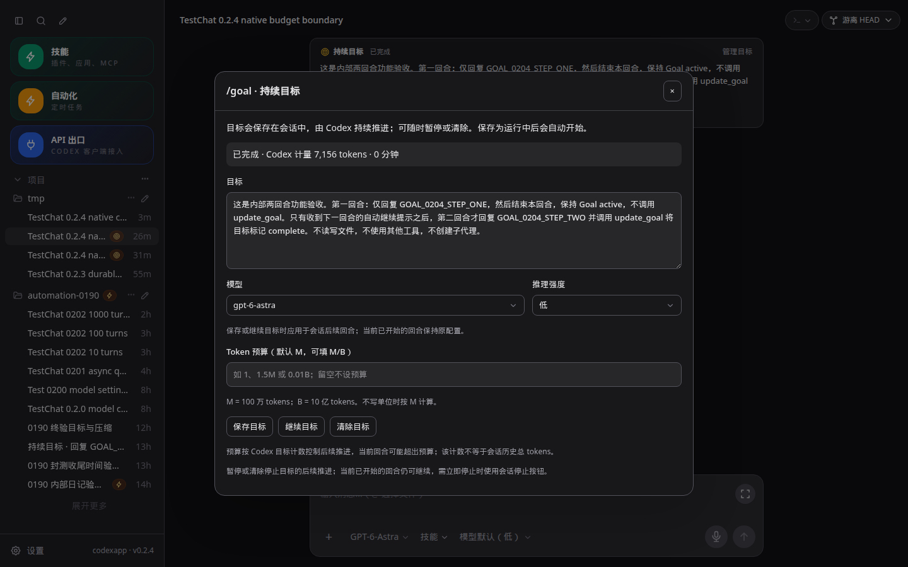
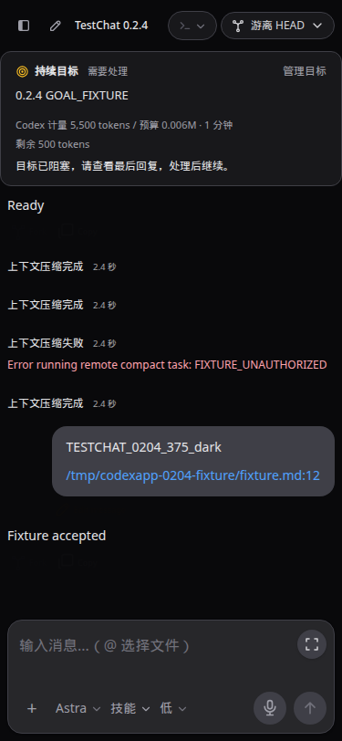

# CodexApp 0.2.4 目标与压缩实施

## 范围与基线

承接连续开发授权和 0.2.3 验收提交 `7c369db`，只开发及更新 59001 候选，固定 CLI 0.153.4。生产 5900 保持 0.2.0，不推送、不合并、不切换。全局显示时区按用户追加要求保留在 0.2.8。

## 协议与现状

[原生 Goal 协议](https://learn.chatgpt.com/docs/app-server#manage-a-thread-goal) 提供持久状态、目标、预算、总用量和耗时；本机生成的 schema 不提供结构化阻塞原因或子任务分项。应用不从普通文本猜出一个阻塞原因，也不把子线程历史 token 再加进 Goal 总数。子任务归属另做固定 CLI 的原生核验，未验证前不作包含承诺。

[原生压缩协议](https://learn.chatgpt.com/docs/app-server#trigger-thread-compaction) 的空响应仅表示接收，实际结果由 turn 与 contextCompaction item 生命周期给出。现有通用事件摘要没有完整区分开始、完成、失败或中断。

现状需修复：保存 Goal 对非 paused 状态统一写 active，可能恢复 blocked/预算已到/已完成目标；始终重送 objective 可能在终态重置用量；目标读取失败未在会话展示；重连只靠窗口 focus；压缩返回后仍能重复点击且缺少恢复结果。

## 实施步骤

1. 在独立测试线程验证 Goal 状态、相同目标与预算更新、清空预算、终态恢复及重启；确认原生允许的操作。补充状态文案和预算剩余/超额反馈，保存内容与主动恢复分开，继续保持“暂停 Goal”与“停止当前回合”的语义。
2. 复用已有有界 Goal 批量读取，重连时刷新可见会话并避免通知被旧快照覆盖；读取失败保留现有状态并提供显式重试。不会额外读取完整历史或持续轮询。
3. 给 contextCompaction 增加统一的实时/历史状态表示，以原生 item 与 turn 的实际结果判断完成、失败和中断。手动请求等待确认期间防止重复提交；刷新/重连从原生历史和状态恢复，结果不明先检查，不自动重发压缩。
4. 对主目标与子任务总用量进行可控原生验收；总量始终来自原生 Goal，未公开分项不制造分摊。UI 保持简洁，说明只出现在相关状态/管理位置。

## 验收与回退

单测覆盖预算边界、终态保存/恢复、快照竞争、压缩完整生命周期与失败/中断/旧事件。浏览器覆盖 1440×900、375×812、768×1024 的浅深主题，保存与刷新、断线恢复、失败与重试、草稿保留，以及实际 changed UI；聊天事件渲染变更加 TestChat。真实 Goal/压缩在 59001 独立测试线程验收，绝不操作当前开发 Goal。

每版完成全量单测、typecheck、build、CJS/PTY、适用的打包认证矩阵和产物逐文件核对；复用浏览器 profile 检查请求次数、载荷、缓存失效、阻塞工作及无界并发。替换候选前核验共同空闲，保留 0.2.3 镜像 `927aaf1aac7d156fa33ab70be6f759f7dc59d5cb64d386a0387b9f8376357ec0` 与独立认证卷。回退只恢复产物，不回滚认证、队列或用户状态。

详细结果与使用步骤在验收后补齐，同步真实 Obsidian Vault 并核对内容一致。

## 实施进展与原生边界

源码已接通状态保留、预算单独保存、旧表单冲突提示、当前 Goal 重连刷新，以及压缩的实时/历史反馈和手动请求核对。Goal 通知不再引发无关 thread/list。验收复现快速结束回合被近期历史缓存挡住：增加事件修订号，显式刷新使快照失效；读取期间到来的完成通知保留其运行状态并合并一次后续读取。

当前 57 个测试文件 / 393 项通过，类型检查、构建和 CJS/PTY 通过。4173 六组视口/主题的 Goal、压缩生命周期、失败/中断刷新、请求响应丢失核对和 TestChat 均通过。以上为候选前检查；最终验收如下。

固定 CLI 的原生测试证实：预算可独立修改或清空而保留状态；已完成目标可用单独 status 更新恢复。真实两回合 Goal `01a07802-f1fd-7922-b20d-46f9974cfcea` 的 1-token 预算在首回合后触发 budgetLimited，原生计数为 7156；增加到 100000 只更新预算，明确继续后才推进并完成。因此预算控制后续推进，不能承诺逐 token 的严格上限。

另一个真实单回合 Goal 在完成时原生报告 0 tokens，而其 CLI 历史包含非零输入/输出用量。Goal 计量与包含缓存的会话历史总 token 并非同一口径，不能将两者相加或直接相等；0 也不能被解释为没有模型使用量。UI 明确标为 Codex 计量，并在已运行但原生报告 0 时隐藏推算的剩余预算。未修改 CLI 或伪造原生计数。

子任务计量的数据链核对：当前 Goal schema 只提供一个 tokensUsed 和 timeUsedSeconds，没有子任务分项或结构化阻塞原因；应用直接呈现原生目标统计，不遍历子会话、不叠加历史用量、不推断缺失分项。本轮没有新启动子代理做计费归属的实测，分项统计继续保持不提供的边界。

原生压缩成功会保存 contextCompaction item；固定 CLI 的无认证失败经过原生重试后只留下 failed turn 和错误，没有该 item。UI 识别经本轮实际验证的原生 compact-task 错误前缀；已持久化的成功压缩不会因同回合较晚的其他错误而被改成失败。手动请求保存当前浏览器的关联 turnId；缺失该关联且历史无条目的旧中断回合不猜用途。检查最多读取 20 个近期回合，不自动重发。

## 最终验收

0.2.4 已在 59001 完成应用侧验收，可以进入 0.2.5。最终行为提交 `71538233b9a3c941fb02fc15dfe11e1398c9126c`；镜像 `codexapp-multi-account-dev:ui-0.2.4`，SHA `d5dc92cc2d551b23d9c3212da396769aa4801dd4cf6012ecc22f647d62b3d2d7`；包 SHA256 `10d4f135498f8d28f8516b4c04c2787ae54b14e425cda86f20fc8902a5e02fcf`。容器内 dist/dist-cli 的 30 个文件与本地构建一致，CLI 固定 0.153.4。

补测修复了两处实际边界：分页恢复中断压缩时保留原回合索引和时间顺序；原生失败后处于 systemError 的会话允许显式压缩重试，仍拒绝 active 和 notLoaded。两项定向回归及最终全套 57 文件 / 393 项测试通过。

| 检查 | 命令与结果 |
| --- | --- |
| 单测 | `pnpm run test:unit`，57 文件 / 393 项通过 |
| 类型和构建 | `pnpm run build`，vue-tsc、Vite、CLI 均通过 |
| CJS | `node -e "process.argv=['node','codexapp','--help'];require('./dist-cli/index.js')"`，输出 help，退出 0 |
| PTY | `require('node-pty').spawn('/bin/sh', ['-c', 'printf PTY_0204_OK'])`，真实输出 PTY_0204_OK，退出 0 |
| 候选替换 | `CODEXAPP_REPLACE_DEV=1 CODEXAPP_MULTI_ACCOUNT_IMAGE=codexapp-multi-account-dev:ui-0.2.4 CODEXAPP_MULTI_ACCOUNT_DOCKERFILE=/home/Code/codexapp/scripts/docker-api-proxy-dev.Dockerfile bash scripts/run-multi-account-dev.sh`，先打包、共同空闲检查，再替换成功 |
| 六组 UI | `GOAL_BASE=http://127.0.0.1:59001 node output/0204/ui.cjs`，1440×900、375×812、768×1024 浅深主题均通过 |
| 真实状态 UI | `node output/0204/actual-ui.cjs`，原生 Goal、清空预算、零用量提示、压缩及回复刷新后均通过浅深主题 |
| 原生产物 | `node output/0204/check-artifacts.cjs`，30 文件一致 |

最终包认证矩阵在 59011—59014 验证：无认证 Zen 回退、无效认证 Codex 错误持久化、损坏认证回退，以及 Zen 切换 OpenRouter 配置。虚构 key 不代表真实 OpenRouter 请求成功。两种主题刷新后错误保留，重复 live overlay 为 0。59012 的真实压缩失败及再次显式压缩均形成独立 failed turn，刷新后显示两个对应失败事件；没有 contextCompaction item 的原生失败也能恢复。测试容器和无端口协议容器均已停止移除，测试卷保留。

### 原生 Goal 和压缩证据

真实两回合 Goal `01a07802-f1fd-7922-b20d-46f9974cfcea` 在 1-token 预算后转为 budgetLimited，计量 7156。增加预算保留受限状态；明确继续后完成。候选重启后仍为 complete / 7156；对完成目标单独修改为 60000 和清空预算，状态及用量均保留。两回合均已结束。另一单回合的原生零计量异常如上文所述，未把它记作“计量实测通过”；应用改为如实显示原生值并隐藏误导性的剩余量。子任务计量未实测，不提供分项或包含承诺。

真实压缩与记忆会话 `01a07818-113f-7b82-84dc-29721bb5b7bd`：先发送唯一测试口令，再完成原生压缩回合 `01a07818-2e39-75c3-afcf-9e698397bc67`（约 7.2 秒），后续回合正确复述口令。重启和刷新后压缩完成行、回复仍在。最终镜像的无效认证失败和显式重试另在隔离实例执行，原生错误与回合结果实际持久化，不能用其证明模型成功。

六组 UI 使用受控协议夹具检验预算保存、状态恢复、旧表单冲突、读取失败重试、重连、草稿保留、压缩实时/失败/中断、HTTP 响应丢失后的只读核对、显式再次压缩，以及 TestChat 文件链接 href/title/text。真实 Goal/压缩/认证状态另有实际 API 与浏览器证据，未用夹具替代。原始测试脚本和结果在 output/0204。

### 性能与证据归档

最终候选单次采样：首页 API 65 KB，千回合线程 148.5 KB；thread/list、skills/list、rateLimits 各 1 次，线程 resume 1 次 / 59.8 KB / 约 529.7 ms，额外带历史 thread/read 为 0。两次 warnings 均为空，已查看真实页面截图并排除错误页或 Loading 状态。配额读取分别约 1193.4 / 1072.1 ms；不同后台缓存和列表状态会影响载荷，不能据此声称稳定加速。已有 `/prompts` 重复和配额耗时继续留到 0.2.9。

主前端包 605.46 KB / gzip 192.49 KB，比 0.2.3 约增加 10.7 KB；保留原有大 chunk 提示。Goal 批量读取每批 100、原生最多 4 并发，选中会话重连才绕过缓存；Goal 通知不触发无关列表或历史读取。压缩请求不自动重发，检查最多 20 回合；客户端记录最多 20 个、服务器待确认最多 100 个，没有持续历史轮询。恢复事件只在有确切关联时插入，代价随当前有界消息页增长。

完整 URL、视口、断言、绝对截图路径和产物哈希见 [验收数据](evidence/0.2.4-acceptance.json)。以下分别为 59001 的真实目标窗口（1440×900 深色）和六组协议夹具中的手机界面（375×812 深色）：

### 使用和回退

通过 `/goal` 或目标卡片的“管理目标”修改目标。只调整预算不会重新启动已暂停、受限或完成的目标；保存后按需点击“继续目标”。预算已到先增加或清空预算，再明确继续。其他位置改过目标时先“重新读取”，避免覆盖旧表单。暂停目标只停止后续推进；停止当前回合使用会话停止按钮。

通过 `/compact` 发起压缩，可关闭窗口等待会话中的状态行。结果未确认时先“检查结果”；检查只读取历史，不再次提交。确认需要新的尝试时才使用“再次压缩”。旧中断回合没有原生条目且当前浏览器也没有关联记录时，应用不猜测其用途。Goal 编辑有提交前新读取检查，但原生接口没有原子 CAS，不能保证多个客户端同一瞬间写入不会竞争。

生产 5900 保持 0.2.0 / PID 3456650 / 2026-09-06 22:21:46 启动，未推送、合并、prepare 或切换。最终 59001 活动回合、队列、审批、API 连接和请求均为 0。需要回退时只恢复已验收 0.2.3 镜像 `927aaf1aac7d156fa33ab70be6f759f7dc59d5cb64d386a0387b9f8376357ec0`，先确认没有进行中的任务或待确认操作；保留独立认证卷与用户状态，不倒退 Goal 或队列数据。5173 未操作。
