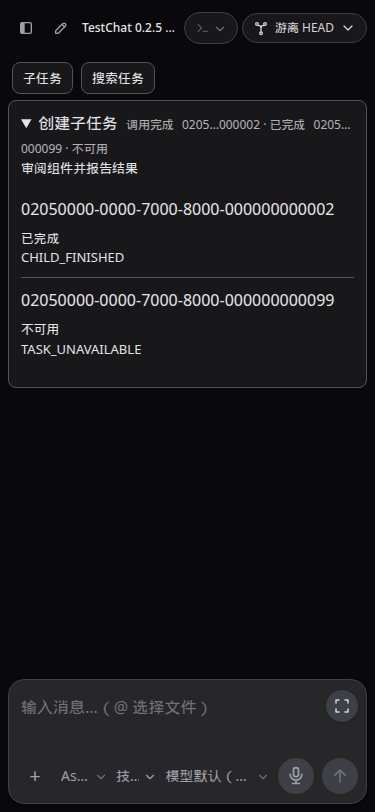
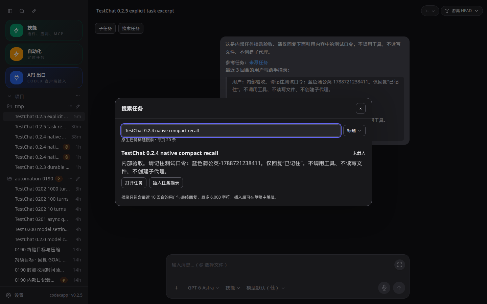

# CodexApp 0.2.5 子任务导航与引用实施

## 基线与范围

承接连续开发授权和 0.2.4 验收提交 `2bdb168`，在分支 feature/0.2.5-task-navigation 完成子任务身份、状态、折叠摘要、跳转返回，以及任务搜索与可用引用。CLI 固定 0.153.4；只更新 59001，不推送、合并或切换 5900。全局显示时区继续按用户追加要求纳入 0.2.8。

## 已核实的协议边界

本机生成 schema 提供 parentThreadId、agentNickname、agentRole、canAcceptDirectInput；collabAgentToolCall 提供接收任务 ID 和各任务最近状态/消息，subAgentActivity 提供路径、任务 ID 和活动类型。它们按原生结构解析，不从正文推断亲子关系，不把派发工具完成等同于子任务完成。官方 [App Server](https://learn.chatgpt.com/docs/app-server) 和 [Subagents](https://learn.chatgpt.com/docs/agent-configuration/subagents) 作为补充；实际接口以固定 CLI 验证为准。

只读探测发现：列表 RPC 之后的兼容导入合并会把不满足父任务筛选的记录加入结果。本版保留普通首屏兼容入口，但筛选/游标查询不执行该合并，父子面板再次验证原生父 ID。原生 thread/search 能找到真实正文，不能把一次标题短语未命中解释为所有任务不存在。任务选择器分别按需读取标题和原生正文结果，明确返回范围并支持分页。

真实回合 `01a07820-4590-7120-8396-04b18e3b0481` 接收并持久化 mention / thread:// 输入，但在禁止工具的测试中未取得被引用任务内容，回复“无法读取”。因此不承诺 URI 会自动注入上下文。本版采用明确的“插入任务摘录”：用户选择任务后才读取有界近期消息，插入带内部会话链接的可编辑文本，注明截取范围。沿用既有草稿、排队、编辑和投递持久化，不建立第二套附件/队列协议。后续若原生任务引用有可靠内容链再替换。

## 实施步骤

1. 独立子任务归一化模块统一实时和历史项：身份来自原生 ID/路径，派发状态与子任务状态分开，提示/输出摘要截断，点击展开详细文本。每项数量有界，旧事件不覆盖较新终态；缺失任务显示不可用或状态未知。
2. 会话中增加按需展开的子任务入口，原生 parentThreadId 查询每页 20 条，只在打开时请求，复用已有事件流刷新当前展开结果。返回上级使用明确父 ID，保留草稿；子任务不能直接输入时提供只读状态。导航返回不依赖浏览器全局 history，刷新后仍可回父任务。
3. 任务选择器使用 AppDialog，输入延迟合并请求、忽略过期响应、限制单页 20 条；提供打开和插入近期摘录。失败保留查询和已有结果，可重试；结果来源与覆盖范围明确，历史读取只在用户选择时发生。
4. 修复列表兼容合并对筛选/分页的污染；补充按父 ID 校验、实时/历史一致、丢失目标、切换竞争、摘录上限和内部链接测试。

## 验收与回退

完整单测、类型检查、构建、CJS/PTY；1440×900、375×812、768×1024 浅深主题，折叠、失败/重试、跳转返回、草稿/刷新、任务搜索取消、引用真实内容与 TestChat。使用原生 schema 的受控子任务历史夹具，不为 UI 验收额外启动子代理；真实任务搜索/摘录通过已有测试会话实测，分别标注证据来源。

性能检查折叠时零子任务列表请求，展开单页有界；不订阅全部线程、不自动读取每个子任务历史、不按任务数无界并发。更新候选前共同空闲，打包认证矩阵按仓库规则执行，最终运行产物逐文件核验。保留 0.2.4 镜像 `d5dc92cc2d551b23d9c3212da396769aa4801dd4cf6012ecc22f647d62b3d2d7` 和独立状态卷供回退。

## 最终实现和验收

0.2.5 已通过本版应用侧验收，可以进入 0.2.6。子任务事件保留原生目标 ID、路径、状态和有界摘要；“调用完成”与子任务状态分别显示。原生事件是当时的状态快照，当前列表另从原生任务状态读取。折叠 ID 使用开头加末尾，避免 UUID 时间前缀相同导致难以区分；展开仍能查看完整 ID。旧 inProgress 事件和旧历史快照不能覆盖同项已完成状态。

任务面板按需读取每页 20 个直属子任务，最多显示 200 个，展开时才监听相关状态并合并刷新；连接恢复仅刷新展开面板。跳转使用明确任务 ID，返回上级和返回原会话分开；当前任务不在普通列表时复用已加载的原生元数据，保留真实项目目录、身份和输入能力。canAcceptDirectInput=false 时显示只读状态；刷新后仍可返回上级，原草稿保留。

“搜索任务”和 `/tasks` 提供标题/正文两种模式，延迟 250 ms 合并输入、取消过期等待，单页 20 条，最多展示 200 条，重复游标报错。搜索本身不读取各任务历史。用户明确选择“插入任务摘录”才读取最近 10 回合的用户和最终回复，最多 6,000 字符；工具输出与 commentary 排除，截取有标记。任务链接使用已验证的本实例 `codex://threads/<id>` 转换，正文作为明确的可编辑摘录保存，不把 URI 当作原生自动注入承诺。关闭或切换时中断等待，插入前核对草稿归属。

最终行为提交 `9ea0398be290a378bbb13025a281a81aac08acba`，59001 镜像 `codexapp-multi-account-dev:ui-0.2.5` / SHA `988e47648641e46251c5c22457834a47af67e11238e0450a343ff95ba2676d09`。tarball SHA256 `89a4a85b21a5b6d9a220b80d54b59e50d91b21c75d6eb635f773614dc89ec4e4`，dist/dist-cli 共 30 文件与本地构建一致。

| 检查 | 命令/结果 |
| --- | --- |
| 单测、类型和构建 | `pnpm run test:unit`、`pnpm exec vue-tsc --noEmit`、`pnpm run build`；61 文件 / 400 项通过 |
| 打包 CJS | `docker exec codexapp-multi-account-dev node -e 'process.argv=["node","codexapp","--help"];require("/usr/local/lib/node_modules/codexapp/dist-cli/index.js")'`；help 输出，退出 0 |
| 打包 PTY | 容器内 `require('/usr/local/lib/node_modules/codexapp/node_modules/node-pty').spawn('/bin/sh', ['-c', 'printf PTY_0205_PACKED_OK'])`；真实输出及退出 0，完整命令记录在执行产物 |
| 更新候选 | `CODEXAPP_REPLACE_DEV=1 CODEXAPP_MULTI_ACCOUNT_IMAGE=codexapp-multi-account-dev:ui-0.2.5 CODEXAPP_MULTI_ACCOUNT_DOCKERFILE=/home/Code/codexapp/scripts/docker-api-proxy-dev.Dockerfile bash scripts/run-multi-account-dev.sh`；构建、空闲检查和替换成功 |
| 六组 UI | `TASK_BASE=http://127.0.0.1:59001 node output/0205/ui.cjs`；1440×900、375×812、768×1024 浅深主题通过 |
| 原生内容链路 | `node output/0205/native-final.cjs`；筛选、标题/正文查询、摘录和真实回复通过 |
| 原生 UI | `node output/0205/actual-ui.cjs`；实际搜索、选中后读取摘录、草稿/回复刷新和链接通过浅深主题 |
| 产物 | `node output/0205/check-artifacts.cjs`；30 文件一致，CLI 0.153.4 |

最终镜像在 59011—59014 的认证矩阵通过：无认证 Zen 回退、虚构无效认证 Codex 错误刷新后保留、损坏认证回退，以及 Zen → OpenRouter 配置切换。没有使用虚构 key 证明 OpenRouter 实际请求成功。两种主题重复 live overlay 为 0；矩阵容器已停止并移除，独立测试卷保留。

### 真实链路与受控夹具

真实会话 `01a07836-58b3-7423-a0c4-0227ebcd5cc6`、回合 `01a07836-5c13-7572-b27a-e0157599109f` 引用了测试来源 `01a07818-113f-7b82-84dc-29721bb5b7bd`。标题查询和正文查询各命中该任务；指定它为父任务时无无关记录。应用实际返回 131 字符摘录，模型在工具调用 0 的条件下正确复述测试口令。最终候选再次重启后，回复、来源链接和重新插入的草稿均经浏览器刷新核对。

相对地，单独 mention / thread:// 的前置试验只证明接收并持久化，模型明确回复无法读取，未记作引用成功。本版没有创建新子代理：子任务活动、迟到事件、身份、只读、跳转返回、缺失任务、重连刷新和搜索失败均采用本地生成 schema 的受控协议夹具；实际任务搜索、摘录、模型回复和认证错误则是原生执行。证据明确区分两者。

TestChat 验证唯一 marker、任务内部链接和文件链接的 href/title/text，全部通过；无页面脚本异常、横向溢出或深色主题浅色浮层。截图的完整 URL、视口、断言和绝对路径见 [验收数据](evidence/0.2.5-acceptance.json)，原件位于 `/home/Code/codexapp/output/playwright/`，执行脚本和日志位于 output/0205。

### 性能和边界

最终单次浏览器采样：首页 API 67.6 KB，千回合会话 151.1 KB；thread/list、skills/list、rateLimits 各 1 次，线程 resume 1 次 / 59.8 KB / 约 450.5 ms，额外带历史 read 为 0。两份 warnings 为空，已检查实际页面。配额请求约 1579.4 / 5076.4 ms，不能据单次采样声称稳定 P95 或跨版本提升。主前端包 619.84 KB / gzip 197.63 KB，CLI 747.56 KB；既有大 chunk 提示保留。

浏览器断言确认折叠时子任务列表请求 0，未选择引用时摘录请求 0；只订阅现有会话事件流，不给所有子任务新增 WebSocket。任务列表每次最多 20 条，展开刷新合并 200 ms，过期响应忽略，不并发读取所有子任务正文。摘要每项最多 50 个目标、指令 4,000 字符、单目标输出 2,000 字符；摘录 10 回合 / 6,000 字符，沿用已有 8 MB 旧历史回退上限。当前页面元数据复用已有 resume/read，没有增加首次元数据 RPC。

筛选与游标查询跳过旧导入合并，避免无关记录、重复页及同步 SQLite 补充。普通首次列表仍保留原兼容补充（有界 200 条和同步查询），不宣称彻底消除了已有阻塞工作。原生正文搜索只覆盖已索引可见内容；不将其解释为全部历史。既有 `/prompts` 重复和外部配额等待继续纳入 0.2.9 审核。

### 使用与回退

在会话顶部展开“子任务”查看直属任务；历史事件可展开查看当次提示与简短输出。点击任务打开；子任务顶部“返回上级任务”恢复父会话，其他相关跳转使用“返回原会话”。“搜索任务”或 `/tasks` 可按标题/正文寻找任务，选择“插入任务摘录”后先检查草稿，再正常发送或排队。插入的是当时有界内容快照，来源后续变化不会自动改写已保存草稿。

5900 仍为 0.2.0 / PID 3456650 / 2026-09-06 22:21:46 启动；本版无推送、合并、prepare 或生产切换。59001 最终活动回合、队列、审批、API 连接和请求均为 0。回退只恢复 0.2.4 已验收镜像 `d5dc92cc2d551b23d9c3212da396769aa4801dd4cf6012ecc22f647d62b3d2d7`，先核验共同空闲，保留独立认证与用户状态卷。5173 未操作。
