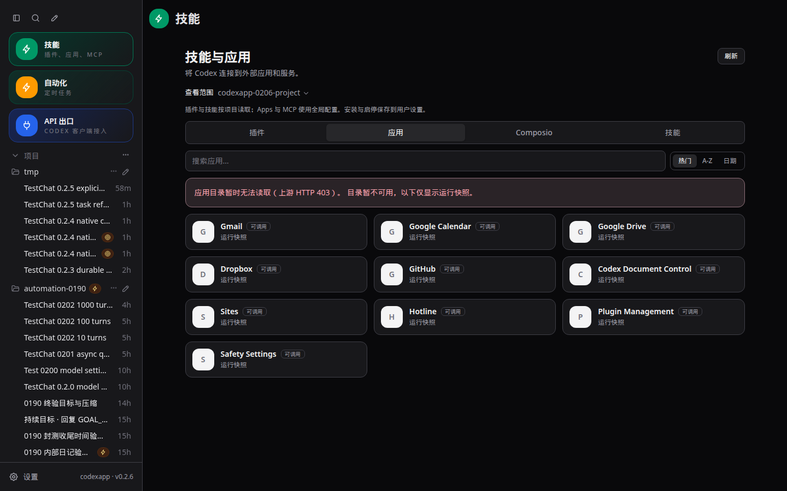
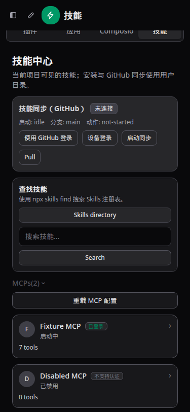

# CodexApp 0.2.6 项目扩展与状态实施

## 范围与基线

沿用 0028 连续开发授权，在已验收 0.2.5 / a24d9c2 上开发，仅更新独立 59001。生产 5900 不变，不推送或合并。CLI 固定 0.153.4。用户新增全局显示时区保持在 0.2.8。

## 核查与实施设计

- 技能入口原来清空会话，路由没有保存查看范围，导致 Apps/MCP 查询退回全局。入口与斜杠命令保存来源会话及目录，在页面提供全局/项目选择；刷新保留选择，会话范围明确标识。只有目录时，插件和技能按 cwd 查询，Apps/MCP 明示采用全局配置；不创建隐式会话。
- 技能列表直接使用原生 skills/list 的 metadata、scope、enabled、errors，按路径保留同名条目。原先按名称覆盖、磁盘发现默认 enabled=true、吞掉加载错误均不再用于此页面状态。保留已有全局安装/同步入口，标明用户级安装；项目和插件技能不走全局卸载按钮。
- 插件区分安装、启用、策略禁用及来源；app/list 只提供目录/连接信息，app/installed 的 committed snapshot 才用于“可调用”。接口缺失、失败、运行快照未包含均不能伪装为可用。启停写入现有用户配置，随后读取有效状态，不使用纯乐观勾选冒充成功。
- MCP 分开显示 runtimeStatus 与 authStatus，未启动、启动中、失败、禁用及未知均按原生值。普通列表使用 toolsAndAuthOnly，服务端精简工具 schema，展开后才读取完整资源列表；有界分页、重复游标检查及同 scope 并发合并。
- 统一刷新在插件安装/卸载/启停、App 启停和技能变更后失效；目录/会话切换、快速点击、断线/重新聚焦及原生通知触发合并刷新，旧响应不得覆盖新范围。普通“刷新”只读取；MCP 重载配置是独立明确动作。

本机只读原生探测已确认 app/installed 提供 enabled/callable，MCP threadId + toolsAndAuthOnly 有 runtimeStatus，但单页含约 1.15 MB 工具 schema，因此精简必须在服务端完成。没有发送工具调用或新增模型回合。

## 验收门槛

原生隔离项目技能和 MCP 夹具；插件生命周期以独立临时 home 的本地 fixture 验证；浏览器覆盖浅深主题、1440/768/375、切换范围/刷新持久、延迟响应/失败恢复、变更后重读及状态区分。保持 API 出口和前版回归。更新手工测试，运行单测、类型/构建、CJS/PTY 和实际打包产物一致性，59001 验收通过后再进入 0.2.7。性能报告区分 IPC 原始数据与浏览器响应，检查重复请求、阻塞工作、分页上限和缓存失效。实际外部 OAuth、物理移动设备等未测项明确记录。


## 最终验收

最终行为提交 `7607f74e9bb1a5dd53a51509fbc5dc409cd3d086`；镜像 `codexapp-multi-account-dev:ui-0.2.6` / `sha256:3a7877860bc7837befef7d412767e32748e10f80004fa59198987c946c5cba0e`，tarball SHA256 `d0095a3ffe47b7e7253e70dc5533ed7a72dd23854ab90824bc415df68c7eaf4a`。最终 59001 的 dist/dist-cli 共 30 个文件与本地构建一致，CLI 固定 0.153.4。全局显示时区仍按用户追加要求纳入 0.2.8。

### 行为与真实边界

页面路由保存目录与来源会话，使用共用 AppSelect 选择全局/项目。首次账号快照不会重建扩展页，真正切换账号才清理旧状态。快速换范围、卸载、迟到响应、显式刷新、原生通知与重连均有状态保护；复用现有事件流，没有新增 WebSocket。方法目录读取失败显示可恢复的错误，不误报 CLI 缺能力。

技能列表直接读取原生 metadata/scope/enabled/errors，按路径保留同名技能；不再逐个读取 SKILL.md、按名称覆盖或把磁盘发现当作启用证明。用户/项目/插件来源可见；只有可由用户目录管理的非插件技能提供卸载。启停后重新读取有效状态，不乐观勾选、不附带 GitHub 推送。原有显式同步入口保留。

App 目录、连接信息与 app/installed 的 enabled/callable 分开。实际远程 app/list 返回上游 403；界面显示简短中文错误，同时保留 10 个原生可调用 App 的只读运行快照，隐藏需要目录元数据的管理操作。该路径经过真实浅深主题验收，不宣称远程目录、安装或外部 OAuth 已恢复。没有 App 依赖的插件详情不再等待无关目录请求。

MCP 分别显示认证与 runtimeStatus；未启动、启动中、失败、禁用和未知不互相推断。列表使用 toolsAndAuthOnly，服务端裁剪 schema，展开才读 full 资源。普通刷新只读，重载配置是独立按钮。CLI 重启后，未载入的会话无法读取其运行快照：页面保留查看范围并提示先返回会话，未偷偷恢复 Goal 或发送回合。真实冷会话提示和返回后查询已验证。

### 验证与证据

- 62 个测试文件 / 408 项通过；最后错误文案与主题调整后，相关 20 项及类型检查、构建通过。最终容器 CJS help 和真实 node-pty 命令 `PTY_0206_PACKED_OK` / exit 0 通过。
- 1440×900、375×812、768×1024 各浅深主题六组 UI 通过：项目/全局及刷新、同名技能、写入失败不改开关、延迟响应隔离、初次账号返回不重复、目录失败保留运行快照、错误 HTML 裁剪、插件变更后重读、MCP 通知和明确重载。
- 独立无网络容器的固定 CLI 验证：同名项目/用户技能 2 条与另一目录 1 条，独立启停，未注册到用户全局配置的项目插件 `fixture@protocol-0206` 在另一个 cwd 返回空列表，并通过安装/禁用/卸载，以及 stdio MCP 的连接、禁用和完整资源。试验前几次使用无效绝对插件路径，目录未发现；按正确相对路径建夹具后通过。未用虚构响应冒充原生执行。
- 最终候选真实 API：项目技能读取 189 ms / 3598 字节；MCP 197 ms / 220 字节，含 261 个工具的计数，无输入 schema。此前原生 toolsAndAuthOnly 探测为 1152868 字节；这是不同时间的请求大小证据，不作为稳定延迟提升结论。
- 最终镜像在 59011—59014 通过无认证 Zen 回退、损坏认证回退、虚构无效认证错误刷新保留、Zen→OpenRouter 配置切换；浅深主题重复 live overlay=0。外部 provider 成功请求与真实 OAuth 未测试。测试容器已清理，独立卷保留。

命令：`DIRECTORY_BASE=http://127.0.0.1:59001 node output/0206/ui.cjs`、`node output/0206/actual-ui.cjs`、`node output/0206/native-protocol.cjs`、`node output/0206/method-recovery.cjs`。打包 CJS：`docker exec codexapp-multi-account-dev node -e 'process.argv=["node","codexapp","--help"];require("/usr/local/lib/node_modules/codexapp/dist-cli/index.js")'`。原始执行脚本、日志与真实夹具位于 output/0206；[精简验收数据](evidence/0.2.6-acceptance.json) 和 28 张截图随文档归档。





### 性能

有效 4173 首页 22.2 KB；最终 59001 首页 97.2 KB、千回合线程 151.1 KB，三者 warnings 为空。最终首页/线程的 thread/list、skills/list、rateLimits 各 1，线程 resume 1、额外历史 read 0；目录单页采样 125.1 KB，warnings 为空。报告含全部 apiRows、apiSummary 与最慢请求，已查看真实页面截图。原生配额为外部等待，单次采样不代表 P95。既有 /prompts 重复继续纳入 0.2.9。

列表分页最多 20 页，App 单页 100、MCP 单页 25；重复游标报错。MCP 仅合并同 scope 的在途请求，不跨完成缓存状态，配置变更失效；工具和资源详细预览每类 200，截断有提示。技能 metadata 为单次 RPC，没有逐文件读取或不受限并发。后台工具原始 schema 仍经 CLI IPC 传输；裁剪减少浏览器响应，不宣称消除了 native 数据生成成本。常规目录打开只读当前 tab，插件列表不额外获取 App 目录；没有后台轮询全部扩展。

构建输出：

```text
dist/assets/index-Q0MLMQnc.js                 621.69 kB │ gzip: 198.50 kB
ESM dist-cli/index.js     752.81 KB
dist/assets/index-Q0MLMQnc.js
```

### 使用与回退

从会话打开“技能”保留来源范围；直接打开可选择全局/项目，查看范围与用户级安装/启停保存位置有一处说明。应用显示目录信息与运行快照，MCP 点击展开资源；状态未载入时先返回会话。手工步骤见 tests/skills-plugins-integrations/directory-project-runtime-state.md。

生产 5900 仍为 0.2.0 / PID 3456650 / 2026-09-06 22:21:46 启动，没有 push、merge、prepare 或切换。59001 最终空闲检查通过；4173 留在当前源码，5173 未操作。应用回退使用已验收 0.2.5 镜像 `sha256:988e47648641e46251c5c22457834a47af67e11238e0450a343ff95ba2676d09`，先核验共同空闲，保留独立认证与用户状态卷。下一版为 0.2.7。
