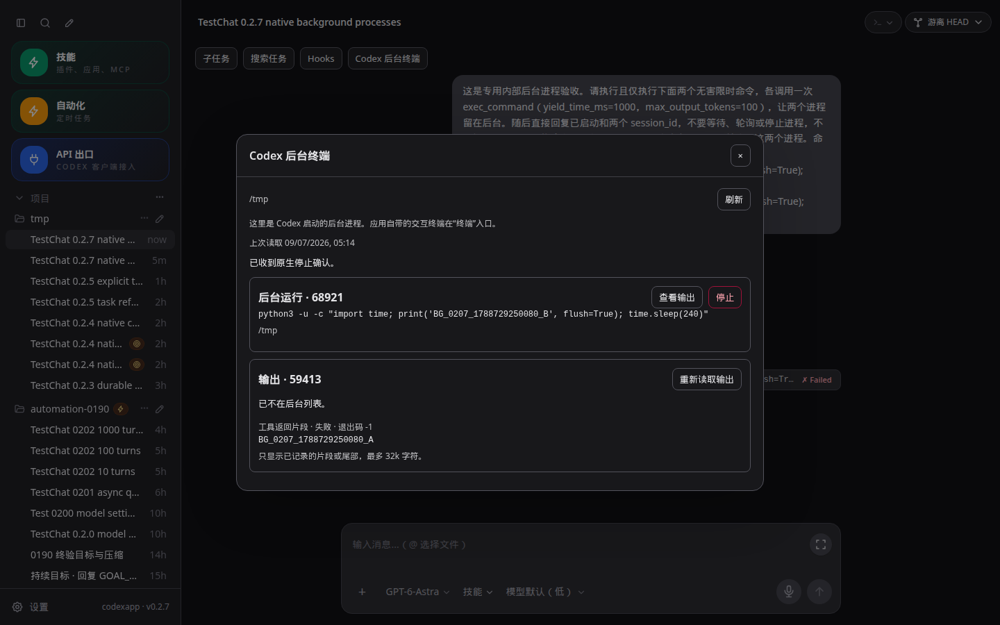
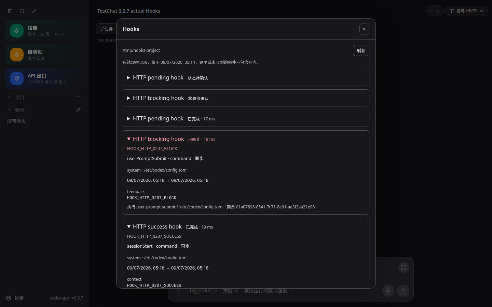
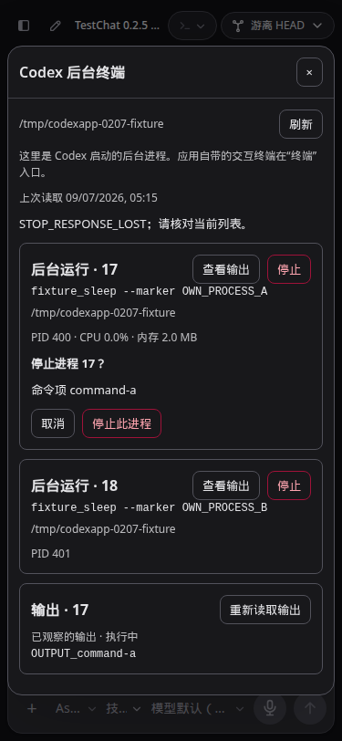

# CodexApp 0.2.7 Hooks 与后台终端实施

## 范围与基线

沿用 0028 连续开发授权，在已验收 0.2.6 / e73d28e 上开发，只更新独立 59001。CLI 固定 0.153.4。生产 5900、不相关进程和账号不变，不推送或合并。全局显示时区按用户追加要求保留在 0.2.8。

## 设计

- 会话工具栏增加 Hooks / Codex 后台终端入口，默认收起不请求。复用共用按钮、弹窗和现有通知流；打开后只查询当前会话，切换、关闭、重连及迟到响应有隔离保护。
- Hooks 配置按会话 cwd 读取 hooks/list，显示来源、启用、信任、匹配条件及只读命令。新界面不授予信任、不编辑、不执行 Hooks。官方配置规则见 [Hooks](https://learn.chatgpt.com/docs/hooks)；具体协议以本机固定 CLI schema 与隔离探测为准。
- 原生 hook/started、hook/completed 提供状态、时间、耗时与分类输出；thread/read 不提供完整 HookRunSummary。服务端保存有界观察记录，保留观察范围和截断标识；仅保存已收到的事件，不补造以前的历史。开始/完成乱序以结束为准；服务端或 CLI 重启后的未结束记录显示状态待确认。输出按纯文本展示，展开才看详细结果。
- Codex 后台进程使用 thread/backgroundTerminals/list，区别于应用自带的交互终端。列表有界分页；输出从观察到的 commandExecution 通知或最近有界历史读取，不进行轮询式全历史扫描。
- 停止需要明确选择单项，确认命令与原生 processId，调用 thread/backgroundTerminals/terminate 后重读列表。不得用 clean、操作系统 PID 或本应用终端接口代替；失败或结果不明时先读取状态，不自动重复停止。
- Hooks 最多 200 条/会话、1000 条全局且总记录不超过 4 MB，输出总计最多 16k 字符/次；原子异步合并写入，落盘错误可见。终端输出只保留有界内存尾部，历史来源与截断明确。面板关闭无后台刷新，展开用当前会话事件合并刷新及手动刷新。

## 验收门槛

隔离 CLI 的真实 Hooks 配置、事件和后台进程单项停止；受控失败、迟到通知、重启未知、输出截断、分页边界与跨线程隔离单测。浏览器验证浅深主题、1440/768/375、停止取消/成功/失败、重连恢复、默认收起零请求，以及前版关键回归。运行单测、类型/构建、CJS/PTY、真实打包 59001 和产物一致性核查；按协议/服务启动改动执行隔离认证矩阵。性能报告检查请求数、无多余历史读取、日志大小/写频率和包体。全部通过后再进入 0.2.8。

## 最终验收

最终行为提交 `d13d66c1bae152e57bc8c1f198a563799ecf2f18`；候选镜像 `codexapp-multi-account-dev:ui-0.2.7` / `sha256:b924cd31a5db5569c26f6b5d14e6e1639c4585df9fc075ca48cc12f869e03ab2`；tarball SHA256 `70c1271efd4957973db191a3bad391c41487394a9b6549838e2c2d504c449988`。最终候选 dist/dist-cli 共 30 个文件与本地构建一致，CLI 0.153.4。65 个测试文件 / 419 项、类型检查和构建通过。容器 CJS help 退出 0；真实 node-pty 输出 `PTY_0207_PACKED_OK` / exit 0。

### 已实现与原生证据

会话工具栏提供 Hooks 和 Codex 后台终端，默认关闭不请求，打开才查询当前范围。复用 AppDialog/AppButton 和既有通知流，没有新 WebSocket 或全会话轮询。目录/会话/账号改变清理旧页面，迟到请求不能覆盖新范围；读取失败可恢复。

Hooks 使用原生配置、来源、信任和状态；没有新增编辑、授信或执行入口。开始/完成事件按会话、回合、原生运行 ID 和开始时间关联，结束优先，秒级时间戳正确换算。仅存已经观察到的记录：200 条/线程、1000 条全局、约 4 MB 总量；每次输出最多 16k 字符，截断可见。原子异步落盘，200 ms 合并；损坏旧文件保留并报错。列表仅发送 160 字符预览，展开单条才读完整输出。原生重启或服务重启后未结束的记录显示待确认。

独立无网络 CLI 先验证真实成功与阻止事件；最终镜像的 59015 HTTP/浏览器试验会话 `01a07896-020a-7753-9a4b-e673b2e8a31d` 保存了成功、阻止及未结束的多次执行。重启后 5 条记录全部保留，其中两条运行状态待确认，浅深主题均核对。初次试验配置异步 SessionStart，没有收到对应运行通知，因此不把它作为异步成功证据；重启验收改用明确受控的同步等待 Hook。随后曾因测试脚本选中另一条空输出的 completed 记录失败，改为按事件身份选择；界面读取在会话初始化完成后进行。真实异步 Hook 成功路径未验证。

后台终端使用原生 processId/itemId，PID/CPU/内存缺失时不冒充为零。停止前重新查询并核对命令项，只调用单项 terminate；不使用 clean 或应用自身终端关闭接口。结果不明先重读，不自动重复。当前已移出列表与命令退出码分别显示，原生返回的失败/退出码不改写为成功。

真实候选会话 `01a07892-51c3-7052-8908-a9a29c304eb2` / 回合 `01a07892-5551-7c50-8021-ff9208b6f2a6` 启动两个 240 秒上限的 Python 等待进程。代码模式没有把初始 stdout 作为 outputDelta 发出，首轮实际验收因此失败；两条测试进程已明确清理。修复后重新发起真实验收，原生 ID 为 59413, 68921。现在在原生观察到的回合、processId 和开始时间可关联时，读取会话尾部 1 MB / 最多 2000 行，只接受对应 exec 调用的结构化返回值，输出最多 32k，界面标为“工具返回片段”。不同回合、时间、进程、调用以及单次返回中重复 ID 均不得误配；不执行脚本或猜测助手文字。这不是完整 stdout，也不承诺恢复边界之外的输出。

真实浅色 UI 取消停止，两个进程保留；深色 UI 停止 A，B 仍在，输出保留实际片段和原生退出码 -1。最后两条测试进程均清理，原生后台列表为空。输出平时来自通知或最近 10 回合；有文本时不读文件，代码模式回退只在用户明确打开/刷新输出且能够核对身份时发生。

### 界面、认证与性能

最终 59001 的 1440×900、375×812、768×1024 浅深主题六组 UI 通过：关闭零查询、同 ID 多次 Hook、只读配置、HTML 纯文本、Hook 通知不重新扫描配置、展开详情、失败重读、关闭迟到请求、输出 delta 零 HTTP、跨线程隔离、停止取消/响应丢失/再次明确操作、列表错误禁用停止、保留另一进程及刷新恢复。停止确认紧跟对应进程显示。真实进程和 Hooks 各有浅深主题截图。

最终镜像在 59011—59014 验证无认证 Zen 回退、损坏认证回退、无效认证错误刷新保留、Zen→OpenRouter 配置切换；浅深主题重复 live overlay=0。未测试物理手机键盘、外部 provider 的成功调用或 OAuth。所有本轮独立测试容器已删除，卷保留。

4173 首页 22.2 KB，warnings 为 `providerModels=1232.7ms`；页面真实加载完成且列表/技能/配额各 1。最终候选首页 100.2 KB、千回合线程 154.1 KB，warnings 为空；列表/技能/配额各 1，线程 resume=1、read=0。已查看报告、实际页面截图和最慢请求；这是单次采样，不代表 P95。既有 /prompts 重复与外部模型/配额等待继续纳入 0.2.9。

改动相关实测：已清理的后台列表 27.5 ms / 11 字节，真实工具返回输出 39.6 ms / 169 字节，5 条 Hook 摘要 1.9 ms / 2531 字节；隔离记录文件 10 条 / 5080 字节。Hook 列表不传完整输出。后台列表每页 20、最多 10 页，同线程在途查询合并，已完成的运行快照不缓存；重复游标和超过范围报错。内存输出最多 200 条 × 32k 字符；文件读取为异步有界尾部读取，不每个 delta 落盘或扫描历史。Hook 存储更新有最多 1000 条的线性裁剪；未测极端持续千条 Hook 流量，限额和合并写入由单测/代码路径核对。

主 JS 635.99 KB / gzip 203.08 KB，CLI 773.33 KB；相对 0.2.6 主 JS 增加约 14.30 KB、gzip 4.58 KB，没有新增依赖。

### 命令与归档

- 单测：`pnpm exec vitest run`；类型/构建：`pnpm exec vue-tsc --noEmit`、`pnpm run build`。
- 候选：`CODEXAPP_REPLACE_DEV=1 CODEXAPP_MULTI_ACCOUNT_IMAGE=codexapp-multi-account-dev:ui-0.2.7 CODEXAPP_MULTI_ACCOUNT_DOCKERFILE=/home/Code/codexapp/scripts/docker-api-proxy-dev.Dockerfile bash scripts/run-multi-account-dev.sh`。
- UI：`PROCESS_BASE=http://127.0.0.1:59001 node output/0207/ui.cjs`；真实验证脚本为 `native-terminals.cjs`、`actual-terminals-ui.cjs`、`hooks-http.cjs`、`hooks-http-ui.cjs`。这些真实测试脚本会创建内部测试会话/进程，仅在独立环境按前置条件使用。
- CJS：`docker exec codexapp-multi-account-dev node -e 'process.argv=["node","codexapp","--help"];require("/usr/local/lib/node_modules/codexapp/dist-cli/index.js")'`。PTY 脚本和全部日志在 output/0207。

[验收数据](evidence/0.2.7-acceptance.json) 与 33 张截图随文档同步到 Obsidian；手工步骤见 tests/theme-layout-terminal/hooks-and-background-processes.md。

### 状态与回退

5900 仍为 0.2.0 / PID 3456650 / 2026-09-06 22:21:46 启动；没有推送、合并或 prepare/activate。59001 最终空闲检查各项为 0，额外确认本轮后台进程已清理。4173 运行当前源码与独立 dev-home；5173 未操作。

候选回退目标为已验收 0.2.6 镜像 `sha256:3a7877860bc7837befef7d412767e32748e10f80004fa59198987c946c5cba0e`。先用 `CODEXAPP_IDLE_CHECK_URL=http://127.0.0.1:59001 node scripts/check-codexapp-idle.cjs` 核对空闲，并在后台终端面板确认没有需要保留的进程，再按原 59001 端口和三个挂载（独立 home、/home/Code、独立 test-workspace）重建候选；保留当前容器作撤回保障，不删除状态卷。旧版忽略新增 Hook 观察文件。下一版为 0.2.8，包含用户追加的侧栏全局显示时区。
