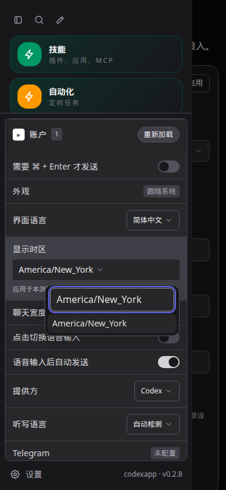
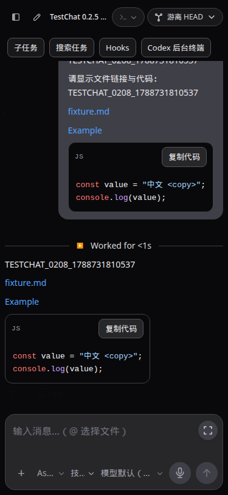
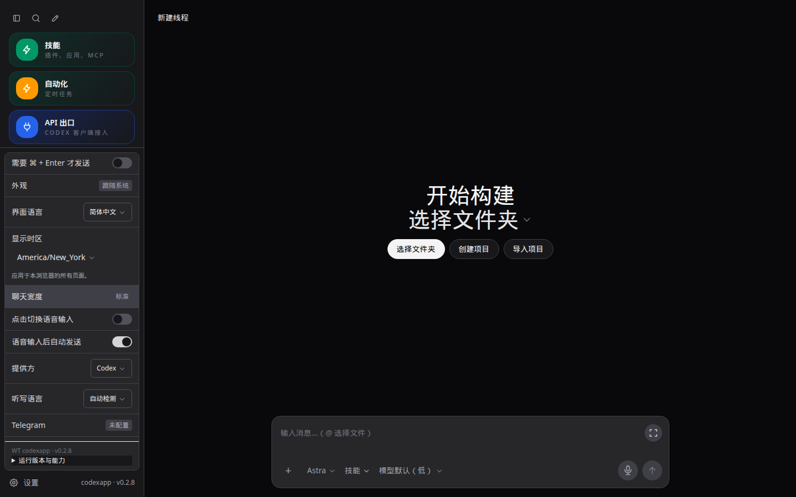

# CodexApp 0.2.8 全局显示时区与日常交互实施

## 基线与范围

沿用 0028 连续开发授权，在已验收 0.2.7 / 00d0fda 上工作，仅替换独立 59001。生产 5900、5173、账号认证隔离和不推送/合并的边界保持。用户明确追加：在侧栏设置指定全局显示时区，避免各处重复标注。

## 实施设计

- 在侧栏设置的语言附近使用共用 AppSelect 提供“显示时区”，支持搜索 IANA 名称和跟随系统。沿用语言/主题的浏览器偏好范围：当前浏览器、同一站点的全部页面和账号统一生效，跨刷新和同站点标签页同步；不是调度器配置。缺省保持现有浏览器时区。
- 统一 formatLocalDateTime 的显示偏好，使用 Vue 响应式依赖让已打开页面立即更新。验证时区再写入并核对持久化；写入失败显示错误，不能冒充保存成功。缓存按有效时区和格式区分、保留上限，不新建服务器查询或轮询。
- 清理自动化面板、执行历史和额度等重复“显示时区”/timeZoneName 标注；补 API key 日期、额度重置日期等绕过统一入口的位置。机器时间 ISO、定时任务执行时区、已保存任务规则和附件文件名不随显示偏好改变。独立导出文件保留可辨认时区的时间元数据。
- 核对现有移动输入/IME、焦点、草稿跨线程和刷新恢复、复制代码/完整回复、主题、错误重试及旧页恢复。已存在并通过的行为做回归，不重复立项。代码检查发现剪贴板降级隐藏 textarea 会丢失原焦点/选区；修复其恢复与清理，移除回复复制中对同一失败降级的重复尝试，并保留失败反馈。
- 以实际问题决定其余修改；模拟 IME/visualViewport 和浏览器截图不冒充物理手机软键盘验收。

## 验收

时间单测覆盖上海/纽约/UTC/夏令时、跨日、非法存储、持久化失败、即时响应和标签页同步；浏览器覆盖设置下拉、搜索、浅深/1440/768/375、刷新恢复、自动化执行时区未变及 API/额度/Hooks 显示一致。复制验证成功、权限失败时降级、焦点/选区保持及失败反馈。输入法模拟不得误发送；草稿切换/刷新、历史加载、旧资源失败恢复按相关手工步骤验证。

最终运行相关与全量单测、类型/构建、实际包 CJS/PTY、59001 打包资源和浏览器验收。记录请求计数和包体；旧页升级缓存用真实 HTTP 验证。验收后进入 0.2.9 全量联合审核和最终报告。

## 最终验收

最终行为提交 `4bb22a2612f9e6db95163786e44a6f6daafbc82d`；候选镜像 `codexapp-multi-account-dev:ui-0.2.8` / `sha256:67313902090fd0ea1123127d95291584db01ed73efb7c67ea703cd9278b6cd65`，tarball SHA256 `7c63016bad8e0b42ad2c4299bd9722eff03b86a6cb6daebbbf32f8f0ea81a431`。dist/dist-cli 共 30 个文件与本地构建一致，Codex CLI 0.153.4。65 个测试文件 / 423 项通过，类型和构建通过。容器 CJS help 退出 0，真实 PTY 输出 `PTY_0208_PACKED_OK` / exit 0。

侧栏设置新增可搜索的全局显示时区；默认跟随系统，选择 IANA 时区后立即应用于本浏览器同站点所有页面和账号。偏好跨刷新、跨标签页保留；非法历史值回到系统时区；保存失败明确报错并保留旧的生效值。没有服务端偏好接口或新增轮询。日期格式化缓存最多 32 组，以时区和格式为键；支持时区列表只构造一次，再补系统/已保存选项。

自动化列表与运行历史不再反复显示“显示时区”；额度、API key、Hooks 等使用统一格式化入口。调度器和任务的执行时区保持原语义：浏览器由纽约切至 UTC 不修改已有上海执行规则，也不发送自动化配置写入。独立 Markdown 导出保留时间和时区元数据；机器时间、附件名和调度时区不随显示偏好改写。

代码块现在可复制原始代码，完整回复复制保留 Markdown。浏览器 Clipboard API 拒绝时只降级一次，恢复原焦点、输入或文档选区并移除隐藏 textarea；完全失败显示“复制失败”，重试可恢复。浅深主题截图中已核对共用按钮与代码标题布局；移除了旧语言标题残留的局部下划线。

### 浏览器与运行证据

- 最终打包 59001 在 1440×900、375×812、768×1024 浅深主题六组通过。固定 `2026-09-06T17:00:00Z` 在上海/纽约/UTC 分别显示 9 月 7 日 01:00、9 月 6 日 13:00、9 月 6 日 17:00；API key、自动化历史及 Hooks 日期一致。侧栏账号额度另做浅深实测，从 9/7 变为 9/6，切换与渲染分别约 116/330 ms，相关 API 请求为 0。这是单次受控浏览器测量，不代表 P95。
- 搜索、无原生 select、刷新、另一标签页同步、保存失败反馈、非法值恢复、自动化编辑窗口仍为 Asia/Shanghai、代码/完整回复复制、失败重试、焦点和选区、草稿跨会话与刷新均通过。TestChat 实际发送虚构消息并核对真实渲染行：hrefOk/titleOk/textOk 全通过；文件链接沿用本项目 codex-local-browse 路由。
- 中文 composition/Enter 模拟未误发送。375×812 下模拟 visualViewport 高度 430，普通与展开输入区均在可见范围内，草稿保留；没有物理手机或真实输入法验收。Clipboard API 与 execCommand 的返回由测试控制，验证的是准确复制内容、降级次数和焦点恢复，不声称验证系统剪贴板权限。
- 不使用 Playwright route 的真实 HTTP 同源代理，按 0.2.7→0.2.8→0.2.7→0.2.8 切换真实打包服务；浅深主题、SW 开/关四组通过。未发送草稿和显示偏好保留；入口带旧条件头仍 200、no-store、无 ETag；缺失旧 JS 为真实 404。单独受控中断主模块与 API 面板懒加载：375/768 浅深四组恢复界面可见且不越界，恢复按钮保留路由，稍后处理及刷新保留草稿，无自动发送。
- 最终镜像的 59011—59014 无认证、损坏认证、无效认证刷新保留、Zen→OpenRouter 配置切换通过；浅深主题重复 live overlay=0。没有验证外部 provider 成功请求或 OAuth。所有本轮独立测试容器已移除；四个认证 home 卷保留（release-0907-final-0600-home）。缓存旧版容器使用临时内存 home，随容器清理。

### 性能与审核发现

主 JS 638.97 KB / gzip 204.20 KB，较 0.2.7 增约 2.98 KB / 1.12 KB；CLI 773.34 KB，未增加依赖。首次构建发现服务端从日期模块读取默认时区常量，连带引入 Vue 导致 CLI 达 2.74 MB；已提取纯常量模块，最终包体恢复，服务端不加载显示偏好。

候选首页 100.2 KB、千回合线程 154.1 KB，warnings 为空；列表、技能、配额均各 1 次，线程 resume=1、read=0。配额单次外部耗时 1121.6/1060.7 ms；时间偏好不触发该接口。4173 最终有效首页 22.2 KB，providerModels=1214.2 ms；无持续 Loading threads。既有 /prompts 重复、配置读取和外部等待继续进入 0.2.9。

4173 初次测量队列接口返回“发送服务已停止”，与已热更新的开发运行态有关；重启仅 4173 后接口为 200，重新采样通过。未将旧样本当作正常结果，也未改变 5173。0.2.9 继续审查热更新管理对象生命周期，不能把打包运行通过外推为 HMR 无问题。

### 复验与交付

- 单测 `pnpm test:unit`；构建 `pnpm run build`。
- 候选命令：`CODEXAPP_REPLACE_DEV=1 CODEXAPP_MULTI_ACCOUNT_IMAGE=codexapp-multi-account-dev:ui-0.2.8 CODEXAPP_MULTI_ACCOUNT_DOCKERFILE=/home/Code/codexapp/scripts/docker-api-proxy-dev.Dockerfile bash scripts/run-multi-account-dev.sh`。
- UI：`UI_BASE=http://127.0.0.1:59001 node output/0208/ui.cjs`；受控键盘、额度和恢复脚本为 keyboard.cjs、quota.cjs、recovery.cjs。缓存脚本 cache.cjs 需要先按记录启动旧版独立 59016；不能将上游改成生产 5900。
- CJS：`docker exec codexapp-multi-account-dev node -e 'process.argv=["node","codexapp","--help"];require("/usr/local/lib/node_modules/codexapp/dist-cli/index.js")'`。全部脚本、原始日志、PTY 结果在 output/0208。

[验收数据](evidence/0.2.8-acceptance.json) 和 45 张截图已同步到 Obsidian 并逐字节核对。手工步骤见 tests/theme-layout-terminal/display-timezone-and-copy.md。截图 URL/视口/断言详见 JSON。

生产 5900 仍为 0.2.0 / PID 3456650 / 2026-09-06 22:21:46 启动；没有推送、合并或 prepare/activate。59001 最终空闲检查各项 0，替换前原生已加载 2 个会话的后台进程均为 0。本版测试未创建实际后台命令。

候选回退镜像为 0.2.7 / `sha256:b924cd31a5db5569c26f6b5d14e6e1639c4585df9fc075ca48cc12f869e03ab2`。先检查空闲及后台终端，按原端口和三个挂载重建候选，保留当前容器作为恢复保障，不删除状态卷；旧版忽略浏览器新增时区偏好，重新升级仍恢复该偏好。下一步按 0028 进入 0.2.9 全量联合审核及最终使用说明。
