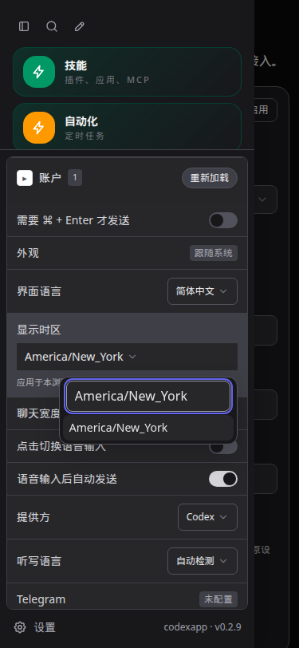
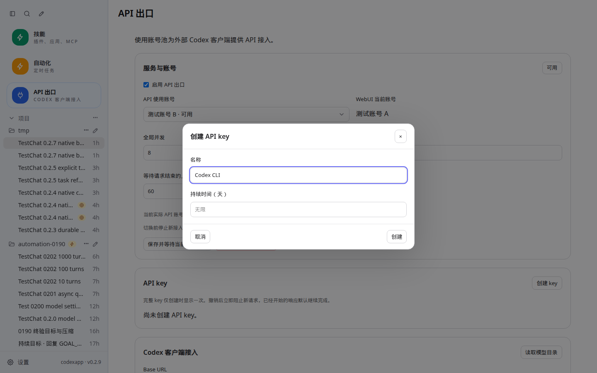
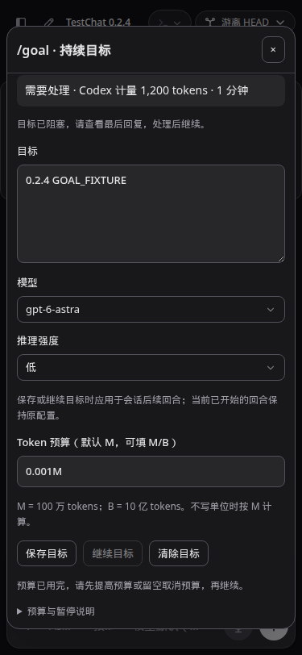

# CodexApp 0.2 系列开发报告与候选交付

## 交付结果

按 [连续开发计划](20260906-0028-codexapp-0.2系列连续开发与验收.md)，以 0.2.0 为基础逐版实施、测试并更新 59001，现已完成至 0.2.9，以及本系列变更的代码、功能和 UI 联合审核。当前入口为 `http://192.168.50.46:59001/`，版本 `0.2.9`。

用户追加的三项 UI 修复均已完成：API 出口使用蓝色入口；创建 API key 的名称和持续时间分行，持续时间默认无限、正整数表示天数；侧栏设置提供全局显示时区，统一日期显示并去除各处重复标注。自动化的调度时区仍作为执行参数单独保留。

生产 5900 仍为 0.2.0，PID `3456650`，启动于 `2026-09-06 22:21:46 CST`，运行目录仍是 `/home/docker/codexapp-releases/codexapp-0.2.0-8542ec5e58c8-20260906-221809`。本轮只做本地提交与独立候选部署，没有推送、合并、prepare 或 activate，也没有变更 5173。

日常操作见 [0.2 系列使用说明](20260907-0009-codexapp-0.2系列使用说明.md)。

## 逐版完成情况

下表测试数是各版验收记录，不把早期测试结果冒充最终版本重新实测。

| 版本 | 主要结果 | 当版单测 | 详细记录 |
| --- | --- | --- | --- |
| 0.2.1 | 异步问题与阻塞请求分离、显式答案绑定、审批优先、认证恢复；API UI 修复 | 309 | [0029](20260906-0029-codexapp-0.2.1异步提问与等待状态验收.md) |
| 0.2.2 | 原生分页、受限旧历史回退、搜索失效和取消、精确回合分支 | 335 | [0030](20260906-0030-codexapp-0.2.2历史搜索与分支实施.md) |
| 0.2.3 | 持久发送记录、结果不明先对账、队列版本与多页编辑保护 | 374 | [0001](20260907-0001-codexapp-0.2.3可靠发送与队列实施.md) |
| 0.2.4 | Goal 预算、阻塞、明确恢复；压缩进度、失败及刷新恢复 | 393 | [0002](20260907-0002-codexapp-0.2.4目标与压缩实施.md) |
| 0.2.5 | 子任务身份和状态、父子导航、任务搜索和明确摘录 | 400 | [0003](20260907-0003-codexapp-0.2.5子任务导航与引用实施.md) |
| 0.2.6 | 项目技能／插件范围、MCP 与 App 运行状态、按需详情与变更刷新 | 408 | [0004](20260907-0004-codexapp-0.2.6项目扩展与状态实施.md) |
| 0.2.7 | Hooks 只读观察、后台终端有界输出、精确单项停止 | 419 | [0005](20260907-0005-codexapp-0.2.7Hooks与后台终端实施.md) |
| 0.2.8 | 全局显示时区、复制失败恢复、输入焦点／草稿和旧页恢复 | 423 | [0006](20260907-0006-codexapp-0.2.8全局显示时区与日常交互实施.md) |
| 0.2.9 | 联合回归、开发重启共享运行态修复、请求合并、后台工作切换保护、UI 收敛 | 436 | [0007](20260907-0007-codexapp-0.2.9联合审核与收口实施.md) |

## 最终代码与设计审核

审核覆盖本系列全部变更目录，并沿发送、历史、通知、账号切换、页面卸载和存储路径复查边界；结合单测、实际 HTTP、原生回合、浏览器与构建结果判断。没有为单一场景引入通用表单框架或复制一套弹窗实现。

| 范围 | 审核结论与处理 |
| --- | --- |
| 运行态生命周期 | 复现 Vite 先创建新 server、再关闭旧 server，旧 middleware 误关闭共享发送服务。增加持有计数、幂等关闭和新代存储写入等待；旧实例只释放自己的订阅，最后持有者才关闭共享服务。真实配置重启连续三次通过。 |
| 发送与队列 | 保留消息 ID、服务端持久记录和原生证据对账；结果不明不直接重发。写入有租约和版本检查，未处理记录上限 500 条／32 MB，回执保留 7 天；处理与对账并发合计最多四路。 |
| 历史与搜索 | 原生路径先读 10 回合，单回合详情按需获取；旧文件回退上限 8 MB、缓存总量 32 MB。正文搜索限制最近 100 会话 × 50 回合，每会话 200000 字符，四路读取；事件、文件版本及查询取消防止陈旧结果。 |
| Goal 与压缩 | 预算编辑保留已用量和运行状态；恢复由明确操作触发。用量采用原生计量，未知阻塞原因不编造。压缩请求先保存状态，刷新只核对，结果不明不自动重放。 |
| 子任务与引用 | 父子身份按原生字段识别，分支不冒充子任务。工具调用完成与子任务完成分开；引用由用户明确附加有界摘录，未把裸链接承诺为模型可读内容。 |
| 扩展目录 | 项目范围、用户设置范围和运行状态分别有依据。MCP 默认只取摘要，完整工具 schema 不随列表发送；通知合并刷新，迟到旧范围结果丢弃。外部目录失败保留可获取的运行快照。 |
| Hooks 与后台命令 | Hook 执行键包含会话、回合、原生 ID 和开始时间；重启后的未完成旧观察为未知。输出片段有界读取，停止前核对 threadId、processId、itemId，不操作 OS PID。 |
| 空闲与切换 | 主回合结束后仍检查原生已加载会话的后台命令。最多 200 个会话、四路存在性查询，未知状态、重复游标、超限或超时阻止操作。账号／供应方检查还拒绝扫描期间变化的活动快照。 |
| UI 与日期 | 使用现有 AppDialog/AppSelect 与主题样式。显示时区只属于显示偏好，日期格式器最多缓存 32 组；服务端默认时区常量独立，避免引入 Vue。预算和暂停细节默认折叠，删除无入口的额度渲染代码。 |
| 请求与资源 | 同时发生的提示词读取共享在途请求，结束后不留 TTL 缓存，创建／删除后失效；调用方拒绝迟到结果。关闭组件释放事件订阅，不增加按时间轮询。 |

开发环境仍需注意：共享运行态有明确版本号。修改其内部实现时，应更新版本号或冷启动该验证服务，不能仅靠 HMR 就假定旧实例已经换成新类实现。最终打包容器使用完整的新运行态。

## 0.2.9 实际验证

完整结构化数据、每组 URL／视口／断言和截图路径见 [最终验收数据](evidence/0.2.9-acceptance.json)。原始命令与日志保留在 `/home/Code/codexapp/output/0209/`。

| 验证 | 最终结果 |
| --- | --- |
| 单测与构建 | 67 个文件、436 项单测通过；类型检查与打包构建通过。 |
| 打包一致性 | 本地与 59001 容器的 dist/dist-cli 共 30 个文件摘要一致；CLI 固定 0.153.4。 |
| CJS／原生 PTY | 通过 CJS require 调用实际 CLI help，退出 0；node-pty.spawn 导出存在，真实 PTY 输出 `PTY_0209_PACKED_OK`、退出 0。 |
| 跨功能浏览器 | 问题、API UI、历史、搜索、发送、Goal／压缩、子任务、扩展、Hooks／终端、时区共 52 组通过。主要改动覆盖 1440×900、375×812、768×1024 的浅深主题；历史和搜索为桌面浅深两组。 |
| 输入／日期 | composition 不误发、分会话草稿与刷新恢复、代码及整条回复复制、复制失败恢复；上海／纽约／UTC 跨日显示、存储失败、标签页同步和刷新通过。模拟手机键盘两组，额度跨日两组。 |
| 缓存与恢复 | 真实 HTTP 同源代理进行 0.2.8→0.2.9→0.2.8→0.2.9，浅深主题 × SW 允许／阻止四组通过；旧 JS 404，入口 no-store、无 ETag，草稿和时区保留。另有四组受控模块加载失败恢复。 |
| 认证矩阵 | 隔离端口 59011 无认证、59012 占位无效认证、59013 格式损坏认证、59014 Zen→OpenRouter；四种启动与八组主题 UI 通过。无效认证回合错误刷新后保留，重复 live overlay 为 0。 |
| 原生长历史 | 10／100／1000 回合文件初载均 10 回合；第 0、50、999 回合精确分支正确，测试分支随后归档；无效游标拒绝。重命名／归档／恢复后的真实搜索更新正确，原测试标题恢复。 |
| 后台工作保护 | 原生主回合完成后保留一个 180 秒限时命令：activeTurns=0、queued=0、backgroundThreads=1，空闲检查退出 3；供应方公共保护返回 409，状态和进程保留。随后仅停止该命令，最终空闲。 |
| 开发重启 | 当前源码 4173 冷启动后，mtime 触发三次真实 Vite 配置重启。队列 200、调度器 ready、原生 RPC 和 API 状态可读，没有 runtime/stopped 事件。配置内容未改变。 |

后台保护的真实证据会话、回合及进程 ID 位于验收数据。供应方保护测试使用不存在的 free-mode 子路径验证公共前置检查，避免测试失败时落入真实配置写入；账号侧另有单测。它不等于实际切换两个真实账号成功。

测试夹具也经审核：早期历史／问题脚本更新为当前发送协议；目录通知在连接确立后才注入；时区性能计数在初始加载结束后开始；缓存代理结束时关闭自己的在途请求。首次旧历史夹具造成的一条失败测试发送记录已按准确 ID 清除，首次后台测试进程亦已明确停止。最终报告只统计修正后通过的结果，失败尝试日志保留在 output。

### 性能测量

| 场景 | 观测 |
| --- | --- |
| 59001 首页 | API 总量 102.9 KB；列表首屏、skills/list、额度各 1 次，prompts=1；profiler warnings 为空。 |
| 59001 千回合会话 | API 总量 156.8 KB；resume=1、read=0，列表／技能／额度各 1 次；resume 201.5 ms，响应约 59.8 KB。 |
| 同候选 1000 回合 HTTP 复测 | resume 61.3 ms、受限 read 83.5 ms、旧页 51.8 ms；均只返回 10 回合，约 60 KB。与浏览器冷载不是同一采样条件。 |
| 正文搜索 | 34 会话样本，冷查询 1235.3 ms、热查询 3.5 ms；失败会话 0，2 个正文范围受限且显式标记。 |
| 真实流式回复 | 80 条 Markdown 清单，1430 个 delta 事件，30.3 秒；浏览器长任务 0、超过 50 ms 的帧 0、帧间隔 P95 16.7 ms、末尾堆约 14.8 MB。 |
| 显示时区切换 | 额度跨日日期正确变化；完成初始加载后测得切换新增 API 请求 0。 |
| 包体 | 主 JS 638.93 KB／gzip 204.15 KB，CSS 423.08 KB／gzip 45.62 KB，CLI 778.70 KB；未新增依赖。 |

提示词由之前两次并发请求减少为一次。流式期间仍有应用原有的队列及会话状态核对：本样本 22 个 HTTP 请求，其中队列 8 次、thread/read 4 次、thread/list 3 次；数量没有随 1430 个 delta 逐条增长，不能宣称流式期间完全没有 HTTP 请求。

性能限制仍存在：外部额度读取约 1379.6／1397.2 ms；独立 4173 的供应方模型读取约 1223 ms。既有 SQLite 导入补充路径有同步子进程、最多 200 行，属于仍需关注的阻塞工作；本轮未重写。以上是当前机器单次样本，不是生产负载 P95，也不能推断 CLI 内部完全不扫描历史文件。

### 截图节选

共归档 131 张最终通过用例引用的截图。完整 URL、视口和绝对原件路径见验收数据；下列图片对应最终 59001 候选。







## 已知限制

| 项目 | 证据边界与当前行为 |
| --- | --- |
| 真实第二账号与自然令牌到期 | 隔离占位认证和失败刷新已测；未完成真实双账号端到端或自然到期实测。 |
| 子任务实际用量归属 | 使用原生 schema 和归属字段验证 UI，没有创建真实子代理证明分项汇总。Goal 计量不由应用补算；早期原生零计量异常保留在 0.2.4 报告。 |
| App 远端与 OAuth | 0.2.6 真实目录请求遇到上游 403；已验收运行快照降级，未宣称外部链路恢复。本轮不重新连接用户外部账号。 |
| MCP 与 Hooks | 真实 MCP 连接／资源元数据已测，没有真实工具调用成功证明；原生异步 SessionStart Hook 未获成功事件证据。 |
| 历史与后台输出 | 原生能力不足时使用显式受限路径；输出片段、搜索范围、旧历史 8 MB 上限均不能当作完整数据。 |
| 真机输入体验 | Chromium 的响应式、composition 和 visualViewport 模拟通过；未使用物理手机或真实移动输入法。 |

上述边界已反映到使用说明，不阻止已实现应用行为的候选交付，也不把它们标记为外部能力已验证。

## 精确产物与运行边界

| 项目 | 值 |
| --- | --- |
| 本地分支 | `feature/0.2.9-final-audit` |
| 最终行为提交 | `c2619a3413c4ed70cdb59c59db08c9f2e2d1885f`；之后仅验收文档提交 |
| 候选镜像 | `codexapp-multi-account-dev:ui-0.2.9` |
| 候选 image ID | `sha256:c444771e20da82c88123698cd087803c483b6af3a1a6307c4532f29632add25a` |
| 固定 tarball | `/home/Code/codexapp/output/0209/codexapp-0.2.9-c2619a3413c4.tgz` |
| tarball SHA256 | `05762672359d8b0a82c23e1218ff2f867ce3526345644c65fc057ffebb743c0a` |
| 容器与状态卷 | `codexapp-multi-account-dev`；`codexapp-multi-account-dev-home:/codex-home` |
| 其他挂载 | `/home/Code:/home/Code`；`codexapp-0190-test-workspace:/test-workspace/automation-0190` |
| 0.2.8 回退镜像 | `sha256:67313902090fd0ea1123127d95291584db01ed73efb7c67ea703cd9278b6cd65` |
| 原生依赖基础镜像 | `codexapp-verified-cli:0.153.4-4c1eee4`，保留 |

已移除本版 59011–59014、59016 的五个专用测试容器，保留其独立 home 卷。没有清空候选认证、队列、会话或生产状态，也没有执行可选的旧版本镜像清理。历史版本和 0.2.8 回退产物继续保留。

### 当前候选只读复查

```bash
cd /home/Code/codexapp
git status --short
git branch --show-current
docker inspect codexapp-multi-account-dev --format '{{.Image}}'
docker exec codexapp-multi-account-dev node -p 'require("/usr/local/lib/node_modules/codexapp/package.json").version'
CODEXAPP_IDLE_CHECK_URL=http://127.0.0.1:59001 node scripts/check-codexapp-idle.cjs
sha256sum output/0209/codexapp-0.2.9-c2619a3413c4.tgz
```

空闲检查退出 0 才表示该次快照空闲；退出 3 表示有工作，退出 1 表示核对失败。检查不是未来操作的永久许可。

### 回退 59001 到保留的 0.2.8 镜像

以下是交付命令，本轮未执行此运行态回退。使用已验收 image ID，保留同一个候选 home；不要在当前 0.2.9 源码上把构建结果重新标记为 0.2.8。

在无人发送新任务的维护窗口执行。先验证当前 image ID 与上表一致、备用容器名未占用，然后暂停新调度和 API 接入并检查空闲：

```bash
cd /home/Code/codexapp
set -e
docker image inspect sha256:67313902090fd0ea1123127d95291584db01ed73efb7c67ea703cd9278b6cd65 >/dev/null
test "$(docker inspect codexapp-multi-account-dev --format '{{.Image}}')" = 'sha256:c444771e20da82c88123698cd087803c483b6af3a1a6307c4532f29632add25a'
if docker container inspect codexapp-0209-held-before-rollback >/dev/null 2>&1; then
  echo '保留容器名已占用，请核对后再操作。'
  exit 1
fi
curl --fail --silent --show-error --max-time 40 -X POST -H 'Content-Type: application/json' --data '{"draining":true}' http://127.0.0.1:59001/codex-api/automation-runtime/drain
curl --fail --silent --show-error --max-time 40 -X POST -H 'Content-Type: application/json' --data '{"draining":true}' http://127.0.0.1:59001/codex-api/api-proxy/drain
CODEXAPP_IDLE_CHECK_URL=http://127.0.0.1:59001 node scripts/check-codexapp-idle.cjs
```

任一步失败或检查非 0 时停止回退，并对上述两个 drain 地址分别 POST `{"draining":false}`。空闲检查通过后执行：

```bash
docker stop --timeout 10 codexapp-multi-account-dev
docker rename codexapp-multi-account-dev codexapp-0209-held-before-rollback
docker run -d --name codexapp-multi-account-dev --restart unless-stopped \
  -p 0.0.0.0:59001:59001 -e CODEX_HOME=/codex-home -e TZ=Asia/Shanghai \
  -v codexapp-multi-account-dev-home:/codex-home -v /home/Code:/home/Code \
  -v codexapp-0190-test-workspace:/test-workspace/automation-0190 \
  sha256:67313902090fd0ea1123127d95291584db01ed73efb7c67ea703cd9278b6cd65
docker exec codexapp-multi-account-dev node -p 'require("/usr/local/lib/node_modules/codexapp/package.json").version'
curl --fail --silent --show-error --max-time 10 http://127.0.0.1:59001/codex-api/automation-runtime
CODEXAPP_IDLE_CHECK_URL=http://127.0.0.1:59001 node scripts/check-codexapp-idle.cjs
```

应为 0.2.8、调度器 ready 且无 error，界面能恢复草稿。旧容器保持停止状态，不能与新容器同时管理该 home。回退只替换应用产物，不回滚已经发生的认证轮换、key 撤销或用户数据。

若新容器启动失败，确认其确为本次创建的 0.2.8 容器后停止并删除它，再恢复保留的 0.2.9 容器：

```bash
docker stop --timeout 10 codexapp-multi-account-dev
docker rm codexapp-multi-account-dev
docker rename codexapp-0209-held-before-rollback codexapp-multi-account-dev
docker start codexapp-multi-account-dev
curl --fail --silent --show-error --max-time 40 -X POST -H 'Content-Type: application/json' --data '{"draining":false}' http://127.0.0.1:59001/codex-api/automation-runtime/drain
curl --fail --silent --show-error --max-time 40 -X POST -H 'Content-Type: application/json' --data '{"draining":false}' http://127.0.0.1:59001/codex-api/api-proxy/drain
CODEXAPP_IDLE_CHECK_URL=http://127.0.0.1:59001 node scripts/check-codexapp-idle.cjs
```

若 docker run 未创建容器，跳过前两条。涉及生产 5900 的后续切换仍需单独安排，不能将上述候选命令改端口后直接用于生产。
