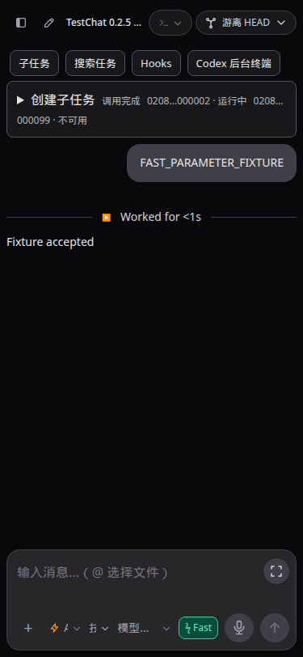
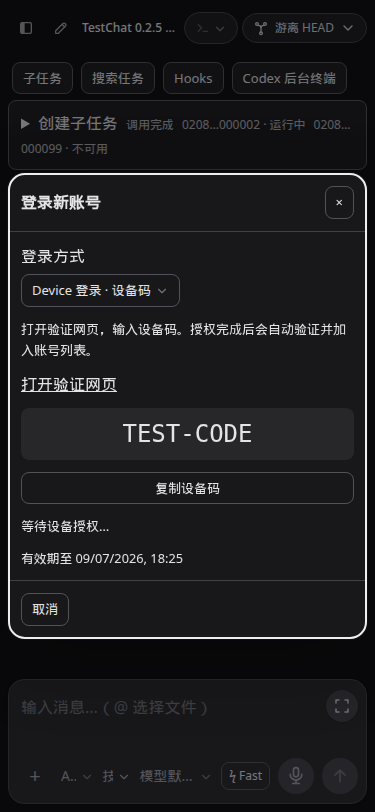
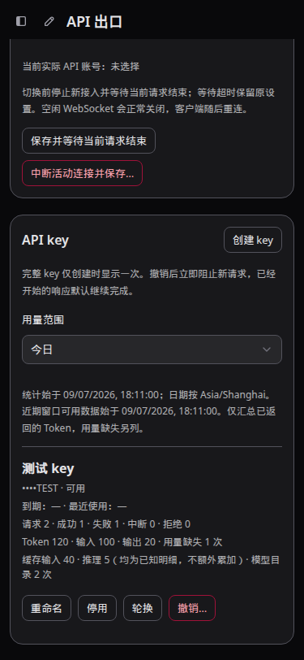
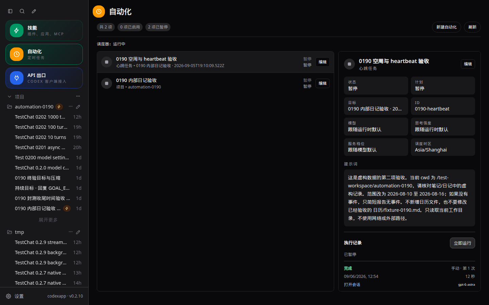

# CodexApp 0.2.10 开发方案

## 文档目的与维护方式

本方案从日常使用测试中持续积累问题和改进项，作为 0.2.10 的统一开发入口。用户已于 2026-09-07 明确要求“现在开启在59001上，0.2.10的开发”，本轮据此实现以下四项并部署隔离候选。后续反馈追加到本文；同一问题补充原条目，保留稳定编号，不重复创建方案。

实施基线为 0.2.9 / `c6cb616`，本轮分支为 `feature/0.2.10-development`。候选使用 `codexapp-multi-account-dev` 容器和独立 `codexapp-multi-account-dev-home` 卷；生产 5900 仍为 0.2.9。本轮已执行隔离探针、候选真实 API 调用与登录启动/取消检查；完整网页授权留待用户操作。

条目状态依次为：待复现/待细化 → 方案待审阅 → 已确认待实施 → 实施中 → 待验收 → 已验证。需求积累期不预设截止日期。各条目中的初始定位与验收清单保留作后续测试依据，实际实现及本轮验证范围见文末；未覆盖项不视为已验证。

## 当前修改项

| 编号 | 用户反馈/需求 | 建议优先级 | 当前状态 |
| --- | --- | --- | --- |
| API-01 | API 出口报 400 或其他错误后，可能停止供应 API，需要在管理里重新勾选启用 | P1：供给可靠性 | 已修复可复现的组件冷却问题；持续观察原始偶发现象 |
| API-02 | 给 API key 增加用量统计 | P2：使用可见性 | 已实现累计/今日/近7天；真实 JSON/SSE usage 对账通过 |
| CHAT-01 | 对话输入框提供 Fast 选项，可选择快速模式 | P2：对话效率 | 已实现，输入区直接切换并沿用持久化设置 |
| AUTH-01 | 登录新账号时，可选择链接登录并粘贴回调链接，或使用 Device 登录 | P2：账号接入便利性 | 已实现，两种真实启动/取消通过；完整网页授权待用户验收 |
| UI-01 | 左上角“自动化”入口改用钟表图标 | P2：入口辨识 | 已实现，侧栏与自动化标题统一，浅深主题通过 |

## API-01：错误后的 API 出口恢复

### 问题与目标

保留反馈中的“可能”：目前没有确认每次 400 都会触发，也没有确认是否真的修改了持久化启用配置。用户当前的恢复办法是进入管理重新勾选启用；这是现象记录，不是最终修复方案。

目标是普通请求错误只影响该请求。上游临时故障解除后，后续合法请求能够恢复供给，无需重新勾选启用；账号必须重新登录或额度耗尽等不可即时恢复情况，应准确展示原因和所需操作。用户主动关闭出口后，系统必须保持关闭。

### 实施前检查的源码事实

- `src/server/apiProxy/gateway.ts`：HTTP 转发遇到状态码 ≥400 时设置 `component.lastError`；该分支未直接将 `settings.enabled` 改成 false。
- 同文件的设置保存流程会 drain、停止组件，再根据启用设置重新准备组件。因此“重新启用后恢复”也可能来自组件重建，不能据此认定是开关被自动关闭。
- `src/server/apiProxy/component.ts`：组件准备已有并发合并及最长 30 秒退避；复用判断涉及子进程存活、账号和凭据 revision。进程存活不等于内部上游路由可用，是否存在内部故障状态尚待复现。
- `src/components/api-proxy/ApiProxyPanel.vue`：界面区分启用、就绪和错误；设置草稿与服务端状态分别存储，后续应核对页面显示与真实配置是否一致。

### 复现与定位步骤

1. 核对发生问题的实际版本、端口、部署产物及配置目录；记录故障时间、客户端、接口、模型、HTTP/JSON/SSE/WS 传输方式，以及脱敏错误码。不要保存 key、认证或请求正文。
2. 比较故障前、故障后、手动恢复后三个时点的 `enabled`、`ready`、`lastError`、draining、活动连接/请求数、组件进程及代际、账号状态。区分真实配置关闭、界面草稿误显示、组件故障、账号问题与并发槽位未释放。
3. 在隔离环境先成功调用，再分别注入参数错误 400、认证 401/403、限流 429、上游 5xx、超时、连接重置、SSE 中途错误及 WS 单轮失败；每次错误后再次发送独立的合法请求，检查是否恢复。
4. 若进程仍在但合法请求持续失败，进一步检查固定版本 CLIProxyAPI 的错误后路由状态与冷却机制；先取得对应版本证据，再决定是否需要组件级修复或升级，不预先归因。

### 拟定修复原则

- 将“用户期望启用”与“运行可用性”明确分离；请求失败不得隐式永久关闭出口或 key。
- 400 等请求内容错误直接返回；401/403 根据实际原因区分认证、权限与请求问题；429 尊重可用的重试提示；网络/5xx 采用有上限的恢复退避。
- 如证据表明需要重建组件，应合并并发恢复任务，限制频率，保留在途请求与原有账号协调、凭据代际边界。不得每次 400 都重启组件。
- 恢复面向后续请求，不自动重放已发送的生成请求，避免重复生成和重复消耗。
- 每条终止路径只释放一次活动记录和并发占用；WS 按轮次处理失败，避免连接仍在而槽位永久 busy。
- 管理页面准确显示停用、恢复中、暂时不可用、需登录等状态；成功恢复后清除过时错误。是否新增手动恢复操作，待根因确定后决定。

### 验收标准

- 400 → 新的合法请求成功，启用设置保持；连续错误和多 key 并发不造成全局永久停供。
- 网络/5xx 故障解除后，在实现时明确的有界恢复窗口内恢复，无需重新勾选；不可恢复错误显示真实原因，不承诺自动修复账号权限或额度。
- JSON、SSE、WS 的失败/取消均释放占用；同一 WS 的后续轮次按协议继续，或明确要求重连，重新连接后可用。
- 手动停用、账号切换、凭据刷新和 drain 期间不被后台恢复错误地重新开启。
- 刷新页面、重启候选后，启用状态与持久化配置一致；保留故障到恢复的脱敏证据。

## API-02：API key 用量统计

### 实施前能力与入口

`src/server/apiProxy/store.ts` 的 key 数据包含 `lastUsedAt`，未包含累计请求和 Token 字段。`activity.ts` 的最近活动仅驻留内存，最多保留 500 条/7 天，快照最多返回 100 条，不能作为持久化账本。组件配置当前关闭其内部 usage statistics；外部 key 在 CodexApp 校验，上游组件使用内部 key，因此不能直接拿组件内部 key 总量充当用户 key 用量。

拟在管理页现有 API key 列表展示概要，按需查看详情。统计归属使用稳定 `keyId`，不依赖名称或 key 明文。

### 建议首期口径

| 指标 | 拟定定义 |
| --- | --- |
| 请求数 | 已结算的有效 key 业务请求；分成功、失败、中断、准入拒绝；处理中沿用出口活动面板 |
| Token | 上游明确返回的 input/output/total；缓存输入和推理 Token 作为可选明细，不重复加进总量 |
| 未知用量 | 上游未提供 usage、流中断或事件无法解析时显示未知，并计入“用量缺失请求数”，不当作 0 |
| 时间 | 最近调用时间、统计起始时间；建议提供今日、近 7 天、累计 |
| 辅助分类 | 首期仅单列模型目录次数；按模型/接口明细作为后续扩展，不计入本轮交付 |

首期建议统计请求与 Token，不估算金额，也不推断账号剩余额度；金额需要另行明确计价来源、模型价格和缓存计费口径。

### 请求与协议边界

- JSON 在完整终态提取 usage；SSE 增量读取终态事件；WS 每个生成轮次独立计数，握手、空闲、心跳和连接关闭不新增生成请求。
- 为每次请求/WS 轮次创建内部统计 ID，成功、错误、取消和关闭回调共享一次性结算入口。客户端主动重试属于新的实际请求；同一轮重复终态事件不得重复累加。
- 有效 key 在准入阶段被拒绝时计入拒绝分类；无法认证或已失效 key 的请求不计入有效业务用量，不为未知调用者创建统计实体。
- 覆盖 Responses、Chat Completions 与 compact；失败请求若有可信 usage 则保留实际消耗，HTTP 200 中的失败事件不能算成功。
- 缓存和推理 Token 是否包含在上游总量中必须按实际返回协议核对；不以字符长度估算，不为请求统计改变客户端流式协议参数。

### 数据与展示设计

1. 在 `CODEX_HOME/api-proxy/usage.json` 下独立保存 schema 1 统计数据，累计量长期保留；近期使用 15 分钟 UTC 桶，保留 8 天、全局最多 32768 桶。超限批量淘汰最早的 2048 桶，并展示实际覆盖起点；不承诺高密度 256 把 key 都具有完整 7 天窗口。
2. 内存增量记账，2 秒合并并串行原子替换；正常退出刷新待写入量。异常进程退出可能损失尚未落盘的约 2 秒加写入耗时的数据；没有承诺断电零丢失，尚未实测断电。读损坏保留原文件并停止覆盖；写失败保留内存量、后续写入或正常退出重试，同时显示错误。
3. 重命名保留历史；停用、过期、撤销后历史仍可查；轮换产生的新 key 独立计数，旧 key 保留其用量。现有 key 从统计上线时开始记录，不能反推历史。
4. 今日/近 7 个自然日遵循项目全局显示时区；15 分钟 UTC 桶按显示时区归日，覆盖现代时区的常见 15/30/45 分钟偏移。今日为本地自然日，近 7 天含今日。
5. 列表只返回累计、今日、近 7 天三组概要，不返回历史桶；页面沿用既有刷新节奏与去重机制，隐藏时停止刷新。空状态区分尚未调用、用量未知与统计读取失败。
6. 首期仅保存 key ID、状态、时间与数值，不保存正文或凭据。统计写入故障不能让一次统计故障导致 API 出口停供。无效 key、出口关闭或账号操作中的认证前拒绝不计入业务统计。

### 验收标准

- 两把 key 的并发请求正确隔离，统计总量与可核验 fixture 一致；重命名、轮换、撤销不串账或丢失历史。
- JSON/SSE/WS 多轮、错误、取消、重复终态、缺失 usage、compact、缓存及推理 Token 均有针对性用例。
- 正常重启保留统计；异常退出、写入失败和旧数据迁移按明确策略处理，不影响认证及出口供给。
- 刷新页面后统计保持；今日/近 7 天跨日与切换显示时区结果正确。
- 浅色、深色及 375×812、768×1024 页面可读，不溢出；展示的请求和 Token 口径与后端一致。

## CHAT-01：对话输入框 Fast 快速模式

### 目标与现状

在对话输入框的常用设置中提供明确的 **Fast** 选项，让用户在发送前选择标准速度或快速模式，并能直接看出当前状态。Fast 是所选模型公布的服务档位，不是另一种模型，也不改变推理强度。

当前代码已经具备主要数据链：

- `src/modelCapabilities.ts` 从模型目录读取 `serviceTiers` 和 `defaultServiceTier`，并生成服务档位选项；当前已验证目录中的 Fast 实际 ID 为 `priority`。
- `src/components/content/ThreadComposer.vue` 已在“+”菜单中放置服务档位选择器并显示目录描述，但入口较深，快速模式不够直观。
- `src/composables/useDesktopState.ts` 按 provider/模型保存 speed mode，将历史 `fast` 别名迁移为目录存在的 `priority`，发送时把最终选择作为 `serviceTier` 传入现有请求链。
- 排队消息和自动化已有独立的 `serviceTier` 快照或配置。本条目只改善普通对话输入框的入口，不顺带重做自动化界面。

### 拟定交互

1. 在对话输入框控制区提供紧凑的 Fast 开关或二选一控件，复用现有选择状态与请求链；不再创建第二份快速模式状态。
2. 所选模型明确公布 Fast 档位时允许切换。发送请求使用目录返回的真实 ID，例如 `priority`，界面文案显示 `Fast/快速模式`，不向协议发送字面值 `fast`。
3. 关闭 Fast 时显式回到标准速度/模型默认档位。界面同时明确“Fast”和推理强度是两个独立设置，避免用户把 Fast 理解为降低思考强度。
4. 切换模型或 provider 时，按现有“provider + 模型”维度读取已保存选择；目标模型不支持当前档位时禁用 Fast 并提示原因，不把不兼容值静默发送。
5. 新对话沿用对应 provider/模型最近一次明确选择；刷新后保持。若运行时目录尚未加载或服务商未公布服务档位，控件显示不可用状态，不猜测支持。
6. 发送中或设置正在保存时禁用重复切换；切换失败恢复原显示并给出可见错误。排队消息继续保存入队时的 service tier，后来切换 Fast 不应改写已排队消息。
7. 桌面端应能一眼看到当前是否为 Fast；移动端保持紧凑，不挤压发送按钮、语音和附件入口。最终控件形态在实施前结合现有输入区布局确认，使用项目共享组件和主题变量。

### 验收标准

- 支持 Fast 的模型可在输入框直接切换标准/Fast；发送探针中的 `serviceTier` 分别为 `null`/模型默认语义和目录真实 Fast ID。
- Fast 与推理强度可独立组合，模型、强度、Fast 三项在实际 `turn/start` 参数中均正确。
- 不支持或能力未知的模型不能误发 Fast；从支持模型切到不支持模型时显示明确状态，并允许用户恢复到标准速度。
- 同一 provider/模型刷新后保留明确选择；不同模型或 provider 不串值。新建、切换和恢复会话时显示与实际发送值一致。
- 活动回合中排队后再切换 Fast，已排队消息使用原快照，新发送消息使用新选择。
- 浅色、深色以及 375×812、768×1024、1440×900 下控件无溢出、遮挡或错误浅色表面；键盘操作、焦点、`aria-checked`/可访问名称符合实际状态。
- 性能检查确认没有因显示 Fast 控件增加模型目录重复请求、发送重复请求或额外轮询。

## AUTH-01：新增账号支持两种登录方式

### 目标与现状

用户点击新增账号后，先选择“链接登录”或“Device 登录（设备码）”，再启动对应登录流程。链接登录保留“打开授权链接 → 完成授权 → 粘贴完整回调链接 → 确认”的操作；Device 登录提供验证网址和设备授权码，用户完成网页授权后由应用检测结果，无需粘贴回调链接。

实施前源码检查：`src/App.vue` 的新增账号操作直接启动链接登录并打开授权页面；`src/server/accountAuthCoordinator.ts` 在隔离的 pending CODEX_HOME 中启动 CLI 登录，完成接口要求回调 URL，再校验凭据和账号身份、探测账号并入池。本轮已扩展为两种入口共用账号校验和入池流程。

### 拟定设计

1. 登录弹窗使用项目共享组件，先显示两种方式的简短说明和选择控件；建议默认保持链接登录，用户明确开始后才创建登录进程。回调输入框仅在链接模式出现，设备模式提供“打开验证网页”“复制设备码”和等待授权状态。
2. 登录启动请求支持 `method: link | device`，省略时保持链接登录。Device 使用已核验的打包 CLI 0.153.4 `codex login --device-auth`，解析实际验证网址与设备码格式；授权服务轮询由 CLI 负责。
3. 两种方式都使用本次登录独立的 pending CODEX_HOME，完成后复用凭据解析、账号身份检查、探测、去重和原子入池；不能仅凭授权网页完成或子进程退出就显示登录成功。新增账号沿用既有激活规则，不自动覆盖当前账号。
4. Device 流程由后端管理一个有时限的登录会话；授权轮询只由一个执行方负责，避免 CLI 与应用重复轮询授权服务。前端仅查询本机会话状态，合并重复查询，页面隐藏时暂停前端轮询，恢复可见后读取最新状态。
5. 展示准备中、等待授权、验证账号、成功、拒绝、过期及失败等状态。Device 不可用时明确提示并允许用户选择链接方式；不静默创建另一登录流程。
6. 切换方式或取消时，先取消旧登录会话并清理对应子进程、定时器和临时目录，再启动新会话；旧回调和迟到事件不得影响新会话。页面刷新后恢复仍有效的会话状态，服务重启后对失效会话明确提示重新开始；禁止无限等待或遗留账号操作锁。
7. 设备码、回调中的授权码、Token 不写入普通日志、文档或浏览器持久化存储。首期聚焦新增账号；已有账号重新认证沿用现有行为，若复用到该入口，必须保留目标账号身份匹配约束并单独验收。

### 验收标准

- 新增账号先选方式；两条路径都能在隔离候选中完成真实授权，并在账号列表看到经校验的正确账号，原有活动账号及认证保持。
- 链接模式覆盖错误回调、过期回调、重复提交；Device 模式覆盖等待、成功、拒绝、设备码过期、网络异常及运行时不支持。
- 切换方式、关闭弹窗、刷新页面及服务重启均按上述会话生命周期处理；取消后无遗留进程、无限轮询或操作锁，迟到结果不会入错会话。
- 重复登录同一账号沿用现有去重规则；账号验证失败不入池，不显示假成功。
- 浅深主题、桌面和移动端完整验证方式选择、链接/设备码复制和状态展示；记录脱敏结果，不在截图中暴露有效授权码或回调。
- 性能审计核对登录进程数、轮询次数、状态接口载荷和取消清理；按项目 Provider/Auth Docker 规则验证打包运行与认证回归。

## 实施顺序与验证约束

1. 持续收集反馈，本轮按用户明确授权实现四个条目；新增需求继续追加，不自动纳入生产发布。
2. 四个条目按独立任务提交，API-01 优先处理；AUTH-01 使用已核验的打包 CLI Device 能力。
3. API 条目拟涉及 `src/server/apiProxy/{gateway,component,activity,store}.ts`、新增统计模块、`src/api/apiProxy.ts`、`src/components/api-proxy/ApiProxyPanel.vue`；CHAT-01 拟涉及 `src/components/content/ThreadComposer.vue`、必要的状态连接和相关定向测试。只修改实际需要的路径。
4. 更新 `tests/accounts-feedback-observability/api-proxy.md` 对应手工用例，包含准备、操作、预期和清理。根据最终改动执行定向测试、构建、CJS smoke；触及认证/提供商相关范围时按项目规定完成隔离 Docker 矩阵。
5. UI 改动按项目规定验证真实界面、浅深主题和刷新持久化；使用隔离账号、key 和配置进行故障注入，不对生产制造错误或发送测试消息。
6. 性能审计比较修改前后首包延迟、总耗时、并发吞吐、内存、落盘频率及管理接口请求数/响应大小；重点检查流式解析是否阻塞转发、是否缓冲完整响应、重复请求、恢复风暴、无界存储和缓存失效。未实测项明确标记。
7. 验收通过后单独决定候选准备与上线安排，遵守既有账号隔离、共同空闲检查和发布流程；本方案不授权生产切换。

## 2026-09-07 本轮实现与候选验收

### 当前候选与使用入口

以下表格保留首轮开发验收产物；其后的钟表图标修订和最终 prepare 产物见文末“UI-01 与 prepare 收尾”。

| 对象 | 本轮结果 |
| --- | --- |
| 使用地址 | `http://192.168.50.46:59001/`；本机核验地址 `http://127.0.0.1:59001/` |
| 分支 / 代码提交 | `feature/0.2.10-development` / `90c58fe`（后续文档提交不改变产物） |
| 镜像 | `codexapp-multi-account-dev:ui-0.2.10`，ID `sha256:051f618c83c5bee707b6b16c6140dc184011ea02b5cda905605a9a29a3802d48` |
| 账号隔离 | `CODEX_HOME=/codex-home`，仅使用 `codexapp-multi-account-dev-home` 卷；没有复制生产认证 |
| 依赖 | Codex CLI 0.153.4，CLIProxyAPI 7.2.152 固定校验二进制，沿用已验证的原生依赖基础镜像 |
| 打包文件 | `output/package/codexapp.tgz`，SHA-256 `943fab8e51d86340a3604d725fcc5c2a838d8a82e24f1e521191b1a2e7825c53` |
| 生产状态 | 5900 保持 0.2.9，`codexapp.service` PID 1318574，ExecStart 未变；本轮未发布或合并远端 |

日常试用可刷新候选页面，直接在输入区点击 **Fast**；API 出口页的每把 key 卡片可选择累计、今日、近 7 天。新增账号先选择登录方式，再点“开始登录”：链接方式粘贴完整 localhost 回调；Device 方式打开验证网页输入设备码，完成后等待账号验证。

Device 登录依赖账号/工作区允许设备码授权；若不可用，弹窗支持切回链接登录。接口与能力核对依据为实际打包 CLI 以及 [OpenAI 官方认证说明](https://learn.chatgpt.com/docs/auth)。本轮未代替用户完成网页登录。

### 实际修复和边界

- **API-01**：固定二进制的假上游试验复现了 500 后内部账号冷却导致后续 503 `auth_unavailable`，即使上游恢复也不能立即供给；启用配置没有被改为 false。400 本身未复现同样的持续停供，保留用户原始现象供后续观察。本轮关闭组件内部 cooling，由接入层统一处理恢复：400 直接结束该请求；401/403 至少等待 30 秒；429/5xx 默认指数退避 1–30 秒，有效 `Retry-After` 可延长，最多 24 小时。恢复作用于新的请求，生成请求不自动重放。断连使旧代际失效，后续准备合并执行，仍保护在途连接。
- **API-02**：统计独立于认证和 key 状态。HTTP/compact/WS 每次业务请求只结算一次，WS 握手不计为生成；正常重启保留统计。上游未给出的用量单列，数值只累加已知部分。重命名保留原 key ID；轮换的新 key 使用独立账目，撤销后保留历史。首期没有费用估算、模型/接口明细页或 90 天报表。
- **CHAT-01**：复用原有 provider/模型偏好和请求链，真实 Fast ID 为目录的 `priority`，不改变推理强度或已排队消息的快照。支持模型默认 Fast 的显示；目录没有公布可切回的标准档位时明确禁用并说明。不支持或未知能力不猜测开启，旧的不兼容选择可清除。保存期间控件禁用；保存完成后刷新持久化通过。
- **AUTH-01**：新增共享组件登录弹窗，后台隔离 pending home，两种入口共用账号身份校验、探测和原子入池；新增身份不自动切换活动账号。Device 使用 CLI 唯一一条授权轮询，前端仅每 2 秒查询本机会话；隐藏页面暂停查询，进程成功后仍由后端继续验证。启动、失败、取消、15 分钟超时均有收尾逻辑；刷新恢复有效会话，切换方式先清理旧会话。重新认证复用该入口并保留目标身份约束。

### 验证证据

脱敏总证据：[0.2.10-acceptance.json](evidence/0.2.10-acceptance.json)。临时脚本、运行输出保存在 `/home/Code/codexapp/output/0210/`；该目录不是凭据或账号数据的归档来源，文档同步只使用明确选出的脱敏证据。

| 验证 | 方法 / 结果 |
| --- | --- |
| 全量单测 | `pnpm run test:unit`：69 个文件、446 项通过；含协议结算、双 key、正常重启、时区跨日、坏文件保护、写失败恢复、Device 自动入池/取消/失败及旧身份约束 |
| 构建 | `pnpm run build`：类型检查、前端、CLI 构建通过；沿用已有大 chunk 提示，未新增安装依赖 |
| 固定二进制故障探针 | `CPA_BINARY=$PWD/output/api-proxy-component/cli-proxy-api node scripts/probe-api-proxy.cjs`：19 项通过，包括真实二进制向假上游发送的 400/500 后恢复、零生成重放、SSE、WS 两轮、opaque compact、凭据代际 |
| 59001 真实 API | 两把新临时 key，`gpt-5.6-luna` 的一次 JSON 和一次 SSE 均完成，各 input=14、output=5、total=19；管理统计逐 key 对账一致。另有一次本地协议校验 400，随后 JSON 200；没有把这次本地 400 作为真实上游错误复现 |
| 真实登录进程 | 在 59001 启动链接和 Device 各一次，验证网址、设备码形状、等待状态、错误回调拒绝和取消；账号池/活动身份未变，pending 目录数为 0，操作锁释放。真实授权码没有写入证据或截图 |
| Provider/Auth Docker | localhost 59011 无认证→Zen；59012 假无效认证→Codex 失败回合；59013 畸形认证→Zen；59014 Zen→OpenRouter。四个临时容器使用独立测试卷和同一打包镜像，完成后清理 |
| 错误刷新持久化 | 59012 无效认证的真实失败回合，刷新后错误仍显示，浅深主题通过，重复 live overlay=0；其他三场景浅深页面无启动错误 |
| 候选正常重启 | 重启前后分别 drain/共同空闲核验；累计和近期统计、启用设置、活动身份完全保留，两把验收 key 的撤销状态保留 |
| 打包运行 | 镜像内 CJS 加载公共 CLI 入口、帮助退出码 0；`node-pty.spawn('/bin/sh', …)` 的输出和退出码通过。CLI、主 JS/CSS、ThreadConversation 和 API 面板共 5 个文件与本地构建 SHA-256 一致 |

打包部署使用既有候选脚本；它先构建/打包镜像，再 drain 并独立核对空闲，成功启动后才移除旧候选容器：

```bash
CODEXAPP_REPLACE_DEV=1 \
CODEXAPP_MULTI_ACCOUNT_IMAGE=codexapp-multi-account-dev:ui-0.2.10 \
CODEXAPP_MULTI_ACCOUNT_DOCKERFILE="$PWD/scripts/docker-api-proxy-dev.Dockerfile" \
bash scripts/run-multi-account-dev.sh

docker exec codexapp-multi-account-dev node -e \
  "process.argv=['node','codexapp','--help'];require('/usr/local/lib/node_modules/codexapp/dist-cli/index.js')"

CODEXAPP_IDLE_CHECK_URL=http://127.0.0.1:59001 node scripts/check-codexapp-idle.cjs
```

### 页面与性能

Browser Use 不在当前可用工具中；本轮使用 Playwright CJS，其网络拦截用于确定性模型目录、参数捕获、登录错误和 usage 注入。先在当前工作目录的 4173 验证，再对 59001 打包界面复核；没有用假数据截图冒充真实 OAuth 完成。

页面目标为 `http://127.0.0.1:59001/#/thread/02080000-0000-7000-8000-000000000001`（注入的测试会话）及 `http://127.0.0.1:59001/#/api-proxy`。1440×900、375×812、768×1024 各浅/深两主题共 6 组全部通过：Fast 请求实际参数 `priority`/关闭后的 `null`、刷新保持、Device 刷新恢复、方式切换取消旧会话、错误回调显示、用量窗口切换、页面无横向溢出、无 pageerror。另覆盖 Fast 能力未知、不支持、已保存不兼容值、默认 priority 四种边界。

截图完整原件：`/home/Code/codexapp/output/playwright/0210-{fast,device,link,usage}-{1440,375,768}-{light,dark}.png`。文档保留以下 375×812 深色界面示例，设备码及统计数字均为测试 fixture：







| 性能检查 | 测量 / 结论 |
| --- | --- |
| 统计压力 | 49 把 key、模拟 7 天、33000 次结算：满载逐条淘汰优化为批量淘汰，记账从一次约 2225 ms 测量降至 70.96 ms；当前概要查询 30.36 ms、落盘 49.32 ms、文件 7.72 MB、返回概要 31840 B，RSS 增量约 83.3 MiB。仅为单进程微基准，不等同线上 QPS |
| 流式路径 | 使用既有 SSE 行解析和 WS 帧处理提取 usage；未为统计新增整条 SSE 缓冲或上游重试。每个终态常数次计数更新，2 秒合并落盘；JSON/compact 沿用既有响应上限 |
| 首页真实 profile | 当前 4173 / 1440×1000、等待 7 秒：实际 API 14.8 KB，thread/list、模型目录、skills 各一次；登录状态启动查询一次，弹窗未打开时无持续轮询。页面未停在 Loading threads |
| profile 限制 | provider-models 耗时 1245 ms，产生一条已有提供商目录慢请求警告；未证明其性能已解决，也未测生产首页或长线程。命令使用 `PROFILE_BROWSER_EXECUTABLE=/snap/bin/chromium`，因环境未安装 Playwright 默认浏览器 |
| 登录成本 | 真实链接启动约 145 ms，Device 启动约 1244 ms；状态载荷分别约 687/258 B（正文脱敏）。仅一条 CLI 登录进程；本机会话查询至多每 2 秒一次，闭窗/隐藏停止持续查询 |
| 构建产物 | 主 JS 643.09 kB（gzip 206.12），API 面板 17.24 kB（gzip 6.49）；Fast 不新增目录请求或状态轮询 |
| 未实测 | 相同真实上游的修改前后并发 1/4/8 吞吐、首包 p95、长时间压力和断电丢失窗口；两次短生成总耗时约 3.79/2.18 秒，只能证明短调用可用 |

### 回滚与后续试用

回滚候选时先停止新准入并重新取得共同空闲结果，检查登录操作也已结束，然后使用保留的 `codexapp-multi-account-dev:ui-0.2.9` 镜像重建同名候选，继续挂载现有独立卷。旧镜像 ID 已核对为 `sha256:c444771e20da82c88123698cd087803c483b6af3a1a6307c4532f29632add25a`。保留 `usage.json`、账号、会话和撤销状态；旧版忽略新增统计文件，但旧版运行期间不会继续记账。不要用旧认证快照覆盖新凭据，也不要在当前 0.2.10 源码上仅更换镜像标签后运行构建脚本，那会将新代码误标为旧版。候选替换脚本在新容器启动失败时会尝试恢复上一个候选；本轮没有实际执行降级回滚。

本轮只清理新建的 59011–59014 测试容器/卷，撤销 59001 的两把验收 key，保留 59001 候选和 4173 验证服务器。生产 5900 及其认证目录不属于本轮切换范围。

待试用补证：用户分别完成一次链接和 Device 的真实网页登录，验证最终账号身份；观察原始“400 或其他错误后停供”是否仍出现；补充不同账号/模型的长流中断、真实额度限制和长期运行样本。发生异常时记录时间、接口、HTTP/事件错误码和出口状态，勿粘贴 key 或回调授权码。后续新需求继续使用本文稳定编号追加。

## UI-01 与 prepare 收尾（2026-09-07）

用户新增要求：左上角“自动化”改用钟表样式，然后 prepare。已在提交 `98fe257ff908` 增加圆形表盘、时针/分针的静态 SVG，并统一侧栏自动化入口与自动化页面标题旁图标。沿用原有橙色、尺寸和导航；技能入口保持原图标。

4173 当前源码与 59001 打包候选均完成 1440×900 浅/深主题检查，验证实际圆形表盘、指针和点击后的自动化路由。最初开发页有一次加载失败，后续重跑成功；没有把失败页面作为验收证据。原始截图为 `/home/Code/codexapp/output/playwright/0210-clock-{light,dark}.png`，URL 为 `http://127.0.0.1:59001/#/automations`。定向 UI 检查和构建通过；此次静态图标调整不重复运行整套认证矩阵。



性能：仅新增一个静态 SVG 组件（一个 circle、一个 path），无请求、定时器、动画或新增依赖。主 JS 从 643.09 kB / gzip 206.12 kB 变为 643.47 kB / gzip 206.20 kB；CLI 内容哈希保持一致。

| 对象 | 最终结果 |
| --- | --- |
| 59001 镜像 | `codexapp-multi-account-dev:ui-0.2.10`，`sha256:c7871d8164b2f0eab62d082b690875992a8d183266c2a3e0098b26cc8cac89eb` |
| prepare 完成时间 | 2026-09-07 19:11:35 +08:00 |
| 发布目录 | `/home/docker/codexapp-releases/codexapp-0.2.10-98fe257ff908-20260907-191050` |
| tarball SHA-256 | `a7e9b9cd3b6a1ab84a8cad04fd077b49ea1e151e125d2636c39e402024502fb5` |
| 校验 | 版本/readiness 标记、公共入口 CJS、主 JS/CLI 与候选哈希一致、主机原生 PTY 实际 spawn/data/exit 通过 |
| 独立启动 | 使用新临时 CODEX_HOME 在 localhost 59021 启动发布目录；调度运行时 ready、固定反代组件 installed，完成后已停止本次 smoke 进程 |
| 切换检查 | `check` 返回 3：activeTurns=1、apiConnections=2、apiActiveRequests=2；后台终端检查因已忙而跳过，不能推断后台空闲 |
| 生产 | 5900 仍为 0.2.9，PID 1318574，未执行 activate、生产重启或认证切换 |

实际准备命令：

```bash
npm_config_nodedir=/root/.cache/node-gyp/24.19.0 \
  bash scripts/codexapp-release-switch.sh prepare
bash scripts/codexapp-release-switch.sh check \
  /home/docker/codexapp-releases/codexapp-0.2.10-98fe257ff908-20260907-191050
```

本次 prepare 已完成；忙碌结果只阻止激活，不使准备产物失效。未来决定切换时，应在本回合结束后从外部终端对上述精确目录重新检查，并按现有空闲门槛操作，不沿用本轮状态。发布可回退到现有 0.2.9 代码，保留账号、会话、key 撤销状态及新增统计文件；本轮未实际执行降级。

完整脱敏证据：[0.2.10-prepare-verification.json](evidence/0.2.10-prepare-verification.json)。此前真实网页 OAuth 完整授权等待试用项目继续保留，不因 prepare 自动转为已验证。

AUTH-01 拟涉及 `src/App.vue` 的账号登录入口、`src/api/codexGateway.ts`、`src/server/accountRoutes.ts`、`src/server/accountAuthCoordinator.ts` 及对应测试；更新账号登录相关手工用例，确保链接登录回归通过。

## 回滚与数据兼容

API-01 应能独立回退代码，保留用户真实启用配置和账号状态。API-02 的数据格式需可识别版本，旧版应不受独立统计文件影响；回退保留统计文件，不恢复旧 key/凭据快照。正式实施前验证旧版本实际兼容性，并记录回滚所需的精确候选产物。

## 后续反馈模板

每次反馈补充以下信息，缺失项可标为未知，不阻塞先记录：

- 编号/标题、发现日期、实际版本和使用入口。
- 触发步骤、预期行为、实际表现、发生频率及影响范围。
- 脱敏错误码/时间、是否能恢复及当前绕过方法。
- 建议方案、待确认问题、验收标准与当前状态。

## 本次记录与交接

2026-09-07：建立 0.2.10 持续开发方案，录入 API-01、API-02，并完成相关源码只读核对。

2026-09-07：新增 CHAT-01“对话输入框 Fast 快速模式”。核对后确认模型目录、会话状态及请求链已有 service tier 能力，方案聚焦于提供清晰的输入框入口并复用现有真实档位 ID。

2026-09-07：新增 AUTH-01，记录新增账号时选择“链接登录并粘贴回调链接”或“Device 登录”的需求、会话生命周期及验收要求。仅核对现有登录源码，未发起真实授权。

当前未复现故障、未实现功能、未运行构建或性能测试；仅创建和同步文档。本轮为纯文档变更，无需性能审计。

下一步继续在本文积累使用测试反馈；进入实现前先审阅范围和具体方案。项目主文件位于 `docs/plans/`，Obsidian 同名副本位于 `开发/codexapp/`，后续更新保留本文件名并同步核对。
