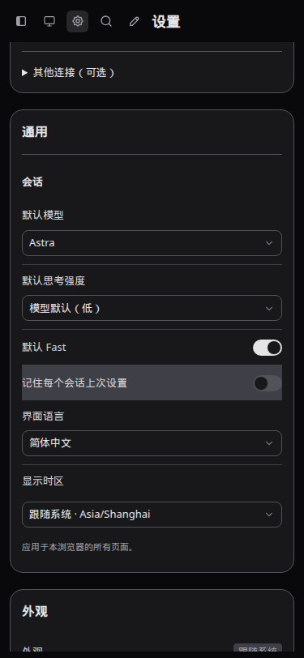
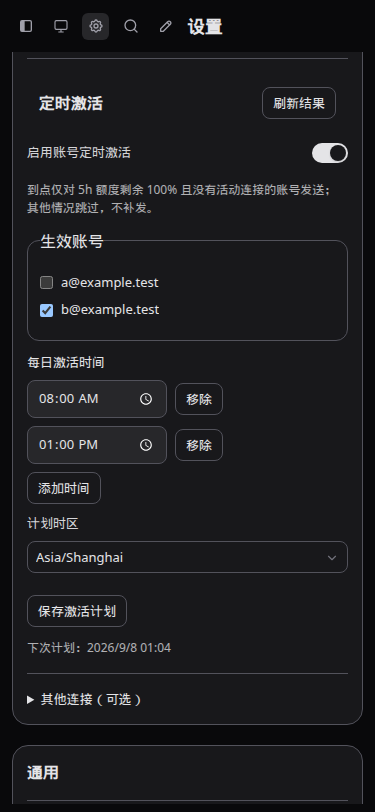
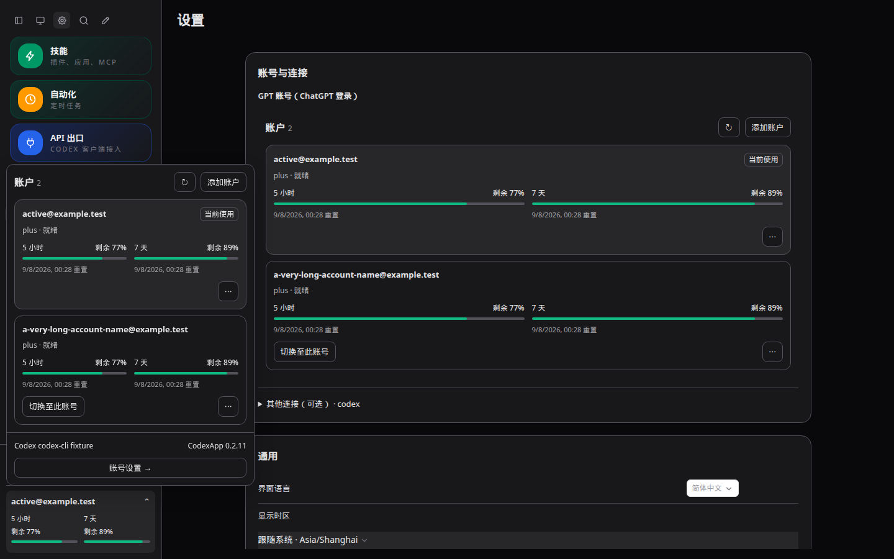
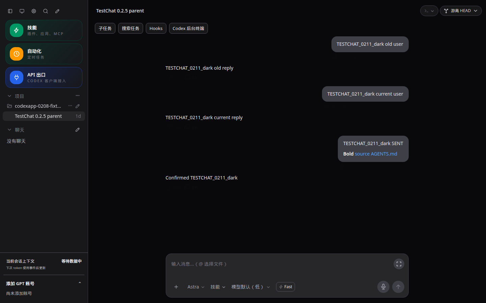
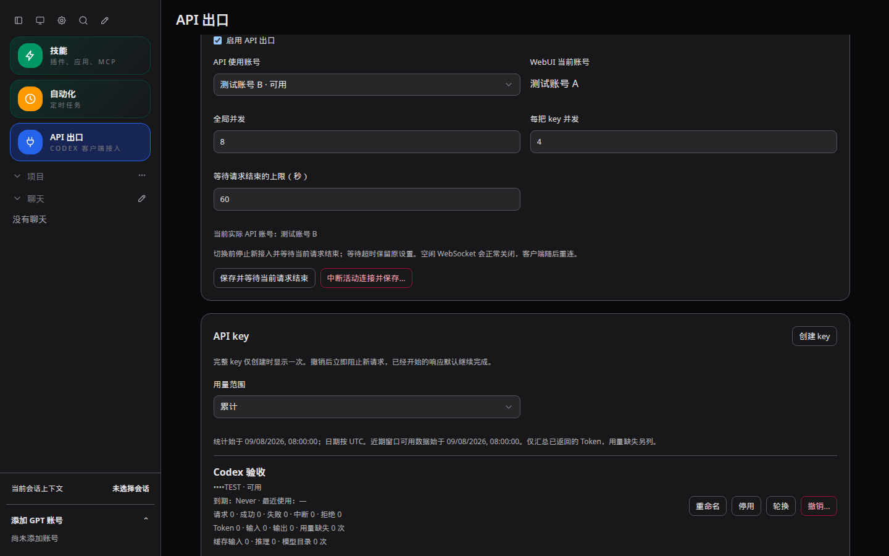
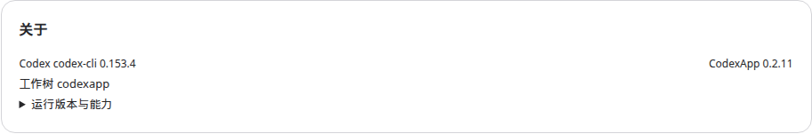
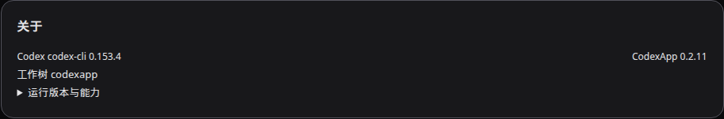

# CodexApp 0.2.11 开发与 59001 验收

## 结果与运行边界

0.2.11 已部署到 http://192.168.50.46:59001 ，可开始使用测试。源码分支 `feature/0.2.11-development`，功能提交截至 `2c6ead1`，版本 `0.2.11`，实测 CLI `codex-cli 0.153.4`。未推送、合并、发布 npm 或激活生产版本。

最终镜像：`sha256:f2f0ed2fdbda326801f406f6fea66558437c06784453569177784d02ad0614c3`；容器 `codexapp-multi-account-dev`。候选沿用独立命名卷 `codexapp-multi-account-dev-home:/codex-home`，另挂载 `/home/Code:/home/Code` 与已有测试工作区卷。未挂载或复制生产 `/root/.codex`。生产 `codexapp.service` 保持 active、MainPID `3002098`。

切换前空闲检查：activeTurns、queued、pendingApprovals、apiConnections、apiActiveRequests、backgroundThreads、loadedThreads 均为 0。上一候选保留为 `codexapp-0210-before-0211`；最终前一版保留为 `codexapp-0211-before-entry-fix`。账号激活计划恢复为关闭，验收临时 API Key 已撤销。

## 实现内容

| 范围 | 最终行为 |
| --- | --- |
| 顶部与设置 | sidebar → 主题 → 设置 → 搜索 → 新对话；主内容设置页分账号与连接、通用、外观、输入与发送、集成、关于六块，GPT 主入口、其他来源折叠为可选 |
| 底部与账号 | 上下文与激活账号额度分别常驻；账号卡片统一字号、窗口布局与操作入口；弹层和关于均显示双版本，完整能力移入关于并去除过时能力说明 |
| 输入栏 | Fast 仅点亮自身闪电，模型行宽度不变；加号垂直对齐 |
| 会话偏好 | 默认模型/强度/Fast、每会话记忆默认开启；显式登记 WebUI 新建会话，后台入口不读取偏好；UI 不添加适用范围长说明；返回会话时正确应用策略 |
| 问题回答 | 普通入队成功不等于回答送达；引导投递要求 turnId 确认，稳定 ID 重试，未确认不显示已回答、不进入通用可编辑草稿区 |
| 消息与侧栏 | 发送确认即本地显示，队列转引导复用回执；历史/实时合并及渲染缓存按会话/轮次/消息身份处理；旧轮次事件及旧列表不回退新状态，重连校准 |
| API 文案 | 删除“（均为已知明细，不额外累加）”；无期限显示“到期：Never”，实际日期与计数不变 |
| 定时激活 | 总开关、选账号、多个每日时间与时区；仅原始 5h 已用为 0 且无连接的账号可进入发送；独立临时固定账号反代，无全局切换/刷新，最终准入检查、持久去重、错过或不满足即跳过 |

定时激活固定采用目录和真实请求验证可用的 `gpt-5.6-luna`、低强度、标准速度、固定短消息，不携带会话历史、项目或工具。当前主运行时激活账号保守视为已连接。准备阶段有前台活动、关闭计划或凭据版本改变时取消发送；发送结果未知不自动重试。无法观测其他设备连接，不能把本机无连接解释为全局无活动。

## 自动化、构建与包验证

最终源码运行下列测试：**13 文件 / 163 项通过**（1.82 秒）。

```bash
./node_modules/.bin/vitest run src/messageIdentity.test.ts src/webConversationPreferences.test.ts src/composables/useDesktopState.test.ts src/api/normalizers/v2.test.ts src/api/codexGateway.test.ts src/server/accountActivationScheduler.test.ts src/server/accountAuthCoordinator.test.ts src/server/accountAppServerProbe.test.ts src/server/apiProxy/component.test.ts src/server/apiProxy/gateway.test.ts src/server/deliveryService.test.ts src/server/deliveryStore.test.ts src/server/threadHistory.test.ts
pnpm run build
pnpm pack --pack-destination /tmp
node -e "process.argv=['node','codexapp','--help'];require('./dist-cli/index.js')"
cp /tmp/codexapp-0.2.11.tgz output/package/codexapp.tgz
docker build -f scripts/docker-api-proxy-dev.Dockerfile -t codexapp-multi-account-dev:ui-0.2.11 .
```

构建（含类型检查）、打包、CJS 公共入口加载全部通过；CJS 命令退出 0 并打印 CLI 帮助。镜像复用已验证 CLI/原生依赖底座，对打包依赖清单逐项比较（仅忽略版本号），检查真实 `node-pty.spawn` 导出及反代二进制哈希。CLI 构建 810.64 KB，仍有既有前端大 chunk 提示。本次没有改动依赖清单。

## 浏览器验证与截图

本会话无可调用 Browser Use，按仓库规则使用 Playwright CJS 与 `/snap/bin/chromium`。默认测试 URL 为 `http://127.0.0.1:4173/` 的 `#/settings`、`#/thread/<fixture-thread>` 和 `#/api-proxy`。使用受控 RPC/历史延迟及事件 fixture；这部分不代表真实模型已接收所有问题回答。

| 脚本（项目根目录运行 node） | 视口/主题 | 已断言结果 |
| --- | --- | --- |
| `output/0211/ui.cjs` | 1440×900、375×812、768×1024；浅/深 | 六分块、顶部入口、账号弹层双卡片和版本，无页面异常 |
| `output/0211/toolbar.cjs` | 同上 | Fast 启用不改变模型行位置/宽度，独立附加图标为 0，加号中心差 ≤2px |
| `output/0211/settings-flow.cjs` | 同上 | 两个激活时刻保存/刷新持久、默认 Fast 与记忆开关持久、不写全局 Codex Fast 配置、深色无白色控件 |
| `output/0211/default-entry.cjs` | 桌面 | 设置返回空白会话应用新默认值，手动改动保持至下次进入 |
| `output/0211/chat-flow.cjs` | 1440×900；浅/深 | 不同轮次相同原始 ID 正确显示；确认消息先于延迟历史出现，同步及刷新仅一次；TestChat hrefOk/titleOk/textOk 全为 true |
| `output/0211/steer-question.cjs` | 同上 | 队列转引导立即出现且刷新不重复；回答未确认保留未回答状态，无通用队列操作，同 ID 重试后已回答 |
| `output/0211/api-ui/ui.cjs` | 三视口；浅/深 | 真实统计分块无重复说明、无到期值显示 Never；Key 新建/轮换/撤销、有限期限和 Provider UI |
| `output/0211/candidate-ui.cjs` | 1440×900；浅/深 | **最终镜像真实 59001** 六分块、激活关闭、About 0.2.11/CLI 0.153.4，无页面异常 |

截图位于 `/home/Code/codexapp/output/playwright/`，本报告将代表截图归档到项目及 Vault 的同名相对目录。以下为截图绝对路径对应后缀与内嵌预览；settings/activation 是保存刷新后的证据。

`/home/Code/codexapp/docs/plans/assets/0.2.11-verification/0211-defaults-375-dark.png`（4173，375×812，深色）



`/home/Code/codexapp/docs/plans/assets/0.2.11-verification/0211-activation-375-dark.png`（4173，375×812，深色）



`/home/Code/codexapp/docs/plans/assets/0.2.11-verification/0211-accounts-1440-dark.png`（4173，1440×900，深色）



`/home/Code/codexapp/docs/plans/assets/0.2.11-verification/testchat-0211-dark-cjs.png`（4173，1440×900，深色）



`/home/Code/codexapp/docs/plans/assets/0.2.11-verification/0211-api-usage-1440-dark.png`（4173，1440×900，深色）



`/home/Code/codexapp/docs/plans/assets/0.2.11-verification/0211-candidate-about-light.png`、`0211-candidate-about-dark.png`（**59001/#/settings**，1440×900，About 元素截图）





## 隔离包运行与真实账号验证

Provider/Auth 矩阵使用本版打包镜像、独立假凭据卷及本机端口：59011 无认证、59012 无效认证、59013 损坏认证、59014 Zen→OpenRouter。执行 `node output/0211/auth-matrix.cjs` 建立夹具，再运行 `start-invalid.cjs`、`auth-ui.cjs`、`auth-other-ui.cjs`（均在 `output/0211/`）。最后一轮矩阵镜像为 `49606e453193…`，与最终镜像仅差会话默认值返回入口修复；最终镜像再单独核验真实设置页。没有把旧镜像矩阵称为最终镜像全量复测。

无认证/损坏认证正确回退 Zen；无效认证错误浅深主题均在刷新后保留；重复 live overlay 为 0；Provider 切换设置持久。原始结果 `output/0211/auth-{matrix,ui,other-ui}.json`，截图 `/home/Code/codexapp/output/playwright/0211-{invalid,noauth,malformed,provider}-{light,dark}.png`。矩阵容器验收后停止，保留隔离测试卷。

真实 59001 验收（均在最终默认值入口修复前、相同后端逻辑上执行）：

- `node output/0211/candidate-api.cjs`：`/v1/models` 200；故意本地无效请求 400 后正常 JSON 200（4395.7ms）；SSE 200（2393.2ms）。两次短请求各 14 输入 +5 输出=19 Token；不同 Key 计数分离，当前账号不变，临时 Key 撤销。数据为两次样本，不作性能保证。
- 将 `output/0211/probe-build/verify-quota-probe.cjs` 放入候选 `/tmp/` 后运行 `node /tmp/verify-quota-probe.cjs`：真实外部 token 只读探针取得 300/10080 分钟窗口，主账号及凭据版本不变、无全局操作。
- `node output/0211/activation-candidate.cjs`：实际设置下一分钟计划，观察 `skipped / 当前账号已连接`；恢复原关闭设置。没有发送激活消息。

**未验证：真实闲置第二账号发送后 5h 重置时刻启动、真实多账号同时服务的延迟/错误率、其他设备的活动。** 当前候选只有一个主账号，不绕过连接检查。零用量与请求成功也不能替代发送前后原始窗口对比。问题卡片及偶发刷新/侧栏错误已有受控回归，仍需用户原始会话长期使用验证。

## 性能审计

运行：

```bash
PROFILE_BASE_URL=http://127.0.0.1:4173 PROFILE_ROUTE='#/settings' PROFILE_BROWSER_EXECUTABLE=/snap/bin/chromium PROFILE_WAIT_MS=7000 pnpm run profile:browser
```

实际采样 `output/playwright/browser-runtime-profile-settings-2026-09-07T16-56-26-396Z.json`（同名前缀 PNG/trace.zip）：首屏 thread/list **1 次**，skills/rateLimits/providerModels 各 1 次，threadRead/resume 0，重复读取 0，API 载荷 **20.7 KB**，warnings 空、应用正常启动。首次测量发现 ready 导致重复列表请求，修复后只在重连强制校准。该采样在最终纯样式和默认值入口修复前完成；最后入口修复未增加网络请求。

代码路径审计：历史/实时通过线性身份索引合并，文本兜底仅搜索未匹配乐观项；渲染与操作缓存按 thread/turn/item 分隔，不按相同文本粗暴去重。消息确认和队列转引导直接复用投递回执，不新增整段历史读取。状态校准不逐会话无界拉取；完成轮次集合有 2000 项上限。偏好读取本地存储，无额外 RPC。账号弹层刷新不重载所有会话，能力信息缓存。

激活使用一个 10 秒定时器，关闭时无账号额度轮询；到点顺序执行、一组临时进程，准备/请求有界，结果最多 200 条、去重保留 3 天。计划更新持久化并清理临时 worker。未测多账号真实并行请求开销，不能据静态审计宣称零影响。

## 使用观察与回滚

建议在原始问题会话中观察：持续任务的引导消息、问题卡片回答、回复中刷新、后台完成蓝点和重新进入会话的默认值。激活启用前选闲置非主账号及多个时间；原始窗口、最近执行结果和账号是否保持不变是验收证据，不要求 UI 额外解释内部实现。

如需回滚候选：先关闭激活计划并等待工作结束，运行 `CODEXAPP_IDLE_CHECK_URL=http://127.0.0.1:59001 node scripts/check-codexapp-idle.cjs`，通过后停止当前候选并改名保留，再将 `codexapp-0210-before-0211` 改为 `codexapp-multi-account-dev` 并启动。不要操作生产 5900，不删除命名卷。保留 `account-activation/state.json` 已执行标记及浏览器偏好；回退代码不撤销已发送请求。

手工回归清单位于 `tests/theme-layout-terminal/settings-0211.md`、`tests/theme-layout-terminal/chat-state-0211.md`、`tests/accounts-feedback-observability/account-activation-0211.md`。持续需求仍更新原 0.2.11 方案。
