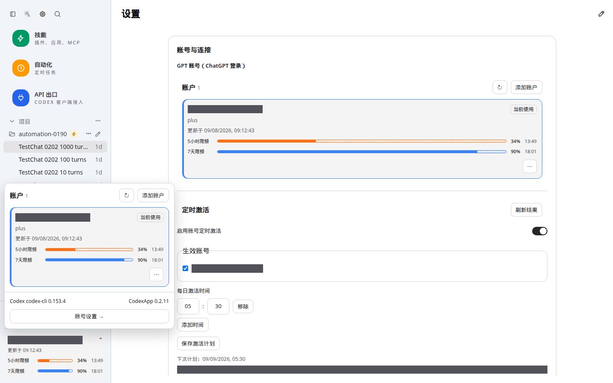
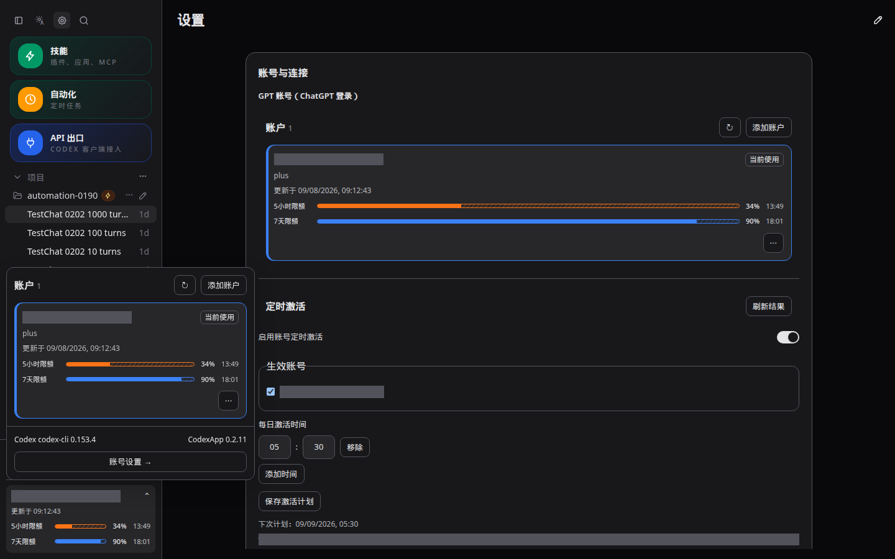
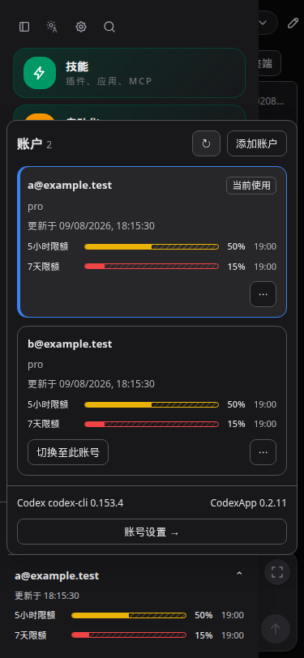

# 结果与接续入口

本轮修改已在 59001 开发候选部署并验收，版本继续为 0.2.11。源码 `/home/Code/codexapp`，分支 `feature/0.2.11-development`。功能提交 `b662c6d`（等级与窗口字段修复）、`2f79fd6`（导航、额度、激活输入与全局时区）。未推送、合并、发布 npm 或激活生产5900。

候选地址 http://192.168.50.46:59001 ，容器 `codexapp-multi-account-dev`，镜像 `codexapp-multi-account-dev:ui-0.2.11-refine`，镜像ID `sha256:77377dfc7eb35763223cf26cbcbe7d0adf4cd82edbbc73ee67e3cc812825f243`。独立卷 `codexapp-multi-account-dev-home:/codex-home`，另保留 `/home/Code:/home/Code` 及 `codexapp-0190-test-workspace:/test-workspace/automation-0190`。未挂载生产 `/root/.codex`。

候选部署前 idle 检查：activeTurns=0、queued=0、pendingApprovals=0、apiConnections=0、apiActiveRequests=0、backgroundThreads=0、loadedThreads=5、pages=1。生产 `codexapp.service` 仍 active，MainPID=3002098，未重启。真实候选原有激活计划处于启用状态，本轮保留其时间、账号及启用状态；验收未发模型测试消息，未更改计划。

# 已实现行为

| 范围 | 行为 |
| --- | --- |
| 主题与导航 | 自动主题太阳+A。展开侧栏顺序为侧栏、主题、设置、搜索；折叠后只保留展开按钮。新建移到内容右上角、Git右侧。 |
| 新建会话 | 项目会话继承当前会话实际 cwd；无项目会话、设置及自动化等非会话路由新建时目录清空，不再继承之前的项目。 |
| 说明文字 | 移除激活条件长句、浏览器应用范围说明；额度行无重复“额度窗口”“剩余”，正常账号不显示“就绪”。错误仍常驻可见。 |
| 账号额度 | 左下角显示更新时间、两行窗口额度和重置时刻；悬停时刻查看完整日期。百分比与实色条均表示剩余额度，已用部分显示斜纹和边框。 |
| 额度颜色 | 根据原始已用比例分档：0–<20蓝、20–<40绿、40–<60黄、60–<80橙、80–100红；当前账号蓝色描边。 |
| 激活输入 | 分别手填小时与分钟，9/7保存为09:07；25小时、60分钟、空值阻止提交。移除独立时区选择，使用全局时区。 |
| 等级刷新 | 实时额度接口的 planType 优先于旧 account/read 的 token 等级；读取账号列表不再以旧JWT覆盖已刷新等级。手动刷新对各账号串行强制刷新额度与等级；后台复用既有5分钟TTL及列表刷新，不额外增加定时器或等级请求。 |

全局时区仍沿用既有浏览器偏好。显式修改时先同步服务器计划，再更新浏览器显示；初次打开设置时自动对齐旧计划。多浏览器使用不同偏好时，以最后一次保存/设置页对齐为准。计划服务器持久保存，关闭浏览器后仍按保存时区执行。时区保存期间禁用重复操作；设置组件重读新的下次计划。无独立计划时区。

# 验证与证据

定向测试 **6文件58项通过**，包括套餐从Plus升级Pro、重新读取仍Pro、再降至Free，以及windowMinutes字段兼容、额度分档、全局时区/夏令时和原激活调度回归。

```bash
pnpm exec vitest run src/api/codexGateway.test.ts src/quotaPresentation.test.ts src/dateTime.test.ts src/server/accountAuthCoordinator.test.ts src/server/accountAuthStore.test.ts src/server/accountActivationScheduler.test.ts
pnpm run build
```

构建含vue-tsc通过，CLI 810.69 KB；保留既有前端大chunk提示。部署脚本再次完整构建、pack、验证打包依赖元数据、node-pty.spawn导出、CLI 0.153.4及反代二进制哈希后才切换。候选包公开CJS入口以下命令退出0、打印帮助：

```bash
docker exec codexapp-multi-account-dev node -e "process.argv=['node','codexapp','--help'];require('/usr/local/lib/node_modules/codexapp/dist-cli/index.js')"
```

无可调用 Browser Use，按仓库规则使用 Playwright CJS 和 `/snap/bin/chromium`，受控RPC/账号数据验证与真实候选分开。4173为当前源码的验证服务器，独立 `CODEX_HOME=/tmp/codexapp-59001-ui-home`；保持运行，不涉及5173或5900。

| 脚本/报告 | 目标与结果 |
| --- | --- |
| `output/0211-refine/ui.cjs` / `ui.json` | 4173，1440×900、375×812、768×1024各浅深：顶部位置、折叠行为、两行额度、真实时区换算、双账号各一次手动刷新、项目归属、时分保存刷新；无pageerror。 |
| `output/0211-refine/edge.cjs` / `edge.json` | 4173：上海18:15:30/19:00切换UTC为10:15:30/11:00；刷新持久、仅一次计划POST；掉登录提示、无项目及自动化路由新建、无效小时/分钟/空值不提交。 |
| `output/0211-refine/candidate.cjs` / `candidate.json` | 真实59001/settings，1440×900浅深。单个真实Plus账号手动刷新成功，quotaStatus=ready且时间推进；更新时间/重置时刻与原始epoch按上海换算一致。无页面异常，计划POST=0。 |
| `output/0211-refine/candidate-screenshots.json` | 同一真实候选浅深截图重新采集，遮盖账号身份；不重复手动刷新。 |
| `output/0211-refine/unit.log`、`build.log`、`deploy.log`、`cjs.log` | 单测、最终构建、候选部署/idle、公开入口结果。 |

人工回归项更新在 `tests/theme-layout-terminal/settings-0211.md` 和 `tests/accounts-feedback-observability/account-activation-0211.md`。

截图原件绝对路径：`/home/Code/codexapp/output/playwright/0211-refine-candidate-light.png`、`/home/Code/codexapp/output/playwright/0211-refine-candidate-dark.png`；URL为 http://127.0.0.1:59001/#/settings ，1440×900。下方为归档副本。





手机375×812浅深及平板768×1024截图：`output/playwright/0211-refine-accounts-<宽度>-<light或dark>.png`、`0211-refine-time-<宽度>-<light或dark>.png`。这些使用fixture，代表图归档如下。



# 性能结论与未验证边界

- 4173真实空白主页：API共14.6KB，warnings=[]，thread/list、skills/list、rateLimits/read、provider-models各一次，最慢provider-models275.3ms。
- 最终真实59001主页：API共104.9KB，warnings=[]，thread/list、skills/list、rateLimits/read各一次，没有重复thread/read；页面未停留Loading threads。最慢为实时quota读取1745.9ms，非新UI阻塞工作。报告 `output/playwright/browser-runtime-profile-home-2026-09-08T01-12-54-913Z.json`，同名前缀PNG/trace.zip。
- 命令：`PROFILE_BASE_URL=http://127.0.0.1:59001 PROFILE_BROWSER_EXECUTABLE=/snap/bin/chromium PROFILE_WAIT_MS=7000 pnpm run profile:browser`。
- 配色与日期是本地计算，格式器仍使用有上限缓存，未增加定时器；新建只调整本地cwd和路由，不添加历史/模型请求。手动刷新串行，双账号fixture各一次，服务器已有按账号去重。现有单账号刷新接口返回全账号列表，大账号池总响应量随账号数平方增长；未进行大账号池压力测试。
- 套餐真实升级/降级只做受控回归，未购买/变更真实套餐；真实Plus刷新成功。未发模型消息测试实际激活窗口，沿用原调度测试和准入规则；后台5分钟TTL是机会式刷新，网页关闭不保证定时刷新等级。

# 部署、回滚与接续

实际部署命令：

```bash
CODEXAPP_REPLACE_DEV=1 CODEXAPP_MULTI_ACCOUNT_IMAGE=codexapp-multi-account-dev:ui-0.2.11-refine CODEXAPP_MULTI_ACCOUNT_DOCKERFILE=/home/Code/codexapp/scripts/docker-api-proxy-dev.Dockerfile scripts/run-multi-account-dev.sh
```

已保留停止状态回滚容器 `codexapp-0211-before-ui-refine`（状态created），使用旧镜像 `codexapp-multi-account-dev:ui-0.2.11`，镜像ID `sha256:f2f0ed2fdbda326801f406f6fea66558437c06784453569177784d02ad0614c3`，挂载和端口与候选一致。

需要回滚时先暂停新工作，关闭/记录当前激活计划并等待其结束，运行 `CODEXAPP_IDLE_CHECK_URL=http://127.0.0.1:59001 node scripts/check-codexapp-idle.cjs`；通过后停止当前候选并改名保留，将上述回滚容器改为 `codexapp-multi-account-dev` 后启动。不要删除命名卷，不操作生产5900。回退代码不会撤回已保存的偏好/计划或已发生的请求。

接续前检查git status、当前分支、59001镜像和实际运行状态；本轮请求已完成，无待部署功能。后续如用户反馈，沿用本报告及 `output/0211-refine/` 证据，不误用此前0.2.11验收文档的旧导航与计划关闭状态。当前已授权范围仅开发候选，不包括生产切换。
