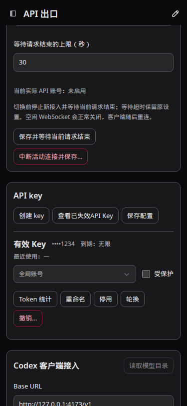
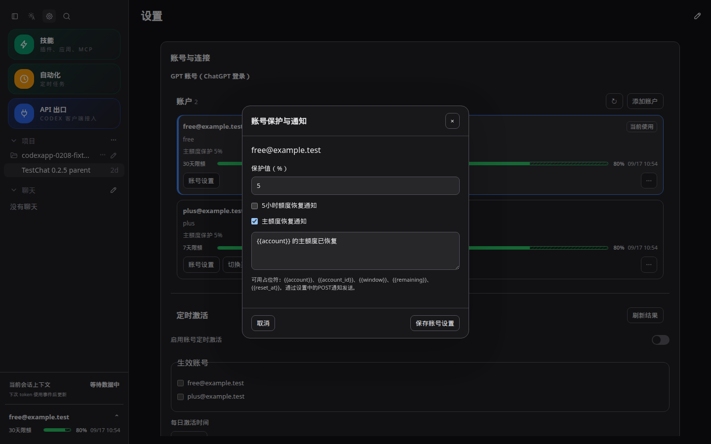
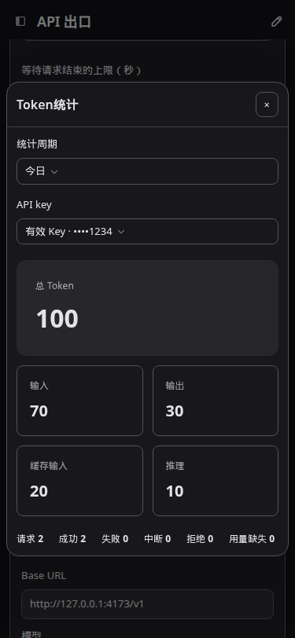
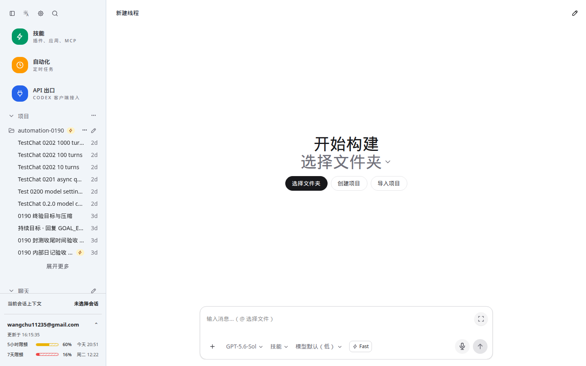

# CodexApp 0.2.12 开发与验收

## 实例与范围

源码 `/home/Code/codexapp`，分支 `feature/0.2.12-development`。候选 http://192.168.50.46:59001/ ，版本0.2.12，容器 `codexapp-multi-account-dev`，镜像 `codexapp-multi-account-dev:ui-0.2.12`。

最终镜像 `sha256:bd36662908918b760536f4876eca48e438ee8f5b61a460fd202264ee56857080`。独立卷 `codexapp-multi-account-dev-home:/codex-home`，未挂载生产 `/root/.codex`。本地与容器 CLI 产物 SHA256 一致：`5c1e1473cbda974b6d06a201958cb5872328e58174b7a943cd376f4d79ce1187`。未合并main、推送或发布npm；未替换5900程序。用户明确授权的5900通知设置已开启，并补齐当时主激活账号的5小时通知规则。

功能提交：`40780f2`账号/模型/续作，`d599a05`界面，`541496d`版本，`4fad30e`45个百分点与主额度文案，`e6df888`Key按钮同排。

## 最终行为

| 用户问题 | 处理结果 |
| --- | --- |
| Key创建弹窗勾选框、窄下拉搜索 | 复选框垂直居中；搜索菜单至少320px，跟随更宽的触发器并限制在视口内，搜索框与菜单宽度一致 |
| 失效Key归档 | 默认只列启用、未撤销、未过期Key；撤销/过期/停用记录通过“查看已失效API Key”查看，保留原数据 |
| 会话和默认模型受代理影响 | Codex会话从主激活账号的独立凭据目录读取模型；API代理目录不参与该目录，其他显式提供商仍使用其目录 |
| 后台CodeX终端影响切换登录 | 确认后台终端是原空闲门禁的一部分；保留门禁，不杀进程、不自动忽略终端，避免带着运行中进程切换认证 |
| Free限额日期与保护 | 长期窗口可覆盖30天；超过7个日历日显示零补齐MM/DD，7天以内周几，今天/明天/后天优先；仍带统一HH:mm。保护作用于长期额度，字段为“保护值” |
| 四个页面风格 | 主标题去装饰图标；最大宽度1100px，内边距24px/手机12px；共享表面、边框、圆角与主题tokens |
| 旧会话蓝点 | 当前列表可能是分页/过滤结果，不再据此删除持久化已读标记；记录已读时保存当前时间与线程更新时间的较大值 |
| Key紧凑布局 | 名称/尾号/到期同行，最近使用下一行，行内账号与保护，Token统计独立弹窗；模块“保存配置”提交已更改策略 |
| 指定冗余提示 | 移除Key一次显示/撤销说明和统计起始/窗口覆盖/缺失用量长提示 |
| 自动化 | 编辑器去掉时区输入，调度器读取全局时区并重算旧任务；固定账号使用独立模型和能力目录，加载失败/尚未完成时不保存 |
| Fast | 开启时闪电黄色发光，按钮黄色发光描边；无持续动画 |
| 账号三点菜单 | 增加面板内边距，按钮宽度限定在面板内 |
| 后续文案 | 概括性周额度/周保护统一为主额度；已有通知模板兼容转换；卡片具体7天限额/30天限额保持 |
| 后续Key按钮 | 同排从左至右：创建API key → 查看失效API key → Token统计 → 保存配置；375px也保持同排 |

Key策略按修改的Key串行保存，不是数据库原子批处理：中途失败会保留已成功结果和未成功草稿，可再次提交。切换账号策略沿用既有断开旧连接语义。

## 额度恢复与续作排查

**最终重置事件标准：剩余额度一次增长至少45个百分点，并且最近10分钟没有进入过手动重置消费RPC。** 比较的是相邻有效快照中的绝对百分点差，不是相对增长率；无需达到100%，也不要求重置时间戳推进。小数运算只容忍浮点表示误差，不把44.999个百分点四舍五入成45。

- 剩余20%→65%：触发；20%→64.9%：不触发。
- 20%→30%虽相对增加50%，仅增加10个百分点，不触发。
- 65%→100%仅增加35个百分点，不触发。
- 重置机会减少不代表使用，过期也可能减少；使用时间在实际调用消费RPC前持久化，凭据轮换保留。调用结果不确定时保守视为近期使用。其他应用消耗重置机会没有本地调用时间证据，未宣称能准确识别。

首次接续只读检查发现：59001容器在2026-09-08 23:30左右退出，日志末尾为Shutting down，未见OOM；未确定由谁发起退出。该实例不运行时自然无法执行后台任务。5900通知总开关关闭、地址为空，当时主账号没有5小时通知规则。用户授权后沿用已有本机通知目标启用配置并测试，测试HTTP200；随后59001应用内测试返回“测试通知已发送”。没有收件端人工确认，不能把HTTP成功当作实际签收。

5900旧续作标记停在unknown，未找到对应投递记录；历史没有保存最初异常，无法严格复原第一次提交失败原因。新代码将参数准备失败保留为可重试；重启后对近期带尝试时间的unknown核对账本：确实未入账可恢复等待，已有收据/队列不重复发送；老记录缺少时间或真正发送不确定仍保守保留。

续作显式发送：“继续刚才做到一半的工作。额度已恢复。先核对现有进度，避免重复执行已完成的操作；如果工作已全部完成，请直接报告结果。” 续作准入仍需账号额度可用、满足保护值且线程空闲；通知事件检测与续作可用性检查是独立链路。没有等待真实5小时窗口完成并验证自然恢复后生成的端到端过程。上述代码修复部署在59001，5900仅更改已授权的通知配置。

## 验证与性能

- `output/0212/final-tests.log`：13文件163项通过，覆盖通知45边界、小数边界、手动重置排除、文案兼容、Free保护、模型账号隔离、自动化全局时区、投递去重、账号与会话状态。
- `pnpm run build`、pack与Docker构建成功。CJS：`node -e "process.argv=['node','codexapp','--help'];require('./dist-cli/index.js')"`，退出0，输出公共CLI帮助；Docker构建确认node-pty的spawn导出和Codex CLI 0.153.4。
- `output/0212/ui.json`：1440×900、768×1024、375×812，浅深共6组。复选框对齐、归档切换、策略保存后刷新保持、未加载旧会话已读标记保留、Fast高亮、固定账号模型隔离通过。
- `toolbar.json`同6组验证顺序与同排；`main-quota-ui.json`验证浅深主额度文案、Free不显示虚构5h保护、7天/30天具体标签保留；`routes.json`四页面浅深共8组验证统一宽度与无标题图标。
- `candidate.json`：最终候选路径59001的设置浅深可加载，无页面异常；`final-artifact.json`记录最终版本、CLI字节哈希和独立挂载。文案/工具栏后续补丁另有定向UI证据。
- 独立59021/59022/59023/59024验证无认证Zen、伪失效认证、损坏认证Zen、Zen切OpenRouter。失效认证刷新后仍在、重复live overlay=0；`auth-matrix.json`、`auth-ui.json`、`auth-other-ui.json`。容器已停止，隔离测试数据保留，无真实凭据。
- 真实候选启动profile：63.1KB API，warnings为空，thread/list/skills/list/rateLimits/read各1次，thread/read重复为0；首次账号模型隔离读取约3211ms，已缓存约1ms。报告 `output/playwright/browser-runtime-profile-home-2026-09-08T22-01-06-478Z.json`。目录探针增加一次有界启动成本；缓存最多16项、30秒、按账号/凭据版本/等级区分，分页最多20页/2000项，无无界并发。模型读取前后激活账号未改变。
- 续作每轮最多核对8项、只提交1项；Key按修改项串行发请求。新样式没有增加轮询或持续动画。已读标记随已读会话数线性增长，未进行超大长期浏览器存储压力测试。

UI截图URL为 `http://127.0.0.1:4173/#/api-proxy` 和 `#/settings`，使用可控数据。原图均在 `/home/Code/codexapp/output/playwright/0212-*.png`，每个JSON记录具体尺寸与绝对路径可由此前缀拼接；截图前等待2.3秒。





## 部署与后续

最后更新命令：

```bash
CODEXAPP_REPLACE_DEV=1 CODEXAPP_MULTI_ACCOUNT_IMAGE=codexapp-multi-account-dev:ui-0.2.12 CODEXAPP_MULTI_ACCOUNT_DOCKERFILE=/home/Code/codexapp/scripts/docker-api-proxy-dev.Dockerfile scripts/run-multi-account-dev.sh
```

`deploy-toolbar.log`确认activeTurns、queued、pendingApprovals、apiConnections、apiActiveRequests、backgroundThreads均为0后替换。4173保留为当前源码隔离验证服务；5173未操作。不要在5900活动会话内直接替换生产；需要升级生产时仍执行既有独立空闲交接流程。回滚候选也必须先排空调度和API、通过空闲检查，用独立候选卷恢复已验证旧镜像；不得同时运行两个共享该卷的实例。

手工用例：`tests/theme-layout-terminal/settings-0212.md`、`tests/accounts-feedback-observability/account-reserve-reset-notifications.md`、`tests/automations/account-routing-quota-resume.md`。本报告与Obsidian同名文件同步，截图副本同步并逐字节检查。


## 后续交互与到期提醒

- Token统计采用AppDialog与AppSelect，选择累计/今日/近7天和全部或指定Key（含失效Key）；展示总量、输入、输出、缓存输入、推理及请求结果。六组视口/主题的工具栏顺序、同排和统计筛选断言通过，URL为`http://127.0.0.1:4173/#/api-proxy`。截图`output/playwright/0212-stats-{1440,768,375}-{light,dark}.png`。
- 账号名称同行右侧显示等级；当前使用位于切换按钮位置，统一按钮字体。去除GPT账号子标题，改为OpenAI账户数量。设置浅深验证含到期提醒默认输入。
- 保存偏好与运行时有效值分离：模型按Astra→Sol→Terra→Luna→5.5向下选择可用项，再退至目录首项；强度选择不高于原偏好的受支持强度，Fast按能力临时关闭。账号目录恢复后使用原偏好，自动回退不写入默认值或会话记忆。偏好沿用现有浏览器localStorage，不迁移为服务器全局设置。
- 重置机会到期提醒默认关闭，提前时间默认`7d, 3d, 12h`。英文逗号、中文逗号、空白分隔独立档位；连写`1d12h`表示36小时，`3d 12h`是两个档位。后台按小时去重、降序并规范为英文逗号加空格；1至16档、整数天小时、1小时至365天，非法输入不保存。
- 提醒采用既有POST配置与全局时区/静默时段。支持account、account_id、credit_id、expires_at、remaining、lead_time占位符。持久化按账号/机会ID/到期时间/阈值去重；停机跨多个档位只补最近一档。机会已用、消失、到期或规则关闭，取消待发提醒。HTTP结果不确定不自动重发。
- `output/0212/followup-tests.log`：3文件70项通过，含保存后规范格式、连写与分隔差异、重启去重、已用/到期/禁用取消，以及账号目录降级再恢复和持久化偏好不变。build与公共CJS require帮助检查通过。未等待真实机会自然进入提醒阈值或验证收件端签收。
- 性能审计：统计切换只计算已有status数据，无新增HTTP；偏好回退为目录大小线性计算，无保存写入或网络请求；提醒复用5秒后台轮询与现有额度快照，不新增上游额度请求，无变化时不写状态。每规则最多16档，去重账本最多10000项、待发队列256项、每批POST最多16条；过期账本清理。尚未对10000项账本做压力测试。




最终补充验收：`followup-regression.log`共17文件185项通过；`followup-deploy.log`完成build、pack、Docker及空闲门禁后替换59001。部署后设置浅深页面无异常。认证矩阵端口59031–59034分别覆盖无认证Zen回退、无效认证错误刷新持久化、损坏认证Zen回退、Zen切换OpenRouter；浅深页面通过，重复live overlay为0，临时容器已停止。执行脚本为`node output/0212/followup-{auth-matrix,start-invalid,auth-ui,auth-other-ui}.cjs`（依次执行），截图为`output/playwright/0212-auth-*.png`。

最新59001性能报告`output/playwright/browser-runtime-profile-home-2026-09-09T07-51-48-957Z.json`：API总量93KB，warnings为空；thread/list、skills/list、rateLimits各1次，重复thread/read为0。候选保持运行，4173验证服务保留。新增代码提交`38d15f2`、`682058d`、`cb9c8a8`。


## 0.2.12 prepare

用户授权prepare后执行`bash scripts/codexapp-release-switch.sh prepare`，成功生成：
`/home/docker/codexapp-releases/codexapp-0.2.12-926888336b31-20260909-155621`

代码提交`926888336b31`；latest-prepared已指向该目录。20个CLI/前端产物与当前构建逐一哈希一致，CLI与59001容器一致。公共CJS require帮助成功；实际node-pty命令输出`PREPARED_PTY_OK`并以0退出，安装阶段allow-scripts提示未造成PTY缺失。CLIProxyAPI 7.2.152组件验证成功。

归档`/tmp/codexapp-0.2.12.tgz` SHA256：`975419673bf5d42c329704131dc753584b18962f57e0f32c34f53e519d4322df`。证据：`output/0212/prepare.log`、`prepare-verification.json`、`prepare-cache.json`。真实候选HTTP验证入口no-store且无ETag/Last-Modified，哈希资源immutable，缺失旧资源404。

本次未激活。前后5900均为0.2.11、PID3227795，服务active/running，生产认证元数据未变化。后续激活前仍需在独立终端针对以上精确目录执行check，并取得激活授权；本次未执行切换或关闭验证服务。

## 新建会话模型选择回归修复

后续检查确认用户已从独立终端激活上述0.2.12 prepare目录；2026-09-09 16:11读取时，5900运行提交`926888336b31`，systemd PID为1896840。此状态是外部激活结果，本次修复没有直接替换5900。

生产复现：在隔离浏览器localStorage中保存默认Astra，打开5900新建会话；目录同时提供Astra、Sol、Terra、Luna与5.5，选择Sol后选择器立即回到Astra。原因是新建会话UI使用`__new-thread__`上下文，而Web会话偏好使用空字符串键；写入时查错键，渲染时又从默认偏好读取Astra。

提交`9dec575`统一了新建会话的Web偏好键。待创建会话可显式改选Sol，默认Astra及已保存会话偏好均不改变；创建会话时继续使用待创建会话的选择。构建通过；17个相关测试文件共186项通过。59001镜像`codexapp-multi-account-dev:ui-0.2.12-model-picker-fix`，镜像ID`sha256:db51d674204688ec42a1a2310cefa3d60bd34c51a6f168a62e32ef83130b934b`，沿用独立`codexapp-multi-account-dev-home`卷。

Playwright在`http://127.0.0.1:59001/#/`验证1440×900、375×812的浅深主题共4组：选择GPT-5.6-Sol后等待3秒仍为Sol，localStorage默认模型仍为Astra，页面错误为0。结果在`output/0212/new-thread-model-ui.json`，截图为`output/playwright/0212-new-thread-model-fixed-*.png`。性能报告`browser-runtime-profile-home-2026-09-09T08-16-50-699Z.json`中warnings为空，API总量93.1KB，thread/list、skills/list、rateLimits各1次，重复thread/read为0。该修复仅做常量键映射与现有状态写入，没有新增网络请求、轮询或随目录增长的工作。



## 发布切换认证校验误报修复

新建会话修复已 prepare 到 `/home/docker/codexapp-releases/codexapp-0.2.12-155cca610864-20260909-162048`。用户于16:26在独立终端激活时，认证校验失败并自动回滚。检查事务 `activate-20260909-162654` 的停止后快照与失败现场：根认证、全部三个账号凭据及 accounts.json 完全一致，变化来自账号运行目录中的 SQLite/WAL/SHM 和 tmp/arg0 文件。

修复 `scripts/codexapp-release-switch.sh`：保留完整回滚快照；认证校验仅逐字节比较根、账号及 pending 登录凭据，并比较账号元数据中的身份、激活选择、凭据版本和配置。允许核验状态/时间、配额和 resetCredits 观测值更新，忽略数据库、缓存和临时文件；解析失败或凭据增删改仍阻止切换。没有放宽空闲门禁。

验证：bash语法检查通过；认证保留及发布切换两文件共4项回归通过，含正常运行时写入放行、身份/凭据/保护配置变更拦截、自动回滚和后续回滚。用修复后的只读比较函数检查此次失败现场及当前生产相对停止后快照，均通过，各约26毫秒。性能方面，每次校验仅遍历账号及pending目录并读取认证和元数据，不再递归读取账号数据库或会话文件；完整备份成本未变化，未做大账号池压测。

本次仅修复宿主机发布脚本，不改应用构建产物，因此继续使用上述已验证的prepare目录，无须重建。生产服务保持active，未执行再次激活；真实切换成功尚待当前会话结束后在独立终端验证。
