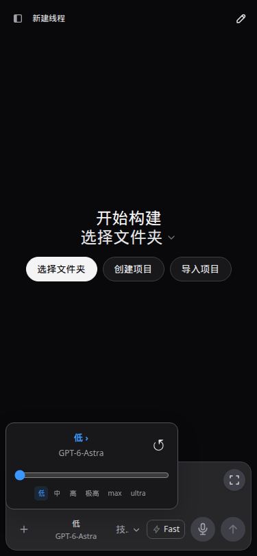

# CodexApp 0.2.13 开发与验收

## 部署结果

候选地址： http://192.168.50.46:59001/ 。分支 `feature/0.2.13-development`，实现提交 `fa4dba0`，追加Key改绑回归 `d72eb9d`。镜像 `codexapp-multi-account-dev:ui-0.2.13`，ID `sha256:ef2f4b8e3dcbc0990242f4c9f250c13f10cfcce5260dfa9986253d083fb05b02`。CODEX_HOME沿用独立卷 `codexapp-multi-account-dev-home`，未挂载生产 `/root/.codex`。

部署命令：
```bash
CODEXAPP_REPLACE_DEV=1 CODEXAPP_MULTI_ACCOUNT_IMAGE=codexapp-multi-account-dev:ui-0.2.13 CODEXAPP_MULTI_ACCOUNT_DOCKERFILE=/home/Code/codexapp/scripts/docker-api-proxy-dev.Dockerfile scripts/run-multi-account-dev.sh
```
`output/0213/deploy.log`记录build、pack、镜像和空闲门禁通过，activeTurns/queued/pendingApprovals/apiConnections/apiActiveRequests/backgroundThreads全部为0。容器包版本实读0.2.13；部署CLI与当前构建SHA256一致：`36fa528f5d4a7fa4c1b2013da42b01c1baf734f937772bf785263db410e9ecc0`。

## 修复内容

- 账号卡页脚改“全局设置”；运行时中文“账户”统一为“账号”。技能管理从首页侧栏及推广卡收纳至设置“集成”，原目录路由和输入框技能选择保留。
- 模型与推理强度合并弹层：当前强度/模型、能力目录支持的滑块档位、模型列表及恢复默认。依据用户参考图实现；本机无官方桌面应用，未取得官方CDP对照证据。
- 后台额度/模型读取按账号串行，不再持有全局账号变更锁；不同账号可并行。API账号门禁按实际绑定隔离；固定Key不受主账号切换影响。主账号切换先核对空闲，再处理出口；移除只等待相关连接，保留无关连接与响应上下文。等待登录期间不阻塞普通提交，实际主凭据写入仍要求空闲。
- 模型读取不再依赖额度接口成功；临时目录失败最多延迟3秒重试一次，保留选择，不写回退偏好。新线程已创建而首条发送503时，已验证现有恢复路径进入创建的线程并保留草稿。
- MCP启动事件按服务状态去重；已有列表后台刷新不显示首次加载状态。普通通知不重载全部MCP配置。
- HTTP环境没有crypto.randomUUID时，使用getRandomValues生成UUID。选中假重置机会后确认可提交正确账号、机会ID、幂等标识及confirmed字段。
- 额度恢复续跑不再被普通后台刷新挡住；额度回升触发检查，轮询补偿遗漏的完成通知，单个会话读取失败不挡住其他任务。保留发送失败原因lastError，已提交旧回合和结果不确定的提交不盲目重放；继续文本为“继续之前的工作”。

## 续跑现场边界

2026-09-09 22:14检查5900：唯一续跑标记为waiting、attemptId为空且有attemptedAt；主账号5h已用0%、周已用16%，额度新鲜。该标记对应会话的最新回合已经inProgress，因此未重复发送继续指令。历史失败原因未被旧实现持久化，无法把这一次历史停顿唯一归因到某个异常；已确认并修复全局刷新门禁及缺少失败原因记录的问题。未使用真实重置机会，也未中断正在运行的会话。

## 测试证据

- 主回归16文件177项通过：`output/0213/final-regression.log`；之后新增Key改绑场景，gateway专项17项通过：`key-rebind-test.log`。覆盖等待刷新并行请求、主会话忙时不排空出口、Key改绑后另一流式连接仍运行。
- 续跑专项及相关账号/调度/投递54项通过：`resume-tests.log`。包括漏事件恢复、旧失败回合不重复提交、读取失败隔离、已知发送前失败重试。
- 完整build通过，最终vue-tsc通过。公共CJS检查精确命令 `node -e "process.argv=['node','codexapp','--help'];require('./dist-cli/index.js')"` 成功输出帮助，记录 `cjs-smoke.log`。
- `node output/0213/ui.cjs`：模型目录第一次503后恢复，模型/强度选择、刷新持久化，6组视口主题通过。重置全部拦截为假响应：两主题各1次请求，UUID及参数断言通过，未转发真实重置。
- `node output/0213/new-thread.cjs`：模拟线程创建成功、发送503，URL变成对应线程、草稿保留、页面错误0。
- `node output/0213/mcp.cjs`：浅深主题各200条重复启动状态事件，仅增加1次MCP查询，列表保留。
- `node output/0213/candidate.cjs`：59001实际页面6组视口/主题通过，实际模型目录可选，重置请求0，页面错误0。
- 认证隔离矩阵59041–59044：无认证Zen、无效认证、损坏认证Zen、Zen→OpenRouter。执行 `node output/0213/auth-matrix.cjs`、`start-invalid.cjs`、`auth-ui.cjs`、`auth-other-ui.cjs`。无效认证401落入会话，刷新后保留；浅深主题通过，重复live overlay为0。初次页面等待超时后核对实际回合，确认错误落盘再重测通过。临时容器已停止。

API测试覆盖 `/v1/responses` 与 `/v1/chat/completions`；未新增可选的旧式 `/completions` 端点。有效账号真实付费生成、真实重置消费及真实重置后无人值守续跑没有执行，不能等同于完整真实业务E2E。

## 性能审计

实际59001首页：`browser-runtime-profile-home-2026-09-09T14-18-56-009Z.json`，API 92.1KB；技能/MCP页：`browser-runtime-profile-skills-tab-skills-2026-09-09T14-28-27-677Z.json`，120.3KB。两份warnings均为空，thread/list、skills/list、rateLimits各1次，重复thread/read为0。报告与trace位于output/playwright。

模型/强度切换只更新本地状态；搜索为模型列表线性筛选，无新增网络调用。模型缓存16项，组件并行账号上限8；同账号探针串行、不同账号并行，避免无界扇出。MCP通知合并并保留已有列表。续跑每轮核对最多8个待核对标记，历史查询从50回合降到1回合；无状态变更不写文件。旧CLI历史兼容路径可能仍读取完整历史，未做1000标记压测或真实多账号负载压测。

## 页面证据

实际URL `http://127.0.0.1:59001/`；均断言模型能力和弹层可见、无首页推广卡、页面错误0。原图绝对路径前缀 `/home/Code/codexapp/output/playwright/`，本文件附带可归档副本。

| 视口 | 主题 | 文件 |
|---|---|---|
| 1440×900 | light | [截图](assets/0.2.13/0213-candidate-1440-light.png) |
| 1440×900 | dark | [截图](assets/0.2.13/0213-candidate-1440-dark.png) |
| 768×1024 | light | [截图](assets/0.2.13/0213-candidate-768-light.png) |
| 768×1024 | dark | [截图](assets/0.2.13/0213-candidate-768-dark.png) |
| 375×812 | light | [截图](assets/0.2.13/0213-candidate-375-light.png) |
| 375×812 | dark | [截图](assets/0.2.13/0213-candidate-375-dark.png) |



## 清理与回滚

59001及4173保留运行，5173未操作；5900未切换，未执行prepare/publish/merge。回滚候选仍需先核对空闲，再按部署脚本使用旧验证镜像，禁止两个容器同时写候选卷。认证测试容器已停止，假数据卷保留供核查。

X-bot为单独项目修复，详见同日x-bot抽奖JSON文档；不包含在CodexApp包内。
