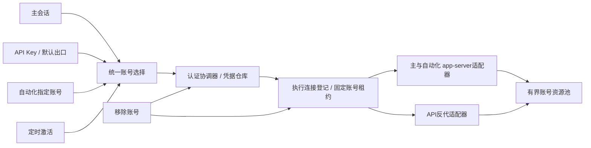

# CodexApp 0.2.14 账号执行架构与开发验收

## 范围与部署边界

分支 `feature/0.2.14-development`，从已提交的0.2.13代码开始。候选目标59001，沿用独立CODEX_HOME卷；5900生产服务及`/root/.codex`不参加修改或账号测试。当前文档是持续更新的实施记录，不代表最终验收通过。

优先级：P1统一账号执行架构 → 插件/技能/MCP → 模型选择器与其他UI → 版本演进文档。用户追加要求：移除账号不能依赖登录状态或等待执行空闲，移除时关闭其关联连接并删除凭据。

## 根因

1. 自动化此前借用主app-server，必须等待全局线程、队列和后台终端空闲；当前账号无额度时，指定其他账号的自动化也被拖住。
2. 调度器全局串行，账号准备中的网络等待，以及未确认完成的旧运行，会堵住其他账号。
3. 账号切换把部署所需的全局空闲条件用于凭据切换，失败投递、待续跑记录和仍在运行的终端被合并成同一种阻塞。
4. 固定Key与默认出口走不同组件；管理模型端点、默认出口保存、组件启动与退避存在跨账号依赖。
5. 认证刷新依据开始时的active账号快照落盘，和后续切换并发时可能把旧账号重新设为活动账号。
6. 前端移除按钮禁用活动账号；后端拒绝移除活动账号，并等待相关API流排空。需要重新登录时不能借移除恢复。

## 统一架构

| 模块 | 职责 |
|---|---|
| `accountExecution.ts` | 统一选择顺序、连接归属、撤销、旧租约失效；只存身份标识，不存凭据 |
| `accountResourcePool.ts` | API和自动化共用的按账号惰性分配、去重、有界容量与空闲回收 |
| `accountAuthCoordinator.ts` | 登录/切换/刷新/移除协调；同账号令牌刷新合并，探针走同一个刷新入口 |
| `accountAuthStore.ts` | 原子状态更新、凭据版本校验；刷新仅在落盘时仍为活动账号才同步主auth |
| `apiProxy/gateway.ts` | Key鉴权、请求/WS连接登记、出口策略变更及账号组件路由 |
| `automationEngine.ts` / `automationRuntime.ts` | 持久化调度状态和幂等标记、跨账号并行准备、结果核对、失败与取消终结 |
| `AppServerProcess` | 原生RPC适配；主运行进程与自动化账号进程分离、通知汇聚与审批ID映射 |

选择顺序统一为：明确绑定账号 → API默认出口（仅API适用）→ 当前激活账号。绑定账号不存在时返回错误，禁止静默回退。运行中的连接固定到取得租约时的账号，不按每次读取的全局账号漂移。

主账号切换使用原生`account/login/start`的外部令牌方式原位更新认证，不终止后台终端。真正活动的主回合和正在提交/结果未知的投递仍需核对；已失败、仅排队的投递以及独立自动化不占据主切换锁。部署继续使用严格全局空闲核对，两类边界分开。

移除先撤销账号租约，再删除账号记录与凭据，关闭该账号的主/自动化/API/定时激活连接。迟到的令牌刷新受版本检查限制；旧登录不能恢复已移除的账号。会话历史保留。明确绑定已移除账号的Key和自动化保持不可用，需要用户重新选择；其他账号不受影响。

自动化按账号独立运行，最多4个账号进程；API最多8个账号组件。进程准备可跨账号并行，持久化写入串行；相同自动化目标仍避免重叠执行。未知提交只核对，不自动重发。

## 已获得的中间证据

- 账号选择/撤销/资源池、默认出口改绑、各API端点与自动化交叉测试：`output/0214/p1-cross-tests.log`，3文件50项通过。
- 独立IPC进程测试：`output/0214/p1-ipc-test.log`。主账号A运行未完成回合时，B实际子进程返回`OUTPUT:b`；移除A后B再次返回结果，主auth未被B覆盖。上游由本地确定性协议fixture模拟，不代表真实双账号额度测试。
- 活动账号重新认证、迟到刷新不能恢复已删除账号、审批编号隔离等专项已通过。最终数量与完整构建/浏览器/容器证据待本版本收尾后填写。

## 性能与待验收

共享选择为账号数线性扫描；连接撤销仅遍历内存中登记的连接，不等待长请求排空。账号资源分配去重且有容量上限，已有账号的请求不经过新资源分配队列。主/自动化额度读取按实际运行账号归属，保留并发合并、短缓存和429退避。切换/重新登录允许额度服务临时失败，认证明确失败仍报告。

尚待：完整构建、账号组合回归、包与CJS入口检查、59001部署、浅/深主题和移动视口、认证容器矩阵、浏览器性能分析、原版插件实际安装/调用、最终版本功能更替文档。不得把本节的待验收写成已完成。
