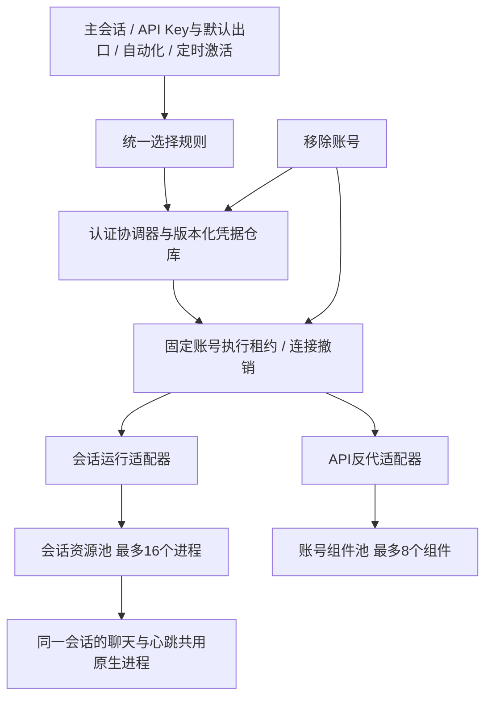
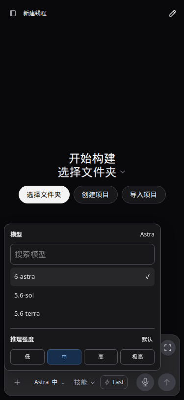
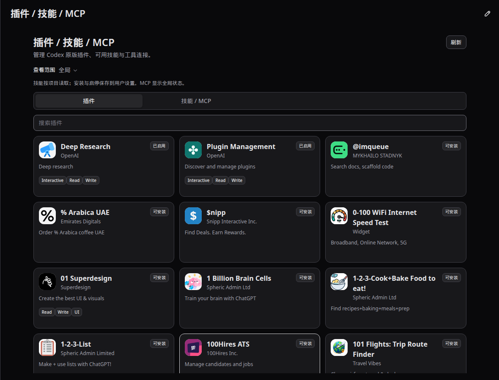

# CodexApp 0.2.14 账号执行架构与开发验收

## 交付范围

分支 `feature/0.2.14-development`，候选访问地址 `http://192.168.50.46:59001/`。本版统一主账号、API出口、自动化账号、认证刷新、会话归属和账号移除；重构设置中的插件/技能/MCP；改为单行模型选择器和黄色自动化界面；补齐[项目版本功能演进](20260910-0002-codexapp-项目版本功能演进与当前能力.md)。

运行容器 `codexapp-multi-account-dev`，独立卷 `codexapp-multi-account-dev-home:/codex-home`。5900生产服务及其`/root/.codex`不参加修改、登录或模型测试。没有发布npm、推送分支、合并或激活生产。

## P1根因与最终设计

原先自动化借用主app-server，全局线程、投递、后台终端和账号状态相互牵制。账号切换借用了部署的全局空闲门禁；API固定出口与默认出口存在不同启动路径；令牌刷新依据过时的活动账号快照落盘；移除账号又要求先满足登录/空闲条件。

真实验收还发现：原生`thread/unsubscribe`并不立即释放写入权，通常需无订阅且无活动30分钟才卸载。仅取消订阅会留下“已完成但仍被占用”的会话。这是本版采用会话进程隔离的直接依据，参见[原生app-server协议说明](https://github.com/openai/codex/blob/main/codex-rs/app-server/README.md)。



| 模块 | 统一职责 |
|---|---|
| `accountExecution.ts` | 账号选择、固定归属、撤销代次、连接失效；不保存凭据 |
| `accountResourcePool.ts` | 惰性分配、同键去重、有界容量；异步空闲检查期间重新使用的资源不能被回收 |
| `accountAuthCoordinator.ts` | 登录、切换、刷新、移除；主运行、会话运行、API及账号探针共用令牌刷新入口 |
| `accountAuthStore.ts` | 原子持久化、凭据修订校验；落盘时仍为活动账号才同步主auth |
| `apiProxy/gateway.ts` | Key鉴权、HTTP/WS连接登记、默认/固定出口及策略更新 |
| `automationEngine.ts` / `automationRuntime.ts` | 持久运行状态、实际执行账号快照、最多4个并发运行、目标去重与未知提交核对 |
| `AppServerProcess` | 根进程负责目录与管理；会话进程持有原生写入权；账号边界、审批ID映射、退出等待与通知汇聚 |

账号选择顺序：**明确绑定账号 → API默认出口（仅API适用）→ 当前激活账号**。绑定不存在时报错，不静默回退到其他身份。已开始的API连接与自动化运行固定到取得租约时的账号，后续主账号或默认出口变化不会偷偷改变其归属。

每个交互会话使用独立原生进程；该会话的心跳自动化复用同一进程并选择本次账号，完成后释放运行占用。普通聊天下一次执行再采用当前主账号。其他会话的额度、后台终端和写入权不构成全局阻塞。原生派生会话随所属进程管理，活动派生回合也计入该进程边界。仅回收空闲会话资源，关闭旧进程并等待退出后再分配，不能把取消订阅当成释放写入权。

线程目录汇总各会话进程的真实活动状态；原生发送确认即登记活动，并防止早到完成通知被迟到确认覆盖。`/codex-api/runtime/activity`提供独立实时快照，空闲检查在目录检查前后各读取一次，覆盖新会话尚未写入目录的窗口。老版本明确返回404时继续原有严格检查，未知/损坏的实时状态拒绝放行。主账号切换只核对实际活动的主会话、正在准备/提交的操作与未知投递；不扫描全部历史，也不因仅排队/已失败记录或独立自动化而拒绝切换。仍在执行的同一会话需要结束当前回合；真实额度/认证错误会触发一次原生中断以结束重试循环。部署继续采用严格全局空闲门禁，涵盖API流、自动化、审批、队列和后台终端。

移除先撤销连接，再删除账号和凭据，关闭归属该账号的会话/API/探针及关联运行。它不等待账号额度、登录状态或回合自然结束；原生进程退出最多等待本地终止过程，1.5秒后强制终止。其他账号保持运行。历史保留，旧连接不会复活；旧绑定不漂移到其他身份。同一身份重新添加后，只有新请求可以使用新凭据。

过期access token允许通过有效refresh token恢复；明确失效的刷新按凭据修订阻止重复请求，临时错误退避30秒。移除后再登录同一身份，旧刷新仍受撤销代次和凭据修订约束，不能覆盖新登录。

## 扩展与UI

- 设置统一入口为“插件 / 技能 / MCP”。插件使用原生list/read/install/uninstall与启停设置；需要服务授权时显示原版返回的连接链接。
- 删除原Apps全量目录页面及其403请求路径。该目录用于发现上游应用，目录403不等于已安装插件不可使用，原生目录与调用能力的区别见[app-server文档](https://learn.chatgpt.com/docs/app-server)。
- 删除应用内Composio页面、接口及`@composio/client`依赖；删除GitHub技能同步、后台自动推送及其Firebase依赖。已有技能文件与普通技能安装/搜索保留。
- 原生插件目录实际约3,800项；每页最多60张卡片，搜索覆盖完整目录，分页不重复读取原生目录。安装优先显示。
- 模型折叠为单行“模型简称 + 推理强度”，如“Astra 中”；展开包含搜索、模型列表和分档推理滑条，沿用共享弹层。后续账号设置与双分类外观复核见 [追加验收](20260910-0004-codexapp-0.2.14账号设置保护值与扩展页面复核.md)。
- API出口去掉“按需启动”文案；自动化主页面、列表及侧栏入口统一黄色色调，覆盖浅/深主题。

## 验收证据

下面区分真实上游、真实原生进程和可重复模拟，不用HTTP成功代替生成结果。原始记录位于`/home/Code/codexapp/output/0214/`；不含凭据的[验收摘要](assets/0.2.14/acceptance.json)和[最终测试输出](assets/0.2.14/unit-final.log)随文档保存。

| 场景 | 结果与记录 |
|---|---|
| 主账号A需要重新认证，固定B调用API | models与管理模型目录可用；Terra Responses返回`CODEXAPP_0214_API_OK`，Chat Completions返回`CODEXAPP_0214_CHAT_OK`；约3.6秒，主账号未被覆盖。`live-api.json` |
| 默认出口与主账号切换时固定B的WS | 同一WS前后返回`CODEXAPP_0214_WS_ONE/TWO`；默认出口改绑失效A耗时4毫秒，主账号切到B约2.6秒，固定WS未断。`live-routing.json` |
| 原生压缩端点 | 返回两个原生不透明压缩结果项。`live-routing.json` |
| A需重新认证时，B连续执行同一cron任务 | 两次均completed，约22/24秒；读取官方插件技能、调用真实MCP协议工具并写文件。`live-automation.json` |
| 同一会话聊天与心跳交替 | 聊天→心跳→聊天→第二次心跳→聊天→归档全部成功，每步有独立标记。`live-handoff.json` |
| 活动A阻塞、同一会话从A转B执行、再移除A | 真实子进程IPC返回`OUTPUT:b`，第二个B运行仍成功，主auth未被B覆盖；上游模型用确定性fixture。`accountRuntimeIntegration.test.ts` |
| 失效账号移除后重新登录 | 59052真实原生容器、合成失效凭据；78毫秒移除主账号，auth文件消失，新登录成功启动后取消。`remove-live-fixture.json` |
| 登录/Provider容器矩阵 | 59051无认证Zen回退；59052失效认证错误刷新后保留；59053损坏auth回退；59054 Zen→OpenRouter配置切换。无重复实时回答覆盖层。`auth-matrix.json`、`auth-ui.json`、`auth-other-ui.json` |
| 插件与MCP实际使用 | 原生官方`build-web-data-visualization`安装并暴露18项技能，执行读取其中一项；本地验证MCP实际被调用，产生文件中的`CODEXAPP_0214_MCP_OK`。`native-plugin.json`、`live-automation.json` |
| 界面交互 | 4173：1440×900、768×1024、375×812，浅/深主题；模型选择与插件启停刷新后保留，移除按钮不因失效/额度100%/切换中而禁用，无旧Apps/Composio/GitHub同步请求。`ui.json`、`remove-ui.json` |
| 候选可见界面 | 59001原生目录与自动化页，1440×900浅/深主题；目录分页60卡片，黄色背景，无页面异常。`candidate-ui.json` |
| 新回合尚未进入目录时检查空闲 | 真实20秒命令：目录活动数0但实时活动1，检查退出码3；完成后实时活动0、退出码0，测试会话已归档。`live-idle-gate.json` |
| 自动测试与构建 | 81文件、558项测试通过；完整`vue-tsc`、Vite与CLI构建通过。`unit-final.log`、`build-final.log` |
| 打包与CJS运行 | CJS启动CLI帮助成功；打包容器`require(node-pty)`并真实spawn shell返回`CODEXAPP_0214_PTY_OK`；Composio/Firebase目录不存在。`cjs-require.log`、`packed-cjs-require.log`、`packed-cjs-pty.log` |

MCP产物保存在候选工作区`/test-workspace/automation-0190/0214-validation/native-result.txt`，内容为验证标记和技能名；测试没有向外部服务发送消息。测试Key、临时自动化定义、测试插件与测试MCP配置已清理，59051–59054测试容器已停止并保留独立卷；候选原有两个PAUSED自动化保留。真实路由验收将候选主账号从失效A切到可用B，保留该可用状态；API默认设置恢复验收前值。

## 性能审计

- 4173首页实际浏览器profile：约14.8KB API响应；线程首屏、skills、额度、provider模型各1次；重复thread/read为0；warnings为空，页面已结束加载。报告`output/playwright/browser-runtime-profile-home-2026-09-09T17-00-27-508Z.json`及同名trace。
- 账号切换不再遍历历史目录；只检查活跃运行与投递。部署空闲检查新增2个很小的内存快照请求，不读取会话正文。资源池已有键不经过新资源分配队列；分配有界，回收前后检查活动与访问修订，防止并发误回收。
- 会话最多16个原生进程、自动化最多4个并发、API最多8个账号组件。会话进程增加了隔离成本，但复用同一会话的原生连接，避免每次心跳重启或读全部历史；真实接力的两次心跳约3–4秒。收尾空闲样本约126.9MiB容器内存、0.01% CPU（`container-stats.json`），不是满负荷峰值。没有做16进程满负荷长时间压测。
- 模型弹层不增加模型请求；200条重复MCP状态通知最多合并为1次刷新。真实插件目录每页最多60个DOM卡片，完整目录数据仍由原生接口一次返回，未声称实现上游分页。
- CLI构建约858KB，低于本版开始重构时约901KB；移除Firebase/Composio依赖。现有Vite大chunk提示仍存在，非本版新增按请求下载依赖。
- 实测生成/切换耗时是少量样本，受上游和缓存影响，不是性能承诺。真实额度耗尽的长期恢复周期未等待完成；429、额度重试、删除与迟到刷新并发由回归fixture覆盖。

## 复验命令与图片

```bash
pnpm test:unit
pnpm run build
node -e "process.argv=['node','codexapp','--help']; require('./dist-cli/index.js')"
CODEXAPP_IDLE_CHECK_URL=http://127.0.0.1:59001 node scripts/check-codexapp-idle.cjs
```

候选通过`run-multi-account-dev.sh`构建、打包、严格空闲核对后替换；最终镜像摘要、包与运行文件校验保存在`output/0214/final-runtime.json`，CLI和前端入口与本地构建逐字节哈希一致。最终镜像为`sha256:fa399c32fe68f34acb4e25c47121db7cdc8405cf90ab64e607649e4de291003c`；5900仍运行独立0.2.13发行目录，进程PID保持3304963。认证矩阵使用同一0.2.14会话/认证实现的打包镜像、独立卷和上述59051–59054端口；OpenRouter使用合成Key，仅验证配置切换，不声称该Key可生成。

Browser Use在本次会话中没有可用工具；因此使用Playwright完成请求故障模拟、存储持久性及可见UI检查。完整截图目录`/home/Code/codexapp/output/playwright/`；`0214-models-*`、`0214-plugin-*`、`0214-skills-*`、`0214-automation-*`覆盖三种视口与两种主题；`0214-candidate-*`对应59001；`0214-auth-invalid-*`对应59052刷新后错误界面。





## 使用边界

所选账号的模型权限、认证和额度仍由上游决定。此次真实生成选用该账号实际支持的Terra；某些catalog项（如测试中的Sol/GPT-5.5）上游返回不支持/不存在，应用不会通过偷偷换账号掩盖这些错误。原生插件/连接服务仍可能要求独立授权；本次未逐一授权全部第三方插件。生产5900没有获得本版代码，后续切换必须另行走生产交付流程。
