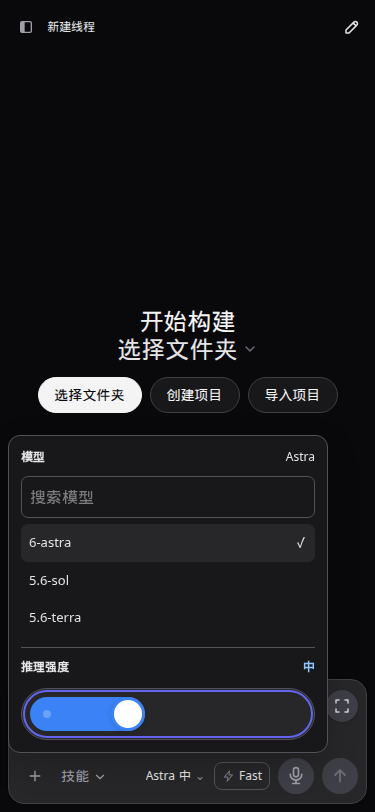
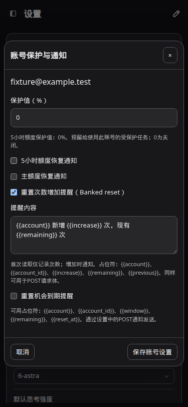

# CodexApp 0.2.14 模型滑条、重置提醒与连接复核

日期：2026-09-10。延续 [0.2.14 账号执行架构与开发验收](20260910-0001-codexapp-0.2.14账号执行架构与开发验收.md)。本轮仅更新 59001 候选，5900 生产 0.2.13 未发布或重启。

## 用户可见修改

模型选择器与 Fast 成组靠右，名称宽度按内容变化时向左展开；发送按钮保持位置。推理强度改为分档胶囊滑条，可点按、拖动及使用 Home/End/方向键。原“默认”位置显示当前推理水平，下面不再列出档位按钮。档位来自当前模型目录，不硬编码支持数量；已知水平用一致中文名称，目录未提供默认水平时保留“模型默认”，不猜具体档位。

账号设置新增“重置机会增加提醒”（Banked reset）及可编辑模板，复用设置中的 POST 渠道、时区、免打扰、持久化队列和投递状态。占位符包含 account、account_id、increase、previous、remaining。首次有效读取只建基准，后续可用次数增加才提醒；重复刷新及重启不重复投递，减少或未知次数不当作新增。禁用规则清除待发事件，禁用期间的增长不在重新启用时补发。增加提醒与到期提醒独立，不消耗重置机会。





截图使用 http://127.0.0.1:4173/ 及 /#/settings、375×812、虚构账号；另验证 768×1024 和 1440×900 的浅深主题。实际 59001 页面也验证了模型滑条和账号开关，不保存真实通知配置。

后续统一名称、账号别名、保护值边界和扩展布局见 [账号设置与扩展页面复核](20260910-0004-codexapp-0.2.14账号设置保护值与扩展页面复核.md)。

## 账号架构复核与修复

复核中发现 API WebSocket 的旧逻辑会在下一次请求检测到凭据组件代次变化时，主动返回 credential_updated 并关闭健康连接。这会让增量上下文续接被迫重新建立。因此不能只根据先前的账号隔离设计保证没有额外断连。

本轮修复：已认证的 WebSocket 继续使用建立时的上游连接与 response 上下文；凭据轮换用于新的连接。每帧仍检查 key 有效性、账号操作、删除代次、实际出口和额度保护。显式撤销 key、移除账号或切换该 key 的出口仍断开关联连接。旧连接不触发额外组件 prepare，也不因为另一条 HTTP 请求使用新凭据而关闭。

组件最多同时保留两个凭据代次。旧连接仍有引用时，再次轮换可回收零引用的当前代次，给新代次留空间；仍有引用的两个组件均不会被强制回收，达到容量时新请求明确返回等待错误。

| 核查项 | 本轮证据 | 结论边界 |
| --- | --- | --- |
| 凭据刷新竞争及串号 | 集中刷新、账号身份校验、单次并发刷新、凭据 revision 和删除代次回归 | 上游撤销 token、网络故障仍可能使刷新失败；不会因此自动改用另一账号 |
| A 阻塞时 B 刷新 | 实际 IPC 子进程测试中 A 保持活跃，B 完成第二轮并只刷新一次 | 使用虚构凭据和模拟 OAuth 响应，不强制轮换真实账号 |
| 刷新清空 native 会话 | B 刷新前后 PID 相同，已加载线程与两轮历史保留，A 主凭据文件逐字不变 | 进程崩溃、服务重启、空闲资源回收不等于持续保留内存缓存 |
| API WebSocket 凭据轮换 | 本地真实 WebSocket + 注入新凭据组件；新 HTTP 用新代次，旧 WS 以 previous_response_id 继续成功 | 上游主动断线和网络断线仍可能要求客户端重连 |
| 实际上游上下文 | 59001 第一轮保存标记，额度刷新后同一 WS 第二轮正确取回标记 | 本次真实测试是额度刷新；强制凭据轮换由 fixture 覆盖 |
| 历史、账号与缓存 | 切换和移除作用于明确关联的资源；普通刷新保持会话进程 | 不承诺跨账号共享上游缓存，也不承诺上游缓存永不失效 |

这组证据支持“已覆盖路径未出现串号、刷新导致会话重启或应用主动清空健康 WS 上下文”。它不构成所有上游故障、无限并发或任意长会话均无问题的保证。

## 验证结果

- 全量单元/集成：81 个文件、569 项通过；其中账号集中刷新与 IPC 复核 48 项。新增通知测试包括本地接收器真实 HTTP POST，确认重复快照只投递一次。
- 界面：三个视口 × 浅深主题，共六组；滑条点击和键盘、当前档位、长短模型切换后 Fast 位置不变、无横向溢出、通知开关和模板保存后刷新保持。新建但未发送的会话刷新后仍按既有逻辑回到默认推理强度，不把临时草稿当作已记忆会话。
- 真实 59001：WS 第一轮约 3.73 秒；账号额度刷新接口约 6 毫秒，连接保持；第二轮携带 previous_response_id 约 1.80 秒，返回第一轮标记 ORBIT_FOLLOWUP_0910。Chat Completions 返回 FOLLOWUP_CHAT_OK。临时 key 已撤销，主账号选择未改变。
- 打包认证矩阵：59061 无认证回退 Zen；59062 虚构无效认证，失败消息刷新后仍显示，重复 live overlay=0；59063 畸形认证回退；59064 Zen 切换 OpenRouter 配置。浅深主题通过。没有调用真实重置机会，OpenRouter 使用 fixture key。
- 认证矩阵容器只含独立测试卷，验证后停止；未重启 NapCat、5173 或 5900，4173 留在当前源码。

执行命令：

```bash
pnpm run test:unit
pnpm run build
node -e "process.argv=['node','codexapp','--help']; require('./dist-cli/index.js')"
PROFILE_BROWSER_EXECUTABLE=/snap/bin/chromium PROFILE_BASE_URL=http://127.0.0.1:4173 PROFILE_WAIT_MS=7000 pnpm run profile:browser
CODEXAPP_REPLACE_DEV=1 CODEXAPP_MULTI_ACCOUNT_IMAGE=codexapp-multi-account-dev:ui-0.2.14 CODEXAPP_MULTI_ACCOUNT_DOCKERFILE=/home/Code/codexapp/scripts/docker-api-proxy-dev.Dockerfile scripts/run-multi-account-dev.sh
```

候选脚本实际 build → pack 到临时目录 → Docker 安装 tarball，构建完成后才检查空闲并替换。容器内同样执行公共 CJS require/help；原生 node-pty spawn 实际输出 CODEXAPP_0214_FOLLOWUP_PTY_OK。矩阵构建与最后仅统一中文档位名的包具有相同 CLI 代码；最后包另做实际 UI 和资源哈希核对。

本轮代码提交：cf79092（模型滑条与右对齐）、2d093cf（次数增加提醒）、218c9d2（凭据轮换连接延续与回归）、d745edf（中文档位名一致）。

## 性能审计

有效 4173 首页 profile：API 共 14.8 KB，thread/list、skills/list、额度读取、provider-models 各一次；warnings 为空，没有持续 Loading threads。thread-quota-resume 状态请求两次属于现有启动/实时状态读取，本轮滑条不发起 RPC。

滑条为原生 range 加 CSS 外观，局部档位变动只更新偏好，不新增依赖或后端调用。提醒沿用已有账号刷新结果，在原本一次通知状态事务里记录每账号计数，不增加轮询或每个提醒独立请求；待发队列仍上限 256，每批至多 16 条。每个 WS 回合减少一次 prepare 检查。

会话 worker 上限 16、API 账号资源上限 8、每账号凭据代次上限 2；活动资源不按空闲策略回收。达到这些限制时拒绝新分配，不通过断开正在工作的会话释放空间。本次没有做满容量压力测试、长期 token 过期等待或真实网络丢包试验。

一次候选采样 CPU 0.23%、内存 159.5 MiB；这是完成 UI/API 检查后的单点值，不能用作高并发容量结论。CLI 构建约 860.50 KB，主 JS 约 682.6 KB；已有大 chunk 提示保留。

## 证据与回滚

原始产物：`output/0214-followup/`，包括 unit-all.log、build.log、deploy-final.log、profile.json、ui.json、candidate-ui.json、auth-matrix.json、auth-ui.json、auth-other-ui.json、live-ws.json、runtime.json、idle-before.log、idle-after.log、packed-cjs.log 和 packed-pty.log。截图原件在 `output/playwright/0214-followup-*.png`；本文件相邻 assets 目录保留精简验收数据及手机截图。

最终候选镜像为 `sha256:98690911a4e7b2d90dddea5afa7744abe268e03bae00f028eedadf1ba0e71623`，27 个 dist/dist-cli 文件均与本地构建一致，入口引用的 JS/CSS 内容一致。59001 最终 active turns、pending operations、API 连接、自动化队列、审批及后台终端均为空。精简数据见 [acceptance.json](assets/0.2.14-followup/acceptance.json)。

上一候选镜像为 `sha256:fa399c32fe68f34acb4e25c47121db7cdc8405cf90ab64e607649e4de291003c`。回滚先检查 59001 的会话、API、自动化和后台终端都空闲，再以旧镜像及原候选独立卷重建；不删除卷，不复用 `/root/.codex`，不修改 5900。此次通知状态使用可兼容的新增字段，旧功能保留。

手工回归分别追加在 `tests/theme-layout-terminal/ui-0214-model-automation.md`、`tests/accounts-feedback-observability/account-reserve-reset-notifications.md`、`tests/accounts-feedback-observability/accounts-0214-unified-execution.md`。
