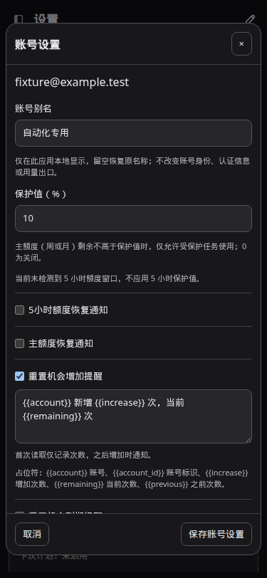
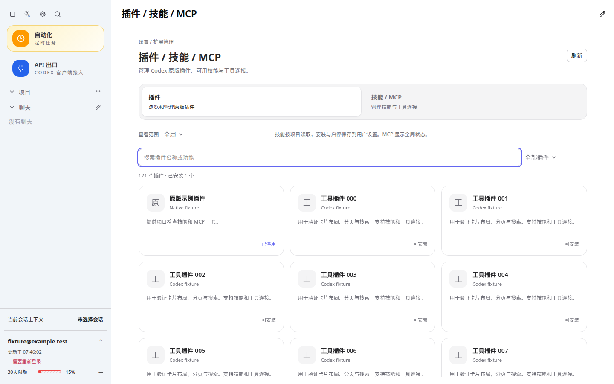

# CodexApp 0.2.14 账号设置、保护值与扩展页面复核

本轮延续 [账号执行架构](20260910-0001-codexapp-0.2.14账号执行架构与开发验收.md) 和 [连接连续性复核](20260910-0003-codexapp-0.2.14模型滑条重置提醒与连接复核.md)，开发与部署目标为 59001 独立候选。

## 用户可见结果

账号弹窗统一命名“账号设置”，新增最多 80 字符的账号别名。别名保存在本应用本地账号元数据中，多浏览器、刷新和重新登录后可继续显示；留空保存恢复原名称。账号卡、侧栏当前账号、API 出口选项、自动化出口选项、定时激活、重新登录及重置确认都使用同一显示函数。实际账号标识和出口绑定继续使用 storageId，邮箱和认证信息不被替换；POST 通知仍使用原账号信息。

提醒名称统一为“重置机会增加提醒”“重置机会到期提醒”。每项通知打开后才显示自己的编辑器与占位符说明，关闭全部时不显示事件占位符表。`remaining` 在额度通知中表示剩余百分比，在增加提醒中表示当前可用次数，在到期提醒中表示剩余时长；界面分别解释，避免混用。

扩展页面保持“插件”“技能 / MCP”两个分类，导航改为完整的等宽两列。统一范围选择、内容边缘、卡片、技能面板和 MCP 分组；支持返回设置。插件增加全部/已安装/未安装筛选、匹配数量和无匹配提示，保留完整目录搜索及每页 60 项。受策略限制的插件标记为“受限”。安装、停用、卸载和详情沿用原版接口。

## 保护值的精确定义

设账号保护值为 P，判断的是本次任务选定账号的真实额度快照，不根据套餐名称猜窗口，也不根据 primary/secondary 的位置猜窗口。

| 条件 | 普通任务 | 受保护任务 |
| --- | --- | --- |
| P=0 | 关闭本地预留限制 | 同左 |
| 周窗口 10080 分钟，或至少 28 天的长期窗口 | 剩余 ≤P% 时限制 | 可使用预留 |
| 实际存在 300 分钟窗口 | 剩余 ≤min(100,2P)% 时限制 | 可使用预留 |
| 没有 300 分钟窗口 | 不应用 5h 保护值 | 不受该窗口的预留限制 |
| P>0，额度快照或长期窗口无法确认 | 返回额度不可确认，等待刷新 | 本地预留豁免仍有效 |

受保护不等于绕过上游登录、真实总额度、套餐权限或网络错误。实际总额度耗尽时，上游仍可拒绝。

Free/Pro 标记且仅有周/月窗口的 fixture：P=10%，剩余 15% 可以执行，不受假定的 20% 5h 保护线影响；剩余 10% 时触发主额度保护。窗口放任一位置结果相同，1440 分钟窗口不会误当成 5h。没有长期窗口时的“额度不可确认”是独立的保守检查，不能误记为 5h 保护。

修复了小数等值判断：原先计算 `100-usedPercent` 再比较，0.2%、0.4% 的等值可能受浮点抵消影响。现在直接比较 `usedPercent >= 100-reserve`；0.1/0.2/0.4/1.2% 的主额度和 5h 边界均覆盖，相比边界多 0.001 个百分点时允许。

## 与账号架构的关系

统一入口仍是 `resolveAccountSelection` → 目标 storageId → 同一 `assertQuotaAvailable`。主会话/自动化提交守卫、Responses、Chat Completions、WS 握手与后续帧都检查实际目标账号；固定账号不读取主账号的保护值。保护标记属于任务/Key，保护百分比属于账号；多个受保护任务共享该账号的预留，不重复叠加。

本轮发现并修复了保存接口的额外耦合：原来保存任何通知设置都会调用运行中额度中断检查。现在账号存储事务原子返回“保护值是否实际改变”；仅在确实改变时立即评估运行中的普通任务。只改别名、提醒文案或重复保存相同保护值，不触发这次评估。界面也不提交未修改的保护值，避免一次别名编辑携带旧保护值覆盖并行修改。

真实额度观测触及保护线，或用户实际调整保护值后使普通任务落入预留区，仍会按既有设计中断该账号的非保护任务。这是预留规则的效果；不能承诺打开保护后所有普通会话都永不被中断。受保护任务不会因本地预留线被中断。

别名不进入凭据身份解析、刷新 token、operationEpoch、credentialRevision、执行租约或模型/Responses 缓存键。保存元数据只使用账号存储短写队列，不等待登录/切换边界；认证忙碌或掉登录也可以编辑。重新登录、凭据轮换和旧状态迁移都保留别名。

## 验证与性能

- 全量 81 个测试文件、584 项通过；build 含 vue-tsc、Vite、CLI 打包通过。
- 持续 HTTP 输出测试：更改别名/提醒不执行中断检查，流保持；实际更改保护值才调用检查并关闭受限制的流。
- Free/Pro 无 5h 窗口测试覆盖 HTTP 两种格式、WS 后续帧、主会话与自动化提交守卫、固定账号隔离、保护任务豁免和小数边界。
- 真实临时账号存储测试：别名保存/清空前后凭据逐字不变，账号身份、revision、epoch 与主账号选择不变；凭据轮换和重新登录后别名保留；外部通知不带本地别名。
- 请求桩页面覆盖 1440×900、768×1024、375×812 的浅色/深色：别名及提醒刷新持久化、条件占位符、双分类等宽、搜索筛选翻页、插件安装/停用/卸载、MCP 详情、返回设置；无横向溢出或页面错误，退役接口请求为零。
- 有效 4173 扩展路由 profile：总 API 103.8 KB；thread/list 首次页、skills/list、额度读取、provider-models 各一次，warnings=[]，没有持续 Loading threads。报告为 `output/playwright/browser-runtime-profile-skills-tab-plugins-2026-09-09T23-39-04-861Z.json`，同名 trace 保存。
- 插件排序单独缓存，输入关键词和切换筛选只过滤本地已读取目录，分页不请求服务端。DOM 卡片最多 60 个；MCP 详情仍按展开加载；不增加轮询、依赖或无界并发。主 JS 约 684.00 KB，CSS 约 431.93 KB，已有大 chunk 提示保留。
- 别名提交复用现有设置 POST 和一次账号列表重读，不刷新凭据或目录，也不清理模型/会话缓存。没有新增后台任务。此轮未做高并发容量、长时间 token 过期或真实断网压力测试。

## 打包与运行复核

最终候选为 0.2.14，镜像 `sha256:a49477bc7aa21ace99852e2cf87033d50377566e4169e5c9e6f4261423748393`，2026-09-10 07:47:33（上海）启动。27 个 dist/dist-cli 文件与当前源码构建哈希完全相同，HTTP 入口所引用的主 JS/CSS 哈希也一致。公共 CJS require/help 成功，容器内 node-pty 实际输出 `CODEXAPP_0214_SETTINGS_PTY_OK`。

59001 真实目录读取 3878 个插件、已安装 2 个，实际页面每页 60 张卡片；1440×900 和 375×812 的浅深主题筛选、空结果、恢复列表均通过，筛选期间新增目录请求为零。真实候选只读检查账号设置标题、别名输入框和两个提醒名称，没有保存用户配置。

打包接口测试使用 59072 的虚构无效凭据：保存别名前后主认证文件及账号凭据逐字相同，storageId/accountId/email/revision 不变，服务 PID 不变；API 状态返回本地别名。5 次保存分别耗时 7.71、5.12、5.45、4.89、5.24 毫秒。该容器的浅深页面验证账号卡、侧栏、编辑器、API 账号选项及自动化账号选项使用别名；重启后别名仍保留。

认证矩阵使用唯一 localhost 端口与独立卷：59071 无认证回退 Zen，59072 无效认证，59073 畸形认证回退，59074 Zen→OpenRouter 配置切换。无效凭据已被后台识别时创建线程正确被拒绝；为验证回合错误另在此虚构卷重建“尚未识别过期”的本地检查状态，再提交无效凭据回合，错误刷新后仍保留，重复 live overlay=0。该 fixture 状态操作没有应用于真实账号。全部页面浅深主题通过；OpenRouter 使用虚构 key，不把配置切换成功当成上游生成成功。

候选完成验收后单点采样 CPU 0.01%、内存 171.3 MiB。5900 的生产 0.2.13 进程仍是 PID 3304963；本轮没有发布或重启生产实例。认证矩阵容器在验收后停止，4173 验证服务器保留。

精简结果见 [acceptance.json](assets/0.2.14-settings/acceptance.json)。代码提交：2240471（账号别名与提醒整理）、f307b70（双分类布局）、1380e46（元数据保存不触发保护中断）、0aa4229（小数边界）。





截图使用 http://127.0.0.1:4173/#/settings 与 http://127.0.0.1:4173/#/skills?tab=plugins，均为虚构测试数据。原始绝对路径：`/home/Code/codexapp/output/playwright/0214-settings-account-probe.png`、`/home/Code/codexapp/output/playwright/0214-settings-plugins-1440-light.png`；另有三种尺寸 × 浅深主题的技能/MCP 与账号图片。断言结果包括别名/提醒刷新持久化、两个导航等宽、页面无横向溢出、暗色表面正确。

## 复验与清理

```bash
pnpm run test:unit
pnpm run build
node -e "process.argv=['node','codexapp','--help']; require('./dist-cli/index.js')"
node output/0214-settings/ui.cjs
PROFILE_BROWSER_EXECUTABLE=/snap/bin/chromium PROFILE_BASE_URL=http://127.0.0.1:4173 PROFILE_ROUTE='#/skills?tab=plugins' PROFILE_WAIT_MS=7000 pnpm run profile:browser
CODEXAPP_REPLACE_DEV=1 CODEXAPP_MULTI_ACCOUNT_IMAGE=codexapp-multi-account-dev:ui-0.2.14 CODEXAPP_MULTI_ACCOUNT_DOCKERFILE=/home/Code/codexapp/output/0214-settings/Dockerfile scripts/run-multi-account-dev.sh
```

候选 Dockerfile 沿用仓库文件，仅为 npm 安装增加 `--prefer-offline --no-audit --no-fund`，避免构建阶段等待审计网络；仍实际安装打包 tarball，并核验 CLI、原生 PTY 和代理二进制。候选脚本构建完成后检查空闲才替换容器。未绕过 idle gate。

原始证据放在 `output/0214-settings/` 和 `output/playwright/0214-settings-*.png`；精简数据与无真实账号的截图随本文保存在 `assets/0.2.14-settings/`。手工步骤见 `tests/accounts-feedback-observability/account-reserve-reset-notifications.md`、`tests/skills-plugins-integrations/native-extensions-0214.md`。

测试不使用真实重置机会或外部通知接收人。真实候选页面只读核查，不改用户别名、提醒、插件或出口；有修改的打包接口测试在单独虚构凭据容器进行。

回滚基线为 `sha256:98690911a4e7b2d90dddea5afa7744abe268e03bae00f028eedadf1ba0e71623` 和原候选卷 `codexapp-multi-account-dev-home`。先检查 59001 会话、API、自动化、审批和终端空闲，再以旧镜像和原卷重建。旧版本不识别别名，可能不保留新字段，回滚前应单独备份本地账号元数据；不删除卷，不同时启动共享卷实例，不复用生产 `/root/.codex`。
