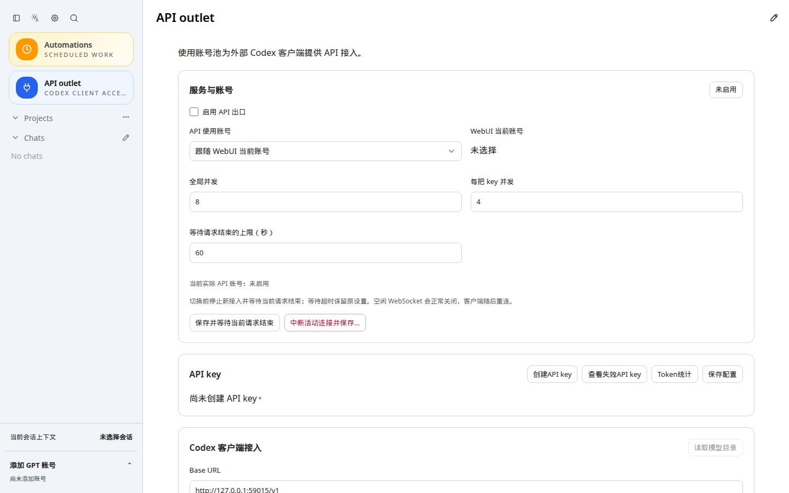

# CodexApp 0.2.14 正式发布准备与切换交接

本轮请求为“prepare 并进行切换前准备”。发布包已准备并验证，尚未激活生产。功能验收见 [账号设置与扩展页面复核](20260910-0004-codexapp-0.2.14账号设置保护值与扩展页面复核.md)。

## 已准备的正式发布包

- 精确目录：`/home/docker/codexapp-releases/codexapp-0.2.14-0feab2097309-20260910-075958`
- 版本：0.2.14；源码提交：`0feab2097309`。分支为 `feature/0.2.14-development`，prepare 前工作区干净；后续提交仅为本交接文档。
- CLI SHA256：`aa68d47fd2b9a2ce721afd7cffdcd06abe6d779211af150b035fa2953a2e1c77`
- tarball：`/tmp/codexapp-0.2.14.tgz`，SHA256：`1ab86f3ac78004293106813788d571ec40cbe93427bc56cd5aeaa1305bb52af6`
- 与 59001 验收镜像 `sha256:a49477bc7aa21ace99852e2cf87033d50377566e4169e5c9e6f4261423748393` 的 27 个 dist/dist-cli 文件一致。
- API 代理组件、manifest、LICENSE、可执行位和二进制校验通过；组件版本 7.2.152。
- 公共 CJS require/help 通过，原生 node-pty 实际输出 `PREPARED_PTY_OK`。npm 的 allow-scripts 提示未影响实际原生运行验证。
- 发布认证保留及切换脚本回归：2 个文件、4 项通过。此前功能全量 584 项通过，未为纯打包重复运行全部功能测试。

执行的 prepare 命令：

```bash
cd /home/Code/codexapp
npm_config_prefer_offline=true npm_config_audit=false npm_config_fund=false bash scripts/codexapp-release-switch.sh prepare
```

脚本重新 build、pack、解压到唯一发布目录并安装运行依赖，没有变更生产服务、systemd 或生产凭据。没有从 59001 导入账号、会话或历史。

## 独立启动及缓存验证

使用发布目录内的 CLI 在 59015 启动，`CODEX_HOME=/home/Code/codexapp/output/0214-prepare/smoke-home`，与生产及候选状态隔离。

- HTML：`Cache-Control: no-store`，无 ETag/Last-Modified；带旧校验器及未来 If-Modified-Since 仍返回 200 和当前入口。
- 带哈希 JS/CSS：`public, max-age=31536000, immutable`。
- 不存在的旧 JS：404，未回退成 SPA HTML。
- `/v1/models` 无 key：401，只证明认证边界，不代表真实生成验收。
- Chromium 1440×900 访问 `http://127.0.0.1:59015/#/api-proxy` 后刷新，真实界面成功加载，JS/CSS 命中浏览器磁盘缓存，pageErrors=[]。



截图原路径：`/home/Code/codexapp/output/playwright/0214-prepare-cache-smoke.png`。测试完成后已关闭 59015 进程组；已确认归属本项目的 4173 Vite 验收服务也已关闭。未操作 5173。

## 当前切换前检查

对精确发布路径运行 `check`，退出码为 3：

```text
idle-check|liveExecutions=0|activeTurns=1|queued=0|pendingApprovals=0|apiConnections=0|apiActiveRequests=0|backgroundThreads=skipped-busy|loadedThreads=0|pages=2
```

存在 1 个活跃回合，尚不能切换。队列、待审批、API 连接/活动请求均为零。**后台终端清单因为已有活跃回合而跳过，不能据此宣称后台终端为零。** 结束当前对话、关闭 CodexApp 页面及独立 CLI 工作后，需要重新检查。

[发布交接技能](/root/.codex/memories/skills/codexapp-release-handoff/SKILL.md:43) 明确要求：“Stop immediately at a failed idle check or missing explicit authorization”。因此未绕过检查、未终止活跃回合、未执行 activate，也未在失败后继续探查生产会话。

检查前生产 `codexapp.service` 为 active/running，PID 3304963，版本 0.2.13，`NeedDaemonReload=no`；活动目录为 `/home/docker/codexapp-releases/codexapp-0.2.13-e306b944a937-20260909-224004`。59001 候选保留运行，正式 activate 时由切换脚本管理。prepare 不等于切换授权。

## 独立终端的后续命令

先结束当前 Codex 回合，关闭页面和独立 CLI 工作，再从独立主机终端执行；使用精确路径，不使用可能被后续 prepare 改写的 latest：

```bash
cd /home/Code/codexapp
bash scripts/codexapp-release-switch.sh check /home/docker/codexapp-releases/codexapp-0.2.14-0feab2097309-20260910-075958
```

只有检查成功、后台终端和独立 CLI 工作均结束，且用户明确授权正式切换后执行：

```bash
bash scripts/codexapp-release-switch.sh activate /home/docker/codexapp-releases/codexapp-0.2.14-0feab2097309-20260910-075958 --confirm-idle
```

activate 会再次执行门禁、停止生产后保留完整账号快照、安装服务指向并启动验证。认证不变量只比较凭据、账号身份、激活选择、凭据版本和保护配置；数据库 WAL/SHM、缓存、日志及额度时间变化不当成凭据变化。不手工复制候选认证到生产。

切换后核查 systemd、5900 页面、账号和额度、别名/插件设置界面，并实际完成一条请求；记录结果前不把 HTTP 200 当成生成成功。若需要回滚，在同样授权与空闲条件下使用：

```bash
bash scripts/codexapp-release-switch.sh rollback --confirm-idle
```

回滚保留合法轮换的当前认证，不用旧凭据覆盖现有认证。旧版本不支持的新增本地别名字段可能不保留，正式切换与回滚均应保留完整元数据快照。

## 证据位置

精简结果：[acceptance.json](assets/0.2.14-prepare/acceptance.json)。原始日志与脚本：`/home/Code/codexapp/output/0214-prepare/`，包含 prepare.log、prepare-verification.json、release-tests.log、cache.json、cache.log、check.log、verify-prepared.cjs、cache-smoke.cjs。本文及 assets 已同步至 Obsidian `开发/codexapp/` 并逐字核对。
