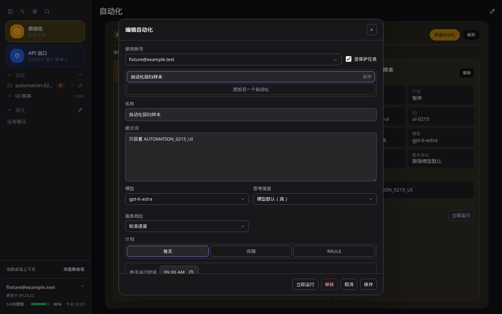
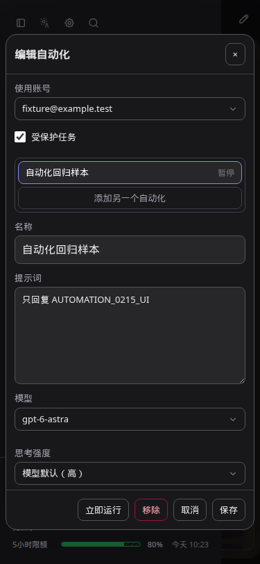
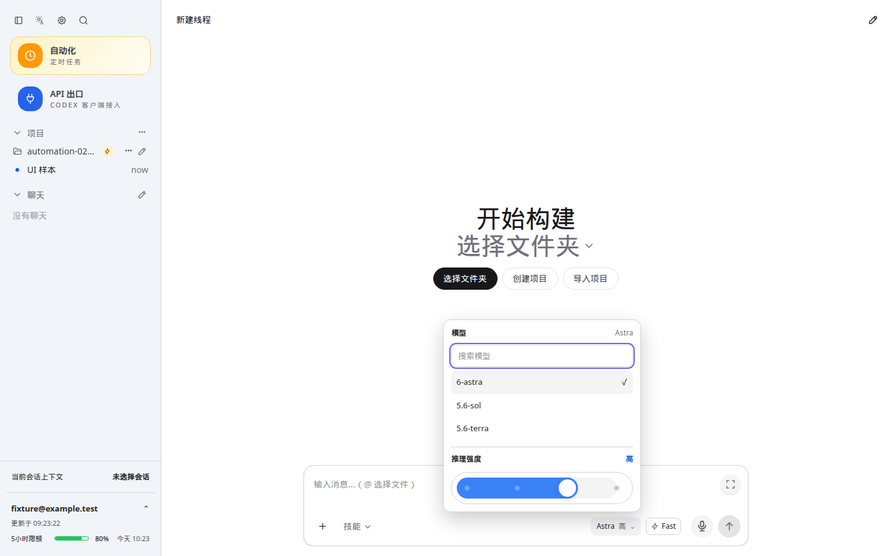
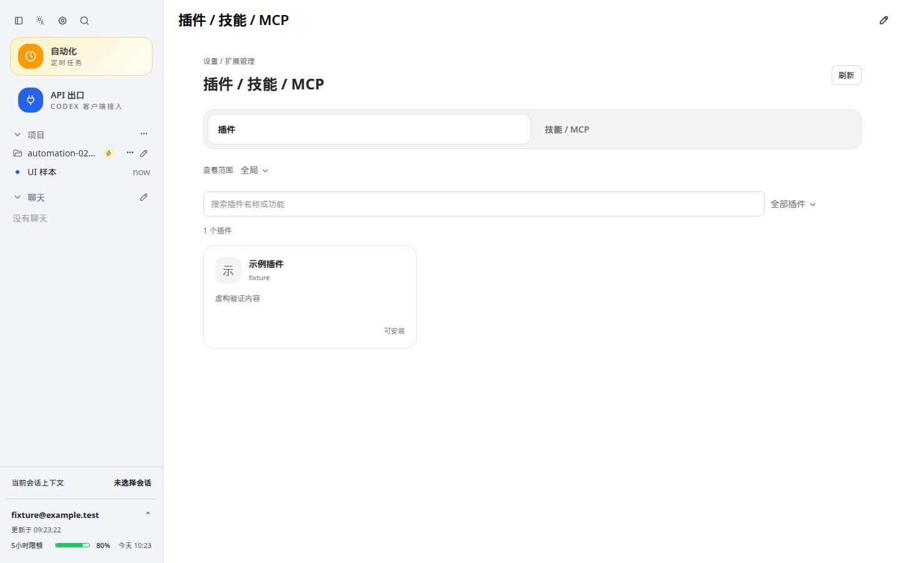
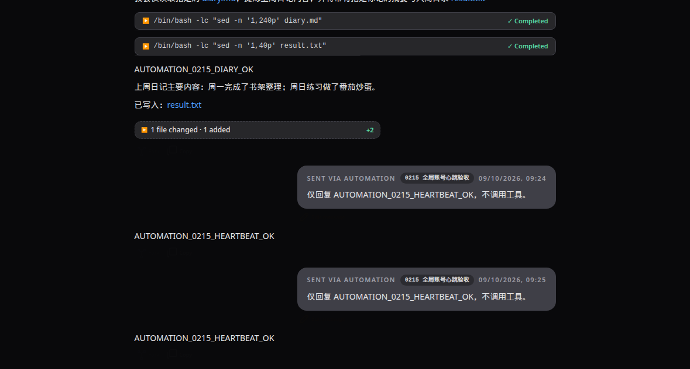

# CodexApp 0.2.15 自动化消息修复与 UI 验收

0.2.15 已运行于 **http://192.168.50.46:59001/**，分支 `feature/0.2.15-development`。P1 自动化消息交付及本轮字体、布局、文案调整完成。生产 5900 仍为 0.2.14，`codexapp.service` PID 768848 全程保持 active；本轮没有 prepare 或 activate。

## P1 根因与修复

只读核查 5900 新建的 `thread-automation-test`：项目任务、暂停状态、固定账号、模型 `gpt-5.6-luna`、提示词“复述上周日记主要内容”。三条最近的手动/重试记录创建了 threadId，但没有 turnId 和 submittedAt，均在消息提交前结束。旧界面只显示“执行未完成；请打开会话查看错误并处理”，因此无法从空会话找到错误。

在 59001 的旧版实际原生进程复现：`thread/start` 成功，紧接着 `thread/resume` 返回 `no rollout found for thread id …`。新建会话尚没有可恢复的 rollout；自动化 prepare 无条件恢复会话，导致首条消息根本未提交。

`automationRuntime.ts` 移除多余恢复：新建会话直接由已持有它的账号工作进程发送第一回合；原有 `AppServerProcess.rpc` 在发送到未加载的会话时仍按需恢复。所选模型、推理强度、账号、保护设置和运行标记继续进入原有发送路径。加入可识别的会话加载失败提示，并使提交前的一般失败明确显示“消息尚未发送”。不会保留上游原始错误或认证材料。

提交：`af4e6ec` 修复与初始回归；`3282098` 补充失败重试、幂等校验。没有删除或重新运行 5900 的真实日记任务。

## 实际任务验收

候选通过实时账号模型目录确认支持 Luna。使用独立测试卷内 `/test-workspace/automation-0190/0215-validation/diary.md`，只含“书架整理、番茄炒蛋”两条虚构日记。没有读取真实日记或发送外部通知。

| 执行路径 | 验收结果 |
| --- | --- |
| 项目任务，固定账号，编辑窗口“立即运行” | 完成，约 21.97 秒；收到完整提示词和运行标记，读取样本、写出 result.txt，回复 `AUTOMATION_0215_DIARY_OK` 和正确摘要 |
| 重放相同手动请求 | 返回原 runId，只有一个回合和一条用户消息 |
| 已有会话，跟随全局账号，详情页“立即运行” | 完成，约 2.67 秒；原会话新增一回合，回复 `AUTOMATION_0215_HEARTBEAT_OK` |
| 相同心跳任务，分钟级定时触发 | 完成，约 3.24 秒；记录 trigger=schedule，实际回复相同验收标记；领取后立即暂停，未重复触发 |
| 刷新会话 | 1440×900 浅/深主题均仍显示真实模型回复 |

三个真实回合都有 turnId、completed 状态和可读取的输出。三条运行记录分别为 `5507e0dd-ccfb-4b70-8b3d-7ff5bc2a79d8`、`18fcd865-f9fc-4e67-8bff-b79d1a2d047a`、`868a54e8-7863-45c6-8c61-ca718c304099`。

真实任务定义已删除，原有两个 PAUSED 自动化保留。测试结果文件和执行会话保留供复核。全局账号未切换。失败后的重试采用进程级夹具验证：注入一次明确认证拒绝，确认不自动重发，再由 retryOf 新请求成功发送一次，attempt=2，重复该请求仍返回相同 runId。

[验收摘要](assets/0.2.15/acceptance.json)；[虚构日记结果](assets/0.2.15/diary-result.txt)。原始脚本和日志位于 `/home/Code/codexapp/output/0215/`：`live-automation.cjs`、`live-heartbeat.cjs`、`live-automation.json`、`live-heartbeat.json`、`live-ui.json`。

## UI 调整

提交 `4e35aef`：账号选择框占满可用宽度；桌面保护复选框与账号框居中对齐，手机换行并左对齐。保护标签、常规字段统一 13px，账号搜索有准确的占位文案。

对话模型搜索使用共用输入样式并自动聚焦，桌面 13px；手机/平板与既有输入框一样使用 16px，避免移动浏览器输入缩放。修正模型菜单中未定义的次要文字颜色变量，浅深主题分别使用现有 `--ui-muted`。

删除扩展页介绍副标题、范围说明、标签页重复介绍、自动化默认配置说明与编辑器重复介绍。保留项目范围选择、运行状态、错误、时区和安装后新会话生效提示。

当前源码 `http://127.0.0.1:4173/` 与打包候选 `http://127.0.0.1:59001/` 均通过 1440×900、768×1024、375×812 的浅/深主题检查：真实改变的控件、账号搜索、保护保存和刷新恢复、手动请求目标、搜索过滤、深色背景、无横向溢出。固定虚构账号的 UI 验证通过请求拦截，不改真实账号配置。Browser Use 本次没有可调用工具，故按仓库规则使用 Playwright CJS。

截图原件绝对目录为 `/home/Code/codexapp/output/playwright/`。下图均来自打包候选，完整路径分别为 `0215-automation-1440-dark.png`、`0215-automation-375-dark.png`、`0215-model-1440-light.png`、`0215-extensions-1440-light.png`、`0215-live-result-dark.png`。

59001 `/#/automations`，1440×900 深色；账号控件宽度与保护选项对齐通过：



59001 `/#/automations`，375×812 深色；保护选项换行，字段无横向溢出，底部操作可访问：



59001 `/`，1440×900 浅色；模型搜索 13px、自动聚焦，过滤不增加目录请求：



59001 `/#/skills?tab=plugins`，1440×900 浅色；冗余文案已移除：



59001 `/#/thread/01a088e8-be5a-7e21-aaf3-56a57023f216`，1440×900 深色；刷新后真实回复仍在，截图裁切会话区域：



## 测试、性能和打包

- 6 个相关测试文件、51 项通过；新增五个引擎→账号工作进程→IPC 回归在修复前全部失败，修复后全部通过。补充拒绝与重试断言后，五项再次通过。覆盖项目/空会话任务、固定/全局账号、定时、幂等、归档历史、未知提交状态不重发、账号路由。
- `pnpm run build` 完成类型检查与前端/CLI 构建；`pnpm pack` 后安装实际 tarball 构建候选镜像。公共 CJS 入口检查 `node -e "process.argv=['node','codexapp','--help'];require('./dist-cli/index.js')"` 退出 0，输出 CLI 帮助。包内 `node-pty.spawn` 存在，真实 PTY 返回 `CANDIDATE_0215_PTY_OK`。
- 独立打包认证矩阵端口 59081/59082/59083/59084：无认证和损坏认证回退 Zen；伪造失效认证产生真实错误，浅/深主题刷新后仍可见；Zen 切换 OpenRouter 配置成功。四类无 Key 的 `/v1/models` 返回 401。重复 live overlay=0。OpenRouter 使用合成 Key，仅证明切换，不声称该 Key 可生成。四个临时测试容器已停止，卷保留。
- UI 搜索过滤新增模型目录请求=0。移除每次自动化执行的一次多余 resume RPC，没有新增轮询、文件扫描或监听器。工作进程并发上限 4、原有重试退避与未知提交不重发规则保持不变；没有增加阻塞工作、无界并发、大载荷或新的缓存失效路径。
- 有效 4173 首页 profile：API 总响应约 14.6 KB；thread/list 首屏、skills/list、额度、provider-models 各 1 次，thread/read 和重复 thread/read 均为 0；warnings=[]，页面结束 Loading threads。冷启动最慢请求约 941ms。报告 `output/playwright/browser-runtime-profile-home-2026-09-10T01-21-50-774Z.json`，同名 trace 已保存。本次未做长时间压力测试。
- 主 JS 683.61 KB / gzip 219.75 KB，CSS 432.56 KB / gzip 47.69 KB，CLI 861.87 KB。未新增依赖。构建仍有既有的大 chunk 与 pnpm 字段弃用提示。
- 候选 `dist`、`dist-cli` 的 27 个文件与本地构建逐个 SHA-256 一致。镜像 `codexapp-multi-account-dev:ui-0.2.15`，摘要 `sha256:1bef53429c77fd71e560d4b10967187655f8db39ce1cf35ee15bf6e8c45b86d3`。

关键复核命令（输出日志在 `output/0215/`）：

```bash
pnpm exec vitest run src/server/automationDispatchIntegration.test.ts src/server/automation.test.ts src/server/automationExecutionSettings.test.ts src/server/automationHistory.test.ts src/server/accountRuntimeIntegration.test.ts src/server/accountTaskRouting.test.ts
CODEXAPP_REPLACE_DEV=1 CODEXAPP_MULTI_ACCOUNT_IMAGE=codexapp-multi-account-dev:ui-0.2.15 CODEXAPP_MULTI_ACCOUNT_DOCKERFILE=/home/Code/codexapp/output/0214-settings/Dockerfile bash scripts/run-multi-account-dev.sh
node output/0215/ui.cjs
UI_BASE=http://127.0.0.1:59001 node output/0215/ui.cjs
PROFILE_BASE_URL=http://127.0.0.1:4173 PROFILE_BROWSER_EXECUTABLE=/snap/bin/chromium PROFILE_WAIT_MS=7000 pnpm run profile:browser
CODEXAPP_IDLE_CHECK_URL=http://127.0.0.1:59001 node scripts/check-codexapp-idle.cjs
```

认证命令依次为 `node output/0215/auth-matrix-final.cjs`、`node output/0215/restart-invalid.cjs`（仅重置合成认证夹具）、`node output/0215/auth-ui.cjs`、`node output/0215/auth-other-ui.cjs`。不对真实认证或重置机会执行此测试。

手工步骤更新在 `tests/automations/project-automations-and-automations-panel.md` 和 `tests/theme-layout-terminal/ui-0214-model-automation.md`。

## 环境与回退

59001 独立卷为 `codexapp-multi-account-dev-home`，没有生产 `/root/.codex` 挂载。部署前严格空闲检查通过；收尾 liveExecutions、activeTurns、queued、pendingApprovals、apiConnections、apiActiveRequests、backgroundThreads 均为 0。4173 留在当前源码和独立 `/tmp/codexapp-0215-ui-home`；5173 未操作。

需要回退候选时，先检查 59001 空闲，再使用原镜像 `codexapp-multi-account-dev:ui-0.2.14` 和同一独立状态卷重建；不删除卷、不同时启动共享卷实例，不修改生产状态。本轮 5900 的失败任务仍保留，待另行发布 0.2.15 后按需重试。
