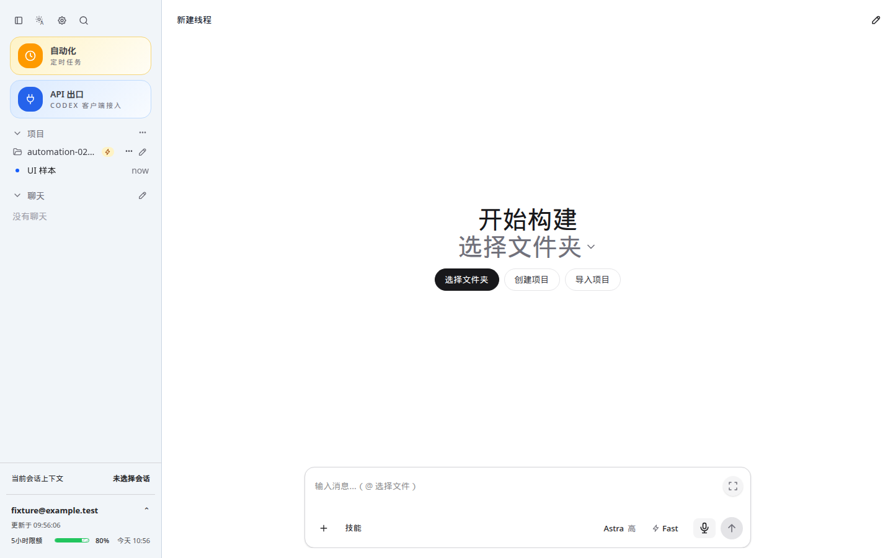
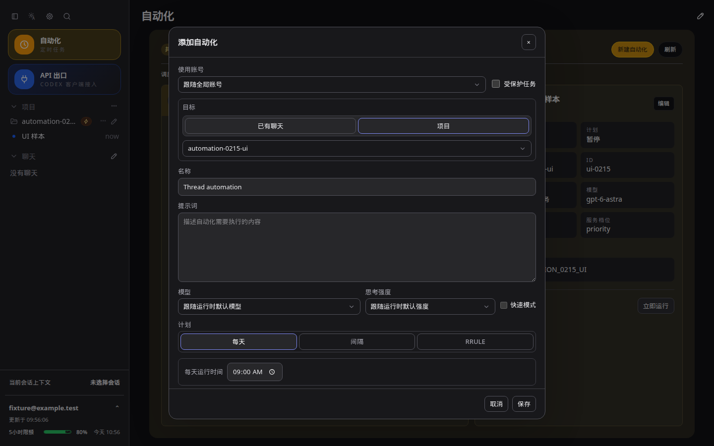
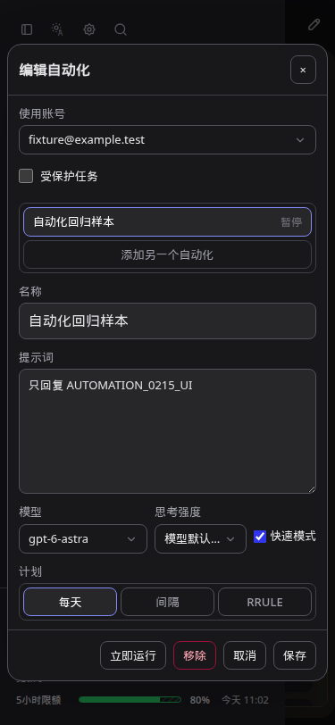
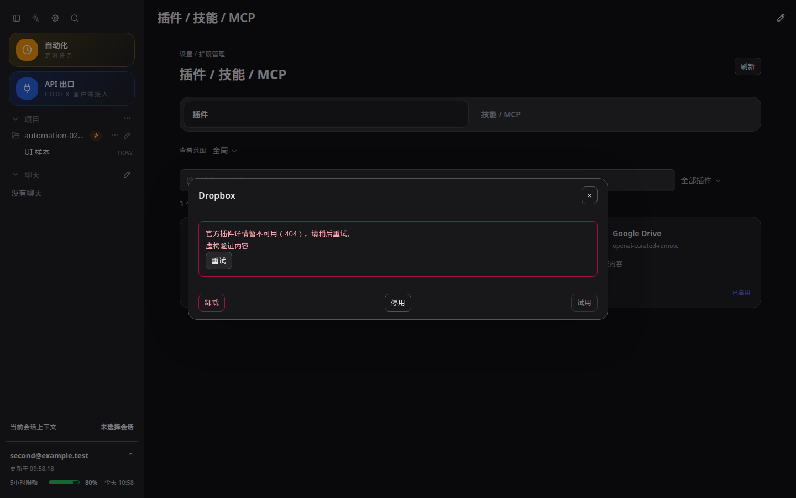

# CodexApp 0.2.15 续跑投递与界面复核

本轮修复已部署到 **http://192.168.50.46:59001/**。生产 5900 经实时接口核对仍是 0.2.14，`codexapp.service` PID 768848，未重启、prepare 或 activate。分支 `feature/0.2.15-development`，本轮代码提交至 `22eecc6`；上一批 P1 自动化修复见同目录 `20260910-0006` 文档。

## 续跑发现与真实验收

本次发现第二个消息提交前失败问题：`ThreadQuotaResume` 用普通 UUID 生成 attemptId，而真实 `DeliveryStore.add` 要求 `d-<13位时间戳>-<随机值>` 或兼容的 `q-` 格式。旧续跑请求因“发送 ID 已过期或无效”被拒绝。之前只模拟 submit 的状态测试未覆盖这个接口约束。

现在续跑复用聊天发送的 `createDeliveryId()`，保留原有持久意图、投递账本和去重机制。新增 `deliveryBridge.test.ts` 用真实 `BackendQueueProcessor`、`DeliveryService`、磁盘账本连接续跑服务；修复前状态错误地落入 unknown，修复后 accepted，重复 tick 只有一次 turn/start。原有额度等待、未知结果不重放、漏事件恢复等测试继续通过。

59001 原生 Codex 实测：

- 测试会话：`01a0890c-55ce-73d2-868e-09bef5b902db`。
- 原回合写好 stage 文件后，手动中断，状态 interrupted。
- 启用续跑，waiting → submitted，自动发送“继续之前的工作”。
- 续跑回合：`01a0890c-bc59-75b1-8573-e2c6d9e884ad`，completed；读取 stage 文件并写最终结果。
- 结果文件：容器 `/test-workspace/automation-0190/0215-validation/RESUME_0215_1789005681928-result.txt`，内容 `RESUME_0215_1789005681928_OK`，会话输出一致。
- 再等待 33 秒，总回合数保持 2，标记回到 armed，无重复投递。最后取消测试标记。

这验证了中断任务的实际投递与续作。额度耗尽/恢复、保护值和未知提交场景使用回归 fixture 验证，没有消耗真实重置机会。最初一次验收脚本依赖工具项状态识别 sleep，错过中断；改为核对实际 stage 文件后中断，以上记录来自修正后的完整运行。

## 界面与提示

1. 浅色 API 出口入口在未悬停时有蓝色底色和边框。
2. 发送框附件、技能、模型、Fast、麦克风统一 13px 字号、32px 高度、8px 圆角和悬停底色；去掉下拉 V。发送/停止保留操作状态表达。
3. 自动化“已有聊天”“项目”使用主题文字/背景变量，修复深色样式覆盖造成的低对比；增加 radio 选中语义。
4. 自动化模型、思考强度、快速模式在同一行，375px 也无横向溢出。快速模式使用复选框，读取模型实际公布的服务档位；保存刷新后 priority 保留。未知能力不冒充支持，默认 Fast 且无标准档位时禁止错误关闭。
5. API 使用说明只保留支持端点：`/v1/responses`（HTTP / SSE / WebSocket）、`/v1/responses/compact`、`/v1/models`、`/v1/chat/completions`。
6. 通知 JSON 提示改为“用 {{message}} 插入通知正文。”；账号别名等重复说明精简。
7. 新增共用成功反馈计时器，3.5 秒后清除，重复操作重置计时器。账号切换仅显示“账号已切换”；账号添加/认证更新/移除、自动化保存/排队、激活计划保存、插件保存、额度重置成功同样短暂显示。失败或未确认结果保留供核对。
8. 通知设置不再加载显示历史成功结果；测试通知保存配置后只显示一次“通知已发送”，不同时显示“已保存”。保存失败不继续测试发送。

## 插件核实

59001 原生 `plugin/read`：Gmail、Google Drive 均 HTTP 200；Dropbox 详情 HTTP 502，原始原因是官方 `chatgpt.com/backend-api/ps/plugins/app-69b31dc2110c8191b8b47dc98fe5a052` 返回 HTTP 404 `Plugin not found`。本应用没有产生该上游 404；不能据此推断 Dropbox 连接损坏或插件已被官方下架。

本地改进：详情错误显示简短官方目录提示、已有摘要和重试按钮；已安装插件的启停操作仍可用，重试只增加一次详情请求。普通本地 404 不会被误标为官方目录故障。

原生接口仍返回 Gmail/Drive 的旧 `/apps/.../connector_...` URL，访问时重定向到通用插件目录。根据 [ChatGPT 官方插件目录](https://chatgpt.com/plugins) 中实际链接，仅对已核实的两条旧地址做兼容替换：

- [Gmail 官方插件页](https://chatgpt.com/plugins/plugin_connector_1p_95d39881713c8191931482a62d6edff9)
- [Google Drive 官方插件页](https://chatgpt.com/plugins/plugin_connector_1p_ab21a553bfbc81919ea8fd1858e3ffa7)

未知 URL 与原生返回的新 URL 保持原值，不猜测插件 ID。链接标注“在 ChatGPT 中管理”。这些页面需要浏览器自己的 ChatGPT 登录态，本次未执行登录后的连接修改。

连接可用性另外通过实际工具验证：会话工具只读成功后，再在 **59001 内部原生模型会话** `01a0890b-8809-7381-89d5-cd08808f7c0d` 实测 `gmail.get_profile`、`google_drive.search`（最多一条文档元数据），两项工具状态 completed，输出 `GMAIL_CONNECTED_OK`、`DRIVE_CONNECTED_OK`。没有发送邮件、读取正文、修改远端数据、安装插件或重新授权。报告不保存邮箱和文档信息。

## 检查与性能

- 后端 5 文件 48 项测试通过：deliveryBridge、threadQuotaResume、deliveryStore、deliveryService、automationDispatchIntegration。新增续跑回归修复前失败的证据为 `output/0215-followup/resume-before.log`。
- UI/目录/模型能力/翻译/反馈 5 文件 33 项测试通过；`pnpm run build` 包含 vue-tsc 和前后端构建通过。
- 4173 当前源码浏览器检查：1440×900、768×1024、375×812，各浅/深主题；实际编辑弹窗、创建目标、发送控件悬停、Fast 保存刷新均通过，无页面异常。通知与插件另测两种主题；通知与账号切换使用拦截，不发送真实外部通知。
- 无 Browser Use 工具，使用 Playwright CJS。主页面性能报告 `output/playwright/browser-runtime-profile-home-2026-09-10T01-59-38-623Z.json`：首屏 thread/list、skills/list、quota、provider-models 各 1 次，无重复 thread/read，API 14.6KB，warnings=[]，已完成加载。对应 trace 保存在同目录。
- 代码路径审计：续跑仅替换 ID 生成，无新增轮询/读请求；每轮最多检查 8 项、只发一条，未知结果继续依赖账本核对。模型控件复用内存目录，不在切换/悬停时发请求；成功反馈每个实例最多一个定时器，清空和卸载时取消。管理链接兼容为常数规模查表，不新增目录遍历、远程预取或缓存失效。
- 包装镜像 Docker 验证端口：59081 无认证 → Zen；59082 合成失效认证 → 原生认证错误且刷新后保留，重复投递同 ID 返回同回合；59083 畸形认证 → Zen；59084 Zen → OpenRouter（虚构 key，不声明模型生成成功）。浅深主题通过，live overlay 重复数 0。测试容器已停止。
- CJS 命令 `node -e "process.argv=['node','codexapp','--help'];require('./dist-cli/index.js')"` 成功输出帮助；包内 node-pty 实际启动 shell，返回 `PACKAGED_0215_PTY_OK`。
- 当前 dist + dist-cli 27 个文件与运行容器逐项 SHA-256 一致。

复核脚本及 JSON/日志位于 `/home/Code/codexapp/output/0215-followup/`；截图位于 `/home/Code/codexapp/output/playwright/0215-followup-*.png`。主要截图的长期副本如下（已与 Obsidian 同步）：

## 运行与交接

- 镜像 `codexapp-multi-account-dev:ui-0.2.15`，ID `sha256:546c6f8273b1d4ee6c03ae2d7c8b5bc2b412fda5469c96c4208266daa1b437f8`。
- 容器 `codexapp-multi-account-dev`，独立 `codexapp-multi-account-dev-home:/codex-home`；测试工作卷 `/test-workspace/automation-0190`；源码 `/home/Code`。没有挂载生产 `/root/.codex`。
- 部署命令：`CODEXAPP_REPLACE_DEV=1 CODEXAPP_MULTI_ACCOUNT_IMAGE=codexapp-multi-account-dev:ui-0.2.15 CODEXAPP_MULTI_ACCOUNT_DOCKERFILE=/home/Code/codexapp/output/0214-settings/Dockerfile bash scripts/run-multi-account-dev.sh`。脚本执行 build、pack、镜像构建，并在替换前核对 activeTurns/队列/审批/后台终端/API 活动均为 0。
- 4173 保留运行用于验收；5173 与生产 5900 未操作。
- 本轮保留用户候选任务，不自动重跑业务自动化。测试续跑标记已取消，测试结果文件与会话留作证据。
- 如需回退候选代码，使用前一镜像 `sha256:1bef53429c77fd71e560d4b10967187655f8db39ce1cf35ee15bf6e8c45b86d3`，继续复用候选数据卷并先通过空闲检查。正式发布需另行按既有流程准备与验收。
