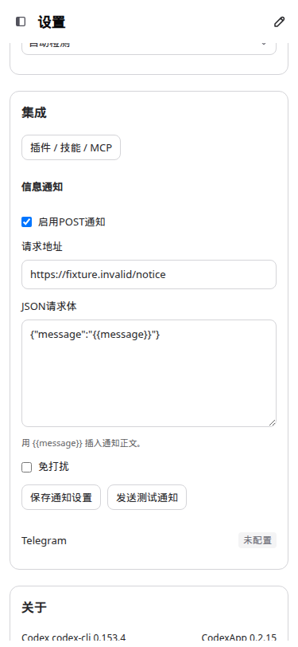
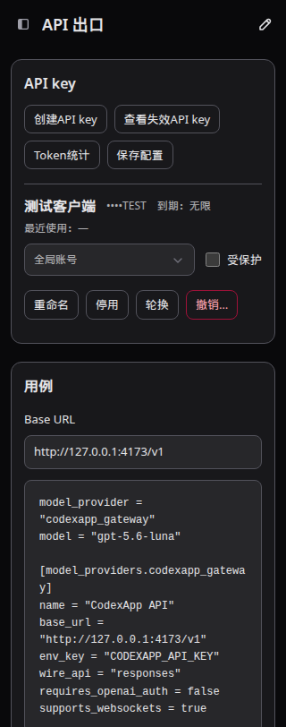
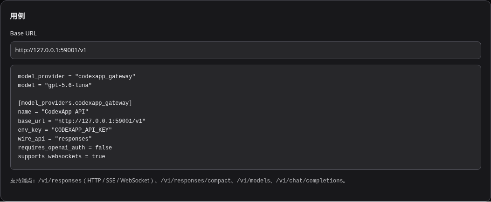

# CodexApp 0.2.15 用例文案与响应式侧栏修复

已更新 **http://192.168.50.46:59001/**，版本仍为 0.2.15。本轮提交 `22f568d`（侧栏）和 `5d098d1`（文案/按钮布局），分支 `feature/0.2.15-development`。生产接口实读 5900 = 0.2.14，服务 PID 768848，保持 active；没有操作生产服务或 5173。

## 修改内容

- 删除账号设置“当前未检测到 5 小时额度窗口…”与“通知通过设置中的 POST 渠道发送…”两段说明，保留实际保护值和通知配置。
- 删除技能页标题下的全局/项目范围介绍。
- 删除 API 出口用途介绍和服务状态徽标，切换说明缩为“切换时等待当前请求结束。”。
- 按用户最终命名改为“用例”，保留 Base URL、原有配置示例和端点列表。移除“读取模型目录”按钮及其前端请求代码，也移除仅用于动态修改示例的模型选择器；示例继续使用原来的 gpt-5.6-luna，没有更改运行时模型配置。
- 通知保存/发送按钮采用 flex 换行布局，间距 8px；账号操作和 API key 行操作也统一为 8px。
- 额外发现 API key 工具栏在手机上被强制 nowrap，并两次缩小字号/间距。改为自然换行，删除 11px 字号及 4px 间距覆盖；320px 也可正常操作。账号设置弹窗底部、激活计划保存和后台进程操作区已检查现有布局，保持正常间距。

## 侧栏根因与行为

旧逻辑进入手机断点（宽度 < 768px）时调用普通 `setSidebarCollapsed(true)`，把自动收起写进桌面持久设置；回到桌面时只检查收起，没有恢复分支。

现在分别记录桌面偏好和当前显示状态：手机抽屉开关及断点变化不写桌面偏好；恢复到 >= 768px 时还原原先桌面状态。手动折叠的桌面侧栏依然保持折叠，手动展开后在窄屏刷新也不会丢失展开偏好。沿用现有 matchMedia 断点事件与滚动位置恢复，没有新增逐像素 resize 监听或服务请求。

## 验收

使用当前源码的 `http://127.0.0.1:4173/`；当前没有 Browser Use 工具，采用 Playwright CJS 执行仓库要求的浅深主题验证，API/账号/通知使用合成数据和请求拦截，没有发送通知或修改真实出口配置。

- 两种主题分别执行 1440 → 767 → 768 → 1440 的侧栏恢复，以及桌面手动折叠、窄屏抽屉开关、刷新持久化。全部通过；视口变化新增 thread/list 与 model/list 均为 0。
- 1440×900、768×1024、375×812、320×812，各浅深主题：通知、账号操作、账号设置弹窗底部、API 保存/key 工具栏/key 行操作按钮间距至少 8px，无重叠、无按钮越界、无页面横向溢出；目标文案已删除，“用例”未请求 `/codex-api/api-proxy/models`；无 pageerror。
- 在已更新的 **59001** 实际页面再验证浅深主题：标题、配置示例、取消模型读取、1440 → 375 → 1440 侧栏恢复全部通过。只读浏览，截图仅截取不含账号和 key 数据的用例卡片。
- 共 10 组合成浏览器场景（2 组侧栏 + 8 组布局文案）和 2 组真实候选页面检查通过。
- `pnpm exec vue-tsc --noEmit`、`pnpm run build` 通过。此轮只有前端交互/布局和文案调整，验证集中在真实浏览器，没有重复执行模型请求和认证矩阵。
- CJS smoke：`node -e "process.argv=['node','codexapp','--help'];require('./dist-cli/index.js')"` 成功输出帮助。

脚本与结构化结果：`/home/Code/codexapp/output/0215-layout/ui.cjs`、`ui.json`、`live-ui.cjs`、`live-ui.json`。截图绝对路径统一为 `/home/Code/codexapp/output/playwright/0215-layout-*.png`。以下长期副本同步到 Obsidian：

## 性能与运行产物

首屏性能报告：`output/playwright/browser-runtime-profile-home-2026-09-10T03-11-38-954Z.json`，API 总量 14.6KB，首屏 thread/list、skills/list、quota、provider-models 各 1 次；重复 thread/read = 0，warnings=[]，页面结束加载。trace 和截图在同目录。

此次侧栏变化不新增请求、文件扫描或缓存失效路径；仅断点变化处理显示状态，只有桌面操作保存偏好。“用例”删除了手动模型目录请求和列表响应状态；按钮换行由 CSS 完成，没有增加 JS 布局测量或监听。

候选镜像 `codexapp-multi-account-dev:ui-0.2.15`，ID `sha256:a531381368763438353d4c41c11c5d469fd70ff347155035e0e9901504241098`。运行容器与本地 dist/dist-cli 27 个文件逐项 SHA-256 相同，证据 `output/0215-layout/artifacts.json`。候选继续独立挂载 `codexapp-multi-account-dev-home:/codex-home`、测试工作卷和 `/home/Code`，没有挂载生产 `/root/.codex`。

部署使用现有 `scripts/run-multi-account-dev.sh`、实际打包产物和已验证依赖 Dockerfile。替换前空闲检查的回合、队列、审批、后台终端及 API 活动均为 0。4173 保留运行。若需回退候选代码，上一镜像为 `sha256:546c6f8273b1d4ee6c03ae2d7c8b5bc2b412fda5469c96c4208266daa1b437f8`，须沿用独立候选卷并先核对空闲状态。
