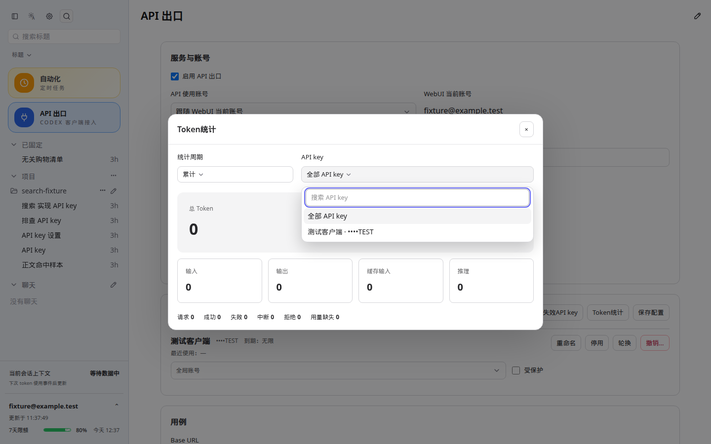
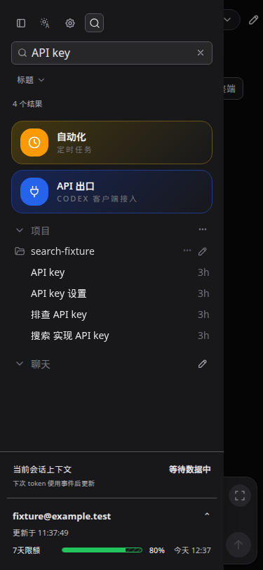

# CodexApp 0.2.15 搜索提示与线程搜索优化

已更新 **http://192.168.50.46:59001/**，版本仍为 0.2.15。提交 `1ff214a`（搜索提示）和 `57c3447`（线程搜索），分支 `feature/0.2.15-development`。生产 5900 服务 PID 768848 未变，没有重启生产服务或 5173。

## 修复与交互

通用 AppSelect 把 `Quick search projects` 写成了默认搜索提示，因此 API key、账号、模型等控件复用时出现错误文案。删除这个项目专用默认值，未提供提示时留空；保留辅助标签。17 处可搜索下拉框均已提供对应的短提示，如“搜索 API key”“搜索账号”“搜索模型”“搜索项目”。插件、任务、技能、分支、提交、语言、时区和文件夹搜索也已检查，去除冗长提示，任务的标题/正文提示随范围切换。

线程搜索的直接故障是：过滤项目时确实保留了命中线程，但实际渲染再次从未过滤的项目映射中取全部线程。修复前用三个虚构会话复现：查询只命中一个，界面显示三个。现在渲染只取匹配结果，保留置顶、项目、聊天分组及普通列表状态。

- 默认搜索标题，不自动读取正文或匹配隐藏摘要；无名称时，实际显示为标题的摘要仍可搜索。
- 可切换“正文”，搜索标题以及用户消息、最终回复，排除工具命令、命令输出和助手过程说明。
- 多个空格分隔的关键词必须同时匹配，统一大小写、全半角和连续空白。优先精确标题，其次标题前缀、连续短语和分散关键词；同级按最近活动，正文命中排在标题之后。排序在现有分组内生效，项目组按其最佳命中排序，置顶保持独立区段。
- 搜索响应携带命中会话的必要元数据，使初始侧栏页之外的会话可直接显示和打开。没有为每个命中额外读取历史；仍保留完整已加载集合，防止筛选导致无关置顶会话被误清理。
- 状态仅显示“N 个结果”，覆盖不全时增加“部分范围”，详细覆盖范围放在悬停提示里。失败显示简短提示和重试；查询期间不误报空结果。切换范围、修改查询、清空均取消旧请求，晚到结果不能覆盖新结果。

## 验收证据

没有 Browser Use 工具，采用 Playwright CJS 执行仓库要求的界面检查，保留相同视口和截图目录。

- `pnpm exec vitest run src/server/threadSearch.test.ts src/threadSearchMatch.test.ts src/threadSearchEvents.test.ts src/api/codexGateway.test.ts src/components/sidebar/pinnedThreadUtils.test.ts`：5 个文件、42 项通过。覆盖标题零正文读取、隐藏摘要、全角和多关键词、相关度排序、轻量元数据、正文内容提取、缓存更新、改名/归档、取消和并发上限。
- `pnpm run build` 通过，包含 vue-tsc；入口包 gzip 220.70 kB。构建保留原有大 chunk 提示，本轮没有引入依赖。
- CJS smoke：`node -e "process.argv=['node','codexapp','--help'];require('./dist-cli/index.js')"` 成功输出帮助。
- `http://127.0.0.1:4173/`，1440×900、768×1024、375×812，各浅深主题，共 6 组通过：精确过滤、相关度排序、标题/正文切换、较早会话打开、旧响应忽略、错误重试、消息完成刷新、清空、置顶保留、手机抽屉范围控件无越界。搜索前后原有 4 个消息订阅连接数量不变，完成事件只触发一次搜索请求，无 pageerror。API key 搜索提示在桌面两种主题中另行打开实际统计弹窗验证。
- 已部署的 `http://127.0.0.1:59001/#/api-proxy`，1440×900 浅深主题，只读核验真实已有测试会话：标题和正文搜索的界面结果数分别与接口一致，API key 下拉提示正确，无 pageerror。截图裁取搜索区域与输入框，避开真实账号和 key 列表。
- 真实会话使用上一轮创建的续跑验收线程 `01a0890c-55ce-73d2-868e-09bef5b902db`，正文标记 `RESUME_0215_1789005681928_OK` 可命中。本轮没有创建模型任务、发送通知、消耗重置机会或修改真实账号/key 配置。

脚本、日志和结构化结果位于 `/home/Code/codexapp/output/0215-search/`：`before.json`、`placeholder-audit.json`、`unit.log`、`ui.cjs`、`ui.json`、`performance.json`、`live.cjs`、`live.json`、`artifacts.json`。截图绝对路径为 `/home/Code/codexapp/output/playwright/0215-search-*.png`，以下为同步至 Obsidian 的长期副本：

## 性能与范围

| 场景 | 列表读取 | 正文读取 | 耗时 | 响应大小 |
| --- | ---: | ---: | ---: | ---: |
| 1000 条虚构元数据，冷标题查询 | 10 页 | 0 | 1.61 ms | 274 B |
| 同一缓存，第二次标题查询 | 0 | 0 | 0.93 ms | 274 B |
| 首次正文查询，100 个约 5 万字符的正文 | 0 | 100 | 60.75 ms | 1192 B |
| 同一缓存，第二次正文查询 | 0 | 0 | 53.67 ms | 1192 B |
| 59001 真实标题查询 | — | 0 | 36 ms | 803 B |
| 59001 真实正文查询 | — | 29 | 1294 ms | 804 B |

合成测量用于比较读取次数和本机匹配开销，不代表真实网络时延。真实正文查询有 2 个会话发生范围截取、0 个读取失败，页面如实标记部分范围。

继续沿用上限：标题最多最近 1000 个非归档线程、10 页；正文最多最近 100 个，每个最近 50 回合及末尾 20 万字符；正文读取总并发最多 4，缓存最多 100 项且 UTF-8 总量不超过 32 MB。大正文超过缓存总容量后可能重新读取被逐出的项目。文件版本改变、元数据更新、改名/归档、实时消息事件均保留原有失效路径。响应不包含历史回合、rollout 路径或完整长摘要。

首屏报告 `output/playwright/browser-runtime-profile-home-2026-09-10T03-35-09-283Z.json`：14.6 kB，thread/list、skills/list、quota 和 provider-models 各 1 次，无重复 thread/read，页面结束加载。记录到原有 provider-models 请求 1043.3 ms 的警告；该路径本轮未改动，没有把首屏称为零警告。搜索不新增事件监听、消息连接或后台扫描任务；匹配与排序受上述范围限制，前端新增元数据合并只在有搜索结果时执行。

## 候选运行与回退

镜像 `codexapp-multi-account-dev:ui-0.2.15`，ID `sha256:a56812b8f490bf080a88f87e932e13d64968fd4f2f3d8196a45ca828d33bd09a`。部署脚本先构建、打包并检查 CLI/PTY 依赖，再通过空闲检查替换候选；回合、队列、审批、后台终端、API 活动均为 0。27 个 dist/dist-cli 文件与运行容器逐项 SHA-256 一致。

独立挂载 `codexapp-multi-account-dev-home:/codex-home`、测试工作卷及 `/home/Code`，未挂载生产 `/root/.codex`。4173 保持运行。需要回退候选代码时，上一镜像为 `sha256:a531381368763438353d4c41c11c5d469fd70ff347155035e0e9901504241098`；沿用独立候选卷并重新通过空闲检查。
