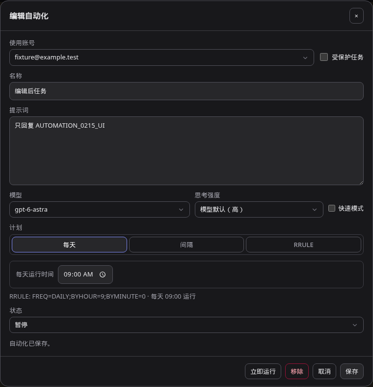
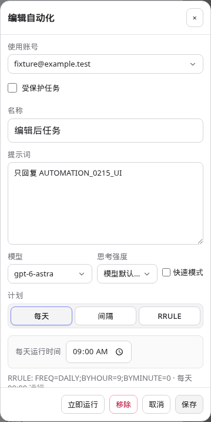
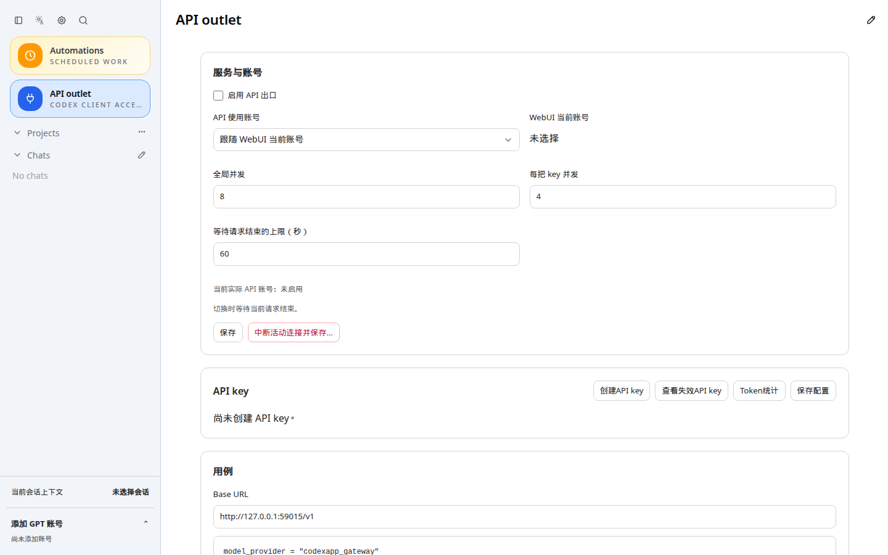

# CodexApp 0.2.15 编辑窗口精简与发布准备

本轮按“修改自动化编辑窗口，完成后 prepare、准备切换”执行。编辑窗口已精简，59001 已更新，正式发布包已完成构建及验收。没有执行 activate；生产仍运行 0.2.14，PID 768848，active，NeedDaemonReload=no。

## 编辑窗口

提交 `42e3babae331`，分支 `feature/0.2.15-development`。删除窗口内的其他任务切换列表和“再添加一个自动化”按钮，以及全部专用样式。编辑只作用于外部列表选中的任务；新建仍从自动化页面进入。

同时取消删除后的隐式切换：移除当前任务成功后关闭窗口，不再自动打开另一个任务或新建草稿。删除失败保留原表单供重试。账号、模型、计划、保存、手动运行等业务字段和接口保持原有流程。

## 功能与性能验证

- 当前源码 `http://127.0.0.1:4173/#/automations`，项目和聊天任务共 8 组：1440×900 两种任务类型各浅深主题，768×1024 项目任务浅深主题，375×812 聊天任务浅深主题。
- 每组均验证选择第二个任务编辑、任务列表/新建控件消失、保存 ID 正确、其他任务不变、重新打开保留已保存值、删除失败保留草稿、重试删除后关闭窗口、外部新建入口可用；没有运行请求，无 pageerror。
- 使用 Playwright CJS 和请求拦截，账号/任务为合成数据，没有保存或删除真实任务。当前没有 Browser Use 工具；截图统一存入 output/playwright。
- 实际 59001 打包页面的项目任务编辑在 1440×900 浅深主题再次执行同样的拦截验收，2 组通过。
- `pnpm run build` 通过，含 vue-tsc。发布回归为 4 个文件共 17 项：`src/server/releaseAuthPreservation.test.ts`、`src/cli/codexappReleaseSwitch.test.ts`、`src/server/automationDispatchIntegration.test.ts`、`src/server/threadQuotaResume.test.ts`。
- 性能审计：删掉随任务数量增长的列表渲染循环及其按钮、样式；没有增加监听、计时器、接口、历史读取、并发或缓存失效路径。删除成功后关闭窗口，避免再为下一任务初始化草稿和模型读取。入口 JS 从上一轮 685.95 kB / gzip 220.70 kB 降为 685.26 kB / gzip 220.54 kB；入口 CSS 431.90 kB / gzip 47.81 kB。此轮没有测量服务端调度吞吐，因为调度代码未改动。

截图原路径：`/home/Code/codexapp/output/playwright/0215-editor-1440-project-dark.png`、`0215-editor-375-thread-light.png`，下列副本已同步 Obsidian：





## 已准备的发布包

精确发布目录：

```text
/home/docker/codexapp-releases/codexapp-0.2.15-42e3babae331-20260910-124935
```

- 版本 0.2.15，源码提交 `42e3babae331`，prepare 前工作区干净；后续提交仅为交接文档。
- CLI SHA-256：`058880e26545d180aee30ef783838f1857f7603e94f2c46b53f20d062f004b5e`。
- tarball `/tmp/codexapp-0.2.15.tgz`，SHA-256：`c8d8ea71f0c6dc201dd377ace4ef90c5b8fa77dcf2c5ed6fd3708a94754705a6`。
- 27 个 dist/dist-cli 文件与源码构建、59001 候选产物一致。
- 59001 镜像：`sha256:2754e00f62fb4e958b2d97717e815f2371baf9cfdbee17f01398f9f0dafe512b`；仍使用独立 `codexapp-multi-account-dev-home:/codex-home`，没有挂载生产 `/root/.codex`。
- API 代理组件 7.2.152 的校验、manifest、可执行位通过。
- 公共 CJS require/help 通过；实际 `node-pty.spawn('/bin/sh', ['-c', 'printf PREPARED_PTY_OK'])` 返回 0 并输出 `PREPARED_PTY_OK`。npm 的 allow-scripts 提示没有影响实际原生运行验证。

执行命令：

```bash
cd /home/Code/codexapp
npm_config_prefer_offline=true npm_config_audit=false npm_config_fund=false npm_config_nodedir=/root/.cache/node-gyp/24.19.0 bash scripts/codexapp-release-switch.sh prepare
```

本机实际 Node 为 v24.19.0；使用其已存在的缓存头文件，没有改全局 npm 配置。prepare 未重启生产、修改 systemd 或操作生产凭据，没有复制候选账号/会话到生产。

## 独立发布包与缓存检查

使用精确发布路径内的 CLI，在 59015 和独立 `CODEX_HOME=/home/Code/codexapp/output/0215-prepare/smoke-home` 启动，无真实认证。

- HTML `Cache-Control: no-store`，无 ETag/Last-Modified；旧校验器和未来 If-Modified-Since 请求仍返回 200 及当前入口。
- 带哈希 JS/CSS 使用 `public, max-age=31536000, immutable`。
- 不存在的旧 JS 返回 404，不回退 SPA HTML。
- `/v1/models` 不带 key 返回 401；这里只验证路由与认证边界，不作为生成成功证据。
- Chromium 1440×900 打开 `http://127.0.0.1:59015/#/api-proxy` 并刷新成功，JS/CSS 命中磁盘缓存，pageErrors=[]。
- 测试结束已关闭 59015 进程组并核对端口释放。4173 按仓库约定保留运行，使用独立 `/tmp/codexapp-0215-ui-home`；未操作 5173。



截图原路径：`/home/Code/codexapp/output/playwright/0215-prepare-cache-smoke.png`。

## 切换前检查与后续命令

对上述精确路径运行一次 `check`，退出码 3：

```text
idle-check|liveExecutions=1|activeTurns=1|queued=0|pendingApprovals=0|apiConnections=0|apiActiveRequests=0|backgroundThreads=skipped-busy|loadedThreads=0|pages=2
```

仍有活跃执行/回合，不能切换；这两个计数不代表两个独立任务。队列、待审批、API 连接及活动请求均为零。后台终端因忙碌而跳过，不能报告为零，也没有进一步探查或终止生产会话。

[发布交接技能](/root/.codex/memories/skills/codexapp-release-handoff/SKILL.md:43) 的明确要求是：“Stop immediately at a failed idle check or missing explicit authorization”。因此 prepare 已完成，切换检查失败后停止推进；本次请求也仅授权准备切换，未执行 activate。

结束当前回合、关闭 CodexApp 页面及独立 CLI 工作后，在独立主机终端先执行：

```bash
cd /home/Code/codexapp
bash scripts/codexapp-release-switch.sh check /home/docker/codexapp-releases/codexapp-0.2.15-42e3babae331-20260910-124935
```

检查通过并获得正式切换授权后执行：

```bash
bash scripts/codexapp-release-switch.sh activate /home/docker/codexapp-releases/codexapp-0.2.15-42e3babae331-20260910-124935 --confirm-idle
```

使用精确路径，不依赖可能被后续 prepare 改写的 latest。activate 会重新门禁、保留完整账号快照并验证认证不变量。切换后核查 systemd、5900 页面、账号状态及实际请求结果，不能只用 HTTP 200 作为业务验收。需要回滚时也先获得授权并通过空闲检查，使用 `bash scripts/codexapp-release-switch.sh rollback --confirm-idle`。

## 证据目录

`/home/Code/codexapp/output/0215-prepare/` 包含 editor-ui/editor-candidate 的脚本和 JSON、build/deploy/prepare 日志、release-tests/switch-tests 日志、candidate-artifacts.json、prepare-verification.json、verify-prepared.cjs、cache-smoke.cjs、cache.json 和 check.log。长期精简结果见 [acceptance.json](assets/0.2.15-prepare/acceptance.json)。本文及图片/结果副本已同步 Obsidian `开发/codexapp/` 并按字节核对。
