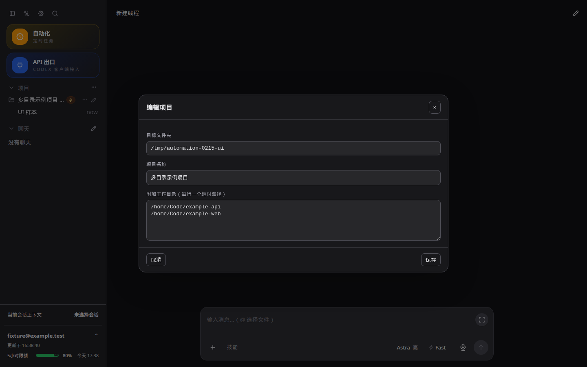
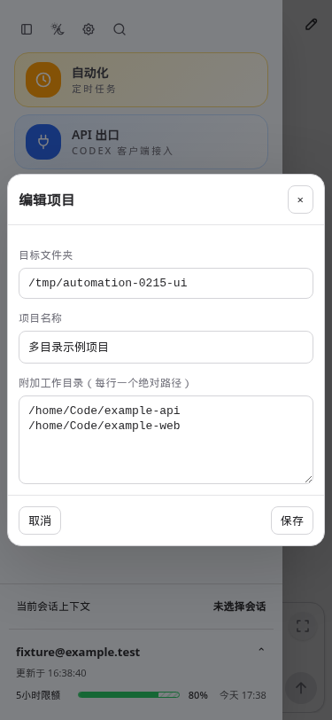
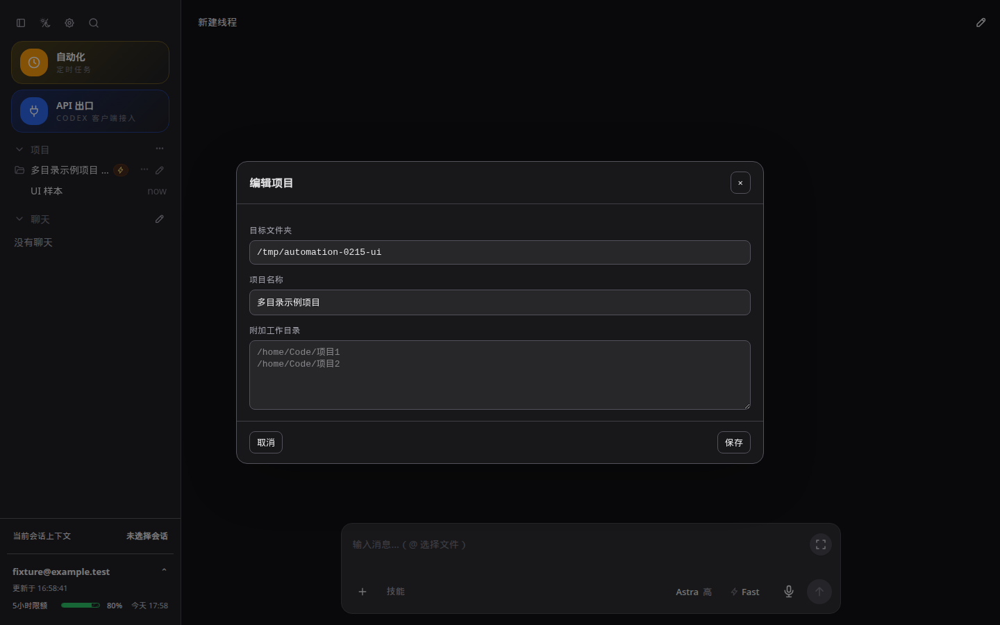
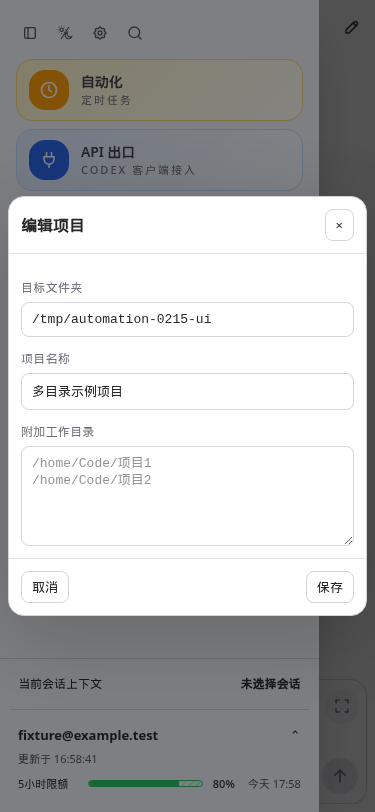

# CodexApp 0.2.16 完成列表与项目多目录开发验收

0.2.16 已部署到 **http://192.168.50.46:59001/**，分支 `feature/0.2.16-development`。本轮五项需求已实现，源代码、真实文件读写和打包候选验证通过。生产 5900 的 `codexapp.service` 保持 active，操作前后 PID 都为 1567483；没有 prepare 或 activate。

## 功能及提交

| 需求 | 实现 | 提交 |
| --- | --- | --- |
| 完成蓝点 | 服务端持久化显式完成列表，从空列表开始；仅新回合完成事件加入，点击会话后清除并通知其他终端。取消历史 updatedAt、旧 localStorage 和状态轮询推算。 | `cacf47b` |
| 精简说明 | 移除首页“已选文件夹”及本地项目 / 新 Worktree 说明段落。 | `331ba63` |
| 删除复制菜单 | 删除线程右键“复制路径”“复制聊天”及关联处理函数。 | `b234562` |
| 项目多目录 | 创建项目与“编辑项目”共用 AppDialog；编辑项目名称、维护每行一个附加目录；已有项目主目录只读。 | `464e9f3` |
| 自动主题图标 | 改为太阳斜杠月亮；自动、深色、浅色均为 16px 图标，按钮不变宽。版本 0.2.16。 | `6de7ff5` |

完成列表保存在候选独立 CODEX_HOME 的 `codexapp-thread-completions-v1.json`。接口为 GET/POST `/codex-api/thread-completions`，增删使用 `codexapp/completions/changed` 通知；断线重连重新读取快照，加载期间的事件会合并，不被旧快照覆盖。点击携带所见完成回合 token，不能删除后来完成的新回合；持久化保留最近 2048 个完成 token 防止近期重复事件加点。未点击列表不因分页缺席被删掉。运行中或当前选中的线程沿用原来的侧栏显示优先级；静默历史读取不算点击。

附加目录写入主目录 `AGENTS.md` 的 `codexapp:work-directories:start/end` 区块，包括绝对路径 JSON 列表和按任务查找/修改对应目录的中文说明。目录需要已存在；去重并排除主目录本身。保留区块外原文，使用临时文件加 rename 写入；损坏区块、符号链接 AGENTS.md、无效目录返回错误并保留草稿。已有的 0.1.89 related-directories 手工区块不自动迁移或改写。

这是通过项目说明提供工作目录指引：文件树、终端和 Git 默认根仍为主目录，不是多根文件树，也不新增 Docker 挂载。59001 当前共享 `/home/Code`；其他宿主路径未必在容器里可见。旧会话可能缓存原说明，应明确要求重新读取 AGENTS.md；如果存在 AGENTS.override.md，应检查实际生效的说明。

## 验证结果

- `pnpm run build` 通过，包含 `vue-tsc --noEmit` 和前后端构建。
- `pnpm exec vitest run src/server/threadCompletionBridge.test.ts src/server/threadCompletionList.test.ts src/server/projectDirectories.test.ts src/composables/projectSetup.test.ts src/composables/useDesktopState.test.ts`：**5 文件、61 项通过**。
- 服务端真实 HTTP / 通知桥回归：历史 idle 事件不加点，新完成事件加点，旧 token 不清除新回合，点击广播清除，重复完成不补点。持久化重建与并发更新另有独立测试。
- 源码 `http://127.0.0.1:4173/`：1440×900、768×1024、375×812，各浅深主题共 6 组；创建、重命名、目录保存、保存失败保留草稿/重试、刷新回读、菜单删除和图标等宽通过，无 pageerror。
- 两个独立浏览器上下文：完成后两端有蓝点，刷新保留，点击后两端清除，再刷新不回补；历史样本的 updatedAt 特意设置为未来时间。
- 打包候选 `http://127.0.0.1:59001/`：1440×900 浅深主题复验、两个终端同步、从线程路由打开项目编辑均通过。Clone 表单通过请求拦截验证 URL/父目录提交和成功关闭；没有实际访问 GitHub 克隆。
- 4173 和 59001 的真实文件测试：创建/重命名、中文与空格目录、去重、原 AGENTS.md 保留、无效目录不修改文件与名称、清空附加目录。测试只在 `output/0216/project-*` 临时目录操作，结束清理对应项目项及临时目录。
- 本轮浏览器需要事件模拟和失败请求拦截，使用 Playwright CJS；没有可调用的 Browser Use。合成账号、线程及目录用来验证 UI；另补一条下述实际模型任务。全程不使用重置额度。
- 额外尝试的独立 `pnpm exec tsc --noEmit -p tsconfig.server.json` 未通过：该配置包含前端 API 文件但未包含 DOM 类型，并存在 `apiProxy/gateway.test.ts` 的 unknown 类型诊断；诊断未指向本轮新增模块。不能把这条额外命令描述为通过，常规 build 的类型检查已通过。

本地 CJS 命令：`node -e "process.argv=['node','codexapp','--help'];require('./dist-cli/index.js')"`，退出 0；候选中同样 require `/usr/local/lib/node_modules/codexapp/dist-cli/index.js` 输出帮助并退出 0。候选真实 `node-pty.spawn('/bin/sh', ['-c', 'printf CANDIDATE_0216_PTY_OK'])` 输出指定标记且退出 0。

## 实际模型与真实蓝点验收

候选实时账号与模型目录确认可用后，以 `gpt-5.6-luna`、low 执行一次只读任务：只在提问中要求根据项目 AGENTS.md 定位所有附加目录并读取 proof.txt，提问不包含目录列表和文件内随机标记。AGENTS.md 由本版 project-root 接口生成受管区块。

真实会话 `01a08a7b-d319-7521-bcf7-ec1f2ba94f7a`，回合 `01a08a7c-9b49-7a33-b22e-570a7e099dc4`，状态 completed；一次命令工具调用后正确返回两个附加目录（含空格及中文路径）及各自随机标记，4 项精确比对全部通过。结果和[实际受管说明](assets/0.2.16/live-AGENTS.md)随验收数据保存。这证明新会话能够读取目录指引并使用它进行跨目录读取；没有对附加目录执行修改。

随后打开两个浏览器，仅对展示的账号/线程列表提供测试夹具，**完成列表 GET/POST 和 WebSocket 均直连真实候选**。两端显示这个真实完成回合的蓝点；点击一端后真实服务器列表移除该回合，另一端清除，刷新不回补。原始行截图 `/home/Code/codexapp/output/playwright/0216-live-blue.png`（页面 1440×900，深色）：


测试结束已归档该会话、移除本轮测试项目并删除临时目录；保留结果证据。首次测试脚本使用不符合投递协议的消息 ID，服务端在投递前返回 409；修正为标准 d-时间戳-UUID 后复用原线程，实际模型回合仅发送一次。

## 性能审计

真实 4173 首页执行 `PROFILE_BASE_URL=http://127.0.0.1:4173 PROFILE_WAIT_MS=7000 PROFILE_BROWSER_EXECUTABLE=/snap/bin/chromium pnpm run profile:browser`。

- 页面正常启动，`stillLoadingThreads=false`、`warnings=[]`，总 API 14.6KB；thread/list=1、thread/read=0、thread/resume=0、skills/list=1、rateLimitsRead=1、providerModels=1。
- 完成列表 GET=1，5.2ms，响应 11 字节；没有额外历史加载或周期轮询。增删事件只携带单个 threadId/token，不广播完整列表。
- 项目编辑按需读取一个 AGENTS.md；创建目标输入延迟 300ms 合并请求并忽略过期结果，保存串行执行目录 stat，不递归扫描目录、不创建无界并发。浏览器不对每个侧栏项目预取目录。
- 完成列表持久化一次写入当前未点击列表和最多 2048 个去重 token；列表规模会影响 JSON 序列化/快照大小。本轮未做超大未点击列表或大量附加目录压力测试。无新增依赖、后台计时器或全量线程缓存失效。
- 入口 JS 684.18KB / gzip 220.47KB（0.2.15 为 685.26KB / 220.54KB）；入口 CSS 432.00KB / gzip 47.84KB；CLI 871.37KB。

原始 profiler 文件：`output/playwright/browser-runtime-profile-home-2026-09-10T08-34-37-559Z.json`，同名前缀下有 PNG 和 trace.zip。没有测量真实模型执行耗时。

## 候选部署与回退

开始时 59001 没有监听，旧候选容器已退出。保留它为 `codexapp-before-0.2.16-20260910`，原镜像为 `sha256:2754e00f62fb4e958b2d97717e815f2371baf9cfdbee17f01398f9f0dafe512b`。随后使用既有候选脚本构建 tarball 并安装到已验证 CLI 基础镜像，未从运行容器导出账号状态。

```bash
CODEXAPP_MULTI_ACCOUNT_IMAGE=codexapp-multi-account-dev:ui-0.2.16 \
CODEXAPP_MULTI_ACCOUNT_DOCKERFILE=/home/Code/codexapp/output/0214-settings/Dockerfile \
bash scripts/run-multi-account-dev.sh
```

- 现容器 `codexapp-multi-account-dev`，镜像 `sha256:fd4104de031a3de036c141323190216e9a10004f2b1478ddc31e338957b545d7`。
- 版本 0.2.16；本地构建与候选 dist/dist-cli 的 **27 个文件 SHA-256 完全一致**。
- 沿用独立 `codexapp-multi-account-dev-home:/codex-home`，未挂载生产 `/root/.codex`；复用 `/home/Code` 和原测试工作区卷。
- 最终候选 idle-check：liveExecutions、activeTurns、queued、pendingApprovals、apiConnections、apiActiveRequests、backgroundThreads、loadedThreads 均为 0。
- 4173 留作当前源码验证服务，PID 2079864，CODEX_HOME=/tmp/codexapp-0216-ui-home；未操作 5173。

若撤回候选，先检查 59001 空闲，停止并保留当前容器，再将旧容器恢复原名并启动。旧容器在本轮开始时已有退出状态，因此回退也需要检查启动结果。不要删除状态卷，不操作生产服务。此轮未生成 0.2.16 prepared 包；旧 0.2.15 prepared 包不包含本轮改动。

## 截图与证据

以下来自实际打包候选 `http://127.0.0.1:59001/`，项目/账号信息由请求拦截提供，不是正式业务内容。均检查了项目编辑窗口、目录文本、无错误状态；截图前等待 2.3 秒。

1440×900 深色，原件 `/home/Code/codexapp/output/playwright/0216-preview-1440-dark.png`：



375×812 浅色，原件 `/home/Code/codexapp/output/playwright/0216-preview-375-light.png`：



[精简验收数据](assets/0.2.16/acceptance.json) 汇总浏览器、真实 API、文件哈希和性能数据。原始脚本与日志位于 `output/0216/`。相关手工用例已更新 `tests/projects-sidebar-new-chat/`。本文与 assets/0.2.16 同步至 Obsidian `开发/codexapp/` 并核对字节一致。


## 0.2.16 文案微调

提交 `6ce13d5`：字段标签精简为“附加工作目录”，空输入框显示两行占位提示 `/home/Code/项目1`、`/home/Code/项目2`；项目右键菜单精简为“编辑项目”。占位提示不写入草稿，不会作为默认目录保存。

构建（含 vue-tsc）通过。源码 4173 的 1440×900 深色、375×812 浅色分别检查菜单、标签、精确含换行的 placeholder 和空 value，通过；使用请求拦截的示例数据，无业务写入。性能为静态文本及占位属性变化，没有新增接口、循环、监听或缓存失效；入口 JS 684.15KB / gzip 220.43KB，CSS 432.00KB / gzip 47.84KB。


59001 已更新至本次文案版本，镜像 `sha256:324cb632c990bc5001f22c0c381108cef5b737acd311b978e7d37f78bb4b8d6f`，版本仍为 0.2.16。27 个 dist/dist-cli 文件与本地新构建逐一一致；更新前空闲检查各项为零，生产 PID 1567483 保持 active。打包候选 `http://127.0.0.1:59001/` 再次通过相同的两组文案、占位提示和空值检查。

以下为本次最新截图（示例数据），原件 `/home/Code/codexapp/output/playwright/0216-copy-1440-dark.png`、`/home/Code/codexapp/output/playwright/0216-copy-375-light.png`；分别为 1440×900 深色和 375×812 浅色，截图前等待 2.3 秒。




