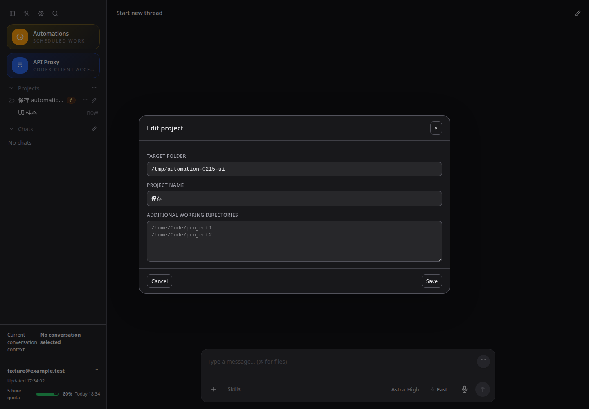
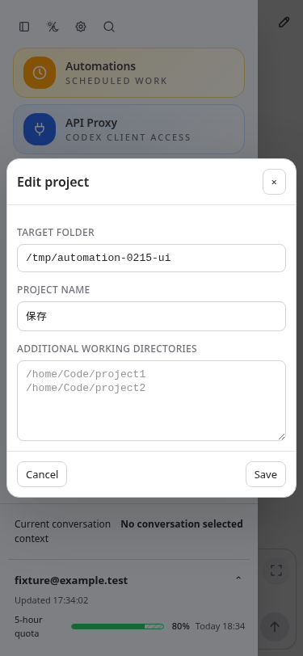
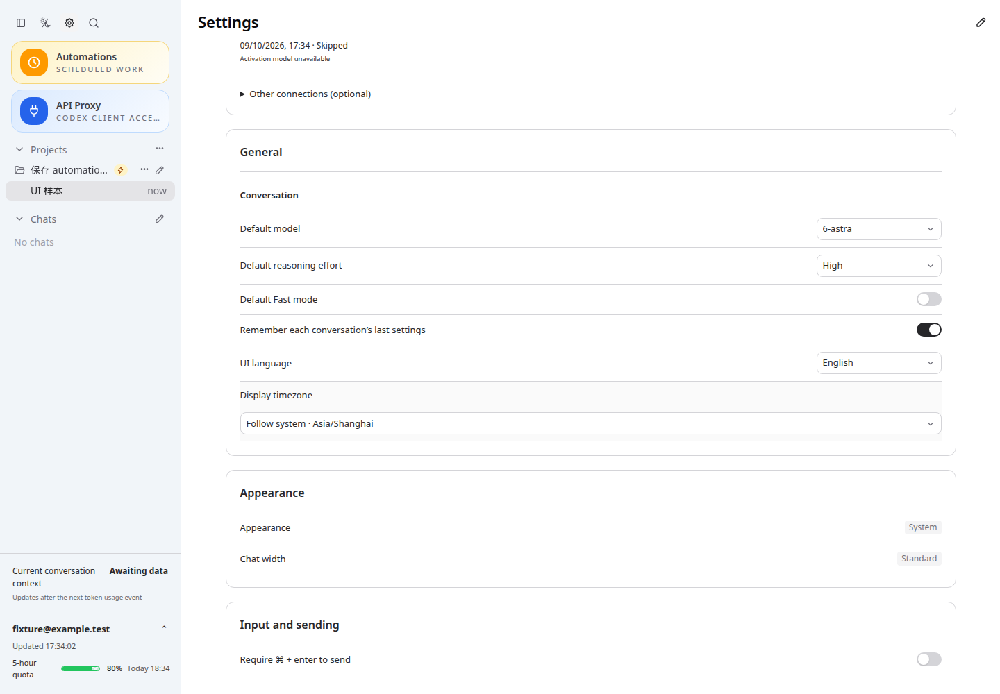

# CodexApp 0.2.16 中英文界面补全与验收

本轮为原本仅有中文的界面补充英文，保留版本 0.2.16，已部署并在 http://192.168.50.46:59001/ 开发候选验证。项目编辑字段为“附加工作目录”，占位符两行为 `/home/Code/project1`、`/home/Code/project2`；实际值为空。项目右键入口为“编辑项目”/“Edit project”。

## 实现

- 沿用 `useUiLanguage`，新增 1,160 条中文源文案对应英文，覆盖账号与通知、API Proxy、自动化、项目、Goal、任务与进程、模型推理强度、发送队列、扩展目录、错误和空状态。
- 既有英文 key→中文词典继续使用；中文源文案在渲染位置翻译。动态错误使用预编译、按前缀分组的模板匹配，保留路径、ID、数值及其他插值，不改服务器状态协议。
- 下拉选项、标题、状态和错误随语言即时更新；日期与相对日期按界面语言显示，时区偏好不变。启动恢复面板独立读取相同偏好。
- 斜杠命令支持英文描述搜索，也保留中文搜索；自定义技能/提示词描述不送入翻译词典。
- 用户项目名、线程名、聊天正文、终端输出、插件描述、保存的提示词和通知模板保持原文。生成给模型的 `/init` 指令、AGENTS.md 工作目录说明、自动化时间参考文字和内部日志不属于界面文案，不随界面语言改写。

提交：`3c749ff` 占位符、`302fe0f` 翻译基础与日期、`8de98cd` 界面接入、`06a7c64` 动态回退、`21a084a` 命令搜索与自定义内容边界。

术语已向用户集中询问，尚未收到回复，暂按建议统一：API 出口→API Proxy，持续目标→Goal，主额度→Primary quota（周/月窗口），受保护任务→Protected task，额度恢复后继续→Resume when quota recovers。用户后续调整只需更新对应词典。

## 验证

- `pnpm run build` 通过；Vue 类型检查、前端及 CLI 构建通过。
- `pnpm exec vitest run src/components/content/composerCommands.test.ts src/i18n/translateSource.test.ts src/quotaPresentation.test.ts src/dateTime.test.ts`：4 文件、30 项通过。检查即时切换、模板插值完整、未知内容不变、对象原型键安全、时区/DST 与英文搜索。
- CJS：`node -e "process.argv=['node','codexapp','--help'];require('./dist-cli/index.js')"` 正常输出 CLI 帮助。
- 4173 为当前工作目录 Vite。Playwright 请求拦截使用虚构账号/项目/接口，检查设置、账号设置弹窗、API 代理、自动化、项目编辑、英文命令搜索；英文界面扫描仅排除已知用户内容。刷新后语言保留，再切回中文成功。
- 尺寸/主题：1440×1000 浅色、1440×1000 深色、375×812 浅色、768×1024 深色；无 pageerror。项目名“保存”在英文界面仍为“保存”；示例路径正确、文本框为空。截图已人工查看，无主题错配或项目弹窗溢出。最终 59001 包重跑同样四组检查通过，包含 `/discuss` 搜索 `/plan`。
- 使用 Playwright 是因为需要存储偏好控制及请求拦截，当前没有可调用的 Browser Use。模拟界面检查不声称真实账号、通知投递、模型回复或额度重置已执行。
- 打包隔离认证检查：59091 无认证→Zen、59092 伪造无效认证、59093 损坏认证→Zen、59094 Zen→OpenRouter。无效认证真实返回错误，刷新后仍显示；浅色/深色重复实时 overlay 均为 0。全部凭据为测试值，没有使用真实重置机会。认证测试使用首轮翻译打包镜像；其后仅问答/Goal 提示和命令描述搜索补漏，未改认证实现。

报告：[UI](assets/0.2.16-i18n/acceptance.json)、[认证矩阵](assets/0.2.16-i18n/auth-matrix.json)、[无效认证刷新](assets/0.2.16-i18n/auth-ui.json)、[供应方 UI](assets/0.2.16-i18n/auth-other-ui.json)。临时完整脚本与日志在 `output/0216-i18n/`，截图在 `output/playwright/0216-i18n-*.png`。

## 性能

首屏 profiler 使用当前 4173 的真实 API，等待 7 秒：线程列表首屏 1 次、skills/list 1 次、额度读取 1 次、模型目录 1 次；总 API 响应 14.6 KB，warnings 为空。最慢模型目录约 957 ms、供应方状态约 868 ms，属于已有请求；无翻译网络调用。

构建主 JS：从 684,149 字节 / gzip 220,433 字节增加到 768,451 / gzip 247,273，gzip 增加 26,840 字节。完整词典随入口加载；精确翻译是字典查找，动态模板启动时预编译，按首字符分组匹配。没有 DOM 扫描、文件系统查询、请求扇出或额外轮询；Intl 格式器沿用最多 32 项缓存，键包含语言与时区。此次没有逐项测量每个极端错误长度或每个惰性面板的运行时间。

## 截图

测试 URL：`http://127.0.0.1:4173/`、`http://127.0.0.1:59001/` 及各自 `/#/settings`；下列截图来自最终 59001 候选。

## 最终核对

- 容器镜像：`sha256:09771c1a1a56e28db6804f724e5c533c26062e96b764f86e2dc37a730821c967`，版本 0.2.16。
- 本地与容器 `dist`/`dist-cli` 的 27 个文件 SHA-256 全部一致；容器 CJS 加载输出 CLI 帮助成功。
- 59001 的主入口脚本故障拦截测试：英文和中文恢复面板均通过。
- 更新前 idle gate 的活动回合、投递队列、审批、API 请求/连接和后台任务均为 0。
- 生产 `codexapp.service` 为 active，PID 仍为 1567483。四个隔离认证测试容器均已停止。
- 没有执行生产 prepare/activate、真实额度重置或真实通知投递。

## 部署与回退

仅更新 `codexapp-multi-account-dev` 的 59001；使用独立 `codexapp-multi-account-dev-home:/codex-home`，不共用生产 `/root/.codex`。启动脚本先构建/打包，再排空并通过 idle gate，才替换候选。生产 5900 的 `codexapp.service` 不停止、不重启；5173 不动，4173 留作当前工作区验证。

首轮通过 npm 安装本版本包完成认证矩阵。最后的 UI 补漏使用已验证依赖镜像 `codexapp-0216-i18n-verified-deps:local`，从最新 tarball 更新 `dist`/`dist-cli` 与包文件；构建中强制检查 dependencies/optionalDependencies 完全一致，并检查 node-pty 导出。重复 npm 安装因网络等待取消；候选替换始终经过 idle gate。

需要回退时保留 CODEX_HOME 卷和项目文件，按同一 idle gate 流程恢复旧候选镜像。不要删除账号、会话或项目 AGENTS.md。翻译不修改业务数据；恢复语言只需在设置选择原语言。
