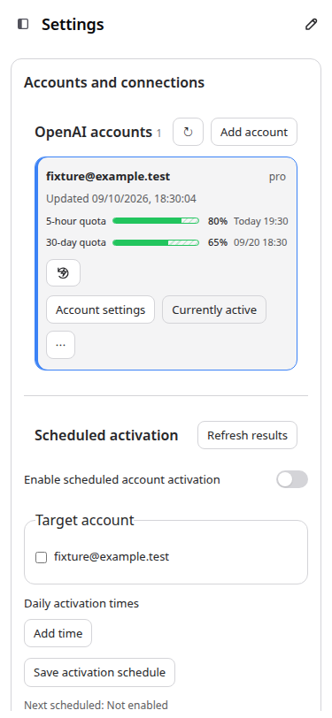
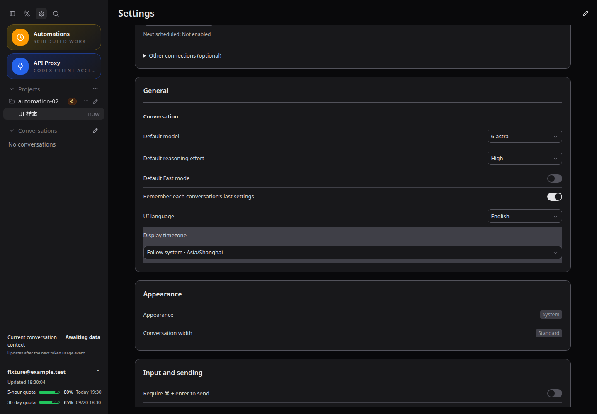
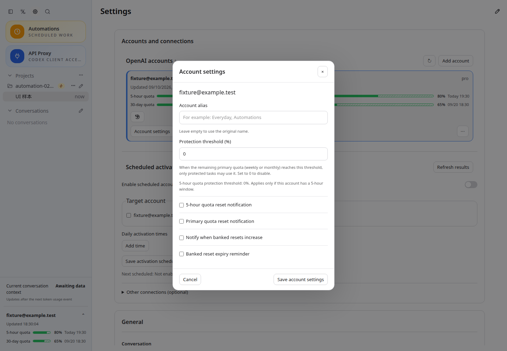

# CodexApp 中英文术语约定

用于当前界面及后续开发。用户明确指定的术语优先；其他术语参考 Codex 官方英文定义，使用本文统一的中文译法。官方资料并非完整的简体中文界面词典，因此不将本项目选定的每项中文译名声称为官方原文。

## 对照表

| 中文 | 英文 | 使用范围 |
| --- | --- | --- |
| 会话 | conversation | 用户的一次完整聊天过程；列表、标题、搜索、归档、自动化目标等统一用此词，不再交替使用聊天、对话、线程。 |
| 线程 | thread | Codex app-server 内部技术对象、线程 ID、协议说明；`threadId`、`thread/*`、URL/存储字段保留。 |
| 回合 | turn | 一次输入及随后的执行和回复，不用会话指代单个回合。 |
| 消息 | message | 用户或助手的一条消息。 |
| 额度 | quota | 可用使用额度；不混用配额、限额和 credits。 |
| 额度重置 | quota reset | 额度相关不再写恢复 / recovery；操作为 reset，时间为 reset time。 |
| 额度重置后继续 | Resume when quota resets | 等待额度后继续执行的界面功能名称。 |
| 主额度 | primary quota | 本项目周/月额度窗口，不宣称对应官方 primary 字段的固定时长。 |
| 重置机会 | banked reset | 官方保存的一次性重置机会，与购买点数区分。 |
| 点数 | credits | 原始 credits 余额；不把额度或重置机会称为 credits。 |
| 推理强度 | reasoning effort | 模型推理设置；不再写思考强度。 |
| 无 / 最低 / 低 / 中 / 高 / 极高 | None / Minimal / Low / Medium / High / Extra high | 常见推理强度显示名；协议仍为 none/minimal/low/medium/high/xhigh；运行时额外提供的 max/ultra 等值不改写。 |
| 上下文 | context | 会话上下文。 |
| 上下文压缩 | context compaction | 压缩历史以继续工作；不混同归档、删除或撤回。 |
| 工作目录 | working directory | 当前目录，协议为 cwd。 |
| 工作树 | worktree | Git 工作树及对应运行模式，命令 `git worktree` 保留。 |
| 会话分支 | conversation fork | 从会话历史派生的新会话；Git branch 仍为 Git 分支。 |
| 计划模式 | Plan mode | 先计划的交互模式。 |
| 默认模式 | Default mode | 对应当前默认执行模式。 |
| 目标 | goal | Goal 功能不再混用“持续目标”和“目标”。 |
| 任务 / 子任务 | task / subtask | 应用任务及任务导航，不等同于内部线程。 |
| 技能 / 插件 | skill / plugin | 沿用官方功能名。 |
| 提供方 | provider | 提供模型服务的一方；不混用供应方、服务商。 |
| API 代理 | API Proxy | CodexApp 自有代理功能，不宣称为 Codex 官方功能。 |
| 受保护任务 | protected task | CodexApp 自有额度预留策略名称，不宣称为 Codex 官方功能。 |

“恢复凭据 / credential recovery”“恢复默认设置 / restore defaults”“恢复子任务 / resume subtask”保持各自语义，禁止把所有 recovery/restore/resume 全局替换为 reset。官方 HTTP/API `rate limit` 作为协议概念可保留；用户额度控件统一用 quota。

## 官方依据

核对日期：2026-09-10。官方 [Glossary](https://learn.chatgpt.com/docs/glossary) 明确区分内部 Thread 与单次 Turn，并定义 Reasoning effort、Compaction、Git worktree、Task 等；[App Server](https://learn.chatgpt.com/docs/app-server) 使用 thread/turn/item 协议模型；[Pricing](https://learn.chatgpt.com/docs/pricing) 使用 banked rate-limit reset、reset times 与 credits。官方用户界面也使用 chat，本项目按用户要求统一为“会话 / conversation”。

## 实现约束

- 术语应用于界面词典模板，先规范再插入变量。不得对最终文本做全局替换，避免改变项目名、路径、会话标题或模型输出中的相同词。
- 原有英文/中文消息 key 保留兼容别名；新代码优先使用本表词汇。服务器 JSON 字段、API 路径、数据库和 localStorage key 不因界面命名而迁移。
- 新建的默认额度通知使用“已重置”。已保存的用户通知模板、历史消息及提示词保持原文，不因切换语言而修改。
- 新术语先查官方定义；本项目独有功能明确标明本地约定，不能借“官方标准”更改现有行为。

## 本次验收

- 已部署 `http://127.0.0.1:59001/`，版本 0.2.16；镜像 `sha256:e4a7297a55d95c623bed9cd18a19da2cb2f49a23b9809546d9e2b98109d8a39e`。独立 `/codex-home` 卷为 `codexapp-multi-account-dev-home`，替换前空闲检查通过；5900 生产进程 PID 1567483 未改变。
- `pnpm exec vitest run src/i18n/translateSource.test.ts src/components/content/composerCommands.test.ts src/quotaPresentation.test.ts src/dateTime.test.ts src/server/accountNotificationService.test.ts`：5 个文件、53 项通过；覆盖术语别名、模板变量原文、内部 thread 协议及非额度恢复语义。
- `pnpm run build` 通过；安装产物运行 `node -e "process.argv=['node','codexapp','--help'];require('/usr/local/lib/node_modules/codexapp/dist-cli/index.js')"` 成功显示 CLI 帮助；本地与候选的 27 个 dist/dist-cli 文件 SHA-256 一致。
- Playwright 在 59001 使用请求拦截样本及语言存储控制，因此采用 Playwright；当前无可调用的 Browser Use。1440×1000 深/浅、375×812 浅色、768×1024 深色均通过。检查中英文额度重置通知、默认通知模板、推理强度、会话菜单、重置机会，以及语言切换后刷新保持；浏览器错误为零。未使用真实重置机会或发送通知。
- 账号卡片保留完整 `30-day quota` 文本：标签列由固定 5.7em 改为 max-content 并禁止换行，进度条按剩余宽度缩短。对 30 天额度样本断言单行、标签不覆盖进度条、额度行不溢出；手机实际账号卡片截图见下。
- 性能：词典与模板索引仅模块初始化时构建，静态词条常数时间查找，不增加请求或文件操作；CSS 布局不引入监听器。最终真实 4173 首页性能复测 API 14.6KB，thread/list、skills/list、额度读取各 1 次，无 warnings，与修改前一致。中途一次开发服采样出现重复初始化告警，稳定后复测通过；未把中途结果当作最终验收。未进行长时运行或模型生成压力测试。

证据：[UI 断言](assets/0.2.16-terms/ui.json)、[单元测试](assets/0.2.16-terms/unit.log)、[产物校验](assets/0.2.16-terms/artifacts.json)、[性能摘要](assets/0.2.16-terms/performance.json)。截图源位于 `/home/Code/codexapp/output/playwright/0216-terms-*.png`，下列图片对应 URL `http://127.0.0.1:59001/#/settings`。

