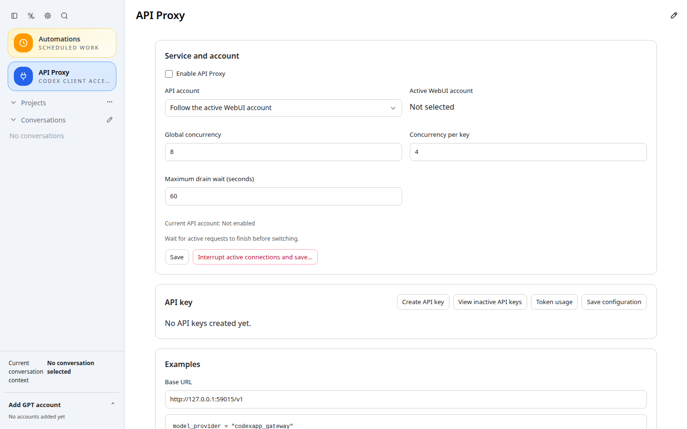

# CodexApp 0.2.16 发布准备与切换交接

## 当前结果

用户授权 prepare 和切换前准备，未授权本次激活。prepare 已完成，尚未切换生产。

- 精确发布目录：`/home/docker/codexapp-releases/codexapp-0.2.16-65733869c5e5-20260910-184328`
- 包版本：0.2.16；源码提交：`65733869c5e5`。后续本文档提交不改变打包程序内容。
- 压缩包保存在上述目录内 `codexapp-0.2.16.tgz`，SHA-256：`6917a6726447c84210106be6092dca55afc6a9861bc70e992fbc5b8126d153b3`。
- 生产仍为 0.2.15：`/home/docker/codexapp-releases/codexapp-0.2.15-42e3babae331-20260910-124935`，`codexapp.service` 为 active/running，PID 1567483 未变；5900 与 `/root/.codex` 未被候选复用。
- 59001 候选使用独立 `codexapp-multi-account-dev-home`。未迁移其认证、账号、历史或会话到生产。

## 验证证据

- `bash scripts/codexapp-release-switch.sh prepare` 完成构建、打包、发布目录依赖安装和 CLI 检查。npm 报告 node-pty 安装脚本尚未列入 allowScripts，但真实 PTY 验证通过，无需修改全局安装策略。
- 发布目录 dist/dist-cli 27 个文件与本地验收产物一致，CLI 与 59001 候选相同；候选完整产物此前已校验一致。
- CJS：`PREPARED_RELEASE=<上述精确目录> node -e "process.argv=['node','codexapp','--help'];require(process.env.PREPARED_RELEASE+'/dist-cli/index.js')"` 成功。
- 原生终端：从发布目录加载 `node-pty`，运行 `/bin/sh -c 'printf PREPARED_PTY_OK'`，输出标记且退出码为 0。
- 发布目录在独立 CODEX_HOME 和端口 59015 启动，实际 HTTP HTML 为 no-store、无 ETag/Last-Modified，条件请求返回 200；哈希资源 immutable，旧资源路径 404，不返回 SPA HTML；无 API key 请求为 401。
- 使用 Playwright 检查真实发布程序刷新和浏览器资源缓存，无请求拦截；加载 API 代理页面后刷新通过，捕获 JS/CSS 磁盘缓存命中，页面错误为零。该流程需要 CDP 缓存事件，当前无可调用 Browser Use。未执行真实模型请求或额度重置。
- `pnpm exec vitest run src/cli/codexappReleaseSwitch.test.ts src/server/releaseAuthPreservation.test.ts`：2 个文件、4 项通过。
- 59015 临时服务器已退出、端口释放。4173 开发服务原 PID 2079864 已按用户后续授权清理，端口释放；5173 未触碰。
- 本次仅发布准备与文档，没有新增应用行为；真实缓存复用已测，不重复进行 UI 开发阶段性能采样。

证据：[发布产物](assets/0.2.16-prepare/prepare-verification.json)、[HTTP/缓存](assets/0.2.16-prepare/cache.json)、[发布脚本测试](assets/0.2.16-prepare/switch-tests.log)、[切换前检查](assets/0.2.16-prepare/check.log)。

截图 URL：`http://127.0.0.1:59015/#/api-proxy`，1440×900；源文件 `/home/Code/codexapp/output/playwright/0216-prepare-cache-smoke.png`。



## 切换前阻塞与下一步

当前精确路径 check 返回退出码 3：`liveExecutions=1 | activeTurns=1 | queued=0 | pendingApprovals=0 | apiConnections=0 | apiActiveRequests=0 | backgroundThreads=skipped-busy | pages=2`。当前会话仍在执行，不能把 prepare 成功视为空闲许可；backgroundThreads 本轮未展开，也不能声称所有后台终端为空。

结束当前会话、关闭所有 CodexApp 标签页，确认独立 CLI 没有工作后，在独立宿主终端执行：

```bash
cd /home/Code/codexapp
release=/home/docker/codexapp-releases/codexapp-0.2.16-65733869c5e5-20260910-184328
bash scripts/codexapp-release-switch.sh check "$release"
```

只有 check 通过且用户决定开始切换后才执行：

```bash
bash scripts/codexapp-release-switch.sh activate "$release" --confirm-idle
bash scripts/codexapp-release-switch.sh status
```

激活脚本自身会重新检查空闲。若再次阻塞，按输出处理具体执行或后台终端；不要绕过门禁或按进程名称批量清理。4173 如被报告为阻塞，应先重新核对 PID/cwd，再终止该已确认开发服务器；不得停止 5173。

认证保护使用完整回滚快照，但比较范围排除运行时缓存、日志、SQLite WAL/SHM、额度查询等动态文件；真实凭据、账号身份、选择和保护配置变化仍应阻止切换。

切换后核对服务/5900、版本、账号与界面，并使用一个实际请求验证回复；这些生产切换后检查尚未执行。如确需回滚，结束所有工作后从独立终端执行 `bash scripts/codexapp-release-switch.sh rollback --confirm-idle`，不手工覆盖认证文件。

## 后台终端清理复核

用户已授权清理。通过原生 `/codex-api/process-activity/terminate` 精确停止开发服务器对应的后台终端，返回 `terminated=true`。4173 已无监听，生产 PID 1567483 未改变。重新枚举 15 个已加载线程，后台终端数为 0。

清理后精确路径 check 仍因当前会话执行而返回退出码 3：`idle-check|liveExecutions=1|activeTurns=1|queued=0|pendingApprovals=0|apiConnections=0|apiActiveRequests=0|backgroundThreads=skipped-busy|loadedThreads=0|pages=2`。该 check 在忙碌时跳过后台扫描；上述 0 来自单独的只读后台终端枚举，不能代替切换时的新鲜空闲检查。结束会话并关闭页面后，沿用上方精确目录复查及切换命令。
