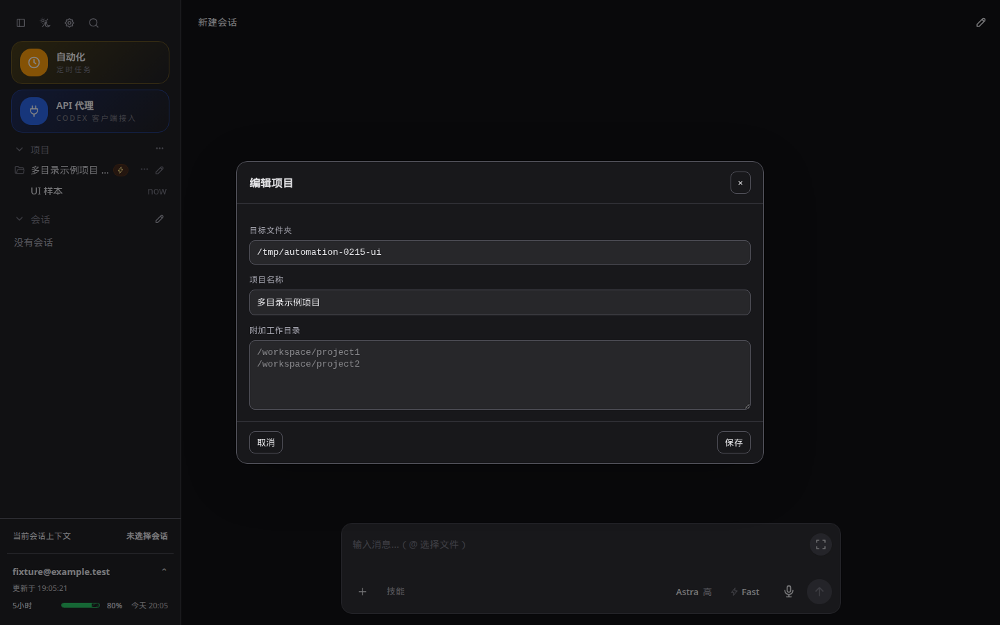
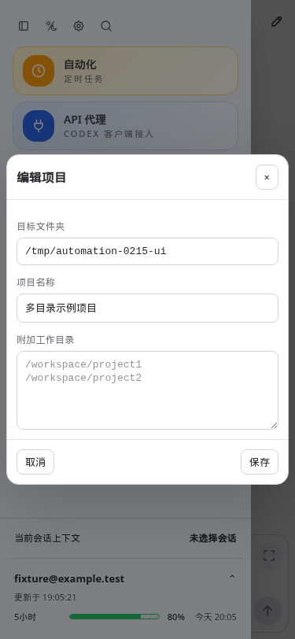

# CodexApp 0.2.16 GitHub 发布与隐私边界

## 结果

- 仓库：https://github.com/ERROR403XD/codexapp
- PR #1：https://github.com/ERROR403XD/codexapp/pull/1，GitHub 已确认 MERGED。
- 正式 Release：https://github.com/ERROR403XD/codexapp/releases/tag/v0.2.16，非草稿、非预发布。
- main/tag 提交：`c7f5b19ff504841b1413eb9b727992ebc38b0e66`。
- 公开快照提交：`e9e9a35`；从既有公开 origin/main 建立 `release/0.2.16-public`，没有推送本地 feature 开发历史。
- 公开工作树：`/tmp/codexapp-0.2.16-public`。原开发工作树保持 `feature/0.2.16-development`。

## 文档与许可

README.md 为中文，README.en.md 为英文，互相链接；覆盖来源、上游 Issue #198、功能、新增特性、安装、配置、数据、升级、开发、常见问题、贡献和许可。说明根据上游报告，问题出现在 npm 包中且代码不在 GitHub 源码；本分支以 GitHub 源码接续开发，不作全面安全保证。

THIRD_PARTY_NOTICES.md、resources/api-proxy/LICENSE 与 manifest.json 保存 CLIProxyAPI 7.2.152 来源、固定提交、MIT 原文与版权。许可证从本机已校验组件复制，与上游固定提交核对，保留原版权日期写法。发行包含声明和清单，不含代理二进制。安装文档只引导本仓库源码/Release，不引导使用 npm 同名注册包。

## 隐私发布边界

用户明确要求公开内容不含个人资料和会话。开发分支的内部 docs/plans、documentation 中的内部说明、llm-wiki、验收截图、浏览器 trace、会话 ID、环境文件、证书、账号迁移工具和本机指导规则没有进入公开快照。仅保留构建必需的 generated app-server TypeScript 类型、源码、通用脚本及重写后的公开说明。加入锁文件，公开提交采用 GitHub noreply 署名。

公开工作树与发行包扫描未发现已知私有环境标识、内网地址、私有会话标识或常见凭据格式。37 个包文件的逐项检查确认没有 auth、会话、环境配置、证书或内部截图。既有上游公开历史保留，新增远端历史只有快照与 PR 合并两条；`git branch -r --contains 3b15e84` 没有结果，证明原开发链未进入远端分支。

**后续不得直接把 feature/0.2.16-development 合并/推送到 GitHub main。** 它仍保留内部历史，包括本交接文档；以后公开发布应从公开主分支选择性导出或在公开工作树开发，再单独扫描。不要因 main 名称相同而把本地旧 main 的内部规划提交推上去。

## 验证

- 公开源码构建：`pnpm run build` 通过（Vue 类型检查、前端、CLI）。冻结锁文件校验通过。
- `pnpm run test:unit`：88 文件、614 项全部通过。修复既有 useUiLanguage 测试缺少 document stub、Worktree 旧预期，未改变应用翻译行为。
- `node -e "process.argv=['node','codexapp','--help'];require('./dist-cli/index.js')"` 输出帮助、退出 0；无库导出 API。
- `pnpm pack` 后实际 `npm install --prefix /tmp/codexapp-0216-install <tarball>` 成功。安装后的同一 CJS CLI 命令成功，node-pty 实际输出 `RELEASE_PTY_OK`、退出 0。npm 提示安装脚本尚未加入 allowScripts，但不影响本次真实 PTY 验证，不修改全局策略。
- 包内项目许可证、第三方声明、中英文 README 和 CLIProxyAPI LICENSE/manifest 存在；组件 LICENSE 与原件逐字节一致。
- GitHub main 中英文 README 经 API 下载回验，与公开工作树字节一致。main 与公开快照 tree diff 为零；tag 指向合并提交。
- Release 上传 codexapp-0.2.16.tgz 与 SHA256SUMS 后再次下载，`sha256sum -c SHA256SUMS` 为 OK，两文件与本地逐字节一致。
- tarball SHA-256：`02aa588dcaef26256fb13e7f572507c32a19eef63596d9da070cc3fc787e5b33`，大小 1,585,959 字节。

## UI 与性能

公开版只把目录示例路径改为通用 `/workspace/project1`、`/workspace/project2`，未改样式/请求。需要请求拦截提供完全合成的项目和账号，因此使用 Playwright CJS；当前无可调用 Browser Use。

已检查 4173 监听 PID/cwd 属于公开工作树，使用独立 `/tmp/codexapp-public-ui-home`。测试 URL `http://127.0.0.1:4173/`，1440×900 深色与 375×812 浅色；真实项目编辑弹窗的空输入、精确两行占位符、字段标签、无错误状态均通过，截图前等待 2.3 秒。截图已人工查看，无主题错配。截图为合成数据，仅本地/Vault 保存。

原始路径：`/home/Code/codexapp/output/playwright/0216-public-1440-dark.png`、`/home/Code/codexapp/output/playwright/0216-public-375-light.png`。

性能审计：导出调整主要为文档、打包元数据、开发默认路径、测试夹具和静态占位符，无新增业务请求、轮询、阻塞、扇出或缓存失效。入口 JS 794.79 kB / gzip 251.57 kB，CLI 871.37 kB。未重跑完整真实工作负载 profiling，未重新覆盖所有平台/供应方、通知渠道或真实额度重置。

## 运行与交接

本任务发布的是 GitHub 版本，没有执行生产 activate。原生产运行状态未作为本任务验收目标。4173 按仓库规则保留，使用公开工作树和独立 CODEX_HOME；5173 未操作。

本记录与截图仅存原本地开发分支及 Obsidian，不推送公开仓库。公开说明为远端 docs/RELEASE-0.2.16.md。本地包与下载回验在 `/tmp/codexapp-0216-release-assets`、`/tmp/codexapp-0216-release-download`，可随临时目录清理；持久发行包在 GitHub Release。
