# CodexApp 0.2.17

0.2.17 已在 `http://192.168.50.46:59001/` 运行。开发分支 `feature/0.2.17-development`，起点 `1f35011`，最新代码提交 `2ff81b7`（自动化层级与操作样式）；`8cae07a`、`538c1f9`、`8fa0d7e` 完成全页层级、两栏布局、免打扰同行与短选择器同行；`93a8cf6` 为应用单一标题；本轮还包括 `82f6298`（Logo 转换状态）、`e546caa`（Telegram 等待恢复）、`3cc258b`（免打扰时间常驻）、`1ec7229`（布局与下拉框）、`5d3b478`（Logo/标题）、`ff4cb32`（Telegram 免打扰）、`655b490`（按次激活历史）。此前提交 `a34ab56`（Telegram 开关）；其前为 `ce1ed47`（外观选择器）、`913d67c`（问题回答发送与旧记录恢复）、`4c97158`（跨卡片额度对齐）、`587d1e1`（小时限额文案）、`bf3bb0f`（布局/主题图标）、`1772e42`（新增连接）、`39278e8`（激活上下文）、`e23ceb6`（账号 UI）。容器 `codexapp-multi-account-dev` 使用独立数据卷 `codexapp-multi-account-dev-home`；开发前完整备份卷为 `codexapp-0217-before-home`。

生产 5900 未更新：仍为 0.2.16，systemd MainPID `2559244`，发布路径 `/home/docker/codexapp-releases/codexapp-0.2.16-65733869c5e5-20260910-184328/`。没有执行生产切换、发布或合并。

## 已完成

- 插件目录同时维护磁盘快照和页面缓存；启动预热，当地时间每日 02:00 内部刷新。手动刷新位于“全部插件”左侧，增加可搜索页码选择器，每页最多 60 张卡。读取合并、磁盘写入串行、最多 12 个项目范围；上游部分失败保留最近完整快照，自动失败重试有一分钟退避。
- 目标窗口删除指定说明和预算折叠说明。无单位预算按 1 token，支持 k/M/B；中文占位符为 `100、2k、30M、0.4B；留空不设预算`。用整数算法处理缩写，避免大数精度丢失。修复 Thinking 活动标签与推理强度设置混用的问题。
- 定时激活即时保存，账号和时间分栏，下方显示下次计划。按账号串行创建私有 CODEX_HOME 与空目录，显式注入固定账号凭据、发送 `hi`，等回合完成后延迟 120 秒，结束专属进程并删除全部私有数据；不使用共享登录文件，不刷新目标凭据，不更改主账号选择。去掉保存计划、刷新结果按钮。
- “自定义连接”与 OpenAI 账号平级，提供卡片、别名和统一添加/编辑窗口。提供 OpenRouter、DeepSeek、OpenCode、自定义 Base URL；支持模型目录及手动模型名。密钥单独保存，卡片及列表不返回密钥。
- 测试连接分别探测 `/v1/models`、`/v1/responses`、`/v1/chat/completions`，保存成功端点，再次测试可刷新模型和能力。卡片固定显示 models / responses / chat 三个带框状态，支持项点亮、未支持项灰暗；取消“仅 API key 出口”标记，缺少 Responses 时切换禁用，也不进入 Codex 自动化账号选项。API key 可选择它，只开放通过检测的接口；未支持的端点返回 404，不转为另一种协议。当前不开放自定义连接 compact/WebSocket。
- 支持 Responses 的自定义连接可用于对话、目标、自动化和 API key。运行进程按连接绑定，使用独立内部凭据与版本地址；真实上游密钥不进入进程参数。OpenAI 协调器的凭据选择、配额保护、出口和切换约束沿用原路径。
- 没有明确 reasoning/Fast 能力时，模型控件保留“推理强度”标题，右侧值显示 N/A，滑条灰化且不可拖动；目标、自动化及默认设置的对应选择禁用。若模型声明能力，使用其原始值；缺失能力的参数在最终出站时也会剔除。
- 侧栏左上角恢复绿色闪电“应用 / 插件 / 技能 / MCP”；集成去掉重复入口。POST 与 Telegram 平级，精简说明，POST 保存/测试位于免打扰上方；Telegram 两个文本框、两个按钮，授权 ID 占位符第三行为 `*`。调整各处布尔控件为 toggle switch，中英文同步。

开发过程中修复了原生自定义会话测试发现的热重载问题：保留的执行桥与新中间件曾持有不同连接存储。现在按 CODEX_HOME 共享存储身份，并更新执行桥版本；新增模块重载回归测试。

## 验证与证据

### 自动与原生运行

相关回归共 **24 个文件、200 个用例通过**，覆盖账户协调、固定凭据执行、账号保护、激活、API 出口、端点检测、缓存、目标预算及模型能力。类型检查与生产构建通过。

```bash
pnpm exec vitest run src/server/account*.test.ts src/server/apiProxy/*.test.ts src/server/*Proxy.test.ts src/api/threadCommands.test.ts src/api/modelCatalog.test.ts src/api/codexGateway.test.ts src/modelCapabilities.test.ts src/i18n/translateSource.test.ts src/server/directoryPluginCache.test.ts src/server/customConnectionStore.test.ts
pnpm exec vue-tsc --noEmit
pnpm run build
node output/0217/ui.cjs
node output/0217/api-ui.cjs
node output/0217/native-activation.cjs
node output/0217/native-custom.cjs
node output/0217/artifacts.cjs
```

- 激活使用真实 Codex CLI `0.153.4`，账号是测试凭据，数据面连接本地 SSE 样本提供方；验证实际回合完成、固定账号身份、凭据及主选择文件不变、进程退出、目录删除。测试把清理等待缩短为 100 ms；生产默认仍为 120000 ms。没有用真实账号向云端激活，也没有消耗真实重置机会。
- 自定义连接分别通过 4173 开发服务、59095 安装包容器的原生 Codex 对话：真实 HTTP → 独立工作进程 → 本地 Responses SSE → 完成回复；刷新后回复保留，N/A/Fast 状态正确，未支持参数未到达上游，主认证文件不变。
- 59091 无认证、59092 无效认证、59093 损坏认证、59094 Zen → OpenRouter 切换容器通过。无效认证错误在刷新后保留；明暗主题重复 live overlay 数为 0。它们均使用测试数据卷。
- API key 的双连接并发测试验证凭据不串用、用量分别累计、未支持端点不产生上游请求、不会调用 OpenAI 凭据准备。浏览器另验证 Chat-only 可用于 key，且不出现账号保护控件。
- 未发送真实 POST 或 Telegram 测试通知；模型供应商及真实通知收件人的可用性不在样本验收结论内。

CJS smoke（本机及已安装包）均返回帮助、退出码 0：

```bash
node -e "process.argv=['node','codexapp','--help'];require('./dist-cli/index.js')"
docker exec codexapp-multi-account-dev node -e "process.argv=['node','codexapp','--help'];require('/usr/local/lib/node_modules/codexapp/dist-cli/index.js')"
```

包内 node-pty 实际创建 PTY 并输出 `PACKAGED_PTY_0217_OK`；不是仅检查导出。最终安装目录的 **27 个 dist/dist-cli 文件**与工作区逐文件 SHA-256 一致。

### 性能审阅

- 59001 实际目录为 3619 个插件、原始目录 JSON 8,125,934 字节。三次服务器缓存读取分别为 123.2 / 79.3 / 72.5 ms（本机环回）。浏览器离开再进入插件页产生 **0 次新增目录请求**，翻页只切换最多 60 张卡；手动刷新才增加 1 次请求。原始目录仍整表传输，没有测量慢速外网传输时间。
- 125 插件样本验证三页、末页 5 项，单次手动刷新与页面缓存命中；磁盘重启恢复、部分失败保留及 12 范围并发写入边界由回归测试覆盖。
- 原生自定义会话页面 profiler：API 总量 **16.4 KB**，thread/list 1、thread/resume 1、重复 thread/read 0、provider models 1，`warnings=[]`，没有停留在 Loading threads。
- 端点检测至多一次模型请求加两个并行生成探测；保存使用短期检测凭据，不重复探测。最多 32 个连接、2000 个模型、32 个短期检测结果，网络有超时与断开取消。
- 激活按账号串行，每 2 秒读一次本次回合状态，默认每 10 秒检查调度；刷新计划合并为一次保存。没有无界账号扇出，也没有全局登录切换。

性能命令与原始文件位于 `/home/Code/codexapp/output/0217/`：`regression.log`、`ui.json`、`api-ui.json`、`native-activation.json`、`native-custom.json`、`native-custom-packaged.json`、`auth-*.json`、`plugin-cache-perf.json`、`profile.log`、`artifacts.json`。Profiler JSON/trace 位于 `/home/Code/codexapp/output/playwright/browser-runtime-profile-thread-01a08b64-81f6-74e3-8a3e-a83405804d37-2026-09-10T12-57-04-917Z*`。

```bash
PROFILE_BASE_URL=http://127.0.0.1:4173 PROFILE_ROUTE='#/thread/01a08b64-81f6-74e3-8a3e-a83405804d37' PROFILE_BROWSER_EXECUTABLE=/snap/bin/chromium PROFILE_WAIT_MS=7000 pnpm run profile:browser
```

### 页面截图

当前没有 Browser Use；使用 Playwright CJS 执行网络拦截、多账号样本、语言及主题控制。设置 URL 为 `http://127.0.0.1:4173/#/settings`，目标为 `/#/` 的 `/goal` 窗口，自动化为 `/#/automations`，API key 为 `/#/api-proxy`。完成中英文、明暗主题、1440×1000、375×812、768×1024 检查；截图前等待至少 2.3 秒。所有检查无页面横向溢出和原生 checkbox。

截图原始绝对目录 `/home/Code/codexapp/output/playwright/`；例如 `/home/Code/codexapp/output/playwright/0217-custom-na-1440.png`、`/home/Code/codexapp/output/playwright/0217-native-custom-packaged-dark.png`。下列图与项目/Vault 内 `assets/0.2.17/` 副本一致。

POST/Telegram：1440×1000，中英文与明暗主题。

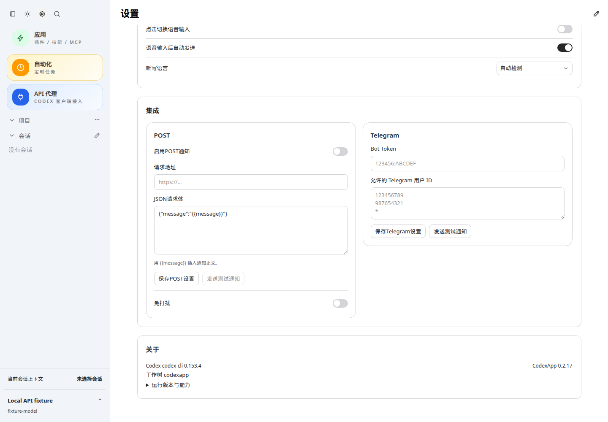
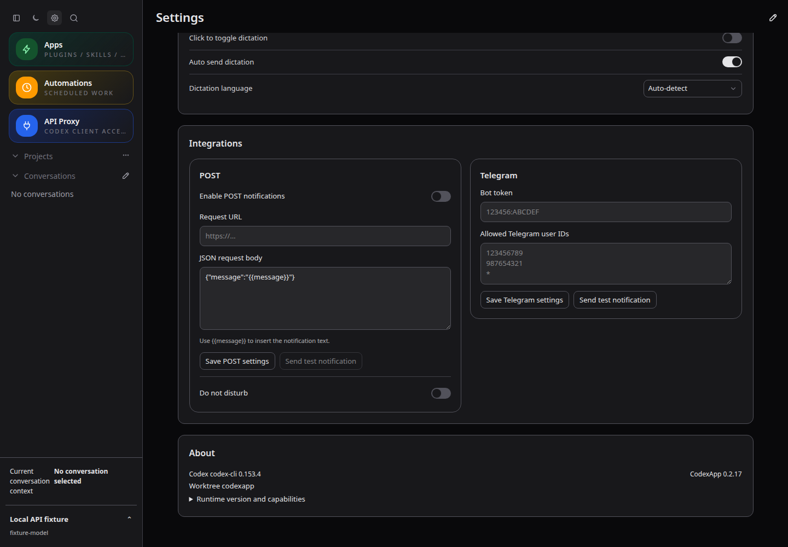

自定义连接：375×812 英文浅色、768×1024 中文深色；固定端点状态与禁用切换。

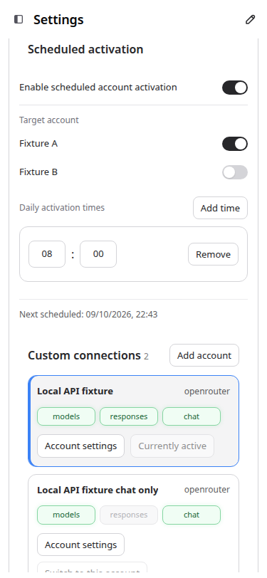
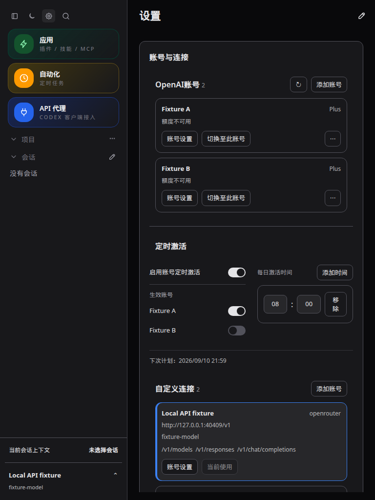

目标与自动化：1440×1000，预算和禁用能力控件。

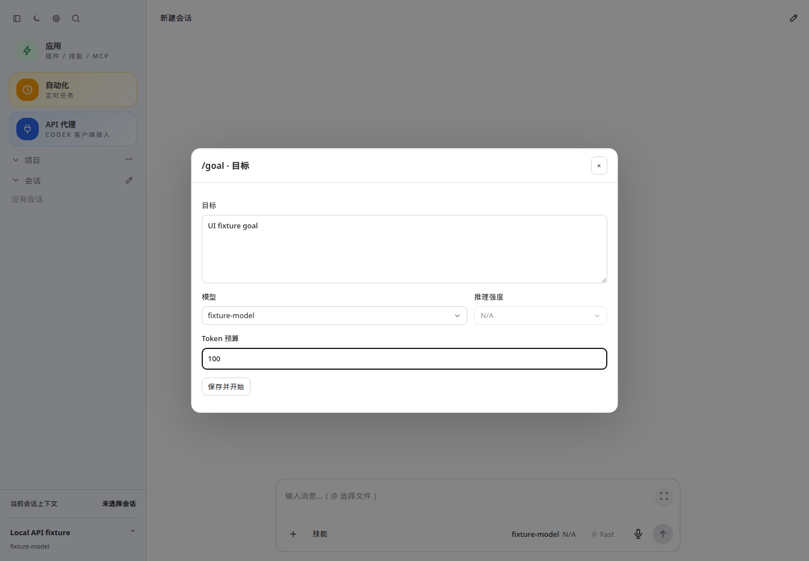
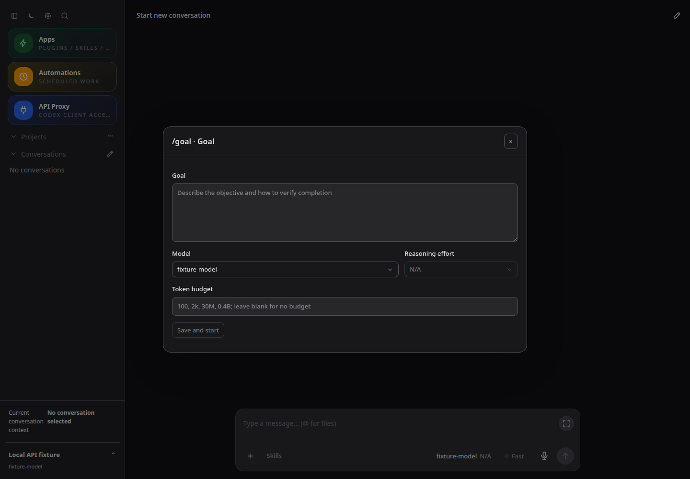
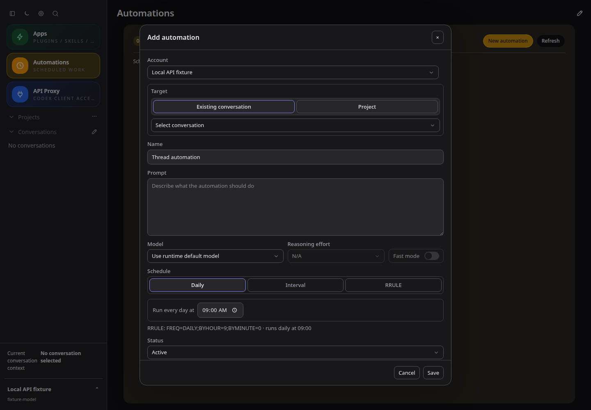
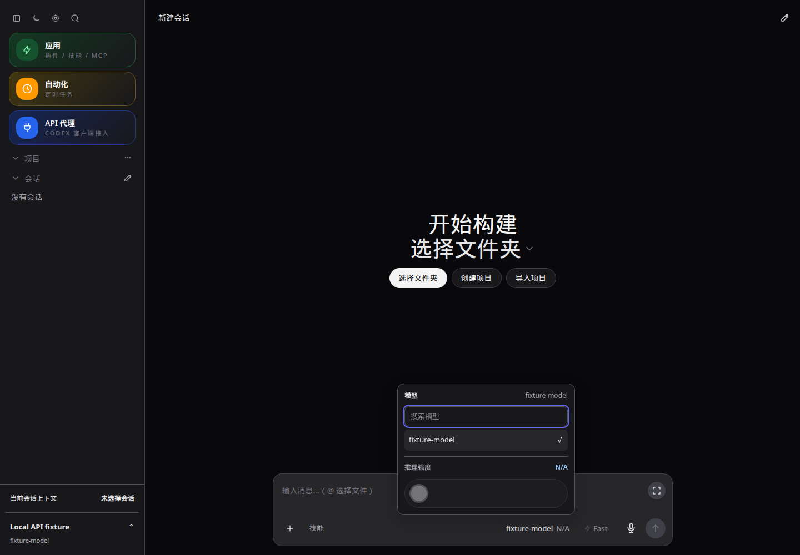
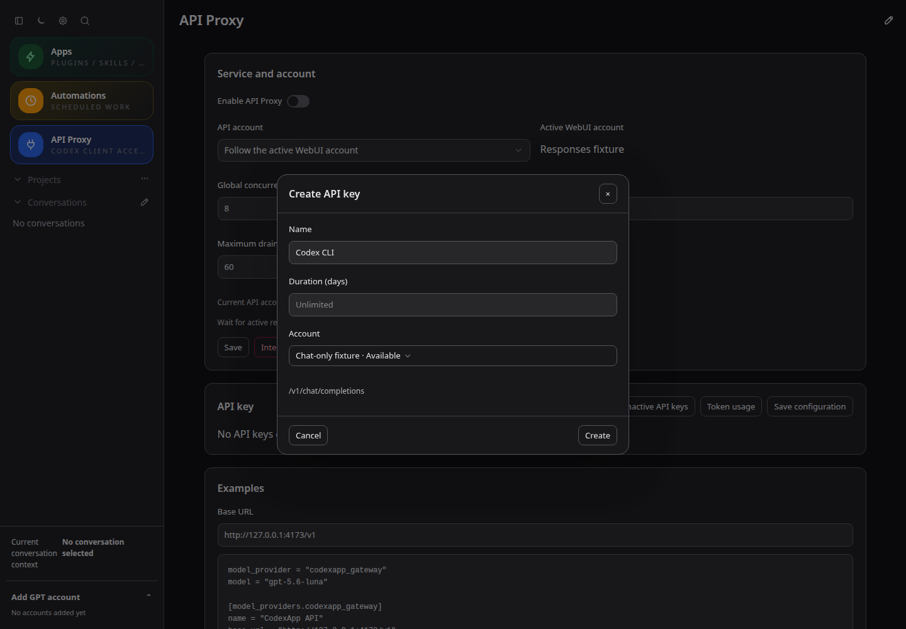

安装包原生对话：`http://127.0.0.1:59095/#/thread/`，具体会话 ID 见 `native-custom-packaged.json`；1440×1000，刷新后回复保留、重复 overlay 为 0。

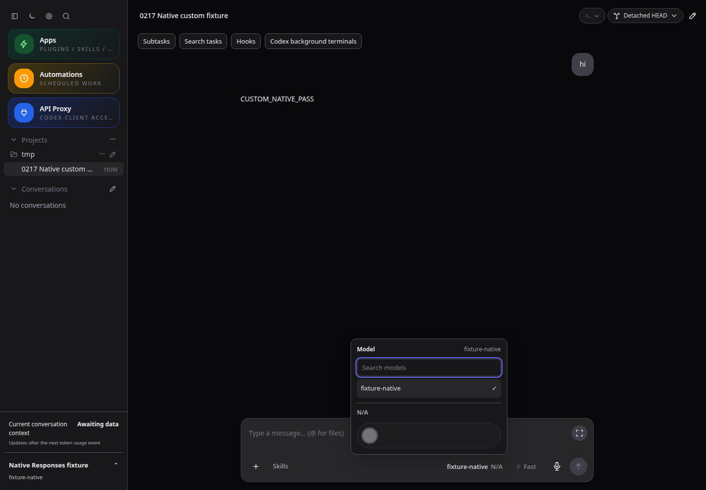

## 构建、候选与清理

Docker Hub 在最后阶段返回 429。使用本机已验证的候选基础镜像 `codexapp-0217-base:local`（来源 SHA `c93969a5edb0ab912385b8bc59af4c9a427ba9908048fbf0079d06cb79b02d14`），重新全局安装最新 tarball，保留固定 Codex 0.153.4 与原生依赖验证，没有依赖未核对的其他镜像。

```bash
CODEXAPP_REPLACE_DEV=1 CODEXAPP_MULTI_ACCOUNT_IMAGE=codexapp-multi-account-dev:ui-0.2.17 CODEXAPP_MULTI_ACCOUNT_DOCKERFILE=/home/Code/codexapp/output/0217/Dockerfile.cached bash scripts/run-multi-account-dev.sh
CODEXAPP_NATIVE_TEST_URL=http://127.0.0.1:59095 CODEXAPP_NATIVE_TEST_CONTAINER=codexapp-0217-native-custom node output/0217/native-custom.cjs
```

每次替换均通过脚本的队列/API drain 和 idle-check：liveExecutions、activeTurns、queued、pendingApprovals、API connections/requests、backgroundThreads 均为 0。最终候选镜像 SHA `0a33f9fce616a0e3bebfef0f5a4a9cca6dfe174ffa83d1787ff30173c210ea32`；包 SHA `342940e5b0c386d892060cdb7eee4ac8eb83ad249e498f277c16bcc03c4c322d`。

清理范围仅本次验收容器 59091–59095 及其专用数据卷；保留 4173 验证服务、59001 候选、5900 生产和开发前备份卷。初轮清理核对见 `output/0217/cleanup.json`，本轮四个认证样本容器复核后的清理见 `output/0217/followup-cleanup.json`。若需恢复开发前数据，应先停用并停止 59001，再由独立备份卷恢复；不得把备份写入生产 CODEX_HOME。


## 账号 UI 与激活上下文复核

本轮根据实际账号弹出区截图调整：

- OpenAI 和自定义连接移入同一个滚动容器，OpenAI 在上；固定页脚只保留版本及全局设置。三种宽度均只有一个内部纵向滚动条，两类卡片不再相互挤占固定区域。
- 自定义连接添加/编辑窗口的字段、间距和底栏一致：左侧测试连接，右侧取消/移除与确定；卡片隐藏 URL、模型名，始终显示三个端点指示块。账号设置仍能查看并编辑地址、模型。
- OpenAI 别名输入框移除示例和小字说明，保护说明精简为“保护值范围内的主额度仅限受保护任务使用”；API key 状态切换按钮统一空格和大小写，实测中文宽度一致。新增/变更文案均同步英文，补齐 Alias 与 Confirm。
- 浅色“应用”增加与其他入口一致的绿色背景/边框，深色同步；跟随系统图标使用 [Lucide SunMoon](https://lucide.dev/icons/sun-moon)，显示尺寸 16px、描边 1.7、圆角端点与相邻图标一致，颜色随主题继承。系统深浅切换实际触发页面配色变化；内联 SVG 不新增依赖或网络请求。
- 5h 窗口排在 7 天/30 天前，显示 `5小时限额` / `5h limit`；长周期使用 `7天限额` / `7-days limit`、`30天限额` / `30-days limit`。设置页和账号弹出区分别以整个 OpenAI 账号列表为共享子网格，所有卡片按最长标签、百分比和重置时间自适应列宽，保留 7px 间距，其余宽度交给进度条。跨卡片所有进度条起止位置相同，左下角默认摘要独立计算。包含 100%、Tomorrow 和长日期的混合样本中，375px 弹出区中/英文进度条为 147.2/108.3px，桌面为 188.2/149.3px；所有标签不换行、不覆盖进度条。

### 激活上下文与启动时序

实测发现空目录仍可能继承父项目 AGENTS.md；已给激活专属进程关闭项目说明读取、环境上下文、宿主技能发现及非必要工具功能，并限制技能目录预算。配置仅通过此进程的启动参数传入，不写入主运行时配置。`project_doc_max_bytes` 的含义参考 [OpenAI 官方配置文档](https://learn.chatgpt.com/docs/config-file/config-reference)。

真实 CLI 0.153.4 + 本地 Responses SSE 测试中，用户消息严格只有 `hi`，空工作目录无文件，父目录长 AGENTS.md 哨兵不出现在请求中。输入 JSON 从 19932 降至 8379 字符，减少约 58%；仍含 CLI 基础工具/权限说明，不声称零上下文，也未把模拟 usage 当作实际计费 Token。账号 B 固定凭据实际到达本地上游，账号 A 的认证与当前选择哨兵逐字节不变；专属进程退出、私有目录删除。

另发现 CLI 初次 thread/read 可暂时返回 `interrupted`，但 completedAt 和 error 均为 null；此时回合尚未挂接到活动状态。现在继续等待，只有有完成时间或错误的失败状态才结束。原生回归连续 8 轮通过，单元样本也覆盖“暂时中断 → 运行中 → 完成”。默认清理等待仍为完成后 120 秒。

```bash
CODEXAPP_NATIVE_ACTIVATION_TEST=1 pnpm exec vitest run src/server/accountActivationSession.native.test.ts src/server/accountActivationSession.test.ts src/server/accountActivationScheduler.test.ts src/i18n/translateSource.test.ts
pnpm exec vue-tsc --noEmit
node output/0217/followup-layout.cjs
node output/0217/api-ui.cjs
```

4 文件/17 用例通过。界面使用 Playwright CJS，因为需要多账号端点样本拦截和 localStorage/系统主题控制；本机没有 Browser Use 工具。测试 URL `http://127.0.0.1:4173/#/settings`（真实账号弹出区、添加和编辑窗口）；1440×1000、375×812、768×1024 均检查浅深色、中英文，并等待 2.3 秒截图。所有组合单滚动条、按钮左右排列、长限额标签不换行、系统主题切换和页面错误断言通过。

性能：本轮样本从设置页启动到连续两次展开账号区，共 3 次连接列表读取；字段排布和状态指示块不新增请求，滚动/端点状态展示为本地渲染，账号限额最多两项排序。激活仍按账号串行、每 2 秒读取本次回合，没有扩大任务扇出；上下文 JSON 大小采用实际 CLI 请求测量。

原始报告：`/home/Code/codexapp/output/0217/followup-layout.json`、`native-fixed-1.log` 至 `native-fixed-8.log`、`followup-typecheck.log`、`followup-api-ui.log`。截图绝对目录 `/home/Code/codexapp/output/playwright/`，下列文件名与归档副本一致。

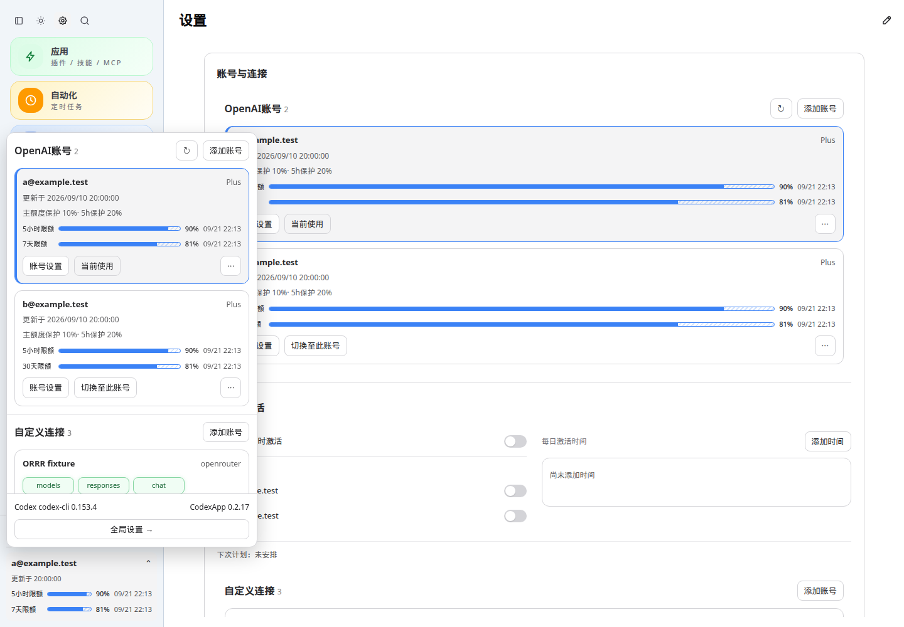
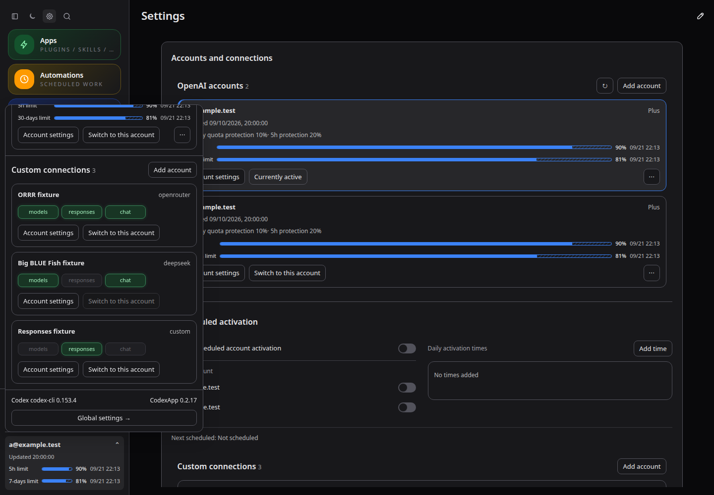
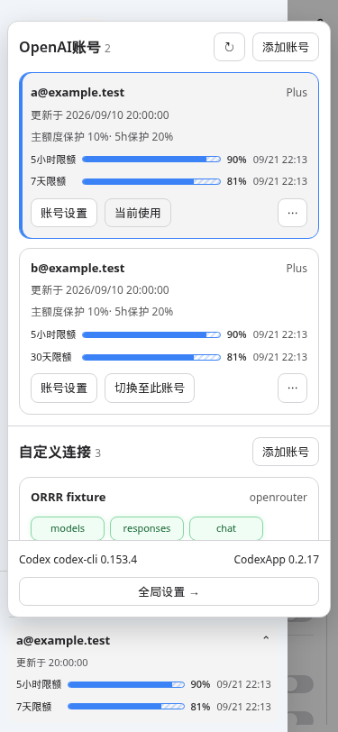
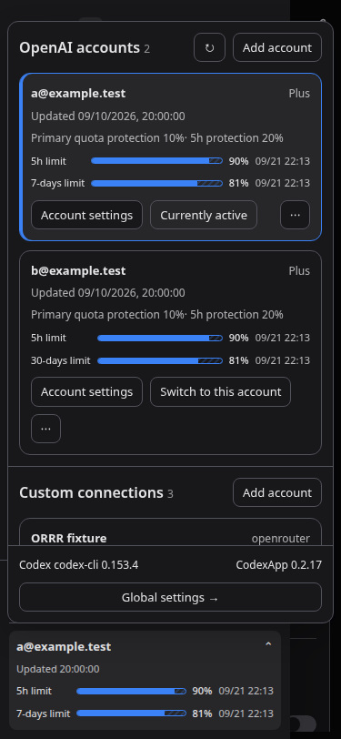
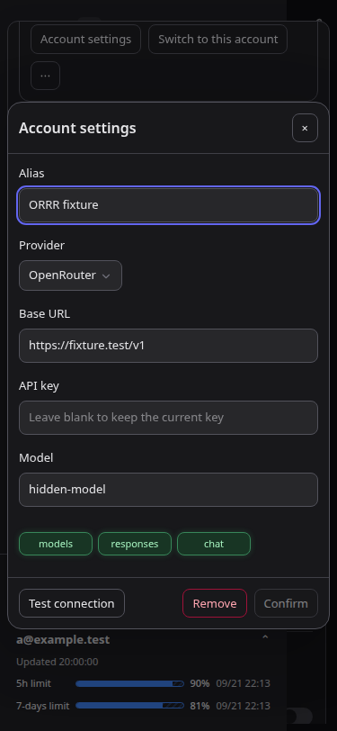
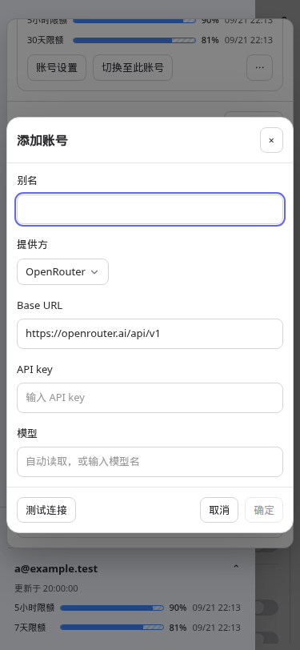


SunMoon 浅深色截图取自 `http://127.0.0.1:4173/#/settings`，1440×1000 页面中的实际侧栏控制栏；不是图标样板。


### 新增自定义连接误报切换

原因：新增配置保存曾无条件调用 `beginProviderChange()`，而该检查的 `isAccountOperationInProgress()` 同时涵盖后台额度/凭据刷新。因此，即使没有手动切换账号，检测端点成功后保存也可能被拒绝，并显示误导的“账号或供应方正在切换”。

修复仅让**新增配置**绕过提供方切换检查；已有连接的切换、编辑、移除及使用中保护保持原路径。新增仍通过配置存储自己的串行写队列，不改主账号凭据，也不自动选择新连接。真实 HTTP 中间件回归保持 OpenAI 额度刷新未结束、确认没有切换阻塞，完成三端点测试和落盘保存，再核对主凭据、OpenAI 选择、自定义选择均不变；同时确认提供方选择仍受原检查约束。

```bash
pnpm exec vitest run src/server/customConnectionAdmission.test.ts src/server/customConnectionStore.test.ts src/server/deliveryBridge.test.ts src/server/accountRuntimeIntegration.test.ts
```

4 文件/16 用例通过；新增保存不增加上游探测、不申请 OpenAI 身份变更锁，避免无关后台工作造成等待。

小时限额文案改为“5小时限额”，英文保持“5h limit”；当时翻译回归 1 文件/8 用例、类型检查和完整构建通过。该阶段部署日志 `output/0217/final-label-deploy.log`，两次追加更新均经过原有 drain/idle 检查；候选认证文件部署前后 SHA-256 一致，包内 CJS 入口和实际 PTY 均通过。

该阶段镜像再次完成 59091–59094 的无认证、无效认证、损坏认证和 Zen → OpenRouter 安装包矩阵；无效认证错误刷新后保留、浅深色重复 overlay 为 0。日志为 `final-auth-matrix.log`、`final-auth-ui.log`、`final-auth-other-ui.log`，四个临时容器和专用卷均已清理，端口监听消失。59001 只读实测 SunMoon 与系统主题联动、单滚动条、三端点状态、插件重访 0 次请求通过；当时真实账号只返回 7 天/30 天窗口，5 小时窗口使用双窗口样本验证，不主动刷新或修改真实额度。

## 追加修复与设置验收

### 跨卡片进度条对齐

`cross-card-quota.cjs` 在设置列表与展开账号区分别检查所有卡片的进度条起点/终点、百分比和重置时间列。六组组合覆盖 1440×1000、375×812、768×1024，中英文及明暗主题；混合 5 小时/7 天、5 小时/30 天、1%/100% 和长短时间。移除最长标签账号并刷新后列宽重新适配，左下角默认摘要列宽不变。

性能：仅 CSS subgrid，不增加尺寸测量、观察器或网络请求；每组从设置打开到账号展开仅 1 次账号列表 GET。原始报告 `/home/Code/codexapp/output/0217/cross-card-quota.json`，测试 URL `http://127.0.0.1:4173/#/settings`，截图绝对目录 `/home/Code/codexapp/output/playwright/`。

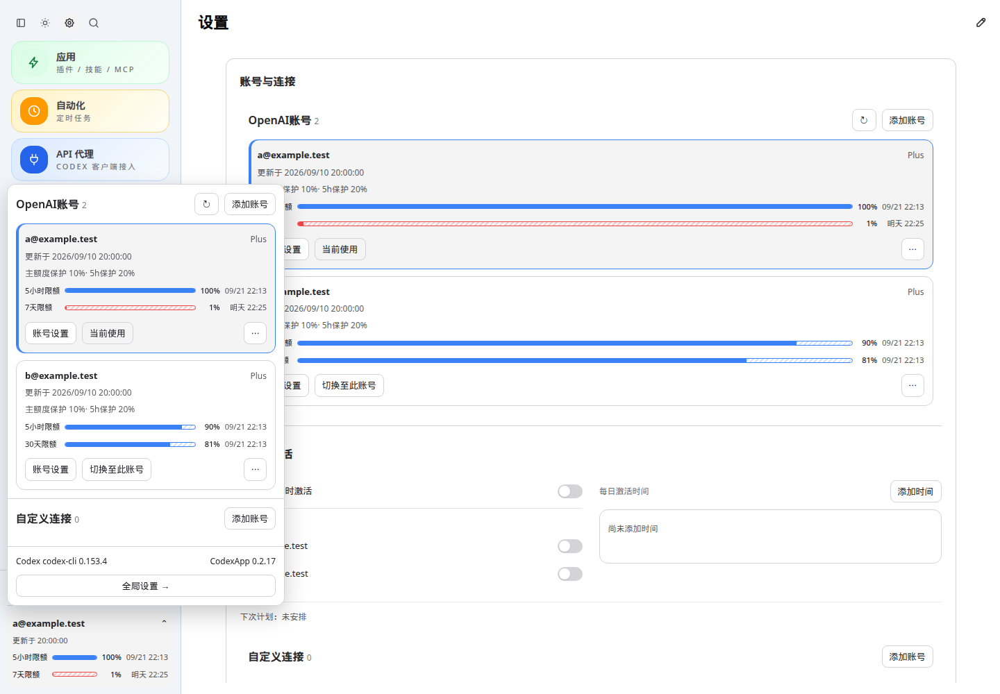
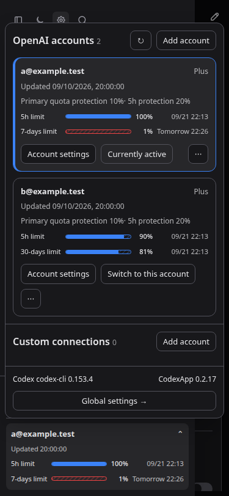

### 问题回答的无效发送 ID

原因是问题回答使用 `question:<thread>:<turn>:<ordinal>` 作为发送 ID，而可靠投递存储要求安全字符及带原始提交时间的 `d-`/`q-` ID。浏览器保留该无效 ID 后，核对和重试仍然提交同一不兼容记录，进而阻塞后续消息。

新回答现在创建标准发送 ID；已有待确认记录在刷新后保留原答案、提交时间和账号快照，核对时由服务端确定性映射为合法 ID。没有放宽存储文件名、七天时限和账号变更保护。服务器已接受但浏览器丢失响应时，再次核对返回同一原生回合，不重复发送。已有受影响用户应刷新 59001，然后在原会话点击一次“核对提交”。

```bash
pnpm exec vitest run src/server/deliveryStore.test.ts src/server/deliveryService.test.ts src/server/deliveryBridge.test.ts src/server/deliveryHistory.test.ts src/api/deliveryOutbox.test.ts src/api/codexGateway.test.ts src/userQuestions.test.ts
node output/0217/question-delivery-ui.cjs
node output/0217/auth-matrix.cjs
node output/0217/restart-invalid-question.cjs
node output/0217/auth-ui.cjs
node output/0217/auth-other-ui.cjs
```

7 文件/64 用例通过。真实问题卡片浏览器验证使用真实投递处理器和文件回执、本地 CLI 替身，覆盖 1440×1000 与 375×812 的明暗主题。每组旧回答首次丢响应、刷新核对、新问题和普通消息共 4 次投递请求、3 次原生调用；待确认清除，回答绑定标记隐藏，TestChat `hrefOk`、`titleOk`、`textOk` 均为 true。请求失败时保留内容，恢复不扩大并发、不添加后台轮询；旧 ID 仅多一次有限长度 SHA-256 计算。

此外，`913d67c` 安装包在 59092 使用真实 CLI 和虚构无效凭据接受旧问题 ID，重复提交返回同一 turn；认证失败在刷新后保留，明暗主题重复 overlay 为 0。59091/59093/59094 继续通过无认证/损坏认证回退和 Zen → OpenRouter 检查。原始日志 `question-delivery-tests.log`、`question-delivery-ui.json`、`question-auth-matrix.log`、`question-invalid-start.log`、`question-auth-ui.log`、`question-auth-other-ui.log` 位于 `/home/Code/codexapp/output/0217/`。本轮专用容器与卷已清理，见 `question-cleanup.log`。

截图 URL `http://127.0.0.1:4173/#/thread/02017000-0000-7000-8000-000000000001`，绝对路径 `/home/Code/codexapp/output/playwright/testchat-0217-question-delivery-1440-light-cjs.png` 和同目录 `testchat-0217-question-delivery-375-dark-cjs.png`。截图中目标提示来自未完整模拟的目标数据，本次断言针对实际问题回答、投递和链接。

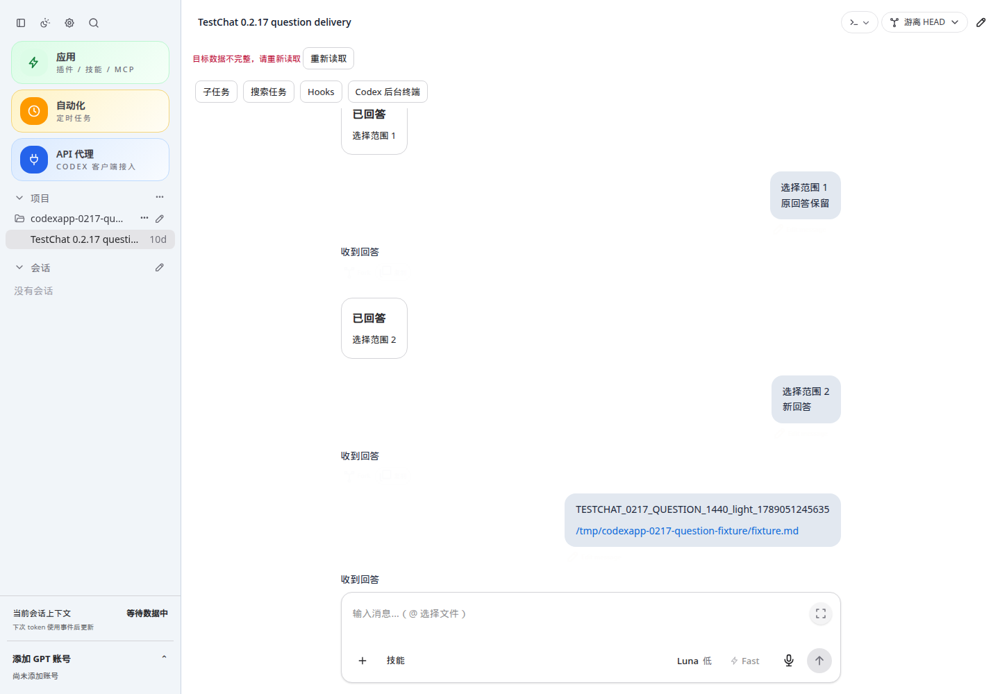
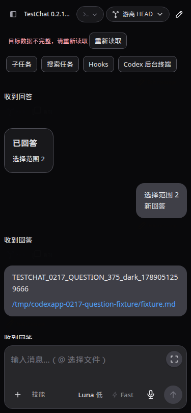

### 外观选择器与 Telegram 通知开关

外观和会话宽度改为 AppSelect，直接选择跟随系统/浅色/深色、标准/宽/超宽，取代整行循环切换。偏好即时本地保存，刷新保留；侧栏主题快捷切换继续可用。六组中英文、明暗主题、桌面/平板/手机验证全部选项、系统配色联动、45rem/72rem/96rem 会话宽度、菜单边界和刷新状态。无原生 select、无设置写请求；复用既有组件，不增加服务端调用。

Telegram 标题下增加“启用Telegram通知”/“Enable Telegram notifications”，与 POST 共用 AppSwitch 和保存方式。关闭并保存后，自动回合通知及上线提示停止，凭据、授权 ID 和会话绑定保留；显式机器人命令仍可回复。旧的已配置实例默认保持启用，无配置默认关闭。关闭时测试按钮禁用、服务端也拒绝测试请求；开启后测试先保存当前配置再发送。配置写入与聊天绑定写入共用串行队列，避免互相覆盖开关状态；旧客户端省略开关时保留已存的选择。

```bash
pnpm exec vitest run src/server/telegramThreadBridge.test.ts src/server/telegramConfig.test.ts src/server/deliveryBridge.test.ts src/api/codexGateway.test.ts
pnpm exec vitest run src/i18n/translateSource.test.ts
pnpm exec vue-tsc --noEmit
node output/0217/appearance-select-ui.cjs
node output/0217/telegram-switch-ui.cjs
```

Telegram 相关 4 文件/30 用例与翻译 1 文件/8 用例通过。单元回归还覆盖读取历史途中关闭、分段发送途中关闭、旧配置迁移和已关闭状态的服务端拒绝。外观与 Telegram 各六组 UI 检查通过，关闭/开启保存后刷新均保留，POST 状态独立、配置字段不丢失。浏览器 Telegram 请求全部拦截，没有发送真实通知。性能：关闭时自动通知路径在 `thread/read` 前直接返回，零历史请求/发送；测试一次仅 1 次配置 POST 和 1 次测试 POST，沿用既有读取，不引入轮询。

报告位于 `/home/Code/codexapp/output/0217/appearance-select-ui.json`、`telegram-switch-ui.json`、`telegram-tests.log`、`telegram-i18n.log`、`telegram-typecheck.log`。两项实际设置页 URL 均为 `http://127.0.0.1:4173/#/settings`；1440×1000、375×812、768×1024，截图前等待 2.3 秒，绝对目录 `/home/Code/codexapp/output/playwright/`，以下文件名与原图一致。

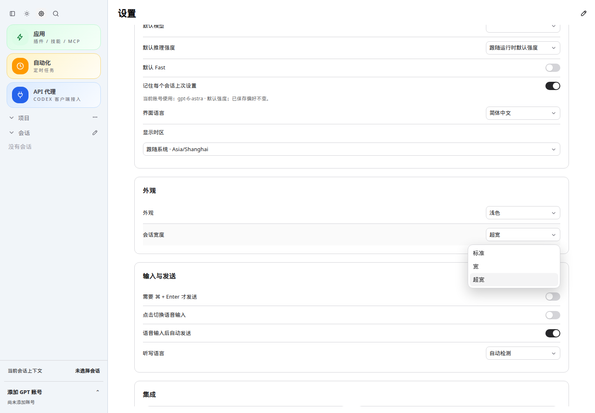
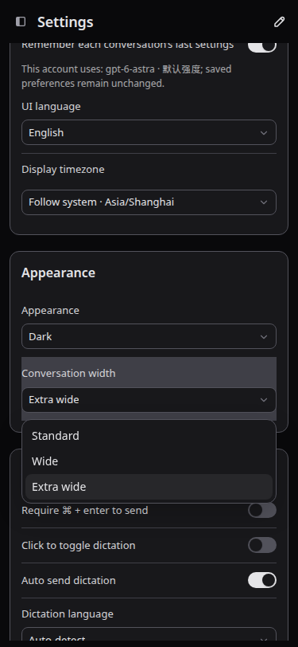
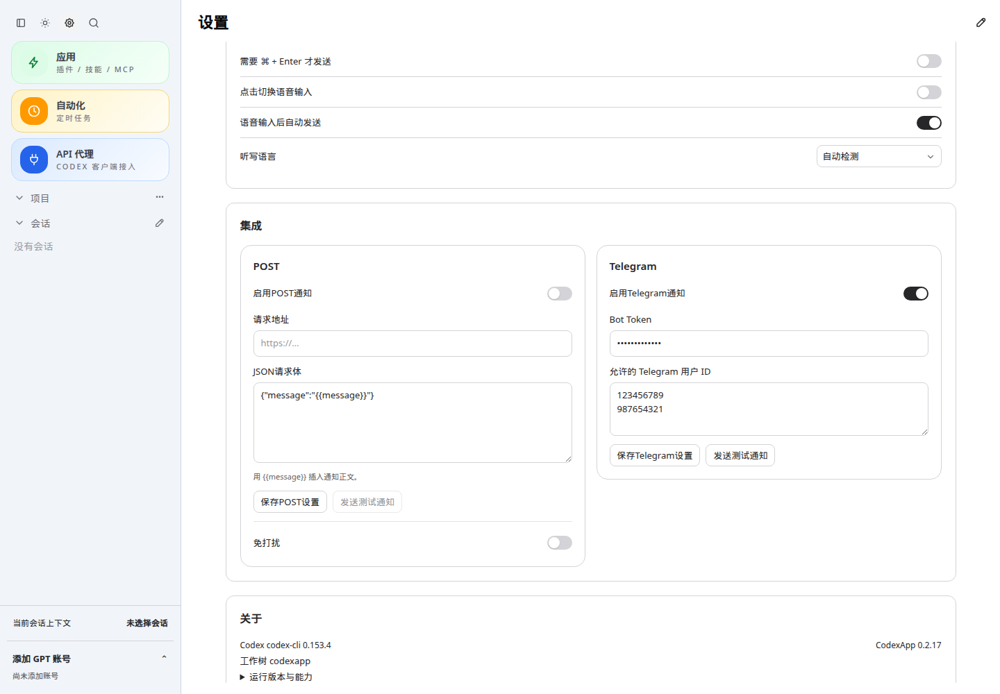
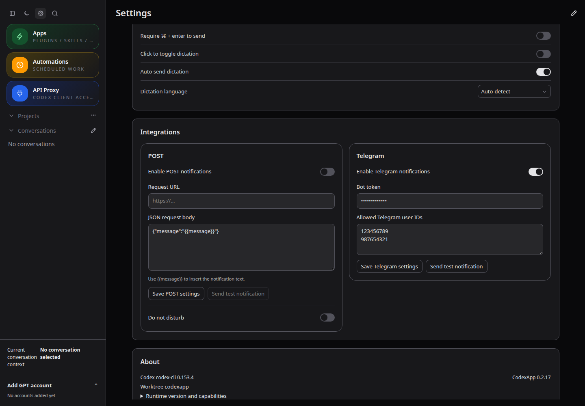

### Telegram 开关阶段候选核对

`a34ab56` 已通过完整构建、打包、原有 drain/idle 检查后更新 59001，日志 `/home/Code/codexapp/output/0217/telegram-deploy.log`。构建无新增依赖，主 JS 为 799.30 KB（gzip 253.52 KB）；未重新测量全站启动耗时。

安装包最终复核如下：

- 27 个 dist/dist-cli 文件与工作区构建逐文件 SHA-256 一致；镜像、包与 CLI 摘要在 `artifacts.json`，镜像和包摘要见本文“构建、候选与清理”。本机及安装包 CJS 入口退出码 0，实际原生 PTY 输出 `PACKAGED_PTY_0217_OK`。
- 59091–59094 用最终镜像再次完成无认证、无效认证、损坏认证和 Zen → OpenRouter 验证；旧问题 ID 重复提交对应同一原生 turn，无效认证错误刷新后保留，明暗主题重复 overlay 为 0。日志 `telegram-auth-matrix.log`、`telegram-invalid-start.log`、`telegram-auth-ui.log`、`telegram-auth-other-ui.log`。59091 另验证未配置 Telegram 默认关闭，测试请求返回 400 且未发送通知，见 `telegram-packaged.json`。
- 59001 只读实际页面确认 Telegram 开关与服务器保存状态一致、外观两项为下拉框、跨卡片进度条全部对齐，实际 7 天/30 天两条均为 199.2px 且间距 7px；未主动刷新真实额度。插件重访 0 次新增目录请求、单滚动条、固定三端点状态、SunMoon 与系统配色联动继续通过。报告 `candidate-readonly.json`、`candidate-quota.json`，日志 `telegram-candidate-readonly.log`、`telegram-candidate-quota.log`。
- 候选认证文件更新前后 SHA-256 相同；生产仍为 0.2.16、MainPID 2559244。最终四个测试容器及专用卷已清理，59091–59094 监听消失，见 `telegram-cleanup.log`、`followup-cleanup.json`；保留 4173、59001、5900 和开发前备份卷。


## 设置、应用与站点标识追加验收（2026-09-11）

### 激活记录与历史状态

WANG CHU 的 `2026/09/10 05:30 · 已跳过 / 账号认证状态不可用` 是一次历史调度结果。调度器当时没有发出激活消息，旧记录未保存更具体的认证状态，因此无法由这条记录进一步确认原因。本轮只读查询时两个现有 OpenAI 账号均为 `ready`，它不是当前登录失效提示。移除设置主区常驻的旧结果，保留调度器认证检查，记录可在右下角“激活记录”查看。

启用开关独占一行，“生效账号”与“每日激活时间”平级对齐，添加时间与 OpenAI 添加账号右边缘对齐。记录每页对应**一次设定的激活时间**，同次多个账号显示在一起；上一页、下一页和可搜索时间选择器均可导航。旧记录迁移，后台仅保留最近三个日历月，不增加界面说明。59001 当前迁移出两次计划记录，弹窗与接口数量一致。

历史文件按日期分片仅是内部存储方式，界面和接口分页单位都是“次”。每次状态变化追加一条记录，计划索引独立保存；按页仅读取所选日期的记录文件，索引缓存不重写三个月历史。历史请求只在打开弹窗和翻页时发送，不增加设置页轮询。现有固定凭据、独立空目录及完成后延迟清理路径没有改动；未使用真实账号发送激活。

### POST / Telegram 与免打扰

两张通知卡共用六行布局：标题、启用、第一字段、第二字段、保存/测试、免打扰。桌面各行对齐，手机/平板按可用宽度上下排列。每张卡的免打扰区域按“免打扰 → toggle → 起始时间 至 结束时间”同行排列，时间与“至”统一 12px。两侧起止时间**始终显示**；关闭免打扰时灰化、禁用，开启后保留原时间，切换不会收缩卡片。保存/测试按钮仍位于免打扰上方，没有新增提示说明。

Telegram 免打扰按全局时区生效，更改即时保存，刷新保留；自动通知持久化暂存，结束后发送，显式测试与 POST 保持一致。通知记录绑定机器人身份摘要，切换机器人不把旧通知发送给新机器人；关闭通知清空暂存。补充覆盖同一个通知桥停止再恢复时重新安排计时器，避免时间结束后不再检查。

性能边界：只在有待发送通知时安排 5 秒检查，最多保留 256 项；发送串行，单次 Telegram 请求 10 秒超时。持久化文件不保存 Bot token；结果不确定的发送不在重启后自动重放。免打扰时间控件改为 disabled 只改变渲染属性，无额外请求。全部通知行为使用模拟传输，未发送真实 POST/Telegram 通知。

### 应用页与下拉框

主内容区只保留一个“应用”大标题，顶栏不再重复“插件 / 技能 / MCP”；保留侧栏入口原有副标题。插件、技能 / MCP 两个选项卡文字居中。技能页顺序为 MCP 连接 → 查找技能 → 查找结果 → 已安装技能筛选输入 → 已安装技能及数量；去掉“技能中心”。MCP、查找结果和已安装技能共用同样的数量徽标及右侧展开箭头。技能目录、搜索等控件中文补齐，英文同步。

已安装筛选在本地按名称、描述、来源、路径计算，六组浏览器检查中输入/清空筛选均为 **0 次新增目录请求**。只有显式技能搜索发出一次远端查询。

外观字段名为“主题”/Theme，系统主题选项为“自动”/Auto；显示时区的“跟随系统”保持原义。普通 AppSelect 展开菜单与触发框同宽，复用浮层定位和 ResizeObserver，定位中只读取一次锚点矩形；图标按钮菜单维持适合阅读的最小宽度。设置页各可用选择器、历史时间选择器以及目录范围控件均检查边界；菜单长文本允许换行，不撑破视口。

### WebUI Logo 与标题

外观新增 SVG、PNG、ICO 上传、预览和移除，以及自定义标题和“固定标题 / 会话标题前缀”选择。前缀模式在会话中显示 `自定义标题 - 会话标题`，其他页面只显示自定义标题；空标题恢复默认规则。偏好保存在各实例自己的 CODEX_HOME，刷新及服务重启后保留。

Logo 统一用于 favicon（浏览器标签页、书签/历史中的站点图标）、桌面及主屏幕快捷方式、PWA 安装图标、Apple Touch 图标、Android maskable 图标、Windows browserconfig 和 WebUI 登录页。网页应用图标尺寸与 maskable 用法参照 [MDN manifest icons](https://developer.mozilla.org/en-US/docs/Web/Progressive_web_apps/Manifest/Reference/icons)，Apple 主屏幕入口参照 [Apple Web Applications](https://developer.apple.com/library/archive/documentation/AppleApplications/Reference/SafariWebContent/ConfiguringWebApplications/ConfiguringWebApplications.html)。

上传时在浏览器生成 32/64/150/180/192/512 及 maskable PNG 变体，保留比例，不把原始 SVG 当活动页面提供。现有服务端认证继续保护保存接口；图标和 manifest 可在登录前读取。各图标使用版本地址并绕过旧 Service Worker 缓存；构建产物不嵌入开发实例的标题或 Logo。初始页面直接带少量品牌元数据，常规启动没有新增设置请求；图标转换仅在上传时执行，不新增依赖。

实际系统对已有桌面快捷方式的图标缓存刷新速度未自动化验证；已确认浏览器可读取更新后的图标与 manifest、登录页正确渲染、服务重启后状态保留。

### 最终验证、性能与清理

- 聚焦回归 **9 文件 / 34 用例通过**，包含激活历史、调度器、Telegram 配置/通知队列/桥、品牌存储、前端入口、浮层与翻译。类型检查、完整构建、打包通过。
- 4173 设置/应用六组矩阵：1440×1000、375×812、768×1024，浅深主题、中英文；按次历史、标题层级、菜单宽度、通知对齐、禁用时间仍可见、重新开启保留值、刷新持久化及技能本地筛选均通过，无页面错误或横向溢出。
- Logo 四组矩阵：1440×1000、375×812，浅深主题、中英文，每组都上传 SVG/PNG/ICO，实际验证固定/会话前缀标题、图标尺寸、manifest、ICO、Apple/Windows 路径及刷新保留，最后恢复 4173 测试前品牌设置。
- 最终安装包 59091–59094 完成无认证、无效认证、损坏认证、Zen → OpenRouter 验证。旧问题 ID 重复提交仍返回同一原生 turn；无效认证错误刷新后保留，浅深主题重复 live overlay 数为 0。
- 59096 使用独立数据卷和测试登录密码，验证未登录默认图标可读、未经登录不能保存、登录后品牌保存、未登录页面显示新 Logo、标题特殊字符按文字展示、图标/manifest/ICO/Windows 配置有效，以及容器重启后持久化。
- 59001 只读检查两次历史计划、通知开关与后端一致、免打扰时间禁用状态、品牌控件、主题“自动”、同宽菜单；插件仍每页 60 张卡，离开重访新增读取 0 次。候选认证文件更新前后 SHA-256 一致，生产 5900 仍为 0.2.16、MainPID 2559244。
- 27 个安装目录 dist/dist-cli 文件与构建逐文件 SHA-256 一致；本地/安装包 CJS 帮助出口码 0，实际 node-pty 输出 `PACKAGED_PTY_0217_OK`。主 JS 为 809.36 KB / gzip 256.72 KB，相比 Telegram 开关阶段分别增加 10.06 / 3.20 KB；未重新测量全站启动耗时。

```bash
pnpm exec vitest run src/server/webUiBrandingStore.test.ts src/server/frontendAssets.test.ts src/server/telegramConfig.test.ts src/server/telegramThreadBridge.test.ts src/server/telegramNotificationQueue.test.ts src/server/accountActivationScheduler.test.ts src/server/accountActivationHistory.test.ts src/components/common/popoverPosition.test.ts src/i18n/translateSource.test.ts
node output/0217/refinement-ui.cjs
node output/0217/branding-ui.cjs
node output/0217/branding-packaged.cjs
node output/0217/candidate-readonly.cjs
node output/0217/artifacts.cjs
```

最终替换日志 `output/0217/refinement-deploy.log`，继续经过原 drain/idle 检查。原始结果在 `/home/Code/codexapp/output/0217/`：`refinement-tests.log`、`refinement-ui.json`、`branding-ui.json`、`branding-packaged.json`、`candidate-readonly.json`、`refinement-auth-*.log`、`artifacts.json`。五个本次测试容器及专用卷清理后 59091–59094、59096 监听消失，保留 4173、59001、5900 及原有备份；清理证据 `refinement-cleanup.log` / `followup-cleanup.json`。

截图均等待 2.3 秒后获取；设置 URL `http://127.0.0.1:4173/#/settings`，应用 URL `http://127.0.0.1:4173/#/skills?tab=skills`，安装包登录页 `http://127.0.0.1:59096/`。原图绝对目录 `/home/Code/codexapp/output/playwright/`，以下文件名对应同目录原图，归档副本字节一致。

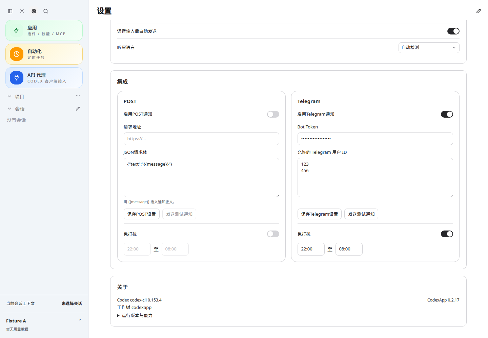
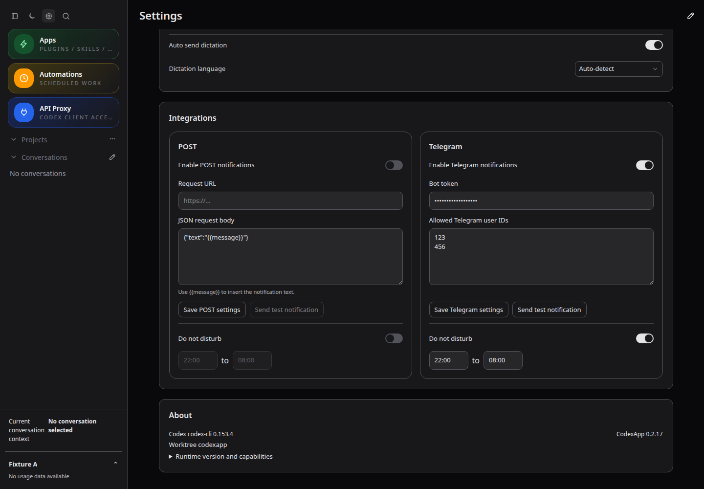
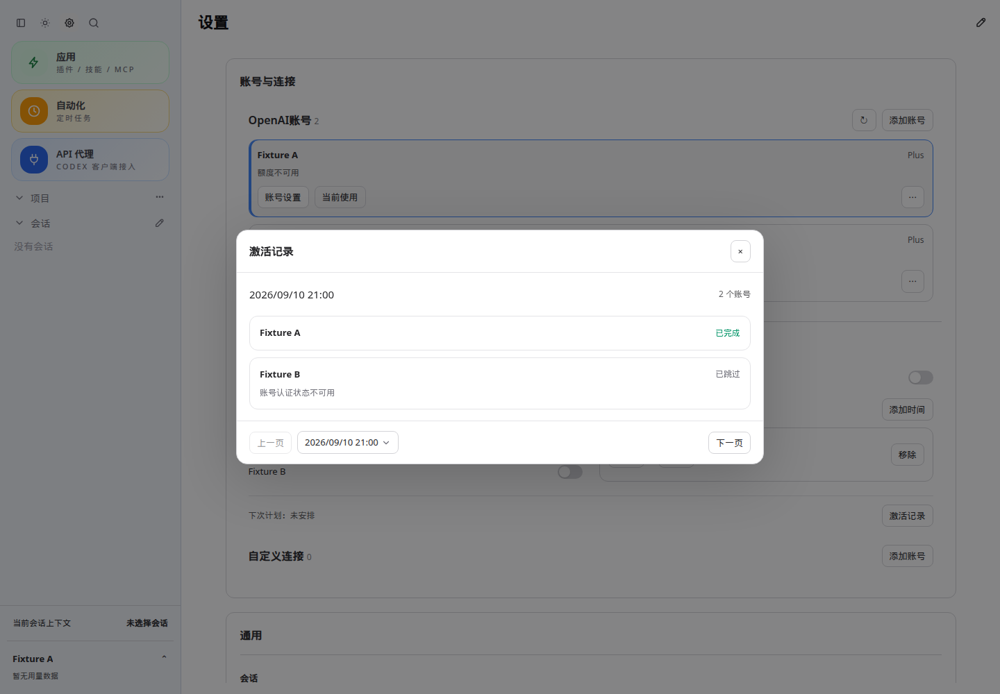
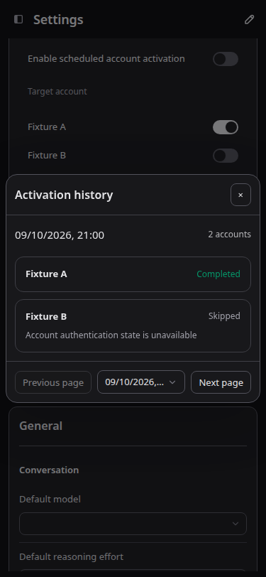
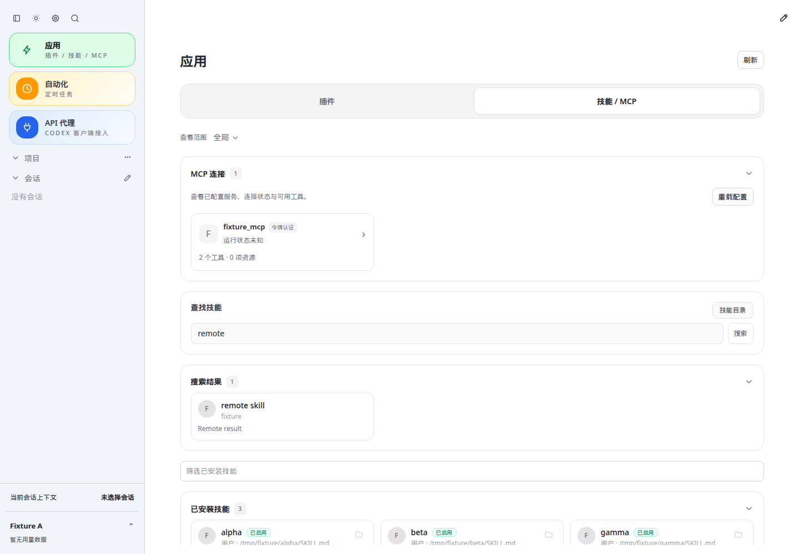
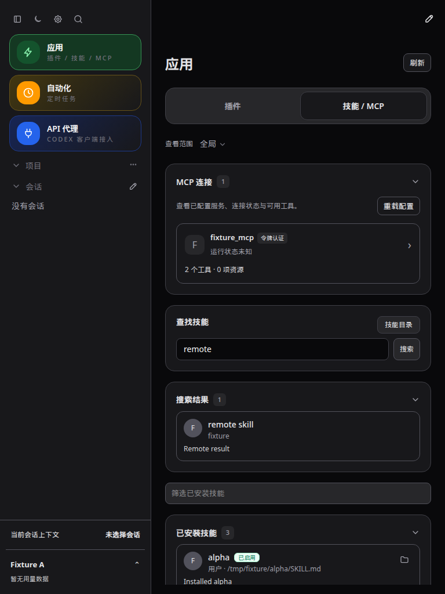
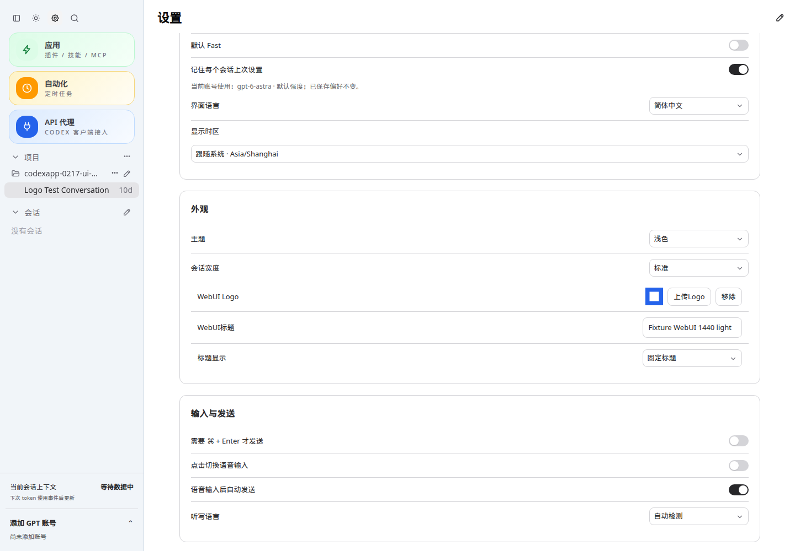
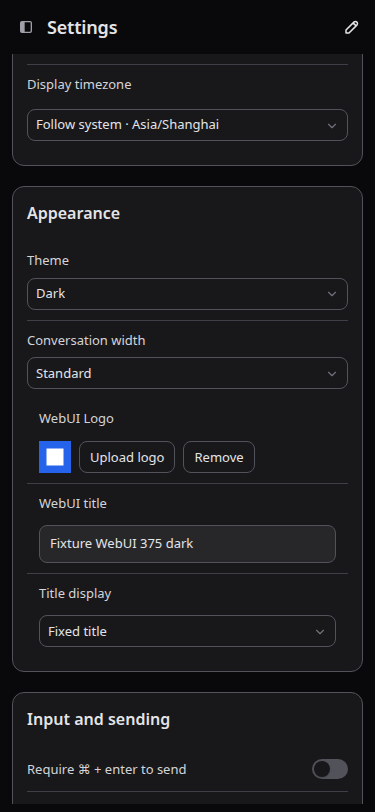
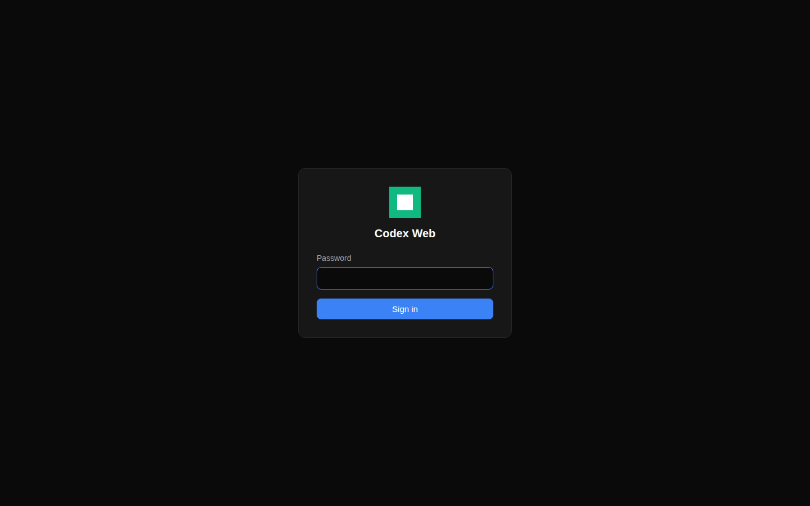


### 全页对齐、字号与分组最终复核

通用、外观、输入与发送改为共享设置网格，按分区实际内容宽度判断：达到 600px 时两栏，否则单栏。组件边界不再形成额外缩进；主题/会话宽度、标题/标题显示、Logo 使用同一层级的标签、留白和分隔线。去掉通用设置里多余的“会话”子标题，三个输入开关改用 AppSwitch，原有本地偏好保留。

听写语言、主题、宽度、界面语言、推理强度、标题显示等标签与选择器同行。短控件分配 140/180px，模型、时区及标题控件可使用 260px，并随可用宽度收缩；窄屏不再把听写语言与下拉框拆成上下两行。宽菜单仍与触发框同宽，选项支持完整换行查看。时区错误移出字段行，避免破坏正常控件对齐。

字号层级统一为：主要页面标题桌面 22px/手机 18px，分区标题 16px，子标题 14px，普通字段/动作 13px，辅助数据 12px；账号额度条等既有紧凑摘要保持独立字号。字段控件高 36px，普通动作 32px。字段行去掉无操作意义的悬停底色，API 服务字段和当前账号显示值共用控制高度；自动化提示词/执行记录标题同级，辅助标签/数值和刷新/编辑动作字号、圆角及明暗表面统一。

最终浏览器验收：设置/应用六组、API/自动化六组，覆盖 1440×1000、375×812、768×1024，明暗主题和中英文。断言包括同级边界/字号、字段分隔、响应式列数、标签与下拉框同行、下拉菜单同宽、通知时间同行且字号 12px、禁用后保留、输入开关键盘切换与刷新持久化、零页面错误/横向溢出。没有运行真实自动化或修改真实账号/API 配置。59001 再检查 1440px 与 375px 的实际设置选择器，同行对齐通过。

性能审阅：列数由 CSS 容器查询处理，没有新增 JavaScript resize 监听或服务端请求；设置开关沿用 localStorage，三项切换及刷新持久化已验证。安装产物仍为 27 个文件逐字节一致，最终 CLI SHA `20afe6c1a5ebe7b043f1e350872d8a24e07c668c8b11f5a2f24449c075c8cd18` 与上一轮认证/品牌安装包矩阵相同，后续变更仅影响前端。没有新增依赖，也没有重测全站启动耗时。

最终部署与验证原始证据：`/home/Code/codexapp/output/0217/layout-audit-deploy.log`、`layout-audit-ui.json`、`layout-audit-routes.json`、`layout-audit-typecheck.log`、`layout-audit-candidate.log`、`layout-audit-runtime.log`、`artifacts.json`。CJS/实际 PTY、品牌构建隔离、候选认证摘要、生产 PID 核对均通过；临时验收容器的清理范围不变。

下图取自实际相应路由：`http://127.0.0.1:4173/#/settings`、`/#/api-proxy`、`/#/automations`。原图绝对目录仍为 `/home/Code/codexapp/output/playwright/`；明暗背景正确，字段边界和字号断言通过。

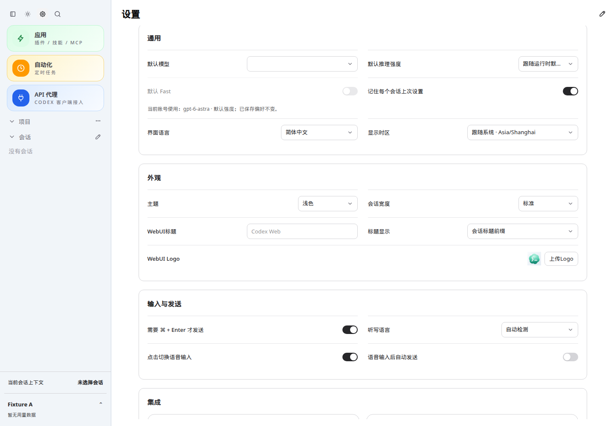
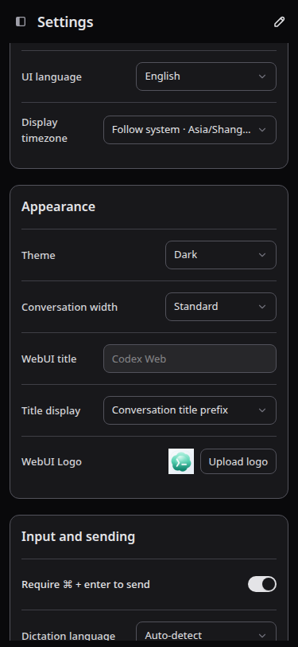
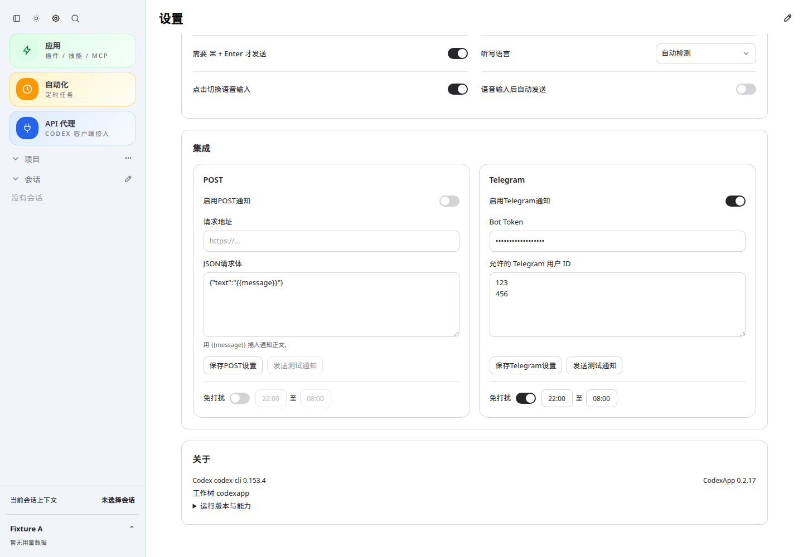
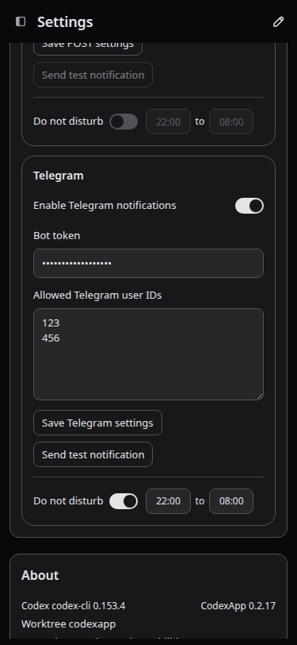
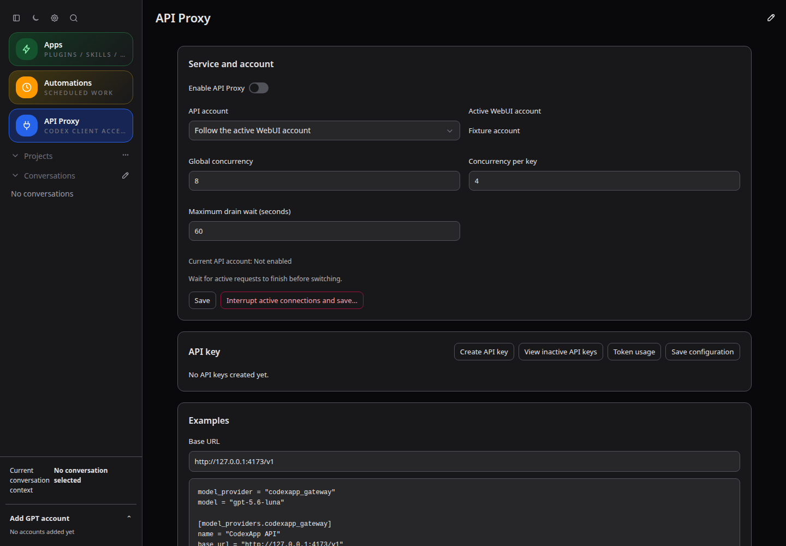
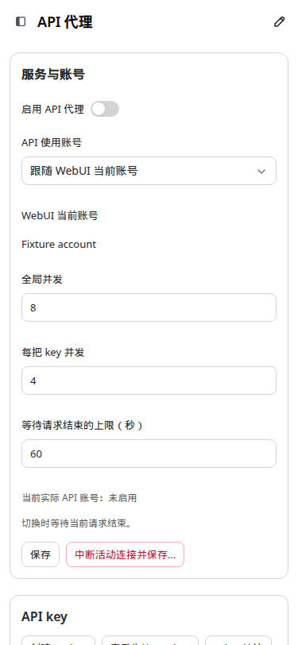
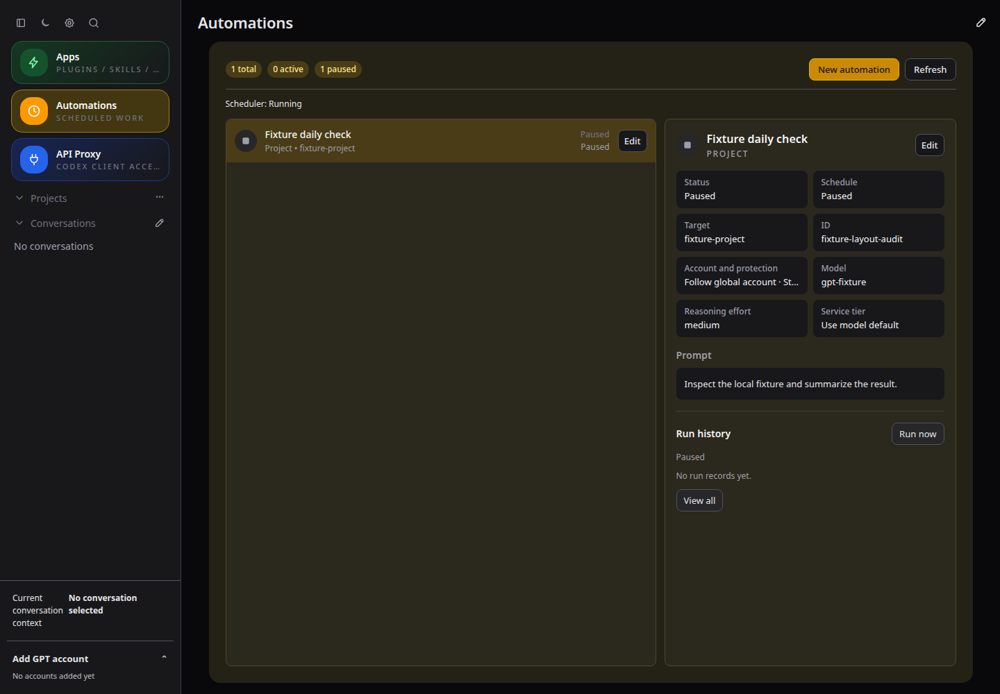
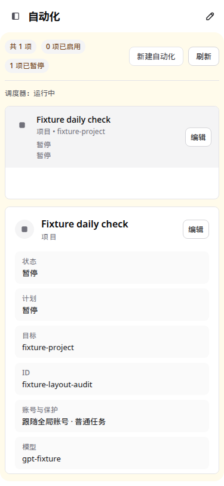
