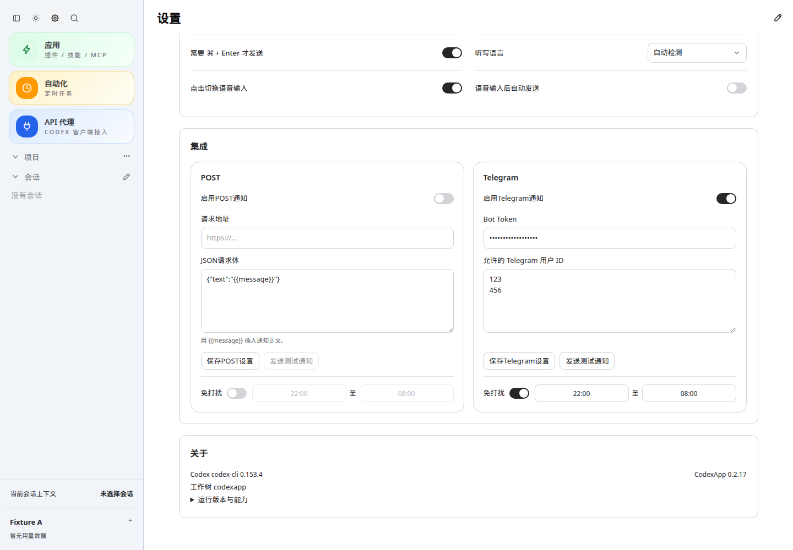
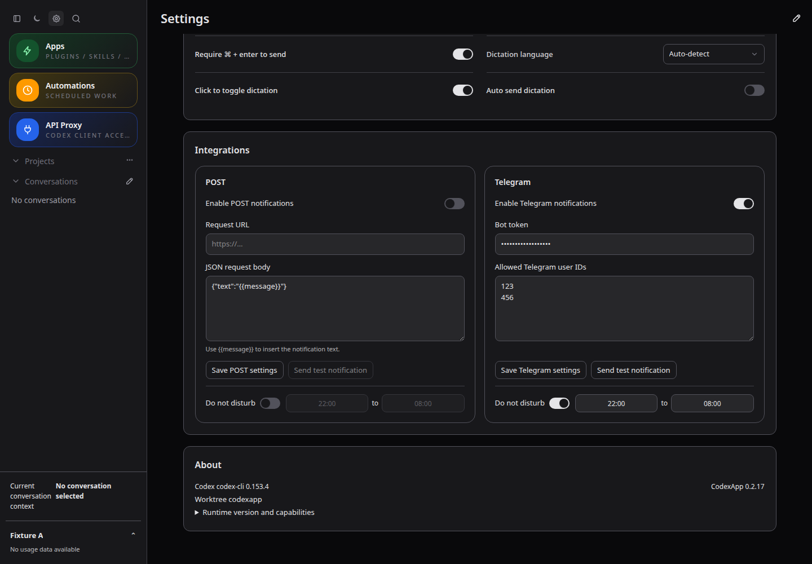
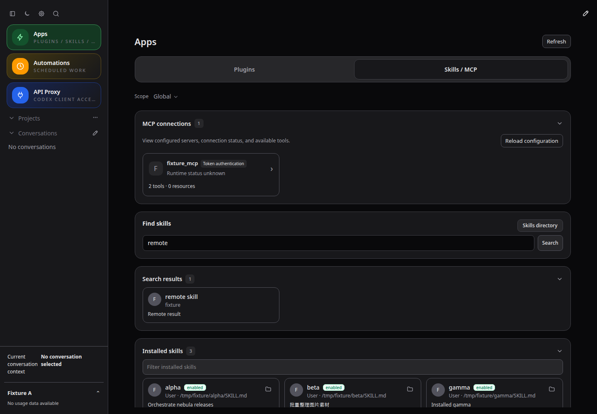
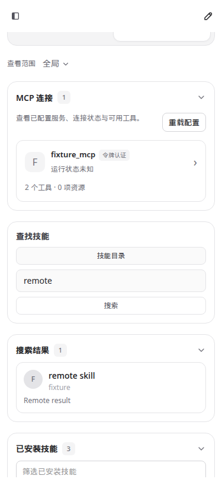
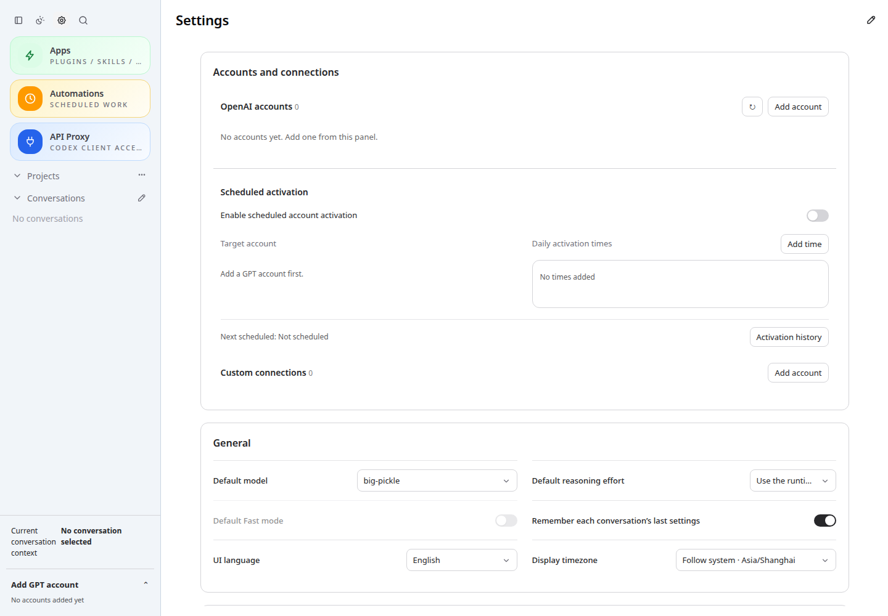

# CodexApp 0.2.17 发布准备与切换交接

## 当前结果

0.2.17 已在 59001 完成最终验收并 prepare。生产 5900 仍运行 0.2.16，MainPID **2559244**；没有 activate、合并或发布 npm 包。完整开发范围及此前认证、激活、外部连接验收见 [开发验收记录](20260910-0016-codexapp-0.2.17开发与59001验收.md)。本文覆盖最终 UI 修订和发布交接，取代此前阶段记录中“保留 4173”的收尾状态。

- 代码提交：`3d924ac039b7`，分支 `feature/0.2.17-development`。
- 精确发布目录：`/home/docker/codexapp-releases/codexapp-0.2.17-3d924ac039b7-20260911-010224`。
- 候选：`http://192.168.50.46:59001/`；容器 `codexapp-multi-account-dev`，独立卷 `codexapp-multi-account-dev-home`。开发前备份卷 `codexapp-0217-before-home` 保留。
- 镜像：`sha256:bc36c1c3b891c86ff6ba94313d2edb7a9455d41cf817aff78e8f0502c9d79bda`。
- tarball SHA-256：`0712bf3f25268ac751b7818d3e13b87b7ddb2ec16c579c97de8b5b7d8974c7dc`。
- CLI SHA-256：`20afe6c1a5ebe7b043f1e350872d8a24e07c668c8b11f5a2f24449c075c8cd18`。

## 最终 UI 修订

POST 和 Telegram 的免打扰行铺满各自卡片内容宽度；标签、开关、起始时间、连接词、结束时间保持同行。时间框均分剩余空间，最右侧与上方输入区域对齐；关掉开关后仍显示灰色禁用时间，字号保持 12px。

技能筛选框移至“已安装技能”控件内部，在标题下方、卡片列表上方；收起时隐藏，再展开保留筛选词。既有筛选逻辑已经检查名称、简介、作者和路径，忽略英文大小写与首尾空格，本轮没有改写这条算法，也没有复现“仅筛名称”。59001 的 39 个技能均有简介，使用仅出现在简介中的 `identifying`，实际命中 1 项；样本另验证 `NEBULA` 和“图片素材”均可通过简介命中。没有新增翻译文案。

## 验证与性能

- `pnpm exec vue-tsc --noEmit`、`pnpm run build` 通过；`pnpm exec vitest run src/directory.test.ts` 为 **9/9**。
- 4173 浏览器六组：1440×1000、768×1024、375×812，明暗主题和中英文。免打扰左右边界、顺序、12px 时间字号、禁用后布局、筛选框归属、折叠后保留、名称及简介筛选均通过，页面错误和横向溢出为 0。
- 因 Browser Use 不可调用，且需要拦截设置保存和控制 localStorage，使用 Playwright CJS。通知数据均为测试样本，没有发送真实通知。59001 另做实际页面只读检查。
- 筛选各次新增网络请求 **0**，仍使用已加载数组；没有新增目录读取、缓存失效点、轮询或 resize 监听。主 JS **809.36 KB / gzip 256.72 KB**，按构建显示精度与上一版一致；CSS **444.83 KB / gzip 49.81 KB**。未重新测量全站启动耗时。
- 候选与工作区、prepared 与工作区的 **27 个 dist/dist-cli 文件**全部逐文件哈希一致。CLI 没有变化，候选认证摘要未变化。
- 安装包构建首次遇到 npm `ERR_SSL_CIPHER_OPERATION_FAILED`，保留原候选后重试成功；替换前 drain/idle 全零，没有绕过门禁。

CJS 帮助命令退出 0：

```bash
node -e "process.argv=['node','codexapp','--help'];require('./dist-cli/index.js')"
docker exec codexapp-multi-account-dev node -e "process.argv=['node','codexapp','--help'];require('/usr/local/lib/node_modules/codexapp/dist-cli/index.js')"
PREPARED_RELEASE=/home/docker/codexapp-releases/codexapp-0.2.17-3d924ac039b7-20260911-010224 node output/0217-prepare/verify-prepared.cjs
```

最后一项内部通过 CJS 加载 prepared CLI，并实际调用 `node-pty.spawn('/bin/sh', ['-c', 'printf PREPARED_PTY_OK'])`，输出标记且退出 0。候选也完成实际 PTY 命令验证。

### 缓存与版本迁移

59001 实际安装包：首页 `Cache-Control: no-store`，没有 ETag/Last-Modified；带旧条件头仍返回 200；带哈希资源 immutable，缺失旧资源返回 404 而非 SPA HTML；浏览器刷新命中资源缓存，页面正常。

59015 使用任务专属 `output/0217-prepare/migration-home`，先运行原 0.2.16 包，再停止并从 prepared 目录启动 0.2.17。使用**同一地址、同一浏览器上下文和缓存**真实刷新，没有网络拦截；页面版本从 0.2.16 更新为 0.2.17，旧 JS URL 返回 404，二次刷新新 JS 命中磁盘缓存，pageErrors=[]。缺少 key 的 `/v1/models` 返回 401。

### 4173 与后台终端清理

4173 监听 PID `2856869`，cwd `/home/Code/codexapp`，启动进程 PID `2856773`；独立 `CODEX_HOME=/tmp/codexapp-0217-ui-home`。已核对本会话后台终端 `processId=19811`、`itemId=exec-43018849-18ce-4a58-9eac-a9048420d7b4` 与完整启动命令一致，通过应用 `/codex-api/process-activity/terminate` 停止。

清理后：4173 无监听，Vite、wrapper、pnpm 启动进程均已退出，对应后台终端记录消失；当前会话终端列表为 0。59015 迁移服务也已退出、无监听，其启动测试终端已完成。保留 59001、5900；5173 未操作。没有批量停止 Node，也没有结束活跃模型回合。

## 切换门禁与下一步

清理后已对上面的**精确发布目录**运行 `check`，退出码 **3**：

```text
liveExecutions=1
activeTurns=1
queued=0
pendingApprovals=0
apiConnections=4
apiActiveRequests=4
backgroundThreads=skipped-busy
```

因此当前不能切换。`skipped-busy` 表示**全局后台终端尚未检查**，不能写成 0；本会话终端为 0 是单独核对结果。未终止生产 API 活跃请求。结束当前回合、关闭 CodexApp 标签页，等待 API 请求完成后，在**独立终端**运行：

```bash
cd /home/Code/codexapp
bash scripts/codexapp-release-switch.sh check /home/docker/codexapp-releases/codexapp-0.2.17-3d924ac039b7-20260911-010224
```

只有该检查通过、独立 CLI 工作也已结束，且用户明确授权切换时，才执行：

```bash
bash scripts/codexapp-release-switch.sh activate /home/docker/codexapp-releases/codexapp-0.2.17-3d924ac039b7-20260911-010224 --confirm-idle
```

本次仅 prepare，不能根据 `latest-prepared` 或候选健康状态跳过门禁。切换只更新代码，不导入 59001 账号、认证或会话。生产原发布目录为 `/home/docker/codexapp-releases/codexapp-0.2.16-65733869c5e5-20260910-184328`。

检查时 systemd 另报 `NeedDaemonReload=yes`。只读核对表明加载中的 ExecStart 与磁盘 release drop-in 都指向原 0.2.16，unit/drop-in 修改时间早于本次 prepare；本次没有修改它们或执行 daemon-reload。以后经授权的切换流程会按脚本更新 drop-in 并 reload。

## 证据与截图

原始脚本、报告：`/home/Code/codexapp/output/0217/final-ui.cjs`、`final-ui.json`、`skills-description-readonly.json`、`candidate-readonly.json`、`artifacts.json`；发布证据目录 `/home/Code/codexapp/output/0217-prepare/` 下的 `prepare.log`、`prepare-verification.json`、`cache.json`、`cache-migration.json`、`cleanup.json`、`terminal-final.json`、`check.log`。均不包含认证内容。

设置 URL：`http://127.0.0.1:4173/#/settings`；技能 URL：`http://127.0.0.1:4173/#/skills?tab=skills`；迁移 URL：`http://127.0.0.1:59015/#/settings`。截图前等待 2.3 秒；原图绝对目录 `/home/Code/codexapp/output/playwright/`，以下文件名对应原图。4173/59015 已按发布收尾要求关闭。






