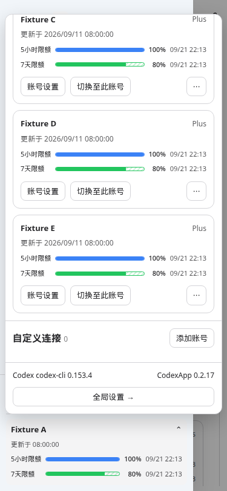
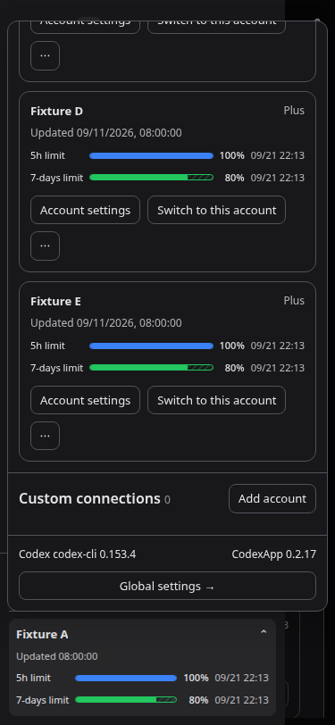

# CodexApp 0.2.17 账号布局与定时激活评估

## 结果

59001 候选已更新，版本保持 0.2.17。设置顺序为 OpenAI 账号 → 自定义连接 → 定时激活。侧栏账号浮层严格位于固定账号卡上方，卡片继续作为展开/收起按钮，内容在浮层内部滚动。

提交：`8890b90`（账号 UI）、`672992f`（激活准入）。未执行生产切换、合并、公开推送或 npm 发布。此前 prepared 包不包含本轮修改，后续发布必须重新 prepare。

本轮开始时候选容器已退出；核对原独立卷与启动参数后恢复，再用既有候选替换脚本部署。生产 5900 未操作。4173 使用独立 `/tmp/codexapp-0217-account-ui-home` 验证，保留运行；5173 未操作。

## 激活条件

界面 100% 表示剩余 100%，对应原始 `usedPercent === 0`，不能用四舍五入后的显示值判断。

- 本实例目标账号有 busy 会话、自动化、API 执行，或凭据正在变更/刷新：立即跳过，不等待补发。空闲连接及本次激活自己的 lease 不算正在使用。
- 到时通过现有账号协调器读取新鲜额度；退避返回旧缓存、读取失败或额度状态不可用均跳过。额度刷新可正常刷新目标凭据，但不切换主账号。
- 只有 primary/secondary 中明确存在 `windowMinutes === 300` 且已用比例为 0，才创建激活会话。没有真实 5h 窗口、只剩周窗口、任何非零使用量均跳过。
- 准备后再次核对本地额度、凭据版本与执行忙碌状态；每个账号只发起一组额度刷新。跳过原因进入现有激活记录，提供中英文文案。
- 其他设备或独立 CLI 的活动不能由本实例注册表直接观测；新鲜额度能识别已经产生的用量，无法保证发现尚未计入额度的远端并发。

## CLI 与 API 评估

| 方式 | 稳定性与实现依赖 | Token 与本机开销 | 本轮结论 |
| --- | --- | --- | --- |
| 当前隔离 CLI 会话 | 固定账号凭据、官方客户端处理协议与完成状态；依赖子进程、临时目录、RPC 及清理 | 即使只有 hi，CLI 仍附带基础说明/工具声明；每 2 秒读取本回合，完成后保留 120 秒再清理 | 保留已验证路径；协议兼容维护更省事，但不声称实测成功率高于 API |
| 通过本地代理固定同一 ChatGPT 账号发送最小 Responses 请求 | 能省掉会话进程，但依赖代理组件健康、账号固定路由、流式完成判定及错误处理；当前 gateway 通过组件转发 | 可省掉 CLI 附加上下文，预计生成输入 token 更少，本机进程开销更低 | 值得作为后续优化；尚未完成同模型同账号云端 A/B，不能给出实际 token 节省比例或稳定性排名 |
| 标准 OpenAI Platform API key | 官方计费 API，有独立账户用量路径 | 按 API token 计费 | 不用它验证 ChatGPT 订阅 5h 窗口激活；两种计费/配额路径不同 |

官方说明将 ChatGPT 订阅登录与 API key 按量计费区分，并明确 API key 使用 Platform 账户计费：[OpenAI 认证文档](https://learn.chatgpt.com/docs/auth)。官方资料未承诺存在独立“启动 5h 窗口”API；发送成功和窗口实际启动需要分别确认。

本轮原生测试用真实 CLI 0.153.4 与本地模拟 Responses SSE：请求一次、用户输入只有 hi，实际输入 JSON 小于 9000 字符，无父 AGENTS/环境/技能目录哨兵。JSON 字符数不是 token 数，模拟服务返回的 usage 也不是计费证据。本轮没有向真实云端发送激活请求。因此明确可验证的省量改进是：不合格账号不发送生成请求，跳过执行不产生生成 token；额度查询本身不调用模型。

## 验收和性能

- 7 文件 / 34 用例通过，覆盖额度准入、忙碌跳过不重放、准备期间状态变化、调度历史、原生 CLI 回合与清理、浮层定位、翻译。完整构建与类型检查通过。
- CJS smoke：`node -e "process.argv=['node','codexapp','--help'];require('./dist-cli/index.js')"`，退出 0，输出帮助。候选安装包 node-pty 的 spawn 导出为函数。
- 4173 与 59001 各 6 组：375×812、768×1024、1440×1000；中英文、浅深主题；每组反复展开/收起 3 次、滚动到底部后再次收起，均通过。页面错误为空。375px 样本浮层 bottom=685，固定卡 top=693，保留 8px。
- 浏览器只拦截虚构账号/连接/激活响应，不写真实账号或激活计划。每组设置挂载加三次展开共 4 次连接列表读取（每次挂载 1 次），激活配置读取 1 次；定位不添加 API 或轮询，继续复用共用浮层的 RAF 和监听清理。
- 实际 59001 设置页 profiler：总 API 229.8 KB；thread/list 首屏 1、thread/resume 1、thread/read 0、skills/list 1、rateLimits/read 1，warnings=[]。打开既有会话产生 resume，本轮没有新增读取路径。未进行云端时延/计费 token 对照测量。
- 调度仍为单一 10 秒计时器，串行处理目标账号；没有无界并发、大型请求载荷或新的缓存层。仅到时读取目标额度；旧缓存不用于放行。

命令与原始结果：`output/0217-account-followup/` 的 tests.log、ui.cjs、ui-dev.json、ui-candidate.json、deploy.log、profile.log、artifacts.json、cjs-smoke.log。性能 trace/report 位于 `output/playwright/browser-runtime-profile-settings-2026-09-11T01-19-35-821Z*`，仅保留本地。

验证 URL：`http://127.0.0.1:4173/#/settings`、`http://127.0.0.1:59001/#/settings`。截图前等待 2.3 秒。下图均为虚构账号；原图绝对目录 `/home/Code/codexapp/output/playwright/`。

## 候选交接

镜像：`sha256:f029e4432f9afabe52de717a58881c9c65b7c88830e739cbfba8b2c3553eebd7`。候选 dist/dist-cli 共 27 文件与本地构建逐字节一致，包版本 0.2.17；包 SHA256 `59aa87404c47f36105fb4046b4a693ace73b4854af0c234ddb88c9a2eb4d776b`。

替换前及验收后 idle-check 均为 liveExecutions=0、activeTurns=0、queued=0、pendingApprovals=0、apiConnections=0、apiActiveRequests=0、backgroundThreads=0。保留 `codexapp-multi-account-dev-home`，不导入生产状态。

回滚：在候选空闲后撤回这两个功能提交并重新构建候选，保留激活去重标识及历史；不要删除状态卷。手工用例更新在 `tests/theme-layout-terminal/0217-settings-and-goals.md` 与 `tests/accounts-feedback-observability/account-activation-0211.md`。
