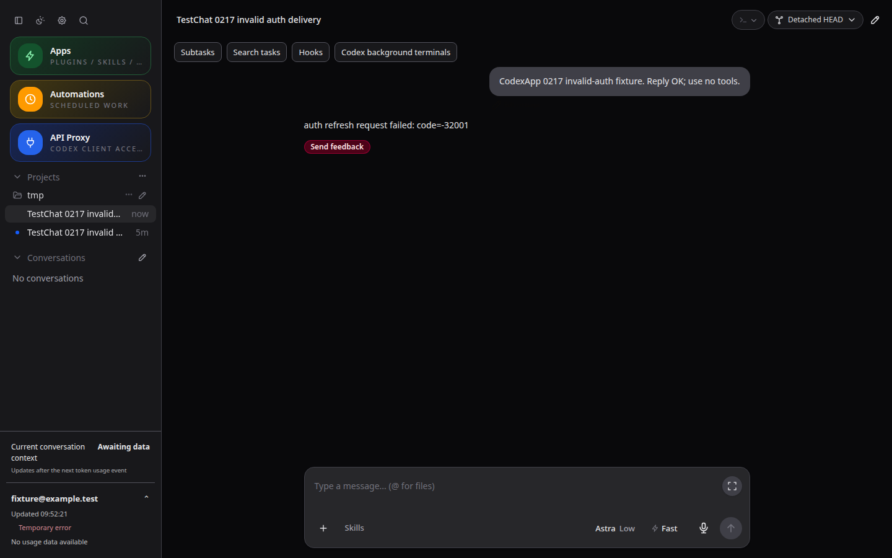

# CodexApp 0.2.17 最小 API 激活与调度隔离

## 结果和边界

按“本地账号状态与正常任务优先、激活只是附加功能”实施。提交 `8e6d37c`，候选 `http://192.168.50.46:59001/`，版本仍为 0.2.17。没有改动生产 5900、主认证目录、用户激活设置或版本号，也没有发布/合并/重新 prepare。旧 prepared 包不含本轮代码。

生成使用现有代理的内部固定账号入口，不经过普通 API key 的默认路由。固定模型 `gpt-5.6-luna`，low/default，输入 hi，tools=[]、store=false，无上下文、历史及 previous_response_id。不再创建 Codex 激活会话、私有 CODEX_HOME，或执行完成后固定等 120 秒。旧 CLI 实现源码仍留作历史参考，生产运行路径不再引用；旧 sessions 目录不参与新调度启动，不主动删除历史文件。

## 正常任务优先

- 同账号 primary/API/automation 注册 busy 执行，或空闲执行切为 busy 时，执行注册表同步取消 activation。取消动作只中止本次请求；不停止共享代理组件，不中断普通任务，不影响其他账号。
- 内部入口固定 storageId 与 credentialRevision。账号移除会撤销执行；准备后凭据版本不匹配时拒绝发送，不跟随主账号切换到另一个账号。
- 到时账号忙碌、凭据正在变更、额度不是新鲜数据、没有明确 5h 窗口、5h 原始 usedPercent 非零，均跳过。长期额度进入保护值时，也遵守已有保护规则。
- 复用按账号维护的代理组件；申请容量时不驱逐已有组件。容量上限仍为 8，满载则跳过；正常请求保留原有分配方式。组件被引用或账号正在使用时，不可被池回收。
- 激活生成结果不计入普通 API key 的使用量，不调用共享组件 recordResult 更新退避。真实组件准备失败仍遵循组件自身保护；不能保证代理故障时激活成功，也不会为此重启正常服务。

## 调度、取消和额度同步

| 阶段 | 上限与行为 |
| --- | --- |
| 准备与生成整体 | 每账号最多等待 60 秒，关闭计划或服务可中止；迟到准备结果释放资源、不发送 |
| 生成 HTTP/SSE | 20 秒；整个流读取最多 64 KiB；每次一个请求、不自动重试 |
| 完成判定 | 明确 response.completed、response.status=completed、有效 id；仅 HTTP 200、[DONE]、创建事件均不算完成 |
| 释放资源 | 中止请求、释放 generation 引用及 execution lease，最多等 2 秒；失败只记录本次异常，继续后续账号 |
| 额度同步 | 先持久化 sent 并释放生成资源，再单独刷新目标额度；调度最多等待 5 秒，同步失败不能改变 sent 或触发重新生成 |

额度同步时账号忙碌或已有账号操作则跳过；正常同步成功后，明确存在未来重置时间与非零用量的 5h 窗口才标记“窗口已确认”，否则保留“窗口尚未确认”。不将模型响应的 token usage 换算成本地 5h 使用比例。

5 秒是调度等待额度同步的上限，不是底层共享查询的强制取消时间。已启动的账号协调器额度查询仍沿用现有超时、凭据刷新合并及版本保护，可能稍后完成；它不再阻止激活调度继续。发送前的新鲜额度查询也沿用现有协调器，不另写账号缓存。其他设备/独立 CLI 的进行中活动无法直接观察，尚未记账的远端并发仍有窗口。

发送完成结果和同步结果区分：请求完成/额度待同步、同步失败、忙碌跳过、窗口确认/未确认。断流、超时和被抢占后未收到完成事件时记 unknown，重启不重发。单账号传输/清理/同步失败不会设置全局激活错误；持久化或单写者租约失败仍停止激活，保住去重约束。没有降级回 CLI 或绕过额度筛选的自动兜底。

流式完成事件参考 [OpenAI Streaming responses](https://developers.openai.com/api/docs/guides/streaming-responses)。本轮对本地状态和调度有验证，未以真实账号强制启动云端窗口，也未测实际云端 token 或成功率。

## 验证与性能

12 文件 / 121 用例通过，类型检查与构建通过。覆盖最小请求和逐字节 CRLF SSE、断流/超限/上游错误、真实本地 HTTP、同账号抢占、删除账号、凭据版本不匹配、主账号不变、无 sessions 目录、同步失败不重发、挂起 send/prepare/dispose、迟到准备清理、关闭计划取消、资源池容量与固定账号入口、受保护额度、原有账号与 API 回归。

最小 JSON 请求体 **221 字节**，无生成重试、无 thread/read 轮询。真实本地 HTTP 用例只收到一次请求；故障用例同样最多一次。没有新增浏览器轮询或账号无界并发；调度仍每 10 秒检查、账号串行处理，生成流总量有界。实际共享代理冷启动仍可能创建进程/凭据投影，不能声称整个链路零进程。CLI 构建 935.10 KB，未引入依赖。字符数/字节数不等于实际计费 token，模拟 usage 也不作为计费证据。

CJS smoke：`node -e "process.argv=['node','codexapp','--help'];require('./dist-cli/index.js')"`，退出 0，输出帮助。候选安装包 node-pty.spawn 导出为函数；dist/dist-cli 共 27 文件与本地匹配。

安装包 Docker 验证使用独立卷与测试凭据：59111 无认证→Zen，59112 无效认证→错误持久化，59113 损坏认证→Zen，59114 Zen→OpenRouter。四个场景均未改变生产或候选账号。初次无效认证样本在创建会话前被预检查拦截；仅在该测试卷中重置样本状态并立即创建回合，以验证真正失败回合在刷新后的展示。最终 CLI 文件在四个测试容器中与候选哈希一致，再执行页面复核。容器重启后，已失效样本的旧回合恢复被启动预检查拦截；同样仅重置隔离样本并重新生成失败回合。最终明暗主题刷新复核通过，不将此结果宣称为失效账号跨服务重启的历史恢复验收。

测试命令与输出保留在 `output/0217-activation-api/`：tests.log、typecheck.log、deploy.log、auth-matrix.cjs/json、restart-invalid.cjs/log、auth-ui.cjs/json、auth-other-ui.cjs/json、final-test-artifacts.json、artifacts.json、cjs-smoke.log。相关手工用例更新在 `tests/accounts-feedback-observability/account-activation-0211.md` 文末。

截图 URL 为 `http://127.0.0.1:59112/#/thread/01a08e2a-7993-74d2-8e69-425c8ef9e757`，1440×900，明暗主题；无效认证错误刷新后保留，重复 live overlay=0、页面错误=0。其他三类启动页面同样检查明暗主题，截图前等 2.3 秒。原图绝对目录 `/home/Code/codexapp/output/playwright/`。

## 交接和回滚

候选与独立卷 codexapp-multi-account-dev-home 保留。替换前后 idle-check 的 liveExecutions、activeTurns、queued、pendingApprovals、apiConnections、apiActiveRequests、backgroundThreads 均为 0。测试完成后只关闭本轮 59111—59114 四个测试容器，验证端口消失；不操作 5900、59001、5173 或现有 4173。

回滚需在候选空闲后撤回本轮提交、重建候选，保留原 state/history/claims；不清空历史或去重标识。重新发布前需重新 prepare，不使用此前已准备的旧包。

最终镜像：`sha256:6169c518f40b3a3f6d2e09fb3932490d06b0e01326c509e7dc0332d90579bc83`。包 SHA256：`b015fb0b40d22fad911e76f09a42a5a4a4832150519a2d6c621dbb082797b772`。CLI SHA256：`4efcc96c9626eb1201c2e12b686fca082fc57ad4b904e4a141f5d53e70463263`。
