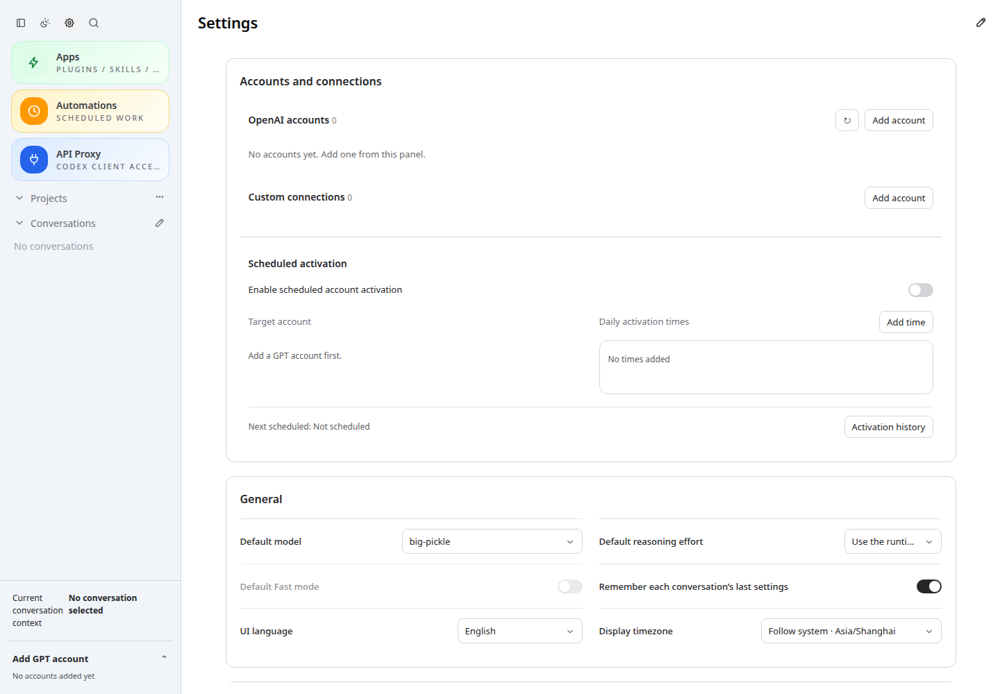

# CodexApp 0.2.17 最小 API 版本发布准备交接

## 发布结果

本次覆盖此前 0001 文档的 prepared 交接。版本保持 0.2.17，包含账号设置顺序、手机固定账号卡开关、定时激活跳过条件，以及以本地状态与正常任务优先的最小 API 激活。实现与 121 项回归见 [0003](20260911-0003-codexapp-0.2.17最小API激活与调度隔离.md)。

- 源码提交：`1253fad8def5`，分支 `feature/0.2.17-development`，prepare 前工作树干净。
- 新发布目录：`/home/docker/codexapp-releases/codexapp-0.2.17-1253fad8def5-20260911-101811`。
- 当前生产：`/home/docker/codexapp-releases/codexapp-0.2.17-3d924ac039b7-20260911-010224`，MainPID=796110，active，NeedDaemonReload=no。
- 候选 59001 保留，独立状态卷不导入生产；本次未执行 activate、服务重启、账号切换或认证快照。
- CLI SHA256：`4efcc96c9626eb1201c2e12b686fca082fc57ad4b904e4a141f5d53e70463263`。
- tarball SHA256：`b015fb0b40d22fad911e76f09a42a5a4a4832150519a2d6c621dbb082797b772`。

## 包验证与清理

脚本 prepare 完成构建、打包、依赖安装、组件校验与 CLI 帮助检查。发布目录的 dist/dist-cli 共 27 文件与本地构建一致，CLI 与 59001 一致。额外执行 CJS require 帮助以及 node-pty.spawn 真实 shell，退出 0 并收到 `PREPARED_PTY_OK`。没有用生成请求代替包验收，也未强制消耗真实账号额度。

在隔离 59015 使用同一浏览器缓存，从生产旧 0.2.17 包切至新 0.2.17 包：JS hash 改变、新账号顺序正确、刷新成功、无页面错误。入口 Cache-Control=no-store，无 ETag/Last-Modified；携带旧条件头仍返回 200；带 hash 资源 immutable，旧资源返回 404 而非 SPA。59001 同样验证真实浏览器缓存命中与刷新。

已清理本会话启动的 4173：确认 cwd、独立 CODEX_HOME、Vite 监听 PID、启动进程树与原工具终端 processId=49359/itemId 后，通过应用终端停止接口退出。监听 PID=1044010 及启动链已消失，原终端记录消失。59015 的验证脚本自行停止独立子进程并确认端口消失。已知本会话后台终端为 0；全局后台终端仍因忙碌未检查。5900/59001/5173 未停止。

## 切换前检查

在上述清理后，精确路径 check 退出 3：

```text
liveExecutions=2
activeTurns=2
queued=0
pendingApprovals=0
apiConnections=2
apiActiveRequests=2
backgroundThreads=skipped-busy
```

因此当前不切换，也没有终止活跃模型任务/API 请求。skipped-busy 表示全局后台终端未核查，不是 0。

当前工作结束、其他活跃任务与 API 请求完成、关闭 CodexApp 标签页后，从独立主机终端检查：

```bash
cd /home/Code/codexapp
bash scripts/codexapp-release-switch.sh check /home/docker/codexapp-releases/codexapp-0.2.17-1253fad8def5-20260911-101811
```

只有该检查通过、独立 CLI 活动也已结束，且用户明确授权生产切换时，才运行：

```bash
bash scripts/codexapp-release-switch.sh activate /home/docker/codexapp-releases/codexapp-0.2.17-1253fad8def5-20260911-101811 --confirm-idle
```

使用精确路径，避免以后 prepare 改变 latest 指向。本次只 prepare 和准备切换，未授权实际 activate。切换后需验证 systemd、5900、当前账号和实际响应；这些属于未来切换验收，不能由本次缓存/PTY 结果替代。

## 证据

原始记录：`/home/Code/codexapp/output/0217-prepare-api/` 下 prepare.log、prepare-verification.json、verification.log、cache.json、cache-migration.json、cleanup.json、terminal-final.json、check.log，以及同目录 CJS 脚本。验证服务均已退出。

浏览器 URL：`http://127.0.0.1:59015/#/settings`，1440×1000 浅色；账号顺序、新包加载及刷新断言通过，截图前等待 2.3 秒。原图 `/home/Code/codexapp/output/playwright/0217-prepare-api-cache-migration.png`。


