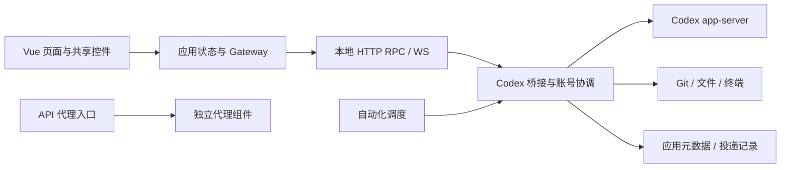
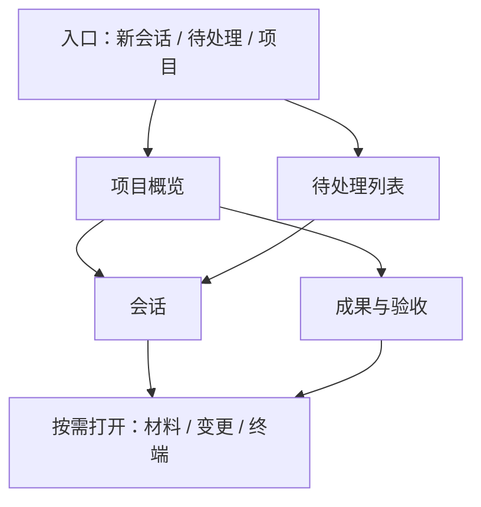

# CodexApp 0.3 开发展望与方向选择

0.3 最值得解决的问题，是让用户更容易掌握工作、处理结果和继续下一步。当前执行能力已经较完整，可以围绕不同使用方式重新组织界面，也可以选择保持会话优先、集中改善长会话体验。是否大幅改 UI，应由选定的使用场景决定。

本文提供六种可独立选择的方向。**初步倾向先验证“项目交付工作台”与“异步监督”的小组合，同时保留“精简会话客户端”作为低成本替代。** 这是基于代码与项目使用环境的推断，尚无用户行为数据证明，也不是确定的 0.3 路线图。文中的需求、门槛和工作包均待方向选择后进入具体设计。

## 1. 文档范围与依据

| 项目 | 说明 |
| --- | --- |
| 版本安排 | 0.2.17 为当前基线；先用 1—3 个小版本收集反馈、补少量功能和修复 UI，再进入 0.3 |
| 本文用途 | 比较产品方向、功能需求、UI 形态、技术代价与验证方法 |
| 配套文档 | [0.2 后续小版本候选与收口计划](20260912-0002-codexapp-0.2后续小版本候选与收口计划.md) |
| 用户参考材料 | [《Codex WebUI 功能规划说明》原文](references/20260912-0001-codexapp-灵感参考原文.md)，原文日期 2026-09-10、基线 0.2.14；按原样保存，仅作为灵感，不继承其中的优先级 |
| 本地查证 | 2026-09-12，读取 0.2.17 源码、README、版本说明、相关实施文档与 UI 约定 |
| 外部查证 | 2026-09-12，阅读六个项目的官方文档或官方仓库；没有安装、运行或横向性能测试这些产品 |
| 验证边界 | 本次是文档工作。未启动候选、调用真实模型、修改运行配置或执行发布；历史验收数据均注明来源，不代表本次复测 |

规划暂按个人维护、可信私有网络、自托管执行、多设备访问的现实条件估计。不以新增专职团队、常驻运维人员或云服务预算为前提。若目标用户转为小团队或公开服务，需要重新评估部署、身份和数据边界。

## 2. 0.2.17 的现实起点

### 2.1 已有能力与真正的增量

下表为源码与发布文档确认的能力，不把“文件存在”当作本次运行验收。

| 领域 | 已有能力 | 0.3 可讨论的增量 |
| --- | --- | --- |
| 会话与输入 | 流式回复、历史分页、标题/正文搜索、按回合分支、置顶/归档、草稿保存、队列、引导、发送核对、斜杠命令和保存的提示词入口 | 跨会话导航、消息级定位、来源明确的工作材料、长会话阅读组织 |
| 执行与状态 | 原生 Goal、上下文压缩、子任务、审批、异步提问、未回答问题固定区、完成蓝点与列表 | 跨会话待处理入口、来源可追踪的状态汇总、任务交付是否通过验收 |
| 项目与 Git | 项目与项目外会话、项目 ZIP、附加工作目录指引、worktree、分支/commit 查看 | 稳定项目标识、项目结果汇总、会话与工作目录/产物/验收的关联 |
| 变更审阅 | `ReviewPane.vue` 与 `reviewGit.ts` 已支持工作区/基线分支/commit 差异，以及按整组、文件、hunk 暂存、取消暂存和撤销 | 审阅意见回送、基线与证据的关联、区分用户已有修改和本次执行修改；基础 diff 无需重做 |
| 工具与运行 | 应用终端、原生后台终端、Hooks 观察、技能/插件/MCP、能力检测 | 跨会话运行归属、端口/产物导航、统一但有界的诊断入口 |
| 账号与连接 | 独立认证与账号执行协调、额度展示、自定义连接、动态模型能力、可选定时激活 | 配置生效范围、实际执行身份与失败原因的解释；不是新增模型下拉框 |
| API 与自动化 | 独立 API 代理组件、Key/路由/用量；持久自动化定义、运行历史、调度与有界执行 | 请求关联诊断、运行结果验收、有限事件触发与外部工作流连接 |
| 多设备体验 | 桌面/平板/手机布局、中英文、主题与外观、PWA 基础、通知设置与 Telegram 免打扰 | 手机处理等待项、离开页面后的可靠恢复、通知深链与处理状态同步 |

特别注意三个边界：附加目录目前主要写入项目 `AGENTS.md`，不等于多根文件树或自动挂载；PWA manifest 与 Service Worker 不等于已具备完整离线操作或后台推送；自定义模型连接不等于支持另一套 Agent 运行时。依据为 `README.md`、`docs/RELEASE-0.2.17.md`、`src/server/projectDirectories.ts`、`src/components/content/ThreadComposer.vue`、`src/components/content/composerCommands.ts`、`public/sw.js` 等。

### 2.2 当前架构适合怎样演进

前端为 Vue 3、TypeScript、Vite，服务端以 Node.js 承载本地 HTTP/WS 接口，桥接 Codex app-server，另有 API 代理与终端等独立执行组件。现有 Gateway、协议归一化、账号协调器、投递存储和自动化模块是可复用基础。

图中为职责示意，不表示所有接口都经过同一个函数，也不表示应用拥有上游的全部状态。

本次对 `src` 下 `.ts/.vue/.css` 排除 `*.test.ts` 后计数：224 个文件、71,581 行，含类型与翻译文件。以下为基线提交的静态测量：

| 文件 | 行数 | 与规划有关的观察 |
| --- | ---: | --- |
| `src/App.vue` | 6,229 | 同时组织侧栏、多个路由表面、账号区、全局窗口和业务动作 |
| `src/composables/useDesktopState.ts` | 5,843 | 承担会话列表、选中会话、通知处理及同步等多项状态职责 |
| `src/components/content/ThreadConversation.vue` | 5,186 | 消息、工具、媒体与运行状态等丰富内容集中，迁移需保持消息身份与滚动行为 |
| `src/api/codexGateway.ts` | 3,603 | 已有适配层，但业务域较多，可按领域分拆 |
| `src/server/codexAppServerBridge.ts` | 9,753 | 桥接与多个服务域交织，运行时改动容易扩大验证范围 |

`src/router/index.ts` 中主路由使用 `EmptyRouteView`，页面由 App.vue 根据路由组织；App.vue 已用 `defineAsyncComponent` 加载聊天、终端、审阅、扩展、API、自动化等组件。因此问题是**路由、状态与业务职责尚未充分分离**，不能描述成“没有路由”或“没有懒加载”。行数说明变更范围较集中，不直接证明页面卡顿。

[0.2.17 公开发布交接](20260911-0010-codexapp-插件工具栏间距与重新发布准备.md)记录主入口 JS 为 815.25 kB、gzip 258.55 kB，并保留大分块提示。这是历史构建证据；本次未重新构建，未测当前启动时间、长会话渲染时延或实际请求数。UI 重构应补这些基线，不能仅凭文件行数承诺性能提升。

### 2.3 本项目应继续保留的基础

- 保持 Codex 原生执行语义：发送确认、回合结束、Goal 完成、用户验收是不同事实。
- 复用已建立的稳定投递 ID、结果不明先核对、账号执行归属和有界资源池。
- 保留本地项目及项目外会话，允许临时问题直接开始，不强制建立任务、知识库或看板。
- 沿用共享 UI 组件、主题 token、中英文术语和跨版本缓存恢复机制。
- 继续以可独立备份的本地数据、自托管执行和现有私有网络访问为基础。

## 3. 其他 WebUI 的参考价值

这里比较的是“用户如何完成工作”以及实现这些交互需要什么边界。官方自述可用于确认设计和能力，不能代替独立的稳定性或安全性验收；下表最后一列为对 CodexApp 的推断。

| 项目 | 查证到的能力/架构 | 对 CodexApp 的启发与适用限制 |
| --- | --- | --- |
| OpenCode Web | Web 管理会话与服务器，TUI 可以连接同一服务；服务端提供 OpenAPI 3.1 与事件接口。[Web](https://opencode.ai/docs/web/)、[Server](https://opencode.ai/docs/server/) | 客户端围绕清晰的服务契约组织。可参考能力目录和多客户端状态边界，不需要因此替换 Codex 引擎 |
| OpenHands | Agent Server 以 HTTP/WS 管理远端会话及文件/命令操作，Workspace 承担执行环境；官方前端架构也区分展示、Agent Server 与自动化服务。[Agent Server](https://docs.openhands.dev/sdk/guides/agent-server/overview)、[前端架构](https://github.com/OpenHands/OpenHands/blob/main/docs/architecture.md) | 环境归属与界面职责要明确。容器环境是有成本的可选运行能力，不能靠页面上的“只读模式”替代执行约束 |
| Vibe Kanban | 工作空间与代码审阅是核心组织方式，支持差异内联意见并随消息反馈给 Agent。[审阅流程](https://www.vibekanban.com/docs/reviewing-code)、[Changes Panel](https://www.vibekanban.com/docs/workspaces/changes) | 适合参考“修改—审阅—反馈”的闭环，本项目已有 diff 操作，应补反馈关联。其维护状态与云服务变化见下段 |
| Open WebUI | Workspace 管理模型、知识、提示词、技能和工具；Notes 让内容独立于会话；开发文档描述 SvelteKit 与 FastAPI 分离。[Workspace](https://docs.openwebui.com/features/workspace/)、[Notes](https://docs.openwebui.com/features/notes/)、[开发架构](https://docs.openwebui.com/getting-started/advanced-topics/development/) | 对研究、写作、资料整理有参考意义。知识目录、全文注入和检索是不同需求，不必一开始引入向量库 |
| LibreChat | Artifacts 为生成的页面、图表、Markdown 等提供独立视图；项目将共享 API 类型、服务端和客户端代码分包。[Artifacts](https://www.librechat.ai/docs/features/artifacts)、[架构](https://www.librechat.ai/docs/development/architecture) | 可以独立组织成果预览和应用协议。交互式 HTML/JS 预览另有运行依赖；本项目可先做本地文件成果导航 |
| Happy | 官方仓库将移动/Web 客户端、CLI 与同步服务分开，强调远程接管和权限/错误通知；后端文档描述 HTTP 与实时通道。[官方仓库](https://github.com/slopus/happy)、[后端架构](https://github.com/slopus/happy/blob/main/docs/backend-architecture.md) | 手机的核心价值可能是及时处理等待项。可参考跨端恢复，不必复制其云中继及整套部署设施 |

Vibe Kanban 官方于 **2026-04-10** 宣布关闭背后的 bloop 公司，项目转向开源社区维护；公告区分继续工作的本地 workspace 与计划撤除的远端服务。本次没有验证远端撤除的实际进度。因此它是本地交互的参考案例，旧文档中的云看板/组织能力不应直接视为当前可用服务。[官方公告](https://www.vibekanban.com/blog/shutdown)

这些项目并没有指向唯一答案：OpenCode 更适合参考客户端与服务契约，Vibe Kanban 强调交付审阅，Happy 强调移动接管，Open WebUI/LibreChat 强调知识与成果。CodexApp 应选择最频繁的工作场景，再取相应设计。

## 4. 六种可选的 0.3 方向

复杂度以完整最小版本估计：M 表示多个现有模块联动，L 表示涉及新对象和持久化，XL 表示跨运行时/协议及更大兼容矩阵。它们不是工期承诺。各方向的“首版”只在该方向被选择时成立。

### A. 精简会话客户端：快速开始、清楚阅读、方便继续

适合大多数工作仍在单个会话中完成，主要不满是入口多、长记录难读、切换后难以找到位置的用户。0.3 可以选择小幅视觉调整与内部拆分，不要求增加项目首页。

| 需求 | 首版范围 | 可检查的结果 |
| --- | --- | --- |
| A1 专注会话模式 | 会话列表、正文和输入为主；低频管理入口收纳；工具详情按需展开 | 新会话无需先创建任务；输入和常用动作的操作步数不增加 |
| A2 会话内导航 | 按用户回合建立目录，跳到问题、失败或关键回复；搜索命中可定位 | 点击目录能定位准确的原始回合；旧页尚未加载时按需获取 |
| A3 当前材料面板 | 列出本次主动附加的文件/片段及固定材料，可在发送前修改 | 能区分“计划附加”与“已有读取证据”；固定材料可取消且刷新后仍准确 |
| A4 恢复阅读位置 | 保存当前会话的阅读锚点、展开状态；新内容不强制打断阅读 | 新回复到达时保留旧位置；主动返回最新后再跟随流式内容 |

可后续扩展消息书签、侧栏保存视图、命令面板。首版不加入复杂任务看板。主要改动是聊天展示、阅读状态和少量元数据，复杂度 M；若改消息虚拟化，须单独验证动态高度、代码/媒体展开与分页锚点，复杂度升为 L。

淘汰信号：原型没有减少操作或阅读中断，只增加了新的模式开关。与其他方向的关系：A 的聊天核心可以复用，但不能同时维护两套消息渲染与投递逻辑。

### B. 项目交付工作台：从执行过程走到可验收结果

适合跨多个会话、worktree 或多天完成开发、维护任务。典型流程是进入项目了解现状，打开相关会话，审阅结果，再记录验收与下一步。

| 需求 | 首版范围 | 可检查的结果 |
| --- | --- | --- |
| B1 项目工作台 | 当前目录/分支、活动会话、待处理项、最近产物和下一步；非 Git 项目也可用 | 不读所有会话正文即可形成摘要；点击对象回到原始来源 |
| B2 变更审阅闭环 | 复用 ReviewPane，添加带文件、hunk 和基线标识的意见；用户选择后送入原会话 | 意见绑定所见代码；文件已变化时提示过期，不对错位行静默应用 |
| B3 交付清单 | 一个轻量工作项可关联会话、执行、目录、测试证据与产物；人工标记验收 | 模型回复完成不会自动把未检查的验收项改为通过 |
| B4 交接摘要 | 从用户选择的会话/文件生成目标、已确认事实、证据、未决事项和下一步；可编辑保存 | 新会话可引用同一摘要；能回溯来源，未验证结论有明确标识 |

最小版允许“一个工作项关联多个会话”，先用列表即可，不要求拖拽看板、负责人、依赖图或排期。首版产物是原文件的索引和版本信息，不能复制出第二套项目文件真相。

复杂度 L。关键依赖是项目稳定身份、目录与 worktree 的关系、证据关联。**当前工作区 diff 不等于某个 Agent 的全部改动**：共享目录下用户和其他进程的修改可能混在一起。任务级归属需要独立 worktree 或明确的开始基线、快照和变更证据；证据不足时只展示“当前工作区变化”。

淘汰信号：用户仍从侧栏直接打开会话，工作台主要被当作装饰；或者验收清单的维护成本超过交接节省的时间。此时可以仅保留审阅反馈和交接功能，收缩为 A 的增强。

### C. 异步监督与移动优先：打开即知道哪里需要处理

适合 Agent 在服务器上持续工作，用户经常离开页面、从手机回来看进展的场景。UI 的重点是“需要我做什么”，而非把桌面所有面板缩小。

| 需求 | 首版范围 | 可检查的结果 |
| --- | --- | --- |
| C1 待处理收件箱 | 汇总审批、阻塞/非阻塞问题、失败和未查看完成项；按类型区分 | 完成蓝点继续保持现有语义；审批与提问不因“全部已读”而被提交 |
| C2 运行概览 | 展示正在运行、等待输入、状态待核对的会话和自动化；各自保留来源状态 | 不把 API 请求、Goal、后台终端算成同一种任务；同一执行不重复计数 |
| C3 跨端恢复 | 断线重连后先获取快照，再恢复订阅；已处理项跨设备同步 | 手机上已回答的问题在桌面收起；丢失响应后核对同一投递，不重复发起 |
| C4 通知定位 | 复用现有通知设置，通知回到对应会话/问题/运行记录 | 过期链接显示已处理或不存在；没有对象 ID 时不伪造深链 |

最小版可先在浏览器/PWA 完成，原生客户端取决于后续对通知、后台恢复和系统分享的实测收益。状态应带最后同步时间，断线页面不能显示成“系统空闲”。

复杂度 L，难点是多设备一致性、恢复与不同对象的状态语义，不是底部导航。无需新增云中继；继续使用现有私有网络。淘汰信号：等待处理并不构成实际瓶颈，或移动使用占比很低。此时可以把 C1 缩成桌面的待处理抽屉。

### D. 个人自动化工作台：让重复任务可检查、可接续

适合固定时间执行的资料处理、巡检、整理与开发维护；其价值来自明确输入、结果与失败原因，不能只增加更多触发按钮。

| 需求 | 首版范围 | 可检查的结果 |
| --- | --- | --- |
| D1 运行结果卡 | 关联实际会话、输出文件、执行配置快照和可选验收条件 | 原生回合完成但产物缺失时显示“待验收”或失败依据 |
| D2 有限事件入口 | 先支持一种经确认需要的触发源，带事件 ID、去重键与来源记录 | 同一事件重复到达不重复启动；过载可排队/拒绝且原因可见 |
| D3 人工等待节点 | 复用现有提问/审批入口，在明确检查点等待继续 | 超时不当作同意；重启后等待状态及对象关系仍在 |
| D4 配置预览 | 展示实际账号/连接、模型、目录、调度时区、并发和失败处理 | 保存前发现无效配置；称为“配置预览”，不承诺预测模型的所有读写行为 |

复杂度 L—XL。首版建议“现有自动化 + 一个事件来源 + 结果证据”，不建设通用可视化 DAG 引擎。多步骤编排可评估对接现有外部调度工具；只有同一组稳定流程反复需要应用内编排时，再引入节点和依赖。

自动重试必须按副作用分类：状态查询可重试，结果不明的模型发送、写文件、外部发布不能盲目重放。补偿操作也应有实际可恢复条件。淘汰信号：主要工作仍是临时对话，新增流程编辑器很少被使用。

### E. 项目知识与成果工作台：让资料和结果跨会话复用

适合调研、写作、文档、运维知识和资料整理，尤其适合既有 Markdown/Obsidian 文档体系。这个方向可以使 0.3 服务更广泛的个人工作，而不只围绕代码差异。

| 需求 | 首版范围 | 可检查的结果 |
| --- | --- | --- |
| E1 项目资料架 | 以实际文件为基础管理常用材料，按次选择引用；显示来源、路径与更新时间 | 新会话可复用材料；移走/修改原文件后可发现失效，不静默引用旧副本 |
| E2 独立成果区 | Markdown、图片、报告与其他文件可预览、定位、下载；关联生成会话 | 成果链接指向实际文件；文件缺失、被覆盖或版本变化时状态明确 |
| E3 有来源的决策笔记 | 用户选择片段后形成候选摘要，编辑确认后保存，保留来源 | 未确认内容不会自动变成长期事实；修改时不覆盖用户原文 |
| E4 材料差异与交接 | 对比两个版本的文档，或把选定成果整理成新会话的交接材料 | 可追踪使用了哪一版内容；摘要与原文之间有返回路径 |

复杂度 L。先复用文件系统与关键词检索；有大量资料、检索效果的实际问题后，再评估全文索引/向量检索。AGENTS.md、技能、项目文档与运行时记忆各有归属，不能创建一个会自动覆盖它们的“万能记忆库”。

首版以文档/文件预览为主。交互式 HTML/JS 成果应单独隔离渲染，并明确外部资源与运行依赖；不能把模型生成的脚本直接放进拥有应用认证的页面上下文。淘汰信号：已有编辑器/Vault 已足够好，应用内编辑只增加双份文件和同步冲突。此时只做成果导航与引用。

### F. 多运行时客户端：把 UI 从单一 Agent 协议中分离

适合明确希望在同一界面运行 Codex 与另一套编码 Agent 的用户，属于产品定位变化。**多模型供应方、多个账号、多个服务器和多 Agent 引擎是四个不同维度**，当前自定义连接只覆盖其中一部分。

| 需求 | 首版范围 | 可检查的结果 |
| --- | --- | --- |
| F1 运行时能力契约 | 定义会话创建/恢复、输入、事件、取消、审批与文件结果的最小公共契约 | 每项能力有支持/不支持/未知状态；不支持 Goal 时不显示假按钮 |
| F2 第二运行时探针 | 仅接入一套有明确需求的运行时，与 Codex 使用隔离的配置/历史适配器 | 独立完成一次启动、提问、工具执行、取消和重连恢复 |
| F3 会话归属锁定 | 每个会话固定引擎、服务器与身份；切换引擎创建新会话或显式交接 | 旧会话不被静默送到另一引擎，不承诺原生历史可互相转换 |
| F4 兼容性矩阵 | 为各运行时维护版本与能力测试，公共 UI 仅使用已验证契约 | 升级其中一个引擎时，另一个引擎的发送/审批路径不受影响 |

复杂度 XL。Codex 原生 Goal、子任务、权限、压缩、插件和历史语义未必能一一映射，不能用统一聊天接口抹平差异。需先完成一个完整适配器探针，再决定是第二运行时、外部客户端连接，还是继续只维护 Codex。

淘汰信号：只有“以后也许支持”的想法，缺少实际引擎与任务；或者公共契约严重削弱当前 Codex 体验。此方向不宜与首次 UI 大改、存储迁移同时成为 0.3 首版主线。

## 5. 如何选择，而不是一次做完六条路线

### 5.1 方向比较

以下是规划估计，信心有限，应由 0.2 后续使用样本修正。

| 方向 | 主要收益 | UI 改动 | 新持久对象/协议 | 维护负担 | 适合成为主线的信号 |
| --- | --- | --- | --- | --- | --- |
| A 精简会话 | 减少阅读和导航摩擦 | 小—中 | 少量阅读/材料元数据 | 中 | 大部分工作停留在单会话，抱怨集中于密度和定位 |
| B 项目交付 | 降低跨会话接手与验收成本 | 中—大 | 工作项、证据与项目关联 | 中—高 | 经常找不到结果、修改来源、验收状态和下一步 |
| C 异步监督 | 缩短等待人工处理时间 | 中—大 | 统一摘要和处理游标 | 中—高 | 经常离开页面、多个任务等待、手机处理频繁 |
| D 自动化 | 重复任务更可控 | 中 | 触发、结果、步骤状态 | 高 | 有稳定重复流程及明确失败/重试痛点 |
| E 知识与成果 | 跨会话复用资料和结果 | 中—大 | 文件关联、来源、版本 | 中—高 | 非代码任务占比高，文档交接和材料重复输入频繁 |
| F 多运行时 | 同一客户端服务多套引擎 | 大 | 适配协议和隔离状态 | 很高 | 已确定第二套运行时且经常使用 |

API 调试/运行管理可作为 B、C、D 的配套模块；只有用户实际把本项目主要当作个人 API 调试入口时，才另行评估以此为主线。现有账号/代理能力不应自动把产品推向账号池运营或通用网关。

### 5.2 建议先比较的两种最小版本

**候选组合一：B 的轻量项目工作台 + C 的待处理入口。** 首版只交付项目摘要、待处理列表、复用的审阅面板及可编辑交接摘要。工作项先是轻量清单；不做 DAG、全面知识库、第二引擎或部署中心。其假设是：已有执行能力够用，用户最缺少跨会话的状态和结果组织。

**候选组合二：A 的精简会话 + E 的成果导航。** 保持会话为首页，改善长记录定位，在侧面显示实际文件成果与选定材料。其假设是：多数工作仍由用户直接驱动，增加工作台会徒增管理。

如果 0.2 期间的样本显示“离开设备后的漏处理”远多于结果管理问题，可以单独以 C 为主线；如果自动化或多引擎需求更明确，应重排方向，不需要坚持上述推荐。

### 5.3 选择方法与停止条件

在后续 0.2 小版本内，记录约 10—15 个典型任务样本，尽量覆盖开发、文档/维护、自动化、手机回访。记录的是任务类别、操作步数、等待原因和结果位置；正文、凭据与完整日志不作为默认采样内容。

使用相同任务测试两个低保真原型，例如：打开昨天的项目继续工作、找到某次改动及测试结果、处理另一会话的提问、从手机回答后在桌面继续。

建议的方向准入条件：

1. 至少三次真实发生的同类摩擦，而非只有一次“也许有用”的设想。
2. 对比现有界面，核心任务用时或操作步数下降，且常规新会话没有明显变慢。
3. 能使用现有执行链实现主要价值，或已用独立探针验证新增运行时能力。
4. 可以写出首版的排除项、验收方法和回退边界。

一次只选一个主线和一个小的配套能力。若原型不能体现收益，允许把 0.3 定位为体验与架构整理版；版本号不要求增加大型子系统。

## 6. UI 重构的三种幅度

### 6.1 三种信息结构

| 形态 | 导航组织 | 适用方向 | 主要取舍 |
| --- | --- | --- | --- |
| 会话优先 | 侧栏会话/项目，中间聊天，按需打开材料/结果 | A、轻量 E | 学习成本最低；跨项目状态仍需额外入口 |
| 项目优先 | 全局导航进入项目，项目内有概览/会话/成果，终端和 diff 按需打开 | B、E | 适合长期工作；临时会话入口必须始终可达 |
| 待处理优先 | 首页待处理/运行中/已完成，进入对象后再展示聊天或结果 | C、D | 适合异步监督；高频写作不能被仪表盘挡住 |

建议先选信息结构，再确定组件排列、密度、颜色与动效。没有证据要求 0.3 换 React、Svelte 或重做设计系统；当前 Vue 与共享组件已经能表达这些布局。

以“项目优先”为例，下图仅说明候选导航关系，不是待执行的页面设计：

### 6.2 桌面、平板与手机的交互约束

- 桌面保留一条明确主任务流；会话旁最多默认打开一个辅助面板，避免同时铺开日志、diff、资料和设置。
- 平板用可切换面板代替缩小三栏；横竖屏切换保持选择对象、草稿与阅读位置。
- 手机优先提供开始会话、查看状态、回答问题、审批和查看结果；复杂 diff 与终端全屏按需打开。
- 全局账号偏好与当前会话的实际执行账号/连接要分清；高级身份与资源细节进入详情。
- 收纳低频入口时保留可发现性：命令面板、设置分类和直接链接至少有一条稳定路径。
- 延续 AppDialog、AppPopover、AppSelect、AppButton、AppSwitch 和 `--ui-*`，中英文及浅深色同时设计。术语沿用会话/conversation、回合/turn、额度/quota、推理强度/reasoning effort。

### 6.3 UI 迁移不能丢失的状态

选中项目/会话、草稿及附件、队列与未知投递、未处理提问/审批、阅读位置、模型偏好、主题语言、完成标记、终端归属与运行记录，应有逐项迁移清单。页面刷新、前后退和跨设备返回属于核心验收，不是收尾美化。

## 7. 技术演进：先明确数据归属，再选择新对象

### 7.1 按依赖推进的工作包

| 工作包 | 内容 | 适用范围与结束条件 |
| --- | --- | --- |
| T1 页面与状态分离 | 按路由拆出 shell/页面；按会话、目录、账号、自动化分离状态与查询；沿用现有组件 | UI 大改时优先；路由往返不重复注册订阅、不重新提交任务 |
| T2 查询与事件归一 | 统一请求复用、取消、缓存 key、事件归一与失效范围，明确快照/增量职责 | 所有聚合页面；切换账号/项目后不会混用缓存或保留旧请求 |
| T3 最小关联模型 | 稳定项目 ID、目录/worktree 关系、执行摘要、来源引用；仅选中 B/E 时增加工作项或产物记录 | 新概览能解释每个字段的来源，不扫描全部历史拼表 |
| T4 新入口与视图 | 建立选中方向的项目、待处理或成果页面，动作调用现有业务接口 | 一个完整用户流程通过，再扩展其他页面 |
| T5 协议适配边界 | 从大桥接文件提取业务路由与适配器；原生字段留在协议层 | 按实际改动区域逐步做；不把拆完全部桥接代码设为 UI 开工前提 |
| T6 兼容与迁移 | 旧 URL、应用数据版本、能力检测、旧客户端提示、功能开关与退路 | 能用独立测试数据升级/重启/回退，保留原会话与投递身份 |

在单仓库、单服务进程中建立这些模块边界即可。只有部署或独立复用有实际需求时再分包/拆服务；事件总线、微服务、全量事件溯源、向量数据库都不是默认前置依赖。

### 7.2 不同对象保留自己的含义

| 对象 | 真相来源 | 应用可新增的内容 |
| --- | --- | --- |
| 会话、回合、工具、原生 Goal | Codex 运行时及原生历史 | 显示投影、关联索引；不能用 UI 自己的“完成”覆盖原生状态 |
| 项目、工作目录、worktree | 项目配置与实际文件/Git 状态 | 稳定关联 ID、显示名、迁移映射；目录更名有显式关联规则 |
| 自动化定义与运行 | 当前自动化存储与引擎 | 输入/配置快照、产物与验收关联 |
| 工作项 | 仅在 B 被选择后由应用持久化 | 目标、相关会话、证据、人工验收；不复制 Goal 的执行循环 |
| 待处理项 | 原始审批/提问/运行/完成标记 | 可重建的列表投影、已读游标与定位信息 |
| 产物 | 原始文件或外部对象 | 路径/版本/哈希/来源引用；索引失效可重新扫描确认 |

可先定义 `RunSummary` 作为只读展示契约：来源类型、来源 ID、项目/会话关联、原始状态、更新时间、详情入口及原生可用动作。它不是新的执行引擎。统一标题和筛选不等于统一取消/重试语义。

需要服务端持久化的是跨设备共享的处理状态、投递与明确保存的工作元数据；面板宽度、临时筛选等可留客户端。不要把账号机密复制进新增索引。

### 7.3 持久化与迁移取舍

现有应用状态使用分领域 JSON/TOML 与文件记录，可继续承载少量偏好或轻量索引。若 B/C/E 带来关系查询、分页、一致性更新和大量历史索引，再用同一数据集比较“保留文件存储”与“应用元数据使用 SQLite”等方案。数据库选择应解决已测到的问题，不能只是为了重构显得彻底。

若引入新存储：保留来源 ID；迁移可重复执行；新增数据带 schema version；先备份与只读预演，再写新格式；验证旧会话、未确认投递、完成标记和自动化定义。应用数据库与原生 Codex 数据分开，NAS 文档挂载不自然成为数据库放置位置。

回退 UI 与回退数据是两件事。首轮尽量采用新增文件/表和可撤销入口，旧路径继续读原有数据；出现新写入后不能直接恢复整个旧数据目录，覆盖认证、会话、已提交消息或用户刚完成的工作。

### 7.4 不能仅凭 UI 承诺的能力

| 设想 | 现实边界 | 可诚实实现的第一步 |
| --- | --- | --- |
| 完整 Context Inspector | UI 未必获得系统指令、最终拼接上下文与每类精确 token | 展示应用附加材料、已知配置和工具读取证据；分为“已确认/估计/不可见” |
| 精确的上下文占用饼图 | 已有总量/估计不自动提供按材料分类的真实账单 | 保留原生统计；估算必须标明算法和误差，资料列表先于饼图 |
| 一键恢复任务 | Git 无法恢复外部 API、数据库、未跟踪文件或执行中进程 | 描述可恢复文件范围；操作前检查当前变化，保留用户修改 |
| 真正只读的 Plan/Reviewer | 提示词和模式名本身不保证文件/网络权限 | 显示实际运行时授权能力；强制隔离依赖经过测试的运行边界 |
| 所有后台进程的准确归属 | 外部终端、继承进程、PID 复用和历史缺口可能无法关联 | 区分“应用创建/原生报告/观察到/归属未知”，停止前核对具体对象 |
| 无副作用 Dry Run | 模型未来选择的工具/文件无法完整预知 | 只做配置校验，或在明确隔离副本内运行并标注范围 |

## 8. 0.3 应有的验收与性能目标

下面是建议目标，尚未测得当前基线；方向立项时确定最终阈值。测量 UI/本地同步与真实模型首 token 分开，避免把上游波动误归因于前端。

| 检查 | 建议方法与目标 |
| --- | --- |
| 使用收益 | 相同典型任务、相同设备比较现状与原型，记录完成时间、操作步数、返回查找次数；至少证明主线解决的实际摩擦减少 |
| 请求与阻塞 | 同一 key 同时最多一个在途查询；概览初载不逐一 `thread/read` 扫所有会话；Git/文件查询有范围、超时、取消和分页 |
| 首屏与包体 | 冷/热启动分别测；首页实际加载 JS、API 体积和 p95 可交互时间以冻结的 0.2 基线为准，建议不恶化超过 10%；仅比较同样本同条件 |
| 长会话 | 用合成的 1,000 条消息、工具输出、代码和图片场景观察输入、滚动与展开；旧页按需读，不能靠一次全量载入改善检索 |
| 扇出和恢复 | 模拟多个活动会话、重复通知、断线、两个标签页；按订阅复用，连续刷新/前后台切换不产生重复回合和重复回答 |
| 缓存失效 | key 包含实际运行时/账号/项目及查询范围；切换后旧数据不串入；事件只失效相关对象，不能每个 token 触发全站刷新 |
| UI 兼容 | 中英文、浅深色、桌面及 375×812、768×1024；检验实际新页面、键盘焦点、触摸、长标题和刷新持久化 |
| 生命周期 | 进入/离开新页面 20 次，订阅和全局监听回到基线；未启用的聚合/诊断模块不常驻采集全量日志 |
| 数据恢复 | 独立数据副本完成升级、重启、失败恢复与兼容测试；重启后的 `unknown` 仍待核对，不能自动认定为空闲或完成 |

实施时沿用仓库 profiler、相关单测与手工测试文档。改变解析/文件链接时执行 TestChat；涉及包、启动或模块加载时增加构建、安装与 CJS/PTY 检查；触及 Provider/认证链时按项目规定做隔离运行验证。文档工作本身不需要这些运行时测试。

## 9. 从 0.2 收口到 0.3 的阶段安排

| 阶段 | 产出 | 进入下一阶段的条件 |
| --- | --- | --- |
| 0.2 后续 1—3 版 | 已复现 UI 问题修复、少量候选功能、结构化反馈样本 | 无已知阻断缺陷；未选功能能独立留到后续，不要求清空愿望清单 |
| 方向验证 | 两种低保真流程、需求证据、维护成本与首版边界 | 选定一个主线及有限配套，明确放弃项 |
| 0.3 原型 | 一条端到端流程、最小数据模型、性能/恢复基线 | 新入口有实际收益，旧投递/审批/草稿等核心不回退 |
| 0.3 alpha | 按选定方向补齐必要场景，渐进替换页面 | 新旧路由与数据兼容，完成对应隔离验收 |
| 0.3 beta / 收口 | 可恢复迁移、使用说明、已知限制及发布产物 | 通过核心回归；更新与切换按既有流程单独执行 |

不在本文预先锁定日期或承诺六个方向的开发量。UI 可先新路由试用，也可复用原 shell 增加一个入口；共享执行状态和事件订阅应只有一套。迁移期间不要同时维护两套业务状态作为长久方案。

## 10. 建议暂缓的扩张

- **通用多用户/RBAC/公开分享平台**：当前主要是个人本地服务，先确认新的部署对象与协作需求，再改变身份和数据模型。
- **完整 Agent DAG、自动分配模型与自动扩张并发**：先证明任务拆分收益和恢复语义；不能用增加执行量替代交付质量。
- **独立 Secrets Vault 与全宿主进程管家**：先复用现有凭据与工具配置，限制到有来源、可解释的对象管理。
- **完整 IDE、浏览器自动化工作室与云开发环境**：文件编辑、终端、预览各有成本；优先修通真实流程所需的部分。
- **自动升级/生产部署中心**：可以提供只读版本、兼容性与候选信息，但现有 prepare、空闲检查和切换职责需要保留，不能简化为一个立即执行按钮。
- **全域全文检索、终端输出永久索引、精确额度预测**：需要数据量、保留策略、准确性和采集开销证据；先做有范围的查找和实际窗口展示。

账号、API 与自动化规划继续遵守当前 README 的使用边界，不以切换、分摊或重试规避上游限制。此处沿用项目既有要求，不提出额外账号运营产品。

## 11. 与参考材料的取舍关系

| 参考材料主题 | 本文处理 |
| --- | --- |
| 项目首页、对象关联 | 作为 B 的方向选择，不设为所有路线的 P0 前置 |
| Context Inspector、Working Set、Memory | 拆成可确认材料 A3、资料架/来源 E，以及协议不可见边界 |
| Change Set、Checkpoint、Commit 关联 | 先确认已有审阅能力；新增需求落在反馈/来源/验收，恢复另做范围设计 |
| Active Runs、Timeline、移动监督 | 收敛为 C 的待处理与运行摘要，详情按需；不要求收集全站完整事件 |
| Agent DAG、任务板、自动化流水线 | 分开 B 的轻量交付清单与 D 的工作流，DAG 留到实际依赖明确后 |
| API Playground、请求日志、Environment Hub | 可选配套；诊断和操作能力分期，不能因都有“状态”就并成一个控制器 |
| Secrets、权限、多用户、Release Center | 作为触发条件明确的后续议题，保留执行层与部署边界 |
| 参考材料未展开的取舍 | 增加保持会话优先、成果导向、第二运行时、框架/存储选择和方向淘汰条件 |

## 12. 查证索引与后续交接

| 依据 | 用途 |
| --- | --- |
| `package.json`、`README.md`、`docs/RELEASE-0.2.17.md` | 版本、技术栈、当前能力与发行边界 |
| `src/router/index.ts`、`src/App.vue`、`src/composables/useDesktopState.ts` | 路由组织、页面承载与状态集中情况 |
| `src/api/codexRpcClient.ts`、`src/api/codexGateway.ts`、`src/api/normalizers/v2.ts` | 同源 RPC、事件与协议归一化 |
| `src/server/codexAppServerBridge.ts`、`src/server/accountAuthCoordinator.ts`、`src/server/accountResourcePool.ts` | 本地桥接、执行归属与资源边界 |
| `src/components/content/ReviewPane.vue`、`src/server/reviewGit.ts` | 已有 diff 和整组/文件/hunk 操作，避免重复列为新需求 |
| `src/components/content/composerCommands.ts`、`src/components/content/ThreadComposer.vue`、`src/components/sidebar/SidebarThreadTree.vue` | 已有命令、提示词入口、草稿与置顶 |
| `src/server/automationStore.ts`、`src/server/deliveryStore.ts`、`src/server/threadCompletionList.ts` | 现有存储与数据语义 |
| `public/sw.js`、`public/manifest.webmanifest`、`src/composables/useFeedbackDiagnostics.ts` | PWA 与反馈能力的实际范围 |
| [共享 UI 约定](20260906-0016-codexapp-UI组件与代码风格约定.md)、[中英文术语](20260910-0013-codexapp-中英文术语约定.md) | 后续交互与组件设计约束 |

源码结论固定到本文基线提交，实施前应重新核对。外部来源已在对应事实处链接；未使用星数、营销口号或未经验证的功能榜作为选型依据。

后续接手时，先阅读配套 0.2 清单收集到的样本，再选择主线、最小范围和验收条件。本文已完成方向比较与源码/资料核对；尚未完成产品方向选择、交互原型、运行时探针或实施验收。
