# CodexApp 0.2.18 修复与 59001 开发验收

## 范围与实现

本轮用户授权在 59001 开启 0.2.18，修复 0.3 展望配套小版本计划中的 R01/R02，增加会话功能提示关闭，并将 S05 做成轻量“已保存”。随后另做 0.3 UI 草案。

| 项目 | 结果 |
| --- | --- |
| R01 反馈入口 | 旧邮箱和 mailto 构造已移除。现有入口打开共享 AppDialog，预览/编辑/复制最小报告；用户可自行打开当前项目 Issues |
| 采集范围 | 只导出版本、时间、页面类别、主题、界面语言、视口、错误类别和 HTTP 状态。最多 12 条诊断；不读页面文字或存储，不导出原始错误、路径、URL、会话正文 |
| R02 额度文案 | QUOTA_EXHAUSTED 保持不变，文案改为查看实际额度与恢复时间、恢复后再试；保留认证/网络等分类及原调度行为 |
| 功能提示关闭 | 历史操作、队列功能错误和命令错误增加 ×，只收起本次提示。再次发生错误仍可显示；不修改持久失败回合或审批状态 |
| 命令反馈 | `/copy` 等直接命令的功能错误有独立输入框上方提示；按会话上下文隔离，旧会话异步结果不会写到其他会话 |
| S05 | 现有 localStorage 写入成功后显示轻量“已保存”，清空后消失；失败显示“保存失败 / 复制草稿”，复制不可用时选中输入。未增加存储动作、网络请求或保存流程 |

草稿文字复制不备份附件二进制；附件仍沿用已有持久化引用。同步存储没有额外引入“保存中”的人工延时或动画。

## 开发环境

- 分支：`feature/0.2.18-development`，从含 0.2.17 及 0.3 初稿的当前工作树建立。
- 候选：`http://192.168.50.46:59001/`，当前构建 `dist-cli/index.js`，独立 `CODEX_HOME=/home/docker/codexapp-dev-0218/codex-home`。
- 4173：当前仓库 Vite，独立 `CODEX_HOME=/home/docker/codexapp-dev-0218/verification-home`。
- 两个环境均未复制生产认证、会话或账号；目前候选为未登录的新开发环境。未调用真实模型。
- 5900 原服务 PID 3840130 保持不变；本轮没有发布、合并或生产切换。

启动命令：

```bash
CODEX_HOME=/home/docker/codexapp-dev-0218/verification-home pnpm run dev --host 127.0.0.1 --port 4173
CODEX_HOME=/home/docker/codexapp-dev-0218/codex-home node dist-cli/index.js --port 59001 --strict-port --no-password --no-open
```

运行日志在 `/home/Code/codexapp/output/0218/vite.log` 和 `candidate.log`。后续重建前先确认开发候选空闲；此运行方式直接读取仓库 dist，不是生产发布目录。

## 验证

- `pnpm run build`：通过 Vue 类型检查、前端构建和 CLI 构建。
- `pnpm exec vitest run`：688 项通过、1 项 opt-in 跳过。补充报告隐私/预览/边界和额度分类回归，保留 fetch 安装失败保护测试。
- 既有 `useUiLanguage.test.ts` 缺 document 事件桩，且仍预期 Worktree 不翻译；对照当前源码后修正测试，产品翻译逻辑未变。
- `node -e "require('node-pty');console.log('node-pty spawn:',typeof require('node-pty').spawn)"` 输出 `node-pty spawn: function`。
- `node dist-cli/index.js --help` 出口码 0；CLI 是 ESM，使用公开 CLI 入口烟测。未额外重测真实 PTY 创建。
- 4173 浏览器：草稿刷新恢复；模拟 QuotaExceededError 后内容保留及复制入口；技能接口合成 500 后从实际反馈入口打开报告，检查不含草稿或错误原文；明暗主题通过，未出现页面异常。
- 4173 功能提示：新会话选择 `/copy` → 功能提示 → 点击 × → 提示消失且草稿保留 → 再次操作提示重新出现，明暗主题通过。
- 59001 实际构建：同一命令提示关闭、草稿保存与刷新恢复通过，1440×1000、375×812、768×1024 明暗主题无横向溢出。
- 候选 idle 检查：activeTurns、queued、pendingApprovals、apiConnections、apiActiveRequests、backgroundThreads 均为 0。

浏览器使用 Playwright CJS + `/snap/bin/chromium`：当前没有 Browser Use 工具，存储失败和 API 合成错误需浏览器注入/路由拦截；未更改真实账号配置。此任务未改变发送/回复、失败回合或认证执行语义，未重跑认证/provider Docker 矩阵。

原始脚本、JSON 和日志位于 `/home/Code/codexapp/output/0218/`，分别为 `ui.cjs/ui.json`、`notices.cjs/notices.json`、`candidate-ui.cjs/candidate-ui.json`、`all-tests.log`、`build.log`、`idle.log`。跨真实会话和队列编辑草稿的完整手工步骤已补入 tests，本次自动浏览器验证覆盖新会话刷新，没有声称完成全部历史/队列真实场景。

## 性能审阅

有效首页 profile：thread/list=1、thread/read=0、skills/list=1、额度读取=1、模型目录=1；总 API 15.1 KB，warnings=[]，无持续 Loading threads。报告：`output/playwright/browser-runtime-profile-home-2026-09-12T00-15-17-872Z.json` 及同名 trace/screenshot。

本轮提示和草稿状态仅响应已有状态，没有新增轮询、API、逐会话读取、Git/文件扫描或缓存失效。报告只在点击时读取小型界面元数据及最多 12 条诊断；原有 20 条诊断上限保留，删除了页面/存储遍历。草稿继续使用原 watcher 与同步存储，未优化既有大附件序列化成本。

主入口构建 816.28 KB / gzip 258.87 KB。仍有大分块提示；本次没有长会话渲染或真实项目规模下的计时结果。新增工作台草案无 API/模型调用，不代表未来工作台实现的性能。

## 截图

下图分别来自 `http://127.0.0.1:4173/#/skills?tab=skills` 和 `http://127.0.0.1:59001/#/`，等待 2.3 秒后拍摄。完整截图绝对路径前缀为 `/home/Code/codexapp/output/playwright/`，归档副本字节一致。

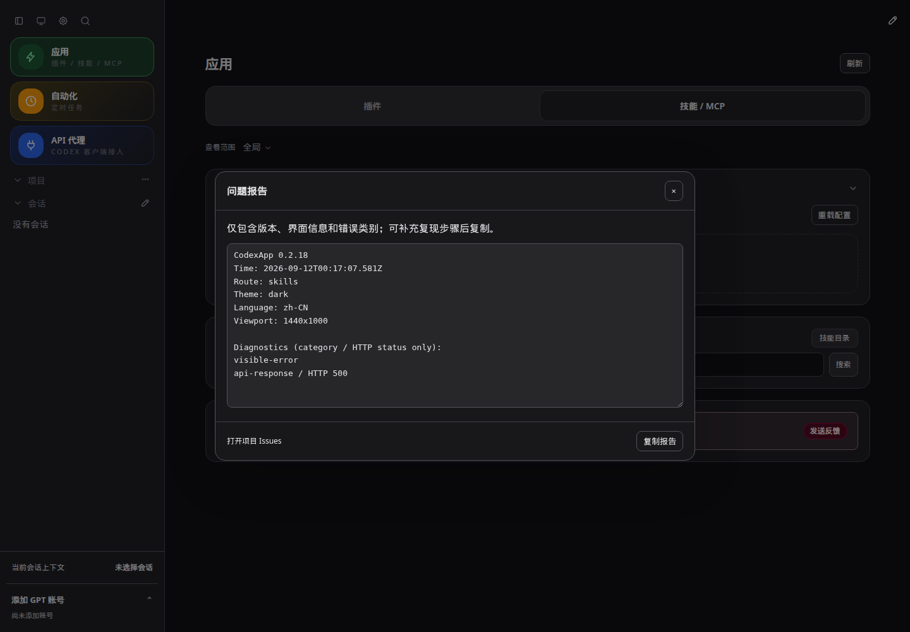
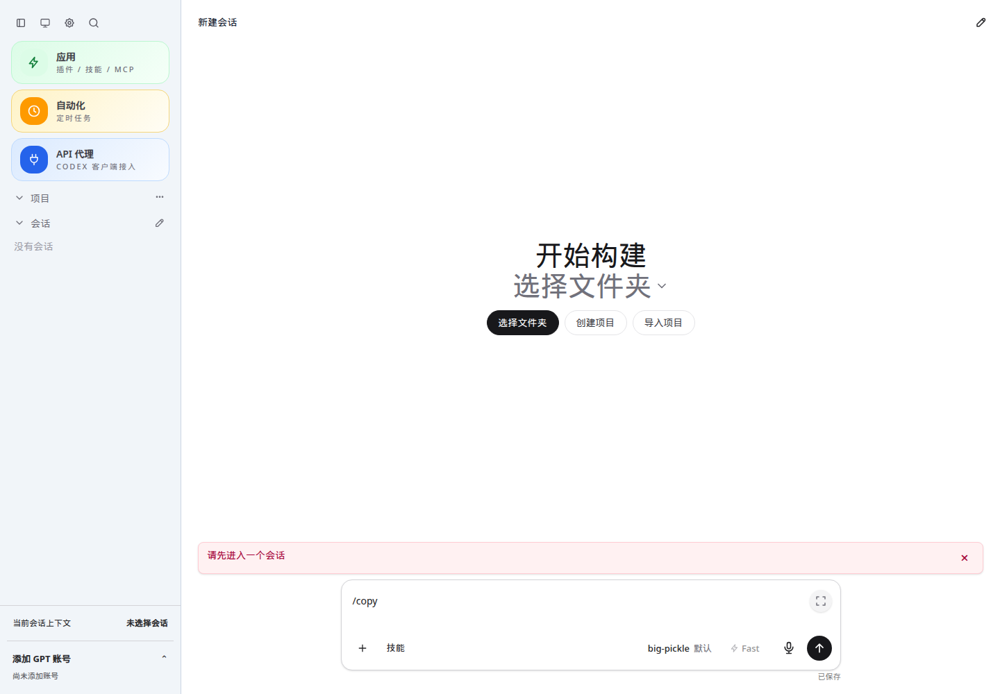
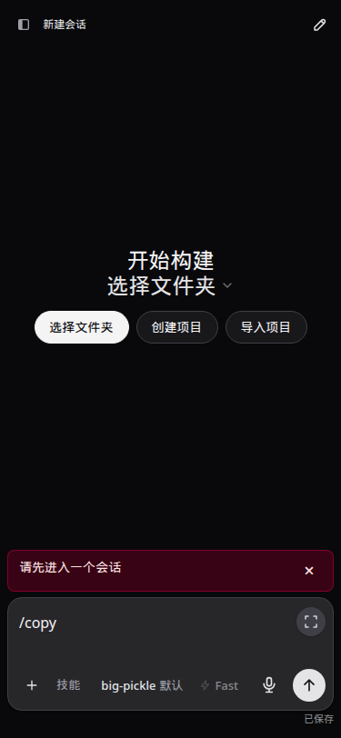
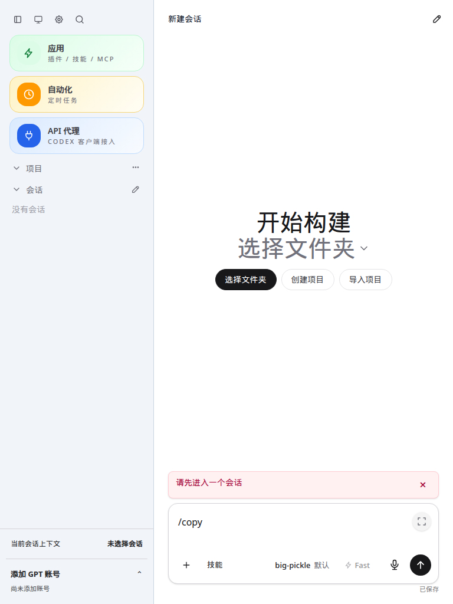

## 后续

[0.3 活跃项目工作台三版草案](20260912-0004-codexapp-0.3活跃项目工作台三版草案.md)已完成可点击原型。本轮没有把工作台改进并入实际 App 路由，待用户比较方向后细化。


## 后续界面精简与统一时间控件

按照用户两次截图反馈，四处统一为与自动化每日时间相同的带时钟图标原生 `type=time` 控件：POST 免打扰、Telegram 免打扰、每日账号激活、自动化每日时间。不是早期讨论的纯文本框；展示格式由浏览器地区设置决定，保存仍为 HH:mm。

移除了设置及账号弹出区的“尚无账号，请从此面板添加。”、无账号时的模型偏好差异提示、关于页工作树，以及自动化正常运行的调度器文案。异常、初始化和交接中的调度器提示继续保留。

免打扰时间框固定为 96px，激活时间为 104px；开关标签间距 12px，开关与时间组间隔 20px。窄屏自然换行。原生选择器保持可用，中文冒号及全角数字粘贴通过共享解析统一为标准时间；非法粘贴不覆盖已有值、不保存，自动化空时间也不能默默变成零点。

验证：`pnpm run build` 通过；时间解析、激活调度、Telegram 配置及翻译相关 4 文件 32 项测试通过。4173 中文覆盖 1440×1000、375×812、768×1024 明暗主题；59001 英文覆盖 1440×1000、375×812 深色，均通过原生控件类型、开关不重叠、窄宽度、零横向溢出、保存刷新恢复、中文冒号/全角数字归一化和非法粘贴无保存请求的断言。实际账号弹出区也核对空提示已移除。浏览器页面异常为零。

浏览器读写均使用合成配置和路由拦截，未触发真实通知或账号激活。32 项为本次相关测试，并非重复全量回归。原始证据位于 `/home/Code/codexapp/output/0218/time-ui.json`、`time-candidate-ui.json`、`time-tests.log`、`time-build.log`。

性能：不新增 API、轮询、全局监听或定时器；共享组件只处理自身原生事件，激活保存沿用原有 400ms 合并逻辑。4 个通知输入框和激活/自动化输入按现有页面生命周期挂载。主入口 816.68 KB / gzip 259.07 KB，相对上一版增加约 0.40 / 0.20 KB；未重测首页或长会话性能。未更改服务端运行逻辑。

下图来自 `http://127.0.0.1:59001/#/settings`，1440×1000、深色、中文浏览器地区，等待 2.3 秒后截取实际控件区域。原始绝对路径分别为 `/home/Code/codexapp/output/playwright/0218-time-quiet-detail.png` 与 `0218-time-activation-detail.png`。


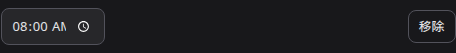


## 自动化每天运行支持多个时间

新建/编辑自动化的“每天”改为与账号自动激活一致的添加/移除时间列表，沿用带时钟图标的原生控件；最多 24 个时间，保存排序去重，空列表和非法时间拒绝保存。自动化详情显示选中的时刻。

单时间继续保存原来的单条 RRULE；多个时间在同一 rrule 字符串中保存为多行 RRULE，每行对应一个准确的每日时刻。服务端只接受最多 24 个可解析的每日时刻并合并其 next/previous 结果，不把小时和分钟交叉配对。仍是一个自动化定义和原有执行历史，不复制出多个任务。TOML 字符串回读保留多行规则；带其他日历约束、无法由每日列表完整表示的旧规则保持高级编辑，避免丢失约束。

验证：构建、类型检查、CLI `node dist-cli/index.js --help` 通过；3 个相关测试文件 43 项通过。覆盖 08:15/18:45 精确执行、去重、旧单规则和列表规则、TOML 回读、next/previous、空/非法/超限、24 时刻及 DST 跳过/重复小时。

4173 浏览器完成新建保存、刷新编辑、删除时间再保存；1440×1000、375×812、768×1024 浅深色均无横向溢出。59001 在 idle 检查为零后仅重启本次独立候选，实际创建 PAUSED 测试自动化，完成真实文件读取到编辑器再保存的验证；精确删除测试 ID，并移除本次临时目录，没有触发模型或调度执行。5900 未重启。

原始证据：`output/0218/multitime-ui.json`、`multitime-tests.log`、`multitime-api.log`、`multitime-candidate-ui.log`、`multitime-build.log`。性能审阅：前端添加/移除只更新本地数组，仍一次保存请求；不新增轮询、线程正文或文件扫描。服务端 next/previous 最多合并 24 个有界日历规则，沿用既有时区/DST 逻辑；已验证 24 个时刻连续求 next。主入口 818.19 KB / gzip 259.72 KB；未做大量自动化并发运行的负载测试。

下图为 `http://127.0.0.1:59001/#/automations` 实际编辑弹窗，1440×1000、深色，等待 2.3 秒后截取时间列表。原图绝对路径 `/home/Code/codexapp/output/playwright/0218-multitime-candidate-detail.png`。

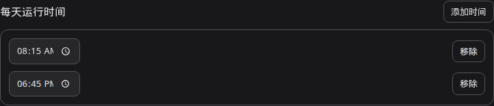


## 追加：侧边栏状态标签筛选

用户继续开发 0.2.18，新增项目/会话区顶部的“活跃中、未读、中断”标签。采用能力认证 tag 类似的紧凑外观，单选，再次点击取消；选中标签白字、白边框。无“全部”标签、无常驻说明文字。

筛选仅隐藏会话和无匹配会话的项目，保留项目归属、固定区、会话区、当前排序与折叠状态，不创建独立结果列表。内部始终保留完整 groups 和 pin 数据，避免被隐藏的固定会话遭清理。

- 活跃中：复用现有 inProgress 标志，不按账号占用或历史活动推断。
- 未读：直接复用蓝点。点击前记录暂留 ID，蓝点正常确认已读；当前会话继续显示，切到另一会话才移除。状态放在 App 层，手机收起侧栏导致组件卸载后仍有效。取消筛选清除暂留，刷新默认不筛选。
- 中断：只判定最后一回合的 failed/interrupted 与额度错误；成功、进行中、普通手动停止和认证错误不匹配。不使用自动续跑标记推断，不扫描历史中的任意错误。读取未知时展示可重试错误，不当作确定中断。

### 实现与调度边界

新增只读 `POST /codex-api/sidebar-thread-status`，每批最多 100 个 ID。服务端读取原生 `thread/turns/list`，`limit=1`、倒序、`itemsView=notLoaded`；没有全文、工具输出或图片内容。只对已结束的失败/中断回合补充同一回合的流错误，不能把已经成功的回合重新标成额度中断。

独立读取队列最多 4 个真实未结束 RPC，8 秒结束等待后仍保留底层占位，避免重试扩散。缓存最多 2000 项、30 秒，校验目录更新时间，并通过既有历史通知监听在新回合/完成/取消/状态变更时失效；没有增加全局通知订阅。前端取消过期请求并以 revision 拒绝迟到结果。全部、活跃中和未读筛选均不增加状态请求；中断按需加载，未引入定时轮询或账号切换、任务准入、投递与自动续跑状态变更。

原生接口不支持的会话不会退回全文加载；新建且第一条消息尚未提交、历史尚未落盘的会话按非中断处理。来自其他进程的变化依靠目录更新时间、重新连接/窗口聚焦及缓存过期复核；未声称离线页面仍具有实时状态。

### 验证结果

- `pnpm run build` 通过；`pnpm run test:unit`：107 文件通过、716 项通过、1 个原生激活用例按设计跳过。
- `node scripts/audit/0.2.18-sidebar-native.cjs` 通过：真实 CLI + 临时独立 home + localhost 模拟 Responses 服务，2 个本地请求，先额度失败再成功；最终回合 ID 更新，错误清空，返回 items=0。没有真实云端模型调用。脚本清理自身子进程、HTTP 服务和临时 home。
- `node -e "const p=require('node-pty'); console.log('CJS spawn:',typeof p.spawn)"` 返回 function；`node dist-cli/index.js --help` 退出 0。
- Playwright CJS 使用路由拦截建立虚构项目、蓝点、最终中断状态，因此按仓库规则直接使用 Playwright；真实侧栏完成标签单选/取消、未读 A→B 暂留、手机卸载后保留、固定项恢复、项目顺序和折叠状态保留及中英文验证，无 pageerror。
- URL `http://127.0.0.1:4173/` 及虚构 thread 路由；1440×1000、768×1024、375×812 均检查浅/深色，无横向越界，选中文字和边框均为白色。截图原件目录 `/home/Code/codexapp/output/playwright/`，文件名为 `0218-sidebar-filter-<宽度>-<light|dark>.png`。
- 实际 `http://127.0.0.1:59001/`（1440×1000）验证三个标签、点击取消与无页面错误；新状态接口空批次返回 200。截图仅保留标签，见下图。


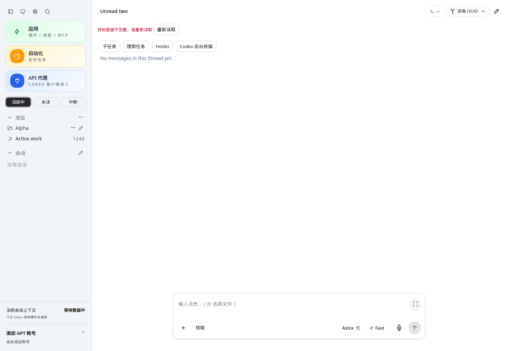

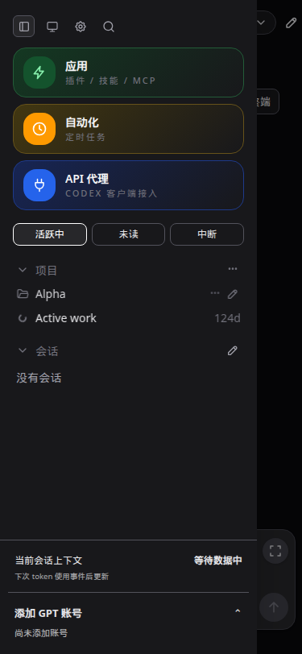

[UI 验证摘要](assets/0.2.18-sidebar-filter/ui-verification.json)、[性能摘要](assets/0.2.18-sidebar-filter/profile-summary.json)、[手工测试](../../tests/projects-sidebar-new-chat/sidebar-status-filter.md)。

### 性能与交付

真实 4173 空白测试 home 的启动 profiler：thread/list=1、thread/read=0、skills/list=1、quota=1、providerModels=1，总 API 14.8 KiB，warnings=[]。现有 free-mode/status 约 1.81 秒、provider-models 约 0.97 秒，为当前启动测量，不归因于标签筛选。虚构 UI 验证确认活跃/未读切换不触发新状态请求，中断切换不增加 thread/read；中断 RPC 不创建新会话 worker，不调用 thread/resume 或改变出口选择。未做大型真实历史库长期压测。

构建主 JS 822.28 kB / gzip 260.96 kB，CSS 446.92 kB / gzip 50.21 kB，CLI 942.89 KB；相对原 prepared 基线主 JS 增约 4.09 kB、gzip 增约 1.24 kB。没有新依赖。

59001 由独立 `codexapp-dev-59001.service` 更新，重启前确认所有活动为 0、自动激活关闭。新 PID 为 3328995；home 原地保留，没有复制生产认证数据。4173 验证服务独立由 `codexapp-filter-4173.service` 托管，测试 home 为 `/tmp/codexapp-filter-ui-home`，按普通开发验证约定保留，未来 prepare 阶段应收尾。

生产实查已由用户切至先前 prepared 的 0.2.18，PID 3209859；本轮没有重启或修改生产。**此前 f9a3b9494893 prepared 包不包含筛选功能**；需要发布此追加功能时重新 prepare，不能用旧包代表本次代码。

## 自定义连接会话恢复修复（POE）

### 问题与实现

自定义连接会话在 rollout 中保存 `custom_<storageId>`。切回普通账号后，会话 worker 按当前出口重新创建；原恢复请求却继承历史 provider，而当前 worker 没有该定义，导致 thread/resume 返回 502 / Model provider not found。

恢复和分支请求现在显式传入当前 worker 的 provider；发送前自动恢复也使用同一路径。自定义 worker 直接使用自己的连接 ID，普通 worker 通过原生 config/read 获取实际 provider。保留已有模型参数，不注册其他账号的 provider，不写认证，不更改账号选择、调度准入或全局阻塞规则。

### 已验证

- 59001 原报错会话恢复 HTTP 200。
- 使用现有 POE Responses 连接、模型 assistant，在专用测试会话发送一次短提示，收到 `POE_RESUME_OK`；自定义出口恢复与切回普通账号后的恢复均成功。恢复测试前连接选择，认证文件 SHA-256 前后一致（不记录摘要值或凭据）。
- 真实页面 `http://127.0.0.1:59001/#/thread/01a09568-55f5-7dc2-9322-462a81570673`，Playwright CJS，1440×1000：刷新后回复仍显示，provider 错误 0，pageerror 0；浅/深色截图仅截取测试回复，避免带出账号信息。截图原件 `/home/Code/codexapp/output/playwright/0218-custom-resume-light.png` 和 `0218-custom-resume-dark.png`。
- IPC 回归覆盖普通账号保持运行时，自定义自动化完成、切回普通账号恢复自定义历史、再次选择自定义连接恢复，以及切回普通账号后直接发送触发隐式恢复。原运行会话与认证不变。
- `pnpm exec vitest run`：107 文件、716 项通过，1 项原生激活用例按设计跳过。`pnpm run build` 通过。`node -e "console.log('CJS spawn:',typeof require('node-pty').spawn)"` 返回 function；`node dist-cli/index.js --help` 退出 0。

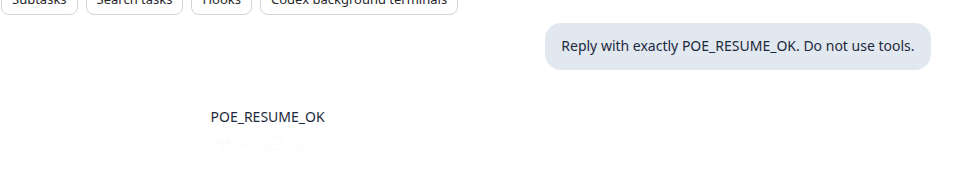

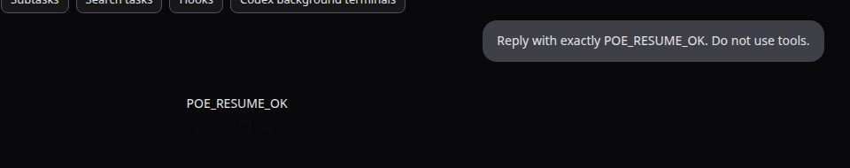

### 性能与范围

实测一次已加载自定义恢复 43ms，切换普通账号并重建 worker 的恢复 312ms；单次样本，不代表长期延迟分布。自定义恢复不增加 config/read，普通恢复多一个本地 IPC config/read；未增加 HTTP 轮询、全局订阅、历史全文扫描或跨会话扇出，没有缓存失效变化。CLI 943.54 KB，无新依赖，前端不变。

此修复仅更新 59001 开发服务，生产 5900 不变。此前 prepared 包不含本次修复，后续切换须重新 prepare。

### 打包容器补充回归与限制

执行 `pnpm pack --pack-destination /tmp`，用 Node 24 Debian slim 镜像安装 tarball 和 `@openai/codex@0.153.4`，镜像 `codexapp-resume-test:0.2.18`；构建命令：`docker build -t codexapp-resume-test:0.2.18 -f output/0218/Dockerfile.custom-resume /tmp/codexapp-resume-package`。容器均使用独立 `/codex-home`，启动命令 `codexapp --port 4190 --strict-port --no-password --no-open`，只绑定 localhost。

- 4192：无认证，config/read 返回 opencode_zen；切换 OpenRouter 后返回 openrouter_free，HTTP 200。未消耗 OpenRouter 真实请求。
- 4193：损坏 auth.json，config/read 返回 opencode_zen，HTTP 200。
- 4194：合成无效 ChatGPT 认证，发送被接受，但等待 45 秒仍 inProgress、无最终错误。此项未通过，不能声称无效认证错误刷新持久化或该场景重复错误数已验证；未进一步扩大远端重试测试。

上述容器已停止，临时 home 和镜像保留供复核；未挂载生产数据。POE 实际刷新验证通过不等于全部账号失效场景均获验收。打包镜像与最终源码只有恢复请求格式排版差异，无行为差异。

### 跨账号覆盖复核

补充 `providerResumeMatrix.test.ts`：普通账号 A/B、Responses 自定义连接 A/B、旧 Zen、旧 OpenRouter、旧自定义端点，共 7 个出口，49 个有向组合，分别验证显式 resume、fork 和发送前隐式 resume，共 147 条恢复路径。全部通过；相关 5 文件 45 测试通过，全量 108 文件 717 测试通过、1 项按设计跳过，vue-tsc 通过。

矩阵使用真实子进程 IPC 和临时文件，原生服务/远端厂商由 fixture 替代；直接设置隔离存储的选择状态，不能代替 HTTP 切换事务或全部真实账号远端认证验收。原有事务切换、忙碌阻塞、回滚、自动化隔离测试同时通过。POE 真实验证范围仍以上节为准。

结论：当前 worker provider 修复覆盖上述所有出口组合的同类缺失 provider 错误，不保证认证失效、额度不足、模型不兼容、已删除连接或执行中阻塞等其他切换问题消失。Chat-only 连接仍不可作为会话出口。本次仅添加测试和文档，未改运行时代码、未重启服务，无运行性能变化。

## 活跃标签与额度提示忽略

中文标签改为“活跃”。额度错误消息旁增加“忽略”按钮，点击后显示“已忽略”，可再次点击取消；不新增帮助说明。标记按会话 ID 与回合 ID 保存到服务端 `ignored-quota-errors.json`，刷新及其他浏览器重新读取后保留。原错误正文不删除；只排除匹配回合，后续新的额度失败仍可进入“中断”筛选。不会影响真实额度、切换阻塞、API、自动化或额度恢复续跑。

服务端状态读取仍仅检查最终回合，命中忽略标记后返回 false。保存成功发出独立通知，使侧栏缓存失效并刷新结果，不清空会话历史缓存。采用私有文件原子替换、串行写入，保存成功后才更新界面；取消标记删除对应项。

验证：全量 109 文件、718 项通过，1 项按设计跳过；build 与 CJS node-pty spawn / CLI --help 通过。新增回归验证并发标记、重建存储后保留、取消、其他会话隔离和下一回合重新入选。

UI 使用 Playwright 路由拦截构造额度历史，真实调用 4173 标记 API 与 SSE 通知，符合需修改页面数据时直接使用 Playwright 的约定。URL `http://127.0.0.1:4173/#/thread/quota-ignore-fixture`，1440×1000、768×1024、375×812 均检查浅/深色：忽略移除、取消恢复、刷新保留、活跃文案、无横向溢出与 pageerror。截图原件为 `/home/Code/codexapp/output/playwright/0218-quota-ignore-<宽度>-<light|dark>.png`。测试后取消样本标记。

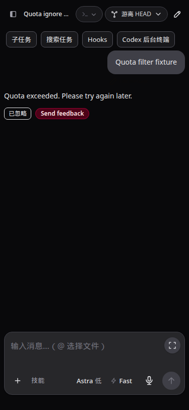

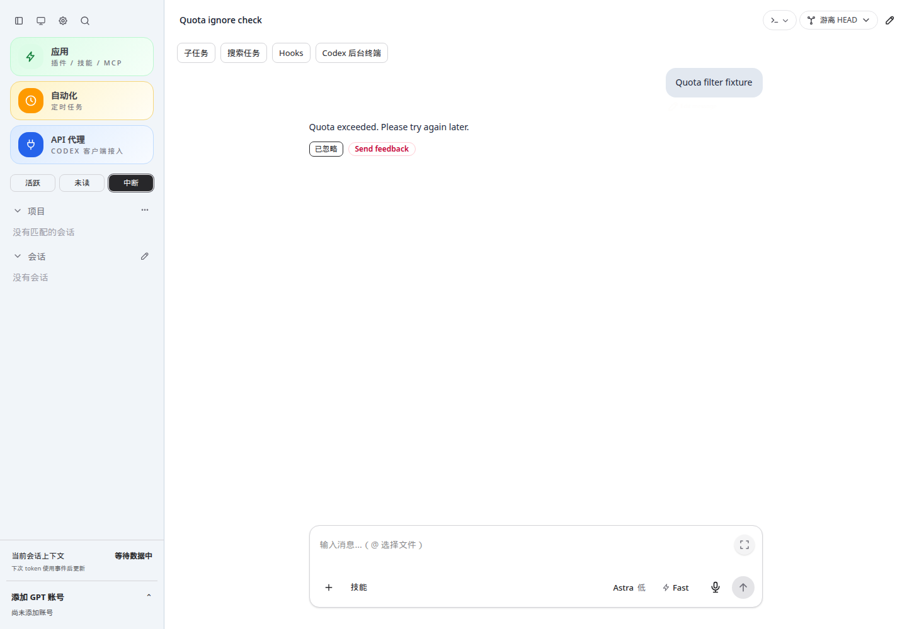

性能：只有正文存在额度错误时读取当前会话标记，普通会话不新增请求；无轮询，无会话列表全文读取。整套含刷新、忽略、撤销、再次忽略的 UI 流程共 5 次标记 GET；每次保存 POST 1 次，通知驱动重读一次。后端标记加载一次后在内存检查，不为每个会话重复读取文件，原有状态队列并发 4、缓存 2000 项不变。未做大量历史标记长期压测。CLI 946.69 KB，无新依赖。

59001 重启前确认所有执行、队列、审批、API 和后台线程为 0，更新同一隔离 home；5900 未改动。此前 prepared 包仍不包含追加修复，需重新 prepare。

## 账号切换后的会话恢复与 Terra 偏好污染

### 原因与修复

前次修复处理后端 provider 注册问题，但页面仍保留旧身份下的已恢复缓存、加载失败短期缓存及在途请求；切换成功后 refreshAll 可以直接复用旧状态。另一个独立问题是普通会话在当前账号不提供 Astra 时，把回退 Terra 写回会话选择，导致切回 A/刷新仍为 Terra。

切换成功后明确失效闲置会话的恢复状态、短期 resume 合并缓存和临时加载错误，重新加载当前会话；不清空正文、不批量恢复其他会话、不修改执行中会话状态。通过身份版本丢弃旧账号迟到的加载结果/错误，并保留在途请求合并。已恢复状态但 native worker 已卸载时，仅对 not-loaded/not-found 做一次恢复重试；主动重新点击允许重试加载失败。

普通账号的模型目录降级现在仅改变有效模型，不写回已保存偏好；账号 A 的 Astra 偏好在 B 下临时用 Terra，回到 A 恢复 Astra。新旧 Web 会话偏好机制保留；旧版已把偏好写成 Terra 的记录不能区分主动选择还是错误降级，因此不盲目改写，需要重选一次期望模型。

### 验证

- 修复前新增用例明确复现：切换后 resume 调用仍只有 1 次；Astra 存储值被覆盖为 Terra。修复后覆盖即时重试、旧身份迟到失败、已缓存闲置会话重新恢复、临时降级不落盘。全量 109 文件 722 项通过、1 项按设计跳过；最终相关 3 文件 88 项通过；build、vue-tsc、node-pty CJS spawn 与 CLI --help 通过。
- 浏览器隔离样本：真实账号切换按钮及输入框，模拟 A/B 目录与一次 502。B 先在 B 会话 Terra 发送，再在 A 会话 Terra 发送，切回 A 在同一会话 Astra 发送；无需刷新恢复，之后刷新也显示 Astra。`http://127.0.0.1:4173/#/thread/chat-a`，1440×1000，浅/深色，pageerror=0。
- 59001 **真实账号、真实远端回复**：专用会话 `01a095a9-dddc-72b3-bb82-be659be75122`，A / gpt-6-astra 返回 ACCOUNT_A_OK，B / gpt-5.6-terra 返回 ACCOUNT_B_OK，再切回 A / gpt-6-astra 返回 ACCOUNT_A_BACK_OK，三回合均 completed。通过真实切换 API 和投递接口，未替换模型服务；原账号选择已恢复，没有回写旧认证快照。
- 真实页面 `http://127.0.0.1:59001/#/thread/01a095a9-dddc-72b3-bb82-be659be75122`，1440×1000，刷新后回复保留、模型 Astra、无 live-overlay-error；截图仅裁掉账号侧栏，原件 `/home/Code/codexapp/output/playwright/0218-account-continuity-real-light.png`、`0218-account-continuity-real-dark.png`。

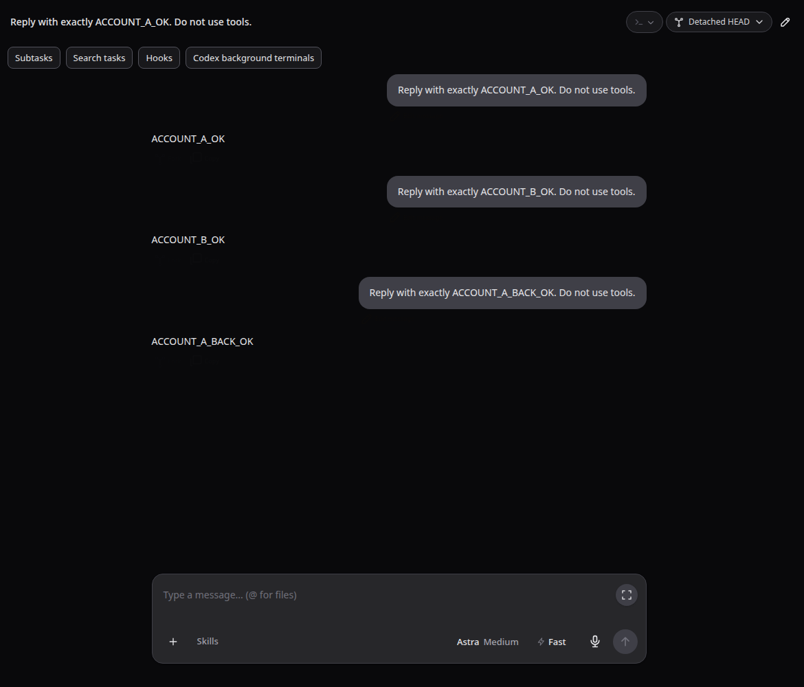

### 范围与性能

无需采用只读或强制刷新的降级方案。本次不改账号事务、认证传递、API 路由、自动化出口、额度保护和忙碌准入逻辑；仍然遵守执行中的切换限制。

UI 样本中每次切换当前会话恰好一个 resume；失败恢复也不循环重试，发送完成只做已有历史读取。未打开会话仅内存失效，无批量 RPC、轮询或文件扫描。恢复映射只复制一次，避免逐会话复制整张映射；延迟旧请求继续合并但不写回过期状态。主 JS 823.69 kB / gzip 261.46 kB，CSS 447.35 kB，CLI 不变 946.69 KB，无新依赖，未做大库长期压测。

59001 更新前独立 idle 检查各活动计数为 0，最终开发服务已更新；生产 5900 不变。用户首次刷新以载入新版客户端，之后切换账号不再需要刷新。原 prepared 包不包含这些追加修复。

## 会话区域红色提示统一可关闭（范围已撤销）

**以下为上一轮验收记录；用户澄清后已撤回广泛关闭行为，以后面的“操作通知范围澄清”为准。**

会话区补齐：加载/live overlay、CLI 缺失、目标读取、模型目录/能力提示、语音输入、历史分页、队列消息、子任务、Hooks/后台终端、文件变更操作、压缩、额度忽略保存失败和草稿保存失败。共用 DismissibleNotice 的 ×，保留反馈、重新读取和复制草稿等原操作；历史回合错误也提供关闭入口。

关闭只影响当前页面的提示显示，不改服务器错误、历史、发送保护、队列、自动化、额度忽略标记；新错误内容和重新打开页面仍可显示。相同字符串的普通重新渲染不会重新打开提示。会话切换时隔离各自关闭状态。

验证：全量 109 文件 722 项通过、1 项按设计跳过，build/typecheck 与 CJS node-pty / CLI --help 通过。Playwright 因需路由拦截使用直接 CJS；真实 App 中注入 RPC 502、目标/目录读取错误，验证点击关闭、等待重新渲染仍隐藏、历史回合错误可隐藏。URL `http://127.0.0.1:4173/#/thread/notice-check`；1440×1000、768×1024、375×812，浅/深色截图、按钮可见、无横向溢出、pageerror=0。原件 `/home/Code/codexapp/output/playwright/0218-all-notices-<宽度>-<light|dark>.png`。

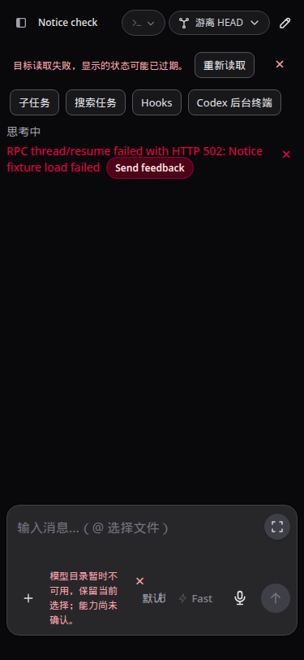

性能：关闭仅更新组件本地 ref/Set，不新增请求、轮询、文件读取或缓存失效；回合错误集合随会话切换清空，不跨会话累积。运行时/账号/调度代码未改。59001 更新前所有活动计数为 0，已更新隔离开发服务；5900 不变。


## 操作通知范围澄清与运行中分支核查

仅“需建立分支”等操作条件不满足的通知需要关闭入口。撤回 3de5ecf 对目标读取、RPC 502、CLI 缺失、模型目录、语音/进程/历史读取、草稿保存和历史回合错误的广泛关闭改动，保留原有操作通知 DismissibleNotice 和额度错误的独立忽略功能。源码恢复为这次扩大范围之前的行为，不改账号恢复和模型偏好修复。

浏览器检查：`http://127.0.0.1:4173/#/thread/notice-scope`，1440×1000，浅/深色；实际 App 的 RPC 502、目标读取错误无关闭按钮，实际共用操作通知组件可关闭，等待重新渲染后仍隐藏。源码核对既有 commandActionError 使用该组件。截图 `/home/Code/codexapp/output/playwright/0218-notice-scope-light.png` 与 `0218-notice-scope-dark.png`。

分支核查：当前侧栏“创建分支”入口没有运行中拦截；`/fork` 被 runAppCommand 的运行中 guard 拦截，消息旁按回合分支被 forkThreadFromTurn 的运行中 guard 拦截。后端 thread/fork 分配独立 worker，没有必须等待源会话完成的限制。

使用真实 Codex CLI、临时独立 home 与本地 Responses fixture：先完成两个回合，再让第三回合保持 inProgress，分别调用带已完成 lastTurnId 和不带 lastTurnId 的 thread/fork，均成功；两次后源会话仍 inProgress。随后只中断并清理本次样本进程/home，不接触真实会话或云端 API。证据 `output/0218/busy-fork-native.log`；脚本 `output/0218/busy-fork-native.cjs`。因此等待不是底层硬要求；从已完成回合创建分支有明确历史边界，普通分支不应被理解为完整复制仍在生成中的回复。

本轮仅核查分支能力，没有改动现有分支入口的 guard。关闭范围修正为纯 UI 恢复，无额外请求、轮询或运行时开销；59001 更新前独立 idle 检查，生产 5900 不变。


## 运行中分支入口放行与通知宽度修复

本轮已落实上一节的能力核查结论：删除消息旁分支、`/fork` 执行入口及命令确认面板的运行中限制；审查命令仍保持原有等待条件。输入框上方操作通知采用与输入框完全相同的最大宽度和居中规则，保留 ×；没有扩大系统错误的关闭范围。

验证：桌面状态回归 68 项、命令输入 13 项、原生历史/账号运行时后端 14 项全部通过，构建通过。真实 CLI 本地 Responses 样本中，已完成回合精确分支和普通分支均成功，源回合在两次操作后仍为 inProgress，无云端请求。浏览器使用 Playwright 路由拦截测试实际 App 的消息按钮和 `/fork` 确认面板，成功创建两个分支，turn/interrupt 请求为 0，pageerror 为 0。

UI 测试 URL：`http://127.0.0.1:4173/#/thread/running-source`。视口 1440×1000、375×812、768×1024，浅/深色共六组；通知与输入框的 x/width 分别完全一致：490.5/720、8/359、285/459 像素。关闭按钮点击后通知消失。

性能审计：两次分支操作分别只有一个创建请求，无额外轮询、重复创建或中断调用；代码变更只删除前端拦截和增加 CSS 尺寸约束，不改变账号、API 出口、自动化调度、缓存或后端分支实现。未开展大历史压力测量。运行中普通分支只包含当前可读取的历史，不承诺完整复制尚未结束的生成内容。

截图原件目录：`/home/Code/codexapp/output/playwright/`；以下六张均为实际变更界面：

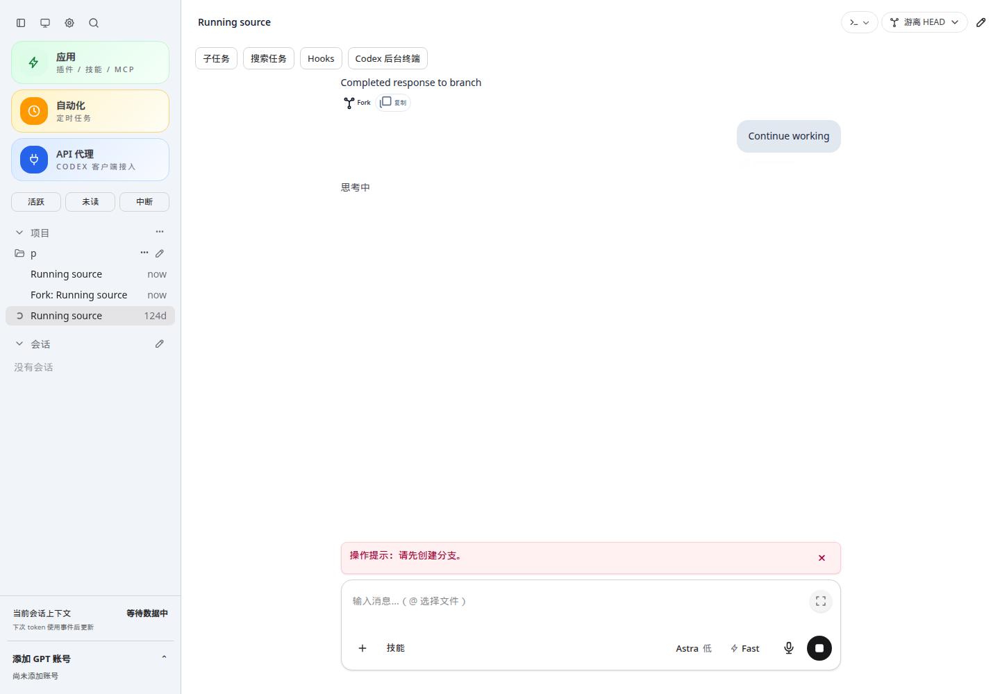

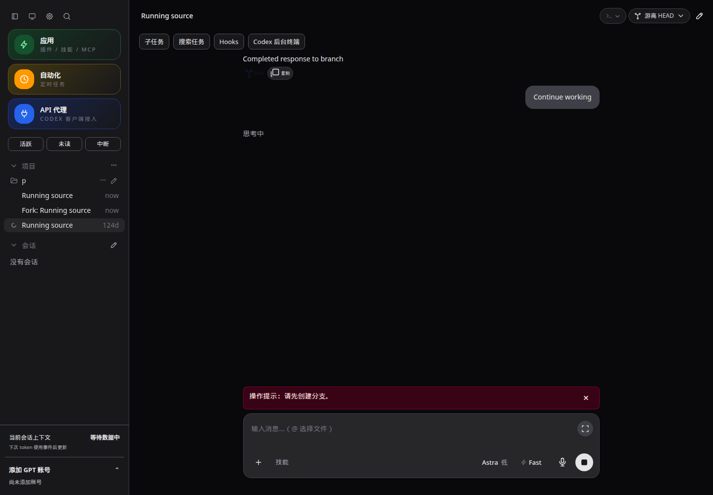

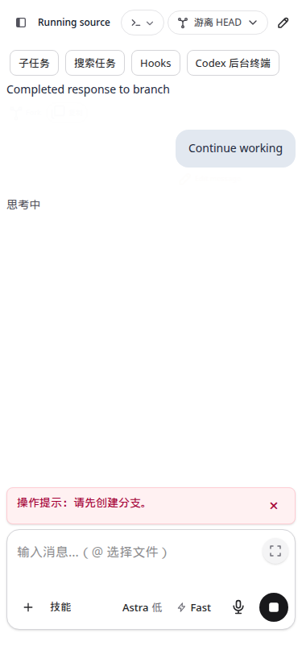

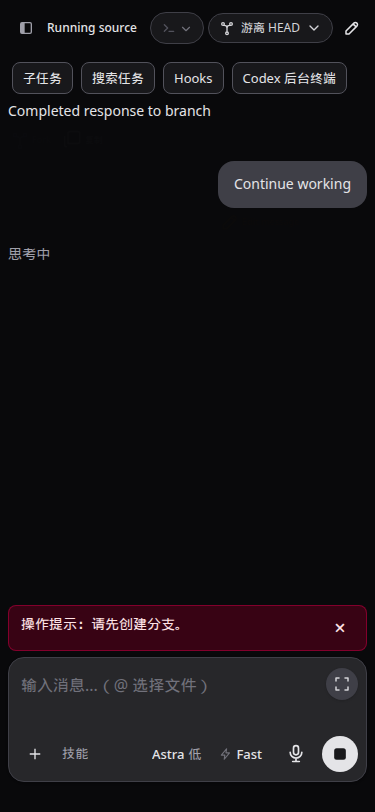

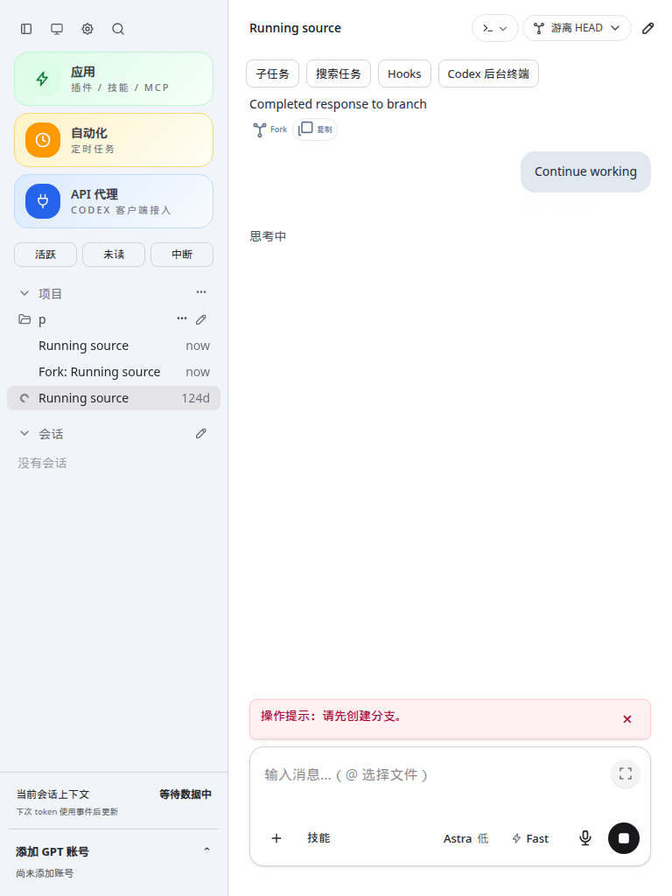

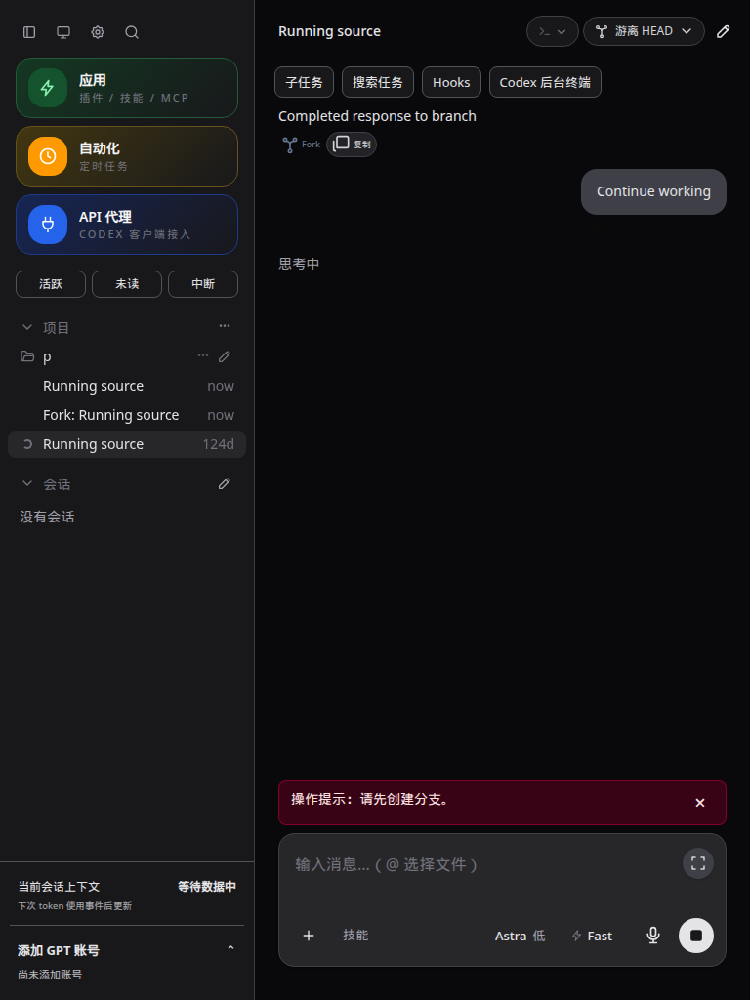

59001 更新前独立 idle 检查所有活动计数为 0，已重建并更新隔离开发服务；5900 未改动。验收数据：`output/0218/fork-unblock-ui.json`，原生证据：`output/0218/fork-unblock-native.log`。


## 操作 Toast、会话即时显示与筛选保留（文案审核前）

代码提交：1d284b1（无项目欢迎区及新分支显示）、0ea3b21（三种筛选当前会话保留）、4d9fae3（统一操作结果 Toast）。已构建并在独立 idle 检查所有活动计数为 0 后更新 59001，首页返回 HTTP 200；生产 5900 未改动。

操作 Toast：用户操作失败，以及分支、目标、账号切换、自动化、连接/技能设置等重要成功使用统一浮动通知。成功 3 秒、失败 6 秒，悬停/焦点进入暂停，× 关闭，同类替换且最多 3 条。系统自动读取失败和对话内上游错误保持原位置。账号切换测试使用组件和模拟接口验证通知，不以此重新声称账号出口完整端到端验收。

无项目首条消息只将内部目录传给发送逻辑，不再写回首页项目选择；延迟 thread/start 时欢迎区项目显示保持稳定。新分支在本地立即插入，服务器列表暂未收录时保留，确认收录后解除本地保留，主动归档正常移除。

活跃、未读、中断筛选统一临时保留当前曾匹配会话：回合结束、蓝点清除或忽略额度中断后，当前行和项目仍可见；点击另一会话后才剔除旧行。切换筛选会清理临时保留，不改变真实状态或额度忽略记录。

验证：全量 110 文件通过、1 文件跳过，733 项通过、1 项跳过；最终 build/typecheck 通过。真实 App 的浏览器接口拦截验证分支成功/失败、重复失败重现、自动消失、关闭、系统目标读取错误持续显示、上游回合错误仍在对话；真实目标/自定义连接组件验证目标保存成功/失败和账号切换成功。无真实云端请求或账号写入。

浏览器 URL：`http://127.0.0.1:4173/#/thread/running-source`；1440×1000、375×812、768×1024 浅/深色共六组，通知不溢出，不占输入框布局，pageerror=0。首条消息测试首页 `http://127.0.0.1:4173/#/`，延迟启动后项目文字不变并正常进入新会话。筛选测试实际点击其他匹配行，确认活跃完成/忽略中断后当前行保留且离开后消失；中断状态请求 2 次，未引入额外轮询。

性能审计：Toast 状态与计时器最多 3 个，关闭、超时及根组件销毁均清理，通知无网络请求；同类替换不累积计时器。待列表确认的会话 ID 最多 256 个，使用 Set，不增加列表请求或 payload，不伪造运行状态。筛选沿用内存状态和既有分批中断查询，匹配随相关状态变化进行 O(n) 扫描，未新增消息历史读取或缓存失效。未测大规模历史压力；本轮未改账号、API、自动化出口调度实现。

脚本与数据：`output/0218/operation-toast-ui.cjs`、`operation-toast-ui.json`、`operation-toast-success-ui.cjs`、`projectless-welcome-ui.cjs`、`sidebar-retention-ui.cjs`。截图原件目录 `/home/Code/codexapp/output/playwright/`。

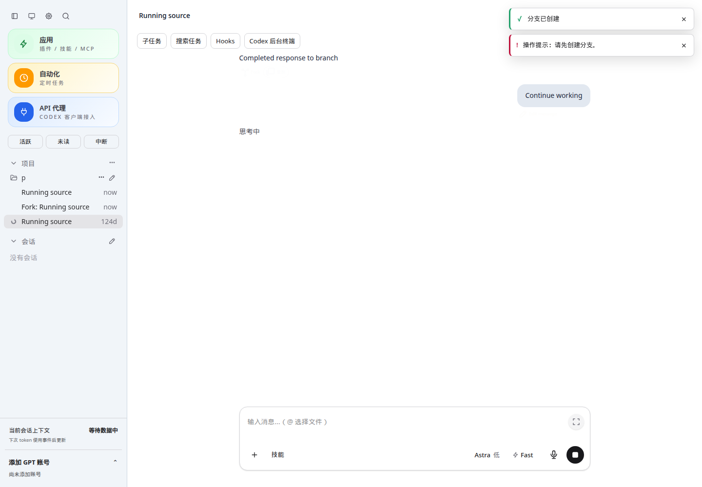

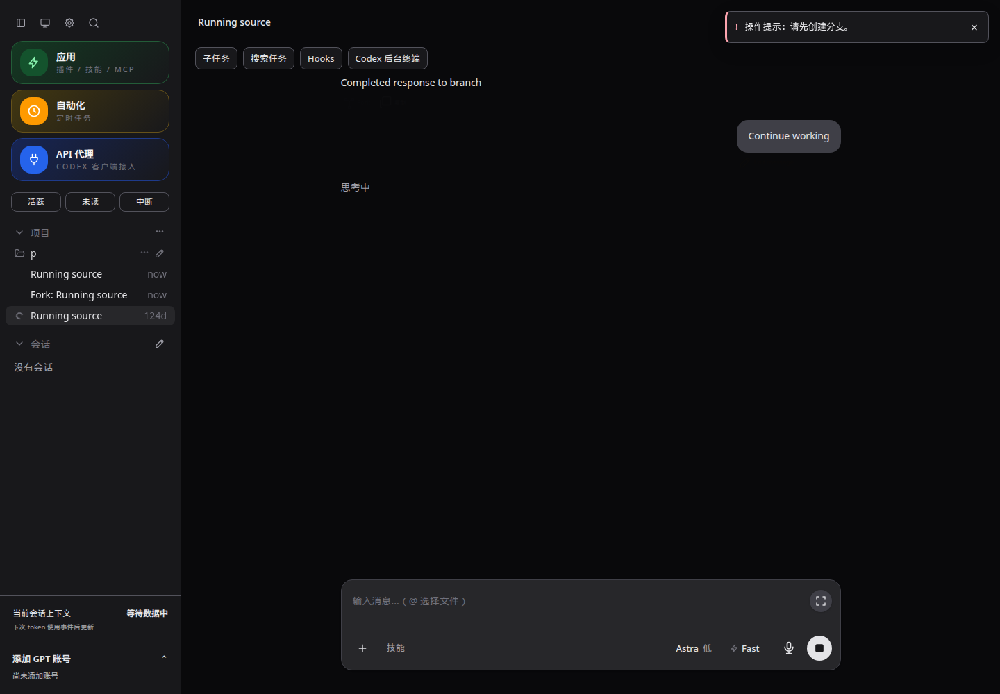

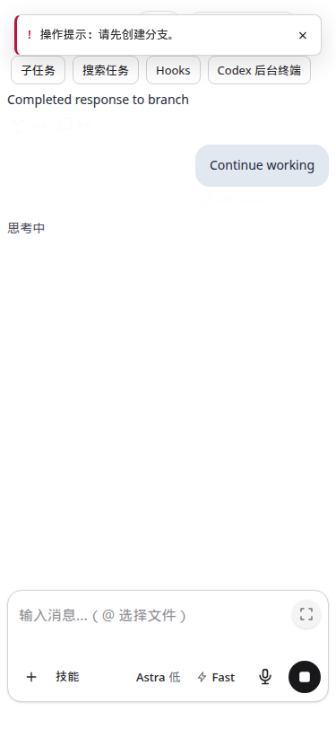

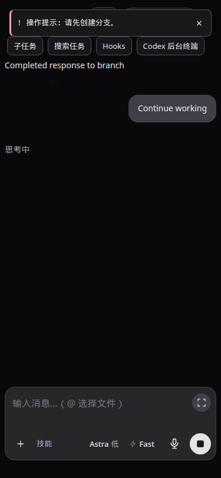

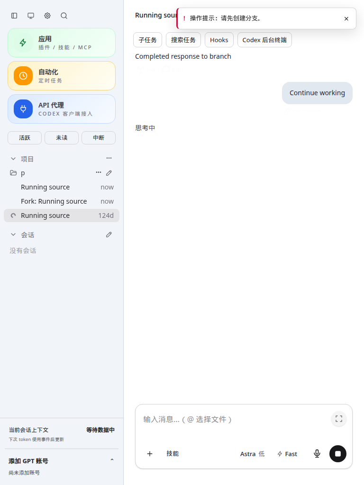

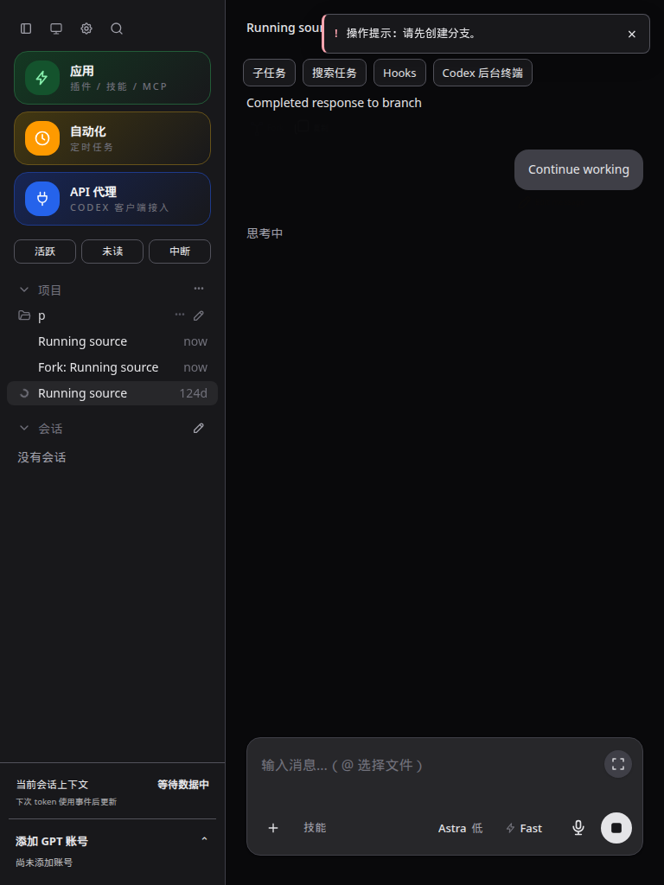

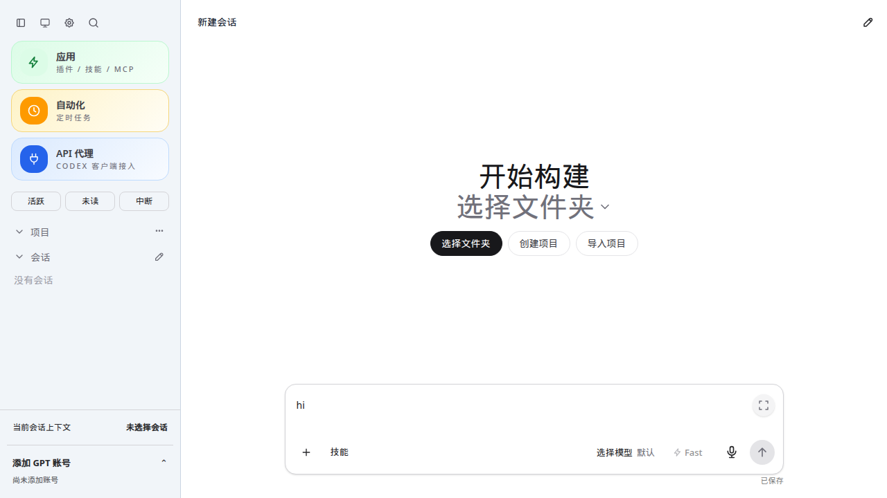

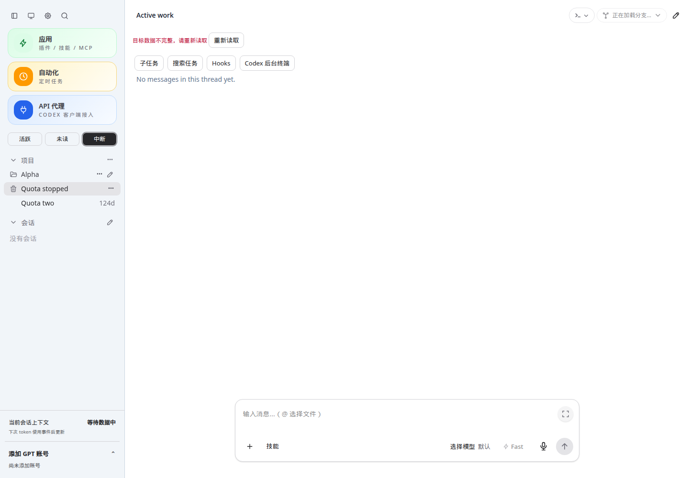

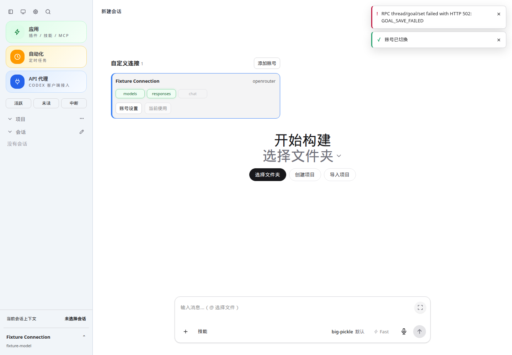

用户文案审核清单另见 [通知与提醒文案审核清单](20260912-0012-codexapp-通知与提醒文案审核清单.md)，1,044 条静态文案/模板和 11 类动态消息。仅提供中文审核译文，不自动将其写入产品。


## Toast 顶边对齐工具栏

通知容器顶边改为跟随 Git／新建会话所在工具栏的实际底边，多个通知向下排列。复用 ContentHeader 既有 ResizeObserver 与单次 getBoundingClientRect，把 bottom 发布为 CSS 变量；不新增监听器、轮询、网络请求或重复布局读取，卸载时清理变量。正文不额外添加“操作提示：”“提示：”前缀，验收示例也改为纯正文。

构建与类型检查通过。浏览器验收 URL `http://127.0.0.1:4173/#/thread/running-source`；1440×1000、375×812、768×1024 浅/深色，断言通知容器 y 等于工具栏 y + height（误差小于 1px），不横向溢出。截图与数据在 `output/playwright/0218-toast-below-header-*.png` 和 `output/0218/toast-below-header-ui.json`。性能变化仅为既有尺寸回调的一次 CSS 变量更新。

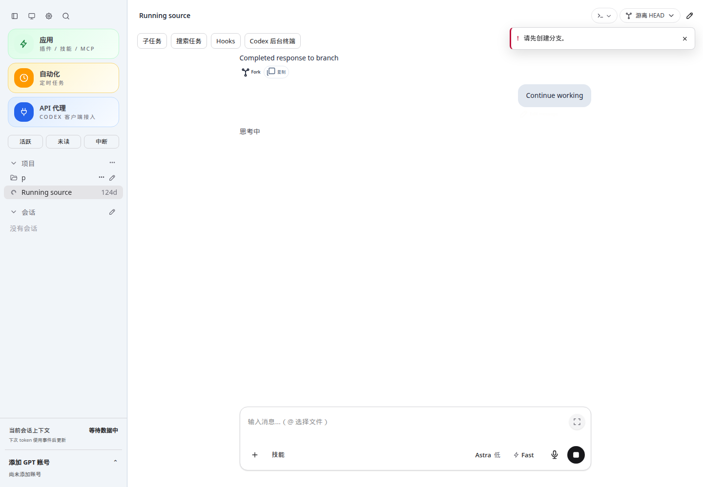

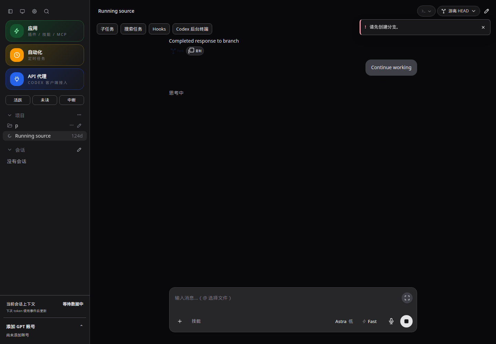

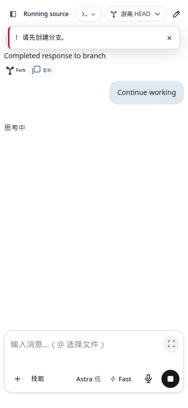

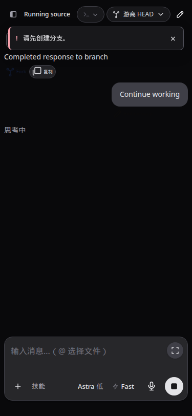

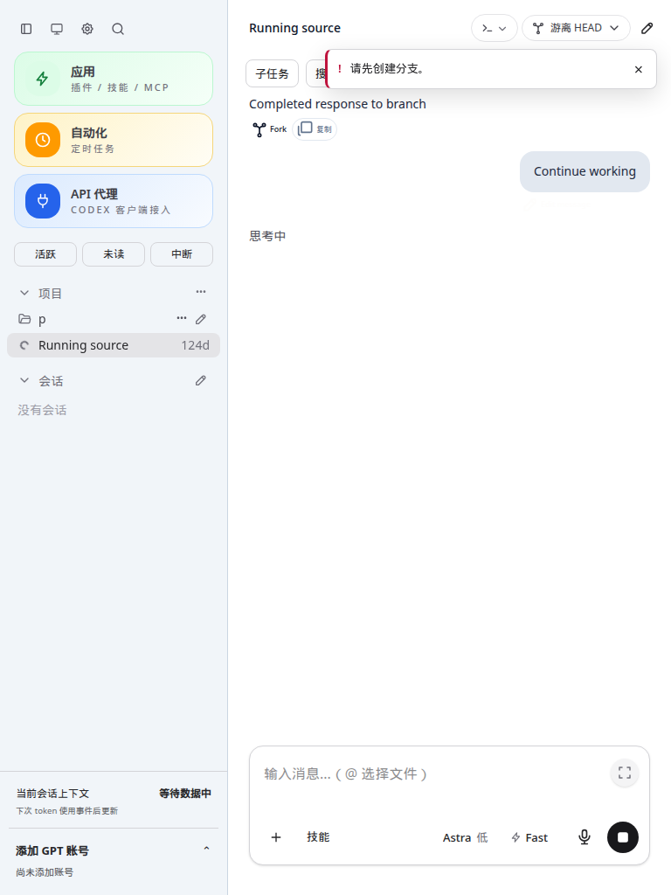

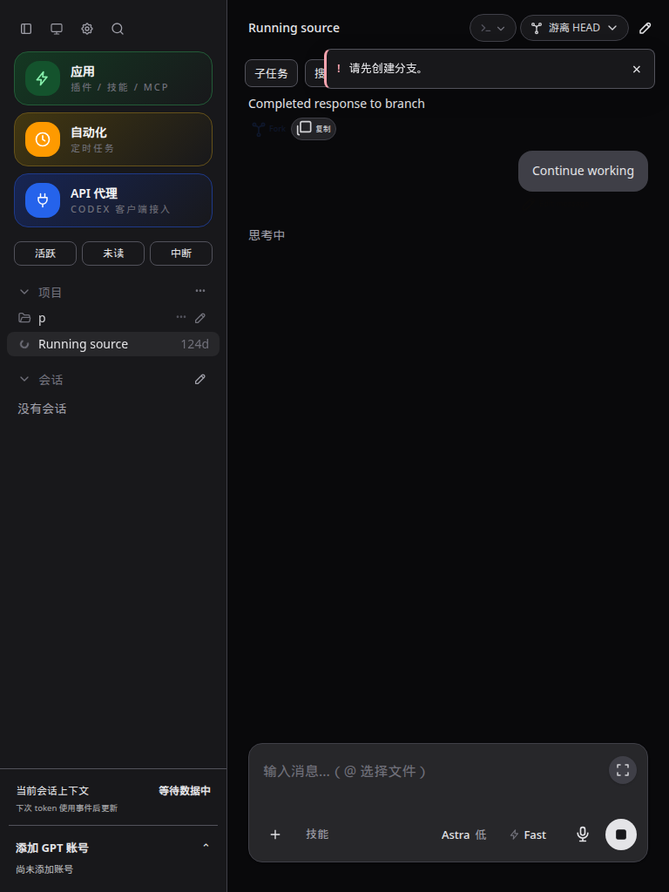
