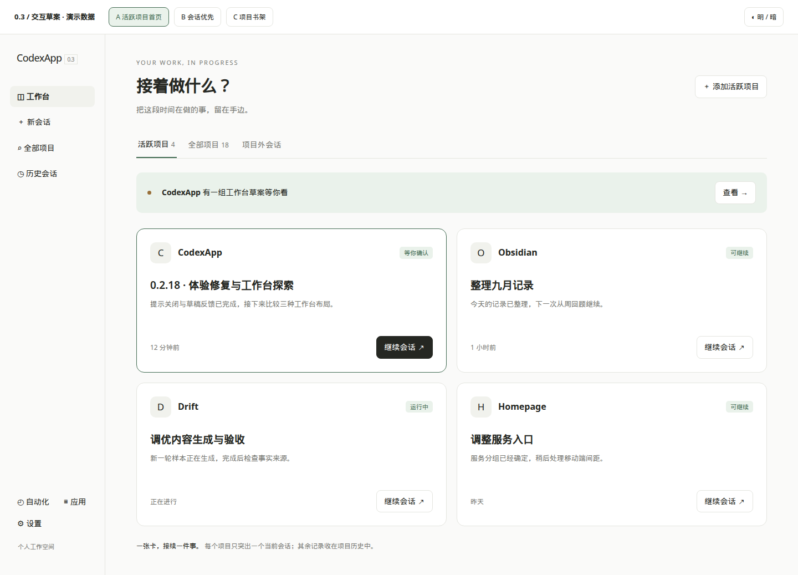
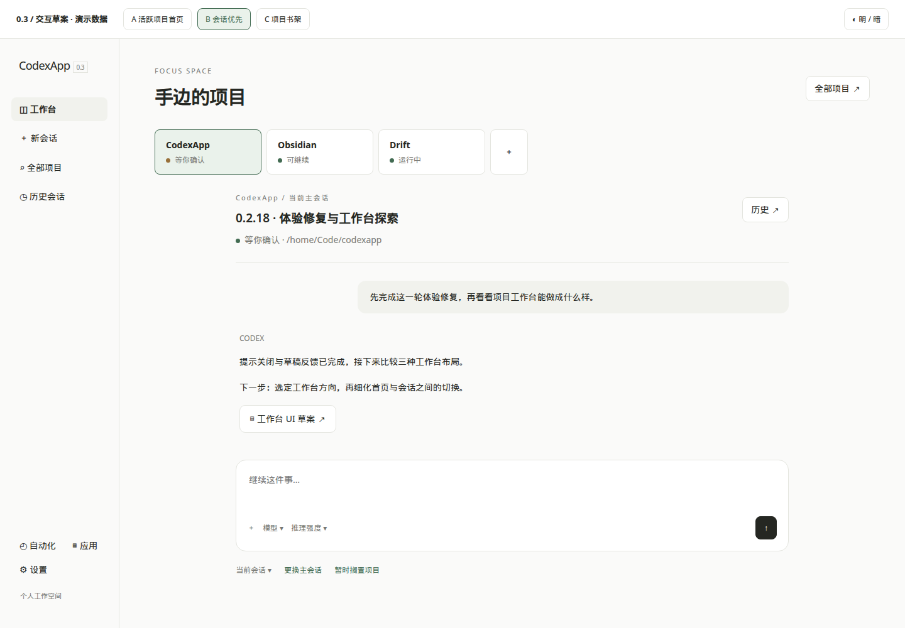
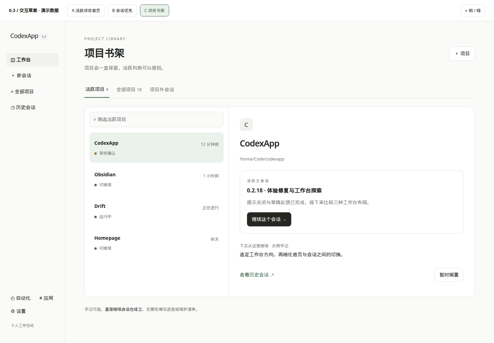
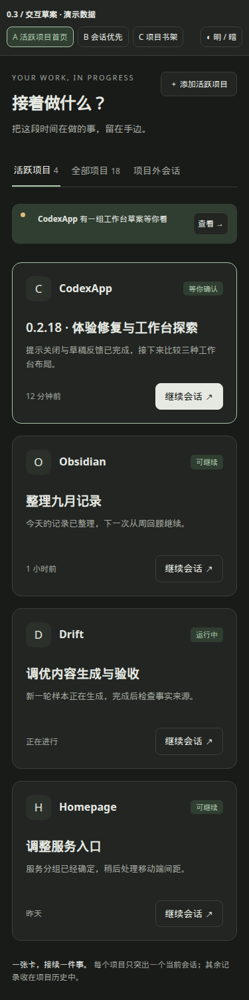
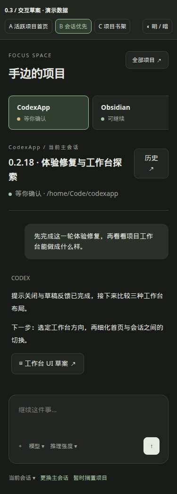
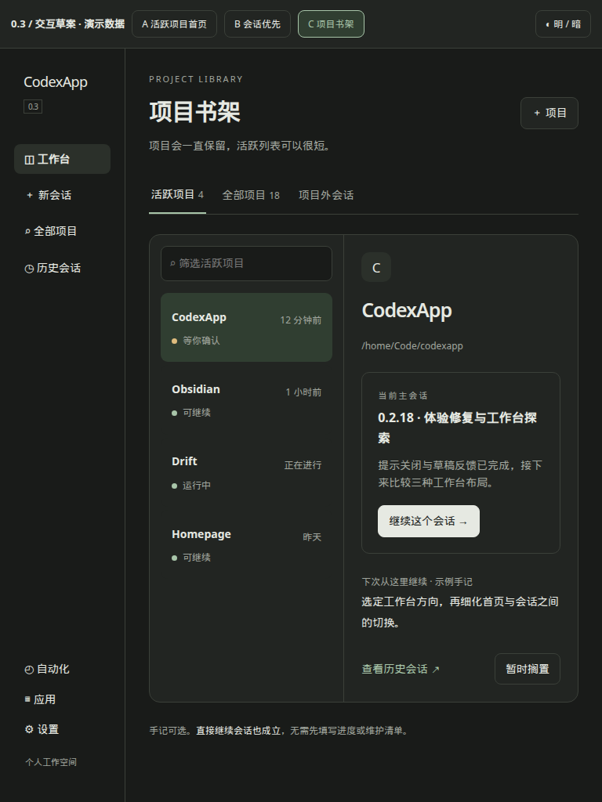

# CodexApp 0.3 活跃项目工作台三版草案

当前目标是让很多项目与会话更容易找到、继续和暂放。用户说明，一个项目在一段时间内主要由单个会话推进，因此本轮把设计中心改为“活跃项目 + 当前主会话”，先验证回到工作的路径。

用户已进一步明确 0.3 将采用项目主导样式并大幅替换现有侧边栏；这确认了产品方向，尚未选择三版中的具体组合。剩余审阅问题与版本安排见[项目主导 0.3 与 0.2 收口取舍](20260912-0016-codexapp-项目主导0.3与0.2收口取舍.md)。

三版均为演示数据，不连接模型或真实项目状态；界面中的进度、下一步和项目数量仅为示例。没有将草案集成到正式工作台路由。

## 草案入口

- [59001 可点击草案](http://192.168.50.46:59001/concepts/workbench.html?v=a)：顶部切换 A/B/C、明暗主题。支持继续会话、返回、查看全部项目、切换项目和书架筛选。其余按钮说明拟议行为。
- [独立 HTML](assets/0.3-workbench/index.html)：可直接在浏览器打开，无外部依赖；开发服务重新构建会清除临时 dist/concepts 副本，需要从此文件重新复制。

## 三种组织方式

| 方案 | 打开后看到什么 | 主要路径 | 适合的习惯 | 需要权衡 |
| --- | --- | --- | --- | --- |
| A 活跃项目首页 | 3—6 张项目卡、主会话标题、状态、继续入口 | 首页 → 继续主会话 | 先看看手头有哪些事，再选一件 | 卡片密度较低；摘要必须有可靠来源 |
| B 会话优先 | 顶部少量活跃项目标签，下面直接是当前会话 | 切项目标签 → 接着聊 | 每天主要在少量项目之间切换 | 活跃项目太多会挤；需快捷切到全部项目 |
| C 项目书架 | 左侧紧凑项目列表，右侧项目与主会话预览 | 选项目 → 看上下文 → 继续 | 经常盘点、搁置和恢复不同项目 | 继续工作多一步；可考虑双击项目直接继续 |

### A：活跃项目首页

把侧栏中的大量树节点移入独立项目库；首页只留近期主动维护的项目。每张卡只有一个主要动作“继续会话”。项目内历史按需打开，项目外临时讨论仍可直接开始。

### B：会话优先工作台

主体继续沿用聊天界面，顶部标签承载近期项目。切换标签等于回到该项目主会话；项目历史入口收在会话标题边。无需为了看工作台而中断当前输入。

### C：项目书架

项目清单承担长期组织，活跃与全部明确分开。右侧展示主会话及一条可选的“下次从这里继续”手记。搁置只移出活跃区，项目和会话保持原样。

## 推荐的组合

倾向 **A 作为首页，B 作为进入项目后的日常界面**，共用同一份活跃项目和主会话关系。C 可作为“全部项目”的密集视图参考，先不同时实施三套模式。

先验证三个行为：隔几天能迅速回到上次工作；切项目不需要展开历史树；暂时搁置后仍容易找回。若首页使用率低，可以默认打开上次会话，把 A 留作显式工作台入口。

## 对象与状态的轻量规则（提议）

1. **活跃是用户意图**：表示最近想保持在手边；与会话是否正在运行、是否未读分别记录。后台运行结束不会自动挤掉某个项目。
2. **一个项目一个当前主会话**：初次可建议最近会话，之后由用户明确更换。查看历史不自动改变主会话；新建后可选择“作为当前会话”。
3. **搁置可恢复**：只移出活跃区，不删除、不归档会话、不停止任务。运行中项目即使搁置，仍可从现有运行/等待入口找到。
4. **摘要可缺省**：首版先用会话标题、更新时间与现有状态。可选手记由用户编辑；不在首页加载时自动调用模型生成所有项目总结。
5. **状态保留来源**：“等你确认”必须对应真实未回答问题/审批；普通回复完成不能推断为等待验收。断线时说明状态待同步。
6. **历史按需读取**：打开项目库或历史才分页加载。工作台不扫描全部会话正文，不批量读取各项目 Git diff、终端或目录。
7. **不用填表才能继续**：项目无需额外任务、清单、负责人或流程；没有主会话时直接“开始会话”。非 Git 项目同样可用。
8. **项目身份与迁移需先定清楚**：明确目录移动、worktree 与主项目的关系；会话删除/不可用时显示更换入口，不能默默跳到其他会话。

跨设备若需要相同活跃列表，应该保存少量服务端元数据；当前浏览器的布局偏好单独处理。这里是实施建议，尚未改动持久化协议。

## 建议分步验证

- 第一步：用户选择视觉方向，确认“打开首页还是上次会话”“活跃项目通常有几个”“主会话何时更换”。现在不要求决定全部细节。
- 第二步：接入已有项目/会话列表，完成活跃区、主会话关系、继续/更换/搁置/恢复；暂用会话标题替代自动摘要。
- 第三步：验证刷新、切项目时草稿与阅读位置、项目外会话、历史分页、移动端导航；测量请求量和长列表成本。
- 第四步：只有实际需要时再加入可选手记、成果入口或更精细的等待状态。原规划中的交付清单、跨会话任务协同与自动摘要不作为此方向首版前提。

## 验证与证据

三版均使用 Playwright CJS 实际打开 `http://127.0.0.1:59001/concepts/workbench.html?v=a|b|c`，覆盖 1440×1000、375×812、768×1024，浅深主题，共 18 张截图，最终截图等待 2.3 秒；页面无横向溢出。继续会话/返回工作台/切换方案/选择项目路径通过。原始脚本与报告：`/home/Code/codexapp/output/0218/concepts.cjs`、`concepts.json`，截图绝对目录 `/home/Code/codexapp/output/playwright/`。

草案为静态 HTML/CSS/JS，没有 API 请求、依赖下载或模型调用。这不是正式应用工作台的性能或端到端验收；后续实施仍需真实项目数量、状态更新、草稿与历史测试。

## UI 重构工作量评估（2026-09-12）

按“A 总览 + B 日常会话”估算，属于中等偏大的界面重组。以下是单人熟悉项目、需求方向稳定时的有效工程人日，每人日约 6—8 小时，包含开发和验证；不是已经测得的 AI 执行时间或交付承诺，各档为替代范围、不能相加。

| 范围 | 工作量估算 | 完成边界 |
| --- | --- | --- |
| 仅布局接入 | 2—4 人日 | 接入现有项目列表、新首页和导航，继续原会话；不补跨设备活跃/主会话管理 |
| 最小可日用版 | 5—8 人日 | 活跃/搁置/恢复、主会话选择、继续会话、基础持久化与移动布局；元数据只覆盖必要字段，复杂目录迁移另列 |
| 推荐的完整首版 | 9—15 人日 | A+B、服务端保存少量项目元数据、切换/刷新恢复、历史入口、移动/主题/中英文、旧数据兼容和性能验收 |
| 同时做深层架构重构 | 20—35 人日或更长 | 大范围拆 App/useDesktopState、替换路由承载方式或重做消息渲染；范围和回归不确定性明显增加 |

推荐首版的粗拆分：交互/状态规则确认 1—2；导航与页面容器整理 1—2；活跃项目和主会话元数据及兼容 2—3；A+B 真实数据接入 2—3；移动/主题/语言收尾 1—2；回归、性能和候选验收 2—3，共 9—15 人日。若视觉方向反复变化、需要自动关联多个 worktree、强一致跨设备冲突处理或新的阅读位置系统，应重新估算。

### 代码依据与可复用边界

本次只读核对当前源码：App.vue 6239 行，useDesktopState.ts 5843 行，SidebarThreadTree.vue 3565 行，ThreadConversation.vue 5180 行。行数表示改动集中与验证面，不是耗时或性能测量。

- 路由已存在，但 `src/router/index.ts` 使用 EmptyRouteView，实际页面和大量切换 watcher 位于 App.vue。首版适合局部抽出工作台容器，保留会话路由语义，避免同时更换路由和数据生命周期。
- useDesktopState 已有 projectGroups、会话列表合并、项目顺序与显示名；其中项目顺序/显示名使用浏览器存储。新的活跃状态和主会话关系若要求跨设备一致，需要少量服务端存储、更新接口与失效处理。
- `src/server/projectDirectories.ts` 管理项目 AGENTS.md 的附加工作目录，不是现成的工作台元数据仓库，不能直接当作项目库复用。
- 聊天消息、输入、队列、审批、终端、diff、账号/设置页面继续复用。首版不把 5180 行消息渲染组件重新实现。

### 最容易低估的工作

1. 切换项目后草稿、输入焦点、滚动位置、未读和运行状态是否各归其位；不能因布局变化重复挂载聊天或重复订阅。
2. 主会话被删除/归档、目录重命名、同一目录有 worktree 时的行为。首版可先提供明确的重新关联入口，不自动猜归属。
3. 全部项目和历史是否完整且按需加载；不能把已加载列表当成全量，也不能为每张卡读取整个会话或 Git 工作区。
4. 手机上的项目切换与键盘可达性，以及明暗主题、刷新/回退与旧链接兼容。静态草案截图不覆盖这些真实状态。

### 建议实施顺序

先做 5—8 人日范围的最小可日用版，在 59001 用真实日常操作验证；方向稳定后把总范围收至 9—15 人日的完整首版。初版卡片使用现有标题、更新时间和可证实状态，可选手记延后。智能摘要、成果聚合、多会话协同及全部页面统一重写不计入此估算。

这次仅评估并更新文档，没有开始新的 UI 实施、运行测试或变更服务。
