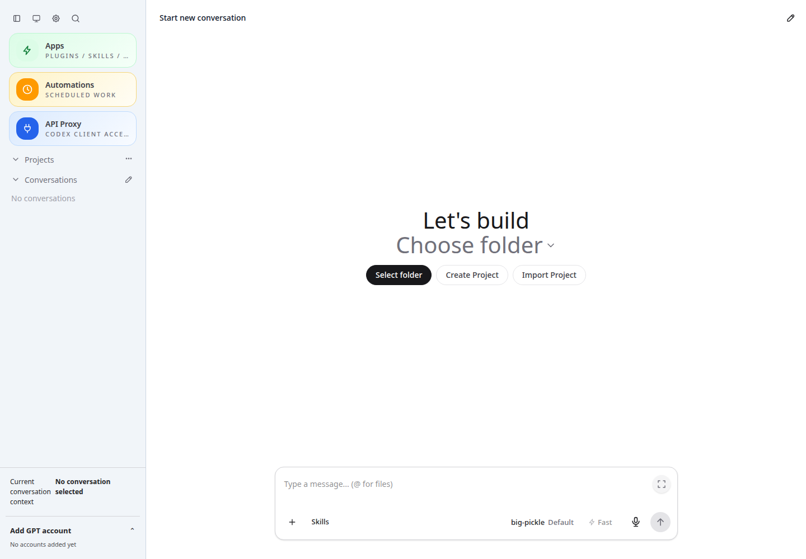

# CodexApp 0.2.18 发布准备与审阅基线

## 交付状态

0.2.18 已完成 prepare，作为本次 0.2 系统审阅的固定基线。**生产没有切换。** 审阅发现了需要先处理的安全与发布门禁问题，详见[审阅报告](20260912-0006-codexapp-0.2系统代码审阅.md)；发布包验证通过不代表这些问题已经修复。

| 对象 | 本次核对结果 |
| --- | --- |
| 源码 | `feature/0.2.18-development`，`f9a3b94948936a294cb2e8991eb7b3709c8165ab` |
| 精确发布目录 | `/home/docker/codexapp-releases/codexapp-0.2.18-f9a3b9494893-20260912-162826` |
| 归档 | `/tmp/codexapp-0.2.18.tgz` |
| 归档 SHA-256 | `c8c68e904828584c90db30388dd89dc2ff28a2ee206fcb517d685db63407cac3` |
| prepare 完成时间 | 2026-09-12 16:29:20 +08:00 |
| 生产 5900 | 仍为 `codexapp-0.2.17-ac78f492f7d2-20260911-204236`，PID `3840130` |
| 开发 59001 | 保留 0.2.18；独立 `CODEX_HOME=/home/docker/codexapp-dev-0218/codex-home` |
| 构建环境 | Linux x64；Node 24.19.0、pnpm 11.25.0、npm 11.17.0 |
| API 组件 | CLIProxyAPI 7.2.152，按 manifest 校验二进制 SHA-256 |

后续新增的审阅脚本和说明文档不改变上述运行代码基线。再次 prepare 会改变 `latest-prepared`，交接时应使用精确路径。

## 版本包含内容

- R01：反馈改为最小报告的预览、编辑、复制与用户主动打开 Issues；不自动发送页面、存储或会话内容。
- R02：额度错误提示改为查看额度与恢复时间，不引导通过换账号继续。
- 会话功能性错误增加 `×` 关闭入口；持久失败回合仍保留。
- 草稿轻提示使用“已保存”，保留保存失败时的输入及复制退路。
- 精简无账号、关于与健康调度器状态文案；免打扰布局不再挤压开关。
- 时间统一为带原生时钟入口的单个时间控件，处理英文/中文冒号粘贴。
- 自动化“每天运行”与账号定时激活一样支持添加、移除多个时间，最多 24 个，精确保留小时与分钟配对。

实现和此前 UI 验收见[0.2.18 开发记录](20260912-0003-codexapp-0.2.18修复与59001开发验收.md)。0.3 工作台仍为草案，没有进入发布包；59001 的静态草案入口已在 build 后恢复。

## 验证结果

| 检查 | 命令或方法 | 结果 |
| --- | --- | --- |
| 全量单测 | `pnpm run test:unit` | 104 文件通过，706 项通过；1 个原生激活用例按设计跳过 |
| 类型与构建 | `bash scripts/codexapp-release-switch.sh prepare` 内运行 build、pack、隔离安装 | 通过 |
| 构建一致性 | 逐文件比较发布目录与本次 `dist`、`dist-cli` | 27 个文件一致 |
| CLI | `node <release>/dist-cli/index.js --help` | 退出 0，包含 `--strict-port` |
| CJS 依赖入口 | `node -e "const p=require('<release>/node_modules/node-pty'); console.log('node-pty spawn:', typeof p.spawn)"` | `node-pty spawn: function` |
| 实际终端 | 发布目录的 node-pty 启动 `/bin/sh -c 'printf PREPARED_PTY_OK'` | 退出 0，读取到标记 |
| 缓存升级 | 59015、同浏览器上下文先访问真实 0.2.17 包，再替换为真实 0.2.18 包并刷新 | 入口 200、`no-store`、无 ETag/Last-Modified；新 JS 已加载 |
| 旧资源 | 请求上一包 `/assets/index-BftsgP3S.js` | 404，没有返回 SPA HTML |
| 新资源 | `/assets/index-B0hxwzD4.js` | hashed asset 使用 immutable |
| API key | 无 key 请求隔离实例 `/v1/models` | 401 |
| 安装时依赖检查 | npm 安装自动 audit | 79 个包，报告 0 个已知漏洞；不等于完整安全审计 |

主 JS 818.19 kB / gzip 259.72 kB；主 CSS 446.20 kB / gzip 50.11 kB；CLI 937.89 KB。没有为本次审阅修改业务代码或依赖。

浏览器 URL 为 `http://127.0.0.1:59015/`，视口 1440×1000。截图确认新版本正常显示；原件 `/home/Code/codexapp/output/playwright/0218-prepared-cache.png`：



[包验证数据](assets/0.2.18-review/prepared-verification.json)包含精确路径、资源名、PTY 和清理断言。[安装版本清单](assets/0.2.18-review/prepared-dependencies.json)固定本次实际依赖解析结果。原始过程日志位于 `output/0218/prepare.log`。

## 临时进程与空闲门禁

已核对本次 4173 监听的 cwd、Vite 命令，以及原生后台终端的 thread/process/item 关联，使用终端停止 RPC 收尾。独立复核确认：4173 无监听，对应终端记录消失；59015 无监听，临时 home 和测试文件已删除；5900、59001 保持监听。未停止 5173。

对精确发布路径执行 `check` 的结果为退出 3：

```text
liveExecutions=1 | activeTurns=1 | queued=0 | pendingApprovals=0
apiConnections=0 | apiActiveRequests=0
backgroundThreads=skipped-busy | loadedThreads=0 | pages=2
```

当前存在活跃回合。`skipped-busy` 表示整体后台枚举未执行，不能报告为零；本次已知验证终端的清理有独立证据。空闲检查还存在审阅报告中的 SCH-01 定时激活覆盖缺口，不能只凭当前脚本“通过”就认为切换安全。

结束会话后可从独立终端只读复核：

```bash
cd /home/Code/codexapp
bash scripts/codexapp-release-switch.sh check /home/docker/codexapp-releases/codexapp-0.2.18-f9a3b9494893-20260912-162826
```

该命令不激活版本。首次 prepare 与审阅阶段未执行切换；当时建议先收口 SEC-01、SCH-01。后续切换前复查与用户验收范围见下节。

## 2026-09-12 切换条件复查

用户决定先以 0.2.18 作为切换目标，并将一般 UI 问题视为验收通过。本次执行切换条件检查，没有执行 activate，没有修改账号、调度、API 配置或停止服务。一般 UI 验收不代表 SEC-01、SCH-01 或其他系统审阅问题已经修复。

18:22（Asia/Shanghai）附近的只读检查结果：

| 检查 | 结果与含义 |
| --- | --- |
| 精确发布包 | 仍为上述 `f9a3b9494893` 目录；ready 标记、版本 0.2.18 和归档 SHA-256 一致，27 个构建文件再次逐字节比较一致 |
| 当前生产 | 5900 仍运行 0.2.17，PID `3840130`，`CODEX_HOME=/root/.codex` |
| 正式门禁 | 精确路径 `check` 退出 3；`liveExecutions=2`、`activeTurns=2`，不能切换 |
| 会话与 API | 队列 0、待审批 0、API 连接 0、活动 API 请求 0；API draining=false |
| 自动化 | ready=true、activeCount=0、queuedCount=0、draining=false |
| 账号变更 | 管理状态中的 operation=null；执行归属快照为 primary busy 2、idle 15，无 activation lease；这不等于完整证明所有后台额度刷新均已结束 |
| 自动激活补查 | enabled=false、选中账号 0、时间点 0、nextAt=null、preparing/sending 0、未结束记录 0、调度错误为空 |
| 后台终端补查 | 门禁原本报告 skipped-busy；另行只读枚举 14 个已加载会话，确认 1 个会话有后台终端，不能记成 0 |
| 临时验证端口 | 4173、59015 无监听；59001 仍保留 |

该后台终端属于当前会话：processId=`27505`，日志目标为 `output/0218/multitime-candidate.log`，启动的是 59001 开发服务，监听 PID=`2568050`。已核对进程树：开发服务 → bash → 当前会话 Codex → 生产 bridge → 生产 PID `3840130`。其数据 home 独立，但仍处于 `/system.slice/codexapp.service` 控制组，生产服务的 `KillMode=control-group`，重启生产会同时停止 59001；只结束活跃回合不能消除这项门禁占用。切换前必须先将需要保留的 59001 改为独立服务托管、脱离生产控制组，或明确停止它，不能直接忽略后台终端计数。本次保留服务，没有终止它。

自动激活当前关闭且没有未结束记录，使 SCH-01 的漏计在这一快照下没有对应运行占用；这不是修复，也不能保证之后的状态。如果切换前启用或修改激活计划，必须重新检查并处理准入冻结缺口。SEC-01 的同源 HTML 预览风险仍在包中，不因一般 UI 验收而消失。

后续顺序：结束活跃回合，处理上述 59001 后台终端，再从独立终端对精确目录运行 `check`；实际切换还需由交接脚本先 drain 自动化/API、再核验空闲并保存账号快照。不能将本次只读快照当作未来切换时的持续放行保证。诊断汇总保存在 `output/0218/cutover-precheck.json`，只含计数与运行归属，不包含认证内容或会话正文。

## 兼容与验证边界

- 本次没有执行真实 OAuth、第二账号切换、自然令牌过期、真实模型请求或云端定时激活。
- `rrule` API 字段仍为字符串，但多个每日时间使用多行规则。0.2.17 及更早调度器不理解这种多行规则；未来降级前应识别并显式转换这些任务，不能仅回退程序目录后宣称调度兼容。
- `prepare` 只增加发布目录和更新 prepared 指针，不迁移生产数据。没有从开发环境向 `/root/.codex` 复制认证、会话、账号池或历史。
- 本轮不需要生产回滚。若放弃候选，继续运行现有 0.2.17 即可；保留候选以便复查。

## 0.2 文档入口

- [系统代码审阅与整改顺序](20260912-0006-codexapp-0.2系统代码审阅.md)
- [编码规范](20260912-0007-codexapp-0.2版本编码规范.md)
- [模块说明](20260912-0008-codexapp-0.2版本模块说明.md)
- [功能说明](20260912-0009-codexapp-0.2版本功能说明.md)
- [UI 规范](20260912-0010-codexapp-0.2版本UI规范.md)

项目内文档为编辑源，核对 NFS 挂载后同步至 Obsidian `开发/codexapp/`，按文件字节比较副本。
