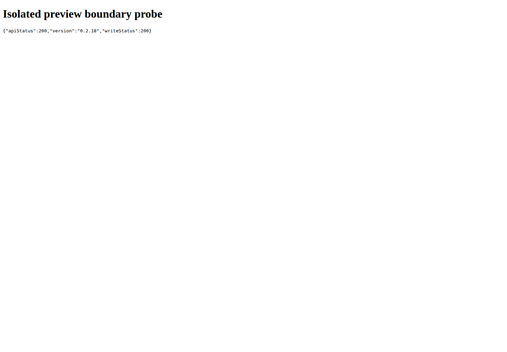

# CodexApp 0.2 系统代码审阅

## 结论与范围

以已 prepare 的 **0.2.18 / f9a3b9494893** 为固定基线，完成首轮安全边界、调度、持久化、模块冗余和前端请求检查。发现 **2 项 P1**，应先修复后安排正式切换：本地 HTML 预览具有管理来源权限，以及发布门禁漏记账号定时激活。另有慢查询阻塞、无界账号准备等待、续跑队列饥饿等 P2 问题。此轮保留运行代码，交付证据和整改要求，不把审阅报告当作修复完成。

范围包括 CLI/HTTP 入口、认证与 API 出口、账号执行归属、自动化/激活/额度续跑/投递状态机、历史归档、会话与侧栏状态、公共 UI、打包流程。逐模块静态检查重点链路，辅以全量现有测试、四个隔离探针和真实发布包浏览器验证；不是对 6.9 万行源码逐行无遗漏背书。

本应用面向可信家庭内网与本机用户。预览来源问题来自正常使用中打开仓库/模型生成 HTML 的信任跨越，不依赖公网暴露假设。未把本地文件任意路径读写、项目导入导出本身列为漏洞，也未建议无依据地限制项目根目录。

## 分级与发现

P1：具有明确安全边界影响，或可让发布安全判断失真。P2：影响调度公平性、响应或可维护性，需在后续小版本收口。P3：低成本清理、实测待归因或治理改进。

| 编号 | 等级 | 发现 | 证据强度 |
| --- | --- | --- | --- |
| SEC-01 | P1 | 本地 HTML 预览与管理 API 同源，脚本可执行管理操作 | 真实发布包浏览器读 API、写临时文件成功 |
| SCH-01 | P1 | 发布 idle/drain 未覆盖定时激活 | 源码调用链 + 模拟 sending 时仍返回 idle |
| SCH-02 | P2 | 运行状态核对占用全局串行队列 | 模拟慢 inspect 阻塞 manual/drain |
| SCH-03 | P2 | acquireAccount 无引擎级超时，占满四个运行槽并拖住 dispose | 引擎契约探针复现；真实外部连接未注入挂死 |
| SCH-04 | P2 | 额度续跑只访问 waiting/unknown 的前八条，尾部可能饥饿 | 九条 waiting 的确定性探针 |
| RED-01 | P3 | 未使用声明与旧激活模块仍留在仓库 | 严格编译诊断 + 引用搜索 |
| MOD-01 | P2 | 六个文件承担约半数源代码，业务与运行时聚集 | 文件规模与职责检查 |
| PERF-01 | P3 | 首页仍有少量重复读取，默认 warnings 未覆盖这些接口 | 真实 4173 请求计数；未判定为全部可删除 |
| REL-01 | P2 | prepare 重新解析浮动依赖，最低运行环境缺验证 | 发布脚本、包声明、实际安装清单 |
| DATA-01 | P2 | 自动化冷历史与幂等索引无长期保留上限 | 归档代码路径；未做多年数据压力实测 |

### SEC-01：HTML 预览跨越管理权限边界

位置：`src/server/httpServer.ts:130` 的 `/codex-local-file` 与 `:165` 起的 `/codex-local-browse/*path`。文件按原 MIME inline 返回，未附隔离脚本来源的策略；`/codex-local-edit/*path` 在同一来源提供写入。

触发：用户打开不可信或生成的 HTML/SVG 等主动内容。HTML 中的脚本成为 CodexApp 来源脚本，可访问同源接口。`noopener` 只隔离 opener，不隔离来源；密码会话的同源请求也会携带既有 cookie。

实证：在独立 59015 发布包中，临时 HTML 读取 `/codex-api/meta/capabilities` 得到 200 / 0.2.18，再 PUT 仅属于该探针的临时文本文件，得到 200，内容由 `before` 变成 `AUDIT_TEST_ONLY`。未读取认证或用户文件，未执行模型或 shell 命令。该次实测采用无密码隔离实例；启用密码时的 cookie 推论来自相同路由/认证代码，尚未单独做登录浏览器复现。

整改：把主动内容放到与管理 API 不同的来源，或使用不会保留管理来源权限的 sandbox 预览。须同时处理直接文件、目录浏览、SVG 与相对资源，保留正常 HTML 草案浏览能力。不要简单给整个应用加禁止脚本策略。新增回归要求：预览仍显示，预览脚本无法读取管理响应或修改管理资源，普通图片、相对 CSS/JS、下载继续工作。

证据：[包验证 JSON](assets/0.2.18-review/prepared-verification.json)。测试 URL `http://127.0.0.1:59015/codex-local-browse/<临时路径>/preview.html`，1440×1000，原件 `/home/Code/codexapp/output/playwright/0218-preview-boundary.png`：



### SCH-01：切换前没有冻结、统计账号定时激活

位置：`scripts/check-codexapp-idle.cjs:14-48`；`src/server/codexAppServerBridge.ts:6484`；`src/server/apiProxy/gateway.ts:101` 的 `prepareActivation` 及 `:681` 的 drain；`accountActivationRuntime.ts:17`。

账号激活直接持有代理 generation 并发送请求，注册的是 `AccountExecutionRegistry` 的 activation lease，没有进入 `ProxyActivity.entries`；bridge 的 liveActivity 只统计 app-server 会话/RPC。idle 脚本只读自动化、会话队列、审批、API 活动和后台终端，不读取 activation 运行状态。API drain 仅关闭正常 API 接入，未阻止激活计划开新请求。

探针把其他活动设为零，提供一条 `sending` 激活记录，实际 `checkIdle()` 返回 `idle=true`，从未读取 activation endpoint。即使单独增加一次状态查询，也存在检查后定时触发的竞态。

影响：切换可以中断已开始的激活请求，留下 unknown；旧行为并不保证重复发送，但破坏“运行已空闲”的判断。整改应给激活增加统一 draining/admission 与活动快照，覆盖 preparing、sending、收尾及相关额度检查；先冻结新准入，再独立枚举，未知状态要阻止切换。新增门禁测试覆盖激活存在、查询失败、drain 期间到点、恢复 drain 等。

### SCH-02：慢 inspect 阻塞控制操作

位置：`automationEngine.ts:289-291`、`:382-406`。tick 在 `serial` 中依次 await 每个活跃 run 的 inspect 和 persist；manual、drain、refresh、完成通知也排在同一条 chain。

探针故意挂住一个 inspect 100ms，manual 和 drain 直到放行后才完成，实测约 104ms（重复运行允许少量波动）。代码每次 inspect 的 bounded 上限 30s；四个顺序查询最坏可累计约 120s，未包含其他 I/O。这是上界分析，不是生产延迟测量。异步 I/O 期间 Node 事件循环仍可服务其他路径，受阻的是这条调度控制队列。

整改：只在串行段领取核对快照及提交结果，外部查询放在串行段外，以 runId/revision/状态确认迟到结果仍可应用；核对并发有界。验证慢一个任务时仍可排入新请求、drain 能及时生效、完成通知不被旧 inspect 覆盖。

### SCH-03：账号准备等待没有引擎级截止时间

位置：`automationEngine.ts:324` 的裸 await、`:425-430` 的 dispose；真实适配 `codexAppServerBridge.ts:5614-5650` 涉及配置、凭据、额度和 worker 分配。

引擎进入 starting 后等待 acquireAccount；该调用不使用已有 bounded，且在 dispatches 中的 run 会被 reconcile 跳过。四个适配器 Promise 不返回时，四个槽都被占用，第五条保持 queued；虚拟时间推进两小时也不能恢复，dispose 同样等待这些 dispatches。探针没有证明真实依赖必然永久挂死，证明的是引擎契约没有独立保底；个别底层 RPC 超时不等于端到端期限。

整改：传递 AbortSignal 和总期限；迟到成功必须释放账号资源，取消/移除后的回调不能重新提交。不能只套 Promise.race 后假设底层执行已取消。增加四槽挂起、第五条恢复、取消与晚到 acquire 成功清理的回归。

### SCH-04：续跑批次存在尾部饥饿

位置：`threadQuotaResume.ts:128` 和 `:139`。armed/submitted 扫描有 `inspectionOffset`，但 unknown 和 waiting 使用固定 `slice(0, 8)`。

探针创建九条 waiting，前八条始终 active，第九条可运行；连续三个 tick 共检查 24 次，第九条一次都未检查，submit=0。在前八条条件不变时会持续如此。unknown 前八条长期无法核对也有同类问题，后者为代码推导。

整改：每个队列维持独立轮转游标或公平工作队列，保留每轮最多八条与单次投递限制；删除、状态变化后游标仍正确。不能用无限并发解决饥饿。

### RED-01 / MOD-01：冗余与大模块

`vue-tsc --noEmit --noUnusedLocals --noUnusedParameters` 报出 69 处诊断，正常 build 仍通过。例：`SidebarThreadTree.vue:1656` 的 `padRruleNumber`；bridge `:4007` 的 `runCommandWithOutput` 没有调用，而 `skillsRoutes.ts:162` 的同名函数实际在用，不能按名称全局删除。App.vue 有 26 处候选，skillsRoutes 有 8 处。

`accountActivationSession.ts` 只有两个测试文件引用；当前生产路径为 `accountActivationRuntime → accountActivationRequest → gateway.prepareActivation`。它是旧的 app-server 激活方案遗留，不是当前激活实现。建议明确退役此模块及原生 opt-in 测试，保留必要历史说明。先验证引用与构建依赖图，不能仅因名称过时删除其他 provider/proxy：`openRouterProxy`、`zenProxy`、`customEndpointProxy` 均仍有 bridge 入口。

228 个非测试 TS/Vue 文件共 68,829 行。以下六文件合计 34,195 行，约 49.7%：bridge 9,753、App 6,239、useDesktopState 5,843、ThreadConversation 5,180、codexGateway 3,603、SidebarThreadTree 3,577。CSS 未计入该统计。大文件本身不是安全漏洞，但状态归属与改动影响难核对。

拆分顺序：bridge 按 HTTP 路由、会话 worker、RPC/通知适配拆；App/useDesktopState 按会话生命周期、账号、项目、设置拆；SidebarThreadTree 先移出自动化编辑表单；内容渲染和发送状态分别保留接口。每次保持旧入口适配，不同时重做布局、协议与数据迁移。

### PERF-01：请求审计

同仓库 4173、1440×1000、独立验证 home、无真实账号：首页成功显示，没有持续 Loading threads，7 秒观察总 API 21.4 KiB；thread/list、skills/list、rateLimits/read、provider-models 各一次，thread/read=0。默认 warnings 为空。

额外检查 apiSummary：config/read 两次（合计 10.1 KiB），project-root-suggestion、server-requests/pending、thread-quota-resume 各两次。它们不在默认 warnings 的重复指标中；部分可能承担启动后的状态同步，应追踪调用者再决定共享 in-flight 或删减。最慢 provider-models 986.3ms、free-mode/status 834.8ms；这是单次开发服务器结果，不能当作生产 SLA 或大量会话性能。

### REL-01 / DATA-01：构建与长期存储

- `scripts/codexapp-release-switch.sh:420-427` 使用 pack 后 `npm install --omit=dev --no-package-lock`，多项 dependencies 为 caret。未来相同源码 commit 可能装到不同依赖；本次记录实际版本与归档校验值。建议引入可核对的部署依赖锁或完整依赖清单，不把源码 commit 当作整个部署环境的唯一标识。安装自动 audit=0 不能证明没有未披露漏洞，也没有审计 Go 组件源码。
- `package.json` engines 为 ≥18，tsup target 为 node18；本次只实际验证 Node 24。运行代码依赖 `AbortSignal.any` 等现代 API，需明确最低小版本并用该版本做 CLI、激活和自定义连接 smoke。pnpm 11 还报告 `package.json` 中 `pnpm.onlyBuiltDependencies` 被忽略，应迁移到所用包管理器支持的配置并验证安装行为。本轮不改变这些声明。
- `automationHistory.ts:27-48` 持续写每条归档及 history-keys；没有长期 prune，历史文件名列表按任务缓存。hot state 的每任务 100 条/30 天限制不等于冷历史总量限制。建议设计可分段历史和明确的保留/导出策略，同时保留幂等 tombstone；不能直接删除 history-keys 使旧 requestId 可重复发送。未用用户历史做大规模扫描或清理。

## 已有保护及不应误删的逻辑

| 机制 | 代码依据 | 审阅判断 |
| --- | --- | --- |
| 自动化实例锁 | AutomationStore token、hostname、PID start identity；写前断言归属 | 保留；它是 CODEX_HOME 级租约，不是跨主机事务系统 |
| 提交不确定性 | AutomationEngine 先写 submittedAt，DeliveryStore 先写 sending；失败保留 unknown | 保留，不以网络超时自动重发 |
| 发送去重 | delivery fingerprint、revision、确认 receipt；500 条/32 MiB 上限 | 保留，UI 临时状态不能代替服务端台账 |
| 账号执行归属 | AccountExecutionRegistry、credentialRevision、移除 abort | 保留；账号准备超时整改继续复用它 |
| 激活前台优先 | before/after 检查、真实 300 分钟窗口且 usedPercent=0、忙碌让出 | 保留；门禁补充不改变这些准入规则 |
| 资源有界 | automation 并发 4、会话 worker 16、API component 8、每日时刻 24 | 保留；需要补公平性和截止时间，不扩大并发掩盖阻塞 |
| 历史按页取正文 | AutomationHistory 1–100 条/页、文件读取并发 8 | 保留；长期索引容量另行治理 |
| 通知投递 | 先持久领取、POST 超时、不因 unknown 自动重发 | 当前为偏向不重复的语义，可能丢通知，不能宣传 exactly-once |
| 前端生命周期 | 公共 RPC 通知订阅、useQuotaClock 计数复用、AppPopover 清理 | 保留；不因多个调用方就新建多条连接 |
| 反馈隐私 | 最小报告白名单、用户预览与复制 | 未发现本路径自动外传会话；并非对所有依赖外联的背书 |

## 整改批次与验收

1. 安全/发布收口：SEC-01、SCH-01。隔离主动内容，统一后台激活准入与门禁；各自独立提交和回归。
2. 调度可靠性：SCH-02、SCH-03、SCH-04。先定义取消、迟到结果与公平队列契约，运行故障注入后再接真实 adapter。
3. 维护收口：RED-01、REL-01；先低风险未用声明，再旧模块，再部署锁和最低环境验证。每次重新 build/pack/CJS/PTY。
4. 结构与容量：MOD-01、PERF-01、DATA-01。按模块渐进拆分，保留请求和状态机基线；长期数据策略需单独设计，不能在代码整理中顺带清用户数据。

本报告不承诺每项工期；优先修 P1，再以实际回归难度拆分 0.2 后续小版本。0.3 工作台布局讨论可继续，实施前应避免同时大改调度和会话状态所有权。

## 复现与证据

- [完整文件规模和未用诊断统计](assets/0.2.18-review/audit-inventory.json)、[未用声明诊断原文](assets/0.2.18-review/unused-diagnostics.log)
- [四项隔离探针结果](assets/0.2.18-review/audit-probes.json)
- [去除页面正文与会话标识的性能摘要](assets/0.2.18-review/browser-profile-summary.json)
- 全量已有测试：706 passed / 1 skipped；性能 trace 原件保留在 `output/playwright/browser-runtime-profile-home-2026-09-12T08-35-14-991Z-trace.zip`。

探针源文件 `scripts/audit/0.2.18-baseline.ts` 使用虚构 runtime、独立临时目录和模拟 fetch；故意断言基线中的问题存在，不加入常规回归套件。修复后应新增断言正确行为的正式测试，再更新/退役对应探针。

`scripts/audit/0.2.18-package.cjs` 保存真实包缓存迁移及预览边界探针，固定本次两个 release 路径与 59015；运行前检查端口空闲，不复用已有服务。脚本使用独立临时 home、清除继承的 OpenAI/Codex API key，finally 停止自己的服务并删除自己的临时文件；可在仓库根目录用 `node scripts/audit/0.2.18-package.cjs` 复验。它故意验证 SEC-01 的现状，修复后应改写正确预期。

```bash
node -e "require('node:module').createRequire(require.resolve('vite'))('esbuild').buildSync({entryPoints:['scripts/audit/0.2.18-baseline.ts'],bundle:true,platform:'node',packages:'external',format:'cjs',outfile:'output/0218/audit-probes.cjs'})"
node output/0218/audit-probes.cjs
pnpm exec vue-tsc --noEmit --noUnusedLocals --noUnusedParameters
```

本机 pnpm 的 esbuild bin 包装器会把 ELF 当成 JS，复现命令因此使用 Vite 所解析的 esbuild API。未修改依赖目录。严格未用检查预期退出非零，不能与正常类型检查失败混淆。

## 未验证范围

没有执行真实账号登录/切换、额度扣费或外部通知发送；没有扫描生产会话正文或认证文件；没有对全部第三方依赖和 CLIProxyAPI Go 源码做逐行审计；没有长期压力测试、跨设备浏览器矩阵或真实网络永久挂死注入。所有发现按上文具体证据范围成立。
